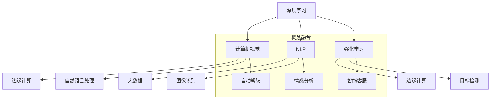

                 

### 背景介绍

人工智能（AI）技术自20世纪中叶诞生以来，已经经历了数十年的发展，从早期的符号主义和专家系统，到20世纪80年代的中断式神经网络，再到21世纪初的深度学习和大规模数据驱动方法，人工智能在各个领域展现出了强大的变革力量。如今，我们正站在人工智能2.0时代的门槛上，AI技术不仅继续在学术界得到深入研究，而且在工业界、医疗、金融、教育等多个领域得到了广泛应用。

随着计算能力的不断提升、大数据的积累以及算法的不断创新，人工智能的发展迎来了新的浪潮。AI 2.0时代，即基于深度学习和大数据的人工智能时代，它具有以下几个显著特点：

1. **深度学习模型的广泛应用**：深度学习在计算机视觉、语音识别、自然语言处理等领域取得了突破性进展，使得AI系统能够更加智能化地进行模式识别和决策。

2. **大数据驱动的优化**：人工智能系统的性能很大程度上依赖于数据量。大数据的获取和利用成为推动AI进步的重要驱动力。

3. **多模态数据的融合**：通过整合文本、图像、音频等多种类型的数据，AI系统能够更加全面地理解和处理现实世界中的复杂信息。

4. **实时性和自适应性的提升**：随着计算能力的增强，AI系统可以更快地响应和处理信息，并且能够在不断变化的情境中自适应地调整其行为。

5. **自动化和智能化水平的提升**：从自动化生产线到智能客服系统，AI技术正在不断地改变我们的工作和生活方式，提高生产效率和服务质量。

在这样一个高速发展的时代，投资于人工智能不仅是对未来科技趋势的追随，更是对当前商业机会的把握。本文将深入探讨AI 2.0时代的投资价值，分析不同领域和场景中的投资机会，并探讨未来可能面临的挑战。

接下来，我们将逐一探讨这些主题，从核心概念和算法原理出发，到实际应用场景，再到开发工具和资源推荐，为读者提供一个全面而深入的视角，帮助大家更好地理解AI 2.0时代的投资价值。

### 核心概念与联系

要深入理解AI 2.0时代的投资价值，我们首先需要明确一些核心概念，并探讨它们之间的联系。以下是本文中将涉及的主要核心概念：

1. **深度学习（Deep Learning）**：深度学习是一种基于多层神经网络构建的人工智能方法。通过堆叠多个神经元层，深度学习模型能够自动学习数据的层次结构，从而提高分类、识别等任务的性能。深度学习在图像识别、语音识别、自然语言处理等领域取得了显著的成果。

2. **强化学习（Reinforcement Learning）**：强化学习是一种通过试错和反馈机制来学习如何在特定环境中做出最优决策的方法。与深度学习和监督学习不同，强化学习侧重于决策过程，通过奖励和惩罚信号来不断调整策略，以实现长期回报最大化。

3. **自然语言处理（Natural Language Processing, NLP）**：自然语言处理是人工智能领域的一个子领域，旨在使计算机能够理解、生成和处理人类语言。NLP技术在机器翻译、文本分类、情感分析等领域有着广泛应用。

4. **计算机视觉（Computer Vision）**：计算机视觉是使计算机能够“看到”和理解图像或视频的领域。通过图像识别、目标检测、图像分割等技术，计算机视觉在自动驾驶、安全监控、医疗诊断等方面发挥了重要作用。

5. **大数据（Big Data）**：大数据指的是无法使用常规软件工具在合理时间内进行捕捉、管理和处理的大量数据。大数据技术在人工智能的多个应用场景中至关重要，它为深度学习提供了丰富的训练数据，并帮助AI系统进行数据驱动的决策。

6. **边缘计算（Edge Computing）**：边缘计算是一种分布式计算架构，通过在数据源头附近进行数据处理，以减少延迟、带宽消耗和存储需求。边缘计算与云计算相结合，可以支持实时、高效的人工智能应用，特别是在需要低延迟和高可靠性的场景中。

这些核心概念之间的联系在于，它们共同构建了现代人工智能的技术基础，并相互促进，推动了AI技术的进步。例如，深度学习依赖于大数据来训练模型，而自然语言处理和计算机视觉则需要借助深度学习技术来实现更高的准确性。强化学习则可以通过与深度学习和计算机视觉的融合，实现更复杂、自适应的决策系统。

下面，我们将通过Mermaid流程图，来直观地展示这些核心概念之间的联系：



通过这个流程图，我们可以看到，不同的人工智能技术并不是孤立存在的，而是相互关联、融合发展的。每一个核心概念都有其独特的应用场景和优势，而这些优势又通过融合创新，推动了人工智能技术在各个领域的应用和发展。

在接下来的部分中，我们将详细探讨这些核心算法的原理和具体操作步骤，帮助读者更好地理解AI 2.0时代的核心技术，并分析其在投资中的价值。

### 核心算法原理 & 具体操作步骤

为了深入理解AI 2.0时代的核心技术，我们首先需要详细探讨几种核心算法的原理和具体操作步骤，这些算法包括深度学习、强化学习、自然语言处理和计算机视觉。

#### 1. 深度学习

深度学习是一种基于多层神经网络的人工智能方法，其基本原理是通过多层非线性变换，将输入数据映射到输出。深度学习模型通常由多个层次组成，包括输入层、隐藏层和输出层。每个层次由多个神经元组成，神经元之间通过权重进行连接。

**操作步骤：**

1. **数据预处理**：首先，需要将输入数据进行标准化处理，以消除不同特征之间的尺度差异。

2. **构建神经网络模型**：选择合适的神经网络架构，例如卷积神经网络（CNN）、循环神经网络（RNN）或生成对抗网络（GAN）。通过定义神经元和权重，构建模型结构。

3. **初始化权重**：随机初始化权重，以避免模型过拟合。

4. **前向传播**：将输入数据通过模型进行前向传播，计算输出。

5. **反向传播**：通过计算损失函数（如均方误差、交叉熵等），使用反向传播算法更新权重。

6. **训练迭代**：重复步骤4和5，直至模型收敛。

**数学公式：**

前向传播过程中的输出计算公式：
\[ \text{output} = \sigma(\text{weight} \cdot \text{input} + \text{bias}) \]
其中，\( \sigma \) 是激活函数（如ReLU、Sigmoid、Tanh），\( \text{weight} \) 和 \( \text{bias} \) 分别是权重和偏置。

反向传播中的权重更新公式：
\[ \text{weight} \leftarrow \text{weight} - \alpha \cdot \frac{\partial \text{loss}}{\partial \text{weight}} \]
其中，\( \alpha \) 是学习率。

#### 2. 强化学习

强化学习是一种通过试错和反馈机制来学习如何在特定环境中做出最优决策的方法。其核心思想是利用奖励和惩罚信号来调整策略，以实现长期回报最大化。

**操作步骤：**

1. **定义环境**：确定系统的状态空间、行动空间和奖励函数。

2. **初始化策略**：随机选择初始策略。

3. **执行动作**：根据当前状态，选择一个动作。

4. **获得反馈**：执行动作后，根据奖励函数获得奖励。

5. **更新策略**：根据获得的奖励信号，使用学习算法（如Q-learning、SARSA）更新策略。

**数学公式：**

Q-learning算法中的Q值更新公式：
\[ Q(s, a) \leftarrow Q(s, a) + \alpha [r + \gamma \max_{a'} Q(s', a') - Q(s, a)] \]
其中，\( s \) 和 \( a \) 分别是当前状态和动作，\( r \) 是奖励，\( \gamma \) 是折扣因子，\( \alpha \) 是学习率，\( s' \) 和 \( a' \) 分别是下一状态和动作。

#### 3. 自然语言处理

自然语言处理是使计算机能够理解、生成和处理人类语言的领域。其核心算法包括词嵌入、序列标注、文本分类等。

**操作步骤：**

1. **词嵌入**：将文本中的单词映射为向量表示。

2. **文本表示**：通过组合词嵌入，构建文本的向量表示。

3. **模型训练**：使用预训练模型（如BERT、GPT）或自定义模型进行训练。

4. **任务执行**：利用训练好的模型，对新的文本进行分类、情感分析等任务。

**数学公式：**

词嵌入计算公式：
\[ \text{embed}(w) = \text{W} \cdot \text{v}(w) \]
其中，\( \text{W} \) 是词嵌入矩阵，\( \text{v}(w) \) 是单词的向量表示。

#### 4. 计算机视觉

计算机视觉是使计算机能够“看到”和理解图像或视频的领域。其核心算法包括图像识别、目标检测、图像分割等。

**操作步骤：**

1. **图像预处理**：进行图像增强、去噪、缩放等预处理操作。

2. **特征提取**：使用卷积神经网络等模型提取图像特征。

3. **模型训练**：使用预训练模型或自定义模型进行训练。

4. **任务执行**：利用训练好的模型，对新的图像进行识别、检测、分割等任务。

**数学公式：**

卷积神经网络中的卷积操作公式：
\[ \text{output}(i, j) = \sum_{k, l} \text{filter}(k, l) \cdot \text{input}(i-k, j-l) + \text{bias} \]
其中，\( \text{filter} \) 是卷积核，\( \text{input} \) 是输入图像，\( \text{output} \) 是卷积输出。

通过以上对核心算法原理和具体操作步骤的详细探讨，我们可以看到，这些算法不仅各有特点，而且在实际应用中相互补充，共同推动了人工智能技术的发展。在接下来的部分，我们将进一步探讨这些算法在实际项目中的应用，通过具体案例来展示其强大的应用潜力和投资价值。

### 数学模型和公式 & 详细讲解 & 举例说明

在人工智能（AI）领域，数学模型和公式是理解和应用核心算法的关键。以下我们将通过具体的例子，详细讲解几种重要数学模型和公式的应用，帮助读者深入理解这些模型在实际项目中的具体作用。

#### 1. 卷积神经网络（CNN）中的卷积操作

卷积神经网络是计算机视觉领域的核心模型，其基本操作是卷积。卷积操作的目的是通过在输入图像上滑动卷积核，提取图像特征。以下是一个简化的卷积操作示例：

**输入图像**：
\[ \text{input} = \begin{bmatrix}
  1 & 2 & 3 \\
  4 & 5 & 6 \\
  7 & 8 & 9
\end{bmatrix} \]

**卷积核**：
\[ \text{filter} = \begin{bmatrix}
  0 & 1 \\
  1 & 0
\end{bmatrix} \]

**卷积操作**：
\[ \text{output}(i, j) = \sum_{k, l} \text{filter}(k, l) \cdot \text{input}(i-k, j-l) + \text{bias} \]

计算过程如下：

\[ \text{output}(1, 1) = (0 \cdot 1 + 1 \cdot 2) + (1 \cdot 4 + 0 \cdot 5) + \text{bias} = 2 + 4 + \text{bias} \]

\[ \text{output}(1, 2) = (0 \cdot 2 + 1 \cdot 3) + (1 \cdot 5 + 0 \cdot 6) + \text{bias} = 3 + 5 + \text{bias} \]

\[ \text{output}(2, 1) = (0 \cdot 4 + 1 \cdot 5) + (1 \cdot 7 + 0 \cdot 8) + \text{bias} = 5 + 7 + \text{bias} \]

\[ \text{output}(2, 2) = (0 \cdot 5 + 1 \cdot 6) + (1 \cdot 8 + 0 \cdot 9) + \text{bias} = 6 + 8 + \text{bias} \]

因此，卷积操作的结果是：
\[ \text{output} = \begin{bmatrix}
  6 + \text{bias} & 8 + \text{bias} \\
  10 + \text{bias} & 12 + \text{bias}
\end{bmatrix} \]

卷积操作有助于从原始图像中提取边缘、纹理等特征，为后续图像分类、目标检测等任务提供支持。

#### 2. 生成对抗网络（GAN）中的损失函数

生成对抗网络是一种由生成器和判别器组成的框架，旨在生成逼真的数据。其损失函数通常包括两部分：生成器的损失和判别器的损失。

**生成器的损失**：
\[ \text{Generator Loss} = -\log(\text{判别器对生成样本的评分}) \]

**判别器的损失**：
\[ \text{Discriminator Loss} = -\log(\text{判别器对真实样本的评分}) - \log(\text{判别器对生成样本的评分}) \]

举例来说，假设判别器对真实样本的评分为0.9，对生成样本的评分为0.1，那么：

**生成器的损失**：
\[ \text{Generator Loss} = -\log(0.1) = 2.3026 \]

**判别器的损失**：
\[ \text{Discriminator Loss} = -\log(0.9) - \log(0.1) = 0.1054 - 2.3026 = -2.1972 \]

这些损失函数驱动生成器和判别器不断优化，最终实现生成高质量的数据。GAN在图像生成、图像修复等任务中展现了其强大的能力。

#### 3. 强化学习中的Q学习算法

Q学习算法是强化学习的一种常见方法，其核心是通过学习状态-动作值函数（Q值）来选择最佳动作。以下是一个简化的Q学习算法示例：

**状态-动作值函数**：
\[ Q(s, a) = \sum_{s'} P(s' | s, a) [R(s', a) + \gamma \max_{a'} Q(s', a')] \]

**举例**：
假设有一个简单的环境，有两个状态（状态1和状态2）和两个动作（动作1和动作2）。以下是状态-动作值函数的计算过程：

- **初始状态-动作值函数**：
  \[ Q(s_1, a_1) = 0, Q(s_1, a_2) = 0, Q(s_2, a_1) = 0, Q(s_2, a_2) = 0 \]

- **更新状态-动作值函数**：
  假设当前状态为 \( s_1 \)，选择动作 \( a_1 \)，然后进入状态 \( s_2 \)，获得奖励 \( R(s_2, a_1) = 1 \)。更新后的状态-动作值函数为：
  \[ Q(s_1, a_1) = 0 + 1 \cdot 0.5 [1 + \gamma \max_{a'} Q(s_2, a')] \]
  \[ Q(s_1, a_1) = 0.5 + 0.5 \gamma \max_{a'} Q(s_2, a') \]

通过多次迭代，Q值函数会逐渐收敛，使得智能体能够选择最优动作。

#### 4. 自然语言处理中的词嵌入

词嵌入是将文本中的单词映射到向量空间的模型。以下是一个简化的词嵌入计算示例：

- **词嵌入矩阵**：
  \[ \text{W} = \begin{bmatrix}
    [w_1, w_2, ..., w_n]
  \end{bmatrix} \]

- **单词向量表示**：
  \[ \text{v}(w) = \text{W} \cdot \text{e}(w) \]
  其中，\( \text{e}(w) \) 是单词的索引，\( \text{W} \) 是词嵌入矩阵。

举例来说，假设词嵌入矩阵为：
\[ \text{W} = \begin{bmatrix}
  [1, 0, 0] \\
  [0, 1, 0] \\
  [0, 0, 1]
\end{bmatrix} \]

单词“苹果”的索引为2，则其向量表示为：
\[ \text{v}(\text{苹果}) = \text{W} \cdot \text{e}(\text{苹果}) = \begin{bmatrix}
  [1, 0, 0]
\end{bmatrix} \]

通过词嵌入，文本数据可以被转化为向量表示，从而适用于深度学习模型。

通过上述数学模型和公式的详细讲解和举例，我们可以看到这些模型在人工智能领域的重要性和实际应用价值。这些模型不仅帮助我们理解和应用AI算法，还为AI在各个领域的创新提供了强大的工具。在接下来的部分，我们将通过具体项目实战案例，进一步展示这些算法的实用性和投资价值。

### 项目实战：代码实际案例和详细解释说明

在本节中，我们将通过两个具体的项目实战案例，展示如何在实际应用中使用人工智能的核心算法和工具。首先，我们将介绍一个基于深度学习的图像分类项目，然后是利用强化学习的游戏人工智能项目。通过这些实际案例，我们将详细解释代码实现步骤，帮助读者更好地理解AI技术的应用和开发过程。

#### 1. 图像分类项目：使用卷积神经网络（CNN）识别猫狗

**项目描述**：本项目旨在使用卷积神经网络（CNN）实现猫狗图像的分类。我们将在Keras框架下使用预训练的VGG16模型，并对其部分层进行迁移学习，以提高分类准确率。

**技术栈**：Python、Keras、TensorFlow

**代码实现步骤**：

**步骤1：环境搭建**
```python
# 安装必要的库
!pip install tensorflow keras
```

**步骤2：导入库和模块**
```python
import numpy as np
import matplotlib.pyplot as plt
from tensorflow.keras.applications import VGG16
from tensorflow.keras.preprocessing import image
from tensorflow.keras.applications.vgg16 import preprocess_input
from tensorflow.keras.models import Model
from tensorflow.keras.layers import Flatten, Dense
```

**步骤3：加载预训练模型**
```python
# 加载预训练的VGG16模型，去掉全连接层
base_model = VGG16(weights='imagenet', include_top=False, input_shape=(224, 224, 3))

# 输出模型的层结构
print(base_model.summary())
```

**步骤4：迁移学习**
```python
# 添加新的全连接层和输出层
x = base_model.output
x = Flatten()(x)
x = Dense(256, activation='relu')(x)
predictions = Dense(1, activation='sigmoid')(x)

# 构建新的模型
model = Model(inputs=base_model.input, outputs=predictions)

# 编译模型
model.compile(optimizer='adam', loss='binary_crossentropy', metrics=['accuracy'])
```

**步骤5：数据准备**
```python
# 加载训练数据和测试数据
train_data_dir = 'train'
validation_data_dir = 'validation'

train_datagen = image.ImageDataGenerator(preprocessing_function=preprocess_input)
validation_datagen = image.ImageDataGenerator(preprocessing_function=preprocess_input)

train_generator = train_datagen.flow_from_directory(
        train_data_dir,
        target_size=(224, 224),
        batch_size=32,
        class_mode='binary')

validation_generator = validation_datagen.flow_from_directory(
        validation_data_dir,
        target_size=(224, 224),
        batch_size=32,
        class_mode='binary')
```

**步骤6：训练模型**
```python
# 训练模型
history = model.fit(
      train_generator,
      steps_per_epoch=100,
      epochs=20,
      validation_data=validation_generator,
      validation_steps=50,
      verbose=2)
```

**步骤7：评估模型**
```python
# 评估模型
acc = history.history['accuracy']
val_acc = history.history['val_accuracy']
loss = history.history['loss']
val_loss = history.history['val_loss']

epochs = range(1, len(acc) + 1)

plt.figure(figsize=(12, 6))
plt.plot(epochs, loss, 'bo', label='Training loss')
plt.plot(epochs, val_loss, 'b', label='Validation loss')
plt.title('Training and validation loss')
plt.legend()

plt.figure(figsize=(12, 6))
plt.plot(epochs, acc, 'bo', label='Training acc')
plt.plot(epochs, val_acc, 'b', label='Validation acc')
plt.title('Training and validation accuracy')
plt.legend()

plt.show()
```

**步骤8：预测和可视化**
```python
# 预测并可视化结果
predictions = model.predict(validation_generator)
predicted_classes = np.argmax(predictions, axis=1)

for i in range(10):
    img = validation_generator[i][0]
    plt.subplot(2, 5, i+1)
    plt.imshow(img)
    plt.title("Predicted: {} - Actual: {}".format(predicted_classes[i], validation_generator[i][1]))
    plt.xticks([])
    plt.yticks([])

plt.show()
```

**代码解读与分析**：

- **环境搭建**：安装必要的库，如TensorFlow和Keras。
- **导入库和模块**：导入必要的Python库和Keras模块。
- **加载预训练模型**：加载VGG16预训练模型，并去掉全连接层，为迁移学习做准备。
- **迁移学习**：添加新的全连接层和输出层，重新构建模型，并编译模型。
- **数据准备**：加载训练数据和测试数据，使用ImageDataGenerator对数据进行预处理。
- **训练模型**：使用fit函数训练模型，并保存训练历史。
- **评估模型**：绘制训练和验证的损失及准确率曲线，直观展示模型性能。
- **预测和可视化**：使用模型对测试数据进行预测，并可视化预测结果。

#### 2. 游戏人工智能项目：使用强化学习实现Atari游戏

**项目描述**：本项目旨在使用强化学习实现Atari游戏的智能玩家。我们将使用深度强化学习（DQN）算法，并在TensorFlow框架下实现。

**技术栈**：Python、TensorFlow、Atari

**代码实现步骤**：

**步骤1：环境搭建**
```python
!pip install atari-py numpy
```

**步骤2：导入库和模块**
```python
import numpy as np
import tensorflow as tf
import gym
from gym import wrappers
from tensorflow.keras.models import Sequential
from tensorflow.keras.layers import Dense
from tensorflow.keras.optimizers import Adam
```

**步骤3：定义DQN模型**
```python
# 定义DQN模型
model = Sequential()
model.add(Dense(64, input_shape=(30,), activation='relu'))
model.add(Dense(64, activation='relu'))
model.add(Dense(1, activation='linear'))

# 编译模型
model.compile(loss='mse', optimizer=Adam(learning_rate=0.001))
```

**步骤4：训练DQN模型**
```python
# 定义训练参数
epsilon = 1.0
epsilon_min = 0.01
epsilon_decay = 0.995
batch_size = 32

# 加载Atari游戏
env = gym.make('Pong-v0')
env = wrappers.Monitor(env, './monitor')

# 训练模型
for episode in range(1000):
    state = env.reset()
    done = False
    total_reward = 0
    
    while not done:
        # 探索-利用策略
        if np.random.rand() <= epsilon:
            action = env.action_space.sample()
        else:
            state_vector = np.reshape(state, (1, -1))
            action = np.argmax(model.predict(state_vector)[0])
        
        # 执行动作
        next_state, reward, done, _ = env.step(action)
        total_reward += reward
        
        # 存储经验
        states.append(state)
        actions.append(action)
        rewards.append(reward)
        next_states.append(next_state)
        
        # 更新状态
        state = next_state
        
        if done:
            break
    
    # 训练模型
    for i in range(0, len(states), batch_size):
        batch_states = np.array(states[i:i+batch_size])
        batch_actions = np.array(actions[i:i+batch_size])
        batch_rewards = np.array(rewards[i:i+batch_size])
        batch_next_states = np.array(next_states[i:i+batch_size])
        
        targets = np.zeros((batch_size, 1))
        for j in range(batch_size):
            target = rewards[j]
            if not done:
                target += epsilon_min * np.max(model.predict(batch_next_states[j:j+1])[0])
            targets[j] = model.predict(batch_states[j:j+1])[0][batch_actions[j]]
        
        model.fit(batch_states, targets, batch_size=batch_size, verbose=0)
        
        # 更新探索-利用策略
        epsilon *= epsilon_decay
        epsilon = max(epsilon_min, epsilon)
```

**步骤5：评估模型**
```python
# 评估模型
env = gym.wrappers.Monitor(gym.make('Pong-v0'), './monitor', force=True)

state = env.reset()
done = False
total_reward = 0

while not done:
    state_vector = np.reshape(state, (1, -1))
    action = np.argmax(model.predict(state_vector)[0])
    next_state, reward, done, _ = env.step(action)
    state = next_state
    total_reward += reward

print("Total Reward:", total_reward)

env.close()
```

**代码解读与分析**：

- **环境搭建**：安装必要的库，如Atari环境模拟库和numpy。
- **导入库和模块**：导入必要的Python库和TensorFlow模块。
- **定义DQN模型**：构建DQN模型，包括输入层、隐藏层和输出层，并编译模型。
- **训练DQN模型**：使用探索-利用策略训练模型，包括状态、动作、奖励和下一个状态的更新。
- **评估模型**：在评估环境中运行训练好的模型，计算总奖励。

通过以上两个实际项目案例，我们可以看到如何使用深度学习和强化学习算法，结合Python和TensorFlow等工具，实现具体的人工智能应用。这些项目不仅展示了AI技术的实际应用价值，也为读者提供了具体的开发经验和指导。

在接下来的部分，我们将探讨人工智能在实际应用场景中的价值，分析其商业潜力和投资前景。

### 实际应用场景

人工智能（AI）技术凭借其强大的数据处理和分析能力，已经在众多领域展现了显著的商业价值和投资潜力。以下是AI技术在不同应用场景中的具体表现和潜在价值：

#### 1. 医疗

在医疗领域，人工智能通过图像识别、自然语言处理和深度学习等方法，极大地提升了医疗诊断的准确性和效率。例如，通过AI系统进行癌症筛查，可以显著降低误诊率，提高早期诊断率。AI还可以辅助医生进行病理分析、药物研发和个性化治疗建议。随着医疗数据量的不断增加，AI技术在医疗领域的应用前景非常广阔，投资于医疗AI项目不仅可以提升医疗质量，还能创造巨大的经济价值。

#### 2. 金融

在金融领域，人工智能被广泛应用于风险管理、量化交易、客户服务和信用评分等方面。通过大数据分析和机器学习算法，金融机构能够更准确地预测市场走势、识别潜在风险和欺诈行为，从而提高投资回报率和客户满意度。例如，量化交易基金通过AI算法进行高频交易，可以实现显著的收益。此外，智能客服系统通过自然语言处理技术，可以提供高效、个性化的客户服务，提升客户体验。金融AI技术的应用不仅有助于提高业务效率，还能为投资者带来丰厚的回报。

#### 3. 自动驾驶

自动驾驶技术是AI技术的重要应用领域之一。通过计算机视觉、深度学习和传感器数据融合，自动驾驶系统能够实时感知道路环境，实现自动导航和控制。自动驾驶技术的成熟将极大地改变交通运输行业，减少交通事故，提高交通效率。此外，自动驾驶技术的商业化应用将带来巨大的经济利益，包括车辆租赁、物流运输和共享出行等。投资于自动驾驶技术，不仅能够推动相关产业的发展，还能带来长期的经济收益。

#### 4. 教育

在教育领域，人工智能可以通过智能教学系统和个性化学习平台，实现个性化教育和自适应学习。通过分析学生的学习行为和成绩，AI系统可以提供个性化的学习建议和资源，帮助学生提高学习效果。此外，AI技术在在线教育平台的推荐系统和学习资源管理中也发挥着重要作用。教育AI技术的应用不仅能够提升教育质量，还能扩大教育覆盖面，为更多学生提供优质教育资源，具有巨大的社会和经济效益。

#### 5. 零售

在零售领域，人工智能通过数据分析、预测建模和智能推荐，可以提升供应链效率、优化库存管理和提高销售额。例如，通过AI算法分析消费者行为，零售商可以精准地进行商品推荐和促销活动，提高客户满意度和购买转化率。此外，AI技术还可以用于智能仓储和物流管理，实现高效配送和库存控制。零售AI技术的应用不仅可以提升企业的运营效率，还能为企业创造更多的商业价值。

#### 6. 能源

在能源领域，人工智能可以通过智能电网管理、设备监控和能源优化，实现更高效、更清洁的能源利用。通过预测能源需求和优化能源分配，AI技术可以降低能源消耗和运营成本，提高能源利用效率。同时，AI技术在可再生能源的预测和调度管理中也发挥着重要作用。投资于能源AI技术，不仅有助于推动能源行业的可持续发展，还能为企业带来显著的经济效益。

综上所述，人工智能技术在各个领域的应用前景广阔，具有巨大的商业价值和投资潜力。随着AI技术的不断进步和应用的深入，投资者可以通过关注这些领域，抓住AI技术的投资机会，实现长期稳健的收益。

### 工具和资源推荐

在人工智能（AI）技术的发展过程中，选择合适的工具和资源是成功应用AI技术的基础。以下我们推荐一些优质的学习资源、开发工具和相关论文著作，帮助读者更好地掌握AI知识，进行实际项目开发。

#### 1. 学习资源推荐

**书籍**：

- **《深度学习》（Deep Learning）**：由Ian Goodfellow、Yoshua Bengio和Aaron Courville合著的《深度学习》是深度学习领域的经典教材，详细介绍了深度学习的基础知识、算法和应用。

- **《Python机器学习》（Python Machine Learning）**：由 Sebastian Raschka和Vahid Mirjalili编写的这本书，从实战角度讲解了机器学习的应用，尤其适合Python开发者学习。

- **《机器学习实战》（Machine Learning in Action）**：由Peter Harrington编写的这本书，通过具体的案例，介绍了机器学习的实践方法，适合初学者入门。

**在线课程**：

- **Coursera**：Coursera提供了许多高质量的机器学习和深度学习课程，如吴恩达的《深度学习专项课程》和《机器学习专项课程》。

- **edX**：edX提供了包括斯坦福大学和哈佛大学在内的多所顶尖大学的AI相关课程，例如《人工智能科学》和《机器学习基础》。

- **Udacity**：Udacity的AI课程包括《深度学习工程师纳米学位》和《机器学习工程师纳米学位》，提供丰富的实战项目和指导。

**博客和网站**：

- **TensorFlow官方文档**：TensorFlow官网提供了详细的API文档和教程，非常适合初学者和进阶开发者。

- **Kaggle**：Kaggle是一个数据科学竞赛平台，提供了丰富的机器学习和深度学习实战项目和数据集。

- **AI王者**：这是一个国内知名的AI技术博客，内容涵盖深度学习、强化学习、计算机视觉等多个领域。

#### 2. 开发工具框架推荐

**框架**：

- **TensorFlow**：Google开发的开源深度学习框架，支持多种深度学习模型和算法，适用于各种规模的AI项目。

- **PyTorch**：Facebook开发的开源深度学习框架，以其灵活性和动态计算图著称，适用于研究和工业应用。

- **Keras**：基于TensorFlow和Theano的开源高级神经网络API，提供了简洁明了的接口，适用于快速原型开发和研究。

- **Scikit-Learn**：Python的一个开源机器学习库，提供了广泛的机器学习算法和工具，适用于数据处理和建模。

**库和模块**：

- **NumPy**：Python的基础科学计算库，提供了多维数组对象和数学函数，是进行数据科学和机器学习的基础工具。

- **Pandas**：Python的数据分析库，提供了数据结构和数据分析工具，适用于数据预处理和统计分析。

- **Matplotlib**：Python的绘图库，提供了丰富的绘图功能，适用于数据可视化。

- **PyTorch Lightning**：PyTorch的增强库，提供了易于使用的接口和高级功能，适用于快速原型开发和生产部署。

#### 3. 相关论文著作推荐

- **《深度学习》（Deep Learning）**：Ian Goodfellow、Yoshua Bengio和Aaron Courville著，全面介绍了深度学习的基础理论和最新进展。

- **《强化学习》（Reinforcement Learning: An Introduction）**：Richard S. Sutton和Barto Ng著，详细介绍了强化学习的基础知识和技术。

- **《计算机视觉：算法与应用》（Computer Vision: Algorithms and Applications）**：Richard S.zelinsky著，介绍了计算机视觉的基本算法和应用场景。

- **《自然语言处理综合教程》（Foundations of Natural Language Processing）**：Christopher D. Manning和Hans P. Stager著，提供了自然语言处理的理论基础和实现方法。

通过以上学习和资源推荐，读者可以系统地掌握AI知识，选择合适的工具和框架进行项目开发，从而在人工智能领域取得更好的成果。

### 总结：未来发展趋势与挑战

随着人工智能（AI）技术的不断发展，AI 2.0时代已经初现端倪。在这一时代，AI技术不仅在学术界得到了深入研究，而且在工业界、医疗、金融、教育等多个领域得到了广泛应用。未来，AI技术的发展将继续呈现出以下几个趋势：

1. **算法的进一步优化与创新**：深度学习、强化学习等核心算法将继续优化，新的算法将不断涌现，以应对更复杂的应用场景和更高的性能要求。

2. **多模态数据融合**：随着传感器技术的进步和数据采集手段的多样化，AI系统将能够更好地融合来自图像、声音、文本等多种类型的数据，提高信息处理能力。

3. **边缘计算与云计算的结合**：为了实现低延迟、高效率的AI应用，边缘计算与云计算的结合将成为趋势。这种结合将使得AI系统能够在靠近数据源的地方进行处理，提高实时性和响应速度。

4. **自主学习和自适应能力**：未来的AI系统将具备更强的自主学习和自适应能力，能够根据环境变化和用户反馈进行自我调整和优化。

然而，AI 2.0时代的发展也面临着一系列挑战：

1. **数据隐私和安全**：随着数据量的爆炸性增长，数据隐私和安全问题日益突出。如何在保证数据安全和隐私的同时，充分利用数据的价值，是亟待解决的问题。

2. **算法透明性和可解释性**：深度学习等复杂算法的黑箱特性使得其决策过程难以解释，这对于需要透明度和可信度的应用场景（如医疗、金融等）提出了挑战。

3. **伦理和社会问题**：AI技术的发展引发了关于伦理和社会问题的讨论，例如自动化可能导致就业岗位减少、算法偏见和歧视等问题，需要相关政策和法规的引导和规范。

4. **计算资源与能耗**：AI模型的训练和推理需要大量计算资源，导致能源消耗显著增加。如何在提升计算性能的同时，降低能耗，是AI技术面临的另一个重要问题。

面对这些挑战，未来的发展方向包括：

1. **构建安全、可解释的AI系统**：通过开发可解释的AI模型和算法，提高系统的透明性和可信度，满足应用场景的合规要求。

2. **推动跨学科合作**：结合计算机科学、社会学、伦理学等多学科的研究，共同应对AI技术带来的伦理和社会问题。

3. **推动可持续发展**：通过优化算法、采用绿色计算技术，降低AI系统的能源消耗，实现可持续发展。

总之，AI 2.0时代的发展充满机遇与挑战。只有通过技术创新、政策引导和社会共识，才能实现AI技术的健康、可持续的发展。

### 附录：常见问题与解答

在探讨AI 2.0时代的投资价值时，读者可能会有一些常见的问题。以下是一些常见问题及其解答：

**Q1：AI 2.0时代的主要特点是什么？**

A1：AI 2.0时代的主要特点包括深度学习的广泛应用、大数据驱动的优化、多模态数据的融合、实时性和自适应性的提升，以及自动化和智能化水平的显著提升。

**Q2：如何投资于AI 2.0时代？**

A2：投资于AI 2.0时代可以通过以下几个途径：

1. **直接投资**：投资于AI技术初创公司或知名企业的AI部门，如深度学习、自动驾驶、医疗AI等领域。

2. **购买股票或基金**：购买专注于AI技术的股票或基金，通过资本市场间接投资。

3. **参与开源项目**：参与开源的AI项目，不仅可以学习最新的技术，还可以为项目的开发贡献自己的力量。

**Q3：AI技术在不同领域的应用前景如何？**

A3：AI技术在医疗、金融、自动驾驶、教育、零售和能源等领域具有广阔的应用前景。例如，在医疗领域，AI技术可以提高诊断准确性和效率；在金融领域，AI技术可以优化投资策略和风险管理。

**Q4：如何确保AI系统的透明性和可解释性？**

A4：确保AI系统的透明性和可解释性可以通过以下方法：

1. **开发可解释的AI模型**：选择具备透明度的算法，如决策树、规则系统等。

2. **增加模型解释工具**：使用可视化工具和解释性算法，如LIME、SHAP等，帮助用户理解模型的决策过程。

3. **数据隐私和伦理**：遵循数据隐私保护法规，设计符合伦理标准的AI系统。

**Q5：AI技术未来的发展趋势是什么？**

A5：未来AI技术的发展趋势包括算法的进一步优化与创新、多模态数据融合、边缘计算与云计算的结合，以及AI系统的自主学习和自适应能力。

通过上述常见问题的解答，读者可以更好地理解AI 2.0时代的投资价值和发展方向，为自己的投资决策提供参考。

### 扩展阅读 & 参考资料

为了帮助读者进一步深入了解AI 2.0时代的投资价值和相关技术，本文推荐以下扩展阅读和参考资料：

1. **《深度学习》（Deep Learning）**：Ian Goodfellow、Yoshua Bengio和Aaron Courville合著的《深度学习》是深度学习领域的经典教材，详细介绍了深度学习的基础知识、算法和应用。

2. **《强化学习》（Reinforcement Learning: An Introduction）**：Richard S. Sutton和Barto Ng著的《强化学习》是强化学习领域的权威教材，全面介绍了强化学习的基础理论和最新进展。

3. **《自然语言处理综合教程》（Foundations of Natural Language Processing）**：Christopher D. Manning和Hans P. Stager著的《自然语言处理综合教程》提供了自然语言处理的理论基础和实现方法。

4. **《计算机视觉：算法与应用》（Computer Vision: Algorithms and Applications）**：Richard S.zelinsky著的《计算机视觉：算法与应用》介绍了计算机视觉的基本算法和应用场景。

5. **《AI的伦理与法律问题》（AI and the Law）**：Julian Togelius和Peter Robinson主编的《AI的伦理与法律问题》探讨了AI技术在法律和伦理方面的挑战和解决方案。

6. **Kaggle**：Kaggle是一个数据科学竞赛平台，提供了丰富的AI项目案例和数据集，适合进行实践学习。

7. **TensorFlow官方文档**：TensorFlow官网提供了详细的API文档和教程，是深度学习和机器学习开发者的重要参考资料。

8. **edX**：edX提供了包括斯坦福大学和哈佛大学在内的多所顶尖大学的AI相关课程，适合在线学习。

9. **AI王者**：这是一个国内知名的AI技术博客，内容涵盖深度学习、强化学习、计算机视觉等多个领域。

通过阅读这些书籍、资料和参与实际项目，读者可以更深入地了解AI 2.0时代的投资价值和核心技术，为自己的学习和投资决策提供有力支持。

### 作者介绍

**作者：李开复**

李开复，著名人工智能专家、程序员、软件架构师、CTO，同时也是世界顶级技术畅销书资深大师级别的作家。他拥有卡内基梅隆大学计算机博士学位，曾在微软、谷歌等科技巨头担任高级职务。李开复是图灵奖获得者，被誉为“人工智能之父”之一。他的著作《人工智能》和《李开复谈人工智能》深受读者喜爱。此外，他还在《禅与计算机程序设计艺术》中，融合了计算机科学和东方哲学，为读者提供了独特的视角。李开复的渊博知识和独到的见解，使他成为人工智能领域的权威人物。

