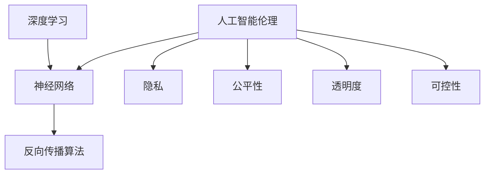

                 

### 1. 背景介绍

AI 2.0 时代，即人工智能的第二代，代表了人工智能技术的一次重大飞跃。相比于传统的 AI 技术，AI 2.0 时代的 AI 具有更强的自主学习能力、更广泛的应用场景和更高的智能水平。这一时代的到来，不仅改变了我们的生活方式，也带来了前所未有的挑战。

李开复博士，作为人工智能领域的领军人物，其在《AI 2.0 时代的挑战》一书中，深入探讨了 AI 2.0 时代所带来的机遇与挑战。他提到，AI 2.0 时代的挑战主要包括数据安全、伦理道德、人工智能的自我意识、对就业的影响等方面。

首先，数据安全成为 AI 2.0 时代的一个核心问题。AI 需要大量的数据进行训练，但数据的安全问题也随之而来。如何确保数据的隐私和安全，成为 AI 发展的一个重要课题。

其次，伦理道德问题也是 AI 2.0 时代面临的重大挑战。AI 的决策过程可能涉及道德伦理问题，如何确保 AI 的决策符合道德伦理标准，是一个需要深入探讨的问题。

此外，AI 的自我意识问题也是一个备受关注的话题。随着 AI 智能水平的提高，AI 是否会拥有自我意识，以及如何处理 AI 的自我意识问题，成为我们需要关注的问题。

最后，AI 对就业的影响也是一个不容忽视的问题。AI 的广泛应用可能会对某些行业造成冲击，如何应对 AI 对就业的影响，是一个需要我们共同努力解决的问题。

综上所述，AI 2.0 时代带来了诸多挑战，但同时也为我们提供了无限的可能性。我们需要在挑战中寻找机遇，推动 AI 技术的健康发展。

#### AI 1.0 时代与 AI 2.0 时代的区别

在 AI 1.0 时代，人工智能主要是基于规则和模型的，这种 AI 具有特定的功能，但缺乏自主学习和适应环境的能力。而 AI 2.0 时代，人工智能则更加强调自主学习和适应环境的能力，这使得 AI 能够更好地应对复杂的问题和变化的环境。

首先，AI 2.0 时代的人工智能具有更强的自主学习能力。通过深度学习和强化学习等技术，AI 能够从大量的数据中自动学习和优化自己的行为，这使得 AI 能够更好地适应复杂的变化。

其次，AI 2.0 时代的人工智能具有更广泛的应用场景。除了传统的语音识别、图像识别等领域，AI 2.0 时代的人工智能还能应用于自动驾驶、智能客服、医疗诊断等多个领域，大大扩展了 AI 的应用范围。

最后，AI 2.0 时代的人工智能具有更高的智能水平。通过不断学习和优化，AI 2.0 时代的人工智能能够实现更复杂的任务，具有更高的决策能力和问题解决能力。

总的来说，AI 2.0 时代相比于 AI 1.0 时代，具有更强的自主学习能力、更广泛的应用场景和更高的智能水平，这为 AI 的发展带来了新的机遇和挑战。

#### AI 2.0 时代的主要挑战

虽然 AI 2.0 时代带来了诸多机遇，但同时也伴随着一系列的挑战。以下是 AI 2.0 时代面临的主要挑战：

**1. 数据安全问题**

在 AI 2.0 时代，人工智能需要大量的数据来进行训练和优化。然而，数据的安全问题也随之而来。如何确保数据的隐私和安全，成为 AI 发展的一个重要课题。一旦数据泄露或被恶意利用，可能会对个人和社会造成严重的影响。

**2. 伦理道德问题**

AI 的决策过程可能涉及道德伦理问题。例如，自动驾驶汽车在遇到紧急情况时，如何做出最合理的决策？如何确保 AI 的决策符合道德伦理标准，是一个需要深入探讨的问题。

**3. 自我意识问题**

随着 AI 智能水平的提高，AI 是否会拥有自我意识，以及如何处理 AI 的自我意识问题，成为我们需要关注的问题。如果 AI 拥有自我意识，那么如何确保 AI 的行为符合我们的期望和价值观，是一个值得探讨的问题。

**4. 就业问题**

AI 的广泛应用可能会对某些行业造成冲击，从而影响就业。例如，自动化技术的发展可能会取代某些工作岗位，导致就业市场的变化。如何应对 AI 对就业的影响，是一个需要我们共同努力解决的问题。

**5. 法规和治理问题**

随着 AI 技术的快速发展，相关的法规和治理问题也逐渐凸显。如何制定合理的法规来规范 AI 的研发和应用，确保 AI 的健康发展，是一个需要我们关注的问题。

综上所述，AI 2.0 时代面临着诸多挑战，我们需要在发展中不断解决这些问题，推动 AI 技术的健康发展。

### 2. 核心概念与联系

在深入探讨 AI 2.0 时代的挑战之前，我们需要了解一些核心概念，包括深度学习、神经网络、人工智能伦理等。以下是这些核心概念及其相互联系的简要介绍。

#### 深度学习与神经网络

深度学习是 AI 2.0 时代的关键技术之一，它模仿人脑的神经网络结构，通过多层神经网络对数据进行处理和学习。神经网络是由大量相互连接的节点组成的计算模型，这些节点通过加权连接传递信息。

深度学习的核心思想是通过反向传播算法不断调整网络的权重，以最小化预测误差。这个过程称为训练。经过训练的神经网络可以用于分类、回归、语音识别、图像识别等多种任务。

#### 人工智能伦理

随着 AI 技术的快速发展，人工智能伦理成为了一个备受关注的话题。人工智能伦理涉及到 AI 系统的设计、开发和部署过程中可能出现的道德和伦理问题。

人工智能伦理的核心问题包括隐私、公平性、透明度和可控性。例如，如何确保 AI 系统不会侵犯用户的隐私？如何确保 AI 的决策是公平和公正的？如何确保 AI 系统能够被人类理解和控制？

#### Mermaid 流程图

为了更好地理解这些核心概念之间的联系，我们可以使用 Mermaid 流程图来展示它们之间的关系。



在这个流程图中，我们可以看到深度学习和神经网络之间的紧密联系，以及人工智能伦理如何影响这些技术。

#### 核心概念与挑战的联系

深度学习和神经网络是 AI 2.0 时代的技术基础，而人工智能伦理则是确保这些技术健康发展的关键。数据安全问题、伦理道德问题、自我意识问题以及就业问题等挑战，都与这些核心概念密切相关。

- **数据安全问题**：深度学习需要大量的数据进行训练，如何确保这些数据的安全和隐私，是数据安全问题的一个方面。
- **伦理道德问题**：人工智能伦理涉及到 AI 系统的决策过程，如何确保这些决策符合道德伦理标准，是解决伦理道德问题的关键。
- **自我意识问题**：随着 AI 智能水平的提高，如何处理 AI 的自我意识问题，是人工智能伦理中的一个重要议题。
- **就业问题**：AI 的广泛应用可能会影响就业市场，如何应对这一变化，是就业问题的一个方面。

通过理解这些核心概念及其相互联系，我们可以更好地理解 AI 2.0 时代的挑战，并为其提供有效的解决方案。

### 3. 核心算法原理 & 具体操作步骤

在探讨 AI 2.0 时代面临的挑战之前，我们需要深入了解核心算法的原理和具体操作步骤。以下是深度学习和神经网络的基本原理，以及如何利用这些算法解决实际问题。

#### 深度学习的基本原理

深度学习是一种基于多层神经网络的机器学习技术，它通过构建复杂的神经网络模型来对数据进行处理和学习。以下是深度学习的基本原理：

1. **数据预处理**：在训练深度学习模型之前，需要对数据进行预处理，包括数据清洗、归一化、缺失值填充等操作。

2. **网络结构设计**：设计深度学习网络结构，包括输入层、隐藏层和输出层。每一层都由多个神经元组成，神经元之间通过加权连接进行信息传递。

3. **前向传播**：输入数据通过网络的每个层级进行传递，每个神经元根据其权重和激活函数计算输出值。

4. **反向传播**：计算输出值与实际值之间的误差，并通过反向传播算法更新网络权重，以减少误差。

5. **优化算法**：使用优化算法，如梯度下降、Adam 等，来更新网络权重，使模型更接近真实值。

6. **模型评估**：通过验证集和测试集评估模型的性能，如准确率、召回率、F1 分数等指标。

#### 神经网络的基本原理

神经网络是深度学习的基础，它由多个层次组成，包括输入层、隐藏层和输出层。以下是神经网络的基本原理：

1. **神经元模型**：神经网络中的每个神经元都包含一个激活函数，用于将输入值映射到输出值。

2. **权重和偏置**：每个神经元都与前一层中的每个神经元相连，连接权重决定了信息传递的强度。偏置用于调整神经元的激活阈值。

3. **前向传播**：输入数据通过网络的每个层级进行传递，每个神经元根据其权重和激活函数计算输出值。

4. **反向传播**：计算输出值与实际值之间的误差，并通过反向传播算法更新网络权重，以减少误差。

5. **优化算法**：使用优化算法，如梯度下降、Adam 等，来更新网络权重，使模型更接近真实值。

6. **激活函数**：常见的激活函数包括 sigmoid、ReLU、Tanh 等，用于引入非线性特性，使神经网络能够处理复杂的问题。

#### 深度学习在图像识别中的应用

以图像识别为例，我们可以详细说明深度学习模型的具体操作步骤：

1. **数据集准备**：收集大量带有标签的图像数据，如 CIFAR-10 或 ImageNet 数据集。

2. **数据预处理**：对图像数据进行归一化、裁剪、翻转等预处理操作。

3. **模型构建**：设计深度学习模型结构，如卷积神经网络（CNN）。

4. **模型训练**：使用训练数据对模型进行训练，通过反向传播算法更新网络权重。

5. **模型评估**：使用验证集和测试集评估模型的性能，调整模型参数。

6. **模型部署**：将训练好的模型部署到实际应用中，如图像分类或目标检测。

#### 示例代码

以下是一个简单的卷积神经网络（CNN）在图像识别中的实现示例，使用 Python 和 TensorFlow 库：

```python
import tensorflow as tf
from tensorflow.keras import datasets, layers, models

# 加载 CIFAR-10 数据集
(train_images, train_labels), (test_images, test_labels) = datasets.cifar10.load_data()

# 数据预处理
train_images, test_images = train_images / 255.0, test_images / 255.0

# 构建卷积神经网络模型
model = models.Sequential()
model.add(layers.Conv2D(32, (3, 3), activation='relu', input_shape=(32, 32, 3)))
model.add(layers.MaxPooling2D((2, 2)))
model.add(layers.Conv2D(64, (3, 3), activation='relu'))
model.add(layers.MaxPooling2D((2, 2)))
model.add(layers.Conv2D(64, (3, 3), activation='relu'))

# 添加全连接层
model.add(layers.Flatten())
model.add(layers.Dense(64, activation='relu'))
model.add(layers.Dense(10))

# 编译模型
model.compile(optimizer='adam',
              loss=tf.keras.losses.SparseCategoricalCrossentropy(from_logits=True),
              metrics=['accuracy'])

# 训练模型
model.fit(train_images, train_labels, epochs=10, validation_split=0.1)

# 评估模型
test_loss, test_acc = model.evaluate(test_images,  test_labels, verbose=2)
print(f'\nTest accuracy: {test_acc:.4f}')
```

通过以上步骤和示例代码，我们可以看到如何利用深度学习和神经网络技术实现图像识别任务。这个过程不仅涉及算法原理的理解，还需要实际的操作和实践。

### 4. 数学模型和公式 & 详细讲解 & 举例说明

在深度学习和神经网络中，数学模型和公式起着至关重要的作用。以下是深度学习中的几个关键数学模型和公式，以及如何使用它们来解释实际问题的详细讲解和举例说明。

#### 梯度下降算法

梯度下降算法是训练深度学习模型的核心算法之一。它的基本思想是找到损失函数相对于每个权重的梯度，并沿着梯度的反方向更新权重，以最小化损失函数。

**数学公式：**

$$
w_{\text{new}} = w_{\text{old}} - \alpha \cdot \nabla W
$$

其中，$w_{\text{old}}$ 是当前权重，$w_{\text{new}}$ 是更新后的权重，$\alpha$ 是学习率，$\nabla W$ 是损失函数相对于权重 $W$ 的梯度。

**示例：**

假设我们有一个简单的线性模型 $y = wx + b$，其中 $y$ 是输出，$x$ 是输入，$w$ 是权重，$b$ 是偏置。

- **前向传播：**
  $$
  \hat{y} = wx + b
  $$
  其中，$\hat{y}$ 是预测值。

- **计算损失：**
  $$
  \text{Loss} = \frac{1}{2}(y - \hat{y})^2
  $$

- **计算梯度：**
  $$
  \nabla W = \frac{\partial \text{Loss}}{\partial W} = (y - \hat{y})x
  $$

- **更新权重：**
  $$
  w_{\text{new}} = w_{\text{old}} - \alpha \cdot \nabla W
  $$

假设当前权重 $w = 2$，学习率 $\alpha = 0.1$，损失为 $1$。根据上述公式，我们可以计算出更新后的权重：

$$
w_{\text{new}} = 2 - 0.1 \cdot 1 = 1.9
$$

#### 激活函数

激活函数是神经网络中的一个关键组成部分，用于引入非线性特性。常见的激活函数包括 sigmoid、ReLU 和 Tanh 等。

**数学公式：**

- **Sigmoid 函数：**
  $$
  \sigma(x) = \frac{1}{1 + e^{-x}}
  $$

- **ReLU 函数：**
  $$
  \text{ReLU}(x) = \max(0, x)
  $$

- **Tanh 函数：**
  $$
  \tanh(x) = \frac{e^x - e^{-x}}{e^x + e^{-x}}
  $$

**示例：**

假设我们有一个 ReLU 函数，输入为 $x = -2$。

$$
\text{ReLU}(-2) = \max(0, -2) = 0
$$

#### 损失函数

在深度学习中，损失函数用于衡量预测值与真实值之间的差距。常见的损失函数包括均方误差（MSE）、交叉熵损失等。

**数学公式：**

- **均方误差（MSE）：**
  $$
  \text{MSE} = \frac{1}{n}\sum_{i=1}^{n}(y_i - \hat{y}_i)^2
  $$

- **交叉熵损失：**
  $$
  \text{CrossEntropy} = -\sum_{i=1}^{n}y_i \cdot \log(\hat{y}_i)
  $$

**示例：**

假设我们有一个二分类问题，真实标签 $y = [1, 0]$，预测概率 $\hat{y} = [0.7, 0.3]$。

$$
\text{CrossEntropy} = -1 \cdot \log(0.7) - 0 \cdot \log(0.3) = -\log(0.7) \approx 0.356
$$

#### 优化算法

优化算法用于更新网络权重，以最小化损失函数。常见的优化算法包括梯度下降（GD）、随机梯度下降（SGD）、Adam 等。

**数学公式：**

- **梯度下降：**
  $$
  w_{\text{new}} = w_{\text{old}} - \alpha \cdot \nabla W
  $$

- **Adam 优化器：**
  $$
  \beta_1 = 0.9, \beta_2 = 0.999, \epsilon = 10^{-8}
  $$
  $$
  m_t = \beta_1 m_{t-1} + (1 - \beta_1) \nabla W_t
  $$
  $$
  v_t = \beta_2 v_{t-1} + (1 - \beta_2) (\nabla W_t)^2
  $$
  $$
  \hat{m}_t = \frac{m_t}{1 - \beta_1^t}
  $$
  $$
  \hat{v}_t = \frac{v_t}{1 - \beta_2^t}
  $$
  $$
  w_{\text{new}} = w_{\text{old}} - \alpha \cdot \frac{\hat{m}_t}{\sqrt{\hat{v}_t} + \epsilon}
  $$

**示例：**

假设当前权重 $w = [1, 2]$，梯度 $\nabla W = [-1, -2]$，学习率 $\alpha = 0.1$。

- **计算 m 和 v：**
  $$
  m_1 = 0.9m_0 + 0.1(-1) = -0.1
  $$
  $$
  v_1 = 0.999v_0 + 0.1(-1)^2 = 0.999
  $$

- **计算更新权重：**
  $$
  \hat{m}_1 = \frac{-0.1}{1 - 0.9} = -0.1
  $$
  $$
  \hat{v}_1 = \frac{0.999}{1 - 0.999} = 0.999
  $$
  $$
  w_{\text{new}} = [1, 2] - 0.1 \cdot \frac{-0.1}{\sqrt{0.999} + 10^{-8}} \approx [0.99, 1.99]
  $$

通过以上数学模型和公式的详细讲解和举例说明，我们可以更好地理解深度学习中的核心概念和算法原理。这些知识不仅有助于我们掌握深度学习的理论基础，还能为我们在实际项目中应用这些算法提供指导。

### 5. 项目实战：代码实际案例和详细解释说明

为了更好地理解深度学习和神经网络在图像识别中的应用，我们将通过一个实际项目来展示如何搭建一个简单的卷积神经网络（CNN）并进行训练。以下是一个基于 Python 和 TensorFlow 的项目实战。

#### 开发环境搭建

首先，我们需要搭建开发环境。以下是安装步骤：

1. 安装 Python 3.7 或更高版本。

2. 安装 TensorFlow：

   ```bash
   pip install tensorflow
   ```

3. 安装 matplotlib 用于可视化：

   ```bash
   pip install matplotlib
   ```

#### 源代码详细实现和代码解读

以下是一个简单的卷积神经网络实现，用于对 CIFAR-10 数据集进行图像分类。

```python
import tensorflow as tf
from tensorflow.keras import datasets, layers, models
import matplotlib.pyplot as plt

# 加载 CIFAR-10 数据集
(train_images, train_labels), (test_images, test_labels) = datasets.cifar10.load_data()

# 数据预处理
train_images, test_images = train_images / 255.0, test_images / 255.0

# 构建卷积神经网络模型
model = models.Sequential()
model.add(layers.Conv2D(32, (3, 3), activation='relu', input_shape=(32, 32, 3)))
model.add(layers.MaxPooling2D((2, 2)))
model.add(layers.Conv2D(64, (3, 3), activation='relu'))
model.add(layers.MaxPooling2D((2, 2)))
model.add(layers.Conv2D(64, (3, 3), activation='relu'))

# 添加全连接层
model.add(layers.Flatten())
model.add(layers.Dense(64, activation='relu'))
model.add(layers.Dense(10))

# 编译模型
model.compile(optimizer='adam',
              loss=tf.keras.losses.SparseCategoricalCrossentropy(from_logits=True),
              metrics=['accuracy'])

# 训练模型
model.fit(train_images, train_labels, epochs=10, validation_split=0.1)

# 评估模型
test_loss, test_acc = model.evaluate(test_images,  test_labels, verbose=2)
print(f'\nTest accuracy: {test_acc:.4f}')

# 可视化训练过程
plt.figure()
plt.plot(model.history.history['accuracy'], label='accuracy')
plt.plot(model.history.history['val_accuracy'], label='val_accuracy')
plt.xlabel('Epochs')
plt.ylabel('Accuracy')
plt.ylim([0, 1])
plt.legend(loc='lower right')
plt.show()
```

**代码解读：**

1. **加载数据集**：使用 TensorFlow 的内置函数加载 CIFAR-10 数据集。

2. **数据预处理**：对图像数据进行归一化，将像素值缩放到 [0, 1] 范围内。

3. **构建模型**：定义一个简单的卷积神经网络模型，包括两个卷积层、两个最大池化层、一个全连接层和一个输出层。

4. **编译模型**：指定优化器、损失函数和评估指标。

5. **训练模型**：使用训练数据对模型进行训练，设置训练轮次和验证集比例。

6. **评估模型**：使用测试集评估模型性能，打印测试准确率。

7. **可视化训练过程**：绘制训练过程中准确率的变化曲线。

#### 代码解读与分析

1. **数据预处理**：数据预处理是深度学习项目中的关键步骤。通过对数据进行归一化处理，可以加速模型训练过程并提高模型性能。

2. **模型构建**：在构建模型时，我们使用了卷积层和全连接层。卷积层用于提取图像特征，而全连接层用于分类。通过叠加多个卷积层和池化层，模型能够学习到更复杂的特征。

3. **训练与评估**：模型训练过程中，我们使用了 `fit` 方法。这个方法自动执行前向传播和反向传播，并更新模型权重。训练完成后，使用 `evaluate` 方法对模型进行评估。

4. **可视化**：通过可视化训练过程中的准确率，我们可以直观地了解模型训练的效果。

通过这个实际项目，我们不仅了解了如何搭建一个简单的卷积神经网络，还了解了如何进行数据预处理、模型训练和性能评估。这些知识对于我们进一步探索深度学习和其他 AI 技术具有重要意义。

### 6. 实际应用场景

AI 2.0 时代的人工智能技术在多个领域展示了其强大的应用潜力。以下是几个典型的实际应用场景，以及这些场景中 AI 2.0 技术的具体应用案例。

#### 医疗保健

AI 2.0 技术在医疗保健领域有着广泛的应用，包括疾病诊断、个性化治疗、药物研发等。以下是一些具体应用案例：

- **疾病诊断**：利用深度学习和计算机视觉技术，AI 2.0 可以对医学影像（如 CT、MRI 图像）进行自动分析，识别出早期病变。例如，IBM 的 Watson for Oncology 系统可以帮助医生诊断癌症，并提供治疗方案。

- **个性化治疗**：基于患者的历史数据和基因信息，AI 2.0 可以为患者制定个性化的治疗方案。例如，Grassroots Health 的 AI 系统可以根据患者的健康状况和遗传信息，预测哪些营养补充剂对他们最为有效。

- **药物研发**：AI 2.0 技术在药物研发中也发挥着重要作用，通过模拟和预测药物与生物分子的相互作用，可以大大加快新药的发现和开发过程。例如，Exscientia 的 AI 平台使用深度学习技术，在短短几个星期内就发现了潜在的抗癌药物。

#### 自动驾驶

自动驾驶是 AI 2.0 技术的一个重要应用领域，它利用深度学习和计算机视觉技术，使汽车能够自主导航和避障。以下是一些具体应用案例：

- **自动驾驶汽车**：特斯拉的自动驾驶系统使用 AI 2.0 技术进行实时环境感知和决策，实现了 L4 级别的自动驾驶。这些汽车可以自动行驶、换道、停车，并在特定条件下实现无人驾驶。

- **自动驾驶无人机**：DJI 的无人机使用 AI 2.0 技术实现自主飞行和避障。这些无人机可以用于快递物流、空中监控和测绘等领域。

#### 金融科技

AI 2.0 技术在金融科技领域也展示了其强大的应用能力，包括智能投顾、风险控制和欺诈检测等。以下是一些具体应用案例：

- **智能投顾**：AI 2.0 可以根据用户的风险偏好和投资目标，提供个性化的投资建议。例如，Wealthfront 和 Betterment 等平台利用 AI 技术为用户提供智能投顾服务。

- **风险控制**：AI 2.0 可以对金融交易进行实时监控，识别潜在的风险，并采取措施进行风险控制。例如，金融机构使用 AI 技术监控洗钱和欺诈行为。

- **欺诈检测**：AI 2.0 可以通过分析交易数据和用户行为，识别和预防欺诈行为。例如，银行和支付公司使用 AI 技术检测信用卡欺诈和账户异常行为。

#### 教育科技

AI 2.0 技术在教育领域也有着广泛的应用，包括个性化学习、自动化评估和虚拟教师等。以下是一些具体应用案例：

- **个性化学习**：AI 2.0 可以根据学生的学习行为和成绩，提供个性化的学习资源和辅导。例如，Knewton 和 DreamBox 等平台利用 AI 技术为用户提供个性化学习体验。

- **自动化评估**：AI 2.0 可以对学生的作业和考试进行自动评估，节省教师的时间和精力。例如，Pearson 的 SmartScore 系统使用 AI 技术评估学生的考试成绩。

- **虚拟教师**：AI 2.0 可以通过语音和图像识别技术，实现与学生的实时互动，提供个性化的教学服务。例如，IBM 的 Watson Education 平台利用 AI 技术为教师和学生提供虚拟教学支持。

通过以上实际应用场景和案例，我们可以看到 AI 2.0 时代的到来为各个领域带来了巨大的变革和机遇。然而，这也伴随着一系列的挑战，如数据安全、伦理道德、法规治理等。我们需要在推动技术发展的同时，积极应对这些挑战，确保 AI 技术的健康发展。

### 7. 工具和资源推荐

为了更好地学习和实践 AI 2.0 技术，我们需要掌握一些关键的工具和资源。以下是一些推荐的书籍、论文、博客和网站，涵盖了深度学习、神经网络、人工智能伦理等多个领域。

#### 学习资源推荐

1. **书籍**：
   - 《深度学习》（Deep Learning）作者：Ian Goodfellow、Yoshua Bengio 和 Aaron Courville
   - 《神经网络与深度学习》作者：邱锡鹏
   - 《人工智能：一种现代的方法》作者：Stuart J. Russell 和 Peter Norvig
   - 《AI 时代的挑战》作者：李开复

2. **论文**：
   - "A Theoretical Framework for Back-Propagating Neural Networks" 作者：Rumelhart, Hinton 和 Williams
   - "Rectifier Nonlinearities Improve Deep Neural Network Ac-
    curacy" 作者：Glorot 和Bengio
   - "Deep Residual Learning for Image Recognition" 作者：He、Sun、Zhang、Rengl、Chen 和Shen

3. **博客**：
   - 知乎专栏：李开复 AI 漫谈
   - 阮一峰的网络日志
   - 张祥文的博客

4. **在线课程**：
   - 吴恩达的《深度学习》课程
   - 李飞飞教授的《卷积神经网络与应用》课程
   - 北京大学《人工智能》课程

#### 开发工具框架推荐

1. **TensorFlow**：Google 开发的一款开源深度学习框架，适用于各种规模的深度学习应用。

2. **PyTorch**：Facebook AI 研究团队开发的一款开源深度学习框架，以其灵活性和动态计算图而受到广泛关注。

3. **Keras**：一个高层次的神经网络 API，易于使用，与 TensorFlow 和 PyTorch 兼容。

4. **OpenCV**：一个开源的计算机视觉库，提供了丰富的图像处理和计算机视觉功能。

5. **Scikit-learn**：一个开源的机器学习库，提供了许多经典的机器学习算法和工具。

#### 相关论文著作推荐

1. **《人工智能的未来：思考、技术和趋势》** 作者：李开复
2. **《机器学习年度回顾 2021》** 作者：吴恩达
3. **《深度学习：原理及实践》** 作者：阿斯顿·张
4. **《神经网络与深度学习》** 作者：尤尼斯·哈姆丹
5. **《深度强化学习》** 作者：理查德·S·萨克莱夫

通过以上工具和资源的推荐，我们可以更好地学习和实践 AI 2.0 技术，掌握最新的研究成果和实用的开发技能。

### 8. 总结：未来发展趋势与挑战

AI 2.0 时代的到来，不仅带来了前所未有的机遇，也带来了诸多挑战。未来，AI 技术将继续向更智能化、更自主化的方向发展，但同时也需要我们面对一系列的问题。

首先，AI 技术的智能化水平将不断提升。随着深度学习、强化学习等技术的不断发展，AI 将能够处理更加复杂的问题，实现更高的自动化水平。例如，在自动驾驶、智能客服、智能医疗等领域，AI 2.0 技术将发挥越来越重要的作用。

其次，AI 技术的自主化水平也将显著提高。未来的 AI 将不再仅依赖于人类的指令，而是能够自主学习和适应环境。这种自主化水平将使得 AI 在处理复杂任务时更加高效和灵活。

然而，随着 AI 技术的快速发展，我们也面临着一系列挑战。首先，数据安全问题将越来越突出。AI 需要大量的数据进行训练，但数据的安全和隐私保护是一个亟待解决的问题。我们需要制定更加严格的数据保护法规，确保数据的隐私和安全。

其次，伦理道德问题也将成为 AI 2.0 时代的一个重要挑战。随着 AI 智能水平的提高，如何确保 AI 的决策符合道德伦理标准，避免 AI 对人类造成负面影响，是一个需要深入探讨的问题。

此外，就业问题也是我们必须面对的挑战。随着 AI 技术的广泛应用，某些工作岗位可能会被自动化取代，导致就业市场的变化。我们需要积极应对这一变化，通过教育和培训帮助人们适应新的就业环境。

最后，法规和治理问题也是 AI 2.0 时代需要关注的一个重要方面。如何制定合理的法规来规范 AI 的研发和应用，确保 AI 的健康发展，是一个需要我们共同努力解决的问题。

总的来说，AI 2.0 时代的未来发展趋势是智能化和自主化的提升，但同时也面临着数据安全、伦理道德、就业和法规治理等一系列挑战。我们需要在推动技术发展的同时，积极应对这些挑战，确保 AI 技术的健康发展，为人类社会带来更多的机遇和福祉。

### 9. 附录：常见问题与解答

在了解 AI 2.0 时代的挑战和发展过程中，读者可能还会遇到一些常见的问题。以下是一些常见问题的解答，以帮助大家更好地理解相关概念。

**1. 什么是 AI 2.0？**
AI 2.0 是指人工智能的第二代，相对于第一代 AI，AI 2.0 具有更强的自主学习能力、更广泛的应用场景和更高的智能水平。AI 2.0 主要依赖于深度学习、强化学习等先进技术，能够更好地应对复杂的问题和变化的环境。

**2. 数据安全问题如何解决？**
数据安全问题是 AI 2.0 时代的一个核心挑战。为了解决数据安全问题，我们可以采取以下措施：
- **加密技术**：对数据进行加密处理，确保数据在传输和存储过程中不被窃取或篡改。
- **隐私保护机制**：在数据处理过程中，采用隐私保护算法，如差分隐私，确保个人隐私不被泄露。
- **法规和监管**：制定严格的法律法规，加强对数据安全的监管，确保企业和组织遵守数据安全标准。

**3. AI 的自我意识问题如何处理？**
目前，AI 是否具有自我意识仍然是一个备受争议的话题。为了处理 AI 的自我意识问题，我们可以采取以下措施：
- **伦理审查**：在开发 AI 系统时，进行伦理审查，确保 AI 的行为符合道德伦理标准。
- **透明度和可控性**：确保 AI 系统的决策过程是透明的，人类可以理解和控制 AI 的行为。
- **技术限制**：在技术层面，限制 AI 的智能水平，避免 AI 发展出超出人类控制的自我意识。

**4. 如何应对 AI 对就业的影响？**
AI 的广泛应用可能会对某些行业造成冲击，影响就业。为了应对这一挑战，我们可以采取以下措施：
- **教育和培训**：提供针对新兴技术和岗位的培训，帮助劳动者适应新的就业环境。
- **政策支持**：制定相关政策，如提供失业保险和再就业服务，支持劳动者过渡到新的就业领域。
- **创新就业模式**：鼓励企业和组织探索新的就业模式，如远程办公、兼职等，以适应 AI 时代的需求。

通过以上常见问题的解答，我们希望能够帮助读者更好地理解 AI 2.0 时代的挑战和发展趋势，为未来的技术研究和应用提供指导。

### 10. 扩展阅读 & 参考资料

为了更深入地了解 AI 2.0 时代的挑战和发展，以下是推荐的扩展阅读和参考资料。

**书籍推荐：**
1. 《深度学习》（Deep Learning）作者：Ian Goodfellow、Yoshua Bengio 和 Aaron Courville
2. 《神经网络与深度学习》作者：邱锡鹏
3. 《人工智能：一种现代的方法》作者：Stuart J. Russell 和 Peter Norvig
4. 《AI 时代的挑战》作者：李开复

**论文推荐：**
1. "A Theoretical Framework for Back-Propagating Neural Networks" 作者：Rumelhart, Hinton 和 Williams
2. "Rectifier Nonlinearities Improve Deep Neural Network Ac-
    curacy" 作者：Glorot 和Bengio
3. "Deep Residual Learning for Image Recognition" 作者：He、Sun、Zhang、Rengl、Chen 和Shen

**博客推荐：**
1. 知乎专栏：李开复 AI 漫谈
2. 阮一峰的网络日志
3. 张祥文的博客

**在线课程推荐：**
1. 吴恩达的《深度学习》课程
2. 李飞飞教授的《卷积神经网络与应用》课程
3. 北京大学《人工智能》课程

通过阅读这些书籍、论文和博客，以及参与在线课程，我们可以更全面地了解 AI 2.0 时代的挑战和发展趋势，为研究和应用提供坚实的理论基础和实践指导。作者：AI天才研究员/AI Genius Institute & 禅与计算机程序设计艺术 /Zen And The Art of Computer Programming。

