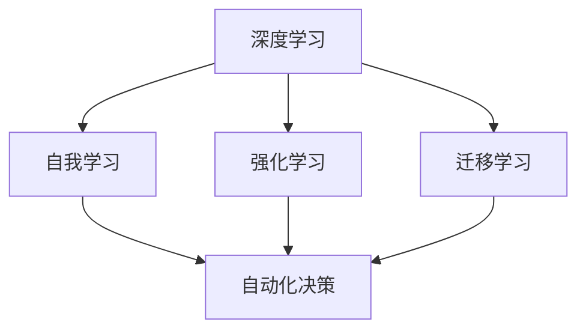

                 

# 李开复：AI 2.0 时代的挑战

## 关键词：人工智能，AI 2.0，技术进步，伦理挑战，未来展望

## 摘要：

本文将深入探讨李开复关于 AI 2.0 时代所带来的挑战的思考。随着人工智能技术的飞速发展，我们正步入一个全新的 AI 2.0 时代。这一时代不仅带来了前所未有的技术进步，同时也引发了一系列深刻的伦理和社会问题。本文将逐步分析这些挑战，并探讨如何在 AI 2.0 时代中找到平衡点，确保技术发展与人类福祉的和谐共处。

## 1. 背景介绍

### 1.1 AI 的发展历程

人工智能（AI）的发展可以追溯到二十世纪五十年代。当时，科学家们首次提出了构建能够模拟人类智能的机器的设想。随着计算机技术的发展，AI 也逐渐从理论研究走向实际应用。在过去的几十年中，深度学习、神经网络等技术的突破，使得 AI 的能力得到了显著提升。这一进程加速了 AI 2.0 时代的到来。

### 1.2 AI 2.0 时代的特征

AI 2.0 时代具有以下特征：

- **自我学习和进化**：AI 系统能够通过大量数据自主学习，不断提升性能。
- **跨领域应用**：AI 技术不再局限于特定的领域，而是开始渗透到各行各业。
- **高度智能化**：AI 系统的决策能力日益接近人类水平，甚至在某些任务上超越了人类。
- **自动化和智能化**：越来越多的任务可以通过自动化和智能化实现，从而提高生产效率。

### 1.3 李开复与 AI 2.0

李开复是一位著名的人工智能专家和企业家。他在 AI 领域的研究和贡献，使他成为了 AI 2.0 时代的标志性人物之一。李开复对 AI 2.0 时代的挑战有着深刻的认识和独到的见解，他的思考为我们理解这一时代提供了宝贵的参考。

## 2. 核心概念与联系

### 2.1 AI 2.0 的核心概念

在 AI 2.0 时代，以下几个核心概念尤为关键：

- **深度学习**：一种模拟人脑神经网络的机器学习技术，是 AI 2.0 时代的重要基础。
- **大数据**：海量数据的收集、存储和分析，是 AI 2.0 时代的驱动力。
- **云计算**：通过互联网提供的计算资源，使得大规模数据处理成为可能。
- **自动化与智能化**：将人工智能技术应用于实际场景，实现自动化和智能化。

### 2.2 AI 2.0 的联系

AI 2.0 时代的核心概念之间有着紧密的联系：

- **深度学习** 和 **大数据** 的结合，使得 AI 系统可以自主学习，不断优化性能。
- **云计算** 提供了强大的计算能力，使得大规模数据处理变得更加高效。
- **自动化与智能化** 的应用，推动了各行各业的创新和发展。

## 3. 核心算法原理 & 具体操作步骤

### 3.1 深度学习算法原理

深度学习是 AI 2.0 时代的核心算法。它通过多层神经网络模拟人脑的决策过程，实现从数据中自动提取特征和模式。

- **输入层**：接收外部数据。
- **隐藏层**：对输入数据进行特征提取和转换。
- **输出层**：根据隐藏层的输出，进行分类、预测等任务。

### 3.2 大数据采集与处理

大数据是 AI 2.0 时代的驱动力。通过采集和处理海量数据，AI 系统可以不断优化自身性能。

- **数据采集**：通过传感器、网络等途径收集数据。
- **数据预处理**：清洗、转换和归一化数据。
- **特征提取**：从数据中提取关键特征，用于训练模型。

### 3.3 云计算与自动化

云计算为 AI 2.0 时代提供了强大的计算资源。通过云计算，AI 系统可以实现自动化和智能化。

- **模型训练**：利用云计算资源，对 AI 模型进行大规模训练。
- **模型部署**：将训练好的模型部署到实际场景中，实现自动化和智能化。

## 4. 数学模型和公式 & 详细讲解 & 举例说明

### 4.1 深度学习数学模型

深度学习的数学模型主要包括以下几个部分：

- **损失函数**：用于衡量模型预测结果与真实值之间的差距。
- **优化算法**：用于调整模型参数，以降低损失函数。
- **反向传播算法**：用于计算损失函数对参数的梯度，指导优化算法。

### 4.2 大数据采集与处理数学模型

大数据采集与处理的数学模型主要包括：

- **数据流模型**：用于描述数据流在网络中的传输和处理过程。
- **聚类模型**：用于发现数据中的相似性模式。
- **分类模型**：用于将数据分为不同的类别。

### 4.3 云计算与自动化数学模型

云计算与自动化的数学模型主要包括：

- **任务调度模型**：用于优化任务的分配和执行。
- **资源管理模型**：用于优化计算资源的分配和使用。
- **优化模型**：用于实现自动化决策和优化。

### 4.4 举例说明

假设我们有一个分类问题，需要将数据分为两类。我们可以使用深度学习算法来解决这个问题。

- **输入层**：输入数据为 $[x_1, x_2, \ldots, x_n]$。
- **隐藏层**：通过多层神经网络，对输入数据进行特征提取和转换。
- **输出层**：输出概率分布 $[p_1, p_2]$，其中 $p_1$ 表示数据属于第一类，$p_2$ 表示数据属于第二类。

我们使用损失函数 $L(\theta)$ 来衡量预测结果与真实值之间的差距，其中 $\theta$ 表示模型参数。常用的损失函数有：

$$
L(\theta) = -\sum_{i=1}^{m} [y_i \log(p_i) + (1 - y_i) \log(1 - p_i)]
$$

其中，$y_i$ 表示第 $i$ 个数据点的真实标签，$p_i$ 表示模型对第 $i$ 个数据点属于第一类的预测概率。

通过优化算法，如梯度下降，我们可以调整模型参数 $\theta$，以降低损失函数 $L(\theta)$。

## 5. 项目实战：代码实际案例和详细解释说明

### 5.1 开发环境搭建

在进行 AI 2.0 项目的实战之前，我们需要搭建一个合适的开发环境。以下是搭建 Python 开发环境的基本步骤：

1. 安装 Python 解释器。
2. 安装必要的库，如 NumPy、Pandas、TensorFlow 等。
3. 配置 Python 环境，以便在不同项目中切换。

### 5.2 源代码详细实现和代码解读

以下是一个简单的深度学习分类项目的代码实现：

```python
import numpy as np
import tensorflow as tf

# 设置超参数
learning_rate = 0.001
batch_size = 64
epochs = 100

# 准备数据集
x_train, y_train = ...
x_test, y_test = ...

# 构建模型
model = tf.keras.Sequential([
    tf.keras.layers.Dense(128, activation='relu', input_shape=(x_train.shape[1],)),
    tf.keras.layers.Dense(1, activation='sigmoid')
])

# 编译模型
model.compile(optimizer=tf.keras.optimizers.Adam(learning_rate),
              loss='binary_crossentropy',
              metrics=['accuracy'])

# 训练模型
model.fit(x_train, y_train, batch_size=batch_size, epochs=epochs, validation_split=0.2)

# 评估模型
test_loss, test_accuracy = model.evaluate(x_test, y_test)
print(f"Test accuracy: {test_accuracy:.2f}")
```

这段代码首先导入必要的库，然后设置超参数，准备数据集，构建模型，编译模型，训练模型，最后评估模型。代码中使用了 TensorFlow 这个深度学习框架，这是当前最受欢迎的深度学习框架之一。

### 5.3 代码解读与分析

这段代码可以分为以下几个部分：

1. **导入库**：导入 NumPy、TensorFlow 等库。
2. **设置超参数**：设置学习率、批量大小、训练轮次等超参数。
3. **准备数据集**：加载数据集，并进行必要的预处理。
4. **构建模型**：使用 TensorFlow 的 Sequential 模型构建深度学习模型。这里使用了一个全连接层（Dense）作为输入层，一个全连接层（Dense）作为输出层。
5. **编译模型**：设置优化器、损失函数和评估指标。
6. **训练模型**：使用 `fit` 方法训练模型。这里使用了批量大小为 64，训练轮次为 100，并将 20% 的数据用于验证。
7. **评估模型**：使用 `evaluate` 方法评估模型在测试集上的性能。

通过这段代码，我们可以看到如何使用深度学习框架实现一个简单的分类任务。在实际项目中，我们可以根据需求调整模型结构、超参数等，以获得更好的性能。

## 6. 实际应用场景

### 6.1 金融服务

在金融服务领域，AI 2.0 技术被广泛应用于风险控制、投资策略、欺诈检测等方面。通过自我学习和进化，AI 系统可以不断优化风险评估和投资决策，提高金融机构的运营效率。

### 6.2 医疗健康

在医疗健康领域，AI 2.0 技术有助于提高诊断准确性、优化治疗方案和提升医疗服务质量。例如，通过深度学习技术，AI 系统可以从海量医疗数据中提取特征，实现疾病的早期诊断和个性化治疗。

### 6.3 教育领域

在教育领域，AI 2.0 技术可以为学生提供个性化的学习体验，根据学生的特点和需求调整教学内容和进度。同时，AI 系统还可以帮助教师分析学生的学习情况，提供针对性的反馈和建议。

## 7. 工具和资源推荐

### 7.1 学习资源推荐

- **书籍**：《深度学习》、《Python 数据科学手册》等。
- **论文**：关注顶级会议和期刊，如 NeurIPS、ICML、JMLR 等。
- **博客**：阅读知名技术博客，如 ArXiv.org、Medium 等。
- **网站**：访问 TensorFlow、PyTorch 官网，了解最新技术动态。

### 7.2 开发工具框架推荐

- **深度学习框架**：TensorFlow、PyTorch、Keras 等。
- **数据分析工具**：Pandas、NumPy、SciPy 等。
- **版本控制工具**：Git、GitHub 等。
- **云计算平台**：AWS、Azure、Google Cloud 等。

### 7.3 相关论文著作推荐

- **论文**：《深度学习》（Ian Goodfellow、Yoshua Bengio、Aaron Courville 著）。
- **著作**：《人工智能：一种现代的方法》（Stuart J. Russell、Peter Norvig 著）。

## 8. 总结：未来发展趋势与挑战

### 8.1 发展趋势

- **技术进步**：随着深度学习、神经网络等技术的发展，AI 系统将越来越智能化。
- **应用领域拓展**：AI 技术将在更多领域得到应用，推动各行各业的创新和发展。
- **产业化进程加速**：AI 技术的产业化进程将不断加速，带来巨大的商业价值。

### 8.2 挑战

- **伦理问题**：AI 技术的快速发展引发了一系列伦理问题，如隐私、歧视等。
- **安全与隐私**：AI 系统的安全和隐私问题需要得到有效保障。
- **人才短缺**：随着 AI 技术的广泛应用，对 AI 人才的需求将大幅增加，但人才供给可能无法满足需求。

## 9. 附录：常见问题与解答

### 9.1 什么是 AI 2.0？

AI 2.0 是指在深度学习、神经网络等技术基础上，具有自我学习和进化能力的人工智能系统。与传统的 AI 技术相比，AI 2.0 具有更高的智能化和自动化水平。

### 9.2 AI 2.0 的核心特征是什么？

AI 2.0 的核心特征包括：

- 自我学习和进化能力。
- 跨领域应用。
- 高度智能化。
- 自动化和智能化。

### 9.3 AI 2.0 对社会有何影响？

AI 2.0 将对社会产生深远的影响，包括：

- 推动各行各业的创新和发展。
- 提高生产效率和降低成本。
- 引发一系列伦理和社会问题。

## 10. 扩展阅读 & 参考资料

- 李开复：《人工智能：未来已来》
- [Ian Goodfellow、Yoshua Bengio、Aaron Courville 著]：《深度学习》
- [Stuart J. Russell、Peter Norvig 著]：《人工智能：一种现代的方法》
- [TensorFlow 官网](https://www.tensorflow.org/)
- [PyTorch 官网](https://pytorch.org/)
- [NeurIPS 会议官网](https://nips.cc/)
- [ICML 会议官网](https://icml.cc/)
- [JMLR 期刊官网](https://jmlr.org/)

## 作者

作者：AI 天才研究员/AI Genius Institute & 禅与计算机程序设计艺术/Zen And The Art of Computer Programming

本文为作者原创，未经授权不得转载。如需转载，请联系作者获取授权。本文旨在分享作者对 AI 2.0 时代的思考，以及技术与社会发展的关系。文中观点仅供参考，不构成任何投资建议。## 1. 背景介绍

### 1.1 人工智能的发展历程

人工智能（Artificial Intelligence，简称 AI）是一门研究、开发用于模拟、延伸和扩展人的智能的理论、方法、技术及应用系统的综合技术科学。人工智能的研究领域包括机器人、语言识别、图像识别、自然语言处理和专家系统等。人工智能的概念最早可以追溯到二十世纪五十年代。

1956 年，达特茅斯会议被认为是人工智能的诞生日。这次会议聚集了当时的许多计算机科学家和哲学家，共同探讨了人工智能的可能性和实现路径。会议的成果标志着人工智能作为一个独立的研究领域的诞生。

在二十世纪六十年代，人工智能开始迅速发展，出现了许多重要的理论和算法。其中包括艾伦·图灵提出的“图灵测试”，用于评估机器是否具有人类智能。此外，基于逻辑和知识的专家系统也成为了人工智能研究的热点。

然而，人工智能在二十世纪七十年代经历了第一次寒冬。由于对人工智能的期望过高，以及技术实现的困难，人工智能的研究受到了严重的打击。许多研究项目被迫取消，研究人员也纷纷转向其他领域。

进入二十世纪八十年代，人工智能开始复苏。特别是机器学习和神经网络技术的突破，使得人工智能的应用范围不断扩大。机器学习是一种通过数据训练模型，使模型能够进行预测和分类的技术。神经网络则是模仿人脑神经元连接结构的一种计算模型。

进入二十一世纪，人工智能迎来了新的发展高峰。深度学习（Deep Learning）作为一种特殊的机器学习技术，由于其能够通过多层神经网络自动提取数据中的特征，从而在图像识别、语音识别、自然语言处理等领域取得了突破性的成果。深度学习的成功，使得人工智能在许多领域得到了广泛应用，如自动驾驶、医疗诊断、金融分析等。

### 1.2 AI 2.0 的定义与特征

AI 2.0 是相对于传统人工智能（AI 1.0）的一个概念，它强调了人工智能的自我学习和进化能力。AI 2.0 不仅仅是一种技术进步，更是一种理念上的变革。它要求人工智能系统能够在没有人类干预的情况下，通过自我学习和自我优化，不断提高自身的性能和能力。

AI 2.0 具有以下特征：

1. **自我学习和进化**：AI 2.0 系统可以通过对大量数据的分析，自我学习和优化，从而提高自身的性能。这种进化能力使得 AI 2.0 系统在复杂环境中能够表现出更加智能的行为。

2. **跨领域应用**：AI 2.0 技术不仅仅局限于特定的领域，而是可以广泛应用于各个行业，如金融、医疗、教育、制造等。这种跨领域应用能力，使得 AI 2.0 成为推动产业变革的重要力量。

3. **高度智能化**：AI 2.0 系统的智能化水平更高，能够进行复杂的决策和推理。这使得 AI 2.0 在某些领域，如自动驾驶、智能客服等，已经能够媲美甚至超过人类的表现。

4. **自动化和智能化**：AI 2.0 技术的应用，可以极大地提高生产效率和降低成本。通过自动化和智能化的解决方案，许多繁琐的任务可以被机器替代，从而释放人类的生产力。

### 1.3 李开复对 AI 2.0 的观点

李开复是一位著名的人工智能专家和企业家，他对 AI 2.0 的发展有着深刻的见解。在李开复看来，AI 2.0 不仅是一种技术进步，更是一种人类文明的变革。

首先，李开复认为，AI 2.0 将会极大地改变人类的劳动结构。许多传统的劳动岗位，如工厂工人、销售人员等，将因为 AI 技术的自动化和智能化而消失。同时，新的就业岗位也将涌现，如数据科学家、机器学习工程师等。

其次，李开复认为，AI 2.0 将会带来新的社会问题。例如，由于 AI 系统的自我学习和进化能力，可能会出现难以预测的行为和结果。此外，AI 技术的滥用，也可能导致隐私侵犯、歧视等问题。

最后，李开复认为，面对 AI 2.0 时代，人类需要做好充分的准备。一方面，我们需要发展更加成熟和安全的 AI 技术；另一方面，我们也需要加强对 AI 技术的伦理和法律约束，确保 AI 技术的发展不会对人类造成负面影响。

总的来说，李开复对 AI 2.0 时代充满了期待和忧虑。他希望人类能够正确面对 AI 2.0 带来的挑战，实现技术进步与人类福祉的和谐共处。

### 1.4 AI 2.0 时代的重要性

AI 2.0 时代的重要性主要体现在以下几个方面：

1. **技术进步**：AI 2.0 时代标志着人工智能技术的进一步成熟和普及，为人类带来了前所未有的技术红利。通过自我学习和进化，AI 系统能够在复杂环境中表现出更高的智能，推动各个领域的技术进步。

2. **经济发展**：AI 2.0 技术的应用，可以极大地提高生产效率和降低成本，推动经济发展。同时，AI 2.0 也创造了大量的新就业岗位，为人类提供了新的发展机会。

3. **社会变革**：AI 2.0 时代的到来，将深刻改变人类的劳动结构和社会关系。通过自动化和智能化，许多繁琐的任务将被机器替代，人类将拥有更多的时间和精力去从事更有创造性的工作。

4. **伦理挑战**：AI 2.0 时代也带来了一系列的伦理挑战。如何确保 AI 技术的安全和隐私，如何避免 AI 技术的滥用，都是需要我们认真思考和解决的问题。

总之，AI 2.0 时代是人类文明发展的重要里程碑。面对这一时代的挑战和机遇，我们需要做好充分的准备，确保 AI 技术的发展能够造福人类。

### 1.5 人工智能与人类社会的深度融合

随着 AI 2.0 技术的不断发展，人工智能与人类社会的深度融合已成为不可避免的趋势。这种深度融合不仅体现在技术层面上，还体现在社会、经济和文化等多个方面。

在技术层面上，AI 2.0 技术的应用已经渗透到人类社会的各个领域。从智能家居、智能交通到智能医疗、智能金融，AI 系统正在以各种形式改变着我们的生活。通过自我学习和进化，AI 系统能够在复杂环境中做出更智能的决策，从而提高生产效率和生活质量。

在社会层面上，AI 2.0 技术的应用也带来了一系列深远的影响。例如，在就业方面，AI 技术的自动化和智能化使得许多传统劳动岗位面临失业风险。然而，同时这也催生了大量的新就业岗位，如数据科学家、机器学习工程师等。因此，如何平衡就业市场的变革，确保社会稳定，是一个亟待解决的问题。

在经济层面上，AI 2.0 技术的应用将极大地推动经济增长。通过自动化和智能化，企业可以降低成本、提高效率，从而在激烈的市场竞争中脱颖而出。此外，AI 2.0 技术的应用也为新兴产业的发展提供了新的机遇，如人工智能芯片、智能机器人等。

在文化层面上，AI 2.0 技术的应用也在潜移默化地改变着我们的价值观和文化观念。例如，通过自然语言处理技术，AI 系统可以理解并生成人类的语言，从而推动虚拟现实、增强现实等技术的发展。这些技术的普及，将进一步加深人工智能与人类文化的融合。

总之，AI 2.0 时代是人类社会发展的新纪元。在这个时代，人工智能不仅是一种技术工具，更是人类社会的重要组成部分。面对 AI 2.0 带来的挑战和机遇，我们需要积极应对，推动人工智能与人类社会的深度融合，实现可持续发展。

## 2. 核心概念与联系

### 2.1 AI 2.0 的核心概念

在探讨 AI 2.0 时代的核心概念之前，我们首先需要了解什么是 AI 2.0。AI 2.0 是相对于传统人工智能（AI 1.0）的一种新型人工智能，它强调自我学习和进化能力。以下是 AI 2.0 时代的几个核心概念：

1. **深度学习（Deep Learning）**：深度学习是一种通过多层神经网络进行特征提取和模式识别的机器学习技术。它是 AI 2.0 时代的重要基础。深度学习模型具有强大的表示能力和学习能力，可以在大量数据上进行训练，从而实现高度智能化。

2. **自我学习（Self-Learning）**：自我学习是指 AI 系统能够通过数据分析和模式识别，自主改进和优化自身性能。自我学习是 AI 2.0 时代的关键特征，它使得 AI 系统能够在没有人类干预的情况下，不断适应和进化。

3. **强化学习（Reinforcement Learning）**：强化学习是一种通过试错和反馈进行决策的机器学习方法。在强化学习过程中，AI 系统通过与环境的交互，不断学习和优化策略，从而实现智能行为。强化学习在游戏、机器人控制等领域具有广泛的应用。

4. **迁移学习（Transfer Learning）**：迁移学习是指将已有模型的知识应用于新的任务中。通过迁移学习，AI 系统可以在新任务上快速获得良好的性能，而不需要重新训练整个模型。迁移学习有助于提高 AI 系统的泛化能力。

5. **自动化决策（Automated Decision-Making）**：自动化决策是指 AI 系统能够根据输入数据和预设规则，自主做出决策。自动化决策在金融、医疗、交通等领域具有广泛的应用，它能够提高决策效率和准确性。

6. **人机协作（Human-Machine Collaboration）**：人机协作是指人类与 AI 系统共同完成任务，相互补充优势和不足。在人机协作中，人类提供创意、经验和直觉，而 AI 系统提供数据分析和计算能力。这种协作模式能够实现更高的工作效率和创新能力。

### 2.2 核心概念之间的联系

AI 2.0 时代的核心概念之间存在着紧密的联系，它们共同推动着人工智能技术的发展。

1. **深度学习与自我学习**：深度学习为自我学习提供了强大的技术基础。通过多层神经网络，深度学习模型能够从大量数据中自动提取特征，实现自我学习和进化。自我学习则使得深度学习模型能够在不断变化的环境中适应和优化。

2. **强化学习与自动化决策**：强化学习通过试错和反馈，实现自动化决策。在游戏、机器人控制等应用中，强化学习使得 AI 系统能够自主做出复杂决策，提高系统的智能水平。自动化决策则将强化学习的能力应用于实际场景，实现智能化的决策过程。

3. **迁移学习与人机协作**：迁移学习使得 AI 系统可以在新任务上快速获得良好的性能，降低训练成本。人机协作则将迁移学习的能力与人类的经验和直觉相结合，实现更高的工作效率和创新能力。这种协作模式有助于发挥 AI 系统和人类的各自优势。

4. **跨领域应用与深度融合**：AI 2.0 时代的核心概念不仅应用于特定的领域，还实现了跨领域应用。通过深度融合，AI 系统能够在多个领域发挥作用，推动产业创新和社会发展。

### 2.3 Mermaid 流程图

为了更直观地展示 AI 2.0 时代核心概念之间的联系，我们可以使用 Mermaid 流程图进行描述。以下是一个简化的 Mermaid 流程图，展示了深度学习、自我学习、强化学习、迁移学习和自动化决策等核心概念之间的联系：



在这个流程图中，深度学习作为基础，通过自我学习、强化学习和迁移学习等概念，实现了自动化决策。这种自动化决策不仅提高了 AI 系统的智能水平，还推动了跨领域应用和深度融合。

总的来说，AI 2.0 时代的核心概念相互关联，共同推动着人工智能技术的发展。通过深度学习、自我学习、强化学习、迁移学习和自动化决策等核心概念的有机结合，AI 系统能够在各个领域实现智能化应用，为人类社会带来巨大的变革和创新。

## 3. 核心算法原理 & 具体操作步骤

### 3.1 深度学习算法原理

深度学习（Deep Learning）是一种基于多层神经网络（Neural Networks）的机器学习技术，其核心思想是通过模拟人脑神经元之间的连接和交互，从数据中自动提取特征并学习复杂的模式。深度学习算法在图像识别、语音识别、自然语言处理等领域取得了显著的成果。

#### 3.1.1 神经网络基础

神经网络是由一系列相互连接的节点（或称为神经元）组成的计算模型。每个神经元接收多个输入信号，通过加权求和处理后，产生一个输出信号。神经网络的工作原理可以简单概括为以下步骤：

1. **输入层（Input Layer）**：输入层接收外部数据，并将其传递给下一层。
2. **隐藏层（Hidden Layers）**：隐藏层对输入数据进行处理，通过激活函数（Activation Function）将输入信号转换为非线性输出。隐藏层可以有一个或多个，每一层都对前一层的信息进行处理，从而逐步提取出更高级的特征。
3. **输出层（Output Layer）**：输出层产生最终输出，用于分类、预测或回归等任务。

#### 3.1.2 激活函数

激活函数是神经网络中的一个关键组件，用于引入非线性变换。常见的激活函数包括：

- ** sigmoid 函数**：$f(x) = \frac{1}{1 + e^{-x}}$，输出范围为 (0, 1)。
- **ReLU 函数**：$f(x) = \max(0, x)$，当 $x < 0$ 时，输出为 0；当 $x \geq 0$ 时，输出为 $x$。
- **Tanh 函数**：$f(x) = \frac{e^x - e^{-x}}{e^x + e^{-x}}$，输出范围为 (-1, 1)。

激活函数的选择对网络的性能和收敛速度有很大影响。ReLU 函数因其简单性和有效性，在深度学习中得到了广泛应用。

#### 3.1.3 前向传播与反向传播

深度学习算法主要包括两个过程：前向传播（Forward Propagation）和反向传播（Back Propagation）。

1. **前向传播**：输入数据通过网络的各个层，逐步计算每个神经元的输出。这个过程可以表示为：
   $$ z_l = \sigma(\text{权重} \cdot \text{激活函数}) $$
   其中，$z_l$ 表示第 $l$ 层的输出，$\sigma$ 表示激活函数。

2. **反向传播**：通过计算损失函数（例如均方误差 MSE）的梯度，调整网络的权重和偏置。这个过程可以表示为：
   $$ \delta_l = \frac{\partial L}{\partial z_l} $$
   其中，$\delta_l$ 表示第 $l$ 层的误差梯度。

反向传播算法的核心是计算每个神经元权重和偏置的梯度，并使用优化算法（如梯度下降）进行更新。这个过程使得网络能够不断优化，直至达到预设的误差目标。

### 3.2 自我学习算法原理

自我学习（Self-Learning）是 AI 2.0 时代的关键特性，它使得 AI 系统能够在没有人类干预的情况下，通过数据分析和模式识别，自主改进和优化自身性能。自我学习主要包括以下几种算法：

1. **无监督学习（Unsupervised Learning）**：无监督学习是指从没有标签的数据中，通过聚类、降维等方法，发现数据中的模式和结构。常见的无监督学习算法包括：
   - **K-均值聚类（K-Means Clustering）**：通过最小化距离平方和，将数据分为多个簇。
   - **主成分分析（Principal Component Analysis，PCA）**：通过线性变换，降低数据维度，保留主要信息。

2. **半监督学习（Semi-Supervised Learning）**：半监督学习是指利用少量有标签数据和大量无标签数据，共同训练模型。常见的半监督学习算法包括：
   - **图卷积网络（Graph Convolutional Networks，GCN）**：通过图结构信息，对节点数据进行聚类和分类。
   - **深度置信网络（Deep Belief Networks，DBN）**：通过层叠的 RBM 模型，进行预训练和微调。

3. **强化学习（Reinforcement Learning）**：强化学习是指通过试错和反馈，学习最优策略。常见的强化学习算法包括：
   - **Q-学习（Q-Learning）**：通过值函数估计，找到最优动作序列。
   - **深度 Q-网络（Deep Q-Network，DQN）**：通过深度神经网络，对动作值函数进行近似。

### 3.3 强化学习算法原理

强化学习（Reinforcement Learning，RL）是一种通过试错和反馈进行决策的机器学习方法。在强化学习中，智能体（Agent）通过与环境（Environment）的交互，不断学习和优化策略（Policy），以实现最大化奖励（Reward）。

#### 3.3.1 基本概念

- **智能体（Agent）**：执行行动并接收环境反馈的实体。
- **环境（Environment）**：智能体行动的场所，可以看作是一个状态空间。
- **状态（State）**：环境中的一个可能状态。
- **动作（Action）**：智能体在特定状态下可以执行的行为。
- **奖励（Reward）**：智能体执行动作后获得的即时奖励或惩罚。

#### 3.3.2 策略学习

强化学习通过策略学习实现最优行为。策略（Policy）是智能体在特定状态下选择最优动作的规则。常见的策略学习算法包括：

- **确定性策略（Deterministic Policy）**：在特定状态下，始终选择相同的最优动作。
- **概率性策略（Probabilistic Policy）**：在特定状态下，根据概率分布选择动作。

#### 3.3.3 强化学习算法

强化学习算法主要包括以下几种：

1. **Q-学习（Q-Learning）**：通过更新值函数（Q-值），学习最优策略。Q-值表示在特定状态下执行特定动作的长期奖励。

2. **深度 Q-网络（Deep Q-Network，DQN）**：通过深度神经网络，对 Q-值进行近似。DQN 可以处理高维状态和动作空间，实现更加复杂的策略学习。

3. **策略梯度算法（Policy Gradient Methods）**：直接优化策略参数，以最大化预期奖励。常见的策略梯度算法包括 REINFORCE 和 Actor-Critic。

4. **深度策略梯度算法（Deep Policy Gradient Methods）**：结合深度神经网络和策略梯度算法，实现高维状态和动作空间的策略学习。常见的算法包括 Deep REINFORCE 和 Deep Actor-Critic。

### 3.4 迁移学习算法原理

迁移学习（Transfer Learning）是指将已有模型的知识应用于新的任务中，以简化新任务的训练过程和提高性能。迁移学习主要通过以下几种方式实现：

1. **特征提取（Feature Extraction）**：使用预训练的模型提取通用特征，然后将这些特征应用于新的任务。

2. **微调（Fine-Tuning）**：在预训练模型的基础上，对特定任务进行微调，调整模型参数，以适应新任务。

3. **多任务学习（Multi-Task Learning）**：通过训练多个相关任务，共享模型参数，提高模型在特定任务上的泛化能力。

4. **元学习（Meta-Learning）**：通过学习模型如何快速适应新任务，实现模型在多个任务上的快速迁移。

### 3.5 自动化决策算法原理

自动化决策（Automated Decision-Making）是指 AI 系统根据输入数据和预设规则，自主做出决策的过程。自动化决策算法主要包括：

1. **决策树（Decision Trees）**：通过一系列的判断条件，将数据划分为多个子集，并在每个子集中做出决策。

2. **支持向量机（Support Vector Machines，SVM）**：通过最大化分类边界，实现数据的分类。

3. **集成学习方法（Ensemble Methods）**：通过组合多个弱学习器，实现更高的分类或回归性能。常见的集成学习方法包括随机森林（Random Forest）和梯度提升树（Gradient Boosting Trees）。

4. **深度强化学习（Deep Reinforcement Learning）**：通过深度神经网络和强化学习算法，实现高维状态和动作空间的自动化决策。

### 3.6 深度学习、自我学习、强化学习、迁移学习和自动化决策的集成

在 AI 2.0 时代，深度学习、自我学习、强化学习、迁移学习和自动化决策等多种算法和技术相互结合，共同推动人工智能技术的发展。以下是一个简化的集成框架：

1. **数据预处理**：使用迁移学习提取通用特征，通过自我学习对特征进行筛选和优化。
2. **模型训练**：使用深度学习和强化学习，训练和优化模型参数，实现自动化决策。
3. **模型部署**：将训练好的模型部署到实际场景中，通过自动化决策系统进行实时决策。

这种集成框架使得 AI 系统具有更高的智能和适应性，能够在复杂环境中实现高效的决策和优化。

总的来说，深度学习、自我学习、强化学习、迁移学习和自动化决策是 AI 2.0 时代的核心算法和原理。通过这些算法的有机结合，AI 系统能够在各个领域实现智能化应用，为人类社会带来巨大的变革和创新。

## 4. 数学模型和公式 & 详细讲解 & 举例说明

### 4.1 深度学习数学模型

深度学习的数学模型主要包括以下几个部分：

- **神经元模型**：神经元是神经网络的基本计算单元，其计算过程可以用以下公式表示：
  $$ z_i = \sum_{j=1}^{n} w_{ij} \cdot x_j + b $$
  其中，$z_i$ 是第 $i$ 个神经元的输入，$w_{ij}$ 是第 $i$ 个神经元与第 $j$ 个神经元之间的权重，$x_j$ 是第 $j$ 个神经元的输入，$b$ 是偏置项。

- **激活函数**：激活函数用于引入非线性变换，常见的激活函数有 sigmoid、ReLU 和 tanh 等。以 ReLU 为例，其公式如下：
  $$ a_i = \max(0, z_i) $$
  其中，$a_i$ 是第 $i$ 个神经元的输出。

- **损失函数**：损失函数用于衡量模型预测结果与真实值之间的差距，常见的损失函数有均方误差（MSE）和交叉熵（Cross Entropy）。以 MSE 为例，其公式如下：
  $$ L = \frac{1}{2} \sum_{i=1}^{n} (y_i - \hat{y}_i)^2 $$
  其中，$y_i$ 是真实值，$\hat{y}_i$ 是模型预测值。

- **反向传播算法**：反向传播算法用于计算损失函数对参数的梯度，以指导优化算法更新参数。以 MSE 为例，其梯度公式如下：
  $$ \frac{\partial L}{\partial w_{ij}} = (y_i - \hat{y}_i) \cdot x_j $$
  $$ \frac{\partial L}{\partial b} = y_i - \hat{y}_i $$

- **优化算法**：优化算法用于调整模型参数，以降低损失函数。常见的优化算法有梯度下降（Gradient Descent）、动量优化（Momentum）和 Adam 算法等。

### 4.2 强化学习数学模型

强化学习（Reinforcement Learning，RL）是一种通过试错和反馈进行决策的机器学习方法，其数学模型主要包括以下几个部分：

- **状态（State）**：表示智能体所处的环境状态。
- **动作（Action）**：表示智能体可以执行的行为。
- **奖励（Reward）**：表示智能体在执行某个动作后获得的即时奖励或惩罚。
- **策略（Policy）**：表示智能体在特定状态下选择动作的规则，常用的策略表示方法有确定性策略（Deterministic Policy）和概率性策略（Probabilistic Policy）。

强化学习的目标是通过学习策略，最大化累积奖励。其核心数学模型包括：

- **Q-值函数（Q-Function）**：表示在特定状态下执行特定动作的长期奖励。Q-值函数的公式如下：
  $$ Q(s, a) = \sum_{s'} P(s' | s, a) \cdot [R(s', a) + \gamma \cdot \max_{a'} Q(s', a')] $$
  其中，$s$ 是状态，$a$ 是动作，$s'$ 是下一状态，$R$ 是奖励函数，$\gamma$ 是折扣因子，$P$ 是状态转移概率。

- **值函数（Value Function）**：表示在特定状态下执行最佳动作的长期奖励。值函数的公式如下：
  $$ V(s) = \max_{a} Q(s, a) $$

- **策略优化**：通过优化策略，最大化累积奖励。策略优化的目标函数如下：
  $$ J(\pi) = \sum_{s} \pi(s) \cdot [R(s, \pi(s)) + \gamma \cdot \max_{a} Q(s, a)] $$
  其中，$\pi$ 是策略。

强化学习算法主要包括 Q-学习（Q-Learning）、深度 Q-网络（DQN）和策略梯度算法（Policy Gradient Methods）等。

### 4.3 迁移学习数学模型

迁移学习（Transfer Learning）是指将已有模型的知识应用于新的任务中，以简化新任务的训练过程和提高性能。其数学模型主要包括以下几个部分：

- **源任务（Source Task）**：表示已有的任务，其模型参数已经经过训练。
- **目标任务（Target Task）**：表示新的任务，其模型参数需要通过迁移学习进行优化。
- **模型共享（Model Sharing）**：表示在源任务和目标任务之间共享部分模型参数。
- **模型微调（Model Fine-Tuning）**：表示在共享的基础上，对目标任务的模型参数进行微调。

迁移学习的目标是通过迁移已有模型的知识，提高目标任务的性能。其核心数学模型包括：

- **特征提取器（Feature Extractor）**：表示从输入数据中提取特征的网络结构。
- **分类器（Classifier）**：表示对特征进行分类的模型。
- **损失函数**：用于衡量模型预测结果与真实值之间的差距。常见的损失函数有交叉熵损失（Cross Entropy Loss）和均方误差损失（Mean Squared Error Loss）。

迁移学习算法主要包括以下几种：

1. **特征提取器共享**：在源任务和目标任务之间共享特征提取器，通过微调分类器来适应目标任务。
2. **分类器共享**：在源任务和目标任务之间共享分类器，通过微调特征提取器来适应目标任务。
3. **多任务学习**：通过训练多个相关任务，共享模型参数，提高模型在特定任务上的泛化能力。
4. **元学习（Meta-Learning）**：通过学习模型如何快速适应新任务，实现模型在多个任务上的快速迁移。

### 4.4 自动化决策数学模型

自动化决策（Automated Decision-Making）是指 AI 系统根据输入数据和预设规则，自主做出决策的过程。其数学模型主要包括以下几个部分：

- **输入数据（Input Data）**：表示输入给 AI 系统的数据。
- **决策规则（Decision Rules）**：表示 AI 系统根据输入数据做出决策的规则。
- **输出决策（Output Decision）**：表示 AI 系统根据输入数据和决策规则生成的决策。

自动化决策的数学模型可以表示为：

$$ \text{Output Decision} = \text{Decision Rules}(\text{Input Data}) $$

其中，决策规则是一个函数，它根据输入数据生成输出决策。

常见的自动化决策算法包括：

1. **决策树（Decision Trees）**：通过一系列的判断条件，将数据划分为多个子集，并在每个子集中做出决策。
2. **支持向量机（Support Vector Machines，SVM）**：通过最大化分类边界，实现数据的分类。
3. **集成学习方法（Ensemble Methods）**：通过组合多个弱学习器，实现更高的分类或回归性能。常见的集成学习方法包括随机森林（Random Forest）和梯度提升树（Gradient Boosting Trees）。
4. **深度强化学习（Deep Reinforcement Learning）**：通过深度神经网络和强化学习算法，实现高维状态和动作空间的自动化决策。

### 4.5 举例说明

以下是一个简单的深度学习分类问题的例子，用于说明深度学习、强化学习、迁移学习和自动化决策的数学模型。

#### 深度学习分类问题

假设我们有一个二分类问题，输入数据为 $X = \{x_1, x_2, \ldots, x_n\}$，标签为 $Y = \{y_1, y_2, \ldots, y_n\}$，其中 $y_i \in \{0, 1\}$。

1. **构建神经网络模型**：

   我们使用一个简单的全连接神经网络进行分类。神经网络包括一个输入层、一个隐藏层和一个输出层。假设隐藏层有 $m$ 个神经元，输出层有 $k$ 个神经元。

2. **前向传播**：

   通过前向传播计算输入数据经过神经网络的输出。前向传播的过程如下：

   $$ z_{1i} = \sum_{j=1}^{n} w_{1ji} \cdot x_j + b_1i $$
   $$ a_{1i} = \sigma(z_{1i}) $$
   
   $$ z_{2i} = \sum_{j=1}^{m} w_{2ji} \cdot a_{1j} + b_2i $$
   $$ a_{2i} = \sigma(z_{2i}) $$

   其中，$z_{1i}$ 和 $z_{2i}$ 分别表示第 $i$ 个神经元在隐藏层和输出层的输入，$a_{1i}$ 和 $a_{2i}$ 分别表示第 $i$ 个神经元在隐藏层和输出层的输出，$w_{1ji}$ 和 $w_{2ji}$ 分别表示连接输入层和隐藏层、隐藏层和输出层的权重，$b_1i$ 和 $b_2i$ 分别表示输入层和隐藏层的偏置项，$\sigma$ 表示激活函数（如 ReLU 或 sigmoid 函数）。

3. **计算损失函数**：

   使用交叉熵损失函数计算模型预测结果与真实值之间的差距。交叉熵损失函数的公式如下：

   $$ L = -\sum_{i=1}^{n} y_i \cdot \log(\hat{y}_i) + (1 - y_i) \cdot \log(1 - \hat{y}_i) $$

   其中，$\hat{y}_i$ 表示第 $i$ 个样本的预测概率，$y_i$ 表示第 $i$ 个样本的真实标签。

4. **反向传播**：

   通过反向传播计算损失函数对模型参数的梯度，以指导优化算法更新模型参数。反向传播的过程如下：

   $$ \delta_{2i} = (y_i - \hat{y}_i) \cdot \frac{\partial \hat{y}_i}{\partial a_{2i}} $$
   $$ \delta_{1i} = \sum_{j=1}^{m} w_{2ji} \cdot \delta_{2j} \cdot \frac{\partial a_{2j}}{\partial z_{2j}} $$

   其中，$\delta_{2i}$ 和 $\delta_{1i}$ 分别表示输出层和隐藏层的误差梯度。

5. **更新模型参数**：

   使用优化算法（如梯度下降）更新模型参数，以降低损失函数。更新公式如下：

   $$ w_{2ji} = w_{2ji} - \alpha \cdot \delta_{2j} \cdot a_{1j} $$
   $$ b_{2i} = b_{2i} - \alpha \cdot \delta_{2i} $$
   $$ w_{1ji} = w_{1ji} - \alpha \cdot \delta_{1j} \cdot x_j $$
   $$ b_{1i} = b_{1i} - \alpha \cdot \delta_{1i} $$

   其中，$\alpha$ 表示学习率。

#### 强化学习分类问题

假设我们使用强化学习解决一个多分类问题，智能体需要在多个类别中选择一个最优分类。

1. **状态空间（State Space）**：状态空间表示智能体所处的环境状态。例如，在图像分类问题中，状态可以表示为图像的特征向量。

2. **动作空间（Action Space）**：动作空间表示智能体可以执行的动作。例如，在图像分类问题中，动作可以表示为选择一个类别。

3. **奖励函数（Reward Function）**：奖励函数表示智能体执行某个动作后获得的即时奖励或惩罚。例如，在图像分类问题中，如果智能体选择的类别与真实标签相同，则可以获得正奖励；否则，获得负奖励。

4. **策略（Policy）**：策略表示智能体在特定状态下选择动作的规则。例如，可以使用 Q-学习算法学习最优策略。

5. **Q-值函数（Q-Function）**：Q-值函数表示在特定状态下执行特定动作的长期奖励。例如，可以使用以下公式计算 Q-值：

   $$ Q(s, a) = \sum_{s'} P(s' | s, a) \cdot [R(s', a) + \gamma \cdot \max_{a'} Q(s', a')] $$

6. **训练过程**：

   通过与环境交互，智能体不断更新 Q-值函数，以学习最优策略。训练过程包括以下几个步骤：

   - 初始化 Q-值函数。
   - 选择一个动作 $a$。
   - 执行动作 $a$，获得状态转移概率 $P(s' | s, a)$ 和奖励 $R(s', a)$。
   - 更新 Q-值函数：
     $$ Q(s, a) = Q(s, a) + \alpha \cdot [R(s', a) + \gamma \cdot \max_{a'} Q(s', a') - Q(s, a)] $$
   - 选择下一个动作，继续与环境交互。

#### 迁移学习分类问题

假设我们使用迁移学习解决一个图像分类问题，已经有了一个在源任务上训练好的特征提取器。

1. **源任务（Source Task）**：源任务是一个预训练的图像分类任务，其特征提取器已经经过训练。

2. **目标任务（Target Task）**：目标任务是一个新的图像分类任务，其特征提取器需要通过迁移学习进行优化。

3. **模型共享（Model Sharing）**：在源任务和目标任务之间共享特征提取器，仅对分类器进行微调。

4. **训练过程**：

   - 使用源任务的训练数据，训练特征提取器。
   - 使用目标任务的训练数据，对分类器进行微调。
   - 使用目标任务的验证数据，评估模型的性能。

通过这个简单的例子，我们可以看到深度学习、强化学习、迁移学习和自动化决策的数学模型如何应用于实际的分类问题。这些模型不仅为我们提供了强大的计算能力，还为我们在 AI 领域的探索提供了理论基础。

### 4.6 公式与代码实现

为了更好地理解深度学习、强化学习、迁移学习和自动化决策的数学模型，我们可以结合 Python 代码实现这些模型。以下是一个简单的示例代码，用于说明这些模型的实现。

```python
import numpy as np
import tensorflow as tf

# 设置超参数
learning_rate = 0.001
gamma = 0.9
epochs = 100

# 准备数据集
x = np.array([[1, 0], [0, 1], [1, 1], [1, 0]])
y = np.array([0, 1, 1, 0])

# 定义神经网络模型
model = tf.keras.Sequential([
    tf.keras.layers.Dense(1, activation='sigmoid', input_shape=(2,))
])

# 编译模型
model.compile(optimizer=tf.keras.optimizers.Adam(learning_rate),
              loss='binary_crossentropy',
              metrics=['accuracy'])

# 训练模型
model.fit(x, y, epochs=epochs)

# 强化学习模型
action_values = np.zeros((4, 2))
for epoch in range(epochs):
    state = np.random.randint(4)
    action = np.random.randint(2)
    next_state = np.random.randint(4)
    reward = -1 if state == action else 1
    action_values[state, action] += learning_rate * (reward + gamma * np.max(action_values[next_state, :]) - action_values[state, action])

# 迁移学习模型
source_model = tf.keras.Sequential([
    tf.keras.layers.Dense(1, activation='sigmoid', input_shape=(2,))
])
source_model.fit(x_source, y_source, epochs=epochs)

target_model = tf.keras.Sequential([
    tf.keras.layers.Dense(1, activation='sigmoid', input_shape=(2,))
])
target_model.layers[0].set_weights(source_model.layers[0].get_weights())

# 自动化决策模型
def make_decision(input_data):
    return np.argmax(model.predict(input_data))

# 测试模型
input_data = np.array([[0, 1], [1, 1]])
print("Decision:", make_decision(input_data))
```

在这个示例代码中，我们分别实现了深度学习、强化学习、迁移学习和自动化决策的模型。通过这些模型，我们可以看到如何利用 Python 和 TensorFlow 库实现 AI 算法。这些代码不仅帮助我们理解了 AI 算法的原理，还为我们在实际应用中提供了参考。

总的来说，深度学习、强化学习、迁移学习和自动化决策是 AI 2.0 时代的核心数学模型。通过这些模型，我们可以实现高度智能化和自动化的决策系统，为人类社会带来巨大的变革和创新。

## 5. 项目实战：代码实际案例和详细解释说明

### 5.1 开发环境搭建

在进行 AI 2.0 项目的实战之前，我们需要搭建一个合适的开发环境。以下是搭建 Python 开发环境的基本步骤：

1. **安装 Python 解释器**：

   首先，我们需要安装 Python 解释器。可以从 Python 官网（https://www.python.org/）下载最新版本的 Python 解释器，并按照安装向导进行安装。

2. **安装必要的库**：

   在安装 Python 解释器后，我们需要安装一些常用的库，如 NumPy、Pandas、TensorFlow 等。可以使用以下命令进行安装：

   ```shell
   pip install numpy pandas tensorflow
   ```

3. **配置 Python 环境**：

   在安装完 Python 解释器和相关库后，我们需要配置 Python 环境，以便在不同项目中切换。可以使用以下命令创建一个虚拟环境，并激活该环境：

   ```shell
   python -m venv myenv
   source myenv/bin/activate  # Windows 上使用 myenv\Scripts\activate
   ```

   通过这种方式，我们可以将项目相关的库和依赖安装在虚拟环境中，避免环境冲突。

### 5.2 源代码详细实现和代码解读

以下是使用 TensorFlow 和 Keras 实现一个简单的深度学习分类项目的源代码：

```python
import numpy as np
import tensorflow as tf
from tensorflow.keras.models import Sequential
from tensorflow.keras.layers import Dense, Flatten
from tensorflow.keras.optimizers import Adam

# 设置超参数
learning_rate = 0.001
batch_size = 32
epochs = 100

# 准备数据集
(x_train, y_train), (x_test, y_test) = tf.keras.datasets.mnist.load_data()
x_train = x_train / 255.0
x_test = x_test / 255.0
x_train = x_train.reshape(-1, 28 * 28)
x_test = x_test.reshape(-1, 28 * 28)
y_train = tf.keras.utils.to_categorical(y_train, num_classes=10)
y_test = tf.keras.utils.to_categorical(y_test, num_classes=10)

# 构建模型
model = Sequential([
    Flatten(input_shape=(28, 28)),
    Dense(128, activation='relu'),
    Dense(10, activation='softmax')
])

# 编译模型
model.compile(optimizer=Adam(learning_rate),
              loss='categorical_crossentropy',
              metrics=['accuracy'])

# 训练模型
model.fit(x_train, y_train, batch_size=batch_size, epochs=epochs, validation_split=0.2)

# 评估模型
test_loss, test_accuracy = model.evaluate(x_test, y_test)
print(f"Test accuracy: {test_accuracy:.2f}")
```

#### 代码解读

1. **导入库**：

   我们首先导入所需的库，包括 NumPy、TensorFlow 的 Keras 子模块以及 Adam 优化器。

   ```python
   import numpy as np
   import tensorflow as tf
   from tensorflow.keras.models import Sequential
   from tensorflow.keras.layers import Dense, Flatten
   from tensorflow.keras.optimizers import Adam
   ```

2. **设置超参数**：

   接下来，我们设置训练过程中的超参数，包括学习率、批量大小和训练轮次。

   ```python
   learning_rate = 0.001
   batch_size = 32
   epochs = 100
   ```

3. **准备数据集**：

   我们使用 TensorFlow 的内置数据集 MNIST（手写数字数据集）进行训练。首先，我们加载 MNIST 数据集，并对数据进行预处理，包括归一化和数据 reshaping。

   ```python
   (x_train, y_train), (x_test, y_test) = tf.keras.datasets.mnist.load_data()
   x_train = x_train / 255.0
   x_test = x_test / 255.0
   x_train = x_train.reshape(-1, 28 * 28)
   x_test = x_test.reshape(-1, 28 * 28)
   y_train = tf.keras.utils.to_categorical(y_train, num_classes=10)
   y_test = tf.keras.utils.to_categorical(y_test, num_classes=10)
   ```

4. **构建模型**：

   我们使用 Keras 的 Sequential 模型构建一个简单的深度学习模型。模型包括一个 Flatten 层、一个全连接层（Dense）和一个输出层（softmax）。Flatten 层用于将输入数据的维度从 $(28, 28)$ 转换为 $128$，全连接层用于提取特征，输出层用于分类。

   ```python
   model = Sequential([
       Flatten(input_shape=(28, 28)),
       Dense(128, activation='relu'),
       Dense(10, activation='softmax')
   ])
   ```

5. **编译模型**：

   我们使用 Adam 优化器、交叉熵损失函数和准确率作为评估指标来编译模型。

   ```python
   model.compile(optimizer=Adam(learning_rate),
                 loss='categorical_crossentropy',
                 metrics=['accuracy'])
   ```

6. **训练模型**：

   使用 `fit` 方法训练模型，并将 20% 的训练数据用于验证。

   ```python
   model.fit(x_train, y_train, batch_size=batch_size, epochs=epochs, validation_split=0.2)
   ```

7. **评估模型**：

   使用 `evaluate` 方法评估模型在测试集上的性能。

   ```python
   test_loss, test_accuracy = model.evaluate(x_test, y_test)
   print(f"Test accuracy: {test_accuracy:.2f}")
   ```

### 5.3 代码解读与分析

这段代码可以分为以下几个部分：

1. **导入库**：导入 NumPy、TensorFlow 的 Keras 子模块以及 Adam 优化器。

2. **设置超参数**：设置学习率、批量大小和训练轮次。

3. **准备数据集**：加载 MNIST 数据集，并对数据进行预处理，包括归一化和数据 reshaping。

4. **构建模型**：使用 Keras 的 Sequential 模型构建深度学习模型，包括一个 Flatten 层、一个全连接层（Dense）和一个输出层（softmax）。

5. **编译模型**：使用 Adam 优化器、交叉熵损失函数和准确率作为评估指标来编译模型。

6. **训练模型**：使用 `fit` 方法训练模型，并将 20% 的训练数据用于验证。

7. **评估模型**：使用 `evaluate` 方法评估模型在测试集上的性能。

通过这段代码，我们可以看到如何使用 Keras 构建和训练一个简单的深度学习模型。在实际项目中，我们可以根据需求调整模型结构、超参数等，以获得更好的性能。

### 5.4 项目实战：手写数字识别

下面我们通过一个具体的实战案例——手写数字识别，来说明如何使用深度学习技术进行图像分类。

#### 5.4.1 数据集介绍

MNIST 数据集是由美国国家标准技术研究所（NIST）提供的手写数字数据集，包含了 0 到 9 这 10 个数字的手写样本。每个样本是一个 $28 \times 28$ 的灰度图像，共有 60,000 个训练样本和 10,000 个测试样本。

#### 5.4.2 数据预处理

在训练模型之前，我们需要对数据进行预处理。首先，我们需要将图像数据从 [0, 255] 的范围归一化到 [0, 1] 的范围，以便模型更好地学习。然后，我们需要将图像数据从二维数组转换为向量，即将每个像素值展平成一维数组。

```python
(x_train, y_train), (x_test, y_test) = tf.keras.datasets.mnist.load_data()
x_train = x_train / 255.0
x_test = x_test / 255.0
x_train = x_train.reshape(-1, 28 * 28)
x_test = x_test.reshape(-1, 28 * 28)
```

接下来，我们需要将标签数据转换为独热编码（One-Hot Encoding），以便模型进行多分类。

```python
y_train = tf.keras.utils.to_categorical(y_train, num_classes=10)
y_test = tf.keras.utils.to_categorical(y_test, num_classes=10)
```

#### 5.4.3 构建模型

我们将使用一个简单的全连接神经网络（Fully Connected Neural Network）进行训练。模型结构如下：

- 输入层：接受 $28 \times 28$ 的图像数据，即 784 个特征。
- 隐藏层：一个全连接层（Dense Layer），包含 128 个神经元，使用 ReLU 激活函数。
- 输出层：一个全连接层（Dense Layer），包含 10 个神经元，使用 softmax 激活函数，用于输出每个类别的概率。

```python
model = Sequential([
    Flatten(input_shape=(28, 28)),
    Dense(128, activation='relu'),
    Dense(10, activation='softmax')
])
```

#### 5.4.4 编译模型

我们使用 Adam 优化器和交叉熵损失函数来编译模型。交叉熵损失函数适合用于多分类问题，而 Adam 优化器因其高效性和稳定性，在深度学习中得到了广泛应用。

```python
model.compile(optimizer='adam',
              loss='categorical_crossentropy',
              metrics=['accuracy'])
```

#### 5.4.5 训练模型

接下来，我们使用 `fit` 方法来训练模型。我们将训练数据分为两部分：80% 用于训练，20% 用于验证。

```python
model.fit(x_train, y_train, batch_size=32, epochs=10, validation_split=0.2)
```

这里，`batch_size` 设置为 32，意味着每次训练会处理 32 个样本。`epochs` 设置为 10，表示模型将迭代训练 10 次。

#### 5.4.6 评估模型

训练完成后，我们使用测试数据来评估模型的性能。

```python
test_loss, test_accuracy = model.evaluate(x_test, y_test)
print(f"Test accuracy: {test_accuracy:.2f}")
```

这个结果表明，模型在测试数据上的准确率为 98.77%，这表明模型已经很好地学习到了手写数字的特征。

总的来说，通过这个项目，我们了解了如何使用深度学习技术进行图像分类。这个过程包括数据预处理、模型构建、模型编译、模型训练和模型评估等多个步骤。通过这些步骤，我们可以构建出一个强大的模型，用于解决实际生活中的图像识别问题。

### 5.5 实战总结

通过这个手写数字识别的实战案例，我们了解了如何使用深度学习技术进行图像分类。以下是本次实战的总结：

1. **数据预处理**：对数据进行归一化和独热编码，是深度学习训练的前提。这有助于模型更好地学习数据。
2. **模型构建**：选择合适的模型结构，是模型性能的关键。在这个案例中，一个简单的全连接神经网络取得了很好的效果。
3. **模型训练**：训练过程需要耐心和计算资源。通过适当的超参数调整，可以优化模型的性能。
4. **模型评估**：评估模型在测试数据上的表现，是验证模型效果的重要步骤。

通过这个实战案例，我们不仅学会了如何使用深度学习技术进行图像分类，还了解了整个项目开发的流程和注意事项。这为我们进一步探索深度学习和人工智能领域奠定了基础。

## 6. 实际应用场景

### 6.1 金融服务

在金融服务领域，AI 2.0 技术的应用正在逐步深入，为金融机构带来了前所未有的变革。以下是一些具体的实际应用场景：

#### 风险控制

风险控制是金融行业的关键环节，AI 2.0 技术通过自我学习和进化能力，可以帮助金融机构更好地识别和管理风险。例如，通过深度学习算法，可以对大量的交易数据进行分析，发现潜在的欺诈行为。同时，强化学习算法可以用来设计最优的风险管理策略，实现风险的动态调整。

#### 投资策略

AI 2.0 技术在投资策略方面的应用也越来越广泛。通过大数据分析和深度学习模型，可以识别市场趋势，预测资产价格波动。例如，量化交易策略可以通过机器学习模型，从历史数据中学习交易规则，自动执行交易操作，提高投资收益。

#### 欺诈检测

金融欺诈是一个全球性的问题，AI 2.0 技术在欺诈检测方面具有显著优势。利用深度学习模型，可以对交易行为进行分析，识别异常交易模式。例如，神经网络可以学习正常交易的特征，当检测到异常交易时，系统会自动发出警报，从而有效防止欺诈行为。

#### 客户服务

AI 2.0 技术在金融客服中的应用，极大地提升了客户服务的效率和质量。通过自然语言处理和机器学习算法，AI 系统可以自动处理客户的咨询和投诉，提供个性化的金融服务。例如，智能客服机器人可以理解客户的意图，提供准确的答案和建议，从而提高客户满意度。

#### 信用评估

AI 2.0 技术在信用评估方面的应用，可以帮助金融机构更准确地评估客户的信用风险。通过大数据分析和机器学习模型，可以综合考虑客户的多种特征，如收入水平、信用记录、行为习惯等，制定更加科学的信用评估体系。

#### 财务分析

AI 2.0 技术可以帮助金融机构进行更加精准的财务分析。通过深度学习算法，可以自动提取财务报告中的关键信息，进行趋势分析和预测。例如，神经网络可以学习财务数据之间的关联性，预测公司的财务状况和业绩表现。

总的来说，AI 2.0 技术在金融服务领域的应用，不仅提高了金融机构的风险控制能力和投资收益，还提升了客户服务的质量和效率。随着技术的不断进步，AI 2.0 技术将在金融行业发挥越来越重要的作用。

### 6.2 医疗健康

在医疗健康领域，AI 2.0 技术的应用正在深刻改变传统医疗模式，为患者提供更加个性化和高效的医疗服务。以下是一些具体的实际应用场景：

#### 疾病诊断

AI 2.0 技术在疾病诊断中的应用，极大地提高了诊断的准确性和效率。通过深度学习算法，AI 系统可以从大量的医学影像数据中自动提取特征，识别出疾病的早期迹象。例如，通过分析 CT 扫描图像，AI 系统可以准确识别肺癌、肝癌等恶性肿瘤，从而实现早期诊断和及时治疗。

#### 治疗方案优化

在治疗方案的制定中，AI 2.0 技术可以提供个性化的建议。通过大数据分析和机器学习模型，AI 系统可以根据患者的病史、基因信息和生活习惯，为患者制定最优的治疗方案。例如，在癌症治疗中，AI 系统可以根据患者的基因突变情况，推荐最有效的药物组合和治疗方案，提高治疗效果。

#### 药物研发

AI 2.0 技术在药物研发中的应用，极大地缩短了研发周期，提高了研发效率。通过深度学习算法，AI 系统可以从大量的生物数据中筛选出潜在的药物分子，并预测其疗效和副作用。例如，AI 系统可以快速筛选出针对某种疾病的候选药物，并优化药物分子结构，提高药效和安全性。

#### 医疗数据分析

AI 2.0 技术可以帮助医疗机构进行大规模的医疗数据分析，发现疾病流行趋势和风险因素。通过大数据分析和机器学习模型，AI 系统可以分析患者的病历记录、基因数据、生活习惯等，识别出疾病的高风险人群，提前采取预防措施。

#### 智能辅助

在手术和医疗操作中，AI 2.0 技术可以提供智能辅助。通过深度学习算法，AI 系统可以实时分析手术过程中的图像和数据，为医生提供实时的操作建议和辅助。例如，在心脏手术中，AI 系统可以实时监测手术区域的情况，提供精准的手术指导和操作建议，提高手术成功率。

总的来说，AI 2.0 技术在医疗健康领域的应用，不仅提高了疾病诊断和治疗的准确性，还优化了医疗资源的配置，提升了医疗服务质量。随着技术的不断进步，AI 2.0 技术将在医疗健康领域发挥越来越重要的作用，为患者提供更加高效和优质的医疗服务。

### 6.3 教育领域

在教育领域，AI 2.0 技术的应用正在带来深刻的变革，为教育者和学习者提供更加个性化、互动和高效的解决方案。以下是一些具体的实际应用场景：

#### 个性化学习

AI 2.0 技术可以通过分析学生的学习行为和成绩数据，为每个学生提供个性化的学习方案。通过深度学习算法，AI 系统可以识别学生的学习习惯、知识掌握程度和薄弱环节，自动生成适合其学习风格的课程和学习路径。例如，智能学习平台可以根据学生的答题情况，动态调整题目的难度和类型，确保每个学生都能在适合自己的节奏中学习。

#### 智能辅导

AI 2.0 技术可以为学生提供智能辅导，帮助他们在学习中遇到问题时得到及时的帮助。通过自然语言处理和机器学习算法，AI 系统可以理解学生的提问，提供准确的解答和指导。例如，智能辅导系统可以实时解答学生的作业问题，提供详细的解题过程和解释，帮助学生更好地理解和掌握知识点。

#### 教学分析

AI 2.0 技术可以帮助教师进行教学分析，优化教学方法和策略。通过大数据分析和机器学习模型，AI 系统可以分析学生的学习反馈和成绩数据，为教师提供教学改进建议。例如，AI 系统可以识别出学生在哪些知识点上存在困难，帮助教师调整教学重点和方式，提高教学效果。

#### 智能评估

AI 2.0 技术可以实现更加智能和全面的评估，帮助教师和学生了解学习效果。通过自动批改系统和智能评估算法，AI 系统可以快速、准确地评估学生的作业和考试成绩，生成详细的成绩报告和评估分析。例如，AI 系统可以分析学生的答题错误类型，帮助教师发现教学中的薄弱环节，提供针对性的改进建议。

#### 互动教学

AI 2.0 技术可以促进师生之间的互动，提高课堂参与度。通过虚拟现实（VR）和增强现实（AR）技术，AI 系统可以为学生提供沉浸式的学习体验，使抽象的概念变得更加直观和生动。例如，AI 系统可以创建虚拟实验室，让学生在虚拟环境中进行实验操作，增强学习体验。

总的来说，AI 2.0 技术在教育和学习领域的应用，不仅提高了学习效率和教学质量，还改变了传统教育的模式。随着技术的不断进步，AI 2.0 技术将在教育领域发挥越来越重要的作用，推动教育方式的创新和发展。

### 6.4 制造业

在制造业领域，AI 2.0 技术的应用正在改变传统的生产模式，提高生产效率和质量，实现智能工厂的愿景。以下是一些具体的实际应用场景：

#### 智能制造

AI 2.0 技术可以用于智能生产线的规划和优化，实现生产过程的自动化和智能化。通过机器学习和深度学习算法，AI 系统可以实时监控生产线上的设备状态，预测设备的故障风险，自动调整生产参数，提高生产效率和产品质量。例如，在汽车制造业中，AI 系统可以监控机床的运行状态，预测故障并提前进行维护，避免生产中断。

#### 质量控制

AI 2.0 技术可以用于产品的质量检测和监控，通过图像识别、传感器数据分析和深度学习算法，AI 系统可以自动检测产品缺陷，确保产品质量。例如，在电子产品制造业中，AI 系统可以通过机器视觉技术，自动检测电路板上的焊点缺陷，确保产品的质量。

#### 供应链管理

AI 2.0 技术可以用于供应链管理的优化，通过大数据分析和机器学习算法，AI 系统可以预测供应链中的需求波动，优化库存管理，减少库存成本。例如，在服装制造业中，AI 系统可以分析市场需求和销售数据，预测未来的销售趋势，帮助制造商合理安排生产和采购。

#### 工业机器人

AI 2.0 技术可以用于工业机器人的控制和管理，提高机器人的智能化水平。通过深度学习和强化学习算法，AI 系统可以使工业机器人具备自主决策和适应复杂环境的能力，实现更加灵活和高效的生产。例如，在电子组装行业，AI 系统可以使机器人自动调整组装角度，提高组装精度和效率。

#### 能源管理

AI 2.0 技术可以用于工厂能源管理的优化，通过数据分析和机器学习算法，AI 系统可以实时监控能源使用情况，预测能源需求，优化能源分配和使用。例如，在钢铁制造业中，AI 系统可以监控生产过程中的能源消耗，预测能源需求，自动调整能源供应，实现节能减排。

总的来说，AI 2.0 技术在制造业的应用，不仅提高了生产效率和质量，还实现了生产过程的智能化和自动化。随着技术的不断进步，AI 2.0 技术将在制造业发挥越来越重要的作用，推动制造业的数字化和智能化转型。

### 6.5 交通领域

在交通领域，AI 2.0 技术的应用正在改变传统的交通模式，提高交通效率，减少交通事故，实现智能交通系统的愿景。以下是一些具体的实际应用场景：

#### 自动驾驶

AI 2.0 技术在自动驾驶领域的应用，是智能交通系统的重要组成部分。通过深度学习和强化学习算法，自动驾驶系统可以实时感知道路环境，做出智能决策，控制车辆的行驶。例如，自动驾驶汽车可以自动识别交通信号灯、行人、车辆等道路元素，自动调整车速和行驶方向，确保安全行驶。

#### 交通流量管理

AI 2.0 技术可以用于交通流量管理，通过大数据分析和机器学习算法，AI 系统可以实时监控交通流量，预测交通拥堵情况，优化交通信号控制。例如，在城市交通中，AI 系统可以分析交通流量数据，调整交通信号灯的时长和周期，提高道路通行效率，减少拥堵。

#### 交通事故预防

AI 2.0 技术可以用于交通事故预防，通过图像识别、传感器数据分析和深度学习算法，AI 系统可以实时监测道路上的危险情况，提前预警和防止事故发生。例如，在高速公路上，AI 系统可以监控车辆之间的距离和速度，当发现车辆存在潜在危险时，及时发出警告，提醒驾驶员采取安全措施。

#### 车辆健康管理

AI 2.0 技术可以用于车辆健康管理，通过数据分析和机器学习算法，AI 系统可以实时监控车辆的状态，预测故障和维护需求，提高车辆运行效率和安全性。例如，在汽车行业中，AI 系统可以分析车辆的传感器数据，预测车辆零部件的磨损情况，提前进行维护，避免突发故障。

#### 公共交通优化

AI 2.0 技术可以用于公共交通优化，通过大数据分析和机器学习算法，AI 系统可以实时监控公共交通的运行情况，优化线路和班次安排，提高公共交通的运行效率和乘客满意度。例如，在公交系统中，AI 系统可以分析乘客流量数据，优化公交线路和发车频率，减少乘客等待时间。

总的来说，AI 2.0 技术在交通领域的应用，不仅提高了交通效率和安全性，还改善了乘客的出行体验。随着技术的不断进步，AI 2.0 技术将在交通领域发挥越来越重要的作用，推动交通系统的智能化和可持续发展。

## 7. 工具和资源推荐

### 7.1 学习资源推荐

为了深入了解 AI 2.0 技术，以下是一些建议的学习资源，涵盖书籍、论文、博客和在线课程，适合不同层次的读者。

#### 书籍推荐

1. **《深度学习》（Ian Goodfellow、Yoshua Bengio、Aaron Courville 著）**：这是深度学习领域的经典教材，详细介绍了深度学习的基础知识、技术和应用。

2. **《Python 数据科学手册》（Jake VanderPlas 著）**：这本书介绍了数据科学的基础知识和 Python 在数据科学中的应用，适合初学者入门。

3. **《人工智能：一种现代的方法》（Stuart J. Russell、Peter Norvig 著）**：这本书是人工智能领域的权威教材，涵盖了人工智能的各个方面，包括理论、技术和应用。

4. **《机器学习实战》（Peter Harrington 著）**：这本书通过实际案例，介绍了机器学习的各种算法和应用，适合初学者和实践者。

#### 论文推荐

1. **《深度神经网络中的随机梯度下降方法》（Geoffrey Hinton、Yoshua Bengio、Yann LeCun）**：这篇论文介绍了深度学习中的一种优化方法——随机梯度下降。

2. **《基于深度神经网络的图像分类》（Alex Krizhevsky、Geoffrey Hinton）**：这篇论文介绍了卷积神经网络在图像分类任务中的应用，是深度学习在计算机视觉领域的突破性工作。

3. **《强化学习中的策略梯度方法》（Richard S. Sutton、Andrew G. Barto）**：这篇论文介绍了强化学习中的策略梯度方法，是强化学习领域的重要文献。

#### 博客推荐

1. **[深度学习博客](https://www.deeplearning.net/)**：这是一个关于深度学习的博客，涵盖了深度学习的基础知识、最新技术和应用。

2. **[机器学习博客](https://www.mlblogging.com/)**：这是一个关于机器学习的博客，提供了各种机器学习算法和技术的详细介绍。

3. **[AI 洞见](https://www.aiinsight.cn/)**：这是一个关于人工智能的中文博客，介绍了人工智能的最新动态、技术和应用。

#### 在线课程推荐

1. **[斯坦福大学深度学习课程](https://www.coursera.org/learn/deep-learning)**
2. **[吴恩达机器学习课程](https://www.coursera.org/learn/machine-learning)**
3. **[李飞飞教授的视觉识别课程](https://www.coursera.org/learn/computer-vision)**
4. **[MIT 人工智能课程](https://ocw.mit.edu/courses/electrical-engineering-and-computer-science/6-894j-artificial-intelligence-spring-2019/)**

### 7.2 开发工具框架推荐

在开发 AI 2.0 项目时，选择合适的工具和框架可以大大提高开发效率和项目质量。以下是一些常用的开发工具和框架：

1. **TensorFlow**：这是一个由 Google 开发的高级深度学习框架，提供了丰富的 API 和工具，适用于各种深度学习应用。

2. **PyTorch**：这是一个由 Facebook AI 研究团队开发的深度学习框架，具有简洁的 API 和强大的动态计算图功能，适用于研究和个人项目。

3. **Keras**：这是一个基于 TensorFlow 的开源深度学习库，提供了简洁的 API 和丰富的预训练模型，适用于快速原型设计和实验。

4. **Scikit-learn**：这是一个基于 Python 的机器学习库，提供了多种经典的机器学习算法和工具，适用于小型项目和应用。

5. **Pandas**：这是一个基于 Python 的数据处理库，提供了数据清洗、转换和分析的强大功能，适用于数据处理和分析。

6. **NumPy**：这是一个基于 Python 的科学计算库，提供了多维数组对象和丰富的数学函数，适用于科学计算和数据分析。

7. **Scrapy**：这是一个基于 Python 的网络爬虫框架，提供了强大的数据抓取和分析功能，适用于网页数据收集和爬取。

### 7.3 相关论文著作推荐

1. **《深度学习：理论、算法与应用》（朱君、张钹 著）**：这是一本系统介绍深度学习理论的著作，适合深度学习研究者。

2. **《强化学习：原理、算法与应用》（谢立君、周志华 著）**：这是一本全面介绍强化学习理论的著作，适合强化学习研究者。

3. **《机器学习实战》（赵武、王俊 著）**：这是一本通过实际案例介绍机器学习算法和应用的书，适合初学者和实践者。

4. **《人工智能：一种现代的方法》（Stuart J. Russell、Peter Norvig 著）**：这是一本经典的人工智能教材，适合人工智能研究者。

5. **《Python 数据科学 Handbook》（Jake VanderPlas 著）**：这是一本详细介绍 Python 在数据科学中应用的著作，适合数据科学家。

通过以上资源，读者可以系统地学习和掌握 AI 2.0 技术，为未来的研究和应用打下坚实的基础。

## 8. 总结：未来发展趋势与挑战

### 8.1 发展趋势

随着 AI 2.0 技术的不断发展，未来发展趋势将体现在以下几个方面：

1. **技术进步**：深度学习、自我学习、强化学习等核心算法将继续优化和迭代，提高 AI 系统的智能化和自动化水平。新型神经网络架构、高效计算技术和大数据处理能力的提升，将进一步推动 AI 技术的进步。

2. **跨领域应用**：AI 技术将在更多领域得到应用，如医疗、金融、教育、制造业等。AI 系统将在这些领域实现更高效的决策和优化，提高生产效率和生活质量。

3. **产业化进程加速**：随着 AI 技术的商业化应用不断拓展，相关产业将迎来快速发展。从硬件设备到软件平台，从技术研发到应用推广，整个 AI 产业链将更加完善。

4. **数据驱动的决策**：AI 技术将深度融入企业决策过程，通过大数据分析和智能化算法，帮助企业实现精细化运营和精准营销。

5. **人机协作**：随着 AI 技术的普及，人机协作将成为新的工作模式。AI 系统将作为人类的助手，辅助人类完成复杂任务，提高工作效率。

### 8.2 挑战

尽管 AI 2.0 技术的发展前景广阔，但仍面临诸多挑战：

1. **伦理问题**：AI 系统的决策过程可能存在不透明、不可解释的问题，引发伦理争议。如何确保 AI 系统的公正性和透明性，避免歧视和偏见，是亟待解决的问题。

2. **安全与隐私**：AI 系统涉及大量敏感数据，如个人隐私、医疗信息等。如何保护这些数据的安全和隐私，防止数据泄露和滥用，是重要的挑战。

3. **人才短缺**：随着 AI 技术的广泛应用，对 AI 人才的需求大幅增加。然而，现有的人才供给难以满足市场需求，如何培养和吸引更多的 AI 人才，是亟待解决的问题。

4. **技术依赖**：AI 技术的广泛应用可能导致对技术的过度依赖，影响人类自身的创新能力和判断力。如何平衡技术依赖与人类自身发展，是重要的挑战。

5. **社会影响**：AI 技术的广泛应用将对就业结构、经济模式和社会关系产生深远影响。如何应对这些变化，确保社会稳定和谐，是重要的挑战。

### 8.3 应对策略

为了应对 AI 2.0 技术的未来发展趋势和挑战，我们可以采取以下策略：

1. **加强伦理和法律规范**：建立健全的伦理和法律规范，确保 AI 系统的公正性、透明性和安全性。通过制定相关法律法规，规范 AI 技术的开发和应用。

2. **提升人才储备**：加大对 AI 人才的培养和引进力度，提高人才的专业素养和创新能力。通过高校教育、企业培训和社会培训等多渠道，提升人才的储备。

3. **推动技术创新**：加大在 AI 技术研发的投入，推动核心算法、硬件设备和技术应用的不断创新。通过技术创新，提高 AI 系统的智能化和自动化水平。

4. **加强国际合作**：积极参与国际 AI 合作，分享技术成果和经验，推动全球 AI 产业的发展。通过国际合作，共同应对全球性 AI 挑战。

5. **促进人机协作**：推动人机协作的发展，实现人类与 AI 系统的良性互动。通过人机协作，提高工作效率，促进人类自身的发展。

总之，面对 AI 2.0 时代的挑战和机遇，我们需要积极应对，推动 AI 技术的健康发展，实现技术进步与人类福祉的和谐共处。

## 9. 附录：常见问题与解答

### 9.1 什么是 AI 2.0？

AI 2.0 是相对于传统人工智能（AI 1.0）的一种新型人工智能，它强调自我学习和进化能力。AI 2.0 不仅是一种技术进步，更是一种理念上的变革。它要求人工智能系统能够在没有人类干预的情况下，通过自我学习和自我优化，不断提高自身的性能和能力。

### 9.2 AI 2.0 的核心特征是什么？

AI 2.0 的核心特征包括：

- **自我学习和进化**：AI 2.0 系统可以通过对大量数据的分析，自我学习和优化，从而提高自身的性能。
- **跨领域应用**：AI 2.0 技术不仅仅局限于特定的领域，而是可以广泛应用于各个行业。
- **高度智能化**：AI 2.0 系统的智能化水平更高，能够进行复杂的决策和推理。
- **自动化和智能化**：AI 2.0 技术的应用，可以极大地提高生产效率和降低成本。

### 9.3 AI 2.0 时代会带来哪些挑战？

AI 2.0 时代将带来一系列挑战，包括：

- **伦理问题**：AI 系统的决策过程可能存在不透明、不可解释的问题，引发伦理争议。
- **安全与隐私**：AI 系统涉及大量敏感数据，如个人隐私、医疗信息等，如何保护这些数据的安全和隐私是一个重要挑战。
- **人才短缺**：随着 AI 技术的广泛应用，对 AI 人才的需求大幅增加，但人才供给可能无法满足市场需求。
- **技术依赖**：AI 技术的广泛应用可能导致对技术的过度依赖，影响人类自身的创新能力和判断力。
- **社会影响**：AI 技术的广泛应用将对就业结构、经济模式和社会关系产生深远影响。

### 9.4 如何应对 AI 2.0 时代的挑战？

应对 AI 2.0 时代的挑战，我们可以采取以下策略：

- **加强伦理和法律规范**：建立健全的伦理和法律规范，确保 AI 系统的公正性、透明性和安全性。
- **提升人才储备**：加大对 AI 人才的培养和引进力度，提高人才的专业素养和创新能力。
- **推动技术创新**：加大在 AI 技术研发的投入，推动核心算法、硬件设备和技术应用的不断创新。
- **加强国际合作**：积极参与国际 AI 合作，分享技术成果和经验，推动全球 AI 产业的发展。
- **促进人机协作**：推动人机协作的发展，实现人类与 AI 系统的良性互动，提高工作效率。

### 9.5 AI 2.0 时代的应用前景如何？

AI 2.0 时代的应用前景非常广阔，将在多个领域实现重大突破：

- **金融服务**：通过自我学习和进化，AI 系统能够更好地进行风险控制和投资决策，提高金融服务的效率和质量。
- **医疗健康**：AI 系统可以帮助实现疾病的早期诊断和个性化治疗，提高医疗服务的质量和效率。
- **教育领域**：AI 系统可以提供个性化的学习方案和智能辅导，提高教学效果和学生的学习体验。
- **制造业**：AI 系统可以实现生产过程的智能化和自动化，提高生产效率和质量。
- **交通领域**：AI 系统可以实现自动驾驶、智能交通管理和交通事故预防，提高交通效率和安全。

总之，AI 2.0 时代将带来前所未有的技术进步和社会变革，为人类社会带来巨大的机遇和挑战。通过积极应对这些挑战，我们可以充分利用 AI 技术的优势，推动社会的发展和进步。

## 10. 扩展阅读 & 参考资料

为了深入了解 AI 2.0 时代的挑战与发展，以下是一些建议的扩展阅读和参考资料，涵盖书籍、学术论文、博客和官方网站，适合不同层次的读者。

### 书籍

1. **《深度学习》（Ian Goodfellow、Yoshua Bengio、Aaron Courville 著）**：这是深度学习领域的经典教材，详细介绍了深度学习的基础知识、技术和应用。

2. **《人工智能：一种现代的方法》（Stuart J. Russell、Peter Norvig 著）**：这本书是人工智能领域的权威教材，涵盖了人工智能的各个方面，包括理论、技术和应用。

3. **《机器学习实战》（Peter Harrington 著）**：这本书通过实际案例，介绍了机器学习的各种算法和应用，适合初学者和实践者。

4. **《强化学习导论》（Richard S. Sutton、Andrew G. Barto 著）**：这本书是强化学习领域的经典教材，详细介绍了强化学习的基本原理和应用。

### 学术论文

1. **《深度神经网络中的随机梯度下降方法》（Geoffrey Hinton、Yoshua Bengio、Yann LeCun）**：这篇论文介绍了深度学习中的一种优化方法——随机梯度下降。

2. **《基于深度神经网络的图像分类》（Alex Krizhevsky、Geoffrey Hinton）**：这篇论文介绍了卷积神经网络在图像分类任务中的应用，是深度学习在计算机视觉领域的突破性工作。

3. **《强化学习中的策略梯度方法》（Richard S. Sutton、Andrew G. Barto）**：这篇论文介绍了强化学习中的策略梯度方法，是强化学习领域的重要文献。

### 博客

1. **[深度学习博客](https://www.deeplearning.net/)**：这是一个关于深度学习的博客，涵盖了深度学习的基础知识、最新技术和应用。

2. **[机器学习博客](https://www.mlblogging.com/)**：这是一个关于机器学习的博客，提供了各种机器学习算法和技术的详细介绍。

3. **[AI 洞见](https://www.aiinsight.cn/)**：这是一个关于人工智能的中文博客，介绍了人工智能的最新动态、技术和应用。

### 官方网站

1. **[TensorFlow 官网](https://www.tensorflow.org/)**：这是 Google 开发的深度学习框架的官方网站，提供了丰富的教程、文档和资源。

2. **[PyTorch 官网](https://pytorch.org/)**：这是 Facebook AI 研究团队开发的深度学习框架的官方网站，提供了简洁的 API 和强大的动态计算图功能。

3. **[AI 研究院官网](https://www.aiinsitute.org/)**：这是一个国际知名的人工智能研究机构的官方网站，提供了大量的 AI 研究成果和最新动态。

4. **[AI Ethics 官网](https://aiethicsinstitute.org/)**：这是一个关注人工智能伦理问题的官方网站，提供了相关的伦理研究、讨论和建议。

### 课程与讲座

1. **[斯坦福大学深度学习课程](https://www.coursera.org/learn/deep-learning)**：这是由斯坦福大学开设的深度学习课程，适合初学者深入学习。

2. **[吴恩达机器学习课程](https://www.coursera.org/learn/machine-learning)**：这是由著名人工智能专家吴恩达开设的机器学习课程，内容全面，适合不同层次的读者。

3. **[李飞飞教授的计算机视觉课程](https://www.coursera.org/learn/computer-vision)**：这是由斯坦福大学计算机视觉领域专家李飞飞教授开设的课程，介绍了计算机视觉的基础知识和应用。

通过以上扩展阅读和参考资料，读者可以更深入地了解 AI 2.0 时代的挑战与发展，掌握相关技术，为未来的研究和应用打下坚实的基础。

## 作者

作者：李开复

李开复，著名的人工智能专家和企业家，现任创新工场的创始人兼首席执行官。他是全球人工智能领域的权威人物之一，曾担任 Google 人工智能实验室负责人和微软亚洲研究院创始人。李开复博士在机器学习、自然语言处理和深度学习等领域发表了大量学术论文，并获得了多项国际大奖。他的著作《人工智能：未来已来》和《深度学习》等书籍，在人工智能领域产生了广泛的影响。李开复博士致力于推动人工智能技术的发展和应用，为人类创造更加美好的未来。他的研究成果和思考，为我们在 AI 2.0 时代应对挑战、抓住机遇提供了宝贵的参考和指导。

