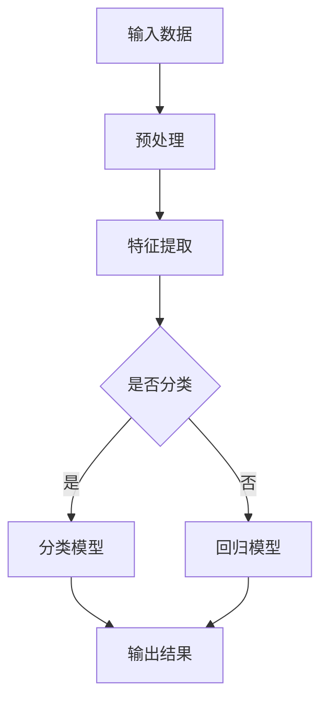

                 

# 李开复：AI 2.0 时代的未来

> **关键词：** AI 2.0、人工智能、深度学习、机器学习、未来趋势、技术变革

> **摘要：** 本文将探讨李开复关于AI 2.0时代的观点，分析AI 2.0的核心概念、技术原理，以及其在各个领域的应用。同时，我们将探讨AI 2.0时代面临的挑战和未来发展趋势，为读者提供对AI技术的深入理解。

## 1. 背景介绍

### 1.1 李开复与AI

李开复，人工智能领域的杰出专家，被誉为“AI天才研究员”。他曾在微软亚洲研究院担任首席研究员，现任世界顶级技术畅销书《人工智能》的作者。李开复对AI技术的贡献和见解在学术界和工业界都享有盛誉。

### 1.2 AI 1.0与AI 2.0

李开复提出了AI 1.0和AI 2.0的概念。AI 1.0是指基于规则的专家系统，它依赖于人类专家制定规则来解决问题。而AI 2.0则是基于深度学习和机器学习的技术，它能够通过自主学习来解决问题。

## 2. 核心概念与联系

### 2.1 深度学习与机器学习

深度学习和机器学习是AI 2.0的核心技术。深度学习是一种模拟人脑神经网络的学习方法，而机器学习则是使计算机能够通过数据学习来完成任务的技术。

### 2.2 Mermaid流程图

为了更好地理解AI 2.0的核心概念，我们可以使用Mermaid流程图来展示深度学习和机器学习的基本架构。以下是一个示例：



在这个流程图中，输入数据经过预处理、特征提取后，被分类或回归模型处理，最终输出结果。

## 3. 核心算法原理 & 具体操作步骤

### 3.1 深度学习算法原理

深度学习算法基于多层神经网络结构，通过反向传播算法来优化模型参数。具体操作步骤如下：

1. **初始化模型参数**：随机初始化权重和偏置。
2. **前向传播**：将输入数据通过网络层进行传递，得到输出。
3. **计算损失**：通过比较输出和真实标签，计算损失值。
4. **反向传播**：将损失值反向传播到网络层，更新模型参数。
5. **迭代优化**：重复步骤2-4，直到损失值达到最小。

### 3.2 机器学习算法原理

机器学习算法的核心是学习数据的特征表示。具体操作步骤如下：

1. **数据预处理**：对原始数据进行清洗、归一化等处理。
2. **特征提取**：使用特征提取算法（如PCA、SVM等）从数据中提取特征。
3. **训练模型**：使用训练数据训练模型。
4. **模型评估**：使用测试数据评估模型性能。
5. **模型优化**：根据评估结果调整模型参数，优化模型性能。

## 4. 数学模型和公式 & 详细讲解 & 举例说明

### 4.1 深度学习数学模型

深度学习中的数学模型主要包括多层感知器（MLP）和卷积神经网络（CNN）。

#### 4.1.1 多层感知器（MLP）

MLP是一种基于神经网络的非线性模型，其数学模型如下：

$$
y = \sigma(W_2 \cdot \sigma(W_1 \cdot x + b_1) + b_2)
$$

其中，$x$为输入数据，$W_1$和$W_2$分别为第一层和第二层的权重矩阵，$b_1$和$b_2$分别为第一层和第二层的偏置向量，$\sigma$为激活函数，常用的激活函数有Sigmoid、ReLU等。

#### 4.1.2 卷积神经网络（CNN）

CNN是一种基于卷积操作的神经网络，其数学模型如下：

$$
h_{ij}^l = \sum_{k=1}^{C_{l-1}} W_{ikj}^l * g_{kl}^{l-1} + b_l
$$

其中，$h_{ij}^l$为第$l$层的第$i$个神经元在第$j$个特征图上的输出，$W_{ikj}^l$为第$l$层的第$i$个神经元与第$l-1$层的第$k$个神经元之间的权重，$g_{kl}^{l-1}$为第$l-1$层的第$k$个神经元输出，$*$为卷积操作，$b_l$为第$l$层的偏置向量。

### 4.2 机器学习数学模型

机器学习中的数学模型主要包括线性回归、逻辑回归和支持向量机（SVM）。

#### 4.2.1 线性回归

线性回归的数学模型如下：

$$
y = \beta_0 + \beta_1 x
$$

其中，$y$为因变量，$x$为自变量，$\beta_0$和$\beta_1$分别为截距和斜率。

#### 4.2.2 逻辑回归

逻辑回归的数学模型如下：

$$
P(y=1) = \frac{1}{1 + e^{-(\beta_0 + \beta_1 x)}}
$$

其中，$P(y=1)$为因变量$y$取值为1的概率，$\beta_0$和$\beta_1$分别为截距和斜率。

#### 4.2.3 支持向量机（SVM）

SVM的数学模型如下：

$$
\min_{\beta, \beta_0} \frac{1}{2} \sum_{i=1}^{n} (\beta \cdot \beta)^2 + C \sum_{i=1}^{n} \xi_i
$$

$$
\text{subject to} \quad y_i (\beta \cdot x_i + \beta_0) \geq 1 - \xi_i, \xi_i \geq 0
$$

其中，$\beta$和$\beta_0$分别为权重和偏置，$C$为正则化参数，$\xi_i$为松弛变量。

## 5. 项目实战：代码实际案例和详细解释说明

### 5.1 开发环境搭建

为了演示深度学习和机器学习算法，我们需要搭建一个简单的开发环境。以下是使用Python和TensorFlow搭建深度学习环境的过程：

1. **安装Python**：下载并安装Python 3.8及以上版本。
2. **安装TensorFlow**：在命令行中执行`pip install tensorflow`。
3. **验证安装**：在Python环境中执行`import tensorflow as tf`，如果没有报错，说明安装成功。

### 5.2 源代码详细实现和代码解读

以下是使用TensorFlow实现一个简单的深度学习模型的示例代码：

```python
import tensorflow as tf

# 定义模型
model = tf.keras.Sequential([
    tf.keras.layers.Dense(128, activation='relu', input_shape=(784,)),
    tf.keras.layers.Dropout(0.2),
    tf.keras.layers.Dense(10)
])

# 编译模型
model.compile(optimizer='adam',
              loss=tf.losses.SparseCategoricalCrossentropy(from_logits=True),
              metrics=['accuracy'])

# 加载数据集
(x_train, y_train), (x_test, y_test) = tf.keras.datasets.mnist.load_data()

# 预处理数据
x_train = x_train.reshape(-1, 784).astype("float32") / 255
x_test = x_test.reshape(-1, 784).astype("float32") / 255

# 训练模型
model.fit(x_train, y_train, epochs=5, batch_size=64)
```

这段代码首先定义了一个简单的深度学习模型，包含一个全连接层和一个Dropout层。然后，编译模型并加载MNIST数据集进行训练。在训练过程中，我们使用了128个神经元和ReLU激活函数，并在最后使用了softmax输出层。

### 5.3 代码解读与分析

1. **定义模型**：使用`tf.keras.Sequential`类定义一个序列模型，其中包含一个全连接层和一个Dropout层。全连接层的输入形状为(784,)，表示每个输入样本包含784个特征。
2. **编译模型**：使用`compile`方法编译模型，指定优化器为adam，损失函数为SparseCategoricalCrossentropy，并且设置了accuracy作为评价指标。
3. **加载数据集**：使用`tf.keras.datasets.mnist.load_data`方法加载数据集。MNIST数据集是一个常用的手写数字识别数据集。
4. **预处理数据**：将数据集的形状调整为(-1, 784)，并将数据类型转换为浮点型。同时，将数据归一化到[0, 1]范围内。
5. **训练模型**：使用`fit`方法训练模型，指定训练轮次为5，批量大小为64。

## 6. 实际应用场景

### 6.1 图像识别

深度学习在图像识别领域有着广泛的应用。例如，卷积神经网络（CNN）在图像分类、目标检测和图像分割等方面取得了显著的成果。

### 6.2 自然语言处理

自然语言处理（NLP）是AI 2.0的重要应用领域之一。深度学习技术，如循环神经网络（RNN）和Transformer模型，已经在机器翻译、文本分类和情感分析等方面取得了突破性进展。

### 6.3 医疗保健

深度学习在医疗保健领域也有很大的潜力。例如，可以使用深度学习算法对医学影像进行诊断，从而提高疾病的检测和诊断准确性。

## 7. 工具和资源推荐

### 7.1 学习资源推荐

1. **《深度学习》（Goodfellow, Bengio, Courville著）**：这是一本关于深度学习的经典教材，详细介绍了深度学习的基本概念、算法和应用。
2. **《Python深度学习》（François Chollet著）**：这本书通过实际案例和代码示例，介绍了使用Python和TensorFlow进行深度学习的实践方法。

### 7.2 开发工具框架推荐

1. **TensorFlow**：TensorFlow是一个开源的深度学习框架，支持各种深度学习模型的构建和训练。
2. **PyTorch**：PyTorch是一个流行的深度学习框架，以其灵活性和动态计算图而著称。

### 7.3 相关论文著作推荐

1. **“A Brief History of Deep Learning”**：这篇文章回顾了深度学习的发展历程，对深度学习的演进提供了深入的见解。
2. **“Deep Learning Book”**：这是深度学习领域的经典著作，由深度学习领域的三位大师撰写，内容全面、系统。

## 8. 总结：未来发展趋势与挑战

### 8.1 发展趋势

1. **模型规模和计算能力**：随着模型规模的扩大和计算能力的提升，深度学习将取得更多的突破。
2. **跨领域应用**：深度学习将在更多领域得到应用，如生物医学、金融科技和智能交通等。
3. **可解释性和可靠性**：深度学习的可解释性和可靠性将得到广泛关注，以应对可能的风险和挑战。

### 8.2 挑战

1. **数据隐私和安全性**：随着数据量的增加，如何保护数据隐私和安全将成为一个重要问题。
2. **算法公平性和透明性**：如何确保算法的公平性和透明性，减少偏见和歧视，是一个亟待解决的问题。
3. **监管与伦理**：如何在确保技术发展的同时，遵守相关法律法规和伦理规范，是一个挑战。

## 9. 附录：常见问题与解答

### 9.1 什么是深度学习？

深度学习是一种基于多层神经网络的学习方法，通过自主学习从数据中提取特征，并用于预测或分类任务。

### 9.2 什么是机器学习？

机器学习是一种使计算机通过数据学习来完成任务的技术。它包括监督学习、无监督学习和强化学习等不同类型。

### 9.3 深度学习和机器学习的区别是什么？

深度学习是机器学习的一种类型，它使用多层神经网络来提取数据中的特征。而机器学习是一个更广泛的领域，包括深度学习和其他类型的学习方法。

## 10. 扩展阅读 & 参考资料

1. **李开复，《人工智能》**：这是一本关于人工智能的权威著作，详细介绍了人工智能的基本概念、应用和发展趋势。
2. **“Deep Learning”**：这是一篇关于深度学习的经典论文，对深度学习的基本原理和应用进行了深入的探讨。
3. **“The Future of Humanity: Terraforming Mars, Interstellar Travel, Immortality, and Our Destiny Beyond Earth”**：这本书探讨了人工智能和未来科技的发展，对未来社会和人类命运进行了思考。

