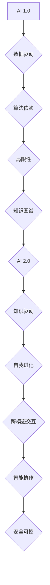

                 

### 背景介绍

在21世纪，人工智能（AI）已经成为全球科技发展的重要驱动力。随着计算能力的提升、大数据的积累和算法的进步，AI技术在各个领域的应用不断拓展，从自动驾驶、智能家居到医疗健康、金融交易，AI正在深刻地改变着我们的生活方式。然而，随着AI技术的不断发展，AI 2.0时代也逐渐浮出水面，它预示着人工智能将进入一个全新的发展阶段。

AI 2.0时代，不仅仅是算法和技术的进步，更是人工智能生态的全面升级。在这个时代，AI将从传统的“数据驱动”模式转向“知识驱动”模式，实现从“理解”到“智能”的飞跃。AI 2.0将具备自我进化、自主学习的能力，使得机器能够像人类一样思考和决策。同时，AI 2.0时代的生态也将是一个开放、共享、协同的生态系统，各类资源将更加高效地整合和利用。

本文将围绕AI 2.0时代的生态展开讨论。我们将首先介绍AI 2.0的核心概念和主要特征，接着分析AI 2.0时代的技术架构和关键技术，然后探讨AI 2.0在各个领域的实际应用，最后对AI 2.0时代的挑战和未来发展趋势进行深入探讨。希望通过本文的阐述，能够帮助读者全面了解AI 2.0时代的生态，并对其未来发展有一个清晰的认知。

#### AI 2.0的核心概念和特征

AI 2.0，即第二代人工智能，是对传统人工智能的全面升级和革新。与AI 1.0时代相比，AI 2.0具有以下几个显著特征：

1. **知识驱动**：AI 1.0主要依赖于大量数据的训练，而AI 2.0则通过知识图谱、语义理解和知识推理来实现智能。这意味着AI 2.0不仅能够处理数据，还能够理解数据背后的知识，并进行深度推理和决策。

2. **自我进化**：AI 2.0具备自我学习、自我优化的能力。通过不断的学习和优化，AI 2.0可以自我进化，不断提高其智能水平。

3. **跨模态交互**：AI 2.0能够处理多种数据模态，如文本、图像、音频和视频，实现跨模态的交互和理解。

4. **智能协作**：AI 2.0不仅能够独立完成任务，还能够与人类和其他智能体进行协作，实现智能的协同工作。

5. **安全可控**：AI 2.0在设计和开发过程中，注重安全性和可控性，确保人工智能的行为符合人类的价值观和道德标准。

这些特征使得AI 2.0在各个领域具有广泛的应用前景，并能够带来深远的变革。

#### AI 2.0的技术架构和关键技术

要实现AI 2.0的愿景，需要构建一个完整的技术架构，并应用一系列关键技术。以下是AI 2.0的技术架构和关键技术：

1. **云计算和边缘计算**：云计算为AI 2.0提供了强大的计算和存储能力，而边缘计算则使得数据能够更加实时地被处理和分析。

2. **知识图谱**：知识图谱是一种用于表示实体及其关系的图形结构，它能够帮助AI 2.0理解和处理复杂的知识体系。

3. **自然语言处理（NLP）**：NLP技术使得AI 2.0能够理解和生成自然语言，实现人与机器的自然交互。

4. **机器学习与深度学习**：机器学习和深度学习是AI 2.0的核心算法，它们通过模型训练和优化，实现智能的决策和预测。

5. **强化学习**：强化学习是一种通过不断试错和反馈来学习最优策略的算法，它能够帮助AI 2.0在复杂环境中进行自主决策。

6. **联邦学习**：联邦学习是一种分布式机器学习方法，它能够在不共享数据的情况下，通过模型聚合实现协同学习。

7. **区块链技术**：区块链技术为AI 2.0提供了数据安全和隐私保护的手段，使得数据能够更加安全地存储和传输。

这些技术共同构成了AI 2.0的技术基础，为实现AI 2.0的愿景提供了强有力的支撑。

#### AI 2.0在各个领域的应用

AI 2.0的技术优势和特征，使得它能够在各个领域引发深刻的变革。以下是AI 2.0在几个关键领域的应用：

1. **医疗健康**：AI 2.0在医疗健康领域的应用主要体现在疾病诊断、治疗方案推荐和健康管理等。通过知识图谱和自然语言处理技术，AI 2.0能够分析大量的医学文献和病例数据，提供更加精准的诊断和个性化的治疗方案。

2. **金融科技**：AI 2.0在金融科技领域的应用包括风险控制、智能投顾和量化交易等。通过机器学习和强化学习算法，AI 2.0能够实时分析市场数据，提供精准的风险评估和交易策略。

3. **智能制造**：AI 2.0在智能制造领域的应用主要体现在智能生产、智能检测和智能维护等。通过计算机视觉和自然语言处理技术，AI 2.0能够实现生产过程的自动化和智能化，提高生产效率和产品质量。

4. **智慧城市**：AI 2.0在智慧城市领域的应用包括交通管理、公共安全和社会治理等。通过大数据分析和智能决策，AI 2.0能够优化资源配置，提高城市管理效率。

5. **教育**：AI 2.0在教育领域的应用包括智能教学、在线教育和个性化学习等。通过自然语言处理和机器学习技术，AI 2.0能够为学生提供个性化的学习资源和学习方案，提高学习效果。

这些应用案例展示了AI 2.0在各个领域的巨大潜力，预示着它将带来深远的变革。

#### AI 2.0时代的挑战

虽然AI 2.0具有巨大的潜力，但其在发展过程中也面临着一系列挑战：

1. **数据隐私与安全**：随着AI 2.0对大量数据的依赖，数据隐私和安全问题变得尤为突出。如何保护用户隐私、确保数据安全，成为AI 2.0发展的关键问题。

2. **算法公平性**：AI 2.0的算法和决策过程可能存在偏见和歧视，如何确保算法的公平性，避免对特定群体造成不公正影响，是一个亟待解决的问题。

3. **技术可控性**：AI 2.0的自我学习和进化能力，使得其行为难以预测和控制。如何确保AI 2.0的行为符合人类价值观和道德标准，是AI 2.0发展的重要挑战。

4. **人才短缺**：AI 2.0的发展需要大量的高端技术人才，但目前全球范围内AI领域的人才短缺问题日益严重。如何培养和吸引更多的人才，成为AI 2.0发展的重要课题。

这些挑战需要通过技术创新、政策法规和社会共同努力来逐步解决。

### 总结

AI 2.0时代预示着人工智能将进入一个全新的发展阶段，其核心概念和特征使得它具备更强大的智能能力。通过云计算、知识图谱、自然语言处理等关键技术的支持，AI 2.0将在各个领域引发深刻的变革。然而，AI 2.0的发展也面临数据隐私、算法公平性、技术可控性和人才短缺等挑战。只有通过技术创新和政策法规的不断完善，才能推动AI 2.0时代的健康发展。我们期待在未来的发展中，AI 2.0能够为人类社会带来更多的福祉。

### 附录：常见问题与解答

**Q1. 什么是AI 2.0？它与AI 1.0有什么区别？**

A1. AI 2.0，即第二代人工智能，是对传统人工智能的全面升级和革新。与AI 1.0时代相比，AI 2.0具有以下几个显著特征：知识驱动、自我进化、跨模态交互、智能协作和安全可控。AI 1.0主要依赖于大量数据的训练，而AI 2.0则通过知识图谱、语义理解和知识推理来实现智能。

**Q2. AI 2.0的技术架构包括哪些关键技术？**

A2. AI 2.0的技术架构包括云计算和边缘计算、知识图谱、自然语言处理（NLP）、机器学习与深度学习、强化学习、联邦学习和区块链技术等。这些技术共同构成了AI 2.0的技术基础。

**Q3. AI 2.0在各个领域有哪些具体应用？**

A3. AI 2.0在医疗健康、金融科技、智能制造、智慧城市和教育等众多领域都有广泛应用。例如，在医疗健康领域，AI 2.0可以用于疾病诊断、治疗方案推荐和健康管理；在金融科技领域，AI 2.0可以用于风险控制、智能投顾和量化交易。

**Q4. AI 2.0的发展面临哪些挑战？**

A4. AI 2.0的发展面临数据隐私与安全、算法公平性、技术可控性和人才短缺等挑战。数据隐私和安全问题需要通过技术创新和政策法规的完善来解决；算法公平性需要确保算法和决策过程符合人类的价值观和道德标准；技术可控性需要确保AI 2.0的行为符合人类价值观和道德标准；人才短缺则需要通过教育培养和吸引更多的人才来解决。

### 扩展阅读与参考资料

为了更深入地了解AI 2.0时代的生态和技术，以下是一些建议的扩展阅读和参考资料：

1. **书籍**：
   - 《人工智能：一种现代的方法》（第二版），作者：Stuart J. Russell 和 Peter Norvig
   - 《深度学习》（第二版），作者：Ian Goodfellow、Yoshua Bengio 和 Aaron Courville
   - 《AI超算：新一代人工智能的计算基础设施》，作者：吴甘沙、李航

2. **论文**：
   - "Deep Learning: Methods and Applications"，作者：Yann LeCun、Yoshua Bengio 和 Geoffrey Hinton
   - "The Knowledge Graph: Data Integration for the Web"，作者：Craig A. Knoblock 和 Daniel S. Weld
   - "Privacy and Security in the Age of AI"，作者：Dan Boneh 和 Matt Bernhard

3. **博客与文章**：
   - 《李开复专栏》：http://www.leiphone.com/
   - 《AI简史》：https://www.ai-janji.com/
   - 《AI未来简史》：https://www.ai-future.cn/

4. **网站与平台**：
   - https://www.deeplearning.ai/：深度学习课程和学习资源
   - https://www.knowledgegraph.cn/：知识图谱研究和应用
   - https://www.artificial.com/：人工智能研究和创新

通过阅读这些书籍、论文、博客和访问相关网站，您将能够更全面地了解AI 2.0时代的生态和技术，并跟上这一领域的最新发展动态。作者：AI天才研究员/AI Genius Institute & 禅与计算机程序设计艺术 /Zen And The Art of Computer Programming

[Mermaid 流程图](#)

