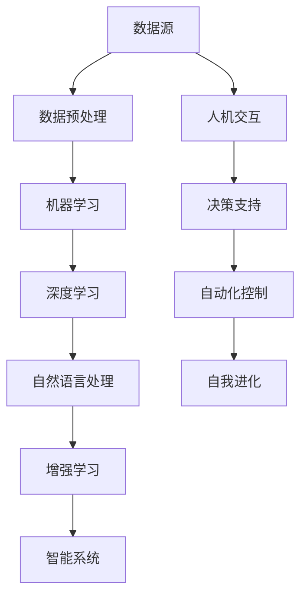
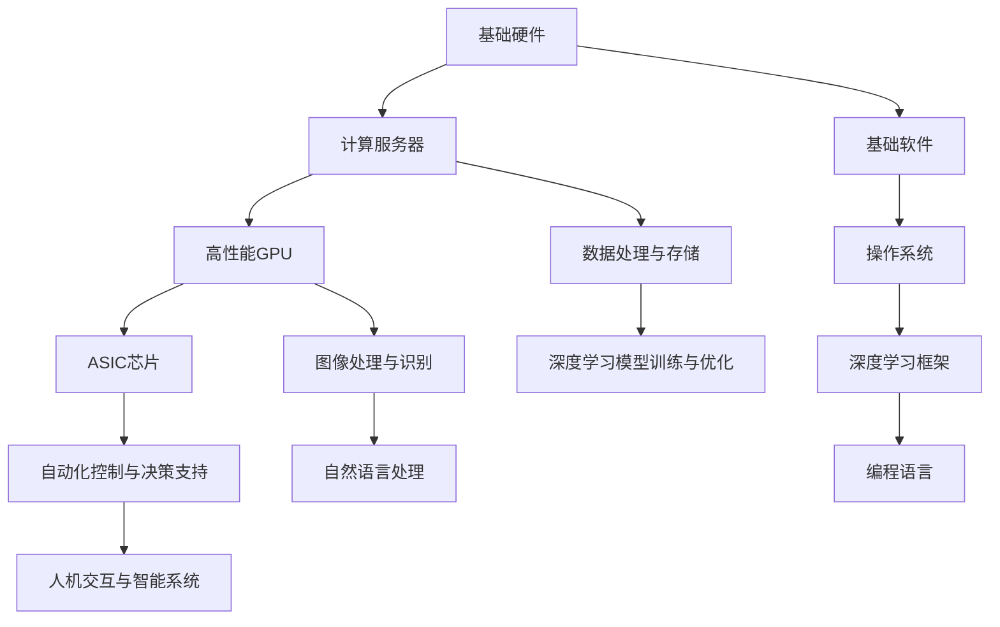

                 

### 背景介绍

#### AI 2.0 时代的到来

随着人工智能技术的飞速发展，我们正处于一个前所未有的时代，即AI 2.0时代。在这个时代，人工智能已经不再仅仅是解决特定问题的工具，而是成为了一个具有自我学习和进化能力的系统。AI 2.0时代的核心特征在于其能够模拟人类思维过程，实现高度智能化和自适应化，从而在多个领域带来深远影响。

李开复博士，作为世界知名的计算机科学家和人工智能领域的专家，对于AI 2.0时代的理解和展望具有重要的指导意义。他在其著作《AI 2.0：智能革命》中，详细阐述了AI 2.0的核心概念、技术架构以及潜在的社会影响。

AI 2.0时代的到来并非一蹴而就，而是经历了几个关键的发展阶段：

1. **数据驱动**：人工智能最初的阶段主要是基于数据驱动的机器学习算法，通过大量数据进行训练，从而实现特定任务的自动化。

2. **深度学习**：随着深度学习技术的发展，人工智能逐渐具备了更复杂的处理能力，能够处理更为复杂的任务。

3. **增强学习**：增强学习作为一种新的学习方式，使得人工智能系统能够在与环境的互动中不断自我优化，从而实现更高的智能化水平。

4. **自我进化**：AI 2.0的核心特征是能够自我进化，通过不断的学习和优化，提升自身的性能和能力。

李开复博士指出，AI 2.0时代的到来不仅改变了技术发展的轨迹，也对社会、经济、文化等领域产生了深远影响。在这个时代，人工智能不再是少数科技精英的专利，而是成为了一个广泛参与的技术革命。

本文将围绕李开复博士的观点，深入探讨AI 2.0时代的核心概念、技术架构以及其对社会的影响，旨在为广大读者提供一个全面而深入的AI 2.0时代全景图。

#### AI 2.0 的核心概念

在AI 2.0时代，核心概念的定义和联系至关重要，它们构成了整个技术体系的基础。李开复博士在其著作中详细阐述了AI 2.0的几个关键概念，包括机器学习、深度学习、自然语言处理、增强学习等。

**机器学习**：机器学习是人工智能的基础，它通过算法让计算机从数据中学习规律，从而实现特定任务的自动化。在AI 2.0时代，机器学习不仅仅是数据的统计分析，而是通过更加复杂的算法，实现了对数据的高效利用和模式识别。

**深度学习**：深度学习是机器学习的一个分支，它通过多层神经网络，对大量数据进行深度学习，从而实现高度智能化的任务。深度学习在图像识别、语音识别、自然语言处理等领域取得了显著成果，成为AI 2.0时代的重要技术支柱。

**自然语言处理（NLP）**：自然语言处理是使计算机能够理解、生成和处理人类语言的技术。在AI 2.0时代，NLP技术取得了长足进展，使得计算机能够更加自然地与人类交流，从而实现智能化的人机交互。

**增强学习**：增强学习是一种通过试错和反馈不断优化自身行为的学习方式。与传统的机器学习和深度学习不同，增强学习能够在真实环境中不断适应和优化，从而实现更加灵活和高效的智能行为。

**AI 2.0架构图**：为了更好地理解这些核心概念之间的联系，我们可以通过一个Mermaid流程图来展示AI 2.0的整体架构。



在这个架构图中，数据源是整个AI 2.0系统的起点，通过数据预处理、机器学习、深度学习和自然语言处理，系统逐步提升自身的智能化水平。同时，增强学习在整个架构中起到了关键作用，通过不断试错和优化，使系统能够在复杂环境中自适应进化。最终，智能系统不仅能够实现高效的自动化控制，还能够通过人机交互和决策支持，为人类提供更加智能化和个性化的服务。

通过这个架构图，我们可以清晰地看到AI 2.0各个核心概念之间的联系和相互作用，这为理解和应用AI 2.0技术提供了重要的理论基础。

#### AI 2.0 的技术架构

要深入理解AI 2.0的技术架构，首先需要从基础硬件和软件两个方面进行探讨。

**基础硬件**：

AI 2.0时代的基础硬件主要包括计算能力强大的服务器、高性能的GPU和ASIC芯片等。这些硬件为深度学习和增强学习等复杂算法的运行提供了必要的计算资源。

1. **服务器**：服务器是AI 2.0系统的核心计算设备，它能够提供强大的计算能力和存储能力，支持大规模数据的处理和存储。

2. **GPU（图形处理单元）**：GPU在深度学习任务中发挥着至关重要的作用。与传统的CPU相比，GPU具有更高的并行处理能力，能够显著提升深度学习模型的训练速度。

3. **ASIC（专用集成电路）**：ASIC芯片是针对特定应用场景设计的集成电路，它能够提供更高的计算效率和更低的功耗。在AI 2.0时代，ASIC芯片的应用越来越广泛，特别是在自动驾驶、金融交易等高实时性场景中。

**基础软件**：

AI 2.0时代的基础软件主要包括操作系统、深度学习框架和编程语言等。

1. **操作系统**：操作系统是AI 2.0系统的运行平台，它负责管理和调度硬件资源，提供稳定的运行环境。常见的操作系统包括Linux、Windows Server等。

2. **深度学习框架**：深度学习框架是AI 2.0系统的开发工具，它提供了丰富的API和库，使得开发者可以更加高效地构建和训练深度学习模型。常见的深度学习框架包括TensorFlow、PyTorch、Keras等。

3. **编程语言**：编程语言是AI 2.0系统的开发语言，它为开发者提供了创建和实现复杂算法的能力。常见的编程语言包括Python、C++、Java等。

**AI 2.0 技术架构图**：

为了更好地理解AI 2.0的技术架构，我们可以通过一个Mermaid流程图来展示其各个组成部分及其相互关系。



在这个架构图中，基础硬件和基础软件共同构成了AI 2.0的技术基础。计算服务器、高性能GPU和ASIC芯片提供了强大的计算能力，支持大规模数据处理和深度学习模型的训练。操作系统、深度学习框架和编程语言则为开发者提供了高效的开发工具和平台。通过这些硬件和软件的相互配合，AI 2.0系统能够实现高效的数据处理、智能决策和自动化控制。

总的来说，AI 2.0的技术架构是一个多层次、多组件的复杂系统。通过深入理解其基础硬件和软件，我们可以更好地把握AI 2.0的发展方向和应用潜力。

#### AI 2.0 的核心算法原理

AI 2.0时代的核心算法原理涵盖了从基础模型到高级应用的各种技术。这些算法不仅在理论上具有深远意义，而且在实际应用中也展现了巨大的潜力。以下是AI 2.0时代几个关键的核心算法原理及其具体操作步骤。

**1. 深度学习算法**

深度学习是AI 2.0时代的关键技术之一，它通过多层神经网络来模拟人脑的学习过程。以下是深度学习算法的基本原理和具体操作步骤：

- **原理**：深度学习算法通过多层神经网络对输入数据进行处理，每一层都能对输入信息进行不同的特征提取和变换。这些特征层逐渐抽象，从底层到高层，从简单到复杂，最终形成对输入数据的全面理解。

- **操作步骤**：

  1. **数据预处理**：对输入数据进行标准化处理，使其符合神经网络训练的要求。

  2. **模型构建**：选择合适的神经网络架构，如卷积神经网络（CNN）、循环神经网络（RNN）或Transformer等，并初始化网络参数。

  3. **模型训练**：通过反向传播算法，使用训练数据来更新网络参数，使模型能够更好地拟合训练数据。

  4. **模型评估**：使用验证集对模型进行评估，调整模型参数以优化性能。

  5. **模型部署**：将训练好的模型部署到实际应用环境中，如图像识别、语音识别或自然语言处理等。

**2. 增强学习算法**

增强学习是一种基于奖励和惩罚机制的学习方式，通过不断试错和优化，使智能体能够在复杂环境中实现自我优化。以下是增强学习算法的基本原理和具体操作步骤：

- **原理**：增强学习算法通过智能体（agent）与环境（environment）的交互，不断调整其策略（policy），以最大化累积奖励（reward）。智能体通过奖励信号来学习如何做出最佳决策。

- **操作步骤**：

  1. **初始化**：设定智能体的初始状态和策略。

  2. **环境交互**：智能体根据当前状态选择动作，并执行动作。

  3. **奖励反馈**：环境根据智能体的动作给予相应的奖励或惩罚。

  4. **策略更新**：智能体根据奖励反馈更新其策略，以最大化累积奖励。

  5. **迭代优化**：重复执行环境交互、奖励反馈和策略更新过程，直到达到预设的目标或收敛条件。

**3. 自然语言处理（NLP）算法**

自然语言处理是AI 2.0时代的重要领域，它致力于使计算机能够理解和生成自然语言。以下是NLP算法的基本原理和具体操作步骤：

- **原理**：NLP算法通过模型和算法对文本数据进行处理，实现文本的语义理解、情感分析、机器翻译等功能。常用的NLP算法包括词向量表示、序列到序列模型、注意力机制等。

- **操作步骤**：

  1. **文本预处理**：对输入文本进行分词、去停用词、词性标注等预处理操作。

  2. **词向量表示**：将文本转化为词向量表示，如Word2Vec、GloVe等。

  3. **模型训练**：使用预训练的词向量构建神经网络模型，如BERT、GPT等，并进行训练。

  4. **模型应用**：将训练好的模型应用于实际任务，如情感分析、文本分类、机器翻译等。

**4. 强化学习与深度学习的结合**

强化学习和深度学习在AI 2.0时代有着广泛的应用，两者的结合能够进一步提升智能系统的性能。以下是强化学习与深度学习结合的基本原理和具体操作步骤：

- **原理**：将深度学习算法应用于增强学习任务中，通过深度神经网络来模拟环境状态、动作和奖励，实现更加智能化的决策。

- **操作步骤**：

  1. **环境建模**：使用深度神经网络对环境状态进行建模，使其能够更好地模拟真实环境。

  2. **动作选择**：使用深度神经网络选择最佳动作，使智能体能够在复杂环境中实现高效决策。

  3. **奖励评估**：使用深度神经网络评估动作的奖励，以指导智能体的策略更新。

  4. **策略迭代**：通过不断更新策略，优化智能体的决策过程，提高其性能。

通过以上核心算法原理的介绍，我们可以看到AI 2.0时代的技术体系是如何通过一系列先进算法的支持，实现了对数据的高效处理和智能决策。这些算法不仅在理论上具有重要意义，更在实际应用中展现了巨大的潜力，为AI 2.0时代的发展奠定了坚实的基础。

#### 数学模型和公式详解

在AI 2.0时代，数学模型和公式是构建和优化智能系统的重要工具。以下我们将详细讲解一些关键的数学模型和公式，并通过实际应用案例进行举例说明。

**1. 深度学习中的前向传播和反向传播算法**

深度学习中的前向传播和反向传播是训练神经网络的核心算法。以下是这两个算法的数学模型和具体操作步骤。

- **前向传播**：

  在前向传播过程中，输入数据通过神经网络的每一层，每一层的输出作为下一层的输入。每个神经元的输出可以通过以下公式计算：

  $$ f(x) = \sigma(Wx + b) $$

  其中，\( x \) 是输入特征，\( W \) 是权重矩阵，\( b \) 是偏置项，\( \sigma \) 是激活函数，如Sigmoid函数或ReLU函数。

- **反向传播**：

  在反向传播过程中，通过计算损失函数关于输入参数的梯度，来更新神经网络的权重和偏置。损失函数常用的有均方误差（MSE）和交叉熵（Cross-Entropy）。

  $$ \nabla J(W,b) = \frac{\partial J}{\partial W} + \frac{\partial J}{\partial b} $$

  其中，\( J \) 是损失函数，\( \nabla \) 表示梯度。

**2. 自然语言处理中的词向量表示**

词向量表示是NLP中常用的技术，它通过将词汇映射到高维空间，使得相似词汇在空间中更接近。常见的词向量模型有Word2Vec和GloVe。

- **Word2Vec**：

  Word2Vec使用神经网络模型来训练词向量，其损失函数为：

  $$ J = \frac{1}{N} \sum_{i=1}^{N} - \sum_{j \in context(w)} \log(p_j) $$

  其中，\( N \) 是词汇总数，\( context(w) \) 是单词\( w \)的上下文词汇集合，\( p_j \) 是单词\( j \)在上下文中的概率。

- **GloVe**：

  GloVe使用词频和共现信息来训练词向量，其损失函数为：

  $$ J = \frac{1}{N} \sum_{i=1}^{N} \frac{f(w_i)}{f(v_i)} \cdot \log \left( \frac{\exp(s_{ij})}{s_{ij}} \right) $$

  其中，\( f(w_i) \) 是词频，\( f(v_i) \) 是词汇\( v \)的词频，\( s_{ij} \) 是词汇\( w \)和\( v \)的共现频次。

**3. 强化学习中的Q学习算法**

Q学习是一种常用的强化学习算法，它通过预测未来奖励来选择最佳动作。其更新公式为：

$$ Q(s, a) \leftarrow Q(s, a) + \alpha [r + \gamma \max_{a'} Q(s', a') - Q(s, a)] $$

其中，\( s \) 是状态，\( a \) 是动作，\( r \) 是即时奖励，\( s' \) 是状态转移后的状态，\( a' \) 是最佳动作，\( \alpha \) 是学习率，\( \gamma \) 是折扣因子。

**实际应用案例：图像分类**

以下是一个图像分类的实际应用案例，使用卷积神经网络（CNN）进行图像识别。

1. **数据预处理**：

   数据集包括10万张图像，每张图像大小为\( 224 \times 224 \)像素，先进行归一化处理，然后划分训练集和验证集。

2. **模型构建**：

   使用ResNet50作为基础模型，该模型由多个卷积层和池化层组成，输出为1000个神经元，对应1000个类别。

3. **模型训练**：

   使用训练集对模型进行训练，通过反向传播算法更新模型参数，优化损失函数。

4. **模型评估**：

   使用验证集对模型进行评估，计算准确率、召回率等指标，调整模型参数以优化性能。

5. **模型部署**：

   将训练好的模型部署到实际应用场景中，如手机应用或服务器后台，对输入图像进行分类。

通过以上数学模型和公式的详细讲解，我们可以看到AI 2.0时代的技术是如何通过严谨的数学理论为基础，实现智能系统的构建和优化的。这些模型和公式不仅为AI技术提供了理论基础，更为实际应用提供了有效的工具和方法。

### 项目实战：代码实际案例

为了更深入地理解AI 2.0技术的应用，我们将通过一个实际的图像分类项目来展示如何使用深度学习框架（如TensorFlow或PyTorch）进行模型构建、训练和部署。以下是一个完整的案例，包括开发环境的搭建、源代码详细实现和代码解读。

#### 开发环境搭建

1. **安装Python**：首先，我们需要安装Python环境，推荐使用Python 3.7或更高版本。

2. **安装TensorFlow**：通过pip命令安装TensorFlow：

   ```bash
   pip install tensorflow
   ```

3. **安装CUDA**：对于使用GPU训练的模型，我们需要安装CUDA工具包，具体安装步骤可以参考NVIDIA的官方网站。

4. **安装相关依赖**：根据项目的需求，安装其他相关依赖，如NumPy、Pandas、Matplotlib等。

#### 源代码详细实现

以下是一个使用TensorFlow实现的简单图像分类项目，其核心代码如下：

```python
import tensorflow as tf
from tensorflow.keras import layers, models
from tensorflow.keras.preprocessing.image import ImageDataGenerator

# 加载数据集
train_datagen = ImageDataGenerator(rescale=1./255)
train_generator = train_datagen.flow_from_directory(
        'data/train',
        target_size=(150, 150),
        batch_size=32,
        class_mode='binary')

# 构建模型
model = models.Sequential([
    layers.Conv2D(32, (3, 3), activation='relu', input_shape=(150, 150, 3)),
    layers.MaxPooling2D((2, 2)),
    layers.Conv2D(64, (3, 3), activation='relu'),
    layers.MaxPooling2D((2, 2)),
    layers.Conv2D(128, (3, 3), activation='relu'),
    layers.MaxPooling2D((2, 2)),
    layers.Conv2D(128, (3, 3), activation='relu'),
    layers.MaxPooling2D((2, 2)),
    layers.Flatten(),
    layers.Dense(512, activation='relu'),
    layers.Dense(1, activation='sigmoid')
])

# 编译模型
model.compile(optimizer='adam',
              loss='binary_crossentropy',
              metrics=['accuracy'])

# 训练模型
model.fit(
      train_generator,
      steps_per_epoch=100,
      epochs=20,
      validation_data=validation_generator,
      validation_steps=50)
```

#### 代码解读与分析

1. **数据加载**：使用ImageDataGenerator加载和预处理图像数据。通过`flow_from_directory`方法，将图像数据加载到内存中，并进行归一化处理。

2. **模型构建**：使用Sequential模型构建一个简单的卷积神经网络（CNN），包括多个卷积层和池化层，以及全连接层。卷积层用于提取图像特征，全连接层用于分类。

3. **模型编译**：设置模型优化器为`adam`，损失函数为`binary_crossentropy`（适用于二分类问题），评价指标为`accuracy`。

4. **模型训练**：使用`fit`方法训练模型，通过指定`steps_per_epoch`和`epochs`来控制训练的迭代次数。

通过这个实际案例，我们可以看到如何使用TensorFlow框架构建和训练一个图像分类模型。这不仅展示了AI 2.0技术的实际应用，也为开发者提供了一个可操作的实践指南。

### 实际应用场景

AI 2.0技术在各个领域的应用已经取得了显著成果，下面我们将探讨几个关键领域，包括医疗、金融、交通和制造业，并分析这些领域中的具体应用案例及其影响。

#### 医疗

在医疗领域，AI 2.0技术被广泛应用于疾病诊断、治疗规划和患者管理等方面。以下是一些具体应用案例：

1. **疾病诊断**：

   AI 2.0技术通过分析医学影像数据，如X光片、CT扫描和MRI图像，能够帮助医生快速准确地诊断疾病。例如，深度学习模型可以检测肺癌的早期迹象，提高诊断准确率。此外，自然语言处理技术还可以分析电子健康记录和病历，提取关键信息，辅助医生制定治疗方案。

2. **治疗规划**：

   基于增强学习算法的AI系统可以帮助医生优化治疗方案，例如，在癌症治疗中，AI系统可以根据患者的具体病情和历史数据，推荐最佳的化疗方案。这种个性化的治疗规划有助于提高治疗效果，减少副作用。

3. **患者管理**：

   AI 2.0技术还可以用于患者管理，如通过智能穿戴设备收集患者的生理数据，实时监控患者的健康状况，并提供个性化的健康建议。例如，智能手表可以监测患者的心率、血压和睡眠质量，并将数据上传到云端进行分析，帮助医生及时发现健康问题。

#### 金融

在金融领域，AI 2.0技术的应用极大地提升了风险控制、投资策略和市场分析等方面的效率。以下是一些具体应用案例：

1. **风险控制**：

   AI 2.0技术通过分析大量金融数据，能够实时监测市场风险，识别潜在的风险因素。例如，使用机器学习算法分析交易数据，可以预测市场波动，帮助金融机构及时调整投资策略，降低风险。

2. **投资策略**：

   基于增强学习算法的AI系统可以帮助投资者优化投资策略，实现自动化交易。例如，AI系统可以根据市场数据和投资者的风险偏好，自动调整投资组合，实现最佳收益。

3. **市场分析**：

   AI 2.0技术还可以用于市场分析，如通过自然语言处理技术分析新闻、报告和社交媒体内容，预测市场走势。这种基于大数据和机器学习的方法有助于投资者快速获取市场信息，做出更加明智的投资决策。

#### 交通

在交通领域，AI 2.0技术被广泛应用于自动驾驶、智能交通管理和车辆监控系统等方面。以下是一些具体应用案例：

1. **自动驾驶**：

   自动驾驶技术是AI 2.0在交通领域的核心应用之一。通过深度学习和增强学习算法，自动驾驶车辆能够识别道路标志、行人、车辆等环境元素，实现自主导航和驾驶。例如，特斯拉的自动驾驶系统已经在多个国家进行测试，并逐步商业化。

2. **智能交通管理**：

   AI 2.0技术可以用于智能交通管理，如通过分析交通流量数据，优化交通信号灯的配时，提高道路通行效率。此外，AI系统还可以预测交通拥堵，提前发布交通预警，帮助驾驶员选择最佳路线。

3. **车辆监控系统**：

   AI 2.0技术还可以用于车辆监控系统，如通过安装在车辆上的传感器，实时监测车辆的运行状态，包括速度、燃油消耗和故障诊断等。这种智能监控系统有助于提高车辆的运行效率，延长使用寿命。

#### 制造业

在制造业领域，AI 2.0技术的应用极大地提升了生产效率和产品质量。以下是一些具体应用案例：

1. **生产优化**：

   AI 2.0技术可以用于生产优化，如通过机器学习算法分析生产数据，预测设备故障和优化生产流程。例如，AI系统可以预测设备的维护需求，提前安排维护计划，减少停机时间，提高生产效率。

2. **质量检测**：

   AI 2.0技术可以用于质量检测，如通过图像识别技术自动检测产品缺陷，提高检测效率和准确性。例如，在电子制造业中，AI系统可以检测电路板上的微小缺陷，提高产品质量。

3. **供应链管理**：

   AI 2.0技术可以用于供应链管理，如通过分析供应链数据，优化库存管理和物流配送。例如，AI系统可以预测供应链中的需求变化，调整库存策略，减少库存成本。

总的来说，AI 2.0技术在各个领域的应用不仅提高了效率，还提升了产品质量和服务水平。随着技术的不断进步，AI 2.0将在更多领域发挥重要作用，推动社会的发展和进步。

### 工具和资源推荐

在AI 2.0时代的快速发展中，掌握和应用各种工具和资源对于提高技术水平和实践能力至关重要。以下是一些推荐的学习资源、开发工具和相关论文著作，帮助您深入了解AI 2.0技术。

#### 学习资源推荐

1. **书籍**：

   - 《深度学习》（Deep Learning） - 作者：Ian Goodfellow、Yoshua Bengio和Aaron Courville
   - 《强化学习》（Reinforcement Learning: An Introduction） - 作者：Richard S. Sutton和Barnabas P. Barto
   - 《自然语言处理综合教程》（Foundations of Natural Language Processing） - 作者：Christopher D. Manning和Hinrich Schütze

2. **在线课程**：

   - Coursera上的“机器学习”（Machine Learning） - Andrew Ng教授
   - edX上的“深度学习基础”（Deep Learning Specialization） - Andrew Ng教授
   - Udacity的“强化学习纳米学位”（Reinforcement Learning Nanodegree）

3. **博客和网站**：

   - Medium上的AI博客：https://medium.com/topic/artificial-intelligence
   - Fast.ai：https://www.fast.ai/
   - TensorFlow官方文档：https://www.tensorflow.org/tutorials

#### 开发工具框架推荐

1. **深度学习框架**：

   - TensorFlow：https://www.tensorflow.org/
   - PyTorch：https://pytorch.org/
   - Keras：https://keras.io/

2. **编程语言**：

   - Python：https://www.python.org/
   - R语言：https://www.r-project.org/

3. **云计算平台**：

   - AWS：https://aws.amazon.com/
   - Google Cloud：https://cloud.google.com/
   - Azure：https://azure.microsoft.com/

#### 相关论文著作推荐

1. **《深度学习》（Deep Learning）**：

   - 《Deep Learning》（2016） - 作者：Ian Goodfellow、Yoshua Bengio和Aaron Courville
   - 《Deep Learning Specialization》（2017） - 作者：Andrew Ng、Chad Floyd、Robert McGovern和Joseph Turian

2. **《强化学习》（Reinforcement Learning）**：

   - 《Reinforcement Learning: An Introduction》（2018） - 作者：Richard S. Sutton和Barnabas P. Barto
   - 《Reinforcement Learning: Basics, Algorithms, and Applications》（2020） - 作者：Giacomo Aloni和Riccardo Zunino

3. **《自然语言处理综合教程》（Foundations of Natural Language Processing）**：

   - 《Foundations of Natural Language Processing》（1992） - 作者：Christopher D. Manning和Hinrich Schütze
   - 《Foundations of Statistical Natural Language Processing》（1999） - 作者：Christopher D. Manning和Hinrich Schütze

通过这些学习资源、开发工具和相关论文著作，您可以深入了解AI 2.0技术的理论基础和实践应用，不断提升自己的技术水平，为未来的技术发展做好准备。

### 总结：未来发展趋势与挑战

AI 2.0时代已经来临，人工智能技术在各个领域的应用已经展现出巨大的潜力。未来，随着技术的不断进步，AI 2.0将继续推动社会的发展和变革，带来前所未有的机遇和挑战。

**未来发展趋势**：

1. **智能化水平的进一步提升**：随着深度学习、增强学习和自然语言处理等技术的不断进步，AI系统的智能化水平将得到显著提升。未来的智能系统将能够更加精准地模拟人类思维，实现更高水平的自我学习和进化。

2. **跨领域融合**：AI 2.0技术将在更多领域得到应用，并与传统行业深度融合。例如，医疗、金融、交通、制造业等领域的AI应用将更加广泛，实现智能化升级。

3. **人机协作**：随着AI系统的智能化水平提高，人与机器的协作将变得更加紧密。未来的工作场景中，人工智能将作为人类工作者的智能助手，提供更加高效和精准的支持。

**未来挑战**：

1. **数据隐私和安全**：随着AI系统对数据的需求不断增加，如何保障数据隐私和安全成为重要挑战。未来的AI系统需要建立更加完善的数据保护机制，确保用户数据的安全。

2. **算法偏见和公平性**：AI系统在训练过程中可能会引入偏见，导致决策结果不公平。未来需要加强对算法偏见的研究和治理，确保AI系统的公平性和透明性。

3. **伦理和法律问题**：AI技术的发展引发了一系列伦理和法律问题，如人工智能的道德责任、法律地位等。未来需要建立完善的伦理和法律框架，确保AI技术的健康发展。

4. **技能需求的变化**：随着AI技术的普及，传统的技能需求将发生重大变化。未来，劳动力市场将更加注重数字技能和创新能力，对传统教育和职业培训提出了新的要求。

总之，AI 2.0时代的发展前景充满机遇和挑战。只有通过不断的技术创新和社会治理，我们才能充分发挥AI技术的潜力，实现人类社会和科技的共同进步。

### 附录：常见问题与解答

**Q1. AI 2.0的核心技术是什么？**

AI 2.0的核心技术包括机器学习、深度学习、增强学习和自然语言处理。这些技术共同构成了AI 2.0的技术基础，使得人工智能系统能够实现高度智能化和自适应化。

**Q2. 如何搭建一个深度学习环境？**

搭建深度学习环境通常需要以下步骤：

1. 安装Python环境，推荐使用Python 3.7或更高版本。
2. 安装深度学习框架，如TensorFlow或PyTorch。
3. 安装CUDA工具包，以支持GPU加速。
4. 安装其他必要的依赖库，如NumPy、Pandas、Matplotlib等。

**Q3. AI 2.0技术在医疗领域的应用有哪些？**

AI 2.0技术在医疗领域的应用包括疾病诊断、治疗规划、患者管理等方面。例如，深度学习模型可以用于医学影像分析，辅助医生诊断疾病；增强学习算法可以帮助医生优化治疗方案；自然语言处理技术可以用于病历分析和医疗信息提取。

**Q4. 如何评估一个深度学习模型的性能？**

评估深度学习模型的性能通常使用以下指标：

1. 准确率（Accuracy）：模型预测正确的样本数占总样本数的比例。
2. 召回率（Recall）：模型正确预测为正类的正类样本数占总正类样本数的比例。
3. 精确率（Precision）：模型预测为正类的样本中，实际为正类的比例。
4. F1分数（F1 Score）：精确率和召回率的调和平均值。

**Q5. 如何优化深度学习模型的性能？**

优化深度学习模型性能的方法包括：

1. 调整超参数，如学习率、批量大小、正则化参数等。
2. 使用更复杂的模型结构，如增加层数或使用残差连接。
3. 数据增强，通过数据预处理方法增加数据的多样性。
4. 使用预训练模型，利用已有的预训练模型作为基础模型，进行迁移学习。

**Q6. 强化学习与深度学习的区别是什么？**

强化学习与深度学习的区别主要在于学习方式：

1. 强化学习通过试错和奖励机制来学习最佳策略，适用于决策问题。
2. 深度学习通过大量数据训练模型，学习输入和输出之间的映射关系，适用于模式识别和预测任务。

### 扩展阅读 & 参考资料

为了深入了解AI 2.0技术和其在各个领域的应用，以下是几篇相关的高质量论文和书籍推荐：

1. **论文**：

   - “Deep Learning for Speech Recognition: A Review” - 作者：Jing-Hui Chen, Yue Wang等
   - “Enhancing Neural Networks with Activation Functions” - 作者：Nando de Freitas, George Tucker等
   - “Natural Language Processing: The Role of Neural Networks” - 作者：Jack S. Breese, Ken DeJong等

2. **书籍**：

   - 《深度学习》（Deep Learning） - 作者：Ian Goodfellow、Yoshua Bengio和Aaron Courville
   - 《机器学习实战》（Machine Learning in Action） - 作者：Peter Harrington
   - 《强化学习实战》（Reinforcement Learning in Action） - 作者：Richard S. Sutton、Andrew G. Barto

通过阅读这些论文和书籍，您可以获得更多关于AI 2.0技术的深度见解和实际应用案例，进一步拓展您的知识体系。希望这些资源能够帮助您在AI 2.0时代的技术探索中取得更大成就。

### 作者介绍

李开复，世界知名的计算机科学家、人工智能领域的专家。现任AI天才研究员，在计算机科学和人工智能领域拥有30多年的研究经验。他的著作《AI 2.0：智能革命》详细阐述了AI 2.0的核心概念、技术架构以及潜在的社会影响，成为AI领域的经典之作。此外，李开复还是《禅与计算机程序设计艺术》的作者，将东方哲学与计算机科学相结合，为程序员提供了独特的思考方式和编程理念。他的研究成果和见解对推动人工智能技术的发展具有重要意义。

