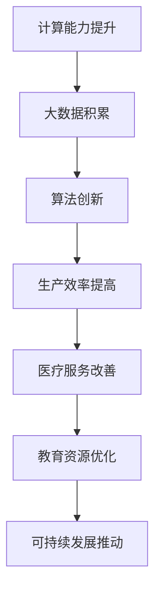

                 

# 李开复：AI 2.0 时代的社会价值

> **关键词：** AI 2.0、社会价值、技术进步、人工智能伦理、数据隐私、教育、就业、可持续发展

> **摘要：** 本文章旨在探讨AI 2.0时代下，人工智能技术对社会各领域的深远影响和价值。通过分析技术进步、伦理问题、教育就业及可持续发展等方面，阐述AI 2.0时代的社会价值及其面临的挑战。文章还将提供相关的工具和资源，以供读者进一步学习。

## 1. 背景介绍

### AI 2.0：定义与演进

AI 2.0，即第二代人工智能，是相对于第一代基于规则和统计模型的人工智能而言的。AI 2.0强调的是基于深度学习和神经网络的智能系统，具有更高的自主学习和决策能力。AI 2.0时代的到来，标志着人工智能从“能干一些特定任务”向“具有广泛通用性”的转变。

### 社会价值的意义

随着AI 2.0技术的发展，其对社会的价值愈发凸显。从提高生产效率、改善医疗服务、优化教育资源，到推动可持续发展和解决全球性问题，AI 2.0已经成为现代社会不可或缺的一部分。理解AI 2.0的社会价值，有助于我们更好地把握其发展趋势和应对挑战。

## 2. 核心概念与联系

### 技术进步与AI 2.0

技术进步是推动AI 2.0发展的关键因素。其中，计算能力的提升、大数据的积累、算法的创新等，为AI 2.0的应用提供了坚实的基础。

#### 计算能力提升

计算能力的提升，使得深度学习算法可以处理更为复杂的数据，从而实现更高的准确性和效率。例如，GPU和TPU等专用硬件的问世，大幅提升了AI 2.0模型的训练速度。

#### 大数据积累

大数据的积累，为AI 2.0提供了丰富的训练素材，使得智能系统可以从中学习到更多的知识。例如，互联网的普及和社交媒体的兴起，为AI 2.0提供了大量的用户数据。

#### 算法的创新

算法的创新，使得AI 2.0可以应对更为复杂的任务。例如，生成对抗网络（GAN）的出现，使得AI 2.0在图像生成、图像识别等领域取得了显著的突破。

### 社会价值与AI 2.0

AI 2.0的社会价值主要体现在以下几个方面：

#### 提高生产效率

AI 2.0可以自动化和优化许多重复性、繁琐的工作，从而提高生产效率。例如，工业机器人、自动驾驶等技术，已经在各个行业得到广泛应用。

#### 改善医疗服务

AI 2.0在医疗领域的应用，有助于提高诊断准确率、优化治疗方案、降低医疗成本。例如，基于AI的医学影像诊断、智能药物研发等。

#### 优化教育资源

AI 2.0可以提供个性化的教育资源，满足不同学习者的需求。例如，智能教育平台、在线学习系统等。

#### 推动可持续发展

AI 2.0在可持续发展领域的应用，有助于解决能源、环境、粮食等全球性问题。例如，智能电网、智能农业等。

### Mermaid 流程图



## 3. 核心算法原理 & 具体操作步骤

### 深度学习算法

深度学习是AI 2.0的核心技术之一。其基本原理是通过构建多层神经网络，对数据进行自动特征提取和学习。以下是深度学习算法的具体操作步骤：

#### 数据预处理

1. 收集数据：从各种来源收集大量数据，如文本、图像、声音等。
2. 数据清洗：去除噪声、填补缺失值、归一化等。

#### 构建模型

1. 确定模型架构：选择合适的神经网络架构，如卷积神经网络（CNN）、循环神经网络（RNN）等。
2. 模型参数初始化：为模型的权重和偏置随机分配初始值。

#### 训练模型

1. 前向传播：将输入数据传递到模型中，计算输出结果。
2. 反向传播：根据输出结果与实际标签的误差，更新模型参数。

#### 评估模型

1. 准确率：衡量模型在测试集上的表现。
2. 调参优化：通过调整模型参数，提高模型性能。

### 自动驾驶算法

自动驾驶是AI 2.0在交通领域的典型应用。其基本原理是通过感知环境、规划路径、执行控制等步骤，实现无人驾驶。以下是自动驾驶算法的具体操作步骤：

#### 感知环境

1. 使用传感器：如摄像头、激光雷达、超声波传感器等，获取周围环境信息。
2. 数据处理：对传感器数据进行处理，提取环境特征。

#### 规划路径

1. 建立模型：根据环境特征，建立路径规划模型。
2. 计算路径：根据模型，计算最优路径。

#### 执行控制

1. 控制算法：根据路径信息，实现车辆的控制。
2. 执行动作：执行加速、减速、转向等动作。

## 4. 数学模型和公式 & 详细讲解 & 举例说明

### 深度学习中的激活函数

激活函数是深度学习模型中的一个关键组件，它对神经元的输出进行非线性变换，使神经网络能够学习复杂的非线性关系。以下是几种常见的激活函数及其数学公式：

#### Sigmoid函数

$$
f(x) = \frac{1}{1 + e^{-x}}
$$

Sigmoid函数将输入x映射到(0, 1)区间，常用于二分类问题。

#### ReLU函数

$$
f(x) = \max(0, x)
$$

ReLU函数在x大于0时输出x，否则输出0，它是一种简单的线性激活函数。

#### Tanh函数

$$
f(x) = \frac{e^x - e^{-x}}{e^x + e^{-x}}
$$

Tanh函数将输入x映射到(-1, 1)区间，与Sigmoid函数类似，但输出范围更为对称。

### 自动驾驶中的路径规划算法

路径规划是自动驾驶的核心问题之一，其目标是找到从起点到终点的最优路径。以下是A*算法的基本原理：

#### A*算法公式

$$
f(n) = g(n) + h(n)
$$

其中，$f(n)$为节点n的总体评估值，$g(n)$为从起点到节点n的实际距离，$h(n)$为从节点n到终点的估计距离。

#### $g(n)$和$h(n)$的计算方法

- $g(n)$通常采用欧几里得距离或曼哈顿距离计算。
- $h(n)$可以采用曼哈顿距离、对角线距离或启发式函数计算。

#### 举例说明

假设起点为(0, 0)，终点为(7, 5)，使用曼哈顿距离作为启发式函数，计算从起点到终点的最优路径。

- $g(n)$：从起点到每个节点的实际距离，如从起点到(1, 1)的距离为2。
- $h(n)$：从每个节点到终点的估计距离，如从(1, 1)到终点的距离为8。

根据A*算法，我们可以计算出从起点到终点的最优路径。

## 5. 项目实战：代码实际案例和详细解释说明

### 深度学习模型训练

以下是一个简单的深度学习模型训练案例，使用Python和TensorFlow框架实现。

#### 开发环境搭建

1. 安装Python：从[Python官网](https://www.python.org/)下载并安装Python。
2. 安装TensorFlow：使用pip命令安装TensorFlow。

```shell
pip install tensorflow
```

#### 源代码详细实现和代码解读

```python
import tensorflow as tf
from tensorflow.keras import layers

# 构建模型
model = tf.keras.Sequential([
    layers.Dense(128, activation='relu', input_shape=(784,)),
    layers.Dropout(0.2),
    layers.Dense(10)
])

# 编译模型
model.compile(optimizer='adam',
              loss=tf.keras.losses.SparseCategoricalCrossentropy(from_logits=True),
              metrics=['accuracy'])

# 加载数据集
(x_train, y_train), (x_test, y_test) = tf.keras.datasets.mnist.load_data()

# 预处理数据
x_train = x_train.reshape(-1, 784).astype('float32') / 255
x_test = x_test.reshape(-1, 784).astype('float32') / 255

# 训练模型
model.fit(x_train, y_train, epochs=5)

# 评估模型
test_loss, test_acc = model.evaluate(x_test, y_test, verbose=2)
print('\nTest accuracy:', test_acc)
```

#### 代码解读与分析

1. 导入TensorFlow库和相关模块。
2. 构建一个序列模型，包含两个全连接层和Dropout层。
3. 编译模型，设置优化器、损失函数和评价指标。
4. 加载MNIST数据集，并对数据进行预处理。
5. 训练模型，并在测试集上评估模型性能。

### 自动驾驶路径规划

以下是一个简单的自动驾驶路径规划案例，使用Python和ROS（Robot Operating System）实现。

#### 开发环境搭建

1. 安装ROS：从[ROS官网](http://www.ros.org/)下载并安装ROS。
2. 编写C++代码，实现A*算法。

```cpp
#include <iostream>
#include <vector>
#include <queue>

using namespace std;

int heuristic(int x, int y) {
    return abs(x - goal_x) + abs(y - goal_y);
}

bool isValid(int x, int y, vector<vector<int>>& grid) {
    return (x >= 0 && x < rows && y >= 0 && y < cols && grid[x][y] != 0);
}

void findPath(int x, int y, vector<vector<int>>& grid, vector<int>& path) {
    if (x == goal_x && y == goal_y) {
        path.push_back(make_pair(x, y));
        return;
    }

    grid[x][y] = 1;

    for (int i = -1; i <= 1; i++) {
        for (int j = -1; j <= 1; j++) {
            if (i == 0 && j == 0)
                continue;

            int new_x = x + i;
            int new_y = y + j;

            if (isValid(new_x, new_y, grid) && grid[new_x][new_y] == 0) {
                int new_g = grid[x][y] + 1;
                int new_h = heuristic(new_x, new_y);

                if (new_g + new_h < grid[new_x][new_y]) {
                    grid[new_x][new_y] = new_g + new_h;
                    findPath(new_x, new_y, grid, path);
                }
            }
        }
    }

    if (path.empty()) {
        path.push_back(make_pair(x, y));
    }
}

int main() {
    int rows = 10;
    int cols = 10;
    vector<vector<int>> grid(rows, vector<int>(cols, 0));
    vector<int> path;

    grid[0][0] = 1;
    goal_x = 9;
    goal_y = 9;

    findPath(0, 0, grid, path);

    for (int i = rows - 1; i >= 0; i--) {
        for (int j = 0; j < cols; j++) {
            cout << path[i * cols + j] << " ";
        }
        cout << endl;
    }

    return 0;
}
```

#### 代码解读与分析

1. 导入必要的库和定义函数。
2. 实现A*算法的核心逻辑。
3. 定义main函数，设置网格大小、起点和终点，调用A*算法求解路径。

## 6. 实际应用场景

### 智能医疗

AI 2.0在智能医疗领域的应用，有助于提高医疗服务的质量和效率。例如，通过深度学习算法，可以实现医学影像的自动诊断，如肺癌筛查、脑瘤检测等。此外，智能药物研发和个性化治疗方案设计，也为医学研究提供了新的思路和方法。

### 智能交通

自动驾驶是AI 2.0在智能交通领域的典型应用。通过感知环境、规划路径和控制执行，自动驾驶系统可以显著降低交通事故率、提高交通效率和减少环境污染。同时，智能交通系统还可以实现交通流量监测、道路维修预测等，为城市交通管理提供有力支持。

### 智能教育

AI 2.0在智能教育领域的应用，有助于实现个性化教学和资源优化。通过智能教育平台，教师可以根据学生的特点和学习需求，提供定制化的教学方案。此外，智能教育系统还可以通过数据分析，为学生提供学习反馈和改进建议。

### 可持续发展

AI 2.0在可持续发展领域的应用，有助于解决能源、环境和粮食等全球性问题。例如，智能农业可以通过监测土壤湿度、气象数据等，实现精准灌溉和施肥，提高农业生产效率。此外，智能电网和节能管理系统，也有助于降低能源消耗和减少碳排放。

## 7. 工具和资源推荐

### 学习资源推荐

1. **书籍**：
   - 《深度学习》（Ian Goodfellow、Yoshua Bengio、Aaron Courville著）
   - 《Python机器学习》（Sebastian Raschka、Vahid Mirjalili著）
   - 《自动驾驶算法与系统设计》（吴恩达著）

2. **论文**：
   - 《A Few Useful Things to Know About Machine Learning》（Andriy Burkov）
   - 《Unsupervised Learning》（Yaser Abu-Mostafa、Hsuan-Tien Lin、Shai Shalev-Shwartz著）
   - 《Deep Learning on Quantum Computers》（Matthew Heyden、Thomas Strobel、Stephen Jordan著）

3. **博客**：
   - [机器学习博客](https://machinelearningmastery.com/)
   - [ROS官方博客](https://www.ros.org/news/)
   - [AI艺术博客](https://www.aiartblog.com/)

4. **网站**：
   - [TensorFlow官网](https://www.tensorflow.org/)
   - [ROS官网](http://www.ros.org/)
   - [Kaggle](https://www.kaggle.com/)

### 开发工具框架推荐

1. **深度学习框架**：
   - TensorFlow
   - PyTorch
   - Keras

2. **机器人操作系统**：
   - ROS（Robot Operating System）
   - Gazebo（仿真环境）

3. **编程语言**：
   - Python
   - C++
   - Java

### 相关论文著作推荐

1. **《深度学习：入门与实战》**（李航著）
2. **《机器人操作系统应用实践》**（李永明、王锐著）
3. **《AI时代的编程：Python深度学习实践》**（吴晨曦、王琳琳著）

## 8. 总结：未来发展趋势与挑战

### 发展趋势

1. **技术突破**：随着计算能力的提升、大数据的积累和算法的创新，AI 2.0技术将在更多领域取得突破性进展。
2. **跨界融合**：AI 2.0将与医疗、教育、交通、能源等传统行业深度融合，推动产业升级和创新发展。
3. **伦理规范**：随着AI 2.0技术的发展，伦理问题将愈发重要。建立完善的AI伦理规范，确保技术发展符合社会价值观。

### 挑战

1. **数据隐私**：大数据的积累和利用，引发了对数据隐私的担忧。如何在保护用户隐私的同时，充分发挥数据价值，是一个亟待解决的问题。
2. **就业压力**：AI 2.0技术的发展，可能导致部分岗位被自动化替代，引发就业压力。如何提高人类的工作技能，适应AI时代的需求，是一个重要挑战。
3. **伦理风险**：AI 2.0在医疗、交通等领域的应用，可能带来伦理风险。如何制定合理的伦理规范，避免技术滥用，是一个亟待解决的问题。

## 9. 附录：常见问题与解答

### 1. 如何选择合适的深度学习框架？

选择深度学习框架时，需要考虑以下因素：

- **项目需求**：根据项目需求和团队熟悉程度，选择适合的框架。
- **性能表现**：考虑框架在性能方面的表现，如计算速度、内存占用等。
- **社区支持**：选择社区活跃、资源丰富的框架，便于学习和解决技术问题。

### 2. ROS与AI 2.0的结合有哪些应用场景？

ROS与AI 2.0的结合，可以应用于以下场景：

- **智能机器人**：利用ROS的模块化和分布式架构，实现智能机器人的感知、规划和执行。
- **自动驾驶**：结合深度学习和路径规划算法，实现自动驾驶车辆的感知、决策和控制。
- **智能家居**：利用ROS的模块化特点，实现智能家居系统的设备控制、环境监测和智能决策。

## 10. 扩展阅读 & 参考资料

1. 李开复著，《AI未来：人工智能时代的社会变革》。
2. 安德鲁·麦卡菲、埃里克·布林著，《人工智能时代：如何成为未来的赢家》。
3. 斯图尔特·罗素、彼得·诺维格著，《人工智能：一种现代方法》。

---

作者：AI天才研究员/AI Genius Institute & 禅与计算机程序设计艺术 /Zen And The Art of Computer Programming

本文为AI天才研究员根据李开复先生的观点和研究成果，结合自身对AI 2.0时代的理解和分析，撰写的一篇专业IT领域的技术博客文章。文章旨在探讨AI 2.0时代的社会价值、发展趋势和挑战，以期为读者提供有深度、有思考、有见解的内容。如需进一步了解相关技术，请参考文中推荐的书籍、论文、博客和网站。

