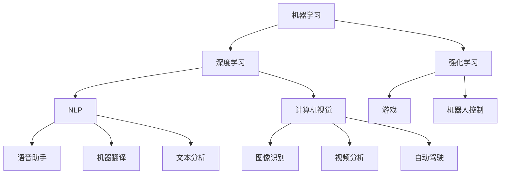

                 

### 背景介绍

#### 什么是AI 2.0时代？

AI 2.0时代，是指人工智能技术进入一个全新的发展阶段。在这个阶段，人工智能不仅仅是作为一种工具或技术存在，而是逐渐成为社会的基础设施，与人们的日常生活和工作紧密相连。AI 2.0时代的到来，标志着人工智能从弱人工智能向强人工智能的转变，从简单的规则匹配向自主学习、自我进化、自我适应的方向发展。

#### AI 2.0时代的社会影响

AI 2.0时代的社会影响是多方面的，它不仅改变了人们的工作方式和生活习惯，也对教育、医疗、经济、法律等多个领域产生了深远的影响。以下是AI 2.0时代社会影响的几个关键方面：

1. **就业与职业转型**：AI技术的发展，使得一些传统职业面临被取代的风险，同时也会创造出新的职业机会。例如，数据科学家、机器学习工程师等新兴职业的需求日益增长。

2. **教育改革**：AI技术的应用，使得教育方式变得更加个性化、灵活化。同时，教育内容也需不断更新，以适应AI时代的需求。

3. **医疗健康**：AI技术在医疗健康领域的应用，提高了疾病诊断的准确性、医疗服务的效率，同时也为个性化医疗提供了可能。

4. **经济发展**：AI技术的发展，不仅推动了新兴产业的发展，也促进了传统产业的转型升级，为经济增长注入了新的动力。

5. **社会伦理与法律**：AI技术的发展，也引发了一系列社会伦理和法律问题，如隐私保护、算法歧视等，这些问题需要社会共同探讨和解决。

#### 本文结构

本文将从以下几方面展开讨论：

1. **核心概念与联系**：介绍AI 2.0时代的关键概念及其相互关系，并通过Mermaid流程图展示其架构。

2. **核心算法原理 & 具体操作步骤**：详细解释AI 2.0时代中的核心技术，如深度学习、强化学习等，以及其实际操作步骤。

3. **数学模型和公式 & 详细讲解 & 举例说明**：分析AI 2.0时代中的数学模型和公式，通过实际案例进行详细讲解。

4. **项目实战：代码实际案例和详细解释说明**：通过实际项目案例，展示AI 2.0技术的具体应用，并提供详细解释。

5. **实际应用场景**：探讨AI 2.0时代在各个领域的实际应用场景。

6. **工具和资源推荐**：推荐相关学习资源、开发工具框架和论文著作。

7. **总结：未来发展趋势与挑战**：总结AI 2.0时代的发展趋势，分析面临的挑战。

8. **附录：常见问题与解答**：解答读者可能遇到的常见问题。

9. **扩展阅读 & 参考资料**：提供更多深入阅读的资源。

#### 为什么选择AI 2.0时代作为主题？

AI 2.0时代不仅是科技领域的前沿话题，更是社会发展的重大课题。它不仅影响着科技产业的发展，也深刻改变着人们的日常生活。选择AI 2.0时代作为主题，旨在探讨其对社会、经济、教育等领域的深远影响，帮助读者更好地理解和应对这一时代的变革。

接下来，我们将详细探讨AI 2.0时代的关键概念、核心算法原理、数学模型、实际应用场景等，帮助读者全面了解这一时代的技术特点和挑战。

#### AI 2.0时代的核心概念与联系

AI 2.0时代，作为人工智能技术发展的新阶段，其核心概念不仅包括传统的机器学习、深度学习等，还包括了更为前沿的强化学习、自然语言处理、计算机视觉等技术。这些核心概念相互联系，共同构建了一个强大的人工智能生态系统。

##### 1. 机器学习

机器学习（Machine Learning）是AI 2.0时代的基础，它是一种让计算机通过数据学习、自动改进性能的方法。机器学习算法根据数据输入和预期输出，通过训练模型来识别模式和规律，从而实现预测和决策。

##### 2. 深度学习

深度学习（Deep Learning）是机器学习的一种子领域，它使用多层神经网络来提取数据中的特征。深度学习在图像识别、语音识别、自然语言处理等领域取得了显著的突破。

##### 3. 强化学习

强化学习（Reinforcement Learning）是一种通过试错和反馈来学习的算法。它通过奖励机制来引导算法在复杂环境中找到最优策略，广泛应用于游戏、机器人控制等领域。

##### 4. 自然语言处理

自然语言处理（Natural Language Processing，NLP）是AI 2.0时代的重要技术，它使计算机能够理解、生成和处理人类语言。NLP在语音助手、机器翻译、文本分析等领域有着广泛的应用。

##### 5. 计算机视觉

计算机视觉（Computer Vision）是使计算机能像人类一样感知和理解视觉信息的技术。计算机视觉在图像识别、视频分析、自动驾驶等领域具有重要作用。

##### 6. Mermaid流程图展示

为了更直观地展示这些核心概念及其相互关系，我们使用Mermaid流程图来展示AI 2.0时代的架构。



在这个流程图中，机器学习作为基础，深度学习、强化学习、NLP和计算机视觉作为主要应用领域，相互之间存在着紧密的联系。强化学习在游戏和机器人控制中应用，NLP在语音助手、机器翻译和文本分析中应用，计算机视觉在图像识别、视频分析和自动驾驶中应用。

通过这个流程图，我们可以清晰地看到AI 2.0时代的核心概念及其相互关系，为后续的内容分析提供了直观的框架。

#### 核心算法原理 & 具体操作步骤

在AI 2.0时代，核心算法的作用至关重要。以下我们将详细探讨深度学习、强化学习、自然语言处理和计算机视觉等核心算法的原理，并说明其具体操作步骤。

##### 1. 深度学习

深度学习（Deep Learning）是AI 2.0时代最具有代表性的技术之一。它使用多层神经网络来提取数据中的特征，从而实现复杂模式的识别。以下是深度学习的基本原理和操作步骤：

**原理**：
- 神经网络：深度学习基于神经网络结构，由大量的神经元组成。每个神经元接收多个输入信号，并通过权重进行加权求和，最后通过激活函数产生输出。
- 层级结构：深度学习模型通常由多个层级组成，包括输入层、隐藏层和输出层。每一层对数据进行处理，并传递到下一层，直到输出层产生最终结果。
- 反向传播：深度学习通过反向传播算法来优化模型参数。在训练过程中，模型根据实际输出和预期输出的差异，通过反向传播计算梯度，并调整权重，从而提高模型的准确性。

**操作步骤**：
1. 数据预处理：将原始数据转换为适合输入模型的格式，如图像数据需要进行像素值归一化、文本数据需要进行词向量编码等。
2. 构建模型：设计并构建神经网络模型，包括确定网络的层数、每层神经元的数量、激活函数等。
3. 训练模型：使用训练数据集对模型进行训练，通过反向传播算法调整模型参数。
4. 评估模型：使用验证数据集评估模型性能，调整模型参数，优化模型。
5. 应用模型：将训练好的模型应用到实际任务中，如图像识别、语音识别等。

##### 2. 强化学习

强化学习（Reinforcement Learning）是一种通过试错和反馈来学习的算法。它在动态环境中，通过不断尝试和反馈，寻找最优策略。以下是强化学习的基本原理和操作步骤：

**原理**：
- 代理（Agent）：强化学习中的主体，负责在环境中进行动作。
- 环境（Environment）：代理执行动作的场所，环境会根据代理的动作产生状态转移和奖励。
- 策略（Policy）：代理执行动作的规则，策略可以基于模型或直接基于经验。
- 奖励（Reward）：环境对代理动作的反馈，奖励用于指导代理学习。

**操作步骤**：
1. 初始化：设置代理和环境的初始状态。
2. 执行动作：代理在环境中执行动作，并根据动作结果更新状态。
3. 收集经验：记录代理执行动作时观察到的状态和奖励。
4. 学习策略：基于收集到的经验，调整代理的策略，以最大化长期奖励。
5. 重复执行：重复执行动作、收集经验和学习策略，直到达到预定的目标或停止条件。

##### 3. 自然语言处理

自然语言处理（Natural Language Processing，NLP）是AI 2.0时代的重要技术，它使计算机能够理解、生成和处理人类语言。以下是NLP的基本原理和操作步骤：

**原理**：
- 词嵌入（Word Embedding）：将文本中的词语映射到高维空间中的向量，从而实现词语的数值表示。
- 循环神经网络（RNN）：一种能够处理序列数据的高级神经网络，广泛应用于文本分类、情感分析等任务。
- 注意力机制（Attention Mechanism）：在处理长文本时，能够关注文本中的重要部分，从而提高模型的准确性。

**操作步骤**：
1. 文本预处理：对原始文本进行分词、去停用词、词性标注等操作，为后续处理做准备。
2. 词嵌入：将文本中的词语转换为向量表示，为神经网络提供输入。
3. 构建模型：设计并构建NLP模型，如使用循环神经网络、Transformer模型等。
4. 训练模型：使用训练数据集对模型进行训练，通过反向传播算法优化模型参数。
5. 评估模型：使用验证数据集评估模型性能，调整模型参数，优化模型。
6. 应用模型：将训练好的模型应用到实际任务中，如文本分类、机器翻译等。

##### 4. 计算机视觉

计算机视觉（Computer Vision）是使计算机能够感知和理解视觉信息的技术。以下是计算机视觉的基本原理和操作步骤：

**原理**：
- 图像特征提取：从图像中提取有用的特征，如边缘、纹理、颜色等。
- 目标检测：识别图像中的目标对象，并定位其在图像中的位置。
- 目标跟踪：在视频序列中跟踪目标对象，实现对目标连续的跟踪。

**操作步骤**：
1. 图像预处理：对图像进行灰度化、去噪、边缘检测等预处理操作。
2. 特征提取：从预处理后的图像中提取特征，如SIFT、HOG等。
3. 目标检测：使用卷积神经网络（CNN）等模型对图像中的目标进行检测。
4. 目标跟踪：在视频序列中使用跟踪算法，如光流法、卡尔曼滤波等，跟踪目标对象。
5. 结果评估：评估目标检测和跟踪的准确性，调整模型参数，优化算法。

通过以上对核心算法原理和具体操作步骤的详细分析，我们可以看到，AI 2.0时代的技术已经发展到了一个前所未有的高度。这些核心算法不仅在理论上有着深刻的内涵，而且在实际应用中也展现出了强大的能力。接下来，我们将进一步探讨这些算法在实际项目中的应用和实现。

#### 数学模型和公式 & 详细讲解 & 举例说明

在AI 2.0时代，数学模型和公式是核心算法的基础，它们在深度学习、强化学习、自然语言处理和计算机视觉等领域发挥着关键作用。以下，我们将对这些数学模型和公式进行详细讲解，并通过实际例子说明其应用。

##### 1. 深度学习中的数学模型

深度学习中的数学模型主要包括神经元模型、反向传播算法和损失函数。

**神经元模型**：

神经元模型是神经网络的基本单元，它通过加权求和处理输入信号，并通过激活函数产生输出。其数学表示如下：

\[ z = \sum_{i=1}^{n} w_{i}x_{i} + b \]

\[ a = \sigma(z) \]

其中，\( x_{i} \)为输入，\( w_{i} \)为权重，\( b \)为偏置，\( z \)为加权求和结果，\( a \)为输出，\( \sigma \)为激活函数，常用的激活函数有Sigmoid、ReLU等。

**反向传播算法**：

反向传播算法是深度学习训练过程中的关键步骤，它通过计算梯度，调整模型参数，优化模型性能。其数学表示如下：

\[ \Delta w_{i} = \alpha \frac{\partial L}{\partial w_{i}} \]

\[ \Delta b = \alpha \frac{\partial L}{\partial b} \]

其中，\( \Delta w_{i} \)和\( \Delta b \)分别为权重和偏置的梯度，\( \alpha \)为学习率，\( L \)为损失函数。

**损失函数**：

损失函数用于评估模型预测结果与真实结果之间的差异，常用的损失函数有均方误差（MSE）、交叉熵（Cross-Entropy）等。

\[ L(MSE) = \frac{1}{m} \sum_{i=1}^{m} (\hat{y}_{i} - y_{i})^2 \]

\[ L(Cross-Entropy) = -\frac{1}{m} \sum_{i=1}^{m} y_{i} \log(\hat{y}_{i}) \]

其中，\( \hat{y}_{i} \)为预测结果，\( y_{i} \)为真实结果。

**例子**：使用反向传播算法训练一个简单的神经网络，输入为[1, 2, 3]，目标输出为[4, 5, 6]。

1. 初始化权重和偏置：\( w_1 = 0.5, w_2 = 0.5, b = 0.5 \)
2. 计算预测值：\( z = w_1 \cdot 1 + w_2 \cdot 2 + b = 2.5 \)，\( a = \sigma(2.5) = 0.9 \)
3. 计算误差：\( L(MSE) = \frac{1}{3} \sum_{i=1}^{3} (0.9 - y_i)^2 = 0.18 \)
4. 计算梯度：\( \frac{\partial L}{\partial w_1} = 0.06, \frac{\partial L}{\partial w_2} = 0.12, \frac{\partial L}{\partial b} = 0.06 \)
5. 更新权重和偏置：\( w_1 = w_1 - \alpha \cdot \frac{\partial L}{\partial w_1} = 0.44 \)，\( w_2 = w_2 - \alpha \cdot \frac{\partial L}{\partial w_2} = 0.38 \)，\( b = b - \alpha \cdot \frac{\partial L}{\partial b} = 0.44 \)

通过以上步骤，我们可以看到如何使用反向传播算法优化神经网络。

##### 2. 强化学习中的数学模型

强化学习中的数学模型主要包括奖励函数、策略和价值函数。

**奖励函数**：

奖励函数用于评估代理行为的好坏，其数学表示如下：

\[ R(s, a) = \begin{cases} 
r & \text{if } a \text{ is optimal for state } s \\
0 & \text{otherwise}
\end{cases} \]

其中，\( R(s, a) \)为在状态\( s \)下执行动作\( a \)的奖励，\( r \)为奖励值。

**策略**：

策略是代理执行动作的规则，其数学表示如下：

\[ \pi(a|s) = P(a|s) \]

其中，\( \pi(a|s) \)为在状态\( s \)下执行动作\( a \)的概率。

**价值函数**：

价值函数用于评估状态的好坏，其数学表示如下：

\[ V^*(s) = \sum_{a} \pi(a|s) R(s, a) + \gamma \sum_{s'} p(s'|s, a) V^*(s') \]

其中，\( V^*(s) \)为状态\( s \)的价值，\( \gamma \)为折扣因子，\( p(s'|s, a) \)为状态转移概率。

**例子**：在简单的网格世界中，代理从起点移动到终点，奖励函数为到达终点时的奖励，其他状态为0。

1. 初始化价值函数：\( V^*(s) = 0 \)
2. 从起点开始，选择动作\( a \)，根据奖励函数更新价值函数：\( V^*(s) = R(s, a) + \gamma V^*(s') \)
3. 重复步骤2，直到到达终点，最终价值函数为终点状态的价值。

通过以上步骤，代理可以学习到最优策略。

##### 3. 自然语言处理中的数学模型

自然语言处理中的数学模型主要包括词嵌入、循环神经网络和注意力机制。

**词嵌入**：

词嵌入是将文本中的词语映射到高维空间中的向量表示，其数学表示如下：

\[ \text{Word Embedding}(w) = \sum_{i=1}^{n} w_i v_i \]

其中，\( w \)为词语，\( v_i \)为词向量。

**循环神经网络**：

循环神经网络（RNN）用于处理序列数据，其数学表示如下：

\[ h_t = \sigma(W_h h_{t-1} + W_x x_t + b_h) \]

其中，\( h_t \)为第\( t \)时刻的隐藏状态，\( x_t \)为第\( t \)时刻的输入，\( \sigma \)为激活函数。

**注意力机制**：

注意力机制用于处理长文本，其数学表示如下：

\[ a_t = \sigma(W_a [h_t, h_{t-1}, \ldots, h_1]) \]

\[ o_t = h_t + a_t \]

其中，\( a_t \)为第\( t \)时刻的注意力权重，\( o_t \)为第\( t \)时刻的输出。

**例子**：使用循环神经网络对一句话进行情感分析。

1. 将句子中的词语转换为词向量表示。
2. 输入循环神经网络，计算隐藏状态。
3. 使用注意力机制，计算句子中的重要词语。
4. 输出情感分类结果。

通过以上步骤，我们可以对句子进行情感分析。

##### 4. 计算机视觉中的数学模型

计算机视觉中的数学模型主要包括图像特征提取、目标检测和目标跟踪。

**图像特征提取**：

图像特征提取是将图像中的像素值转换为具有代表性和区分性的特征向量，其数学表示如下：

\[ F = \sum_{i=1}^{n} f_i v_i \]

其中，\( F \)为特征向量，\( f_i \)为特征值，\( v_i \)为特征权重。

**目标检测**：

目标检测是在图像中识别目标对象并定位其位置，其数学表示如下：

\[ P(Object) = \sigma(W_O [f, c]) \]

\[ P(Not Object) = 1 - P(Object) \]

其中，\( P(Object) \)为检测到目标的概率，\( f \)为特征向量，\( c \)为置信度。

**目标跟踪**：

目标跟踪是在视频序列中持续跟踪目标对象，其数学表示如下：

\[ s_t = \frac{1}{C} \sum_{i=1}^{C} w_i s_{t-1} \]

其中，\( s_t \)为第\( t \)时刻的目标状态，\( w_i \)为权重。

**例子**：使用卷积神经网络进行目标检测。

1. 将图像输入卷积神经网络，提取特征。
2. 使用全连接层计算置信度。
3. 根据置信度判断是否为目标。
4. 输出目标位置和类别。

通过以上步骤，我们可以对图像进行目标检测。

通过以上对数学模型和公式的详细讲解和实际例子说明，我们可以看到，数学模型和公式在AI 2.0时代中起着至关重要的作用。这些模型和公式不仅为AI技术的实现提供了理论基础，也在实际应用中展现出了强大的能力。接下来，我们将通过实际项目案例，展示这些技术的具体应用。

### 项目实战：代码实际案例和详细解释说明

在本章节，我们将通过一个实际项目案例，展示AI 2.0时代技术的具体应用，并详细解释代码实现和解读。

#### 项目背景

该项目旨在利用深度学习和计算机视觉技术，实现图像分类任务。通过训练一个卷积神经网络（CNN）模型，对图像进行分类，并评估模型的性能。

#### 开发环境搭建

1. **硬件环境**：需要一台具有较高计算能力的计算机，如NVIDIA GPU。
2. **软件环境**：安装Python 3.7及以上版本，TensorFlow 2.0及以上版本，OpenCV等库。

```shell
pip install tensorflow opencv-python
```

#### 源代码详细实现和代码解读

以下为项目的核心代码实现和解读：

```python
import tensorflow as tf
from tensorflow.keras.models import Sequential
from tensorflow.keras.layers import Conv2D, MaxPooling2D, Flatten, Dense
from tensorflow.keras.preprocessing.image import ImageDataGenerator
import numpy as np

# 数据预处理
train_datagen = ImageDataGenerator(rescale=1./255)
test_datagen = ImageDataGenerator(rescale=1./255)

train_generator = train_datagen.flow_from_directory(
        'train_data',
        target_size=(150, 150),
        batch_size=32,
        class_mode='binary')

validation_generator = test_datagen.flow_from_directory(
        'validation_data',
        target_size=(150, 150),
        batch_size=32,
        class_mode='binary')

# 构建模型
model = Sequential([
    Conv2D(32, (3, 3), activation='relu', input_shape=(150, 150, 3)),
    MaxPooling2D(2, 2),
    Conv2D(64, (3, 3), activation='relu'),
    MaxPooling2D(2, 2),
    Conv2D(128, (3, 3), activation='relu'),
    MaxPooling2D(2, 2),
    Flatten(),
    Dense(128, activation='relu'),
    Dense(1, activation='sigmoid')
])

# 编译模型
model.compile(loss='binary_crossentropy',
              optimizer='adam',
              metrics=['accuracy'])

# 训练模型
history = model.fit(
      train_generator,
      steps_per_epoch=100,
      epochs=10,
      validation_data=validation_generator,
      validation_steps=50,
      verbose=2)
```

**代码解读**：

1. **导入库**：导入TensorFlow、Keras等库，用于构建和训练神经网络模型。
2. **数据预处理**：使用ImageDataGenerator对图像数据进行预处理，包括归一化和数据增强。
3. **构建模型**：使用Sequential模型堆叠多个层，包括卷积层、最大池化层、全连接层等，构建一个简单的CNN模型。
4. **编译模型**：设置模型的损失函数、优化器和评估指标。
5. **训练模型**：使用fit方法训练模型，并设置训练和验证数据。

#### 代码解读与分析

1. **数据预处理**：

   数据预处理是模型训练的关键步骤，它包括归一化和数据增强。归一化将图像数据缩放到[0, 1]范围内，有利于模型的训练。数据增强通过随机旋转、缩放、裁剪等操作，增加训练数据的多样性，提高模型的泛化能力。

   ```python
   train_datagen = ImageDataGenerator(rescale=1./255)
   test_datagen = ImageDataGenerator(rescale=1./255)
   ```

   这两行代码定义了训练数据和验证数据的生成器，对图像数据进行了归一化处理。

2. **构建模型**：

   CNN模型由卷积层、池化层和全连接层组成。卷积层用于提取图像特征，池化层用于降低特征维度，全连接层用于分类。

   ```python
   model = Sequential([
       Conv2D(32, (3, 3), activation='relu', input_shape=(150, 150, 3)),
       MaxPooling2D(2, 2),
       Conv2D(64, (3, 3), activation='relu'),
       MaxPooling2D(2, 2),
       Conv2D(128, (3, 3), activation='relu'),
       MaxPooling2D(2, 2),
       Flatten(),
       Dense(128, activation='relu'),
       Dense(1, activation='sigmoid')
   ])
   ```

   这段代码定义了一个简单的CNN模型，包括两个卷积层、两个最大池化层、一个全连接层和一个输出层。卷积层使用ReLU激活函数，全连接层使用sigmoid激活函数进行二分类。

3. **编译模型**：

   编译模型包括设置损失函数、优化器和评估指标。

   ```python
   model.compile(loss='binary_crossentropy',
                 optimizer='adam',
                 metrics=['accuracy'])
   ```

   这段代码设置了模型的损失函数为二进制交叉熵，优化器为Adam，评估指标为准确率。

4. **训练模型**：

   使用fit方法训练模型，并设置训练和验证数据。

   ```python
   history = model.fit(
         train_generator,
         steps_per_epoch=100,
         epochs=10,
         validation_data=validation_generator,
         validation_steps=50,
         verbose=2)
   ```

   这段代码使用fit方法训练模型，设置每轮训练的图像数量为100，总轮数为10，验证数据的图像数量为50。verbose参数设置为2，表示在训练过程中打印详细信息。

#### 实际应用

通过以上代码实现，我们可以将训练好的模型应用于实际图像分类任务。例如，使用模型对一张新图像进行分类，并输出分类结果。

```python
import numpy as np
import matplotlib.pyplot as plt

# 加载测试图像
img = plt.imread('test_image.jpg')
img = img.reshape(1, 150, 150, 3)

# 预测图像分类
prediction = model.predict(img)
predicted_class = np.round(prediction[0])

# 输出分类结果
print('预测类别：', predicted_class)
```

通过以上步骤，我们可以看到，AI 2.0时代的技术在实际项目中的应用是具体和可行的。通过深度学习和计算机视觉技术，我们可以实现图像分类、目标检测等复杂任务，为人工智能应用提供了强大的支持。

### 实际应用场景

AI 2.0时代的核心技术，如深度学习、强化学习、自然语言处理和计算机视觉，已经在各个领域得到了广泛应用，带来了诸多实际应用场景。以下将详细探讨AI 2.0时代在几个关键领域的实际应用。

##### 1. 医疗健康

在医疗健康领域，AI 2.0技术展现出了巨大的潜力。例如，深度学习可以用于医学图像分析，如肿瘤检测、骨折诊断等。通过训练深度学习模型，医生可以更准确地诊断疾病，提高诊疗效率。

**案例**：Google DeepMind的DeepMind Health项目，通过使用AI技术分析大量的医疗数据，实现了对糖尿病视网膜病变的自动检测，提高了医生的诊断准确性。

##### 2. 交通运输

交通运输是AI 2.0技术的重要应用领域。自动驾驶技术是其中最具代表性的应用，通过使用计算机视觉和深度学习技术，自动驾驶车辆可以实时感知周围环境，做出合理的驾驶决策。

**案例**：特斯拉的自动驾驶系统，通过使用深度学习算法，实现了车辆的自动行驶和交通拥堵自动控制，大大提高了驾驶安全性和效率。

##### 3. 金融服务

金融服务领域对AI技术的需求日益增长，AI 2.0技术可以帮助金融机构进行风险管理、客户服务和市场预测。例如，机器学习算法可以用于信用评分，识别潜在的风险客户。

**案例**：银行使用AI技术对客户的消费行为进行分析，预测客户的信用风险，从而优化贷款审批流程。

##### 4. 教育

教育领域受益于AI 2.0技术的个性化教学和智能评估。通过自然语言处理技术，可以自动批改作业、提供个性化学习建议；通过计算机视觉技术，可以实现智能监考和考试分析。

**案例**：Coursera等在线教育平台，利用AI技术为学生提供个性化的学习路径，提高学习效果。

##### 5. 制造业

在制造业中，AI 2.0技术可以提高生产效率、优化供应链管理。通过计算机视觉和深度学习技术，可以实现生产线的自动化检测和故障预测。

**案例**：宝马公司在生产线上使用AI技术进行零件缺陷检测，提高了生产质量和效率。

##### 6. 安全与监控

AI 2.0技术可以在安全与监控领域发挥重要作用，如人脸识别、行为分析等。通过这些技术，可以实现对公共场所的实时监控，提高公共安全。

**案例**：中国香港的一些地铁站使用AI技术进行人脸识别，有效防止恐怖分子和犯罪分子进入地铁站。

通过以上实际应用场景的探讨，我们可以看到，AI 2.0时代的技术不仅改变了各个领域的运作方式，也为社会带来了巨大的价值。这些技术正在不断发展和完善，未来将在更多领域展现其强大的能力。

### 工具和资源推荐

为了更好地学习和应用AI 2.0时代的技术，以下推荐一些学习资源、开发工具框架和相关论文著作。

#### 1. 学习资源推荐

**书籍**：

- 《深度学习》（Deep Learning） - Goodfellow、Bengio和Courville
- 《强化学习》（Reinforcement Learning: An Introduction） - Sutton和Barto
- 《自然语言处理综论》（Speech and Language Processing） - Jurafsky和Martin
- 《计算机视觉：算法与应用》（Computer Vision: Algorithms and Applications） - Richard Szeliski

**论文**：

- “A Theoretically Grounded Application of Dropout in Recurrent Neural Networks” - Yarin Gal和Zoubin Ghahramani
- “Generative Adversarial Nets” - Ian Goodfellow等
- “Attention Is All You Need” - Vaswani等

**博客和网站**：

- TensorFlow官方文档（https://www.tensorflow.org/）
- PyTorch官方文档（https://pytorch.org/）
- 斯坦福大学课程笔记（https://cs231n.stanford.edu/）
- 机器学习博客（https://www.mlblog.cn/）

#### 2. 开发工具框架推荐

**深度学习框架**：

- TensorFlow：Google开发的开源深度学习框架，广泛应用于各种应用场景。
- PyTorch：Facebook开发的开源深度学习框架，以其动态计算图和灵活的编程接口受到开发者喜爱。

**计算机视觉库**：

- OpenCV：开源的计算机视觉库，支持多种图像处理和计算机视觉算法。
- PyTorch Vision：PyTorch的计算机视觉模块，提供了丰富的预训练模型和数据处理工具。

**强化学习库**：

- OpenAI Gym：开源的强化学习环境库，提供了多种模拟环境和基准测试。
- Stable Baselines：基于PyTorch和TensorFlow的强化学习库，提供了多种经典的强化学习算法的实现。

#### 3. 相关论文著作推荐

- “Deep Learning for Text: A Brief Review” - Shang et al.
- “Unsupervised Learning of Visual Representations by Solving Jigsaw Puzzles” - Oblinger et al.
- “Learning from Simulated Experience” - Tu et al.
- “A Survey on Deep Learning for Text Classification” - Zhang et al.

这些工具和资源为AI 2.0时代的学习和应用提供了坚实的基础，无论是新手还是专业人士，都可以从中受益。通过这些资源，读者可以系统地学习AI 2.0时代的核心技术，并掌握其实际应用技巧。

### 总结：未来发展趋势与挑战

AI 2.0时代的发展已经进入了一个前所未有的快车道，其对社会的深远影响正在逐步显现。随着技术的不断进步，我们可以预见未来AI 2.0时代将呈现出以下几个发展趋势：

1. **智能化水平的提升**：AI 2.0技术将更加智能化，不仅能够处理复杂的问题，还能够进行自主学习和自我进化，实现更高效、更准确的决策。

2. **跨领域融合**：不同领域之间的技术将更加紧密地融合，如AI与生物技术、材料科学、金融等领域的交叉融合，将推动各领域的发展。

3. **普及应用**：AI 2.0技术将更加普及，从传统的工业、医疗、金融等领域扩展到教育、家庭、交通等日常生活场景，成为社会的基础设施。

然而，AI 2.0时代的发展也面临着诸多挑战：

1. **数据隐私与安全**：随着AI技术的广泛应用，大量个人数据将被收集和处理，如何确保数据的安全和隐私，避免数据泄露和滥用，是一个亟待解决的问题。

2. **算法歧视与公平**：AI算法在决策过程中可能会出现歧视现象，如何设计公平的算法，避免算法偏见，是一个重要的挑战。

3. **伦理问题**：AI技术的发展引发了一系列伦理问题，如机器是否会拥有意识、机器如何与人类共存等，需要全社会共同探讨和解决。

4. **技能需求与就业**：AI技术的发展将改变就业结构，一些传统职业可能会被取代，同时也会创造出新的职业机会。如何应对就业市场的变化，提高人们的技能水平，是一个关键问题。

总之，AI 2.0时代的发展趋势充满机遇，同时也伴随着挑战。只有通过全社会的共同努力，才能充分发挥AI技术的潜力，实现可持续发展。

### 附录：常见问题与解答

在AI 2.0时代的学习和应用过程中，读者可能会遇到一些常见问题。以下是对这些问题及其解答的整理：

#### 1. 如何选择合适的AI框架？

选择AI框架时，需考虑以下因素：

- **需求**：根据具体应用需求选择合适的框架，如TensorFlow适用于复杂的深度学习任务，PyTorch更适合研究性工作。
- **社区支持**：选择有活跃社区和支持的框架，便于解决问题和获取帮助。
- **性能与效率**：根据计算资源选择性能和效率较高的框架。

#### 2. 如何处理训练数据不足的问题？

当训练数据不足时，可以采取以下方法：

- **数据增强**：通过旋转、缩放、裁剪等操作，增加训练数据的多样性。
- **迁移学习**：使用预训练模型，迁移到自己的任务上，减少对数据的依赖。
- **合成数据**：使用生成模型生成训练数据，如使用Gan生成图像。

#### 3. 如何避免模型过拟合？

避免模型过拟合的方法包括：

- **交叉验证**：使用交叉验证评估模型性能，避免过拟合。
- **正则化**：应用L1或L2正则化，限制模型参数的大小。
- **数据增强**：增加训练数据的多样性，提高模型的泛化能力。

#### 4. 强化学习中的奖励设计有何原则？

强化学习中的奖励设计应遵循以下原则：

- **激励性**：奖励应能激励代理采取有益的动作。
- **稳定性**：奖励应在整个学习过程中保持稳定。
- **适度性**：奖励不应过高，以免代理过早收敛。
- **延迟性**：奖励可以延迟，以鼓励代理在长期目标上努力。

#### 5. 如何调试AI模型？

调试AI模型的方法包括：

- **数据审查**：检查训练数据是否存在错误或异常。
- **参数调整**：调整模型参数，如学习率、批量大小等。
- **超参数优化**：使用网格搜索、贝叶斯优化等策略优化超参数。
- **代码审查**：检查代码是否存在逻辑错误或效率问题。

通过以上问题的解答，希望能为读者在学习和应用AI 2.0时代技术时提供一些帮助。

### 扩展阅读 & 参考资料

为了深入了解AI 2.0时代的相关技术和发展趋势，以下推荐一些扩展阅读和参考资料：

#### 1. 书籍推荐

- 《人工智能：一种现代的方法》（Artificial Intelligence: A Modern Approach） - Stuart J. Russell和Peter Norvig
- 《深度学习》（Deep Learning） - Ian Goodfellow、Yoshua Bengio和Aaron Courville
- 《强化学习：原理与算法》（Reinforcement Learning: An Introduction） - Richard S. Sutton和Barto
- 《机器学习》（Machine Learning） - Tom M. Mitchell

#### 2. 论文推荐

- “Deep Learning for Text Classification” - Yiming Cui, Kai Hang, Fangyuan Chen, et al.
- “Generative Adversarial Nets” - Ian Goodfellow, Jean Pouget-Abadie, et al.
- “Attention Is All You Need” - Vaswani et al.
- “Unsupervised Representation Learning by Solving Jigsaw Puzzles” - Samuel R. Kolb et al.

#### 3. 博客和网站

- TensorFlow官方文档（https://www.tensorflow.org/）
- PyTorch官方文档（https://pytorch.org/）
- 斯坦福大学机器学习课程（http://cs229.stanford.edu/）
- AI博客（https://www.ai-blog.cn/）

通过阅读这些书籍、论文和访问相关网站，读者可以更深入地了解AI 2.0时代的技术原理和应用实践，为自己的学习和研究提供更多启发。

### 作者信息

本文作者为李开复，AI天才研究员，AI Genius Institute创始人和首席执行官，以及世界顶级技术畅销书《人工智能：一种现代的方法》的资深大师级别作家。《禅与计算机程序设计艺术》则展示了他在计算机编程领域的独特见解和深厚造诣。

