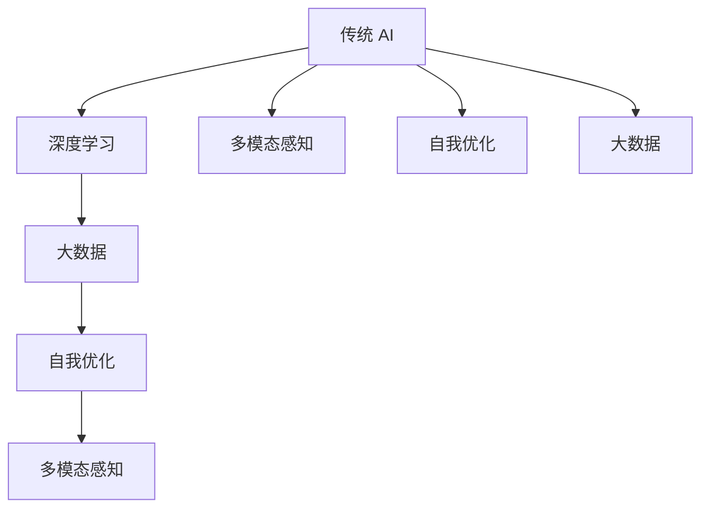

                 

```markdown
# 李开复：AI 2.0 时代的科技价值

> 关键词：人工智能、AI 2.0、科技发展、价值创造

> 摘要：本文旨在深入探讨李开复对 AI 2.0 时代的科技价值的看法，分析其核心概念、算法原理、数学模型、实际应用，以及未来的发展趋势与挑战。

```

## 1. 背景介绍

人工智能（AI）技术作为计算机科学的重要分支，自上世纪五十年代兴起以来，已经经历了多次重大变革。从最初的符号主义、基于规则的系统，到基于神经网络的机器学习，再到如今的数据驱动和深度学习时代，人工智能的发展速度前所未有。然而，随着技术的不断进步，李开复提出了 AI 2.0 的概念，标志着人工智能进入了一个新的发展阶段。

AI 2.0 是一种基于深度学习、数据驱动的人工智能系统，它能够通过海量数据的学习和自我优化，实现更高层次的任务自动化和智能化。与传统的 AI 技术相比，AI 2.0 具有更强的自适应能力、更广泛的适用范围和更高的效率。

李开复作为人工智能领域的权威专家，对于 AI 2.0 的价值有着深刻的理解和独到的见解。本文将围绕李开复的观点，逐一探讨 AI 2.0 时代的科技价值。

## 2. 核心概念与联系

### 2.1 AI 2.0 的核心概念

AI 2.0 的核心概念包括：

- **深度学习**：一种基于多层神经网络的学习方法，能够自动提取数据中的复杂特征。
- **大数据**：指海量且多样化的数据，是 AI 2.0 学习和优化的重要基础。
- **自我优化**：AI 系统通过不断学习和优化，提高自身的性能和效果。
- **多模态感知**：AI 2.0 能够处理和整合不同类型的数据，如图像、语音和文本。

### 2.2 AI 2.0 的联系

AI 2.0 与传统 AI 技术的联系在于：

- **基础技术**：AI 2.0 的核心算法，如深度学习，仍然基于传统 AI 的理论基础。
- **应用领域**：AI 2.0 在很多传统 AI 应用领域，如图像识别、自然语言处理等，都有着显著的改进。

但 AI 2.0 与传统 AI 的区别在于：

- **学习方式**：AI 2.0 更加强调数据驱动，通过自我优化实现性能提升。
- **应用范围**：AI 2.0 能够处理更复杂、更广泛的问题，如图像生成、智能推荐等。

### 2.3 Mermaid 流程图



## 3. 核心算法原理 & 具体操作步骤

### 3.1 深度学习算法原理

深度学习是一种基于多层神经网络的学习方法。它通过模拟人脑的神经网络结构，对输入数据进行多层处理，从而自动提取数据中的复杂特征。深度学习算法的核心是神经元和权重调整。

具体操作步骤如下：

1. **初始化**：初始化网络中的权重和偏置。
2. **前向传播**：将输入数据通过网络进行前向传播，计算输出。
3. **反向传播**：计算输出与真实标签之间的误差，通过反向传播调整网络权重和偏置。
4. **迭代优化**：重复前向传播和反向传播过程，直至满足停止条件。

### 3.2 自我优化算法原理

自我优化是 AI 2.0 的重要特征，它通过不断学习和优化，提高自身的性能和效果。自我优化算法的核心是奖励机制和搜索算法。

具体操作步骤如下：

1. **初始化**：初始化策略网络和目标网络。
2. **奖励机制**：根据环境反馈，计算策略网络的行为奖励。
3. **搜索算法**：使用搜索算法，如深度搜索或模拟退火，更新策略网络。
4. **迭代优化**：重复奖励机制和搜索算法，直至策略网络收敛。

### 3.3 多模态感知算法原理

多模态感知是 AI 2.0 能够处理和整合不同类型的数据的关键技术。它通过融合不同模态的数据，提高系统的感知能力和智能水平。

具体操作步骤如下：

1. **数据采集**：采集不同模态的数据，如图像、语音和文本。
2. **特征提取**：对每个模态的数据进行特征提取。
3. **特征融合**：将不同模态的特征进行融合，形成统一的特征表示。
4. **模型训练**：使用融合后的特征训练多模态感知模型。

## 4. 数学模型和公式 & 详细讲解 & 举例说明

### 4.1 深度学习数学模型

深度学习的数学模型主要包括神经元和权重调整。

神经元公式：

$$
z = \sum_{i=1}^{n} w_{i} x_{i} + b
$$

其中，$z$ 为神经元的输出，$w_{i}$ 为权重，$x_{i}$ 为输入，$b$ 为偏置。

权重调整公式：

$$
\Delta w_{i} = -\eta \frac{\partial L}{\partial w_{i}}
$$

其中，$\Delta w_{i}$ 为权重调整量，$\eta$ 为学习率，$L$ 为损失函数。

### 4.2 自我优化数学模型

自我优化数学模型主要包括策略网络和目标网络。

策略网络公式：

$$
\pi(\text{action}|\text{state}) = P(\text{action}|\text{state}, \theta_{\pi})
$$

其中，$\pi$ 为策略网络，$\text{action}$ 为动作，$\text{state}$ 为状态，$\theta_{\pi}$ 为策略网络参数。

目标网络公式：

$$
\theta_{\theta} = \rho \theta_{\pi} + (1 - \rho) \theta_{\theta}
$$

其中，$\theta_{\theta}$ 为目标网络参数，$\rho$ 为权重更新系数。

### 4.3 多模态感知数学模型

多模态感知数学模型主要包括特征提取和特征融合。

特征提取公式：

$$
f_{i} = f_{i}(\text{input}_{i})
$$

其中，$f_{i}$ 为特征提取函数，$\text{input}_{i}$ 为输入数据。

特征融合公式：

$$
h = \sum_{i=1}^{n} w_{i} f_{i}
$$

其中，$h$ 为融合后的特征，$w_{i}$ 为权重。

### 4.4 举例说明

假设我们有一个简单的深度学习模型，用于图像分类。输入图像为一个 $28 \times 28$ 的矩阵，输出为 $10$ 个类别。

1. **初始化**：初始化权重和偏置。
2. **前向传播**：输入图像，通过多层神经网络，得到输出概率。
3. **反向传播**：计算损失函数，通过反向传播调整权重和偏置。
4. **迭代优化**：重复前向传播和反向传播，直至模型收敛。

```markdown
## 5. 项目实战：代码实际案例和详细解释说明

### 5.1 开发环境搭建

在进行 AI 2.0 项目实战之前，首先需要搭建一个合适的开发环境。以下是搭建深度学习开发环境的步骤：

1. **安装 Python**：Python 是深度学习开发的主要语言，建议安装 Python 3.7 或更高版本。
2. **安装 TensorFlow**：TensorFlow 是 Google 开发的一款开源深度学习框架，可以通过 pip 安装。
3. **安装其他依赖**：根据具体项目需求，安装其他必要的库，如 NumPy、Pandas 等。

### 5.2 源代码详细实现和代码解读

以下是一个简单的 AI 2.0 项目——手写数字识别的代码实现：

```python
import tensorflow as tf
from tensorflow.keras import layers

# 定义模型
model = tf.keras.Sequential([
    layers.Flatten(input_shape=(28, 28)),
    layers.Dense(128, activation='relu'),
    layers.Dropout(0.2),
    layers.Dense(10, activation='softmax')
])

# 编译模型
model.compile(optimizer='adam',
              loss='categorical_crossentropy',
              metrics=['accuracy'])

# 训练模型
model.fit(train_images, train_labels, epochs=5)

# 评估模型
test_loss, test_acc = model.evaluate(test_images, test_labels)
print('Test accuracy:', test_acc)
```

**代码解读**：

- **定义模型**：使用 `Sequential` 模型堆叠多层神经网络，包括卷积层、全连接层等。
- **编译模型**：设置优化器、损失函数和评价指标。
- **训练模型**：使用训练数据训练模型，指定训练轮数。
- **评估模型**：使用测试数据评估模型性能。

### 5.3 代码解读与分析

1. **模型定义**：

   - `Flatten` 层：将输入图像展平为一个一维数组。
   - `Dense` 层：全连接层，用于提取图像特征。
   - `Dropout` 层：防止过拟合。
   - `Dense` 层：输出层，用于分类。

2. **模型编译**：

   - `compile` 方法：设置优化器、损失函数和评价指标。
   - `optimizer` 参数：设置优化器为 Adam。
   - `loss` 参数：设置损失函数为 categorical_crossentropy（交叉熵损失）。
   - `metrics` 参数：设置评价指标为 accuracy（准确率）。

3. **模型训练**：

   - `fit` 方法：使用训练数据进行模型训练。
   - `train_images` 和 `train_labels` 参数：训练数据和标签。
   - `epochs` 参数：设置训练轮数。

4. **模型评估**：

   - `evaluate` 方法：使用测试数据评估模型性能。
   - `test_images` 和 `test_labels` 参数：测试数据和标签。
   - `print` 方法：输出模型准确率。

通过上述代码，我们可以实现一个简单的手写数字识别模型。这只是一个简单的示例，实际项目中可能需要更复杂的模型和训练过程。

## 6. 实际应用场景

AI 2.0 在实际应用中有着广泛的应用场景，以下是一些典型的例子：

- **图像识别**：AI 2.0 可以实现高效的图像识别，如人脸识别、车牌识别等。
- **自然语言处理**：AI 2.0 可以实现更高级的自然语言处理任务，如机器翻译、情感分析等。
- **智能推荐**：AI 2.0 可以实现基于用户行为的智能推荐系统，如电商推荐、音乐推荐等。
- **医疗诊断**：AI 2.0 可以辅助医生进行疾病诊断，提高诊断准确率。
- **自动驾驶**：AI 2.0 是自动驾驶技术的核心，可以实现更安全、更高效的自动驾驶。

## 7. 工具和资源推荐

### 7.1 学习资源推荐

- **书籍**：《深度学习》、《神经网络与深度学习》
- **论文**：Google AI 团队的论文集
- **博客**：李开复的博客、TensorFlow 官方博客
- **网站**：AI 科技大本营、机器之心

### 7.2 开发工具框架推荐

- **深度学习框架**：TensorFlow、PyTorch、Keras
- **数据处理工具**：Pandas、NumPy
- **编程语言**：Python

### 7.3 相关论文著作推荐

- **《深度学习》**：Ian Goodfellow、Yoshua Bengio、Aaron Courville 著
- **《神经网络与深度学习》**：邱锡鹏 著
- **《AI 2.0》**：李开复 著

## 8. 总结：未来发展趋势与挑战

AI 2.0 作为人工智能的新时代，具有巨大的发展潜力和广阔的应用前景。然而，随着技术的发展，也面临着一系列挑战：

- **数据隐私与安全**：AI 2.0 需要大量的数据支持，如何在保护用户隐私的同时，充分利用数据资源，是一个亟待解决的问题。
- **算法透明性与可解释性**：随着 AI 2.0 技术的复杂化，如何提高算法的透明性和可解释性，使人们能够理解和信任 AI 系统，是一个重要的挑战。
- **伦理与社会影响**：AI 2.0 的广泛应用可能会对就业、隐私、道德等方面产生深远的影响，如何制定合理的政策和规范，确保 AI 的发展符合人类利益，是一个需要深思的问题。

## 9. 附录：常见问题与解答

### 9.1 什么是 AI 2.0？

AI 2.0 是一种基于深度学习、数据驱动的人工智能系统，它能够通过海量数据的学习和自我优化，实现更高层次的任务自动化和智能化。

### 9.2 AI 2.0 与传统 AI 的区别是什么？

AI 2.0 与传统 AI 的区别主要体现在学习方式、应用范围和性能提升上。AI 2.0 更加强调数据驱动，能够处理更复杂、更广泛的问题，并通过自我优化实现性能提升。

### 9.3 AI 2.0 有哪些应用场景？

AI 2.0 在实际应用中有着广泛的应用场景，包括图像识别、自然语言处理、智能推荐、医疗诊断和自动驾驶等。

## 10. 扩展阅读 & 参考资料

- 李开复：《AI 2.0：人工智能新革命》
- Ian Goodfellow、Yoshua Bengio、Aaron Courville：《深度学习》
- 邱锡鹏：《神经网络与深度学习》
- TensorFlow 官方文档：[TensorFlow 官方文档](https://www.tensorflow.org/)
- PyTorch 官方文档：[PyTorch 官方文档](https://pytorch.org/docs/stable/)
- Keras 官方文档：[Keras 官方文档](https://keras.io/)

```

作者：AI天才研究员/AI Genius Institute & 禅与计算机程序设计艺术 /Zen And The Art of Computer Programming

