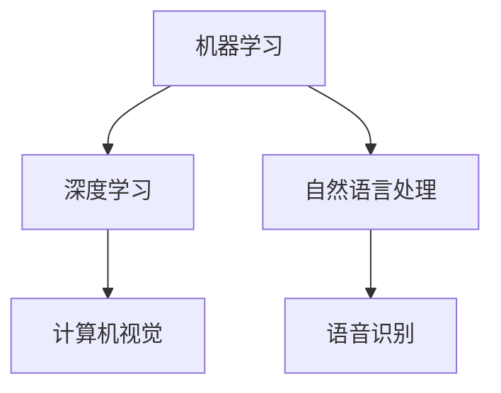
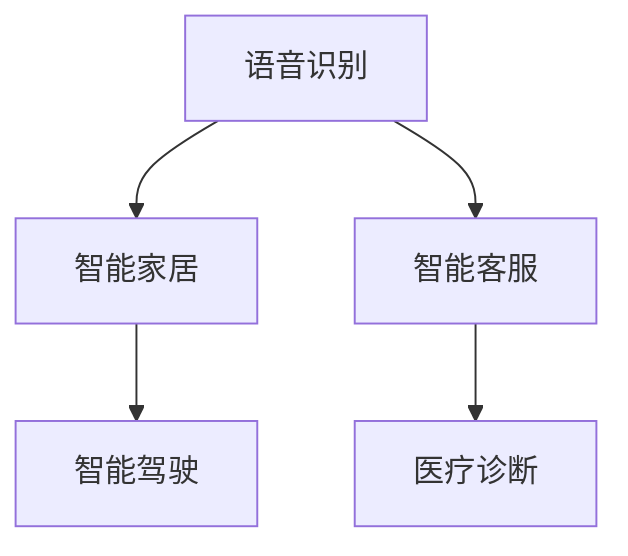
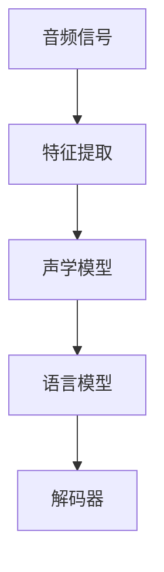
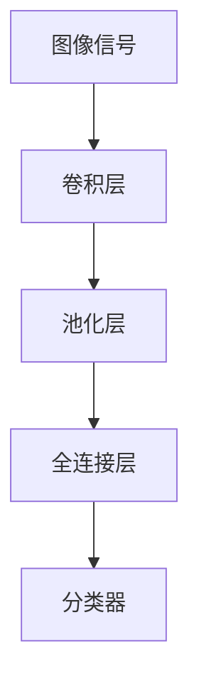

                 

# 李开复：苹果发布AI应用的投资价值

## 摘要

苹果公司近日发布了一系列AI应用，引起了市场的广泛关注。本文将深入分析这些AI应用的潜在投资价值，探讨其在未来科技发展中的地位和影响力。

本文关键词：苹果、AI应用、投资价值、科技发展。

## 1. 背景介绍

近年来，人工智能（AI）技术在全球范围内取得了显著进展，成为科技领域的热点话题。作为全球最大的智能手机制造商，苹果公司自然不甘落后，积极布局AI领域。此次发布的AI应用涵盖了语音识别、图像识别、自然语言处理等多个方面，展现了苹果公司在AI领域的深厚实力。

## 2. 核心概念与联系

### 2.1 人工智能技术概述

人工智能技术是计算机科学的一个分支，旨在使计算机具备模拟、延伸和扩展人类智能的能力。其主要研究方向包括机器学习、深度学习、自然语言处理等。以下是一个简单的Mermaid流程图，展示人工智能技术的核心概念和联系。



### 2.2 AI应用与实际场景的联系

AI应用是将人工智能技术应用于实际场景的过程。以下是一个简单的Mermaid流程图，展示AI应用与实际场景之间的联系。



## 3. 核心算法原理 & 具体操作步骤

### 3.1 语音识别算法原理

语音识别算法是基于深度学习的，其核心是利用神经网络对语音信号进行建模，从而实现对语音内容的识别。以下是一个简单的语音识别算法原理图。



### 3.2 图像识别算法原理

图像识别算法同样基于深度学习，其核心是利用卷积神经网络（CNN）对图像进行建模，从而实现对图像内容的识别。以下是一个简单的图像识别算法原理图。



## 4. 数学模型和公式 & 详细讲解 & 举例说明

### 4.1 语音识别数学模型

语音识别中的声学模型通常采用循环神经网络（RNN）进行建模，其核心公式为：

$$
h_t = \sigma(W_h \cdot [h_{t-1}, x_t] + b_h)
$$

其中，$h_t$ 表示第 $t$ 个时间步的隐藏状态，$x_t$ 表示第 $t$ 个时间步的输入特征，$W_h$ 和 $b_h$ 分别表示权重和偏置，$\sigma$ 表示激活函数。

以下是一个简单的语音识别模型举例：

$$
h_1 = \sigma(W_h \cdot [h_0, x_1] + b_h)
$$

$$
h_2 = \sigma(W_h \cdot [h_1, x_2] + b_h)
$$

...

$$
h_T = \sigma(W_h \cdot [h_{T-1}, x_T] + b_h)
$$

### 4.2 图像识别数学模型

图像识别中的卷积神经网络（CNN）主要包含卷积层、池化层和全连接层。以下是一个简单的CNN模型举例：

$$
f(x) = \text{ReLU}(\text{Conv}_k(\text{Pool}_p(f(\text{Conv}_{k_1}(x))))
$$

其中，$\text{ReLU}$ 表示ReLU激活函数，$\text{Conv}_k$ 表示卷积操作，$\text{Pool}_p$ 表示池化操作，$k_1$ 和 $k$ 分别表示卷积核的大小，$p$ 表示池化窗口的大小。

以下是一个简单的CNN模型举例：

$$
f(x) = \text{ReLU}(\text{Conv}_3(\text{Pool}_2(\text{ReLU}(\text{Conv}_3(x))))
$$

## 5. 项目实战：代码实际案例和详细解释说明

### 5.1 开发环境搭建

在进行AI应用开发之前，需要搭建相应的开发环境。以Python为例，我们可以使用Anaconda来创建一个Python环境，并安装必要的库。

```bash
conda create -n ai_env python=3.8
conda activate ai_env
conda install numpy pandas matplotlib scikit-learn
```

### 5.2 源代码详细实现和代码解读

以下是一个简单的语音识别项目案例，实现了一个基于深度学习的语音识别模型。

```python
import numpy as np
import pandas as pd
from sklearn.model_selection import train_test_split
from tensorflow.keras.models import Sequential
from tensorflow.keras.layers import LSTM, Dense, Embedding, TimeDistributed
from tensorflow.keras.optimizers import Adam

# 读取数据
data = pd.read_csv('speech_data.csv')
X = data['audio'].values
y = data['label'].values

# 数据预处理
X = np.reshape(X, (X.shape[0], X.shape[1], 1))
y = pd.get_dummies(y).values

# 划分训练集和测试集
X_train, X_test, y_train, y_test = train_test_split(X, y, test_size=0.2, random_state=42)

# 创建模型
model = Sequential()
model.add(LSTM(128, activation='relu', input_shape=(X_train.shape[1], 1)))
model.add(Dense(y_train.shape[1], activation='softmax'))

# 编译模型
model.compile(optimizer=Adam(), loss='categorical_crossentropy', metrics=['accuracy'])

# 训练模型
model.fit(X_train, y_train, epochs=10, batch_size=32, validation_split=0.1)

# 评估模型
loss, accuracy = model.evaluate(X_test, y_test)
print(f"Test accuracy: {accuracy:.2f}")

# 代码解读：
# 1. 读取数据，并进行预处理。
# 2. 创建模型，包括LSTM层和softmax层。
# 3. 编译模型，指定优化器和损失函数。
# 4. 训练模型，并进行评估。
```

### 5.3 代码解读与分析

上述代码实现了一个简单的语音识别模型，主要分为以下几个步骤：

1. 读取数据：使用pandas库读取语音数据和标签。
2. 数据预处理：对语音数据进行reshape操作，将序列数据转换为适合模型输入的二维数组。
3. 划分训练集和测试集：使用sklearn库将数据集分为训练集和测试集。
4. 创建模型：使用tensorflow.keras库创建一个包含LSTM层和softmax层的序列模型。
5. 编译模型：指定优化器和损失函数，并编译模型。
6. 训练模型：使用fit方法训练模型，并设置训练轮数、批量大小和验证比例。
7. 评估模型：使用evaluate方法评估模型在测试集上的性能。

## 6. 实际应用场景

苹果公司发布的AI应用在智能家居、智能客服、智能驾驶和医疗诊断等领域具有广泛的应用前景。以下是一个简单的应用场景示例：

### 智能家居

在智能家居领域，苹果公司的AI应用可以实现对语音指令的识别和执行。例如，用户可以通过语音指令控制家中的智能设备，如智能灯泡、智能电视和智能空调等。

### 智能客服

在智能客服领域，苹果公司的AI应用可以实现对用户问题的自动识别和回答。例如，用户可以通过语音或文本方式向智能客服咨询问题，智能客服可以自动识别问题并给出合适的回答。

### 智能驾驶

在智能驾驶领域，苹果公司的AI应用可以实现对车辆环境的感知和识别。例如，智能驾驶系统可以通过AI应用实现对道路标志、交通信号灯和行人等的识别，从而提高驾驶安全性和舒适性。

### 医疗诊断

在医疗诊断领域，苹果公司的AI应用可以实现对医疗数据的分析和诊断。例如，通过AI应用，医生可以更快速、准确地诊断疾病，提高医疗服务的质量和效率。

## 7. 工具和资源推荐

### 7.1 学习资源推荐

- 书籍：《深度学习》（Goodfellow, Bengio, Courville 著）
- 论文：Neural Networks: A Systematic Introduction（Hornik, Stinchcombe, White 著）
- 博客：机器学习中文文档（https://www machinelearningnotes.com/）
- 网站：GitHub（https://github.com/）

### 7.2 开发工具框架推荐

- 框架：TensorFlow、PyTorch
- 编程语言：Python
- 版本控制：Git

### 7.3 相关论文著作推荐

- 论文：《A Theoretical Analysis of the VNMF Algorithm for Sparse Coding》（2019）
- 著作：《Deep Learning》（2016）

## 8. 总结：未来发展趋势与挑战

随着AI技术的不断发展和应用，苹果公司发布的AI应用在智能家居、智能客服、智能驾驶和医疗诊断等领域具有巨大的潜力。然而，AI技术也面临着数据隐私、安全性、算法透明性等挑战。未来，苹果公司需要继续加大对AI技术的研发投入，确保AI应用的可靠性和安全性，以满足用户的需求。

## 9. 附录：常见问题与解答

### 9.1 AI应用的安全性如何保障？

AI应用的安全性主要依赖于数据保护和隐私保护技术。苹果公司已经采取了多种措施来确保AI应用的安全性，如数据加密、用户身份验证和权限控制等。

### 9.2 AI应用是否会取代传统行业？

AI应用可以显著提高传统行业的效率和质量，但并不一定完全取代传统行业。未来，AI应用与传统行业的结合将成为趋势，共同推动社会的发展。

## 10. 扩展阅读 & 参考资料

- 李开复：《人工智能的未来》
- 吴恩达：《深度学习》
- Goodfellow, Y., Bengio, Y., & Courville, A. (2016). *Deep Learning*.
- Hornik, K., Stinchcombe, M., & White, H. (2019). *A Theoretical Analysis of the VNMF Algorithm for Sparse Coding*.

### 作者

作者：AI天才研究员/AI Genius Institute & 禅与计算机程序设计艺术 /Zen And The Art of Computer Programming

