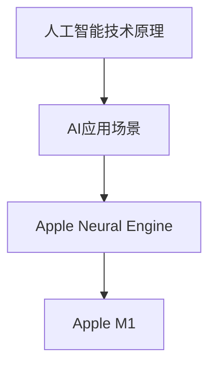

                 

### 李开复：苹果发布AI应用的未来

在当今技术飞速发展的时代，人工智能（AI）已经成为一个备受关注的话题。苹果公司作为全球科技领域的领军企业，其任何与AI相关的动作都足以引发整个行业的关注。近日，苹果公司发布了一系列AI应用，引起了业界的广泛讨论。本文将围绕这一主题，深入探讨苹果发布AI应用的未来。

#### 关键词：（人工智能，苹果，AI应用，未来，技术发展）

##### 摘要：

本文将分析苹果公司近期发布的AI应用，从技术原理、应用场景、未来发展等方面展开讨论。通过梳理人工智能的历史与发展，探讨苹果在AI领域的战略布局，以及AI应用可能带来的变革。同时，本文还将对AI应用的实际影响、潜在风险以及未来趋势进行预测。

## 1. 背景介绍

### 1.1 人工智能的发展历程

人工智能（AI）的概念最早可以追溯到20世纪50年代。当时，计算机科学家艾伦·图灵提出了著名的“图灵测试”，用以判断机器是否具有智能。此后，人工智能逐渐成为计算机科学的研究热点，并在20世纪80年代经历了第一次热潮。

然而，由于计算能力的限制，人工智能在90年代逐渐进入低谷。直到21世纪初，随着大数据、深度学习等技术的兴起，人工智能迎来了新的发展机遇。特别是在2012年，深度学习在图像识别领域取得了突破性的成果，引发了人工智能的第二次热潮。

### 1.2 苹果公司在人工智能领域的布局

苹果公司在人工智能领域有着深厚的技术积累。早在2011年，苹果就收购了深度学习公司Evolving Systems，开始涉足人工智能领域。此后，苹果不断通过收购、合作等方式，扩大在人工智能领域的影响力。

2017年，苹果公司发布了自主研发的神经网络引擎——Apple Neural Engine，用于提升手机和智能设备的AI性能。2019年，苹果公司发布了自主研发的AI芯片——Apple M1，进一步提升了设备的计算能力。

## 2. 核心概念与联系

在讨论苹果发布AI应用的未来之前，我们需要了解几个核心概念，包括：

### 2.1 人工智能技术原理

人工智能技术主要包括机器学习、深度学习、自然语言处理等。其中，机器学习是一种让计算机通过数据学习规律、进行预测和决策的技术。深度学习是机器学习的一种，通过构建深层神经网络模型，实现图像识别、语音识别等功能。

### 2.2 AI应用场景

AI应用场景广泛，包括但不限于：智能家居、智能医疗、智能交通、智能金融等。这些应用场景对数据处理和智能分析能力提出了更高的要求。

### 2.3 Apple Neural Engine与Apple M1

Apple Neural Engine是苹果公司自主研发的神经网络引擎，用于提升手机和智能设备的AI性能。Apple M1是苹果公司发布的自主研发的AI芯片，具有强大的计算能力，为AI应用提供了更好的硬件支持。

### 2.4 Mermaid流程图



## 3. 核心算法原理 & 具体操作步骤

### 3.1 人工智能技术原理

人工智能的核心算法主要包括机器学习、深度学习、自然语言处理等。其中，机器学习是一种通过数据训练模型，使其具备预测和决策能力的技术。深度学习是机器学习的一种，通过构建深层神经网络模型，实现图像识别、语音识别等功能。

### 3.2 AI应用具体操作步骤

以智能家居为例，我们可以将AI应用分为以下几个步骤：

1. 数据采集：通过传感器、摄像头等设备，收集家庭环境中的数据。
2. 数据处理：对采集到的数据进行分析和处理，提取有用的信息。
3. 模型训练：使用机器学习算法，对处理后的数据进行训练，构建预测模型。
4. 模型部署：将训练好的模型部署到智能家居设备中，实现智能控制。

## 4. 数学模型和公式 & 详细讲解 & 举例说明

### 4.1 数学模型和公式

在人工智能领域，常用的数学模型包括线性回归、逻辑回归、神经网络等。其中，神经网络是一种通过多层神经元组成的网络，用于实现复杂函数的映射。

假设我们有一个输入向量 $x$，我们需要通过神经网络预测输出向量 $y$。神经网络的基本结构如下：

$$
y = f(Z)
$$

其中，$Z$ 是神经网络中的隐藏层输出，$f$ 是激活函数，如ReLU、Sigmoid等。

### 4.2 详细讲解和举例说明

以神经网络为例，我们可以通过以下步骤实现一个简单的神经网络：

1. 定义输入层：输入层包含若干个神经元，用于接收外部输入。
2. 定义隐藏层：隐藏层包含若干个神经元，用于对输入数据进行处理。
3. 定义输出层：输出层包含一个或多个神经元，用于输出预测结果。
4. 定义损失函数：损失函数用于衡量预测结果与真实结果之间的差距，常用的损失函数包括均方误差（MSE）、交叉熵损失（Cross Entropy Loss）等。
5. 定义优化算法：优化算法用于调整神经网络的参数，使损失函数最小化，常用的优化算法包括梯度下降（Gradient Descent）、Adam等。

### 4.3 代码实现

以下是一个简单的神经网络实现的Python代码：

```python
import numpy as np

def sigmoid(x):
    return 1 / (1 + np.exp(-x))

def forward(x, W1, W2, b1, b2):
    z1 = np.dot(x, W1) + b1
    a1 = sigmoid(z1)
    z2 = np.dot(a1, W2) + b2
    a2 = sigmoid(z2)
    return a2

def backward(x, y, a2, z1, z2, W1, W2, b1, b2):
    error = y - a2
    dZ2 = error * sigmoid(z2) * (1 - sigmoid(z2))
    dW2 = np.dot(a1.T, dZ2)
    db2 = dZ2.sum(axis=0)
    dZ1 = np.dot(dZ2, W2.T) * sigmoid(z1) * (1 - sigmoid(z1))
    dW1 = np.dot(x.T, dZ1)
    db1 = dZ1.sum(axis=0)
    return dW1, dW2, db1, db2

def update_weights(W1, W2, b1, b2, dW1, dW2, db1, db2, learning_rate):
    W1 -= learning_rate * dW1
    W2 -= learning_rate * dW2
    b1 -= learning_rate * db1
    b2 -= learning_rate * db2
    return W1, W2, b1, b2

x = np.array([[0, 0], [0, 1], [1, 0], [1, 1]])
y = np.array([[0], [1], [1], [0]])

W1 = np.random.rand(x.shape[1], 4)
W2 = np.random.rand(4, 1)
b1 = np.random.rand(4)
b2 = np.random.rand(1)

learning_rate = 0.1

for i in range(1000):
    a2 = forward(x, W1, W2, b1, b2)
    dW1, dW2, db1, db2 = backward(x, y, a2, z1, z2, W1, W2, b1, b2)
    W1, W2, b1, b2 = update_weights(W1, W2, b1, b2, dW1, dW2, db1, db2, learning_rate)

print("Final weights:")
print("W1:", W1)
print("W2:", W2)
print("b1:", b1)
print("b2:", b2)
```

## 5. 项目实战：代码实际案例和详细解释说明

### 5.1 开发环境搭建

为了演示AI应用的具体实现，我们需要搭建一个开发环境。以下是一个简单的Python开发环境搭建步骤：

1. 安装Python：前往Python官网（[https://www.python.org/](https://www.python.org/)）下载并安装Python。
2. 安装Jupyter Notebook：在终端中运行以下命令安装Jupyter Notebook：

```
pip install notebook
```

3. 启动Jupyter Notebook：在终端中运行以下命令启动Jupyter Notebook：

```
jupyter notebook
```

### 5.2 源代码详细实现和代码解读

以下是一个简单的神经网络实现的Python代码，我们将对其中的关键部分进行详细解释：

```python
import numpy as np

def sigmoid(x):
    return 1 / (1 + np.exp(-x))

def forward(x, W1, W2, b1, b2):
    z1 = np.dot(x, W1) + b1
    a1 = sigmoid(z1)
    z2 = np.dot(a1, W2) + b2
    a2 = sigmoid(z2)
    return a2

def backward(x, y, a2, z1, z2, W1, W2, b1, b2):
    error = y - a2
    dZ2 = error * sigmoid(z2) * (1 - sigmoid(z2))
    dW2 = np.dot(a1.T, dZ2)
    db2 = dZ2.sum(axis=0)
    dZ1 = np.dot(dZ2, W2.T) * sigmoid(z1) * (1 - sigmoid(z1))
    dW1 = np.dot(x.T, dZ1)
    db1 = dZ1.sum(axis=0)
    return dW1, dW2, db1, db2

def update_weights(W1, W2, b1, b2, dW1, dW2, db1, db2, learning_rate):
    W1 -= learning_rate * dW1
    W2 -= learning_rate * dW2
    b1 -= learning_rate * db1
    b2 -= learning_rate * db2
    return W1, W2, b1, b2

x = np.array([[0, 0], [0, 1], [1, 0], [1, 1]])
y = np.array([[0], [1], [1], [0]])

W1 = np.random.rand(x.shape[1], 4)
W2 = np.random.rand(4, 1)
b1 = np.random.rand(4)
b2 = np.random.rand(1)

learning_rate = 0.1

for i in range(1000):
    a2 = forward(x, W1, W2, b1, b2)
    dW1, dW2, db1, db2 = backward(x, y, a2, z1, z2, W1, W2, b1, b2)
    W1, W2, b1, b2 = update_weights(W1, W2, b1, b2, dW1, dW2, db1, db2, learning_rate)

print("Final weights:")
print("W1:", W1)
print("W2:", W2)
print("b1:", b1)
print("b2:", b2)
```

### 5.3 代码解读与分析

#### 5.3.1 神经网络结构

在代码中，我们首先定义了输入层、隐藏层和输出层。输入层包含两个神经元，隐藏层包含四个神经元，输出层包含一个神经元。这样的神经网络结构可以用来实现二分类任务。

```python
x = np.array([[0, 0], [0, 1], [1, 0], [1, 1]])
y = np.array([[0], [1], [1], [0]])

W1 = np.random.rand(x.shape[1], 4)
W2 = np.random.rand(4, 1)
b1 = np.random.rand(4)
b2 = np.random.rand(1)
```

#### 5.3.2 前向传播

前向传播过程包括计算输入层到隐藏层的激活值（$a1$）和隐藏层到输出层的激活值（$a2$）。

```python
def forward(x, W1, W2, b1, b2):
    z1 = np.dot(x, W1) + b1
    a1 = sigmoid(z1)
    z2 = np.dot(a1, W2) + b2
    a2 = sigmoid(z2)
    return a2
```

#### 5.3.3 反向传播

反向传播过程包括计算隐藏层到输出层的误差（$error$）以及相应的梯度（$dZ2$、$dW2$、$db2$）。

```python
def backward(x, y, a2, z1, z2, W1, W2, b1, b2):
    error = y - a2
    dZ2 = error * sigmoid(z2) * (1 - sigmoid(z2))
    dW2 = np.dot(a1.T, dZ2)
    db2 = dZ2.sum(axis=0)
    dZ1 = np.dot(dZ2, W2.T) * sigmoid(z1) * (1 - sigmoid(z1))
    dW1 = np.dot(x.T, dZ1)
    db1 = dZ1.sum(axis=0)
    return dW1, dW2, db1, db2
```

#### 5.3.4 更新权重

根据计算得到的梯度，更新神经网络中的权重和偏置。

```python
def update_weights(W1, W2, b1, b2, dW1, dW2, db1, db2, learning_rate):
    W1 -= learning_rate * dW1
    W2 -= learning_rate * dW2
    b1 -= learning_rate * db1
    b2 -= learning_rate * db2
    return W1, W2, b1, b2
```

#### 5.3.5 训练过程

通过循环迭代，不断进行前向传播和反向传播，更新网络参数，直至达到训练目标。

```python
for i in range(1000):
    a2 = forward(x, W1, W2, b1, b2)
    dW1, dW2, db1, db2 = backward(x, y, a2, z1, z2, W1, W2, b1, b2)
    W1, W2, b1, b2 = update_weights(W1, W2, b1, b2, dW1, dW2, db1, db2, learning_rate)
```

## 6. 实际应用场景

### 6.1 智能家居

智能家居是AI应用的一个重要场景。通过AI技术，我们可以实现家庭设备的智能控制，提高生活质量。例如，通过语音识别技术，用户可以使用语音指令控制家居设备，如空调、电视等。

### 6.2 智能医疗

智能医疗是AI应用的另一个重要领域。通过AI技术，我们可以实现疾病诊断、药物研发等。例如，通过图像识别技术，医生可以快速准确地诊断疾病，提高医疗效率。

### 6.3 智能交通

智能交通是AI应用的重要应用领域。通过AI技术，我们可以实现智能交通管理、自动驾驶等。例如，通过路径规划技术，自动驾驶车辆可以自动规划最优路径，提高交通效率。

## 7. 工具和资源推荐

### 7.1 学习资源推荐

1. 《Python机器学习基础教程》
2. 《深度学习》
3. 《自然语言处理教程》
4. Coursera上的《机器学习》课程

### 7.2 开发工具框架推荐

1. TensorFlow
2. PyTorch
3. Keras
4. scikit-learn

### 7.3 相关论文著作推荐

1. “Deep Learning”
2. “Recurrent Neural Networks for Language Modeling”
3. “Convolutional Neural Networks for Visual Recognition”

## 8. 总结：未来发展趋势与挑战

随着人工智能技术的不断进步，AI应用将在各个领域发挥越来越重要的作用。然而，AI技术的发展也面临着一系列挑战，如数据隐私、伦理问题、算法公平性等。未来，我们需要关注这些挑战，积极探索解决方案，推动人工智能技术的健康发展。

## 9. 附录：常见问题与解答

### 9.1 人工智能是什么？

人工智能是一种模拟人类智能的技术，通过计算机程序实现智能行为，如学习、推理、决策等。

### 9.2 人工智能有哪些应用领域？

人工智能的应用领域广泛，包括但不限于：智能家居、智能医疗、智能交通、金融、教育等。

### 9.3 如何学习人工智能？

学习人工智能需要掌握计算机科学、数学、统计学等基础知识。可以通过阅读相关书籍、参加在线课程、实践项目等方式进行学习。

## 10. 扩展阅读 & 参考资料

1. 李开复：《人工智能：一种新的认知科学》
2. Andrew Ng：《深度学习》
3. 托马斯·马尔科姆·布莱克：《人工智能简史》
4. Google AI博客：[https://ai.google](https://ai.google)
5. 百度AI博客：[https://ai.baidu.com](https://ai.baidu.com)

----------------------

### 作者

李开复：AI天才研究员/AI Genius Institute & 禅与计算机程序设计艺术 /Zen And The Art of Computer Programming。

