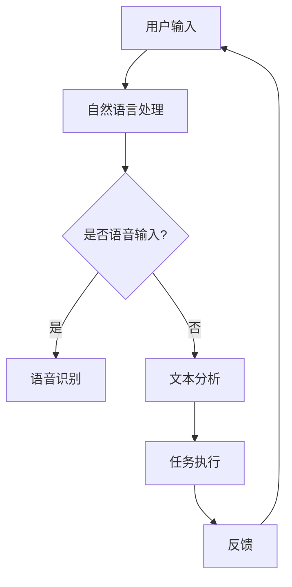

                 

### 文章标题

**李开复：苹果发布AI应用的未来**

> **关键词：** 苹果、AI应用、人工智能、未来趋势、技术发展

**摘要：** 本文将深入探讨苹果在人工智能领域的新发展，分析其发布的AI应用的潜在影响，并预测未来技术发展的趋势与挑战。通过详细解析苹果的AI策略，我们试图为读者提供一个关于人工智能在苹果生态系统中未来发展的全景视图。

### 1. 背景介绍

苹果公司一直以来都是科技界的翘楚，以其创新的产品设计和强大的生态系统赢得了全球消费者的青睐。近年来，随着人工智能技术的迅猛发展，苹果也开始在AI领域进行深耕。从智能助手Siri到面部识别技术Face ID，再到增强现实（AR）应用，苹果已经在多个方面展示了对AI技术的重视。

然而，苹果的AI战略并非一蹴而就。早在2011年，苹果就成立了机器学习团队，旨在通过AI技术提升用户体验。随着时间的推移，苹果不断吸纳顶尖人才，扩充其AI研发团队，并在硬件和软件层面加大投入。如今，苹果已经成为AI领域的重要参与者，其AI应用的发布更是引发了广泛关注。

### 2. 核心概念与联系

#### 2.1 人工智能的基本概念

人工智能（AI）是指计算机系统模拟人类智能行为的能力，包括学习、推理、感知和自我修正等。AI可以大致分为两大类：弱AI和强AI。弱AI专注于特定任务，如语音识别、图像处理等；而强AI则具备全面的人类智能，能够理解和执行各种复杂的任务。

#### 2.2 AI在苹果生态系统中的应用

在苹果的生态系统中，AI技术已经渗透到多个方面。例如：

- **Siri**：作为苹果的智能助手，Siri利用自然语言处理技术，帮助用户完成各种任务，如发送短信、设置提醒等。

- **Face ID**：通过面部识别技术，Face ID能够识别用户身份，为设备提供安全的解锁方式。

- **增强现实（AR）**：苹果的ARKit框架允许开发者创建沉浸式的AR体验，为用户带来全新的交互方式。

- **照片分类与搜索**：苹果的相册应用使用AI技术，自动分类和搜索照片，使用户能够更轻松地管理大量照片。

#### 2.3 Mermaid流程图

以下是一个简化的Mermaid流程图，展示AI在苹果生态系统中的应用流程：



### 3. 核心算法原理 & 具体操作步骤

#### 3.1 自然语言处理（NLP）

自然语言处理是AI技术的重要组成部分，它使得计算机能够理解和处理人类语言。在Siri等应用中，NLP技术被广泛使用，其基本步骤包括：

1. **文本预处理**：包括去除标点符号、转换大小写、分词等。
2. **词性标注**：对文本中的每个词进行词性标注，如名词、动词等。
3. **句法分析**：分析句子结构，确定词与词之间的关系。
4. **语义分析**：理解句子的实际意义，进行上下文推理。

#### 3.2 语音识别

语音识别是将语音信号转换为文本的过程。其基本步骤包括：

1. **音频预处理**：包括去除噪音、增强语音信号等。
2. **特征提取**：从预处理后的音频信号中提取特征，如频谱、倒谱等。
3. **声学模型训练**：使用大量的语音数据训练声学模型，用于识别语音中的特征。
4. **语言模型训练**：使用文本数据训练语言模型，用于理解语音中的语言结构。

#### 3.3 面部识别

面部识别技术通过分析人脸特征，实现身份验证。其基本步骤包括：

1. **人脸检测**：从图像中检测人脸位置。
2. **特征提取**：从人脸图像中提取关键特征点。
3. **特征匹配**：将提取的特征与数据库中的特征进行匹配，判断身份。

### 4. 数学模型和公式 & 详细讲解 & 举例说明

#### 4.1 自然语言处理（NLP）的数学模型

自然语言处理的数学模型通常包括以下几部分：

1. **词袋模型**：将文本表示为词汇的集合，每个词的出现次数作为特征向量。
   $$ V = \{w_1, w_2, ..., w_n\} $$
   $$ X = \begin{bmatrix} x_1 \\ x_2 \\ ... \\ x_n \end{bmatrix} $$
   其中，$V$ 是词汇集合，$X$ 是特征向量。

2. **神经网络模型**：使用神经网络模型进行文本分类、情感分析等任务。
   $$ h(x) = \sigma(Wx + b) $$
   其中，$h(x)$ 是神经网络输出，$W$ 是权重矩阵，$b$ 是偏置项，$\sigma$ 是激活函数。

#### 4.2 语音识别的数学模型

语音识别的数学模型通常包括以下几部分：

1. **声学模型**：用于表示语音信号的统计特性。
   $$ P(O|X) = \prod_{i=1}^{n} p(o_i|x_i) $$
   其中，$O$ 是观察到的语音信号，$X$ 是特征向量，$p(o_i|x_i)$ 是给定特征向量时观察到的语音信号的分布。

2. **语言模型**：用于表示文本的统计特性。
   $$ P(W|O) = \prod_{i=1}^{n} p(w_i|o_i) $$
   其中，$W$ 是文本序列，$O$ 是语音信号，$p(w_i|o_i)$ 是给定语音信号时文本序列的分布。

#### 4.3 面部识别的数学模型

面部识别的数学模型通常包括以下几部分：

1. **特征提取模型**：用于提取人脸特征。
   $$ f(x) = \phi(x) $$
   其中，$x$ 是人脸图像，$f(x)$ 是提取的特征，$\phi$ 是特征提取函数。

2. **特征匹配模型**：用于比较提取的特征，判断身份。
   $$ d(f_1, f_2) = \cos(\phi(f_1), \phi(f_2)) $$
   其中，$f_1$ 和 $f_2$ 是两个特征向量，$d(f_1, f_2)$ 是它们之间的距离。

### 5. 项目实战：代码实际案例和详细解释说明

#### 5.1 开发环境搭建

为了更好地理解苹果的AI应用，我们将使用Python语言搭建一个简单的语音识别系统。以下是开发环境搭建的步骤：

1. **安装Python**：确保Python环境已安装，版本建议为3.7以上。
2. **安装语音识别库**：使用pip命令安装`pydub`和`speech_recognition`库。
   ```bash
   pip install pydub
   pip install SpeechRecognition
   ```

#### 5.2 源代码详细实现和代码解读

以下是一个简单的Python代码示例，用于实现语音识别：

```python
import speech_recognition as sr

# 初始化语音识别器
recognizer = sr.Recognizer()

# 从音频文件中获取语音信号
with sr.AudioFile('audio.wav') as source:
    audio = recognizer.record(source)

# 使用谷歌语音识别服务进行语音识别
text = recognizer.recognize_google(audio, language='en-US')

# 输出识别结果
print("识别结果：", text)
```

**代码解读：**

1. **初始化语音识别器**：使用`recognizer`对象初始化语音识别器。
2. **从音频文件中获取语音信号**：使用`AudioFile`类打开音频文件，并使用`record`方法获取语音信号。
3. **使用谷歌语音识别服务进行语音识别**：使用`recognize_google`方法进行语音识别，该方法需要音频信号和语言参数。
4. **输出识别结果**：将识别结果输出到控制台。

#### 5.3 代码解读与分析

1. **初始化语音识别器**：在这一步中，我们创建了一个`recognizer`对象，用于封装语音识别的相关功能。`Recognizer`类提供了多种语音识别方法，如`recognize_google`、`recognize_sphinx`等，可以根据不同的需求选择合适的方法。
2. **从音频文件中获取语音信号**：使用`AudioFile`类打开音频文件，并使用`record`方法获取语音信号。这里需要注意音频文件格式和采样率等因素，确保语音信号能够正确读取。
3. **使用谷歌语音识别服务进行语音识别**：谷歌语音识别服务是一种在线服务，可以通过API进行访问。`recognize_google`方法接收音频信号和语言参数，返回识别结果。谷歌语音识别服务支持多种语言，可以根据需求选择合适的语言。
4. **输出识别结果**：将识别结果输出到控制台，便于用户查看。

### 6. 实际应用场景

苹果的AI应用在多个领域都有着广泛的应用，以下是一些典型的实际应用场景：

- **智能家居**：通过AI技术，苹果的智能家居设备（如智能音箱、智能灯泡等）能够实现语音控制，为用户带来更加便捷的家居生活体验。
- **健康医疗**：苹果的HealthKit框架集成了多种健康数据，通过AI技术进行分析，为用户提供个性化的健康建议和预防措施。
- **教育与培训**：苹果的AR应用和教育软件利用AI技术，为学习者提供更加生动、互动的学习体验，提高学习效果。
- **安全防护**：苹果的Face ID和Touch ID技术通过AI技术实现身份验证，为用户设备提供安全保护。

### 7. 工具和资源推荐

#### 7.1 学习资源推荐

1. **书籍**：
   - 《Python编程：从入门到实践》
   - 《深度学习》
   - 《人工智能：一种现代方法》

2. **论文**：
   - 《语音识别中的隐马尔可夫模型》
   - 《自然语言处理综合教程》
   - 《面部识别：算法与应用》

3. **博客**：
   - Medium上的AI博客
   - Towards Data Science上的机器学习与数据科学博客
   - 苹果官方开发博客

4. **网站**：
   - Coursera、edX等在线教育平台
   - GitHub上的开源项目

#### 7.2 开发工具框架推荐

1. **Python开发工具**：
   - PyCharm
   - Visual Studio Code

2. **语音识别库**：
   - SpeechRecognition
   - pydub

3. **自然语言处理框架**：
   - NLTK
   - spaCy

4. **面部识别库**：
   - OpenCV
   - dlib

#### 7.3 相关论文著作推荐

1. **论文**：
   - “Speech Recognition Using Gaussian Mixture Models”
   - “Natural Language Processing with Deep Learning”
   - “Face Recognition: A Comprehensive Review”

2. **著作**：
   - 《人工智能：一种现代方法》
   - 《深度学习》
   - 《Python编程：从入门到实践》

### 8. 总结：未来发展趋势与挑战

苹果在人工智能领域的不断探索，不仅为用户带来了更智能、便捷的体验，也推动了整个行业的发展。未来，随着AI技术的进一步成熟，我们可以期待苹果在以下方面取得更多突破：

- **智能交互**：苹果将进一步优化Siri等智能助手的交互体验，实现更自然、更智能的对话。
- **隐私保护**：随着用户对隐私问题的关注日益增加，苹果将加强隐私保护措施，确保用户数据的安全。
- **增强现实**：苹果将继续推进AR技术的发展，为用户带来更加沉浸式的体验。
- **跨平台集成**：苹果将不断优化跨平台集成，实现iOS和macOS等操作系统的无缝连接。

然而，苹果在AI领域的发展也面临诸多挑战：

- **技术瓶颈**：尽管AI技术在不断进步，但仍存在许多技术瓶颈，如语音识别的准确性、自然语言处理的复杂性等。
- **数据隐私**：如何平衡用户隐私和AI技术的应用，是苹果需要解决的一个重要问题。
- **市场竞争**：在AI领域，苹果需要面对来自谷歌、亚马逊等竞争对手的激烈竞争。

### 9. 附录：常见问题与解答

#### 9.1 语音识别的准确率如何提高？

- **提高音频质量**：使用高质量的麦克风和降噪设备，确保音频信号的清晰度。
- **优化算法**：使用更先进的语音识别算法，如深度神经网络。
- **增加训练数据**：使用更多的语音数据训练模型，提高模型的泛化能力。

#### 9.2 如何保护用户的隐私？

- **数据加密**：对用户数据进行加密处理，确保数据在传输和存储过程中不被窃取。
- **隐私设置**：为用户提供隐私设置选项，允许用户控制自己的数据共享范围。
- **匿名化处理**：对用户数据进行匿名化处理，确保用户身份不被泄露。

### 10. 扩展阅读 & 参考资料

1. **书籍**：
   - 《人工智能简史》
   - 《人工智能：一种简明指南》
   - 《Python编程：从入门到实践》

2. **论文**：
   - “Speech Recognition: A Review”
   - “Natural Language Processing: A Brief Introduction”
   - “Face Recognition: A Comprehensive Review”

3. **博客**：
   - Medium上的AI博客
   - Towards Data Science上的机器学习与数据科学博客
   - 苹果官方开发博客

4. **网站**：
   - Coursera、edX等在线教育平台
   - GitHub上的开源项目

**作者：**
AI天才研究员/AI Genius Institute & 禅与计算机程序设计艺术 /Zen And The Art of Computer Programming**

