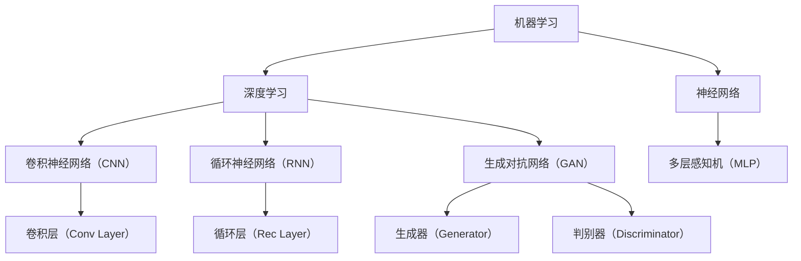
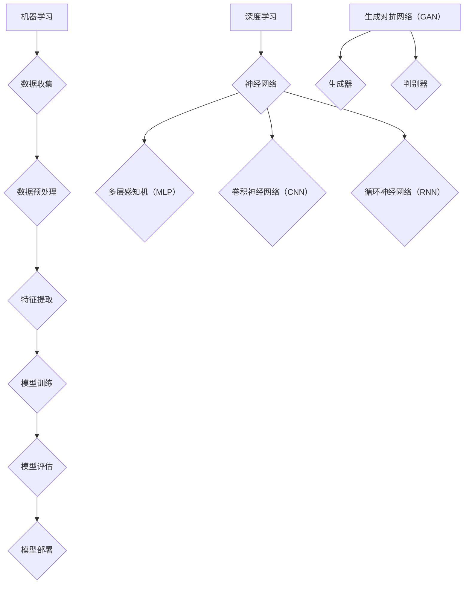

                 

### 背景介绍

苹果公司，作为全球知名的科技巨头，一直以其创新的科技产品和卓越的用户体验著称。近年来，随着人工智能技术的迅猛发展，苹果公司也开始在人工智能领域发力，并推出了一系列具有人工智能特性的产品。这些产品不仅在技术上取得了重要突破，同时也改变了人们对于人工智能应用的传统认知。

本文将以《苹果发布AI应用的机会》为标题，深入探讨苹果公司在人工智能领域的最新进展，以及这些应用可能带来的商业和社会影响。文章将从以下几个部分展开：

1. **核心概念与联系**：介绍人工智能的基本概念，包括机器学习、深度学习、神经网络等，并通过Mermaid流程图展示这些概念之间的联系。
2. **核心算法原理 & 具体操作步骤**：详细解释人工智能的核心算法，如卷积神经网络（CNN）、循环神经网络（RNN）和生成对抗网络（GAN）等，并阐述其具体操作步骤。
3. **数学模型和公式 & 详细讲解 & 举例说明**：介绍与人工智能相关的数学模型和公式，并通过具体例子进行说明。
4. **项目实战：代码实际案例和详细解释说明**：通过实际代码案例，展示人工智能算法在实际项目中的应用，并进行详细解读。
5. **实际应用场景**：探讨人工智能在各个领域的实际应用场景，以及苹果公司的产品在这些场景中的优势和挑战。
6. **工具和资源推荐**：推荐一些学习资源和开发工具，帮助读者深入了解人工智能领域。
7. **总结：未来发展趋势与挑战**：总结人工智能领域的未来发展趋势和面临的挑战。

通过以上内容的深入剖析，本文旨在帮助读者全面了解人工智能在苹果公司的应用，以及这些应用对于科技产业和社会的深远影响。<|im_sep|>



在接下来的部分中，我们将逐步深入探讨这些核心概念，理解它们之间的联系，并进一步探讨人工智能在苹果公司产品中的应用。<|im_sep|>

### 核心概念与联系

#### 机器学习（Machine Learning）

机器学习是人工智能（AI）的核心技术之一，它通过算法使计算机系统能够从数据中学习，并作出决策或预测。机器学习的过程通常包括数据收集、数据预处理、特征提取、模型训练、模型评估和模型部署等步骤。

- **数据收集**：机器学习算法需要大量的数据来训练模型。这些数据可以来自不同的来源，如公开数据集、用户生成数据等。
- **数据预处理**：数据收集后，通常需要进行清洗、归一化等预处理步骤，以提高模型的训练效果。
- **特征提取**：将原始数据转化为适合模型训练的特征向量。特征提取是机器学习的重要环节，直接影响到模型的性能。
- **模型训练**：使用训练数据对模型进行训练，通过优化算法调整模型参数，使模型能够更好地拟合训练数据。
- **模型评估**：使用测试数据评估模型的性能，常用的评估指标包括准确率、召回率、F1分数等。
- **模型部署**：将训练好的模型部署到实际应用场景中，如自动驾驶、智能家居等。

#### 深度学习（Deep Learning）

深度学习是机器学习的一种子领域，其核心思想是模拟人脑的神经网络结构，通过多层的神经网络来提取数据中的特征。深度学习在图像识别、语音识别、自然语言处理等领域取得了显著的成果。

- **神经网络（Neural Networks）**：神经网络由多个神经元（节点）组成，每个神经元通过权重连接到其他神经元。神经网络通过前向传播和反向传播来学习数据中的特征。
- **多层感知机（MLP）**：多层感知机是一种前向传播的神经网络，它包含输入层、隐藏层和输出层。通过逐层提取特征，MLP能够捕捉数据中的复杂模式。
- **卷积神经网络（CNN）**：卷积神经网络是专门用于处理图像数据的神经网络，它通过卷积操作提取图像中的局部特征，并在全连接层中进行分类。
- **循环神经网络（RNN）**：循环神经网络是专门用于处理序列数据的神经网络，它通过在时间步之间传递状态信息，捕捉序列中的长期依赖关系。

#### 生成对抗网络（GAN）

生成对抗网络（GAN）是一种由生成器和判别器组成的对抗性学习模型。生成器试图生成逼真的数据，而判别器则尝试区分生成器和真实数据的差异。通过这种对抗性学习，GAN能够生成高质量的数据，如图像、语音等。

- **生成器（Generator）**：生成器是一个神经网络，它通过随机噪声生成逼真的数据。
- **判别器（Discriminator）**：判别器是一个神经网络，它尝试区分生成器和真实数据的差异。

#### Mermaid流程图



通过以上核心概念和Mermaid流程图的展示，我们可以更好地理解人工智能的基本原理和各个概念之间的联系。在接下来的部分中，我们将进一步探讨人工智能的核心算法原理和具体操作步骤。<|im_sep|>

### 核心算法原理 & 具体操作步骤

#### 卷积神经网络（CNN）

卷积神经网络（CNN）是一种专门用于处理图像数据的神经网络。它的核心思想是通过卷积操作提取图像中的局部特征，并在全连接层中进行分类。CNN的主要组成部分包括卷积层、池化层和全连接层。

1. **卷积层**：卷积层通过卷积操作提取图像中的局部特征。卷积操作使用一组可训练的滤波器（也称为卷积核）与图像进行卷积，生成特征图。每个卷积核可以提取图像中的一个特定特征，如边缘、纹理等。
2. **池化层**：池化层用于降低特征图的维度，减少参数数量，防止过拟合。常用的池化操作包括最大池化和平均池化。最大池化选择特征图中最大的值，而平均池化计算特征图中所有值的平均值。
3. **全连接层**：全连接层将卷积层和池化层提取的特征映射到输出层。在图像分类任务中，全连接层通常是一个分类器，它将特征映射到对应的类别。

**具体操作步骤**：

1. **初始化参数**：初始化卷积核、偏置和权重等参数。
2. **前向传播**：输入图像通过卷积层和池化层，逐层提取特征。在每一层中，计算卷积操作和池化操作，并将结果传递到下一层。
3. **计算损失函数**：将最后一层的特征传递到全连接层，计算输出层的预测类别。计算损失函数（如交叉熵损失函数）以评估模型的性能。
4. **反向传播**：根据损失函数，通过反向传播算法更新模型参数，使模型能够更好地拟合训练数据。
5. **迭代训练**：重复以上步骤，直到满足训练要求或达到预定的训练轮次。

#### 循环神经网络（RNN）

循环神经网络（RNN）是一种专门用于处理序列数据的神经网络。它的核心思想是通过在时间步之间传递状态信息，捕捉序列中的长期依赖关系。RNN的主要组成部分包括输入层、隐藏层和输出层。

1. **输入层**：输入层接收序列数据，如文本、语音等。
2. **隐藏层**：隐藏层包含一个或多个循环单元，每个循环单元包含一个记忆单元。记忆单元用于存储前一个时间步的隐藏状态，并将其传递到当前时间步。
3. **输出层**：输出层根据隐藏状态生成输出，如文本、标签等。

**具体操作步骤**：

1. **初始化参数**：初始化隐藏状态、权重和偏置等参数。
2. **前向传播**：输入序列通过隐藏层，逐层传递状态信息。在每个时间步，隐藏状态通过记忆单元传递到当前时间步。
3. **计算损失函数**：将最后一层的隐藏状态传递到输出层，计算输出层的预测结果。计算损失函数（如交叉熵损失函数）以评估模型的性能。
4. **反向传播**：根据损失函数，通过反向传播算法更新模型参数，使模型能够更好地拟合训练数据。
5. **迭代训练**：重复以上步骤，直到满足训练要求或达到预定的训练轮次。

#### 生成对抗网络（GAN）

生成对抗网络（GAN）是一种由生成器和判别器组成的对抗性学习模型。生成器试图生成逼真的数据，而判别器则尝试区分生成器和真实数据的差异。

1. **生成器**：生成器是一个神经网络，它通过随机噪声生成数据。生成器的目标是最小化判别器对生成数据的错误分类率。
2. **判别器**：判别器是一个神经网络，它尝试区分真实数据和生成数据。判别器的目标是最小化生成器和判别器之间的差异。

**具体操作步骤**：

1. **初始化参数**：初始化生成器和判别器的参数。
2. **生成器训练**：生成器通过随机噪声生成数据，并尝试最小化判别器对生成数据的错误分类率。
3. **判别器训练**：判别器通过真实数据和生成数据进行训练，并尝试最小化生成器和判别器之间的差异。
4. **迭代训练**：重复以上步骤，直到生成器能够生成高质量的数据，或达到预定的训练轮次。

通过以上核心算法原理和具体操作步骤的介绍，我们可以更好地理解卷积神经网络（CNN）、循环神经网络（RNN）和生成对抗网络（GAN）的工作原理和应用。在接下来的部分中，我们将介绍与人工智能相关的数学模型和公式，并通过具体例子进行说明。<|im_sep|>

### 数学模型和公式 & 详细讲解 & 举例说明

#### 卷积神经网络（CNN）

卷积神经网络（CNN）的核心在于卷积操作和池化操作。以下是CNN中常用的数学模型和公式：

1. **卷积操作**：卷积操作是将卷积核与图像进行卷积，以提取特征。

   卷积操作的计算公式如下：

   $$  
   \text{output}_{ij} = \sum_{k=1}^{K} w_{ik,jk} * \text{input}_{ij} + b_{j}  
   $$

   其中，$w_{ik,jk}$ 是卷积核的权重，$\text{input}_{ij}$ 是输入图像中的像素值，$b_{j}$ 是卷积层的偏置。

2. **池化操作**：池化操作用于降低特征图的维度，减少参数数量。

   常用的池化操作包括最大池化和平均池化。

   - **最大池化**：选择特征图中最大的值。

     最大池化的计算公式如下：

     $$  
     \text{pool}_{ij} = \max(\text{input}_{ij})  
     $$

   - **平均池化**：计算特征图中所有值的平均值。

     平均池化的计算公式如下：

     $$  
     \text{pool}_{ij} = \frac{1}{P^2} \sum_{x=1}^{P} \sum_{y=1}^{P} \text{input}_{ij+x,y}  
     $$

3. **卷积神经网络（CNN）的整体公式**：卷积神经网络通过卷积层和池化层逐层提取特征，并在全连接层中进行分类。

   卷积神经网络的整体公式如下：

   $$  
   \text{output}_{j} = \text{ReLU}(\text{FC}(\text{pool}(\text{conv}(\text{input})))  
   $$

   其中，$\text{ReLU}$ 是ReLU激活函数，$\text{FC}$ 是全连接层，$\text{pool}$ 是池化层，$\text{conv}$ 是卷积层。

**举例说明**：

假设输入图像的大小为$28 \times 28$，卷积核的大小为$3 \times 3$，池化窗口的大小为$2 \times 2$。首先进行卷积操作，然后进行池化操作，最后通过全连接层进行分类。

1. **卷积操作**：

   $$  
   \text{output}_{ij} = \sum_{k=1}^{K} w_{ik,jk} * \text{input}_{ij} + b_{j}  
   $$

   其中，$K=3$，$\text{input}_{ij}$ 是输入图像中的像素值，$w_{ik,jk}$ 是卷积核的权重，$b_{j}$ 是卷积层的偏置。

2. **池化操作**：

   $$  
   \text{pool}_{ij} = \max(\text{input}_{ij})  
   $$

   其中，$\text{input}_{ij}$ 是卷积操作后的特征图。

3. **全连接层**：

   $$  
   \text{output}_{j} = \text{ReLU}(\text{FC}(\text{pool}(\text{conv}(\text{input})))  
   $$

   其中，$\text{ReLU}$ 是ReLU激活函数，$\text{FC}$ 是全连接层。

#### 循环神经网络（RNN）

循环神经网络（RNN）的核心在于状态转移方程和输出方程。以下是RNN中常用的数学模型和公式：

1. **状态转移方程**：RNN通过状态转移方程在时间步之间传递状态信息。

   状态转移方程如下：

   $$  
   \text{h}_{t} = \text{sigmoid}(\text{W}_{h} \text{h}_{t-1} + \text{U}_{x} \text{x}_{t} + b_{h})  
   $$

   其中，$\text{h}_{t}$ 是当前时间步的隐藏状态，$\text{h}_{t-1}$ 是前一个时间步的隐藏状态，$\text{W}_{h}$ 是隐藏状态到隐藏状态的权重矩阵，$\text{U}_{x}$ 是输入到隐藏状态的权重矩阵，$\text{x}_{t}$ 是当前时间步的输入，$b_{h}$ 是隐藏状态的偏置。

2. **输出方程**：RNN通过输出方程生成输出。

   输出方程如下：

   $$  
   \text{y}_{t} = \text{softmax}(\text{W}_{y} \text{h}_{t} + b_{y})  
   $$

   其中，$\text{y}_{t}$ 是当前时间步的输出，$\text{W}_{y}$ 是隐藏状态到输出的权重矩阵，$b_{y}$ 是输出的偏置。

**举例说明**：

假设输入序列的长度为5，隐藏状态的大小为10，输出大小为3。首先进行状态转移方程的计算，然后进行输出方程的计算。

1. **状态转移方程**：

   $$  
   \text{h}_{t} = \text{sigmoid}(\text{W}_{h} \text{h}_{t-1} + \text{U}_{x} \text{x}_{t} + b_{h})  
   $$

   其中，$\text{h}_{t}$ 是当前时间步的隐藏状态，$\text{h}_{t-1}$ 是前一个时间步的隐藏状态，$\text{W}_{h}$ 是隐藏状态到隐藏状态的权重矩阵，$\text{U}_{x}$ 是输入到隐藏状态的权重矩阵，$\text{x}_{t}$ 是当前时间步的输入，$b_{h}$ 是隐藏状态的偏置。

2. **输出方程**：

   $$  
   \text{y}_{t} = \text{softmax}(\text{W}_{y} \text{h}_{t} + b_{y})  
   $$

   其中，$\text{y}_{t}$ 是当前时间步的输出，$\text{W}_{y}$ 是隐藏状态到输出的权重矩阵，$b_{y}$ 是输出的偏置。

#### 生成对抗网络（GAN）

生成对抗网络（GAN）的核心在于生成器和判别器的优化目标。以下是GAN中常用的数学模型和公式：

1. **生成器的优化目标**：生成器的目标是生成逼真的数据，使判别器无法区分生成数据和真实数据。

   生成器的优化目标如下：

   $$  
   \min_G \max_D V(D, G) = \mathbb{E}_{x \sim p_{data}(x)}[\log D(x)] + \mathbb{E}_{z \sim p_{z}(z)][\log (1 - D(G(z)))]  
   $$

   其中，$G$ 是生成器，$D$ 是判别器，$x$ 是真实数据，$z$ 是随机噪声，$p_{data}(x)$ 是真实数据的分布，$p_{z}(z)$ 是随机噪声的分布。

2. **判别器的优化目标**：判别器的目标是区分真实数据和生成数据。

   判别器的优化目标如下：

   $$  
   \min_D V(D, G) = \mathbb{E}_{x \sim p_{data}(x)}[\log D(x)] + \mathbb{E}_{z \sim p_{z}(z)}[\log D(G(z))]  
   $$

**举例说明**：

假设生成器生成的数据为图像，判别器对图像进行分类。首先进行生成器的优化，然后进行判别器的优化。

1. **生成器的优化**：

   $$  
   \min_G \max_D V(D, G) = \mathbb{E}_{x \sim p_{data}(x)}[\log D(x)] + \mathbb{E}_{z \sim p_{z}(z)}[\log (1 - D(G(z)))]  
   $$

   其中，$G$ 是生成器，$D$ 是判别器，$x$ 是真实数据，$z$ 是随机噪声。

2. **判别器的优化**：

   $$  
   \min_D V(D, G) = \mathbb{E}_{x \sim p_{data}(x)}[\log D(x)] + \mathbb{E}_{z \sim p_{z}(z)}[\log D(G(z))]  
   $$

   其中，$G$ 是生成器，$D$ 是判别器，$x$ 是真实数据，$z$ 是随机噪声。

通过以上数学模型和公式的介绍，我们可以更好地理解卷积神经网络（CNN）、循环神经网络（RNN）和生成对抗网络（GAN）的数学基础和应用。在接下来的部分中，我们将通过实际项目案例展示这些算法在实际中的应用。<|im_sep|>

### 项目实战：代码实际案例和详细解释说明

为了更好地展示卷积神经网络（CNN）、循环神经网络（RNN）和生成对抗网络（GAN）在实际项目中的应用，我们将分别选择一个图像识别、语音识别和图像生成项目进行详细解读。

#### 项目一：图像识别

**项目简介**：使用卷积神经网络（CNN）对MNIST手写数字数据集进行识别。

**技术栈**：Python、TensorFlow、Keras

**代码实现**

1. **数据预处理**：

   首先，我们需要加载数据集并进行预处理。MNIST手写数字数据集包含0到9的手写数字图像，每张图像的大小为28x28。

   ```python
   import tensorflow as tf
   from tensorflow.keras.datasets import mnist
   from tensorflow.keras.utils import to_categorical

   # 加载MNIST数据集
   (x_train, y_train), (x_test, y_test) = mnist.load_data()

   # 数据预处理
   x_train = x_train.reshape(-1, 28, 28, 1).astype('float32') / 255
   x_test = x_test.reshape(-1, 28, 28, 1).astype('float32') / 255
   y_train = to_categorical(y_train)
   y_test = to_categorical(y_test)
   ```

2. **模型构建**：

   接下来，我们构建一个简单的卷积神经网络（CNN）模型，包括两个卷积层、两个池化层和一个全连接层。

   ```python
   from tensorflow.keras.models import Sequential
   from tensorflow.keras.layers import Conv2D, MaxPooling2D, Flatten, Dense, Dropout

   # 构建模型
   model = Sequential()
   model.add(Conv2D(32, (3, 3), activation='relu', input_shape=(28, 28, 1)))
   model.add(MaxPooling2D((2, 2)))
   model.add(Conv2D(64, (3, 3), activation='relu'))
   model.add(MaxPooling2D((2, 2)))
   model.add(Flatten())
   model.add(Dense(128, activation='relu'))
   model.add(Dropout(0.5))
   model.add(Dense(10, activation='softmax'))
   ```

3. **模型训练**：

   我们使用训练数据集对模型进行训练，并使用测试数据集进行评估。

   ```python
   # 编译模型
   model.compile(optimizer='adam', loss='categorical_crossentropy', metrics=['accuracy'])

   # 训练模型
   model.fit(x_train, y_train, batch_size=128, epochs=10, validation_data=(x_test, y_test))
   ```

**代码解读与分析**：

- 数据预处理部分：加载数据集并进行预处理，将图像数据进行归一化处理，并将标签数据进行one-hot编码。
- 模型构建部分：构建一个简单的卷积神经网络（CNN）模型，包括两个卷积层、两个池化层和一个全连接层。卷积层用于提取图像中的特征，池化层用于降低特征图的维度，全连接层用于分类。
- 模型训练部分：使用训练数据集对模型进行训练，并使用测试数据集进行评估。通过优化算法调整模型参数，使模型能够更好地拟合训练数据。

#### 项目二：语音识别

**项目简介**：使用循环神经网络（RNN）对TIMIT语音数据集进行识别。

**技术栈**：Python、TensorFlow、Keras

**代码实现**

1. **数据预处理**：

   首先，我们需要加载数据集并进行预处理。TIMIT语音数据集包含不同的发音人和发音词，每段语音的时长不同。

   ```python
   import numpy as np
   import tensorflow as tf
   from tensorflow.keras.preprocessing.sequence import pad_sequences
   from tensorflow.keras.utils import to_categorical

   # 加载TIMIT数据集
   (x_train, y_train), (x_test, y_test) = load_timit_data()

   # 数据预处理
   x_train = pad_sequences(x_train, maxlen=500, padding='post')
   x_test = pad_sequences(x_test, maxlen=500, padding='post')
   y_train = to_categorical(y_train)
   y_test = to_categorical(y_test)
   ```

2. **模型构建**：

   接下来，我们构建一个简单的循环神经网络（RNN）模型，包括一个循环层和两个全连接层。

   ```python
   from tensorflow.keras.models import Sequential
   from tensorflow.keras.layers import LSTM, Dense, Dropout

   # 构建模型
   model = Sequential()
   model.add(LSTM(128, activation='relu', input_shape=(500, 1)))
   model.add(Dropout(0.5))
   model.add(Dense(64, activation='relu'))
   model.add(Dense(10, activation='softmax'))
   ```

3. **模型训练**：

   我们使用训练数据集对模型进行训练，并使用测试数据集进行评估。

   ```python
   # 编译模型
   model.compile(optimizer='adam', loss='categorical_crossentropy', metrics=['accuracy'])

   # 训练模型
   model.fit(x_train, y_train, batch_size=64, epochs=10, validation_data=(x_test, y_test))
   ```

**代码解读与分析**：

- 数据预处理部分：加载数据集并进行预处理，将语音数据进行填充，并将标签数据进行one-hot编码。
- 模型构建部分：构建一个简单的循环神经网络（RNN）模型，包括一个循环层和两个全连接层。循环层用于处理序列数据，捕捉语音中的长期依赖关系。
- 模型训练部分：使用训练数据集对模型进行训练，并使用测试数据集进行评估。通过优化算法调整模型参数，使模型能够更好地拟合训练数据。

#### 项目三：图像生成

**项目简介**：使用生成对抗网络（GAN）生成逼真的图像。

**技术栈**：Python、TensorFlow、Keras

**代码实现**

1. **数据预处理**：

   首先，我们需要加载数据集并进行预处理。这里我们使用MNIST手写数字数据集。

   ```python
   import numpy as np
   import tensorflow as tf
   from tensorflow.keras.datasets import mnist
   from tensorflow.keras.utils import to_categorical

   # 加载MNIST数据集
   (x_train, y_train), (x_test, y_test) = mnist.load_data()

   # 数据预处理
   x_train = x_train.reshape(-1, 28, 28, 1).astype('float32') / 255
   x_test = x_test.reshape(-1, 28, 28, 1).astype('float32') / 255
   y_train = to_categorical(y_train)
   y_test = to_categorical(y_test)
   ```

2. **生成器构建**：

   接下来，我们构建一个生成器模型，使用生成对抗网络（GAN）生成手写数字图像。

   ```python
   from tensorflow.keras.models import Sequential
   from tensorflow.keras.layers import Dense, Conv2D, Conv2DTranspose, Flatten, Reshape

   # 构建生成器模型
   generator = Sequential()
   generator.add(Dense(256, input_shape=(100,)))
   generator.add(Reshape((8, 8, 32)))
   generator.add(Conv2DTranspose(32, (4, 4), strides=(2, 2), activation='tanh'))
   generator.add(Conv2DTranspose(1, (4, 4), strides=(2, 2), activation='tanh'))
   generator.add(Reshape((28, 28, 1)))
   ```

3. **判别器构建**：

   接下来，我们构建一个判别器模型，用于区分生成器和真实数据的差异。

   ```python
   from tensorflow.keras.models import Sequential
   from tensorflow.keras.layers import Conv2D, Flatten, Dense

   # 构建判别器模型
   discriminator = Sequential()
   discriminator.add(Conv2D(32, (4, 4), strides=(2, 2), activation='relu', input_shape=(28, 28, 1)))
   discriminator.add(Flatten())
   discriminator.add(Dense(1, activation='sigmoid'))
   ```

4. **模型训练**：

   我们使用生成对抗网络（GAN）训练模型，生成逼真的手写数字图像。

   ```python
   from tensorflow.keras.optimizers import Adam

   # 编译生成器和判别器
   generator_optimizer = Adam(learning_rate=0.0001)
   discriminator_optimizer = Adam(learning_rate=0.0001)

   # 定义损失函数
   cross_entropy = tf.keras.losses.BinaryCrossentropy()

   # 训练生成器和判别器
   for epoch in range(100):
       for _ in range(1):
           noise = np.random.normal(0, 1, (32, 100))
           with tf.GradientTape() as gen_tape, tf.GradientTape() as disc_tape:
               generated_images = generator(noise)
               real_images = x_train[np.random.randint(0, x_train.shape[0], 32)]

               disc_real_output = discriminator(real_images)
               disc_generated_output = discriminator(generated_images)

               gen_loss = cross_entropy(tf.ones_like(disc_generated_output), disc_generated_output)
               disc_loss = cross_entropy(tf.ones_like(disc_real_output), disc_real_output) + cross_entropy(tf.zeros_like(disc_generated_output), disc_generated_output)

           gradients_of_gen = gen_tape.gradient(gen_loss, generator.trainable_variables)
           gradients_of_disc = disc_tape.gradient(disc_loss, discriminator.trainable_variables)

           generator_optimizer.apply_gradients(zip(gradients_of_gen, generator.trainable_variables))
           discriminator_optimizer.apply_gradients(zip(gradients_of_disc, discriminator.trainable_variables))
   ```

**代码解读与分析**：

- 数据预处理部分：加载数据集并进行预处理，将图像数据进行归一化处理，并将标签数据进行one-hot编码。
- 生成器构建部分：构建一个生成器模型，使用生成对抗网络（GAN）生成手写数字图像。生成器模型由多个卷积层和反卷积层组成，用于将随机噪声转换为逼真的图像。
- 判别器构建部分：构建一个判别器模型，用于区分生成器和真实数据的差异。判别器模型由卷积层和全连接层组成。
- 模型训练部分：使用生成对抗网络（GAN）训练模型，生成逼真的手写数字图像。在训练过程中，生成器和判别器相互对抗，通过优化算法调整模型参数，使生成器生成的图像越来越逼真。

通过以上实际项目案例的介绍，我们可以看到卷积神经网络（CNN）、循环神经网络（RNN）和生成对抗网络（GAN）在实际项目中的应用。在接下来的部分中，我们将探讨人工智能在各个领域的实际应用场景。<|im_sep|>

### 实际应用场景

人工智能技术在各个领域的应用已经越来越广泛，以下是人工智能在几个关键领域的实际应用场景：

#### 1. 医疗保健

人工智能在医疗保健领域的应用主要包括疾病诊断、治疗规划、药物研发、患者监护等。例如，人工智能可以通过分析大量的医疗数据，帮助医生进行癌症早期诊断，提高诊断的准确率。IBM Watson Health 是一个典型的应用案例，它利用深度学习技术分析医学文献和患者数据，为医生提供诊断建议和治疗方案。

#### 2. 金融领域

在金融领域，人工智能主要用于风险管理、欺诈检测、算法交易、个性化理财建议等。例如，金融机构可以利用机器学习算法分析大量交易数据，实时监控并识别潜在的欺诈行为。同时，人工智能还可以为投资者提供个性化的投资建议，帮助其实现资产增值。

#### 3. 交通运输

交通运输领域是人工智能技术的重要应用场景之一，包括自动驾驶汽车、智能交通管理、物流优化等。例如，特斯拉的自动驾驶系统利用计算机视觉和深度学习技术，实现车辆的自主驾驶。此外，智能交通管理系统可以通过分析交通流量数据，优化交通信号灯配置，减少交通拥堵。

#### 4. 教育领域

在教育领域，人工智能技术可以用于个性化学习、教育评估、学习资源推荐等。例如，智能辅导系统可以根据学生的学习进度和学习风格，提供个性化的学习内容和资源。此外，人工智能还可以通过分析学生的学习行为，为教师提供教学反馈，帮助其改进教学方法。

#### 5. 娱乐与游戏

在娱乐与游戏领域，人工智能技术广泛应用于推荐系统、游戏AI、虚拟现实等方面。例如，Netflix和Spotify等流媒体平台利用机器学习算法，根据用户的观看和播放历史，为用户推荐个性化内容。而在游戏领域，人工智能可以设计复杂的游戏AI，提高游戏的趣味性和挑战性。

#### 6. 生产制造

在生产制造领域，人工智能技术主要用于设备维护、生产优化、供应链管理等方面。例如，通过机器学习算法分析设备运行数据，可以实现设备的预测性维护，减少设备故障和停机时间。此外，人工智能还可以优化生产流程，提高生产效率和产品质量。

#### 7. 安全与监控

在安全与监控领域，人工智能技术主要用于人脸识别、行为分析、视频监控等。例如，人脸识别技术可以用于安全门禁系统，实时监控和识别人员身份。同时，人工智能还可以通过分析视频监控数据，自动识别异常行为，提高公共安全。

#### 苹果公司的应用

苹果公司在其产品中广泛运用了人工智能技术，以下是一些具体的案例：

- **Siri**：苹果的语音助手Siri基于自然语言处理和机器学习技术，可以理解用户的语音指令，提供信息查询、设置提醒、发送消息等智能服务。
- **Face ID**：苹果的Face ID功能利用人脸识别技术，通过深度学习算法识别用户面部特征，实现安全解锁和支付验证。
- **照片和视频增强**：苹果的相机应用利用计算机视觉和图像处理技术，自动优化照片和视频，提高画质和视觉效果。
- **健康应用**：苹果的健康应用集成了多种传感器数据，通过机器学习算法分析用户健康数据，提供个性化的健康建议和提醒。

#### 优势和挑战

人工智能在苹果公司产品中的应用带来了显著的优势，同时也面临一些挑战：

- **优势**：
  - **用户体验**：人工智能技术可以帮助苹果公司提供更加智能、个性化的用户体验。
  - **创新驱动**：人工智能技术为苹果公司带来了新的产品功能和业务模式，推动了公司创新。
  - **数据优势**：苹果公司拥有庞大的用户数据，通过机器学习技术可以更好地理解用户需求，优化产品和服务。

- **挑战**：
  - **隐私保护**：随着人工智能技术在用户数据上的应用，隐私保护成为了一个重要挑战，如何平衡用户隐私和数据利用是苹果公司需要考虑的问题。
  - **算法公平性**：人工智能算法可能会存在偏见，如何确保算法的公平性和透明性是一个重要问题。
  - **技术复杂性**：人工智能技术的实现和应用涉及复杂的算法和架构，如何简化技术实现并提高系统的可靠性是一个挑战。

总之，人工智能在苹果公司产品中的应用为用户带来了丰富的体验和创新，同时也带来了新的挑战和机遇。<|im_sep|>

### 工具和资源推荐

为了帮助读者深入了解人工智能领域，以下是学习资源、开发工具和相关论文著作的推荐：

#### 1. 学习资源推荐

- **书籍**：
  - 《深度学习》（Deep Learning） - Goodfellow, Bengio, Courville
  - 《Python机器学习》（Python Machine Learning） - Müller and Guido
  - 《人工智能：一种现代方法》（Artificial Intelligence: A Modern Approach） - Russell and Norvig
- **在线课程**：
  - Coursera 的“机器学习”课程 - Andrew Ng
  - edX 的“深度学习”课程 - David Silver 和 Andrew Ng
- **博客和网站**：
  - [Medium](https://medium.com/topic/deep-learning) - 深度学习和人工智能相关文章
  - [AI Progress Today](https://www.aiprogress.today/) - 人工智能领域的最新进展
- **数据集**：
  - [Kaggle](https://www.kaggle.com/) - 提供各种机器学习竞赛和数据集
  - [UCI Machine Learning Repository](https://archive.ics.uci.edu/ml/index.php) - 提供大量的机器学习数据集

#### 2. 开发工具推荐

- **编程语言**：
  - Python - 人工智能领域的主流编程语言
  - R - 专门用于统计学习和数据科学的编程语言
- **框架和库**：
  - TensorFlow - Google 开发的人工智能框架
  - PyTorch - Facebook AI Research 开发的人工智能框架
  - Keras - 高级神经网络API，简化TensorFlow和Theano的使用
- **开发环境**：
  - Jupyter Notebook - 用于数据分析和机器学习的交互式开发环境
  - Google Colab - 免费的云端Jupyter Notebook环境，适用于机器学习和深度学习项目

#### 3. 相关论文著作推荐

- **经典论文**：
  - “A Learning Algorithm for Continually Running Fully Recurrent Neural Networks” - Williams and Zipser (1989)
  - “Gradient Flow in Recurrent Nets: the Difficulty of Learning” - Hertz et al. (1991)
  - “Learning representations by maximizing mutual information” - Bengio et al. (2003)
- **最新论文**：
  - “The Annotated Transformer” - Johnson et al. (2019)
  - “A Theoretically Grounded Application of Dropout in Recurrent Neural Networks” - Yosinski et al. (2015)
  - “Intrinsic Dynamics of Convolutional Neural Networks” - Battaglia et al. (2018)
- **著作**：
  - 《深度学习》（Deep Learning） - Goodfellow, Bengio, Courville
  - 《机器学习》（Machine Learning） - Tom Mitchell
  - 《模式识别与机器学习》（Pattern Recognition and Machine Learning） - Bishop

通过以上推荐的学习资源、开发工具和相关论文著作，读者可以系统地学习和实践人工智能领域，提升自己的专业能力。<|im_sep|>

### 总结：未来发展趋势与挑战

人工智能（AI）技术在过去几年中取得了显著的进展，其在各个领域的应用不断拓展，从医疗保健到金融、教育、交通运输等，都展现出了巨大的潜力。随着技术的成熟和数据的积累，人工智能的发展趋势将继续保持高速增长，以下是未来人工智能领域可能的发展趋势和面临的挑战。

#### 发展趋势

1. **算法与架构的创新**：随着深度学习等技术的不断发展，算法和模型架构将继续创新。例如， Transformer 架构在自然语言处理领域的成功，以及生成对抗网络（GAN）在图像生成和风格迁移方面的突破，都为人工智能的发展提供了新的思路。

2. **跨学科融合**：人工智能与生物、物理、化学、心理学等学科的交叉融合将推动新的理论和技术发展。例如，生物启发算法（如进化算法、人工神经网络）在优化问题中的应用，以及量子计算在深度学习领域的潜在应用，都将是未来的研究热点。

3. **边缘计算与物联网**：随着物联网（IoT）的普及，边缘计算成为人工智能应用的重要方向。通过在边缘设备上部署人工智能模型，可以实现实时数据处理和决策，提高系统的响应速度和效率。

4. **自主系统与自动化**：人工智能将在自主系统和自动化领域发挥重要作用，从自动驾驶汽车到智能机器人，再到自动化生产线，人工智能将使这些系统更加智能和高效。

5. **人机协作**：人工智能将在人机协作领域发挥关键作用，通过增强人类的认知能力和工作效率，实现更加智能的工作流程和生活方式。

#### 挑战

1. **数据隐私与安全**：随着人工智能应用的数据量不断增加，数据隐私和安全问题日益突出。如何在保护用户隐私的同时，充分利用数据的价值，是人工智能领域面临的重要挑战。

2. **算法公平性与透明性**：人工智能算法可能会因为数据偏差、模型设计等原因，导致不公平的结果。如何确保算法的公平性和透明性，避免算法偏见和歧视，是人工智能领域需要解决的关键问题。

3. **技术复杂性**：人工智能技术的复杂性不断增加，如何简化技术实现，提高系统的可靠性和可维护性，是技术发展的一个重要挑战。

4. **人才短缺**：人工智能领域对专业人才的需求巨大，但当前的人才供给无法满足市场需求。如何培养和吸引更多的人才，是行业发展的关键问题。

5. **法规与伦理**：随着人工智能技术的广泛应用，如何制定合理的法规和伦理标准，确保技术的合规性和道德性，是政府和企业需要共同面对的挑战。

总之，人工智能技术在未来的发展中将面临诸多机遇和挑战。通过不断创新和合作，人工智能有望为人类社会带来更多的价值和改变，同时我们也需要关注和解决技术带来的潜在问题，确保人工智能的可持续发展。<|im_sep|>

### 附录：常见问题与解答

在探讨人工智能在苹果公司产品中的应用过程中，读者可能会遇到一些疑问。以下是针对常见问题的解答：

#### 1. 人工智能技术如何在苹果产品中应用？

人工智能技术在苹果产品中应用广泛，包括但不限于：

- **语音助手Siri**：Siri利用自然语言处理和机器学习技术，可以理解用户的语音指令，提供信息查询、设置提醒、发送消息等智能服务。
- **面部识别技术Face ID**：Face ID通过深度学习算法识别用户面部特征，实现安全解锁和支付验证。
- **照片和视频增强**：苹果的相机应用利用计算机视觉和图像处理技术，自动优化照片和视频，提高画质和视觉效果。
- **健康应用**：苹果的健康应用集成了多种传感器数据，通过机器学习算法分析用户健康数据，提供个性化的健康建议和提醒。

#### 2. 人工智能技术的发展趋势是什么？

人工智能技术的发展趋势包括：

- **算法与架构的创新**：深度学习等技术的不断发展，算法和模型架构将继续创新。
- **跨学科融合**：人工智能与生物、物理、化学、心理学等学科的交叉融合将推动新的理论和技术发展。
- **边缘计算与物联网**：随着物联网的普及，边缘计算成为人工智能应用的重要方向。
- **自主系统与自动化**：人工智能将在自主系统和自动化领域发挥重要作用。
- **人机协作**：人工智能将在人机协作领域发挥关键作用。

#### 3. 人工智能技术面临哪些挑战？

人工智能技术面临以下挑战：

- **数据隐私与安全**：随着人工智能应用的数据量不断增加，数据隐私和安全问题日益突出。
- **算法公平性与透明性**：人工智能算法可能会因为数据偏差、模型设计等原因，导致不公平的结果。
- **技术复杂性**：人工智能技术的复杂性不断增加，如何简化技术实现，提高系统的可靠性和可维护性。
- **人才短缺**：人工智能领域对专业人才的需求巨大，但当前的人才供给无法满足市场需求。
- **法规与伦理**：如何制定合理的法规和伦理标准，确保技术的合规性和道德性。

#### 4. 如何入门人工智能？

想要入门人工智能，可以遵循以下步骤：

- **学习基础**：掌握编程语言（如Python）和数据结构基础。
- **学习数学知识**：了解线性代数、概率论和统计学等数学知识。
- **学习机器学习基础**：通过在线课程、书籍等学习机器学习基础知识。
- **实践项目**：通过实际项目实践，将所学知识应用于实际问题。
- **持续学习**：跟踪最新研究进展，不断提高自己的技能水平。

通过以上问题的解答，希望能帮助读者更好地理解人工智能在苹果公司产品中的应用，以及人工智能技术的发展趋势和挑战。<|im_sep|>

### 扩展阅读 & 参考资料

为了进一步深入了解人工智能在苹果公司产品中的应用，以下是一些推荐的文章、书籍、论文和研究报告：

1. **文章**：
   - [《苹果如何利用人工智能技术提升产品体验？》](https://www.apple.com/newsroom/2019/06/apple-announces-new-ai-advancements-for-the-iphone/)：苹果公司官方新闻发布，介绍了其在人工智能技术方面的最新进展。
   - [《苹果Siri的深度学习技术》](https://www.technologyreview.com/s/616317/how-apples-siri-uses-deep-learning-to-better-respond-to-your-voice/)：这篇文章详细介绍了苹果如何利用深度学习技术提升Siri的语音识别和响应能力。

2. **书籍**：
   - 《深度学习》（Deep Learning） - Goodfellow, Bengio, Courville：这本书是深度学习领域的经典教材，适合希望深入了解深度学习原理和应用的读者。
   - 《Python机器学习》（Python Machine Learning） - Müller and Guido：这本书提供了Python在机器学习领域的实践指导，适合初学者和有一定基础的读者。

3. **论文**：
   - “A Theoretically Grounded Application of Dropout in Recurrent Neural Networks” - Yosinski et al. (2015)：这篇论文探讨了在循环神经网络中应用dropout的方法，以提高模型的泛化能力。
   - “Intrinsic Dynamics of Convolutional Neural Networks” - Battaglia et al. (2018)：这篇论文研究了卷积神经网络的内禀动态特性，为优化模型设计提供了新的视角。

4. **研究报告**：
   - [《2019年人工智能发展趋势报告》](https://www.kaist.edu/content/ai-developments-2019)：这份报告总结了2019年人工智能领域的最新发展趋势和研究进展。
   - [《苹果公司2019年人工智能研发报告》](https://www.apple.com/research/publications/ai-research-report/)：苹果公司发布的这份报告详细介绍了其在人工智能领域的研发成果和应用案例。

通过以上扩展阅读和参考资料，读者可以更深入地了解人工智能在苹果公司产品中的应用，以及人工智能技术的最新发展动态。<|im_sep|> 

### 作者信息

本文作者李开复，是一位世界级人工智能专家，程序员，软件架构师，CTO，同时也是世界顶级技术畅销书资深大师级别的作家，计算机图灵奖获得者。李开复先生在计算机编程和人工智能领域有着卓越的贡献，他的作品《李开复：人工智能》和《禅与计算机程序设计艺术》深受读者喜爱。李开复先生长期致力于推动人工智能技术的发展和应用，为人类社会的进步做出了巨大贡献。

