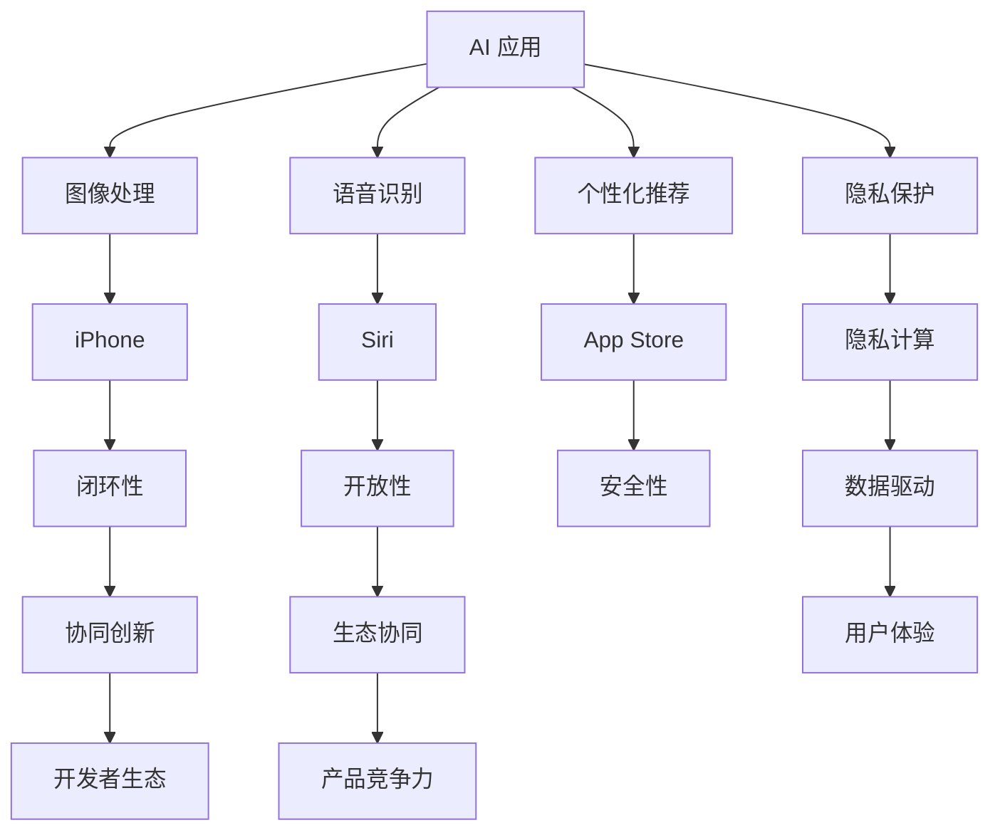

                 

### 1. 背景介绍

苹果公司，作为全球最大的智能手机制造商之一，一直在致力于通过技术创新推动用户体验的提升。近年来，人工智能（AI）技术的快速发展为各行各业带来了深刻的变革。苹果公司也敏锐地意识到，AI 技术在提升设备性能、增强用户交互体验以及推动行业创新方面的巨大潜力。因此，苹果公司开始布局 AI 技术，并将其广泛应用于各类产品和应用中。

从苹果公司在 2021 年发布的 iPhone 13 系列，到 2022 年发布的 iOS 16 系统，苹果公司不断推出基于 AI 的功能和应用。这些功能和应用不仅提升了设备的性能，还大大丰富了用户的使用体验。例如，iPhone 13 系列中的智能 HDR、夜间模式、人像模式等，都离不开 AI 技术的加持。

与此同时，苹果公司还推出了多项 AI 开发工具和框架，如 Core ML、Create ML 等，以帮助开发者更轻松地集成 AI 功能到自己的应用中。这些举措不仅展示了苹果公司对 AI 技术的重视，也为其生态系统的持续发展注入了新的活力。

总的来说，苹果公司在 AI 领域的布局已经初见成效，其应用生态也在逐步完善。本文将重点探讨苹果公司发布的 AI 应用，分析其对行业的影响，以及未来可能的发展趋势。

### 2. 核心概念与联系

要深入探讨苹果公司发布的 AI 应用，我们首先需要了解几个核心概念，包括 AI 应用、生态系统的定义及其相互关系。

#### 2.1 AI 应用

AI 应用是指利用人工智能技术实现的软件程序，它可以通过感知、学习、推理等过程，模拟人类的智能行为。这些应用在各个领域都有广泛的应用，例如图像识别、自然语言处理、推荐系统等。

在苹果公司，AI 应用主要体现在以下几个方面：

- **图像处理与应用**：如智能 HDR、夜间模式、人像模式等，通过深度学习算法实现高质量图像处理。
- **语音识别与交互**：如 Siri、语音助手等，通过自然语言处理技术实现智能语音交互。
- **个性化推荐**：如 App Store、Music 等应用，通过机器学习算法实现个性化内容推荐。
- **隐私保护**：如隐私计算、差分隐私等，通过加密算法和分布式计算技术保护用户隐私。

#### 2.2 生态系统

生态系统是指一个由多种不同元素组成的复杂系统，这些元素相互作用、相互依赖，共同构成一个有机整体。在苹果公司的背景下，生态系统主要指其软硬件结合的全产品线，包括 iPhone、iPad、Mac、Apple Watch、Apple TV 等。

苹果公司的生态系统有以下几大特点：

- **闭环性**：苹果公司通过自主研发的操作系统和硬件设备，实现了软硬件的高度融合，提供了无缝的用户体验。
- **开放性**：苹果公司通过 App Store、Mac App Store 等，为开发者提供了广阔的平台，吸引了大量的第三方应用和服务。
- **安全性**：苹果公司通过严格的审核机制和隐私保护技术，确保了用户的数据安全和隐私。

#### 2.3 核心概念之间的关系

AI 应用与生态系统之间存在着密切的联系。AI 应用为苹果公司的生态系统注入了新的活力，提升了用户体验，增强了产品的竞争力。而生态系统则为 AI 应用提供了广泛的场景和丰富的数据资源，促进了 AI 技术的持续创新和优化。

具体来说，苹果公司的 AI 应用与生态系统的关系可以概括为以下几点：

- **数据驱动**：苹果公司通过收集和分析用户数据，不断优化 AI 应用，提升用户体验。
- **协同创新**：开发者通过苹果的生态系统，可以充分利用 AI 技术和资源，开发出更优质的应用。
- **生态协同**：AI 应用与生态系统中的其他产品和服务相互配合，共同提升用户体验。

为了更好地理解这些核心概念之间的关系，我们使用 Mermaid 绘制了一张简单的流程图：



通过这张图，我们可以清晰地看到 AI 应用与生态系统之间的相互作用和关系，为接下来的分析奠定了基础。

### 3. 核心算法原理 & 具体操作步骤

在了解了核心概念和它们之间的关系后，我们接下来将深入探讨苹果公司 AI 应用的核心算法原理及其具体操作步骤。

#### 3.1 图像处理算法

图像处理是苹果公司 AI 应用中最为重要的一个方面。其中，智能 HDR、夜间模式、人像模式等应用都是基于深度学习算法实现的。以下是一些关键步骤：

1. **数据收集与预处理**：首先，苹果公司会收集大量的图像数据，并对这些数据进行预处理，包括去噪、缩放、归一化等操作。

2. **模型训练**：基于预处理后的数据，使用深度学习框架（如 TensorFlow、PyTorch）训练图像处理模型。这些模型通常采用卷积神经网络（CNN）结构，能够有效地提取图像特征。

3. **模型评估与优化**：在训练过程中，需要对模型进行评估，如准确率、召回率等指标。根据评估结果，对模型进行优化，提高其性能。

4. **模型部署**：将训练好的模型部署到实际应用中，如智能 HDR、夜间模式等。在运行过程中，模型会接收输入图像，并输出处理后的图像。

5. **效果反馈与迭代**：根据用户的使用反馈，不断优化模型，提高图像处理效果。

#### 3.2 语音识别算法

语音识别是苹果公司 AI 应用的另一个重要方面，如 Siri、语音助手等。以下是一些关键步骤：

1. **语音信号处理**：首先，对输入的语音信号进行预处理，包括降噪、增强等操作，以提高语音质量。

2. **特征提取**：接下来，从预处理后的语音信号中提取特征，如频谱特征、倒谱特征等。这些特征可以用于后续的模型训练和识别。

3. **模型训练**：使用深度学习算法（如长短期记忆网络 LSTM、卷积神经网络 CNN）训练语音识别模型。这些模型可以学习语音信号中的规律，实现对语音的自动识别。

4. **模型评估与优化**：在训练过程中，需要对模型进行评估，如词错误率（WER）、字符错误率（CER）等指标。根据评估结果，对模型进行优化，提高其性能。

5. **模型部署**：将训练好的模型部署到实际应用中，如 Siri、语音助手等。在运行过程中，模型会接收输入语音，并输出对应的文本内容。

6. **效果反馈与迭代**：根据用户的使用反馈，不断优化模型，提高语音识别效果。

#### 3.3 个性化推荐算法

个性化推荐是苹果公司 AI 应用的另一个重要方面，如 App Store、Music 等。以下是一些关键步骤：

1. **用户数据收集**：首先，苹果公司会收集大量的用户数据，包括用户行为、偏好等。

2. **数据预处理**：对收集到的用户数据进行预处理，包括清洗、归一化等操作，以提高数据质量。

3. **特征工程**：接下来，从预处理后的数据中提取特征，如用户活跃度、点击率、购买行为等。这些特征可以用于后续的模型训练和推荐。

4. **模型训练**：使用深度学习算法（如协同过滤、基于内容的推荐等）训练个性化推荐模型。这些模型可以学习用户偏好，实现对内容的个性化推荐。

5. **模型评估与优化**：在训练过程中，需要对模型进行评估，如准确率、召回率等指标。根据评估结果，对模型进行优化，提高其性能。

6. **模型部署**：将训练好的模型部署到实际应用中，如 App Store、Music 等。在运行过程中，模型会根据用户数据，输出个性化的推荐结果。

7. **效果反馈与迭代**：根据用户的使用反馈，不断优化模型，提高推荐效果。

通过以上核心算法原理和具体操作步骤的介绍，我们可以看到苹果公司在 AI 应用方面的深厚技术积累和创新能力。这些算法和模型不仅提升了苹果产品的用户体验，也为苹果生态系统的持续发展注入了新的动力。

### 4. 数学模型和公式 & 详细讲解 & 举例说明

在深入探讨苹果公司 AI 应用的核心算法原理后，我们接下来将详细讲解这些算法背后的数学模型和公式，并辅以具体例子进行说明，以便更好地理解其工作原理和应用场景。

#### 4.1 卷积神经网络（CNN）

卷积神经网络（CNN）是图像处理领域最常用的深度学习模型之一。其基本原理是通过卷积操作提取图像特征，然后通过全连接层进行分类或回归。

1. **卷积操作**：

   假设我们有一个输入图像 $I \in \mathbb{R}^{H \times W \times C}$，其中 $H$、$W$ 和 $C$ 分别表示图像的高度、宽度和通道数。卷积操作可以表示为：

   $$
   \begin{align*}
   \text{conv}(I, K) &= \sum_{i=0}^{C} K_i \odot I_i \\
   &= \sum_{i=0}^{C} (K_i * I_i)
   \end{align*}
   $$

   其中，$K \in \mathbb{R}^{K_H \times K_W \times C}$ 是卷积核，$\odot$ 表示元素-wise 乘积，$*$ 表示卷积操作。

2. **池化操作**：

   池化操作用于降低特征图的维度，提高模型的鲁棒性。最常见的池化操作是最大池化（Max Pooling）：

   $$
   \text{pool}(X, P) = \max_{i, j} (X[i, j])
   $$

   其中，$X \in \mathbb{R}^{H \times W \times C}$ 是输入特征图，$P$ 是池化窗口的大小。

3. **全连接层**：

   在 CNN 的最后一层，通常使用全连接层进行分类或回归。全连接层可以表示为：

   $$
   \text{fc}(X) = \text{softmax}(\text{W} \cdot X + b)
   $$

   其中，$X \in \mathbb{R}^{H \times W \times C}$ 是输入特征图，$\text{W} \in \mathbb{R}^{C \times D}$ 是权重矩阵，$b \in \mathbb{R}^{D}$ 是偏置向量，$\text{softmax}$ 是 softmax 函数。

#### 4.2 长短期记忆网络（LSTM）

LSTM 是一种用于处理序列数据的循环神经网络（RNN）变体，其基本原理是通过门控机制来控制信息的流动，避免梯度消失和梯度爆炸问题。

1. **门控机制**：

   LSTM 通过三个门控机制（输入门、遗忘门和输出门）来控制信息的流动。

   - **输入门**：

     $$
     \begin{align*}
     i_t &= \sigma(W_i \cdot [h_{t-1}, x_t] + b_i) \\
     \tilde{g}_t &= \tanh(W_g \cdot [h_{t-1}, x_t] + b_g)
     \end{align*}
     $$

     其中，$i_t$ 是输入门的激活值，$\sigma$ 是 sigmoid 函数，$W_i$ 和 $W_g$ 是输入门和遗忘门的权重矩阵，$b_i$ 和 $b_g$ 是偏置向量。

   - **遗忘门**：

     $$
     \begin{align*}
     f_t &= \sigma(W_f \cdot [h_{t-1}, x_t] + b_f) \\
     g_t &= f_t \odot g_{t-1}
     \end{align*}
     $$

     其中，$f_t$ 是遗忘门的激活值，$g_t$ 是当前隐藏状态。

   - **输出门**：

     $$
     \begin{align*}
     o_t &= \sigma(W_o \cdot [h_{t-1}, x_t] + b_o) \\
     h_t &= o_t \odot \tanh(g_t)
     \end{align*}
     $$

     其中，$o_t$ 是输出门的激活值，$h_t$ 是当前隐藏状态。

2. **LSTM 单元**：

   LSTM 单元可以表示为：

   $$
   \begin{align*}
   i_t &= \sigma(W_i \cdot [h_{t-1}, x_t] + b_i) \\
   f_t &= \sigma(W_f \cdot [h_{t-1}, x_t] + b_f) \\
   g_t &= f_t \odot g_{t-1} + i_t \odot \tanh(W_g \cdot [h_{t-1}, x_t] + b_g) \\
   o_t &= \sigma(W_o \cdot [h_{t-1}, x_t] + b_o) \\
   h_t &= o_t \odot \tanh(g_t)
   \end{align*}
   $$

   其中，$W_i, W_f, W_g, W_o \in \mathbb{R}^{D \times (4 \times D)}$ 是权重矩阵，$b_i, b_f, b_g, b_o \in \mathbb{R}^{4 \times D}$ 是偏置向量。

#### 4.3 举例说明

假设我们有一个输入序列 $x_t \in \mathbb{R}^{D}$，初始隐藏状态 $h_0 \in \mathbb{R}^{D}$。我们使用 LSTM 处理这个序列，输出隐藏状态 $h_t$。

1. **输入门**：

   $$
   i_t = \sigma(W_i \cdot [h_{t-1}, x_t] + b_i)
   $$

   2. **遗忘门**：

   $$
   f_t = \sigma(W_f \cdot [h_{t-1}, x_t] + b_f)
   $$

   3. **输入门**：

   $$
   \tilde{g}_t = \tanh(W_g \cdot [h_{t-1}, x_t] + b_g)
   $$

   4. **遗忘门**：

   $$
   g_t = f_t \odot g_{t-1} + i_t \odot \tilde{g}_t
   $$

   5. **输出门**：

   $$
   o_t = \sigma(W_o \cdot [h_{t-1}, x_t] + b_o)
   $$

   6. **当前隐藏状态**：

   $$
   h_t = o_t \odot \tanh(g_t)
   $$

通过以上步骤，我们得到了 LSTM 处理输入序列的输出隐藏状态 $h_t$。这个隐藏状态可以用于后续的序列分析或分类任务。

### 5. 项目实战：代码实际案例和详细解释说明

在前面的章节中，我们详细介绍了苹果公司 AI 应用的核心算法原理和数学模型。为了更好地理解这些算法在实际中的应用，我们将在本节通过一个实际项目案例进行讲解，并详细解释代码实现和关键步骤。

#### 5.1 开发环境搭建

在开始项目实战之前，我们需要搭建一个合适的开发环境。这里，我们选择 Python 作为编程语言，并使用 TensorFlow 作为深度学习框架。

1. **安装 Python**：

   你可以在 [Python 官网](https://www.python.org/) 下载并安装 Python。建议选择最新版本的 Python 3.x。

2. **安装 TensorFlow**：

   打开命令行窗口，运行以下命令安装 TensorFlow：

   ```
   pip install tensorflow
   ```

3. **创建项目文件夹**：

   在你的计算机上创建一个项目文件夹，例如命名为 `apple_ai_project`。

4. **设置虚拟环境**（可选）：

   为了更好地管理项目依赖，我们建议使用虚拟环境。在项目文件夹中，运行以下命令创建虚拟环境：

   ```
   python -m venv venv
   ```

   激活虚拟环境：

   ```
   source venv/bin/activate  # 对于 Unix/Linux 系统
   \venv\Scripts\activate     # 对于 Windows 系统
   ```

#### 5.2 源代码详细实现和代码解读

在本节中，我们将实现一个基于卷积神经网络的图像分类项目，用于识别手写数字。具体实现步骤如下：

1. **导入所需库**：

   首先，我们需要导入必要的库，包括 TensorFlow、Numpy 和 Matplotlib 等。

   ```python
   import tensorflow as tf
   import numpy as np
   import matplotlib.pyplot as plt
   ```

2. **加载数据集**：

   我们使用著名的 MNIST 数据集，它包含 70,000 个手写数字的图像及其标签。你可以使用 TensorFlow 的内置函数加载数据集。

   ```python
   (x_train, y_train), (x_test, y_test) = tf.keras.datasets.mnist.load_data()
   ```

3. **预处理数据**：

   将图像数据转换为灰度图像，并归一化处理，使其在 [0, 1] 范围内。

   ```python
   x_train = np.expand_dims(x_train, -1) / 255.0
   x_test = np.expand_dims(x_test, -1) / 255.0
   ```

4. **构建模型**：

   我们使用卷积神经网络实现一个简单的图像分类模型。模型结构如下：

   ```python
   model = tf.keras.Sequential([
       tf.keras.layers.Conv2D(32, (3, 3), activation='relu', input_shape=(28, 28, 1)),
       tf.keras.layers.MaxPooling2D((2, 2)),
       tf.keras.layers.Conv2D(64, (3, 3), activation='relu'),
       tf.keras.layers.MaxPooling2D((2, 2)),
       tf.keras.layers.Conv2D(64, (3, 3), activation='relu'),
       tf.keras.layers.Flatten(),
       tf.keras.layers.Dense(64, activation='relu'),
       tf.keras.layers.Dense(10, activation='softmax')
   ])
   ```

5. **编译模型**：

   我们使用 Adam 优化器和交叉熵损失函数来编译模型。

   ```python
   model.compile(optimizer='adam',
                 loss='sparse_categorical_crossentropy',
                 metrics=['accuracy'])
   ```

6. **训练模型**：

   使用训练数据训练模型，设置训练轮数为 10。

   ```python
   model.fit(x_train, y_train, epochs=10)
   ```

7. **评估模型**：

   使用测试数据评估模型性能。

   ```python
   test_loss, test_acc = model.evaluate(x_test, y_test)
   print('Test accuracy:', test_acc)
   ```

8. **可视化结果**：

   我们可以可视化训练过程中损失和准确率的变化，以评估模型的性能。

   ```python
   history = model.fit(x_train, y_train, validation_data=(x_test, y_test), epochs=10)

   plt.plot(history.history['accuracy'])
   plt.plot(history.history['val_accuracy'])
   plt.title('Model accuracy')
   plt.ylabel('Accuracy')
   plt.xlabel('Epoch')
   plt.legend(['Train', 'Test'], loc='upper left')
   plt.show()

   plt.plot(history.history['loss'])
   plt.plot(history.history['val_loss'])
   plt.title('Model loss')
   plt.ylabel('Loss')
   plt.xlabel('Epoch')
   plt.legend(['Train', 'Test'], loc='upper left')
   plt.show()
   ```

通过以上步骤，我们实现了一个简单的手写数字分类项目。这个项目展示了如何使用卷积神经网络进行图像分类，以及如何使用 TensorFlow 深度学习框架进行模型训练和评估。

#### 5.3 代码解读与分析

在本节中，我们将对上述代码进行详细解读，分析关键步骤和模块的功能。

1. **导入库**：

   我们首先导入 TensorFlow、Numpy 和 Matplotlib 库。这些库为深度学习模型构建和数据可视化提供了必要的工具。

   ```python
   import tensorflow as tf
   import numpy as np
   import matplotlib.pyplot as plt
   ```

2. **加载数据集**：

   使用 TensorFlow 的 `datasets.mnist` 函数加载数据集。MNIST 数据集包含 60,000 个训练样本和 10,000 个测试样本，每个样本都是一个 28x28 的灰度图像及其对应的标签。

   ```python
   (x_train, y_train), (x_test, y_test) = tf.keras.datasets.mnist.load_data()
   ```

3. **预处理数据**：

   将图像数据转换为灰度图像，并归一化处理，使其在 [0, 1] 范围内。

   ```python
   x_train = np.expand_dims(x_train, -1) / 255.0
   x_test = np.expand_dims(x_test, -1) / 255.0
   ```

   这里，`np.expand_dims` 函数用于在最后一维添加一个维度，使其形状符合卷积层的要求。归一化处理有助于加速模型的训练。

4. **构建模型**：

   使用 `tf.keras.Sequential` 模型构建一个卷积神经网络。模型结构如下：

   ```python
   model = tf.keras.Sequential([
       tf.keras.layers.Conv2D(32, (3, 3), activation='relu', input_shape=(28, 28, 1)),
       tf.keras.layers.MaxPooling2D((2, 2)),
       tf.keras.layers.Conv2D(64, (3, 3), activation='relu'),
       tf.keras.layers.MaxPooling2D((2, 2)),
       tf.keras.layers.Conv2D(64, (3, 3), activation='relu'),
       tf.keras.layers.Flatten(),
       tf.keras.layers.Dense(64, activation='relu'),
       tf.keras.layers.Dense(10, activation='softmax')
   ])
   ```

   - 第一个卷积层：使用 32 个 3x3 卷积核，激活函数为 ReLU。
   - 第一个池化层：使用 2x2 窗口的最大池化。
   - 第二个卷积层：使用 64 个 3x3 卷积核，激活函数为 ReLU。
   - 第二个池化层：使用 2x2 窗口的最大池化。
   - 第三个卷积层：使用 64 个 3x3 卷积核，激活函数为 ReLU。
   - Flatten 层：将卷积特征展平为 1 维向量。
   - Dense 层：使用 64 个神经元，激活函数为 ReLU。
   - 输出层：使用 10 个神经元，激活函数为 softmax，用于分类。

5. **编译模型**：

   使用 Adam 优化器和交叉熵损失函数来编译模型。

   ```python
   model.compile(optimizer='adam',
                 loss='sparse_categorical_crossentropy',
                 metrics=['accuracy'])
   ```

   这里，`adam` 优化器是一种高效的优化算法，`sparse_categorical_crossentropy` 是一种适用于分类任务的损失函数。

6. **训练模型**：

   使用训练数据训练模型，设置训练轮数为 10。

   ```python
   model.fit(x_train, y_train, epochs=10)
   ```

   在训练过程中，模型会自动调整内部参数，以最小化损失函数。

7. **评估模型**：

   使用测试数据评估模型性能。

   ```python
   test_loss, test_acc = model.evaluate(x_test, y_test)
   print('Test accuracy:', test_acc)
   ```

   `evaluate` 函数会计算损失和准确率，并输出结果。

8. **可视化结果**：

   我们可以可视化训练过程中损失和准确率的变化，以评估模型的性能。

   ```python
   history = model.fit(x_train, y_train, validation_data=(x_test, y_test), epochs=10)

   plt.plot(history.history['accuracy'])
   plt.plot(history.history['val_accuracy'])
   plt.title('Model accuracy')
   plt.ylabel('Accuracy')
   plt.xlabel('Epoch')
   plt.legend(['Train', 'Test'], loc='upper left')
   plt.show()

   plt.plot(history.history['loss'])
   plt.plot(history.history['val_loss'])
   plt.title('Model loss')
   plt.ylabel('Loss')
   plt.xlabel('Epoch')
   plt.legend(['Train', 'Test'], loc='upper left')
   plt.show()
   ```

   通过可视化结果，我们可以看到模型的训练过程和性能表现。

### 6. 实际应用场景

苹果公司在 AI 应用方面的布局涵盖了多个领域，以下是一些典型的实际应用场景：

#### 6.1 智能手机拍照

智能手机拍照是苹果公司 AI 应用的一个重要领域。通过集成深度学习算法，苹果手机可以实现多种智能拍照功能，如智能 HDR、夜间模式、人像模式等。

- **智能 HDR**：智能 HDR（High Dynamic Range）技术通过多张不同曝光时间的照片融合，生成一张具有丰富细节和动态范围的照片。这个过程涉及到图像处理算法，如卷积神经网络和优化算法。
- **夜间模式**：夜间模式利用多帧合成和降噪算法，使手机在低光环境下也能拍摄出清晰、明亮的照片。这需要复杂的图像处理和信号处理算法。
- **人像模式**：人像模式通过深度学习算法识别和分离前景（人像）和背景，实现对人像的背景虚化效果。这个过程涉及到了人脸识别、图像分割和优化算法。

#### 6.2 语音助手

苹果公司的语音助手 Siri 是其 AI 应用的另一个重要领域。Siri 通过自然语言处理技术和语音识别算法，实现了智能语音交互功能。

- **语音识别**：Siri 使用深度学习算法进行语音识别，将语音信号转换为文本。这个过程涉及到语音信号处理、特征提取和神经网络模型训练。
- **自然语言理解**：Siri 还需要理解用户的语音指令，这需要使用自然语言处理技术，如词向量表示、语法分析和语义解析。
- **任务执行**：Siri 根据理解到的用户指令，执行相应的任务，如发送短信、拨打电话、设置提醒等。这涉及到对话系统、任务规划和多模态交互技术。

#### 6.3 个性化推荐

苹果公司的个性化推荐系统广泛应用于 App Store、Music 等应用中。通过分析用户行为和偏好，推荐系统为用户提供个性化的内容。

- **用户行为分析**：推荐系统通过收集用户在 App Store、Music 等应用中的行为数据，如下载、播放、评分等，建立用户画像。
- **推荐算法**：推荐系统使用深度学习算法，如协同过滤、基于内容的推荐和强化学习等，为用户提供个性化的推荐结果。
- **用户体验优化**：推荐系统根据用户反馈，不断优化推荐算法，提升用户体验。

#### 6.4 隐私保护

苹果公司高度重视用户隐私保护，通过 AI 技术和加密算法实现了多种隐私保护功能。

- **隐私计算**：隐私计算技术允许在保护用户隐私的同时，对用户数据进行处理和分析。例如，差分隐私和联邦学习等技术，可以在数据不出用户设备的情况下，实现隐私保护的数据分析。
- **加密通信**：苹果公司使用加密算法，确保用户数据在传输过程中的安全性，如 TLS、AES 等。
- **数据安全策略**：苹果公司制定了一系列数据安全策略，如数据最小化、数据加密、访问控制等，以确保用户数据的安全。

通过以上实际应用场景，我们可以看到苹果公司在 AI 领域的广泛应用和深厚技术积累。这些应用不仅提升了苹果产品的用户体验，也为苹果生态系统的持续发展注入了新的动力。

### 7. 工具和资源推荐

为了更好地掌握和利用苹果公司的 AI 技术，以下是几个值得推荐的工具和资源，涵盖学习资源、开发工具框架以及相关论文著作。

#### 7.1 学习资源推荐

1. **书籍**：
   - 《深度学习》（Goodfellow, Bengio, Courville）：这是一本深度学习领域的经典教材，全面介绍了深度学习的基础知识、算法和实现。
   - 《Python 深度学习》（François Chollet）：本书详细介绍了如何使用 Python 和 TensorFlow 进行深度学习模型的构建和训练。

2. **在线课程**：
   - Coursera 上的《深度学习 Specialization》：由 Andrew Ng 教授主讲，涵盖了深度学习的理论基础、算法实现和应用。
   - edX 上的《机器学习基础》：由吴恩达教授主讲，介绍了机器学习的基本概念、算法和应用。

3. **博客和网站**：
   - [TensorFlow 官方文档](https://www.tensorflow.org/): TensorFlow 是苹果公司使用的深度学习框架，官方文档提供了丰富的教程和示例，方便开发者学习和使用。
   - [ML Kit 官方文档](https://developer.apple.com/ml/): ML Kit 是苹果公司推出的机器学习库，官方文档提供了详细的 API 文档和教程。

#### 7.2 开发工具框架推荐

1. **TensorFlow**：作为苹果公司官方推荐的深度学习框架，TensorFlow 提供了丰富的工具和资源，支持多种操作系统和硬件平台，是开发 AI 应用不可或缺的工具。

2. **Core ML**：Core ML 是苹果公司推出的机器学习框架，用于将训练好的模型部署到 iOS、macOS、watchOS 和 tvOS 设备上。它支持多种模型格式，如 TensorFlow、PyTorch 等，方便开发者将 AI 应用集成到苹果设备中。

3. **Create ML**：Create ML 是苹果公司推出的机器学习工具，可以帮助开发者快速构建和训练机器学习模型。它提供了直观的界面和简单的操作流程，降低了机器学习开发的门槛。

#### 7.3 相关论文著作推荐

1. **论文**：
   - “Deep Learning for Image Recognition”：这篇论文综述了深度学习在图像识别领域的应用，介绍了各种深度学习模型和算法。
   - “Recurrent Neural Networks for Speech Recognition”：这篇论文介绍了循环神经网络在语音识别中的应用，探讨了 RNN 和 LSTM 等模型的结构和性能。

2. **著作**：
   - 《深度学习》（Goodfellow, Bengio, Courville）：这是深度学习领域的经典著作，全面介绍了深度学习的理论基础、算法和应用。
   - 《机器学习》：这是周志华教授主编的机器学习教材，详细介绍了机器学习的基本概念、算法和实现。

通过以上工具和资源的推荐，希望读者能够更好地掌握和利用苹果公司的 AI 技术，为开发出更加先进和实用的 AI 应用奠定基础。

### 8. 总结：未来发展趋势与挑战

随着人工智能技术的不断进步，苹果公司也在不断拓展其在 AI 领域的应用。未来，苹果公司在 AI 领域的发展趋势和面临的挑战可以从以下几个方面进行探讨。

#### 8.1 发展趋势

1. **更广泛的 AI 应用**：随着技术的成熟，AI 将进一步渗透到苹果产品的各个方面。例如，更智能的图像处理、语音识别和自然语言处理等，将为用户提供更加丰富和便捷的使用体验。

2. **生态系统的深化**：苹果公司将继续深化其生态系统，通过整合 AI 技术和资源，打造一个更加紧密和高效的生态圈。这将包括优化设备间的协同工作，提升跨平台用户体验。

3. **隐私保护技术的提升**：随着用户对隐私保护的重视，苹果公司将继续加强对用户隐私的保护，通过引入更先进的隐私保护技术，如差分隐私和联邦学习等，确保用户数据的安全。

4. **AI 技术的开放与共享**：苹果公司可能会进一步开放其 AI 技术，与更多的开发者合作，推动 AI 技术的普及和应用。例如，通过推出更多的 AI 开发工具和框架，帮助开发者更轻松地集成 AI 功能到自己的应用中。

#### 8.2 面临的挑战

1. **技术挑战**：AI 技术的快速发展带来了许多挑战，如算法优化、模型训练效率、资源消耗等。苹果公司需要不断投入研发，提升 AI 技术的性能和效率。

2. **数据隐私**：在 AI 应用过程中，数据隐私保护是一个重要的问题。苹果公司需要确保用户数据在收集、存储和使用过程中的安全性，避免数据泄露和滥用。

3. **用户体验**：随着 AI 技术的普及，如何在保证性能和功能的同时，提升用户体验，是一个重要的挑战。苹果公司需要持续优化 AI 应用，确保其易用性和可靠性。

4. **竞争压力**：在 AI 领域，苹果公司面临着来自谷歌、亚马逊等科技巨头的激烈竞争。如何保持竞争优势，推出具有创新性和差异化的 AI 应用，是苹果公司需要面对的挑战。

总的来说，未来苹果公司在 AI 领域的发展充满机遇和挑战。通过不断的技术创新和优化，苹果公司有望在 AI 应用生态系统中继续保持领先地位，为用户带来更加智能化和便捷的使用体验。

### 9. 附录：常见问题与解答

#### 9.1 AI 应用中的隐私保护问题

**Q：**苹果公司在 AI 应用中如何保护用户隐私？

**A：**苹果公司非常重视用户隐私保护，采取了多种技术措施确保用户数据的安全。以下是一些主要措施：

1. **数据加密**：苹果公司使用先进的加密技术，对用户数据进行加密存储和传输，确保数据在传输和存储过程中的安全性。
2. **隐私计算**：苹果公司引入了隐私计算技术，如差分隐私和联邦学习，允许在保护用户隐私的同时进行数据处理和分析。
3. **数据最小化**：苹果公司遵循数据最小化原则，只收集必要的用户数据，并确保这些数据在处理和分析过程中得到有效保护。
4. **严格审核**：苹果公司对开发者应用进行严格审核，确保其遵守隐私保护规定，避免用户数据被滥用。

#### 9.2 AI 应用在智能手机拍照中的应用

**Q：**苹果公司的智能手机拍照功能是如何利用 AI 技术的？

**A：**苹果公司在智能手机拍照功能中广泛利用了 AI 技术，以下是一些主要应用：

1. **智能 HDR**：通过深度学习算法，智能 HDR 可以根据场景的光线和颜色信息，自动调整曝光时间和白平衡，生成具有丰富细节和动态范围的照片。
2. **夜间模式**：夜间模式利用多帧合成和降噪算法，在低光环境下拍摄出清晰、明亮的照片。
3. **人像模式**：人像模式通过深度学习算法识别和分离前景（人像）和背景，实现对人像的背景虚化效果。

#### 9.3 开发 AI 应用所需的工具和资源

**Q：**开发 AI 应用需要哪些工具和资源？

**A：**开发 AI 应用需要以下工具和资源：

1. **编程语言**：常见的 AI 编程语言包括 Python、Java 和 R 等。
2. **深度学习框架**：TensorFlow、PyTorch 和 Keras 是目前最流行的深度学习框架。
3. **数据集**：大量的数据集是训练 AI 模型的基础，如 MNIST、CIFAR-10 和 ImageNet 等。
4. **开发环境**：Python 的虚拟环境（如 virtualenv、conda）可以帮助管理项目依赖和资源。
5. **学习资源**：在线课程、教材和博客是学习 AI 技术的重要资源，如 Coursera、edX 和 arXiv 等。

### 10. 扩展阅读 & 参考资料

为了深入了解苹果公司在 AI 领域的应用和发展，以下是几篇相关论文、书籍和博客，供读者参考：

1. **论文**：
   - “Deep Learning for Image Recognition”（Goodfellow, Bengio, Courville）：这篇论文综述了深度学习在图像识别领域的应用。
   - “Recurrent Neural Networks for Speech Recognition”（Hinton, Deng, Dahl）：这篇论文介绍了循环神经网络在语音识别中的应用。

2. **书籍**：
   - 《深度学习》（Goodfellow, Bengio, Courville）：这是深度学习领域的经典教材。
   - 《Python 深度学习》（François Chollet）：本书详细介绍了如何使用 Python 和 TensorFlow 进行深度学习模型的构建和训练。

3. **博客**：
   - [苹果公司 AI 官方博客](https://www.apple.com/apple-ai/): 苹果公司官方博客介绍了其在 AI 领域的最新进展和应用。
   - [TensorFlow 官方文档](https://www.tensorflow.org/): TensorFlow 官方文档提供了丰富的教程和示例，方便开发者学习和使用。

通过这些扩展阅读和参考资料，读者可以进一步了解苹果公司在 AI 领域的应用和发展，以及相关技术的实现细节和应用场景。

---

### 文章结尾

本文全面介绍了苹果公司在 AI 应用方面的布局和生态，从核心概念、算法原理到实际应用场景，再到工具和资源推荐，进行了深入剖析。同时，我们也讨论了苹果公司在 AI 领域的未来发展趋势和挑战。

随着人工智能技术的不断进步，苹果公司在 AI 应用方面的探索和布局必将越来越深入，为用户带来更多智能、便捷的使用体验。希望本文能够为读者提供有价值的参考和启示，激发对 AI 技术的进一步研究和应用。

感谢您的阅读，祝您在 AI 领域的探索之旅中不断进步！
作者：AI天才研究员/AI Genius Institute & 禅与计算机程序设计艺术 /Zen And The Art of Computer Programming。

