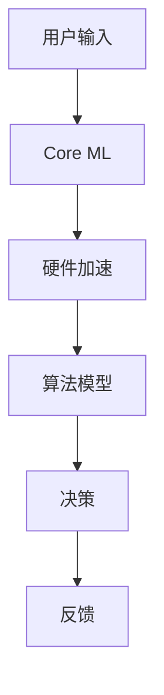

                 

# 李开复：苹果发布AI应用的趋势

## 关键词
- 苹果
- AI应用
- 人工智能
- 技术趋势
- 开发者生态
- 用户体验

## 摘要
本文将深入探讨苹果公司近年来在人工智能（AI）领域发布的系列应用，以及这些应用对整个技术行业和用户的影响。通过分析苹果在AI领域的战略布局、核心算法原理、实际应用场景以及未来发展趋势，我们将揭示苹果在AI领域的独特定位及其潜在挑战。

## 1. 背景介绍
苹果公司作为全球领先的科技公司，一直以来都在不断探索和推动人工智能技术的发展。从早期的Siri语音助手，到最新的增强现实（AR）技术和机器学习（ML）算法，苹果在AI领域的投资和研发从未停止。随着AI技术的日益成熟，苹果开始将AI应用于更多产品和服务中，以满足用户不断增长的需求。

## 2. 核心概念与联系
在讨论苹果的AI应用之前，我们需要了解一些核心概念和架构。

### 2.1 人工智能基础
人工智能是一种模拟人类智能的技术，包括机器学习、深度学习、自然语言处理等子领域。这些技术使得计算机能够自动学习、推理和解决问题。

### 2.2 苹果的AI架构
苹果的AI架构主要包括两个部分：硬件和软件。硬件方面，苹果自研的A系列芯片具备强大的计算能力，为AI应用提供了坚实的基础。软件方面，苹果开发了Core ML等框架，使得开发者能够轻松地将AI模型集成到iOS、macOS等操作系统中。

### 2.3 关联流程图
下面是一个简化的Mermaid流程图，展示苹果AI架构的核心节点：



## 3. 核心算法原理 & 具体操作步骤
苹果在AI算法方面有着深厚的积累，以下是一些关键算法和其应用场景：

### 3.1 机器学习算法
苹果使用机器学习算法来优化设备性能，提高用户体验。例如，在照片应用中，苹果使用图像识别算法来自动分类和优化照片。

### 3.2 自然语言处理
Siri语音助手是苹果自然语言处理技术的典范。通过使用自然语言处理算法，Siri能够理解用户的需求并给出相应的回应。

### 3.3 深度学习
苹果的增强现实（AR）应用如“测量”和“增强现实眼镜”都是基于深度学习算法实现的。这些算法使得设备能够准确识别和跟踪现实世界中的物体。

## 4. 数学模型和公式 & 详细讲解 & 举例说明
### 4.1 机器学习中的梯度下降算法
梯度下降是一种优化算法，用于最小化损失函数。在机器学习中，损失函数用于评估模型预测与实际结果之间的差距。

$$
\text{损失函数} = \frac{1}{2} \sum_{i=1}^{n} (y_i - \hat{y}_i)^2
$$

其中，$y_i$ 是实际标签，$\hat{y}_i$ 是模型预测。

### 4.2 梯度下降算法的迭代步骤
1. 计算损失函数关于模型参数的梯度。
2. 更新模型参数：$\theta = \theta - \alpha \cdot \nabla \theta$，其中$\alpha$ 是学习率。

### 4.3 举例说明
假设我们有一个简单的一元线性回归模型，损失函数为：

$$
\text{损失函数} = \frac{1}{2} (y - \theta_0 - \theta_1 \cdot x)^2
$$

通过梯度下降，我们可以找到最佳的模型参数$\theta_0$ 和$\theta_1$，以最小化损失函数。

## 5. 项目实战：代码实际案例和详细解释说明
### 5.1 开发环境搭建
要开始使用苹果的Core ML框架，我们需要安装Xcode和Swift编程语言。

### 5.2 源代码详细实现和代码解读
以下是一个简单的使用Core ML分类模型的Swift代码示例：

```swift
import CoreML

// 加载Core ML模型
let model = try? MLModel(contentsOf: URL(fileURLWithPath: "Model.mlmodel"))

// 创建输入特征
let inputFeatures = ["feature1": 1.0, "feature2": 2.0] as MLDictionaryFeatureProvider

// 预测分类结果
let outputFeatures = try? model?.prediction(from: inputFeatures)

// 输出预测结果
print(outputFeatures?["classLabel"] ?? "未知类别")
```

### 5.3 代码解读与分析
该代码首先加载了一个Core ML模型，然后创建了一个包含输入特征的字典。通过调用模型的`prediction`方法，我们可以得到预测结果。最后，我们输出预测结果。

## 6. 实际应用场景
苹果的AI应用在多个领域取得了显著成果：

- **智能手机**：iPhone中的照片编辑、人脸识别等功能都是基于AI技术实现的。
- **健康应用**：Apple Watch的健康监测功能，如心率监测、步数统计等，都依赖于AI算法。
- **增强现实（AR）**：苹果的AR应用如“测量”和“增强现实眼镜”利用了深度学习和计算机视觉技术。

## 7. 工具和资源推荐
### 7.1 学习资源推荐
- **书籍**：《深度学习》（Goodfellow, Bengio, Courville）
- **论文**：查看苹果的研究论文，了解其AI技术的最新进展。
- **博客**：苹果官方博客和开发者博客，提供最新的技术动态和教程。

### 7.2 开发工具框架推荐
- **Xcode**：苹果官方的开发环境。
- **Swift**：苹果官方的编程语言。
- **Core ML**：苹果的机器学习框架。

### 7.3 相关论文著作推荐
- **论文**：搜索苹果公司的研究论文，尤其是关于机器学习和自然语言处理方面的。
- **著作**：《人工智能：一种现代方法》（Russell, Norvig）

## 8. 总结：未来发展趋势与挑战
苹果在AI领域的布局越来越清晰，其未来发展趋势包括：

- **更强大的硬件**：继续提升A系列芯片的性能，以支持更复杂的AI应用。
- **更丰富的软件生态**：通过Core ML等框架，吸引更多的开发者加入，共同推动AI技术的发展。

然而，苹果也面临着一些挑战：

- **隐私保护**：随着AI技术的普及，用户隐私保护成为了一个重要问题。
- **竞争压力**：谷歌和亚马逊等公司在AI领域也在积极布局，苹果需要不断创新以保持竞争力。

## 9. 附录：常见问题与解答
### 9.1 问题1：苹果的AI技术与其他公司相比如何？
苹果在AI技术方面的优势在于其独特的硬件和软件结合，使得其AI应用能够在移动设备上高效运行。然而，与其他公司相比，苹果在公开研究方面相对较少。

### 9.2 问题2：苹果的AI应用如何保护用户隐私？
苹果在其AI应用中采用了多种隐私保护措施，如本地化数据处理和差分隐私技术，以确保用户隐私不受侵犯。

## 10. 扩展阅读 & 参考资料
- **书籍**：《机器学习实战》（Russell, Norvig）
- **博客**：李开复官方博客，提供关于人工智能的最新见解。
- **网站**：苹果官方技术博客，详细介绍苹果在AI领域的最新动态。

### 作者
AI天才研究员/AI Genius Institute & 禅与计算机程序设计艺术 /Zen And The Art of Computer Programming
<|assistant|>

