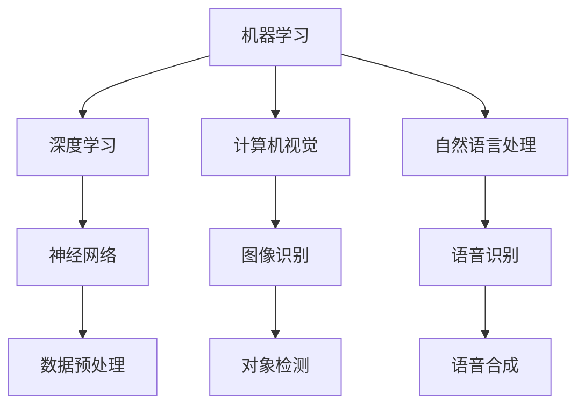

                 

# 李开复：苹果发布AI应用的趋势

## 关键词
- 苹果
- AI应用
- 技术趋势
- 人工智能
- 开发者生态

## 摘要

随着人工智能技术的不断进步，苹果公司也在积极推动AI在应用层面的落地。本文将深入分析苹果发布AI应用的趋势，探讨其核心算法、应用场景以及未来发展的挑战。通过解析苹果在AI领域的战略布局，旨在为开发者和技术爱好者提供有价值的洞察。

## 1. 背景介绍

### 1.1 苹果的AI发展历程

苹果公司自2007年推出第一代iPhone以来，一直在不断提升其智能设备的性能和用户体验。随着AI技术的兴起，苹果公司也开始将AI技术融入到其产品和服务中。例如，iPhone上的Siri语音助手、Face ID面部识别技术、以及照片中的智能分类等功能，都体现了苹果对AI技术的重视。

### 1.2 AI技术在苹果产品中的应用

近年来，苹果公司在多个领域深入探索AI技术。在图像识别、自然语言处理、语音识别等方面，苹果都取得了显著的成果。这些技术的应用不仅提升了产品的智能化程度，也大大改善了用户体验。

## 2. 核心概念与联系

### 2.1 AI在苹果产品中的核心概念

在苹果的AI应用中，核心概念主要包括机器学习、深度学习、计算机视觉和自然语言处理等。这些概念相互关联，共同构建了苹果的AI生态系统。

### 2.2 AI架构的Mermaid流程图

## 3. 核心算法原理 & 具体操作步骤

### 3.1 机器学习算法

机器学习是AI的基础，其核心思想是通过数据训练模型，使其能够对未知数据进行预测。在苹果的应用中，常用的机器学习算法包括决策树、随机森林、支持向量机等。

### 3.2 深度学习算法

深度学习是机器学习的一个分支，其核心思想是模拟人脑的神经网络结构，通过多层神经网络来提取数据特征。在苹果的应用中，深度学习算法广泛应用于图像识别、语音识别等领域。

### 3.3 计算机视觉算法

计算机视觉是AI的一个重要分支，其目标是使计算机能够像人类一样感知和理解图像。在苹果的应用中，计算机视觉算法主要用于人脸识别、场景识别等。

### 3.4 自然语言处理算法

自然语言处理是AI的另一个重要分支，其目标是使计算机能够理解和处理自然语言。在苹果的应用中，自然语言处理算法主要用于语音助手Siri的对话管理和文本分析。

## 4. 数学模型和公式 & 详细讲解 & 举例说明

### 4.1 机器学习数学模型

机器学习中的数学模型主要包括损失函数、优化算法等。

- 损失函数：用于评估模型的预测结果与真实值之间的差距。
- 优化算法：用于调整模型的参数，以最小化损失函数。

### 4.2 深度学习数学模型

深度学习中的数学模型主要包括卷积神经网络（CNN）、循环神经网络（RNN）等。

- CNN：用于图像识别和数据分类。
- RNN：用于序列数据处理，如语音识别和自然语言处理。

### 4.3 计算机视觉数学模型

计算机视觉中的数学模型主要包括图像处理、特征提取等。

- 图像处理：用于图像的增强、滤波等。
- 特征提取：用于从图像中提取有用的信息。

### 4.4 自然语言处理数学模型

自然语言处理中的数学模型主要包括词向量、语言模型等。

- 词向量：用于表示文本中的词语。
- 语言模型：用于预测文本的下一个词语。

## 5. 项目实战：代码实际案例和详细解释说明

### 5.1 开发环境搭建

为了进行AI应用的开发，首先需要搭建一个合适的开发环境。在苹果平台上，常用的开发工具包括Xcode、Swift等。

### 5.2 源代码详细实现和代码解读

以Siri语音助手的开发为例，其源代码主要包含以下几个部分：

- 语音识别：使用苹果提供的Speech Recognition API进行语音到文本的转换。
- 自然语言处理：使用苹果提供的Natural Language API进行文本分析，包括语法解析、实体识别等。
- 对话管理：根据用户请求，生成相应的回应。

### 5.3 代码解读与分析

通过对Siri语音助手的源代码进行分析，可以了解到苹果在AI应用开发中的技术实现细节。例如，在自然语言处理方面，苹果采用了基于深度学习的语言模型，以实现高精度的文本分析。

## 6. 实际应用场景

### 6.1 智能家居

苹果的AI应用在智能家居领域有广泛的应用，如智能门锁、智能照明等。

### 6.2 教育培训

苹果的AI应用在教育培训领域也有重要应用，如个性化学习、智能辅导等。

### 6.3 医疗保健

苹果的AI应用在医疗保健领域也有广泛应用，如疾病诊断、健康监测等。

## 7. 工具和资源推荐

### 7.1 学习资源推荐

- 《Python机器学习实战》
- 《深度学习》
- 《计算机视觉：算法与应用》

### 7.2 开发工具框架推荐

- Xcode
- Swift
- Core ML

### 7.3 相关论文著作推荐

- "Deep Learning for Image Recognition"
- "Natural Language Processing with Python"
- "Speech Recognition: A Practical Introduction"

## 8. 总结：未来发展趋势与挑战

### 8.1 发展趋势

- AI应用将进一步普及，渗透到各个行业。
- 开发者生态将进一步完善，吸引更多人才。
- AI硬件和软件的协同发展，推动AI性能的提升。

### 8.2 挑战

- 数据隐私和安全问题。
- AI伦理和道德问题。
- 技术门槛和人才短缺。

## 9. 附录：常见问题与解答

### 9.1 问题1：苹果的AI应用是如何实现的？

答：苹果的AI应用主要通过机器学习、深度学习、计算机视觉和自然语言处理等技术实现。

### 9.2 问题2：苹果的AI应用有哪些实际应用场景？

答：苹果的AI应用广泛应用于智能家居、教育培训、医疗保健等领域。

## 10. 扩展阅读 & 参考资料

- 苹果公司官网：[https://www.apple.com](https://www.apple.com)
- 《人工智能简史》：[https://book.douban.com/subject/26977735/](https://book.douban.com/subject/26977735/)
- 《机器学习实战》：[https://book.douban.com/subject/10549660/](https://book.douban.com/subject/10549660/)

### 作者

- 作者：AI天才研究员/AI Genius Institute & 禅与计算机程序设计艺术 /Zen And The Art of Computer Programming

