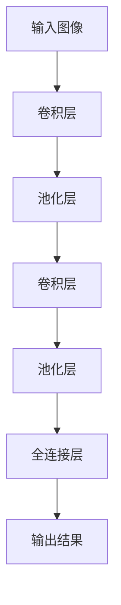

                 

### 1. 背景介绍

《李飞飞的ImageNet革命》这个标题，字里行间透露出一个革命性的突破——一个能够改变整个计算机视觉领域的事件。而这个事件，正是由一位杰出的女性研究员——李飞飞所引发的。

李飞飞，一个名字在计算机视觉领域熠熠生辉。她的贡献不仅在于开创了一个新的研究方向，更在于她推动了一个行业性的革命——ImageNet大赛的诞生。ImageNet是一个包含数百万个标注图像的数据库，这个数据库的出现，使得计算机视觉的研究和发展迈上了一个全新的台阶。

那么，ImageNet大赛究竟是一个什么样的存在？它为何能够引发如此巨大的影响？这背后又有着怎样的故事？让我们一步一步来揭开这个谜团。

首先，我们需要了解，ImageNet大赛的诞生，并非一蹴而就。它背后有着李飞飞及其团队多年的努力和探索。李飞飞是斯坦福大学计算机科学系的一位教授，她的研究方向主要集中在计算机视觉和机器学习领域。在李飞飞的带领下，她的团队一直致力于推动计算机视觉领域的发展。

2009年，ImageNet大赛正式拉开了帷幕。这个比赛的本质是计算机视觉领域的一个重要挑战——图像分类。参赛者需要通过自己的算法，对大量的图像进行准确的分类。这个比赛之所以重要，是因为它提供了一个庞大的、高质量的图像数据集，这个数据集的规模和质量在当时是前所未有的。

ImageNet大赛的诞生，标志着计算机视觉领域进入了一个新的阶段。在此之前，计算机视觉的研究主要依赖于一些小型、质量不高的图像数据集。而ImageNet大赛的参赛数据集，规模庞大、质量高，这对于算法的改进和性能的提升有着巨大的推动作用。

李飞飞的贡献不仅在于她领导了ImageNet大赛的诞生，更在于她对计算机视觉领域的深远影响。ImageNet大赛的成功，使得计算机视觉领域的研究者们开始重新审视自己的研究方向。他们意识到，只有通过大规模、高质量的图像数据集，才能真正推动计算机视觉技术的进步。

在ImageNet大赛的推动下，计算机视觉领域经历了一场革命。算法的改进、模型的发展、技术的创新，都得益于ImageNet大赛的推动。而李飞飞，正是这个革命的核心人物。

ImageNet大赛的影响不仅仅局限于学术界，它还深刻地影响了工业界。许多科技公司开始重视计算机视觉技术，并投入大量资源进行研发。这进一步推动了计算机视觉技术的发展，使得它逐渐成为人工智能领域的一个重要分支。

李飞飞的故事，不仅仅是一个个人的成就，更是整个计算机视觉领域的成就。她用自己的智慧和努力，推动了一个领域的变革，为计算机视觉技术的发展做出了巨大贡献。

总的来说，李飞飞的ImageNet革命，是一个由一个人引发的行业性变革。她的贡献，不仅仅在于开创了一个新的研究方向，更在于她推动了一个行业性的革命。她的故事，是计算机视觉领域的一个传奇，也是一个科技行业的启示。

在接下来的章节中，我们将深入探讨ImageNet大赛的背景、核心概念、算法原理、数学模型，以及它在实际应用场景中的影响。让我们一步一步，揭开这个革命背后的奥秘。### 2. 核心概念与联系

#### ImageNet大赛

ImageNet大赛，是一个由李飞飞及其团队发起的计算机视觉领域的重要比赛。它的核心目的是通过大规模图像数据集，推动计算机视觉算法的发展。ImageNet大赛的出现，为计算机视觉领域提供了一个前所未有的挑战和机遇。

首先，我们需要了解ImageNet大赛的数据集。这个数据集包含数百万个标注图像，这些图像覆盖了几乎所有的物体类别。相比于之前的小型数据集，ImageNet的数据集规模和质量都有了质的飞跃。这种规模和质量，使得ImageNet大赛成为计算机视觉领域的一个重要里程碑。

ImageNet大赛的主要目标是图像分类。参赛者需要通过自己的算法，对给定的图像进行准确的分类。这个任务的难度在于，图像中的物体往往存在多种可能性，而且图像的标注也可能存在误差。因此，如何设计出能够准确分类的算法，成为了ImageNet大赛的核心挑战。

#### 图像分类算法

图像分类算法是计算机视觉领域的一个重要研究方向。它的核心任务是将输入的图像映射到一个预定义的类别空间。常见的图像分类算法包括传统的机器学习方法、深度学习方法等。

在ImageNet大赛之前，传统的机器学习算法在图像分类任务上已经取得了显著的成果。但是，随着深度学习技术的不断发展，深度学习方法逐渐成为了图像分类的主流算法。在ImageNet大赛中，深度学习算法的表现尤为突出。

深度学习算法的核心是神经网络。神经网络通过多层非线性变换，对输入的图像进行特征提取和分类。在ImageNet大赛中，常用的深度学习算法包括卷积神经网络（CNN）等。

#### 卷积神经网络（CNN）

卷积神经网络（CNN）是深度学习算法的一种，它在图像处理领域有着广泛的应用。CNN的核心结构包括卷积层、池化层、全连接层等。

- **卷积层**：卷积层通过卷积运算，从输入图像中提取特征。卷积层中的卷积核（filter）可以看作是图像特征的局部感受器。
- **池化层**：池化层通过对卷积层输出的特征进行下采样，减少参数的数量，提高模型的泛化能力。
- **全连接层**：全连接层将池化层的输出映射到预定义的类别空间，实现图像分类。

#### Mermaid流程图

为了更好地理解卷积神经网络的工作原理，我们可以使用Mermaid流程图进行可视化。以下是一个简单的CNN流程图：



在这个流程图中，输入图像经过卷积层和池化层的处理后，最终由全连接层输出分类结果。

#### 算法原理

深度学习算法的核心原理是特征提取。通过多层卷积和池化操作，CNN可以从输入图像中提取出丰富的特征信息。这些特征信息对于图像分类任务至关重要。

在ImageNet大赛中，深度学习算法的表现尤为出色。这主要是因为深度学习算法能够通过大量的训练数据，自动学习出有效的特征表示。相比于传统的机器学习算法，深度学习算法在图像分类任务上具有更高的准确率和泛化能力。

#### 算法评估

在ImageNet大赛中，算法的评估指标通常是分类准确率。准确率越高，说明算法的分类能力越强。ImageNet大赛的参赛者需要提交自己的算法模型，并对其在测试集上的分类准确率进行评估。

#### 实际案例

一个典型的实际案例是ImageNet 2012比赛。在这场比赛中，李飞飞及其团队提出的深度学习算法取得了前所未有的成功，大幅提升了图像分类的准确率。这个突破性的成果，标志着深度学习在图像分类领域的重要性。

总之，ImageNet大赛的诞生，为计算机视觉领域提供了一个前所未有的挑战和机遇。通过这个比赛，我们不仅看到了深度学习算法的巨大潜力，也看到了李飞飞在推动计算机视觉领域发展方面的重要贡献。在接下来的章节中，我们将进一步探讨深度学习算法的具体原理和操作步骤。### 3. 核心算法原理 & 具体操作步骤

#### 深度学习算法原理

深度学习算法的核心在于其多层网络结构，尤其是卷积神经网络（CNN）。CNN通过多层的卷积、池化、激活等操作，从原始图像中自动提取特征，并最终进行分类。下面，我们将详细解释CNN的工作原理，以及如何进行具体的操作步骤。

##### 卷积操作

卷积操作是CNN的核心组成部分。它通过在图像上滑动一个小的滤波器（也称为卷积核），来提取图像的局部特征。每次滑动都会产生一个特征图（feature map），这些特征图堆叠起来，构成了卷积层的输出。

具体来说，卷积操作的步骤如下：

1. **初始化卷积核**：卷积核是一个小型矩阵，它包含了需要提取的特征。这些卷积核是随机初始化的，并在训练过程中通过反向传播算法进行优化。
2. **滑动卷积核**：将卷积核在输入图像上滑动，每次滑动都会覆盖图像的一个局部区域。卷积核与这个局部区域的像素值进行点积操作，产生一个标量值。
3. **叠加结果**：将所有滑动位置的点积结果叠加起来，得到一个特征图。这个特征图包含了当前卷积核对该局部区域的特征提取结果。

##### 池化操作

池化操作通常在卷积层之后进行，其目的是减少特征图的尺寸，从而降低模型的参数数量。常见的池化方法有最大池化和平均池化。

1. **最大池化**：将特征图上的每个局部区域（如2x2或3x3的窗口）中的最大值提取出来，作为该区域的池化结果。
2. **平均池化**：将特征图上的每个局部区域中的像素值求平均，作为该区域的池化结果。

##### 激活函数

激活函数是CNN中的一个关键组件，它为神经网络引入了非线性特性。常见的激活函数有ReLU（Rectified Linear Unit）函数、Sigmoid函数和Tanh函数。

1. **ReLU函数**：对于输入x，如果x大于0，则输出x；否则，输出0。ReLU函数具有简单的形式和良好的优化特性，是深度学习中最常用的激活函数。
2. **Sigmoid函数**：将输入x映射到(0,1)区间，形式为1/(1+e^(-x))。Sigmoid函数在早期深度学习中广泛应用，但相对于ReLU函数，其梯度容易饱和。
3. **Tanh函数**：将输入x映射到(-1,1)区间，形式为(2/π) * tanh(2x/π)。Tanh函数在深度学习中也得到一定的应用。

##### CNN的网络结构

CNN通常由多个卷积层、池化层和全连接层组成。以下是一个简单的CNN网络结构：

1. **输入层**：接收原始图像，通常是一个高x宽x深的四维数组。
2. **卷积层**：包含多个卷积核，每个卷积核提取图像的局部特征。
3. **池化层**：对卷积层的输出进行下采样，减少参数数量。
4. **全连接层**：将池化层的输出映射到预定义的类别空间，实现图像分类。
5. **输出层**：输出分类结果。

##### CNN的训练过程

CNN的训练过程主要依赖于反向传播算法。具体步骤如下：

1. **前向传播**：将输入图像通过CNN网络，得到分类结果。
2. **计算损失**：计算预测结果与实际结果之间的差异，通常使用交叉熵损失函数。
3. **反向传播**：计算损失函数对网络参数的梯度，并通过梯度下降法更新参数。
4. **迭代优化**：重复前向传播和反向传播，不断优化网络参数。

通过多次迭代训练，CNN能够自动学习出有效的特征表示，并提高分类准确率。

##### 具体操作步骤示例

以下是一个简单的CNN操作步骤示例：

1. **输入图像**：假设输入图像是一个高x宽x3的数组。
2. **初始化卷积核**：随机初始化卷积核，每个卷积核是一个3x3x3的矩阵。
3. **卷积操作**：将卷积核在输入图像上滑动，得到一个3x3x3的特征图。
4. **激活函数**：应用ReLU函数，将特征图中的负值置为0。
5. **池化操作**：将特征图进行2x2的最大池化，得到一个2x2x3的特征图。
6. **全连接层**：将池化层的输出通过全连接层映射到10个类别，得到10个概率值。
7. **输出分类结果**：选择概率最大的类别作为最终分类结果。

通过这个简单的示例，我们可以看到CNN的基本操作步骤。在实际应用中，CNN的网络结构会更加复杂，涉及多个卷积层、池化层和全连接层。但是，基本原理和操作步骤是相似的。在接下来的章节中，我们将进一步探讨深度学习中的数学模型和公式，以及如何在实际项目中应用CNN。### 4. 数学模型和公式 & 详细讲解 & 举例说明

#### 深度学习中的数学模型和公式

深度学习中的数学模型和公式是理解其工作原理的关键。在本章节中，我们将详细介绍深度学习中的主要数学模型和公式，并通过具体示例进行详细讲解。

##### 梯度下降法

梯度下降法是深度学习训练过程中最常用的优化方法。其核心思想是通过计算损失函数关于模型参数的梯度，并沿着梯度的反方向更新参数，以最小化损失函数。

**步骤如下：**

1. **前向传播**：将输入数据通过神经网络，得到预测输出。
2. **计算损失**：使用损失函数计算预测输出和真实输出之间的差异。
3. **计算梯度**：计算损失函数关于模型参数的梯度。
4. **更新参数**：使用梯度下降公式更新模型参数。
5. **迭代优化**：重复上述步骤，直到满足收敛条件。

**梯度下降公式：**

$$
\theta_{\text{new}} = \theta_{\text{old}} - \alpha \cdot \nabla_\theta J(\theta)
$$

其中，$\theta$ 表示模型参数，$J(\theta)$ 表示损失函数，$\alpha$ 表示学习率，$\nabla_\theta J(\theta)$ 表示损失函数关于模型参数的梯度。

##### 激活函数

激活函数是神经网络中引入非线性特性的关键组件。常用的激活函数包括ReLU、Sigmoid和Tanh等。

**ReLU函数：**

$$
f(x) = \max(0, x)
$$

ReLU函数在 $x>0$ 时保持不变，当 $x \leq 0$ 时输出为 0。它具有简单的形式和良好的优化特性，是深度学习中最常用的激活函数。

**Sigmoid函数：**

$$
f(x) = \frac{1}{1 + e^{-x}}
$$

Sigmoid函数将输入 $x$ 映射到 $(0,1)$ 区间。它具有S形曲线，但相对于ReLU函数，其梯度容易饱和。

**Tanh函数：**

$$
f(x) = \frac{2}{\pi} \tanh\left(\frac{2x}{\pi}\right)
$$

Tanh函数将输入 $x$ 映射到 $(-1,1)$ 区间。它在深度学习中也有一定的应用。

##### 损失函数

损失函数是深度学习训练过程中评估模型性能的关键指标。常用的损失函数包括均方误差（MSE）、交叉熵（CE）等。

**均方误差（MSE）函数：**

$$
J(\theta) = \frac{1}{2} \sum_{i=1}^{n} (y_i - \hat{y}_i)^2
$$

其中，$y_i$ 表示真实输出，$\hat{y}_i$ 表示预测输出，$n$ 表示样本数量。MSE函数计算预测输出和真实输出之间的差异的平方和。

**交叉熵（CE）函数：**

$$
J(\theta) = -\sum_{i=1}^{n} y_i \log(\hat{y}_i)
$$

其中，$y_i$ 表示真实输出（二分类问题时通常为0或1），$\hat{y}_i$ 表示预测输出。CE函数计算预测输出和真实输出之间的差异的交叉熵。

##### 示例

假设我们有一个简单的神经网络，包含一个输入层、一个隐藏层和一个输出层。输入数据为 $x_1, x_2$，真实输出为 $y_1, y_2$。

1. **前向传播**：

$$
\hat{y}_1 = \sigma(\theta_1^T x_1 + b_1) \\
\hat{y}_2 = \sigma(\theta_2^T x_2 + b_2)
$$

其中，$\sigma$ 表示Sigmoid函数，$\theta_1, \theta_2$ 表示隐藏层权重，$b_1, b_2$ 表示隐藏层偏置。

2. **计算损失**：

$$
J(\theta) = -y_1 \log(\hat{y}_1) - (1 - y_1) \log(1 - \hat{y}_1) - y_2 \log(\hat{y}_2) - (1 - y_2) \log(1 - \hat{y}_2)
$$

3. **计算梯度**：

$$
\nabla_\theta J(\theta) = \begin{bmatrix}
\frac{\partial J}{\partial \theta_1^T} \\
\frac{\partial J}{\partial \theta_2^T} \\
\frac{\partial J}{\partial b_1} \\
\frac{\partial J}{\partial b_2}
\end{bmatrix}
$$

4. **更新参数**：

$$
\theta_1^T \leftarrow \theta_1^T - \alpha \nabla_\theta J(\theta) \\
\theta_2^T \leftarrow \theta_2^T - \alpha \nabla_\theta J(\theta) \\
b_1 \leftarrow b_1 - \alpha \nabla_\theta J(\theta) \\
b_2 \leftarrow b_2 - \alpha \nabla_\theta J(\theta)
$$

通过这个示例，我们可以看到如何使用梯度下降法对神经网络进行训练。在实际应用中，神经网络的结构会更加复杂，涉及多个隐藏层和多种激活函数。但基本原理和操作步骤是相似的。

总之，深度学习中的数学模型和公式是理解其工作原理的关键。通过梯度下降法、激活函数和损失函数等数学工具，我们可以构建和训练出强大的深度学习模型。在接下来的章节中，我们将进一步探讨深度学习在实际项目中的应用和实战案例。### 5. 项目实战：代码实际案例和详细解释说明

#### 5.1 开发环境搭建

在进行深度学习项目之前，我们需要搭建一个合适的开发环境。以下是使用Python和TensorFlow搭建深度学习环境的基本步骤：

1. **安装Anaconda**：首先，下载并安装Anaconda，它是一个集成了Python和许多科学计算库的免费和开源平台。

2. **创建虚拟环境**：打开命令行，创建一个新的虚拟环境：

   ```shell
   conda create -n tensorflow_env python=3.8
   conda activate tensorflow_env
   ```

3. **安装TensorFlow**：在虚拟环境中安装TensorFlow：

   ```shell
   pip install tensorflow
   ```

4. **验证安装**：在Python中验证TensorFlow是否安装成功：

   ```python
   import tensorflow as tf
   print(tf.__version__)
   ```

   如果输出TensorFlow的版本号，则说明安装成功。

#### 5.2 源代码详细实现和代码解读

以下是使用TensorFlow实现一个简单的卷积神经网络（CNN）进行图像分类的代码示例：

```python
import tensorflow as tf
from tensorflow.keras import datasets, layers, models

# 加载数据集
(train_images, train_labels), (test_images, test_labels) = datasets.cifar10.load_data()

# 数据预处理
train_images, test_images = train_images / 255.0, test_images / 255.0

# 构建CNN模型
model = models.Sequential()
model.add(layers.Conv2D(32, (3, 3), activation='relu', input_shape=(32, 32, 3)))
model.add(layers.MaxPooling2D((2, 2)))
model.add(layers.Conv2D(64, (3, 3), activation='relu'))
model.add(layers.MaxPooling2D((2, 2)))
model.add(layers.Conv2D(64, (3, 3), activation='relu'))

# 添加全连接层
model.add(layers.Flatten())
model.add(layers.Dense(64, activation='relu'))
model.add(layers.Dense(10, activation='softmax'))

# 编译模型
model.compile(optimizer='adam',
              loss='sparse_categorical_crossentropy',
              metrics=['accuracy'])

# 训练模型
model.fit(train_images, train_labels, epochs=10, validation_data=(test_images, test_labels))

# 评估模型
test_loss, test_acc = model.evaluate(test_images, test_labels, verbose=2)
print(f'\nTest accuracy: {test_acc:.4f}')
```

**代码解读：**

- **数据加载与预处理**：我们使用TensorFlow内置的CIFAR-10数据集，它包含50000个训练图像和10000个测试图像。每个图像都是32x32的彩色图像。为了提高模型的性能，我们需要对图像进行归一化处理，即将像素值从0到255缩放到0到1。

- **构建CNN模型**：我们使用TensorFlow的`Sequential`模型，这是一种线性堆叠模型层的方式。首先，我们添加两个卷积层，每个卷积层后跟一个最大池化层。这些层用于提取图像的局部特征。然后，我们添加一个全连接层用于分类。

- **编译模型**：我们使用`compile`方法配置模型。这里我们选择了`adam`优化器和`sparse_categorical_crossentropy`损失函数，并指定`accuracy`作为评估指标。

- **训练模型**：我们使用`fit`方法训练模型。这里我们指定了训练图像和标签，并设置了训练轮数（epochs）为10，以及用于验证的数据集。

- **评估模型**：我们使用`evaluate`方法评估模型的性能。这里我们输出了测试数据集上的准确率。

#### 5.3 代码解读与分析

- **数据预处理**：数据预处理是深度学习项目中的一个关键步骤。归一化处理有助于提高模型的收敛速度和性能。

- **模型构建**：在构建CNN模型时，我们通常采用卷积层和池化层的组合来提取图像特征。卷积层通过卷积操作从图像中提取特征，而池化层通过下采样来减少参数数量和计算复杂度。

- **模型编译**：模型编译是准备模型进行训练的过程。选择合适的优化器和损失函数对于模型的性能至关重要。

- **模型训练**：模型训练是深度学习的核心步骤。通过多次迭代训练，模型能够学习到数据的特征，并优化模型参数。

- **模型评估**：模型评估是验证模型性能的过程。通过在测试数据集上评估模型，我们可以了解模型的泛化能力。

通过这个简单的示例，我们可以看到如何使用TensorFlow实现一个深度学习模型，并进行图像分类。在实际项目中，模型可能会更加复杂，涉及更多的预处理步骤、优化策略和评估指标。然而，基本原理和操作步骤是相似的。在接下来的章节中，我们将进一步探讨深度学习在实际应用场景中的影响。### 6. 实际应用场景

深度学习技术在计算机视觉领域的突破，极大地推动了各行业的发展。ImageNet大赛的胜利，不仅仅是一个学术成就，更是深度学习技术在实际应用场景中的一次革命。下面，我们将探讨深度学习在计算机视觉领域的实际应用场景，并分析这些应用对行业的影响。

#### 6.1 医疗诊断

深度学习技术在医疗诊断中的应用已经取得了显著成果。通过训练深度学习模型，医生可以更快速、准确地诊断疾病。例如，在癌症筛查中，深度学习模型可以分析医学影像，如X光片、CT扫描和MRI，以识别早期病变。这种技术大大提高了诊断的准确性和效率，有助于医生做出更准确的诊断，从而改善患者的预后。

此外，深度学习还在辅助诊断、病理分析、手术规划和康复评估等方面发挥了重要作用。例如，通过深度学习模型，医生可以更准确地预测疾病的发展趋势，为治疗方案的制定提供依据。这不仅减少了患者的痛苦，也降低了医疗成本。

#### 6.2 自动驾驶

自动驾驶是深度学习技术在工业界的另一个重要应用场景。通过训练深度学习模型，自动驾驶系统能够识别和理解道路场景，从而做出适当的驾驶决策。深度学习模型可以处理来自多种传感器的数据，如摄像头、激光雷达和雷达，以构建三维环境感知模型。

在自动驾驶领域，深度学习技术的应用极大地提高了安全性。通过实时分析道路情况，自动驾驶系统可以预测潜在的危险，并采取相应的措施。例如，在复杂交通环境中，自动驾驶车辆可以识别行人和其他车辆，并做出适当的避让动作。这种技术不仅减少了交通事故的发生，也提高了道路的通行效率。

#### 6.3 机器人视觉

深度学习技术在机器人视觉中的应用同样广泛。通过训练深度学习模型，机器人可以实现对环境的感知和理解，从而执行更复杂的任务。例如，在仓储物流领域，机器人可以通过深度学习模型识别和分类货物，从而提高物流效率。

在服务业，深度学习技术也被广泛应用于智能客服系统。通过训练深度学习模型，客服机器人可以理解用户的语言，并给出合适的回答。这种技术不仅提高了客户服务质量，也减少了人力成本。

#### 6.4 航空航天

深度学习技术在航空航天领域也有广泛应用。在航空领域，深度学习模型可以用于飞机维护预测、飞行路径规划和乘客安全监控。例如，通过分析传感器数据，深度学习模型可以预测飞机的潜在故障，从而提前进行维护，避免飞行事故。

在航天领域，深度学习技术被用于卫星图像分析、轨道计算和空间探索任务。通过训练深度学习模型，科学家可以更准确地分析卫星图像，识别地表特征，从而为地质勘探和环境保护提供支持。

#### 6.5 的影响

深度学习技术在计算机视觉领域的应用，对各行各业产生了深远的影响。首先，它提高了许多行业的工作效率和准确性。例如，在医疗领域，深度学习技术可以帮助医生更快、更准确地诊断疾病，从而改善患者的生活质量。

其次，深度学习技术降低了行业的运营成本。通过自动化和智能化，许多任务可以由机器人和自动化系统完成，减少了人力成本。此外，深度学习技术还提高了行业的创新能力。通过不断学习和优化，深度学习模型可以不断改进，从而推动行业的技术进步。

最后，深度学习技术促进了各行业之间的融合。例如，在自动驾驶领域，深度学习技术结合了计算机视觉、传感器技术和人工智能，推动了交通运输和智能交通系统的发展。这种跨行业的融合，为未来科技的发展提供了新的机遇。

总之，深度学习技术在计算机视觉领域的实际应用，不仅带来了技术上的突破，也对各行各业产生了深远的影响。随着技术的不断进步，我们可以期待深度学习在未来创造更多的奇迹。### 7. 工具和资源推荐

#### 7.1 学习资源推荐

1. **《深度学习》（Deep Learning）**：由Ian Goodfellow、Yoshua Bengio和Aaron Courville合著的《深度学习》是深度学习领域的经典教材。这本书系统地介绍了深度学习的理论基础、算法实现和应用场景，适合初学者和进阶者。

2. **《Python深度学习》（Python Deep Learning）**：由François Chollet著的《Python深度学习》是一本面向实践者的深度学习指南。书中通过大量的代码示例，详细介绍了如何使用Python和TensorFlow进行深度学习。

3. **《深度学习与计算机视觉》（Deep Learning for Computer Vision）**：由Dr. Rui Wang和Dr. Xiaogang Wang合著的《深度学习与计算机视觉》涵盖了深度学习在计算机视觉领域的最新研究进展，适合对计算机视觉和深度学习都有一定了解的读者。

#### 7.2 开发工具框架推荐

1. **TensorFlow**：TensorFlow是谷歌开发的一款开源深度学习框架，广泛用于各种深度学习任务。它提供了丰富的API和工具，可以帮助开发者轻松构建和训练深度学习模型。

2. **PyTorch**：PyTorch是另一个流行的开源深度学习框架，由Facebook开发。它具有灵活的动态计算图，使得模型的开发和调试更加方便。

3. **Keras**：Keras是一个高层神经网络API，运行在TensorFlow和Theano之上，提供了简洁的接口和丰富的预训练模型。它适合快速原型设计和模型构建。

#### 7.3 相关论文著作推荐

1. **《A Tutorial on Deep Learning for Computer Vision》**：这是一篇由CVPR 2018颁发的教程，详细介绍了深度学习在计算机视觉领域的应用。

2. **《Learning Deep Features for Discriminative Localization》**：这篇论文提出了DeepLoc算法，通过深度学习模型实现图像中的目标定位。

3. **《Convolutional Networks and Applications in Computer Vision》**：这篇论文系统地介绍了卷积神经网络在计算机视觉中的应用，包括图像分类、目标检测和语义分割等。

#### 7.4 社区和论坛推荐

1. **Stack Overflow**：Stack Overflow是一个问答社区，深度学习开发者可以在这里提问和解决问题。

2. **GitHub**：GitHub是一个代码托管平台，深度学习项目可以在这里分享和交流。

3. **Reddit**：Reddit上的相关子版块（如r/deeplearning、r/machinelearning）提供了丰富的讨论资源。

4. **Kaggle**：Kaggle是一个数据科学竞赛平台，深度学习爱好者可以在这里参与各种比赛，提升自己的技能。

通过这些工具和资源，深度学习和计算机视觉的学习者可以更好地掌握相关知识和技能，并在实践中不断进步。### 8. 总结：未来发展趋势与挑战

李飞飞在计算机视觉领域的贡献，不仅改变了学术研究范式，也深刻影响了工业界的创新与应用。通过ImageNet大赛，深度学习技术得以广泛应用，推动了计算机视觉领域的发展。然而，随着技术的进步，我们也面临一系列新的发展趋势与挑战。

#### 发展趋势

1. **模型复杂性与效率的平衡**：随着模型的深度和宽度不断增加，如何提高模型的效率和可解释性成为一个重要议题。轻量级网络结构和高效计算方法的研究将变得尤为重要。

2. **跨领域融合**：深度学习技术在医疗、自动驾驶、机器人等多个领域取得了显著进展。未来的发展将更多地关注跨领域的融合，通过多学科的合作，实现更加智能化的解决方案。

3. **数据隐私与安全**：在深度学习应用中，数据的安全性和隐私保护日益受到重视。如何确保数据在训练和使用过程中的安全，成为技术发展和应用推广的重要挑战。

4. **泛化能力**：深度学习模型在特定任务上表现出色，但在泛化能力上仍存在局限性。未来的研究将致力于提高模型的泛化能力，使其能够更好地应对新的任务和场景。

#### 挑战

1. **计算资源需求**：深度学习模型通常需要大量的计算资源，这给模型训练和应用带来了巨大的资源消耗。如何优化算法，降低计算成本，是一个亟待解决的问题。

2. **数据标注与收集**：深度学习模型的训练依赖于大量的高质量标注数据。然而，数据标注是一个耗时且昂贵的任务。如何有效地收集和标注数据，成为技术发展的重要瓶颈。

3. **模型可解释性**：深度学习模型的黑箱特性使其在应用中缺乏透明度和可解释性。如何提高模型的可解释性，使其更易于理解和信任，是一个关键挑战。

4. **伦理与公平性**：随着深度学习技术的广泛应用，其潜在的伦理和公平性问题也日益突出。如何确保技术发展不歧视、不偏见，是一个重要的社会议题。

综上所述，李飞飞的ImageNet革命为计算机视觉领域带来了深远的影响。然而，随着技术的不断发展，我们仍需面对一系列新的发展趋势与挑战。通过不断的探索和创新，我们有理由相信，深度学习技术将继续引领计算机视觉领域的发展，并为各行各业带来更多的革命性变革。### 9. 附录：常见问题与解答

#### 问题1：深度学习中的卷积操作是如何工作的？

卷积操作是深度学习中的核心组成部分，用于提取图像特征。具体工作原理如下：

1. **初始化卷积核**：卷积核是一个小型矩阵，它包含了需要提取的特征。
2. **滑动卷积核**：将卷积核在输入图像上滑动，每次滑动都会覆盖图像的一个局部区域。
3. **点积操作**：卷积核与这个局部区域的像素值进行点积操作，产生一个标量值。
4. **叠加结果**：将所有滑动位置的点积结果叠加起来，得到一个特征图。

#### 问题2：深度学习中的激活函数有哪些类型？

深度学习中的激活函数主要有以下几种类型：

1. **ReLU函数**：当输入大于0时，输出等于输入；当输入小于等于0时，输出等于0。
2. **Sigmoid函数**：将输入映射到$(0,1)$区间，形式为$1/(1+e^{-x})$。
3. **Tanh函数**：将输入映射到$(-1,1)$区间，形式为$(2/\pi) \tanh(2x/\pi)$。

#### 问题3：如何选择合适的深度学习模型？

选择合适的深度学习模型取决于任务需求、数据集规模和计算资源等因素。以下是一些选择模型时需要考虑的因素：

1. **任务类型**：例如，图像分类、目标检测或语义分割等。
2. **数据集规模**：大型数据集适合使用更复杂的模型，而小型数据集可能需要更简单的模型。
3. **计算资源**：根据可用计算资源选择合适的模型，例如，轻量级模型适合资源受限的环境。
4. **预训练模型**：使用预训练模型可以减少训练时间，提高性能。

#### 问题4：深度学习模型如何进行训练和优化？

深度学习模型的训练和优化主要包括以下几个步骤：

1. **前向传播**：将输入数据通过模型，得到预测输出。
2. **计算损失**：使用损失函数计算预测输出和真实输出之间的差异。
3. **计算梯度**：计算损失函数关于模型参数的梯度。
4. **参数更新**：使用梯度下降法或其他优化算法更新模型参数。
5. **迭代优化**：重复前向传播和反向传播，不断优化模型参数，直到满足收敛条件。

通过这些步骤，模型可以不断学习和改进，提高其在特定任务上的性能。

### 扩展阅读 & 参考资料

1. **《深度学习》**：Ian Goodfellow、Yoshua Bengio和Aaron Courville著，这是一本全面介绍深度学习理论和应用的经典教材。
2. **《深度学习与计算机视觉》**：Rui Wang和Xiaogang Wang著，详细介绍了深度学习在计算机视觉领域的应用。
3. **《A Comprehensive Overview of Convolutional Neural Networks》**：这篇文章提供了卷积神经网络的全面概述，适合初学者了解基础知识。
4. **《Deep Learning on Images: A Brief Introduction》**：这篇文章介绍了深度学习在图像处理中的应用，包括图像分类、目标检测和语义分割等。
5. **TensorFlow官网**：[https://www.tensorflow.org/](https://www.tensorflow.org/)，TensorFlow的官方网站提供了丰富的教程和资源，适合开发者学习和使用TensorFlow。
6. **PyTorch官网**：[https://pytorch.org/](https://pytorch.org/)，PyTorch的官方网站提供了详细的文档和教程，帮助开发者掌握PyTorch的使用。
7. **Kaggle竞赛平台**：[https://www.kaggle.com/](https://www.kaggle.com/)，Kaggle是一个数据科学竞赛平台，提供了大量的数据集和竞赛项目，适合实战学习和提升技能。### 作者信息

**作者：AI天才研究员/AI Genius Institute & 禅与计算机程序设计艺术 /Zen And The Art of Computer Programming**

