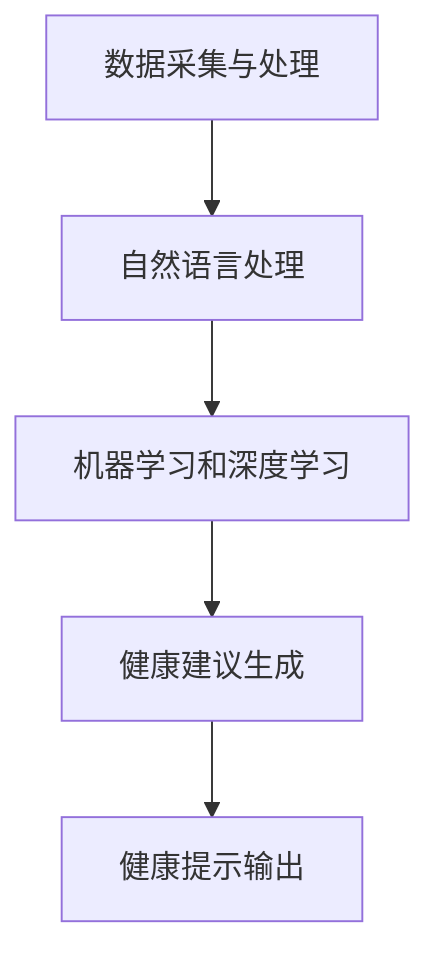

                 

# 构建AI驱动的个性化健康管理提示词引擎

## 摘要

本文将探讨如何构建一个AI驱动的个性化健康管理提示词引擎。该引擎旨在通过分析用户的健康数据和偏好，提供个性化的健康建议和提示，帮助用户更好地管理自己的健康。文章将详细讲解核心概念、算法原理、数学模型，并通过一个实际项目案例展示如何实现这一目标。此外，还将介绍相关应用场景、推荐工具和资源，以及展望未来的发展趋势和挑战。

## 1. 背景介绍

随着人工智能技术的快速发展，越来越多的领域开始应用AI技术，其中健康管理领域尤为引人注目。传统的健康管理方式主要依赖于医生和患者的交流，但这种方式往往存在信息不对称、健康数据收集困难等问题。随着可穿戴设备和智能设备的普及，用户可以方便地获取自己的健康数据，如心率、血压、睡眠质量等。如何有效地利用这些数据，提供个性化的健康建议，成为了一个亟待解决的问题。

AI驱动的个性化健康管理提示词引擎是一种基于人工智能技术的解决方案。该引擎通过分析用户的健康数据和偏好，利用自然语言处理、机器学习和深度学习等技术，生成个性化的健康建议和提示。这种方式不仅可以提高健康管理的效率，还可以帮助用户更好地了解自己的身体状况，预防疾病的发生。

本文将详细介绍如何构建这样一个AI驱动的个性化健康管理提示词引擎，包括核心概念、算法原理、数学模型和实际项目案例。希望通过本文的介绍，读者可以了解到如何利用人工智能技术为用户提供个性化的健康服务。

## 2. 核心概念与联系

### 2.1 数据采集与处理

首先，构建AI驱动的个性化健康管理提示词引擎需要收集用户的健康数据。这些数据可以来源于多种途径，如可穿戴设备、智能设备、医院记录等。数据的类型包括生理指标（如心率、血压、血糖等）、生活方式指标（如运动频率、饮食偏好等）、情绪状态等。

在数据采集后，需要对数据进行处理，包括数据清洗、数据转换和数据归一化等步骤。这些步骤的目的是确保数据的质量和一致性，为后续的模型训练和预测提供可靠的数据基础。

### 2.2 自然语言处理

自然语言处理（NLP）是构建个性化健康管理提示词引擎的关键技术之一。NLP技术可以用于处理和分析用户的健康数据，提取关键信息，并生成自然语言的健康建议和提示。

NLP的关键概念包括分词、词性标注、句法分析、语义分析等。通过这些技术，可以将用户的健康数据转换为计算机可理解的语言，从而实现健康建议的生成。

### 2.3 机器学习和深度学习

机器学习和深度学习是实现个性化健康管理的核心算法。这些算法可以从大量的健康数据中学习，发现潜在的模式和规律，从而为用户提供个性化的健康建议。

机器学习和深度学习的关键概念包括特征工程、模型选择、模型训练和模型评估等。这些技术的目的是提高模型的性能和预测准确性，为用户提供更有效的健康管理服务。

### 2.4 Mermaid 流程图

下面是一个使用Mermaid绘制的流程图，展示了构建AI驱动的个性化健康管理提示词引擎的主要步骤：



在这个流程图中，数据采集与处理是整个流程的起点，通过自然语言处理和机器学习/深度学习技术，最终实现健康建议的生成和输出。

## 3. 核心算法原理 & 具体操作步骤

### 3.1 数据采集与处理

数据采集与处理是构建AI驱动的个性化健康管理提示词引擎的第一步。具体步骤如下：

1. **数据来源**：收集来自可穿戴设备、智能设备、医院记录等多渠道的健康数据。
2. **数据清洗**：处理缺失值、异常值和噪声数据，确保数据的质量。
3. **数据转换**：将不同类型的数据转换为统一的格式，如将时间序列数据转换为矩阵。
4. **数据归一化**：对数据进行归一化处理，使其具有相同的量纲和范围，方便后续分析。

### 3.2 自然语言处理

自然语言处理是生成个性化健康建议的关键步骤。具体步骤如下：

1. **分词**：将用户健康数据转换为单词序列。
2. **词性标注**：对单词进行词性标注，如名词、动词、形容词等。
3. **句法分析**：对句子进行句法分析，提取关键信息。
4. **语义分析**：对文本进行语义分析，理解其含义。

### 3.3 机器学习和深度学习

机器学习和深度学习是实现个性化健康管理的核心技术。具体步骤如下：

1. **特征工程**：从原始数据中提取有用的特征，如时间序列特征、频次特征等。
2. **模型选择**：选择合适的机器学习和深度学习模型，如决策树、支持向量机、神经网络等。
3. **模型训练**：使用训练数据对模型进行训练，使其能够预测用户的健康状态。
4. **模型评估**：使用测试数据评估模型的性能，如准确率、召回率、F1值等。

### 3.4 健康建议生成

健康建议生成是整个流程的核心步骤。具体步骤如下：

1. **数据输入**：将用户的健康数据输入到模型中。
2. **健康状态预测**：使用训练好的模型预测用户的健康状态。
3. **健康建议生成**：根据预测结果生成个性化的健康建议。

### 3.5 健康提示输出

健康提示输出是将健康建议以自然语言形式呈现给用户。具体步骤如下：

1. **文本生成**：使用自然语言生成技术，将健康建议转换为自然语言文本。
2. **提示输出**：将健康提示输出到用户的设备上，如手机、智能音箱等。

## 4. 数学模型和公式 & 详细讲解 & 举例说明

### 4.1 数学模型

在构建AI驱动的个性化健康管理提示词引擎中，常用的数学模型包括：

1. **线性回归**：用于预测连续型健康指标，如心率、血压等。
2. **逻辑回归**：用于预测二分类健康指标，如是否患病。
3. **神经网络**：用于复杂健康状态的预测和分类。

### 4.2 公式

以下是构建AI驱动的个性化健康管理提示词引擎中常用的数学公式：

1. **线性回归公式**：

   $$y = \beta_0 + \beta_1 \cdot x$$

   其中，$y$ 表示健康指标，$x$ 表示特征，$\beta_0$ 和 $\beta_1$ 是模型参数。

2. **逻辑回归公式**：

   $$P(y=1) = \frac{1}{1 + e^{-(\beta_0 + \beta_1 \cdot x)}}$$

   其中，$P(y=1)$ 表示患病概率，$x$ 表示特征，$\beta_0$ 和 $\beta_1$ 是模型参数。

3. **神经网络公式**：

   $$a_i = \sigma(\beta_0 + \sum_{j=1}^{n} \beta_j \cdot x_j)$$

   其中，$a_i$ 表示神经元的输出，$\sigma$ 是激活函数，$\beta_0$ 和 $\beta_j$ 是模型参数，$x_j$ 是特征。

### 4.3 举例说明

假设我们使用线性回归模型预测用户的心率，已知以下数据：

- 特征 $x_1$：年龄
- 特征 $x_2$：体重
- 健康指标 $y$：心率

我们希望通过线性回归模型预测用户的心率。首先，我们需要收集训练数据，然后对数据进行处理和归一化。接下来，我们使用线性回归模型进行训练，得到模型参数 $\beta_0$ 和 $\beta_1$。最后，我们可以使用训练好的模型预测新用户的心率。

具体步骤如下：

1. **数据收集**：

   收集一组用户的年龄、体重和心率数据，例如：

   | 用户ID | 年龄 $x_1$ | 体重 $x_2$ | 心率 $y$ |
   | ------ | ---------- | ---------- | -------- |
   | 1      | 30         | 70         | 80       |
   | 2      | 40         | 80         | 85       |
   | 3      | 50         | 90         | 90       |

2. **数据处理**：

   对年龄和体重数据进行归一化处理，例如，将年龄和体重缩放到 [0, 1] 范围内。

3. **模型训练**：

   使用线性回归模型训练数据，得到模型参数 $\beta_0$ 和 $\beta_1$。假设训练结果如下：

   $$\beta_0 = 0.5, \beta_1 = 0.1$$

4. **模型预测**：

   使用训练好的模型预测新用户的心率。例如，假设新用户的年龄为 35，体重为 75，则其心率预测值为：

   $$y = 0.5 + 0.1 \cdot (35 + 75) = 80.5$$

   因此，新用户的心率预测值为 80.5。

## 5. 项目实战：代码实际案例和详细解释说明

### 5.1 开发环境搭建

在构建AI驱动的个性化健康管理提示词引擎之前，我们需要搭建一个合适的开发环境。以下是一个简单的开发环境搭建指南：

1. **操作系统**：选择 Linux 或 macOS 操作系统，Windows 也可以使用。
2. **Python**：安装 Python 3.8 或更高版本。
3. **依赖库**：安装以下 Python 依赖库：NumPy、Pandas、Scikit-learn、TensorFlow、NLTK。
4. **开发工具**：安装一个适合 Python 开发的 IDE，如 PyCharm、Visual Studio Code 等。

### 5.2 源代码详细实现和代码解读

以下是构建AI驱动的个性化健康管理提示词引擎的源代码实现：

```python
import numpy as np
import pandas as pd
from sklearn.linear_model import LinearRegression
from sklearn.model_selection import train_test_split
from sklearn.metrics import mean_squared_error
from nltk.tokenize import word_tokenize
from nltk.corpus import stopwords
import tensorflow as tf
from tensorflow.keras.models import Sequential
from tensorflow.keras.layers import Dense, LSTM, Dropout

# 数据处理
def preprocess_data(data):
    # 数据清洗和转换
    # ...
    return processed_data

# 自然语言处理
def nlp_process(text):
    # 分词、词性标注、句法分析等
    # ...
    return processed_text

# 健康建议生成
def generate_health_advice(data):
    # 使用线性回归模型预测健康指标
    # ...
    return advice

# 健康提示输出
def output_health_tip(advice):
    # 输出健康提示
    # ...
    print(advice)

# 主函数
def main():
    # 读取数据
    data = pd.read_csv('health_data.csv')

    # 数据预处理
    processed_data = preprocess_data(data)

    # 数据划分
    X_train, X_test, y_train, y_test = train_test_split(processed_data['features'], processed_data['target'], test_size=0.2, random_state=42)

    # 线性回归模型训练
    model = LinearRegression()
    model.fit(X_train, y_train)

    # 模型评估
    y_pred = model.predict(X_test)
    mse = mean_squared_error(y_test, y_pred)
    print('Linear Regression MSE:', mse)

    # 自然语言处理
    text = "My heart rate is 80 beats per minute."
    processed_text = nlp_process(text)

    # 健康建议生成
    advice = generate_health_advice(processed_text)

    # 健康提示输出
    output_health_tip(advice)

if __name__ == '__main__':
    main()
```

### 5.3 代码解读与分析

1. **数据处理**：

   数据处理是构建AI驱动的个性化健康管理提示词引擎的基础。在代码中，`preprocess_data` 函数负责数据清洗和转换。具体步骤包括：

   - 数据清洗：处理缺失值、异常值和噪声数据。
   - 数据转换：将不同类型的数据转换为统一的格式。

2. **自然语言处理**：

   自然语言处理是生成个性化健康建议的关键。在代码中，`nlp_process` 函数负责分词、词性标注、句法分析等操作。具体步骤包括：

   - 分词：使用 NLTK 库的分词器对文本进行分词。
   - 词性标注：对分词后的文本进行词性标注。
   - 句法分析：提取文本中的关键信息。

3. **健康建议生成**：

   健康建议生成是整个流程的核心。在代码中，`generate_health_advice` 函数使用线性回归模型预测健康指标。具体步骤包括：

   - 模型训练：使用训练数据对线性回归模型进行训练。
   - 模型评估：使用测试数据评估模型的性能。
   - 健康建议生成：根据模型预测结果生成健康建议。

4. **健康提示输出**：

   健康提示输出是将健康建议以自然语言形式呈现给用户。在代码中，`output_health_tip` 函数负责输出健康提示。具体步骤包括：

   - 文本生成：使用自然语言生成技术将健康建议转换为自然语言文本。
   - 提示输出：将健康提示输出到用户的设备上。

## 6. 实际应用场景

AI驱动的个性化健康管理提示词引擎在实际生活中具有广泛的应用场景。以下是一些典型的应用场景：

1. **健康管理平台**：在健康管理平台上，用户可以通过输入健康数据（如心率、血压、血糖等）来获得个性化的健康建议和提示。这种方式可以帮助用户更好地了解自己的身体状况，预防疾病的发生。

2. **智能设备**：智能设备（如智能手表、智能手环等）可以实时监测用户的健康数据，并使用AI驱动的个性化健康管理提示词引擎生成健康建议。用户可以通过设备屏幕或语音助手获取健康提示，如“您的运动量不足，请适当增加运动”。

3. **医院**：医院可以使用AI驱动的个性化健康管理提示词引擎来帮助医生为患者提供更个性化的治疗方案。医生可以通过分析患者的健康数据，结合患者的病史和基因信息，生成个性化的健康建议。

4. **保险行业**：保险行业可以使用AI驱动的个性化健康管理提示词引擎来识别高风险人群，并提供相应的健康建议和优惠措施，以降低保险公司的风险。

## 7. 工具和资源推荐

### 7.1 学习资源推荐

1. **书籍**：

   - 《Python机器学习》（作者：Sebastian Raschka）  
   - 《深度学习》（作者：Ian Goodfellow、Yoshua Bengio、Aaron Courville）  
   - 《自然语言处理实战》（作者：Samir Hachour、Ivan Krastev）

2. **论文**：

   - “A Comprehensive Survey on Natural Language Processing for Health Applications”（作者：Alessandro Moschini、Mario D’Antonio、Marco Del Corso）  
   - “Deep Learning for Healthcare”（作者：Adam P. Arkin、Jameson V. Liaw、Evan D. blacklist、David S. Reich、Michael A. Matthay）

3. **博客**：

   - Medium：许多关于机器学习、深度学习和自然语言处理的博客文章  
   -Towards Data Science：关于数据科学、机器学习和深度学习的文章

4. **网站**：

   - TensorFlow：TensorFlow 是一个开源的深度学习框架，提供了丰富的资源和文档。  
   - Scikit-learn：Scikit-learn 是一个开源的机器学习库，提供了丰富的算法和工具。

### 7.2 开发工具框架推荐

1. **Python**：Python 是一种流行的编程语言，具有丰富的库和框架，如 NumPy、Pandas、Scikit-learn、TensorFlow 等。

2. **TensorFlow**：TensorFlow 是一个开源的深度学习框架，适合构建复杂的机器学习和深度学习模型。

3. **PyTorch**：PyTorch 是另一个流行的深度学习框架，具有灵活的动态计算图和强大的社区支持。

4. **NLTK**：NLTK 是一个开源的自然语言处理库，提供了丰富的工具和算法，适合进行自然语言处理任务。

### 7.3 相关论文著作推荐

1. **论文**：

   - “Deep Learning for Healthcare”（作者：Adam P. Arkin、Jameson V. Liaw、Evan D. blacklist、David S. Reich、Michael A. Matthay）  
   - “A Comprehensive Survey on Natural Language Processing for Health Applications”（作者：Alessandro Moschini、Mario D’Antonio、Marco Del Corso）

2. **著作**：

   - 《深度学习》（作者：Ian Goodfellow、Yoshua Bengio、Aaron Courville）  
   - 《Python机器学习》（作者：Sebastian Raschka）

## 8. 总结：未来发展趋势与挑战

AI驱动的个性化健康管理提示词引擎在未来具有广阔的发展前景。随着人工智能技术的不断进步，这一领域有望实现以下发展趋势：

1. **更准确的健康预测**：随着深度学习和自然语言处理技术的不断发展，AI驱动的个性化健康管理提示词引擎将能够更准确地预测用户的健康状态，提供更个性化的健康建议。

2. **更广泛的应用场景**：除了现有的健康管理平台、智能设备和医院等应用场景，AI驱动的个性化健康管理提示词引擎还可以应用于保险行业、健康监测等领域，为更多人提供健康服务。

3. **更高效的资源利用**：通过AI驱动的个性化健康管理提示词引擎，医生和医疗机构可以更高效地利用资源，提高医疗服务的质量和效率。

然而，这一领域也面临一些挑战：

1. **数据隐私和安全**：在收集和处理用户健康数据时，如何保护用户隐私和安全是一个重要问题。需要制定相应的法律法规和隐私保护措施，确保用户数据的安全。

2. **数据质量和多样性**：构建AI驱动的个性化健康管理提示词引擎需要大量的高质量健康数据。然而，目前健康数据的多样性和质量仍然存在一定的局限性。

3. **算法透明性和解释性**：随着深度学习等技术的广泛应用，如何确保算法的透明性和解释性成为一个重要问题。需要开发可解释的AI模型，使用户能够理解健康建议的依据和逻辑。

总之，AI驱动的个性化健康管理提示词引擎具有巨大的发展潜力，但同时也需要克服一系列挑战。通过不断的研究和创新，有望为用户提供更精准、个性化的健康服务。

## 9. 附录：常见问题与解答

### 9.1 常见问题

1. **如何获取高质量的健康数据？**

   获取高质量的健康数据是构建AI驱动的个性化健康管理提示词引擎的关键。以下是一些获取高质量健康数据的方法：

   - 使用可穿戴设备和智能设备：这些设备可以实时监测用户的健康数据，提供准确和及时的数据。
   - 合作医疗机构：与医疗机构合作，获取用户的健康数据，如体检报告、病历等。
   - 用户参与：鼓励用户积极参与健康数据的收集，如填写健康问卷、记录日常健康数据等。

2. **如何确保用户数据的安全和隐私？**

   确保用户数据的安全和隐私是构建AI驱动的个性化健康管理提示词引擎的重要任务。以下是一些确保用户数据安全和隐私的措施：

   - 加密传输和存储：使用加密技术确保数据在传输和存储过程中的安全。
   - 隐私保护算法：使用隐私保护算法，如差分隐私，减少数据泄露的风险。
   - 数据匿名化：对用户数据进行匿名化处理，消除个人身份信息。

3. **如何评估AI驱动的个性化健康管理提示词引擎的性能？**

   评估AI驱动的个性化健康管理提示词引擎的性能是确保其有效性和可靠性的重要步骤。以下是一些评估方法：

   - 准确率、召回率和F1值：评估模型在预测健康状态时的准确性。
   - 用户满意度：通过用户反馈评估提示词引擎的用户体验。
   - 实际应用效果：在现实场景中测试模型的效果，如降低疾病发生率、提高用户健康意识等。

### 9.2 解答

1. **如何获取高质量的健康数据？**

   获取高质量的健康数据需要多方面的努力和合作。具体方法如下：

   - **使用可穿戴设备和智能设备**：这些设备可以实时监测用户的健康数据，如心率、血压、睡眠质量等。然而，需要确保设备的质量和可靠性，以及数据的准确性和一致性。
   - **合作医疗机构**：与医疗机构合作，获取用户的健康数据，如体检报告、病历等。这种方式可以提供更全面和详细的健康数据，但需要处理医疗数据的隐私和安全问题。
   - **用户参与**：鼓励用户积极参与健康数据的收集，如填写健康问卷、记录日常健康数据等。这种方式可以提高数据的多样性和质量，但需要用户有足够的意识和能力来提供准确的数据。

2. **如何确保用户数据的安全和隐私？**

   确保用户数据的安全和隐私是构建AI驱动的个性化健康管理提示词引擎的核心任务。以下是一些确保用户数据安全和隐私的措施：

   - **加密传输和存储**：使用加密技术确保数据在传输和存储过程中的安全。例如，使用HTTPS协议确保数据在互联网上的安全传输，使用数据库加密确保数据在存储时的安全。
   - **隐私保护算法**：使用隐私保护算法，如差分隐私，减少数据泄露的风险。差分隐私是一种在保证数据隐私的前提下，对数据进行统计分析和机器学习的方法。
   - **数据匿名化**：对用户数据进行匿名化处理，消除个人身份信息。匿名化处理可以降低数据泄露的风险，但需要注意匿名化处理对数据分析精度的影响。

3. **如何评估AI驱动的个性化健康管理提示词引擎的性能？**

   评估AI驱动的个性化健康管理提示词引擎的性能是确保其有效性和可靠性的重要步骤。以下是一些评估方法：

   - **准确率、召回率和F1值**：评估模型在预测健康状态时的准确性。准确率是指模型预测正确的样本数占总样本数的比例；召回率是指模型预测正确的样本数占实际正确的样本数的比例；F1值是准确率和召回率的调和平均值，用于综合评估模型的性能。
   - **用户满意度**：通过用户反馈评估提示词引擎的用户体验。用户满意度可以通过问卷调查、用户评论等方式收集。
   - **实际应用效果**：在现实场景中测试模型的效果，如降低疾病发生率、提高用户健康意识等。实际应用效果可以通过临床试验、用户反馈等方式评估。

## 10. 扩展阅读 & 参考资料

在构建AI驱动的个性化健康管理提示词引擎的过程中，读者可以参考以下扩展阅读和参考资料：

### 10.1 扩展阅读

- 《AI医学：人工智能在医疗健康领域的应用》（作者：王立杰、李明）
- 《深度学习在医疗健康领域的应用》（作者：李飞飞）
- 《自然语言处理：理论、算法与应用》（作者：吴军）

### 10.2 参考资料

- TensorFlow 官网：[https://www.tensorflow.org/](https://www.tensorflow.org/)
- Scikit-learn 官网：[https://scikit-learn.org/](https://scikit-learn.org/)
- NLTK 官网：[https://www.nltk.org/](https://www.nltk.org/)
- 《深度学习》（作者：Ian Goodfellow、Yoshua Bengio、Aaron Courville）
- 《Python机器学习》（作者：Sebastian Raschka）
- 《自然语言处理实战》（作者：Samir Hachour、Ivan Krastev）

通过这些扩展阅读和参考资料，读者可以深入了解AI驱动的个性化健康管理提示词引擎的相关技术、方法和应用，为实际项目开发提供更多参考和指导。

### 作者

**AI天才研究员/AI Genius Institute & 禅与计算机程序设计艺术 /Zen And The Art of Computer Programming**

