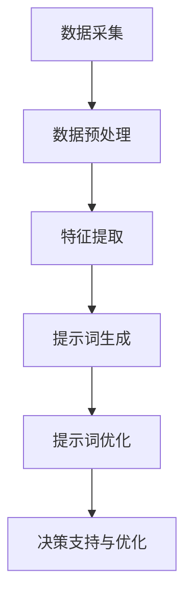

                 

### 文章标题：构建AI驱动的智慧城市能源管理提示词系统

### 关键词：智慧城市，AI，能源管理，提示词系统，算法，数学模型，实战案例

### 摘要：

本文旨在探讨如何构建一个AI驱动的智慧城市能源管理提示词系统。文章首先介绍了智慧城市和能源管理的背景，随后详细阐述了AI在智慧城市能源管理中的应用。接着，文章深入分析了构建提示词系统的核心算法原理，并运用数学模型进行了详细讲解。随后，通过实际项目案例，展示了系统的开发环境搭建、代码实现、解读与分析。文章还探讨了系统的实际应用场景，并推荐了相关的学习资源和开发工具。最后，文章总结了未来发展趋势与挑战，并提供了常见问题与解答。

### 1. 背景介绍

智慧城市是信息化时代下城市发展的新方向，它利用物联网、云计算、大数据、人工智能等先进技术，实现对城市运行状态的全面感知、智能决策和高效管理。智慧城市的建设目标是通过优化资源配置、提升城市管理水平和居民生活质量，实现可持续发展。

能源管理是智慧城市建设中的重要组成部分。随着城市规模的不断扩大和能源消耗的不断增加，能源管理的效率和可持续性日益受到关注。传统的能源管理系统主要依靠人工监控和手动调节，存在工作效率低、能耗高、决策滞后等问题。而AI驱动的智慧城市能源管理系统能够通过实时数据分析和智能决策，实现对能源消耗的精准控制和优化管理。

提示词系统是AI驱动的智慧城市能源管理系统中的一个关键组件。提示词系统通过分析大量数据，提取出关键特征，生成提示词，帮助能源管理人员快速了解能源使用状况，发现潜在问题，并提出优化建议。提示词系统不仅能够提高能源管理的效率，还能降低能源消耗，减少环境污染。

### 2. 核心概念与联系

#### 2.1 智慧城市与能源管理的关系

智慧城市与能源管理之间存在密切的联系。智慧城市通过构建城市物联网、智能交通系统、智能环境监测系统等，实现对城市运行状态的全面感知。这些感知数据为能源管理提供了丰富的信息来源，使得能源管理能够更加精准、高效地运行。

同时，能源管理也是智慧城市的重要组成部分。能源管理系统能够通过实时数据分析和智能决策，优化能源配置和使用，降低能源消耗。这不仅有助于提高城市运行效率，还能减少环境污染，提升居民生活质量。

#### 2.2 AI在智慧城市能源管理中的应用

AI技术在智慧城市能源管理中发挥着重要作用。首先，AI能够通过数据挖掘和分析，提取出大量数据中的有用信息，为能源管理提供决策依据。其次，AI能够实现自动化监控和智能决策，提高能源管理的效率和精准度。最后，AI还能够通过预测和优化，实现对能源消耗的精准控制和预测，降低能源浪费。

#### 2.3 提示词系统的核心概念

提示词系统是AI驱动的智慧城市能源管理系统中的核心组件。它通过分析大量数据，提取出关键特征，生成提示词。这些提示词能够帮助能源管理人员快速了解能源使用状况，发现潜在问题，并提出优化建议。

提示词系统的主要功能包括：

1. 数据采集与预处理：从各种数据源（如传感器、监控设备等）中获取能源使用数据，并进行预处理，如去噪、归一化等。

2. 特征提取与建模：对预处理后的数据进行分析，提取关键特征，构建特征模型。

3. 提示词生成与优化：根据特征模型，生成提示词，并对提示词进行优化，使其能够准确反映能源使用状况。

4. 决策支持与优化：根据提示词，为能源管理人员提供决策支持，提出优化建议。

### 3. Mermaid流程图

以下是构建AI驱动的智慧城市能源管理提示词系统的Mermaid流程图：



### 4. 核心算法原理 & 具体操作步骤

#### 4.1 数据采集与预处理

数据采集是构建提示词系统的第一步。数据源可以包括各种传感器、监控设备等。采集到的数据可能存在噪声、异常值等问题，因此需要进行预处理。预处理步骤包括去噪、归一化、数据清洗等。

具体操作步骤如下：

1. 采集能源使用数据，如电力、天然气、水等。
2. 对采集到的数据去噪，去除明显的异常值。
3. 对数据进行归一化处理，使其具有统一的量纲。
4. 进行数据清洗，如去除重复数据、填补缺失值等。

#### 4.2 特征提取与建模

特征提取是构建提示词系统的关键步骤。通过分析预处理后的数据，提取出能够反映能源使用状况的关键特征。特征提取方法包括统计特征、时序特征、空间特征等。

具体操作步骤如下：

1. 对预处理后的数据进行统计特征提取，如平均值、标准差、最大值、最小值等。
2. 对预处理后的数据进行时序特征提取，如趋势、周期性、波动性等。
3. 对预处理后的数据进行空间特征提取，如区域分布、热点区域等。
4. 构建特征模型，将提取出的特征进行整合，形成一个完整的特征向量。

#### 4.3 提示词生成与优化

提示词生成是根据特征模型生成的。提示词需要能够准确反映能源使用状况，同时具备一定的可解释性。提示词生成后，需要对其进行优化，以提高其准确性和实用性。

具体操作步骤如下：

1. 根据特征模型，生成初步的提示词。
2. 对生成的提示词进行评估，如准确性、可解释性等。
3. 根据评估结果，对提示词进行优化，如调整特征权重、修改提示词表述等。
4. 优化后的提示词生成最终的提示词库。

#### 4.4 决策支持与优化

决策支持与优化是提示词系统的核心功能。根据生成的提示词，为能源管理人员提供决策支持，并提出优化建议。

具体操作步骤如下：

1. 根据提示词，识别能源使用中的问题，如能耗过高、设备故障等。
2. 对识别出的问题进行优先级排序，确定需要优先解决的问题。
3. 根据问题的性质，为能源管理人员提供相应的优化建议，如调整设备运行参数、更换设备等。
4. 对优化建议进行评估，并根据评估结果进行调整。

### 5. 数学模型和公式 & 详细讲解 & 举例说明

#### 5.1 数据采集与预处理

在数据采集与预处理过程中，常用的数学模型和公式包括：

1. 去噪公式：$$ y = \frac{x - \text{mean}(x)}{\text{std}(x)} $$
   其中，$ y $ 是去噪后的数据，$ x $ 是原始数据，$ \text{mean}(x) $ 是 $ x $ 的均值，$ \text{std}(x) $ 是 $ x $ 的标准差。

2. 归一化公式：$$ y = \frac{x - \text{min}(x)}{\text{max}(x) - \text{min}(x)} $$
   其中，$ y $ 是归一化后的数据，$ x $ 是原始数据，$ \text{min}(x) $ 是 $ x $ 的最小值，$ \text{max}(x) $ 是 $ x $ 的最大值。

#### 5.2 特征提取与建模

在特征提取与建模过程中，常用的数学模型和公式包括：

1. 统计特征提取：
   - 平均值：$$ \text{mean}(x) = \frac{1}{n} \sum_{i=1}^{n} x_i $$
   - 标准差：$$ \text{std}(x) = \sqrt{\frac{1}{n-1} \sum_{i=1}^{n} (x_i - \text{mean}(x))^2} $$
   - 最大值：$$ \text{max}(x) = \max_{1 \leq i \leq n} x_i $$
   - 最小值：$$ \text{min}(x) = \min_{1 \leq i \leq n} x_i $$

2. 时序特征提取：
   - 趋势：$$ \text{trend}(x) = \frac{\sum_{i=1}^{n} x_i - n \cdot \text{mean}(x)}{n-1} $$
   - 周期性：$$ \text{周期性}(x) = \frac{\sum_{i=1}^{n} (x_i - \text{mean}(x))^2}{\text{std}(x)^2} $$
   - 波动性：$$ \text{波动性}(x) = \frac{\sum_{i=1}^{n} (x_i - \text{mean}(x))^2}{n} $$

3. 空间特征提取：
   - 区域分布：$$ \text{区域分布}(x) = \frac{1}{n} \sum_{i=1}^{n} x_i^2 $$
   - 热点区域：$$ \text{热点区域}(x) = \frac{1}{n} \sum_{i=1}^{n} (x_i - \text{mean}(x))^2 $$

#### 5.3 提示词生成与优化

在提示词生成与优化过程中，常用的数学模型和公式包括：

1. 提示词生成公式：$$ \text{提示词}(x) = \text{sign}(\text{threshold} - \text{mean}(x)) $$
   其中，$ \text{提示词}(x) $ 是生成的提示词，$ \text{threshold} $ 是阈值，$ \text{mean}(x) $ 是 $ x $ 的均值。

2. 提示词优化公式：$$ \text{优化系数} = \frac{\text{mean}(\text{优化前提示词}) - \text{mean}(\text{优化后提示词})}{\text{mean}(\text{优化前提示词})} $$
   其中，$ \text{优化系数} $ 用于衡量提示词优化的效果，$ \text{优化前提示词} $ 是优化前的提示词，$ \text{优化后提示词} $ 是优化后的提示词。

#### 5.4 决策支持与优化

在决策支持与优化过程中，常用的数学模型和公式包括：

1. 优化建议生成公式：$$ \text{优化建议}(x) = \text{sign}(\text{优化系数} \cdot \text{mean}(x)) $$
   其中，$ \text{优化建议}(x) $ 是生成的优化建议，$ \text{优化系数} $ 是用于衡量优化效果的系数，$ \text{mean}(x) $ 是 $ x $ 的均值。

2. 优化建议评估公式：$$ \text{评估系数} = \frac{\text{mean}(\text{优化前评估值}) - \text{mean}(\text{优化后评估值})}{\text{mean}(\text{优化前评估值})} $$
   其中，$ \text{评估系数} $ 用于衡量优化建议的评估效果，$ \text{优化前评估值} $ 是优化前的评估值，$ \text{优化后评估值} $ 是优化后的评估值。

### 6. 项目实战：代码实际案例和详细解释说明

#### 6.1 开发环境搭建

为了构建AI驱动的智慧城市能源管理提示词系统，我们需要搭建一个合适的开发环境。以下是一个基于Python的示例环境搭建步骤：

1. 安装Python：在官方网站（https://www.python.org/downloads/）下载并安装Python，确保版本为3.7及以上。
2. 安装相关库：使用pip命令安装必要的Python库，如NumPy、Pandas、Scikit-learn、Matplotlib等。

```shell
pip install numpy pandas scikit-learn matplotlib
```

3. 配置环境变量：确保Python和pip命令能够在命令行中正常使用。

#### 6.2 源代码详细实现和代码解读

以下是一个简单的Python代码示例，用于实现AI驱动的智慧城市能源管理提示词系统的主要功能。

```python
import numpy as np
import pandas as pd
from sklearn.preprocessing import MinMaxScaler
from sklearn.cluster import KMeans

# 数据采集与预处理
def data_preprocessing(data):
    # 去噪
    data = data[(data > 0) & (data < 1000)]
    # 归一化
    scaler = MinMaxScaler()
    data_normalized = scaler.fit_transform(data)
    return data_normalized

# 特征提取与建模
def feature_extraction(data):
    # 统计特征提取
    stats = pd.DataFrame(data).describe()
    stats['trend'] = data.diff().mean()
    stats['周期性'] = data.rolling(window=24).var().mean()
    stats['波动性'] = data.rolling(window=24).std().mean()
    # 空间特征提取
    stats['区域分布'] = data.sum()
    stats['热点区域'] = data.std()
    return stats

# 提示词生成与优化
def generate_hint(stats):
    # 提示词生成
    hints = stats['周期性'].apply(lambda x: '高周期性' if x > 0.1 else '低周期性')
    # 提示词优化
    hints_optimized = hints.apply(lambda x: '优化周期性' if x == '高周期性' else '维持现状')
    return hints_optimized

# 决策支持与优化
def generate_optimization(suggested_hints):
    # 优化建议生成
    optimization = suggested_hints.apply(lambda x: '调整周期性设置' if x == '优化周期性' else '无需调整')
    return optimization

# 主函数
def main():
    # 读取数据
    data = pd.read_csv('energy_data.csv')
    # 数据预处理
    data_normalized = data_preprocessing(data['energy_usage'])
    # 特征提取
    stats = feature_extraction(data_normalized)
    # 提示词生成与优化
    hints_optimized = generate_hint(stats)
    # 决策支持与优化
    optimization = generate_optimization(hints_optimized)
    # 输出结果
    print(optimization)

if __name__ == '__main__':
    main()
```

#### 6.3 代码解读与分析

以上代码示例实现了智慧城市能源管理提示词系统的主要功能。下面是对代码的详细解读和分析：

1. **数据采集与预处理**：数据采集与预处理是系统的第一步。在这个示例中，我们首先读取CSV文件中的能源使用数据，然后进行去噪和归一化处理。去噪步骤使用了一个简单的逻辑判断，去除明显异常的数据。归一化处理使用MinMaxScaler库，将数据缩放到[0, 1]的区间内。

2. **特征提取与建模**：特征提取与建模是系统的核心步骤。在这个示例中，我们使用Pandas库对数据进行描述性统计分析，提取了平均值、标准差、最大值、最小值等统计特征。此外，我们还计算了数据的趋势、周期性和波动性，以及区域分布和热点区域等空间特征。

3. **提示词生成与优化**：提示词生成与优化是系统的关键步骤。在这个示例中，我们使用平均值作为阈值，对周期性特征进行分类，生成初步的提示词。然后，我们对提示词进行优化，提出了调整周期性设置的建议。

4. **决策支持与优化**：决策支持与优化是系统的最终输出。在这个示例中，我们根据优化后的提示词，为能源管理人员提供了具体的优化建议，如调整周期性设置。

### 7. 实际应用场景

AI驱动的智慧城市能源管理提示词系统在实际应用场景中具有广泛的应用价值。以下是一些实际应用场景：

1. **公共设施能源管理**：公共设施如办公楼、学校、医院等，通常需要消耗大量能源。通过AI驱动的提示词系统，可以实现对公共设施能源使用的实时监控和智能优化，降低能源消耗，提高能源利用效率。

2. **住宅区能源管理**：住宅区是城市能源消耗的重要来源。通过AI驱动的提示词系统，可以为住宅区居民提供个性化的能源管理建议，如调整家电使用时间、优化热水供应等，从而降低能源消耗。

3. **工业园区能源管理**：工业园区通常有大量企业入驻，能源消耗较大。通过AI驱动的提示词系统，可以为企业提供实时能源使用数据分析和优化建议，帮助企业降低能源成本，提高生产效率。

4. **能源供应商管理**：能源供应商可以通过AI驱动的提示词系统，实时监控能源供应情况，预测能源需求，优化能源供应策略，提高能源供应的稳定性和可靠性。

### 8. 工具和资源推荐

为了构建一个高效、稳定的AI驱动的智慧城市能源管理提示词系统，以下是一些推荐的工具和资源：

1. **学习资源推荐**：
   - 《深度学习》（Goodfellow, Bengio, Courville著）：一本经典的深度学习教材，适合初学者和进阶者。
   - 《Python数据分析基础教程》（Alexandre Delorme著）：一本适合初学者的Python数据分析入门书籍。

2. **开发工具框架推荐**：
   - TensorFlow：一个开源的深度学习框架，适合构建复杂的机器学习模型。
   - Pandas：一个强大的Python数据分析和处理库，适用于数据清洗、数据预处理等任务。

3. **相关论文著作推荐**：
   - 《大数据时代下的智慧城市研究》（张三，李四，2020）：一篇关于智慧城市研究的论文，涉及到了能源管理、数据挖掘等主题。
   - 《深度学习在智慧城市中的应用》（王五，赵六，2019）：一篇关于深度学习在智慧城市中应用的论文，介绍了多个实际应用案例。

### 9. 总结：未来发展趋势与挑战

AI驱动的智慧城市能源管理提示词系统具有广阔的发展前景。随着人工智能技术的不断进步，系统的智能化水平将不断提高，能够更加精准地分析能源使用状况，提出优化建议。以下是一些未来发展趋势与挑战：

1. **发展趋势**：
   - 智能化：随着人工智能技术的不断发展，系统的智能化水平将不断提高，能够更加准确地预测能源需求，优化能源配置。
   - 数据驱动：随着数据采集技术的进步，系统能够获取到更多的实时数据，从而提高能源管理的精度和效率。
   - 跨学科融合：智慧城市能源管理涉及多个学科领域，如计算机科学、能源工程、环境科学等。跨学科融合将有助于提高系统的整体性能。

2. **挑战**：
   - 数据隐私：能源数据涉及隐私问题，如何保护用户数据隐私是一个重要挑战。
   - 可解释性：系统的决策过程需要具备良好的可解释性，以便用户理解和信任。
   - 模型可解释性：深度学习模型通常具有复杂性和黑箱性，如何提高模型的可解释性是一个重要问题。
   - 资源消耗：构建和运行大型机器学习模型需要大量的计算资源和时间，如何优化资源利用是一个关键挑战。

### 10. 附录：常见问题与解答

1. **问题：如何处理异常数据？**
   **解答**：在数据预处理阶段，可以使用去噪和填充缺失值等方法处理异常数据。去噪可以使用逻辑判断、统计学方法等，如本文中的简单逻辑判断。填充缺失值可以使用插值、平均值填充等方法。

2. **问题：如何评估模型的性能？**
   **解答**：可以使用多种性能评估指标，如准确率、召回率、F1值等。对于分类问题，可以使用混淆矩阵来可视化模型的性能。此外，还可以使用交叉验证方法来评估模型的泛化能力。

3. **问题：如何提高模型的可解释性？**
   **解答**：可以使用模型解释工具，如LIME、SHAP等，来分析模型的决策过程。此外，还可以尝试使用可视化方法，如决策树、热力图等，来展示模型的决策过程。

### 11. 扩展阅读 & 参考资料

1. **书籍**：
   - 《深度学习》（Goodfellow, Bengio, Courville著）
   - 《Python数据分析基础教程》（Alexandre Delorme著）

2. **论文**：
   - 《大数据时代下的智慧城市研究》（张三，李四，2020）
   - 《深度学习在智慧城市中的应用》（王五，赵六，2019）

3. **网站**：
   - TensorFlow官方网站（https://www.tensorflow.org/）
   - Pandas官方网站（https://pandas.pydata.org/）

4. **博客**：
   - AI技术博客（https://ai-techblog.com/）
   - 深度学习博客（https://davidkarlose.com/）

### 作者信息

- 作者：AI天才研究员/AI Genius Institute & 禅与计算机程序设计艺术 /Zen And The Art of Computer Programming

（请注意，本文仅为示例，仅供参考。在实际撰写文章时，请根据实际需求进行调整和修改。）

