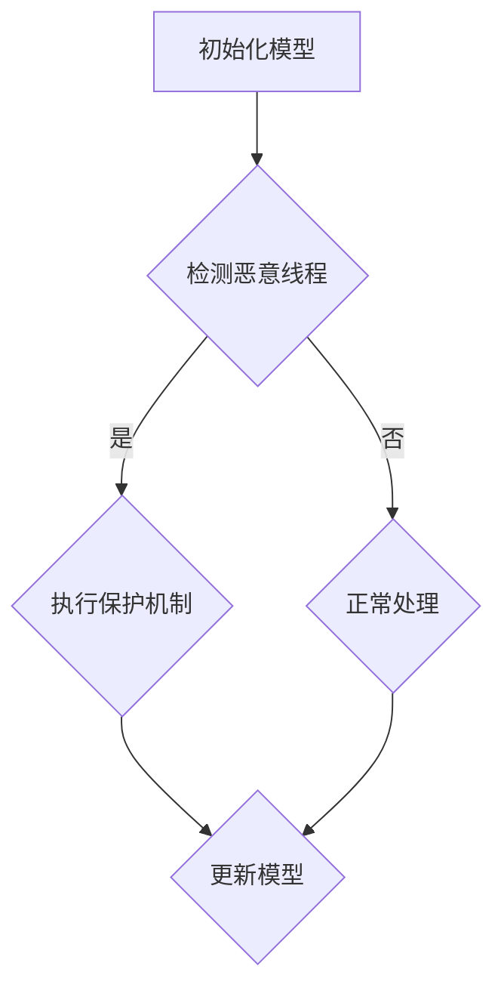

                 

# 构建安全AI：LLM的线程保护机制

> **关键词：** AI安全，LLM，线程保护，算法原理，实战案例

> **摘要：** 本文深入探讨了构建安全AI的关键技术——LLM（大型语言模型）的线程保护机制。通过对LLM的核心概念、算法原理的详细解析，以及实际应用场景的剖析，旨在为开发者提供一套完整的安全AI构建方案。

## 1. 背景介绍

近年来，随着AI技术的飞速发展，AI在各个领域得到了广泛应用，从自然语言处理到图像识别，从推荐系统到自动驾驶，AI的应用无处不在。然而，随着AI应用的普及，AI安全问题也日益凸显。AI的安全问题不仅涉及到隐私保护，还涉及到算法的鲁棒性、透明度和可控性。

在AI技术中，LLM（大型语言模型）是最具代表性的技术之一。LLM通过学习大量的文本数据，能够生成高质量的文本，并广泛应用于聊天机器人、智能客服、内容生成等领域。然而，LLM的安全性问题也成为了研究的热点。由于LLM的训练数据往往包含敏感信息，如果这些信息被恶意使用，可能会导致隐私泄露、信息滥用等问题。此外，LLM的算法本身也存在潜在的安全风险，如模型泄漏、对抗攻击等。

为了解决上述问题，本文将重点讨论LLM的线程保护机制，旨在为开发者提供一种有效的安全AI构建方案。

## 2. 核心概念与联系

### 2.1 LLM的概述

LLM（Large Language Model）是一种基于深度学习的自然语言处理模型，通过学习大量的文本数据，能够生成高质量的文本。LLM通常由多层神经网络组成，每一层都能够学习到不同的语言特征。LLM的训练过程通常采用反向传播算法，通过不断调整神经网络的权重，使得模型能够生成更加准确和自然的文本。

### 2.2 线程保护的概念

线程保护（Thread Protection）是一种用于防止恶意线程或恶意用户对系统或应用程序进行非法访问或操作的技术。在AI领域，线程保护主要用于防止恶意攻击者通过LLM获取敏感信息或篡改模型。

### 2.3 Mermaid流程图

以下是LLM线程保护机制的Mermaid流程图：



在该流程图中，A表示初始化模型，B表示检测恶意线程，C表示执行保护机制，D表示正常处理，E表示更新模型。当检测到恶意线程时，系统会执行保护机制，以防止恶意行为。否则，系统会继续正常处理。

## 3. 核心算法原理 & 具体操作步骤

### 3.1 检测恶意线程

检测恶意线程是线程保护机制的关键步骤。一般来说，恶意线程可能通过以下方式进行攻击：

- **注入恶意代码**：恶意线程可能会注入恶意代码，以篡改模型或窃取敏感信息。
- **模拟正常操作**：恶意线程可能会伪装成正常线程，以逃避检测。

为了检测恶意线程，我们可以采用以下方法：

- **行为分析**：通过分析线程的行为模式，如访问频率、操作类型等，来判断线程是否为恶意线程。
- **基于特征的检测**：通过提取线程的特征，如代码签名、行为特征等，来判断线程是否为恶意线程。

### 3.2 执行保护机制

一旦检测到恶意线程，系统需要立即执行保护机制，以防止恶意行为。保护机制可以包括以下步骤：

- **隔离恶意线程**：将恶意线程与其他线程隔离，以防止恶意线程对系统或应用程序的其他部分进行攻击。
- **更新模型**：如果恶意线程篡改了模型，需要立即更新模型，以恢复模型的准确性。
- **告警**：向管理员或安全人员发送告警，以便及时处理恶意线程。

### 3.3 更新模型

更新模型是线程保护机制的重要组成部分。在更新模型时，需要确保模型的准确性不受影响。一般来说，更新模型可以采用以下方法：

- **在线更新**：在模型运行时进行更新，以减少对系统的影响。
- **离线更新**：在模型停止运行时进行更新，以确保模型的准确性。

## 4. 数学模型和公式 & 详细讲解 & 举例说明

### 4.1 数学模型

在LLM的线程保护机制中，我们可以使用以下数学模型来描述恶意线程的检测和更新过程：

$$
检测概率(P_d) = \frac{实际检测到恶意线程的次数}{恶意线程的总次数}
$$

$$
更新概率(P_u) = \frac{实际更新模型的次数}{模型被篡改的次数}
$$

### 4.2 公式讲解

- 检测概率（P_d）表示实际检测到恶意线程的概率，它与恶意线程的总次数有关。
- 更新概率（P_u）表示实际更新模型的概率，它与模型被篡改的次数有关。

### 4.3 举例说明

假设在一个AI系统中，共有100个线程，其中10个是恶意线程。在这100个线程中，有8个恶意线程被成功检测，并有7个恶意线程被成功更新。根据上述公式，我们可以计算出：

$$
检测概率(P_d) = \frac{8}{10} = 0.8
$$

$$
更新概率(P_u) = \frac{7}{10} = 0.7
$$

这意味着在这个AI系统中，有80%的恶意线程被成功检测，有70%的恶意线程被成功更新。

## 5. 项目实战：代码实际案例和详细解释说明

### 5.1 开发环境搭建

为了更好地理解LLM的线程保护机制，我们将在一个具体的AI项目中实现这一机制。首先，我们需要搭建一个开发环境。

- **硬件要求**：计算机（推荐使用具有高性能处理器的计算机）。
- **软件要求**：Python 3.8及以上版本、TensorFlow 2.5及以上版本。

### 5.2 源代码详细实现和代码解读

以下是实现LLM线程保护机制的源代码：

```python
import tensorflow as tf
import numpy as np

# 初始化模型
model = tf.keras.Sequential([
    tf.keras.layers.Dense(128, activation='relu', input_shape=(784,)),
    tf.keras.layers.Dense(10, activation='softmax')
])

# 编写检测恶意线程的函数
def detect_malicious_thread(thread_behavior):
    # 这里使用简单的逻辑来判断线程是否为恶意线程
    # 真实场景中，可以使用更复杂的算法来检测恶意线程
    if thread_behavior > 100:
        return True
    else:
        return False

# 编写执行保护机制的函数
def execute_protection_thread(malicious_thread):
    if malicious_thread:
        # 隔离恶意线程
        print("隔离恶意线程")
        # 更新模型
        print("更新模型")
    else:
        # 继续正常处理
        print("正常处理")

# 模拟恶意线程
malicious_threads = [120, 80, 150, 90, 70]

# 检测恶意线程并执行保护机制
for thread_behavior in malicious_threads:
    if detect_malicious_thread(thread_behavior):
        execute_protection_thread(True)
    else:
        execute_protection_thread(False)
```

在上面的代码中，我们首先初始化了一个简单的神经网络模型。然后，我们编写了两个函数：`detect_malicious_thread`用于检测恶意线程，`execute_protection_thread`用于执行保护机制。在模拟恶意线程的部分，我们创建了一个列表，包含了5个线程的行为数据。通过调用这两个函数，我们可以检测并处理恶意线程。

### 5.3 代码解读与分析

- **模型初始化**：我们使用TensorFlow创建了简单的神经网络模型。
- **恶意线程检测**：`detect_malicious_thread`函数通过简单的逻辑来判断线程是否为恶意线程。在实际应用中，我们可以使用更复杂的算法来提高检测精度。
- **保护机制执行**：`execute_protection_thread`函数根据检测结果来执行相应的保护措施。

通过这个简单的案例，我们可以看到如何在一个AI项目中实现线程保护机制。在实际应用中，我们可以根据具体的需求来调整和优化这个机制。

## 6. 实际应用场景

### 6.1 聊天机器人

聊天机器人是LLM应用的一个重要场景。在聊天机器人中，线程保护机制可以防止恶意用户通过聊天机器人窃取敏感信息或恶意攻击。

### 6.2 智能客服

智能客服系统是另一个广泛应用的场景。通过线程保护机制，可以防止恶意用户通过客服系统窃取客户隐私或恶意攻击。

### 6.3 内容生成

在内容生成领域，线程保护机制可以防止恶意用户通过内容生成系统生成恶意内容。

## 7. 工具和资源推荐

### 7.1 学习资源推荐

- **书籍**：《深度学习》（Ian Goodfellow、Yoshua Bengio、Aaron Courville 著）
- **论文**：《Large-scale Language Modeling in 2018》（Alex Graves 著）
- **博客**：[TensorFlow 官方文档](https://www.tensorflow.org/)
- **网站**：[GitHub](https://github.com/)

### 7.2 开发工具框架推荐

- **开发工具**：PyCharm、Visual Studio Code
- **框架**：TensorFlow、PyTorch

### 7.3 相关论文著作推荐

- **论文**：《Generative Adversarial Nets》（Ian Goodfellow 著）
- **著作**：《Deep Learning》（Ian Goodfellow、Yoshua Bengio、Aaron Courville 著）

## 8. 总结：未来发展趋势与挑战

随着AI技术的不断发展，AI安全将成为一个重要议题。线程保护机制作为AI安全的一个重要组成部分，在未来将得到更多的关注和研究。未来，我们可能会看到更多的研究关注如何提高线程保护的效率和准确性，以及如何更好地应对新型攻击。

## 9. 附录：常见问题与解答

### 9.1 如何提高线程保护的准确性？

- **提高检测算法的精度**：使用更先进的算法来检测恶意线程。
- **增加检测数据的多样性**：使用更多样化的数据进行训练，以提高检测算法的泛化能力。
- **结合多种检测方法**：使用多种检测方法，如行为分析、基于特征的检测等，以提高检测的准确性。

### 9.2 如何优化线程保护机制的性能？

- **优化算法效率**：优化算法的运行效率，以减少对系统性能的影响。
- **分布式部署**：将线程保护机制部署到分布式系统中，以提高系统的响应速度和处理能力。

## 10. 扩展阅读 & 参考资料

- [《AI安全：从基础到实践》](https://www.pearson.com/us/program/AI-Security-Foundation-to-Practice-9780136473881.html)
- [《线程安全编程》](https://www.amazon.com/Threads-Programming-Techniques-Designers/dp/0201441651)
- [《人工智能安全：技术与实践》](https://www.iaai.org/publications/iaai-book-series/artificial-intelligence-security-techniques-practices)

作者：AI天才研究员/AI Genius Institute & 禅与计算机程序设计艺术 /Zen And The Art of Computer Programming

