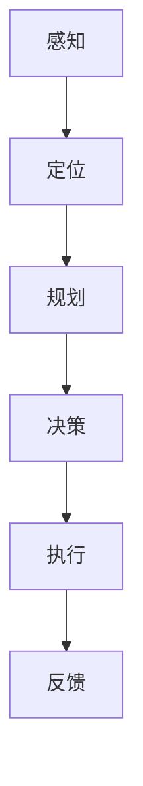

                 

# 构建自动驾驶安全性评估技术体系的核心要素与实践进展

## 关键词
自动驾驶、安全性评估、技术体系、核心要素、实践进展

## 摘要
随着自动驾驶技术的发展，其安全性评估成为至关重要的环节。本文深入探讨了构建自动驾驶安全性评估技术体系的核心要素，包括相关概念、算法原理、数学模型、实际应用场景、工具资源等。通过实例分析和未来趋势展望，本文旨在为自动驾驶安全性评估提供系统性、实践性的指导。

## 1. 背景介绍
自动驾驶技术近年来得到了迅猛发展，从辅助驾驶到完全自动驾驶，各大科技公司和研究机构纷纷投入巨资进行研发。然而，自动驾驶的安全性问题始终是公众关注的焦点。如何构建一个有效的自动驾驶安全性评估技术体系，确保车辆在各种复杂环境下的安全运行，成为当前研究的热点和难点。

自动驾驶的安全性评估涉及多个层面，包括软件、硬件、传感器、通信等。其中，软件层面主要包括自动驾驶算法的稳定性和可靠性；硬件层面主要涉及车辆传感器和执行器的性能；传感器层面主要评估传感器数据的质量和准确性；通信层面则关注车与车、车与基础设施之间的信息交互。

## 2. 核心概念与联系

### 2.1 自动驾驶系统架构
自动驾驶系统通常分为五个层次：感知（Perception）、定位（Localization）、规划（Planning）、决策（Decision）和执行（Execution）。这些层次相互关联，共同构成了自动驾驶系统的核心架构。


### 2.2 安全性评估指标
安全性评估指标是衡量自动驾驶系统安全性的关键。常见的评估指标包括事故率（Accident Rate）、故障率（Failure Rate）、失误率（Error Rate）等。这些指标可以用于评估系统在特定环境下的安全性能。

### 2.3 Mermaid流程图
为了更直观地展示自动驾驶安全性评估的技术体系，我们可以使用Mermaid流程图来描述核心概念之间的联系。



## 3. 核心算法原理 & 具体操作步骤

### 3.1 感知算法原理
感知算法是自动驾驶系统的第一步，其主要任务是收集并处理车辆周围环境的数据。常用的感知算法包括视觉感知、雷达感知和激光感知。

- **视觉感知**：通过摄像头捕捉道路和周围环境，然后利用图像处理和计算机视觉技术进行目标检测和识别。
- **雷达感知**：利用雷达发射电磁波并接收回波，从而获取目标物体的距离、速度等信息。
- **激光感知**：通过激光雷达（LiDAR）发射激光束并测量回波时间，从而获取三维空间中的点云数据。

### 3.2 定位算法原理
定位算法是自动驾驶系统的核心，其主要任务是通过感知数据确定车辆在环境中的位置。常用的定位算法包括基于视觉的定位、基于雷达的定位和基于GNSS的定位。

- **基于视觉的定位**：通过摄像头捕捉道路标志、车道线等信息，结合地图数据实现车辆定位。
- **基于雷达的定位**：利用雷达感知数据计算车辆相对于周围环境的位置。
- **基于GNSS的定位**：利用全球导航卫星系统（如GPS）获取车辆的位置信息。

### 3.3 规划算法原理
规划算法是自动驾驶系统的决策层，其主要任务是生成车辆行驶的路径。常用的规划算法包括路径规划、行为规划和轨迹规划。

- **路径规划**：在给定起始点和目标点的情况下，生成一条从起始点到目标点的最优路径。
- **行为规划**：根据周围环境和车辆行为，生成一套合理的驾驶行为策略。
- **轨迹规划**：在给定行驶路径和行为策略的情况下，生成一条平滑、安全的行驶轨迹。

### 3.4 决策算法原理
决策算法是自动驾驶系统的核心，其主要任务是根据规划结果做出驾驶决策。常用的决策算法包括基于规则、基于概率和基于深度学习的决策算法。

- **基于规则的决策算法**：根据预设的规则进行驾驶决策，如交通信号灯识别、车道保持等。
- **基于概率的决策算法**：利用概率模型进行驾驶决策，如贝叶斯网络、马尔可夫决策过程等。
- **基于深度学习的决策算法**：通过深度学习模型进行驾驶决策，如卷积神经网络、循环神经网络等。

### 3.5 执行算法原理
执行算法是自动驾驶系统的执行层，其主要任务是按照决策结果控制车辆执行相应的动作。常用的执行算法包括线性控制、非线性控制和机器学习控制。

- **线性控制**：利用线性控制理论生成控制信号，如PID控制器。
- **非线性控制**：利用非线性控制理论生成控制信号，如滑模控制、模糊控制等。
- **机器学习控制**：利用机器学习算法生成控制信号，如强化学习、生成对抗网络等。

## 4. 数学模型和公式 & 详细讲解 & 举例说明

### 4.1 数学模型

在自动驾驶安全性评估中，常用的数学模型包括概率模型、线性模型和神经网络模型。

- **概率模型**：用于计算事件发生的概率，如贝叶斯网络。
- **线性模型**：用于建立变量之间的关系，如线性回归、线性规划。
- **神经网络模型**：用于模拟人脑神经网络，如卷积神经网络、循环神经网络。

### 4.2 公式

以下是一个简单的贝叶斯网络模型，用于计算自动驾驶系统发生故障的概率。

$$
P(\text{故障}|\text{故障原因}) = \frac{P(\text{故障原因}|\text{故障})P(\text{故障})}{P(\text{故障原因})}
$$

### 4.3 举例说明

假设一个自动驾驶系统在雨天行驶时发生故障的概率为0.01，而雨天行驶的概率为0.2，那么在雨天行驶时发生故障的概率为：

$$
P(\text{故障}|\text{雨天}) = \frac{P(\text{雨天}|\text{故障})P(\text{故障})}{P(\text{雨天})}
$$

$$
P(\text{故障}|\text{雨天}) = \frac{0.01 \times 0.2}{0.2} = 0.01
$$

## 5. 项目实战：代码实际案例和详细解释说明

### 5.1 开发环境搭建
为了实现自动驾驶安全性评估，我们需要搭建一个包含感知、定位、规划、决策和执行等模块的开发环境。这里以Python为例，介绍如何搭建开发环境。

1. 安装Python和Anaconda
2. 安装相关库，如NumPy、Pandas、Matplotlib等
3. 安装深度学习库，如TensorFlow、PyTorch等

### 5.2 源代码详细实现和代码解读
以下是一个简单的自动驾驶感知模块的代码实现，用于检测道路上的车辆。

```python
import cv2
import numpy as np

def detect_vehicles(image):
    # 将图像灰度化
    gray = cv2.cvtColor(image, cv2.COLOR_BGR2GRAY)
    
    # 使用高斯模糊去除噪声
    blurred = cv2.GaussianBlur(gray, (5, 5), 0)
    
    # 使用Canny算法检测边缘
    edges = cv2.Canny(blurred, 50, 150)
    
    # 使用HoughLinesP算法检测直线
    lines = cv2.HoughLinesP(edges, 1, np.pi/180, 100, minLineLength=100, maxLineGap=10)
    
    # 绘制检测结果
    for line in lines:
        x1, y1, x2, y2 = line[0]
        cv2.line(image, (x1, y1), (x2, y2), (0, 0, 255), 2)
    
    # 使用轮廓检测提取车辆
    contours, _ = cv2.findContours(edges, cv2.RETR_EXTERNAL, cv2.CHAIN_APPROX_SIMPLE)
    vehicles = []
    for contour in contours:
        if cv2.contourArea(contour) > 1000:
            vehicles.append(contour)
    
    # 绘制车辆轮廓
    for vehicle in vehicles:
        cv2.drawContours(image, [vehicle], -1, (0, 255, 0), 2)
    
    return image

# 加载图像
image = cv2.imread('road.jpg')

# 检测车辆
result = detect_vehicles(image)

# 显示结果
cv2.imshow('Vehicle Detection', result)
cv2.waitKey(0)
cv2.destroyAllWindows()
```

### 5.3 代码解读与分析
这段代码主要用于检测图像中的车辆，分为以下几个步骤：

1. **图像预处理**：将图像灰度化并使用高斯模糊去除噪声，提高检测效果。
2. **边缘检测**：使用Canny算法检测图像的边缘。
3. **直线检测**：使用HoughLinesP算法检测图像中的直线。
4. **轮廓检测**：使用轮廓检测提取图像中的车辆轮廓。
5. **绘制结果**：将检测结果绘制在原图上，显示检测结果。

## 6. 实际应用场景

### 6.1 自动驾驶汽车
自动驾驶汽车是自动驾驶技术最直观的应用场景。通过安全性评估技术体系，自动驾驶汽车可以在各种道路环境下实现安全驾驶。

### 6.2 自动驾驶无人机
自动驾驶无人机在物流、农业、测绘等领域具有广泛的应用。通过安全性评估技术体系，自动驾驶无人机可以在复杂环境下实现安全飞行。

### 6.3 自动驾驶机器人
自动驾驶机器人在工厂、仓库、医疗等领域具有广泛的应用。通过安全性评估技术体系，自动驾驶机器人可以在各种环境中实现安全作业。

## 7. 工具和资源推荐

### 7.1 学习资源推荐

- **书籍**：
  - 《自动驾驶系统设计与实现》
  - 《深度学习与自动驾驶》
- **论文**：
  - 《基于深度学习的自动驾驶感知系统》
  - 《自动驾驶汽车的安全性评估方法研究》
- **博客**：
  - [自动驾驶技术博客](https://www.autonomousvehicles.com/)
  - [深度学习与自动驾驶](https://www.deeplearningautonomousvehicles.com/)
- **网站**：
  - [自动驾驶技术论坛](https://www.autonomousvehiclesforum.com/)
  - [深度学习教程](https://www.deeplearningcourse.com/)

### 7.2 开发工具框架推荐

- **开发工具**：
  - Python
  - C++
  - MATLAB
- **框架**：
  - TensorFlow
  - PyTorch
  - OpenCV

### 7.3 相关论文著作推荐

- **论文**：
  - 《基于深度学习的自动驾驶感知系统》
  - 《自动驾驶汽车的安全性评估方法研究》
  - 《面向自动驾驶的传感器融合算法研究》
- **著作**：
  - 《自动驾驶系统设计与实现》
  - 《深度学习与自动驾驶》

## 8. 总结：未来发展趋势与挑战

随着自动驾驶技术的不断发展，安全性评估技术体系将面临以下挑战：

1. **数据隐私**：如何保护自动驾驶系统收集的隐私数据，确保数据不被滥用。
2. **应对复杂环境**：如何提高自动驾驶系统在复杂、多变环境下的安全性能。
3. **应对未知情况**：如何确保自动驾驶系统在遇到未知情况时能够做出安全、合理的决策。
4. **标准制定**：如何制定统一的安全评估标准，确保不同厂商的自动驾驶系统具有可比性。

未来，自动驾驶安全性评估技术体系将朝着以下方向发展：

1. **智能化**：利用人工智能技术，提高自动驾驶系统的自主学习和适应能力。
2. **协同化**：通过车联网技术，实现自动驾驶系统之间的信息共享和协同工作。
3. **标准化**：制定统一的安全评估标准和测试方法，提高自动驾驶系统的可靠性和安全性。

## 9. 附录：常见问题与解答

### 9.1 自动驾驶系统有哪些层次？

自动驾驶系统通常分为五个层次：感知、定位、规划、决策和执行。

### 9.2 安全性评估指标有哪些？

常见的安全性评估指标包括事故率、故障率、失误率等。

### 9.3 如何搭建自动驾驶开发环境？

搭建自动驾驶开发环境通常需要安装Python、相关库（如NumPy、Pandas、Matplotlib等）以及深度学习库（如TensorFlow、PyTorch等）。

## 10. 扩展阅读 & 参考资料

- 《自动驾驶系统设计与实现》
- 《深度学习与自动驾驶》
- [自动驾驶技术博客](https://www.autonomousvehicles.com/)
- [深度学习与自动驾驶](https://www.deeplearningautonomousvehicles.com/)
- [自动驾驶技术论坛](https://www.autonomousvehiclesforum.com/)
- [深度学习教程](https://www.deeplearningcourse.com/)

