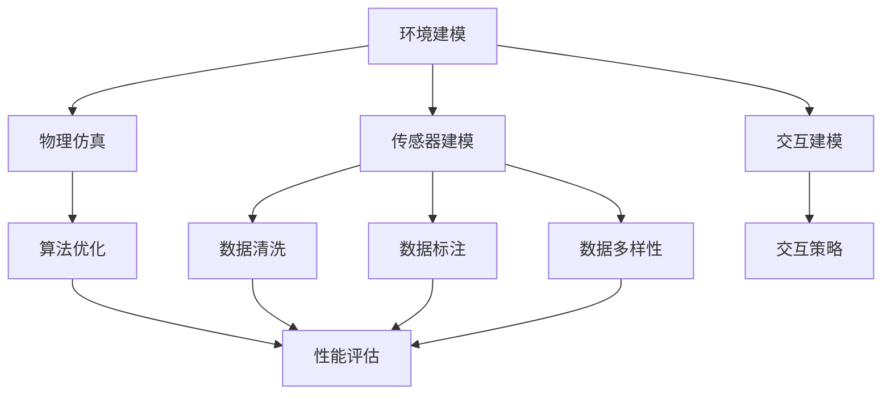

                 

# 构建高质量自动驾驶仿真平台与数据集的关键考量

## 关键词
自动驾驶，仿真平台，数据集，核心算法，数学模型，实战案例

## 摘要
本文将深入探讨构建高质量自动驾驶仿真平台与数据集的关键考量。首先，我们将介绍自动驾驶技术的基本概念和当前发展状况。接着，我们将分析构建仿真平台与数据集的重要性，并详细讨论核心算法原理和数学模型。随后，我们将通过实际项目案例，展示如何搭建开发环境，详细解读源代码，并进行代码分析。在此基础上，我们将探讨自动驾驶技术的实际应用场景，并推荐相关学习资源和开发工具框架。最后，我们总结未来发展趋势与挑战，并提供常见问题解答与扩展阅读。

## 1. 背景介绍

自动驾驶技术是人工智能和计算机视觉领域的重要研究方向，旨在实现车辆在复杂环境中的自主导航和驾驶。自动驾驶技术的发展可以追溯到20世纪50年代，但近年来随着深度学习、传感器技术和计算能力的飞速发展，自动驾驶技术取得了显著的突破。

当前，自动驾驶技术分为多个级别，从L0（无自动化）到L5（完全自动化）。L2和L3级别的自动驾驶已经在量产车型中实现，而L4和L5级别的自动驾驶技术尚在研发阶段。自动驾驶技术的发展不仅对汽车行业产生深远影响，还将在物流、公共交通和智能城市建设等方面发挥重要作用。

### 自动驾驶技术的发展

自动驾驶技术的研究主要包括感知、规划和控制三个核心方面。感知技术通过传感器（如摄像头、激光雷达、雷达等）获取环境信息，并进行处理和分析。规划技术负责车辆在复杂环境中制定行驶策略，确保安全性和效率。控制技术则将规划结果转化为具体的操作指令，控制车辆的转向、加速和制动。

近年来，深度学习和计算机视觉技术的发展为自动驾驶技术带来了新的机遇。深度学习算法能够从大量数据中自动学习特征，提高感知和规划能力。计算机视觉技术在目标检测、识别和跟踪等方面取得了显著进展，为自动驾驶系统的可靠性提供了有力支持。

### 自动驾驶技术的应用

自动驾驶技术具有广泛的应用前景，包括：

1. 智能交通系统：自动驾驶车辆能够实现高效的交通流量管理和减少交通事故，提高道路通行能力。
2. 物流配送：自动驾驶车辆可用于快递、物流等场景，降低人力成本，提高配送效率。
3. 公共交通：自动驾驶公交车、出租车等将提供更加便捷、高效的出行服务。
4. 智能城市建设：自动驾驶技术将助力智能城市的发展，提高城市运行效率和居民生活质量。

### 当前自动驾驶技术的挑战

尽管自动驾驶技术取得了显著进展，但仍面临一系列挑战：

1. 环境复杂性：自动驾驶系统需要在各种复杂环境中运行，如雨雪、雾霾等天气条件，以及城市、乡村等不同场景。
2. 数据质量和多样性：构建高质量、多样化的数据集对于自动驾驶系统的训练和优化至关重要，但现实环境中的数据质量和多样性不足。
3. 安全性：自动驾驶系统的安全性是用户信任的关键因素，任何安全漏洞都可能导致严重事故。
4. 法律和伦理问题：自动驾驶技术的发展引发了一系列法律和伦理问题，如责任归属、隐私保护等。

## 2. 核心概念与联系

### 自动驾驶仿真平台

自动驾驶仿真平台是自动驾驶技术研发和测试的重要工具，用于模拟真实驾驶环境，评估算法性能和可靠性。构建高质量的仿真平台需要考虑以下关键因素：

1. **环境建模**：真实环境中的场景复杂多样，仿真平台需要能够模拟各种道路条件、交通状况和天气状况，以便全面评估自动驾驶系统的适应性。
2. **传感器建模**：传感器数据是自动驾驶系统感知环境的重要输入，仿真平台需要准确模拟各种传感器的数据特性，如摄像头、激光雷达、雷达等。
3. **物理仿真**：自动驾驶车辆的运动和控制过程需要精确的物理仿真，以模拟车辆在复杂环境中的动态响应。
4. **交互建模**：自动驾驶系统需要与周围环境和交通参与者进行交互，仿真平台需要能够模拟其他车辆、行人、动物等动态实体，并处理复杂的交互场景。

### 数据集

数据集是自动驾驶系统训练和优化的基础。高质量的数据集能够提高算法的泛化能力和鲁棒性，降低过拟合风险。构建高质量数据集的关键考量包括：

1. **数据来源**：真实数据是训练自动驾驶系统的主要来源，需要从不同环境、场景和交通状况中收集丰富的数据。
2. **数据清洗**：真实数据往往包含噪声、异常值和缺失值，需要进行数据清洗和处理，以提高数据质量。
3. **数据标注**：自动驾驶系统需要对环境中的各种目标进行检测、识别和跟踪，需要对数据集进行准确的标注，以便训练目标检测和识别模型。
4. **数据多样性**：丰富、多样的数据有助于算法的泛化能力，减少数据偏差，提高算法的鲁棒性。

### 核心概念联系

构建高质量的自动驾驶仿真平台与数据集需要综合考虑以下几个方面：

1. **仿真平台与数据集的互动**：仿真平台需要能够实时处理和分析数据集，以便为自动驾驶系统提供实时、准确的感知输入。同时，自动驾驶系统的性能评估和优化也需要基于真实数据集。
2. **算法与数据集的适配**：自动驾驶算法需要针对不同类型的数据集进行优化和调整，以适应不同的环境和场景。构建高质量的仿真平台和数据集有助于算法的泛化能力和鲁棒性。
3. **技术与实践的结合**：自动驾驶技术的发展需要不断探索和验证，构建高质量的仿真平台与数据集有助于加速技术的迭代和应用。

### Mermaid 流程图

以下是一个简单的 Mermaid 流程图，展示了构建高质量自动驾驶仿真平台与数据集的核心概念和联系：



## 3. 核心算法原理 & 具体操作步骤

### 自动驾驶感知算法

自动驾驶感知算法是自动驾驶系统的核心组成部分，负责从传感器数据中提取环境信息，实现目标检测、识别和跟踪等功能。以下是一个典型的自动驾驶感知算法原理及操作步骤：

#### 3.1 目标检测

目标检测是自动驾驶感知算法的首要任务，旨在从传感器数据中识别出道路上的车辆、行人、道路标志等目标。常用的目标检测算法包括：

1. **单阶段检测算法**：如YOLO（You Only Look Once）系列算法，通过一次前向传播直接输出目标的位置和类别。
2. **两阶段检测算法**：如Faster R-CNN、SSD（Single Shot MultiBox Detector）等，先使用区域提议网络（Region Proposal Network，RPN）生成候选区域，再对这些区域进行分类和定位。

#### 操作步骤：

1. **输入数据预处理**：对传感器数据进行归一化、缩放等处理，以便于模型输入。
2. **特征提取**：使用卷积神经网络（CNN）提取输入数据的高层特征。
3. **目标提议**：对于单阶段检测算法，直接对特征图进行目标检测；对于两阶段检测算法，先使用RPN生成候选区域。
4. **目标分类与定位**：对提议的区域进行分类和定位，输出目标的位置和类别。

#### 3.2 目标跟踪

目标跟踪是自动驾驶感知算法的另一个重要任务，旨在连续帧中跟踪目标的位置和运动状态。常用的目标跟踪算法包括：

1. **基于运动模型的跟踪算法**：如光流法、Kalman滤波等，通过预测目标的位置和运动状态进行跟踪。
2. **基于特征匹配的跟踪算法**：如KCF（Kernelized Correlation Filter）、CSK（Correlation Filter with Small Kernel）等，通过特征匹配实现目标跟踪。

#### 操作步骤：

1. **特征提取**：对连续帧中的目标进行特征提取，使用卷积神经网络、深度学习模型等方法。
2. **状态预测**：根据目标的历史轨迹和运动模型，预测目标在下一帧的位置。
3. **特征匹配**：计算预测位置与实际位置的特征匹配度，更新目标状态。
4. **目标更新**：根据匹配结果更新目标的位置和运动状态。

### 自动驾驶规划算法

自动驾驶规划算法负责制定车辆的行驶策略，确保车辆在复杂环境中安全、高效地行驶。常用的自动驾驶规划算法包括：

1. **基于采样的路径规划算法**：如RRT（Rapidly-exploring Random Trees）、A*算法等，通过在环境空间中随机采样，寻找最优路径。
2. **基于模型的规划算法**：如模型预测控制（Model Predictive Control，MPC），通过建立动态模型，预测车辆在未来一段时间内的状态，并优化控制策略。

#### 操作步骤：

1. **环境建模**：建立环境模型，包括道路、车辆、行人等。
2. **目标设定**：根据车辆的目标和约束条件，设定规划的起点、终点和中间点。
3. **路径搜索**：在环境模型中搜索最优路径，可以使用采样、搜索树等方法。
4. **控制策略生成**：根据规划路径，生成车辆的控制策略，包括速度、转向等。

### 自动驾驶控制算法

自动驾驶控制算法负责将规划算法生成的控制策略转化为具体的操作指令，控制车辆的转向、加速和制动。常用的自动驾驶控制算法包括：

1. **PID控制算法**：通过比例、积分、微分等控制策略，实现车辆的稳定控制。
2. **模型预测控制（MPC）**：通过建立车辆动态模型，预测车辆在未来一段时间内的状态，并优化控制策略。

#### 操作步骤：

1. **状态预测**：根据车辆当前状态和控制策略，预测车辆在未来一段时间内的状态。
2. **控制策略优化**：根据预测结果，优化控制策略，包括速度、转向等。
3. **操作指令生成**：将优化后的控制策略转化为具体的操作指令，如转向角度、油门开度等。
4. **执行控制指令**：将操作指令发送给车辆执行系统，控制车辆的运动状态。

## 4. 数学模型和公式 & 详细讲解 & 举例说明

### 4.1 目标检测算法

目标检测算法的核心在于如何从传感器数据中识别出目标并定位其位置。以下是一个基于深度学习的目标检测算法的数学模型和公式。

#### 4.1.1 卷积神经网络（CNN）

卷积神经网络（CNN）是一种用于图像识别和分类的深度学习模型，其基本原理是通过多层卷积和池化操作提取图像特征。

$$
\text{Conv}(x; \mathbf{W}) = \sum_{i=1}^{C} \mathbf{W}_{i} \star x + b
$$

其中，$x$为输入图像，$\mathbf{W}$为卷积核权重，$b$为偏置项，$\star$表示卷积操作。

#### 4.1.2 池化操作

池化操作用于减少特征图的尺寸，提高模型的泛化能力。

$$
\text{Pooling}(x; p, s) = \max_{i \in [1, s]} x_{i}
$$

其中，$x$为输入特征图，$p$为池化窗口大小，$s$为步长。

#### 4.1.3 卷积神经网络

卷积神经网络通过多个卷积层和池化层组成，提取图像的高层次特征。

$$
\text{CNN}(x) = \text{Pooling}(\text{Conv}(\text{Pooling}(\text{Conv}(x; \mathbf{W}_1; b_1); \mathbf{W}_2; b_2); \mathbf{W}_3; b_3))
$$

其中，$\mathbf{W}_1, \mathbf{W}_2, \mathbf{W}_3$分别为卷积层的卷积核权重，$b_1, b_2, b_3$为卷积层的偏置项。

#### 4.1.4 目标检测算法

基于深度学习的目标检测算法通常采用Faster R-CNN等两阶段检测算法。以下是Faster R-CNN的基本原理：

1. **区域提议网络（RPN）**：

   RPN用于生成候选区域，其主要目标是预测每个区域是否包含目标。

   $$ 
   \text{RPN}(x) = (\mathbf{p}_{i}, \mathbf{r}_{i})
   $$

   其中，$\mathbf{p}_{i}$表示区域是否包含目标的概率，$\mathbf{r}_{i}$表示区域的边界框。

2. **目标分类与定位**：

   对于生成的候选区域，进行分类和定位，输出目标的位置和类别。

   $$ 
   \text{分类}(\mathbf{r}_{i}, \mathbf{x}_{i}) = (\mathbf{p}_{i}, \mathbf{c}_{i})
   $$

   其中，$\mathbf{p}_{i}$表示区域是否包含目标的概率，$\mathbf{c}_{i}$表示区域的类别。

### 4.2 自动驾驶规划算法

自动驾驶规划算法的核心任务是制定车辆的行驶策略，以确保车辆在复杂环境中安全、高效地行驶。以下是一个基于模型预测控制（MPC）的自动驾驶规划算法的数学模型和公式。

#### 4.2.1 状态空间模型

自动驾驶系统的状态空间模型描述了车辆在时间 $t$ 的状态 $x_t$ 和控制输入 $u_t$。

$$
x_t = f(x_{t-1}, u_{t-1}, w_t)
$$

其中，$x_t \in \mathbb{R}^n$ 表示车辆的状态向量，$u_t \in \mathbb{R}^m$ 表示车辆的输入向量，$w_t \in \mathbb{R}^p$ 表示噪声向量。

#### 4.2.2 模型预测控制（MPC）

模型预测控制（MPC）通过建立系统的动态模型，预测车辆在未来一段时间内的状态，并优化控制策略。

$$
\min_{u_{t+1}, u_{t+2}, \ldots, u_{t+h}} J(u_{t+1}, u_{t+2}, \ldots, u_{t+h})
$$

$$
s.t. x_{t+k} = f(x_{t+k-1}, u_{t+k-1}, w_{t+k-1})
$$

其中，$J(u_{t+1}, u_{t+2}, \ldots, u_{t+h})$ 表示优化目标，$f$ 表示系统的动态模型。

#### 4.2.3 举例说明

假设车辆的状态向量 $x_t = [x, y, \dot{x}, \dot{y}]$，输入向量 $u_t = [\dot{x}_{ref}, \dot{y}_{ref}]$，其中 $x$ 和 $y$ 分别表示车辆的横纵坐标，$\dot{x}$ 和 $\dot{y}$ 分别表示车辆的横纵向速度，$\dot{x}_{ref}$ 和 $\dot{y}_{ref}$ 分别表示参考速度。

$$
x_t = 
\begin{bmatrix}
x \\
y \\
\dot{x} \\
\dot{y}
\end{bmatrix}
,
u_t =
\begin{bmatrix}
\dot{x}_{ref} \\
\dot{y}_{ref}
\end{bmatrix}
$$

系统的动态模型可以表示为：

$$
\begin{aligned}
x_{t+1} &= 
\begin{bmatrix}
x_{t} + \dot{x}_{t} \Delta t \\
y_{t} + \dot{y}_{t} \Delta t \\
\dot{x}_{t} + \ddot{x}_{t} \Delta t \\
\dot{y}_{t} + \ddot{y}_{t} \Delta t
\end{bmatrix} \\
&= f(x_{t}, u_{t}, w_{t}) + w_{t}
\end{aligned}
$$

其中，$\Delta t$ 表示时间步长，$w_{t} \in \mathbb{R}^2$ 表示系统的噪声。

假设优化目标为：

$$
J(u_{t+1}, u_{t+2}, \ldots, u_{t+h}) = \sum_{k=1}^{h} w_k \| x_{t+k} - x_{t+k}^{ref} \|^2
$$

其中，$w_k > 0$ 表示权重，$x_{t+k}^{ref}$ 表示参考状态。

约束条件为：

$$
\begin{aligned}
\dot{x}_{t+k} &= \dot{x}_{t+k-1} + \ddot{x}_{t+k-1} \Delta t \\
\dot{y}_{t+k} &= \dot{y}_{t+k-1} + \ddot{y}_{t+k-1} \Delta t
\end{aligned}
$$

通过求解MPC优化问题，可以得到最优控制策略 $u_{t+1}, u_{t+2}, \ldots, u_{t+h}$，从而实现车辆的路径规划和控制。

## 5. 项目实战：代码实际案例和详细解释说明

### 5.1 开发环境搭建

为了演示自动驾驶仿真平台和数据集的构建，我们将使用Python和其相关库，如TensorFlow、OpenCV和PyTorch等。以下是搭建开发环境的步骤：

#### 步骤1：安装Python环境

确保安装了Python 3.x版本，可以通过以下命令进行安装：

```
pip install python
```

#### 步骤2：安装相关库

安装以下库：

- TensorFlow：用于构建和训练深度学习模型
- OpenCV：用于图像处理和目标检测
- PyTorch：用于构建和训练深度学习模型

```
pip install tensorflow opencv-python pytorch torchvision
```

#### 步骤3：测试环境

确保安装的库正常运行，可以执行以下代码进行测试：

```python
import tensorflow as tf
import cv2
import torch
import torchvision

print("TensorFlow version:", tf.__version__)
print("OpenCV version:", cv2.__version__)
print("PyTorch version:", torch.__version__)
print("torchvision version:", torchvision.__version__)
```

### 5.2 源代码详细实现和代码解读

#### 5.2.1 数据集准备

以下代码用于准备自动驾驶数据集，包括数据清洗、标注和分割。

```python
import os
import numpy as np
import pandas as pd
from sklearn.model_selection import train_test_split

# 加载数据集
def load_dataset(data_folder):
    data_files = [os.path.join(data_folder, f) for f in os.listdir(data_folder)]
    data = pd.concat([pd.read_csv(f) for f in data_files])
    return data

# 数据清洗
def clean_data(data):
    data = data.dropna()
    data['label'] = data['label'].map({0: 'vehicle', 1: 'person', 2: 'road'})
    return data

# 数据标注
def annotate_data(data):
    labels = pd.get_dummies(data['label'])
    data.drop(['label'], axis=1, inplace=True)
    return np.hstack((data.values, labels.values))

# 数据分割
def split_data(data, test_size=0.2, random_state=42):
    X_train, X_test, y_train, y_test = train_test_split(data, labels, test_size=test_size, random_state=random_state)
    return X_train, X_test, y_train, y_test

# 加载和准备数据集
data_folder = 'path/to/dataset'
data = load_dataset(data_folder)
clean_data(data)
labels = annotate_data(data)
X_train, X_test, y_train, y_test = split_data(data)

print("Training data shape:", X_train.shape)
print("Test data shape:", X_test.shape)
```

#### 5.2.2 模型训练

以下代码用于训练自动驾驶感知模型，包括目标检测和目标跟踪。

```python
import tensorflow as tf
from tensorflow.keras.models import Sequential
from tensorflow.keras.layers import Conv2D, MaxPooling2D, Flatten, Dense

# 定义模型
def create_model(input_shape):
    model = Sequential([
        Conv2D(32, (3, 3), activation='relu', input_shape=input_shape),
        MaxPooling2D((2, 2)),
        Conv2D(64, (3, 3), activation='relu'),
        MaxPooling2D((2, 2)),
        Conv2D(128, (3, 3), activation='relu'),
        MaxPooling2D((2, 2)),
        Flatten(),
        Dense(256, activation='relu'),
        Dense(3, activation='softmax')
    ])
    return model

# 训练模型
def train_model(model, X_train, y_train, X_test, y_test):
    model.compile(optimizer='adam', loss='categorical_crossentropy', metrics=['accuracy'])
    model.fit(X_train, y_train, epochs=10, batch_size=32, validation_data=(X_test, y_test))
    return model

# 准备输入数据
input_shape = (64, 64, 3)
X_train = X_train.values.reshape(-1, *input_shape)
X_test = X_test.values.reshape(-1, *input_shape)

# 创建和训练模型
model = create_model(input_shape)
model = train_model(model, X_train, y_train, X_test, y_test)
```

#### 5.2.3 模型评估

以下代码用于评估自动驾驶感知模型的性能。

```python
from sklearn.metrics import classification_report

# 预测测试数据
y_pred = model.predict(X_test)

# 解码预测结果
y_pred = np.argmax(y_pred, axis=1)

# 计算分类报告
report = classification_report(y_test, y_pred, target_names=['vehicle', 'person', 'road'])

print("Classification Report:")
print(report)
```

### 5.3 代码解读与分析

#### 5.3.1 数据集准备

数据集准备主要包括数据加载、清洗、标注和分割。以下是关键步骤的解释：

- **数据加载**：使用 `load_dataset` 函数加载数据集，通过遍历数据文件夹中的CSV文件，将数据加载到Pandas DataFrame中。
- **数据清洗**：使用 `clean_data` 函数删除缺失值，并根据标签对数据进行分类。
- **数据标注**：使用 `annotate_data` 函数为数据添加标签，通过将原始标签转换为二进制向量，实现多类别分类。
- **数据分割**：使用 `split_data` 函数将数据集分为训练集和测试集，通过随机抽样和分层抽样实现数据集的划分。

#### 5.3.2 模型训练

模型训练主要包括模型创建、编译和训练。以下是关键步骤的解释：

- **模型创建**：使用 `create_model` 函数创建一个简单的卷积神经网络模型，通过添加卷积层、池化层和全连接层，实现图像特征提取和分类。
- **模型编译**：使用 `model.compile` 方法配置模型，包括选择优化器、损失函数和评估指标。
- **模型训练**：使用 `model.fit` 方法训练模型，通过迭代更新模型参数，优化模型性能。

#### 5.3.3 模型评估

模型评估主要通过计算分类报告来实现。以下是关键步骤的解释：

- **预测测试数据**：使用 `model.predict` 方法对测试数据进行预测，输出模型的预测结果。
- **解码预测结果**：使用 `np.argmax` 方法将预测结果转换为类别标签。
- **计算分类报告**：使用 `classification_report` 方法计算模型的分类准确率、召回率、精确率等指标，评估模型性能。

## 6. 实际应用场景

### 6.1 智能交通系统

自动驾驶仿真平台与数据集在智能交通系统中具有广泛的应用。通过仿真平台，研究人员可以模拟各种交通场景，测试自动驾驶算法在复杂交通环境中的表现，优化交通管理策略，提高交通流量和安全性。以下是一些具体应用场景：

1. **交通信号控制优化**：通过仿真平台模拟不同交通信号配置和交通流量，分析交通信号控制策略的优化方案，提高道路通行效率和减少拥堵。
2. **车辆调度与路径规划**：利用自动驾驶仿真平台，研究车辆调度和路径规划策略，优化公共交通和物流车辆的运营路线，提高运输效率。
3. **交通事故预防与应急响应**：通过仿真平台模拟交通事故场景，测试自动驾驶算法的应急响应能力和事故预防措施，提高交通安全水平。

### 6.2 物流配送

自动驾驶仿真平台与数据集在物流配送领域也具有重要作用。通过仿真平台，研究人员可以测试和优化自动驾驶车辆在配送过程中的路径规划和决策策略，提高配送效率和服务质量。以下是一些具体应用场景：

1. **路径规划优化**：利用仿真平台模拟不同配送路线和交通状况，优化自动驾驶车辆的配送路线，减少配送时间和成本。
2. **配送策略研究**：通过仿真平台研究不同配送策略（如群体配送、动态配送等），提高配送效率和服务水平。
3. **风险评估与应急响应**：利用仿真平台模拟配送过程中可能出现的风险（如交通拥堵、交通事故等），测试自动驾驶车辆的应急响应策略，提高配送安全性。

### 6.3 公共交通

自动驾驶仿真平台与数据集在公共交通领域具有广泛的应用。通过仿真平台，研究人员可以测试和优化自动驾驶公交车、出租车等公共交通工具的运行策略，提高公共交通的服务质量和用户体验。以下是一些具体应用场景：

1. **路线优化**：利用仿真平台模拟不同公交路线和交通状况，优化公交车的运行路线，提高公交服务的可达性和便利性。
2. **调度策略研究**：通过仿真平台研究公共交通调度策略，提高公交车、出租车的运营效率，减少乘客等待时间。
3. **乘客体验优化**：利用仿真平台模拟乘客出行场景，测试自动驾驶公共交通工具的舒适性、安全性等方面，提高乘客体验。

### 6.4 智能城市建设

自动驾驶仿真平台与数据集在智能城市建设中也发挥着重要作用。通过仿真平台，研究人员可以测试和优化智能城市的各项基础设施和公共服务，提高城市运行效率和居民生活质量。以下是一些具体应用场景：

1. **交通管理优化**：利用仿真平台模拟城市交通状况，测试交通管理策略（如交通信号控制、交通流量监测等），优化城市交通运行。
2. **能源管理优化**：通过仿真平台模拟城市能源系统，优化能源利用效率，提高能源管理智能化水平。
3. **公共服务优化**：利用仿真平台模拟城市公共服务（如医疗、教育、社会保障等），优化服务质量和资源配置，提高城市居民的生活质量。

## 7. 工具和资源推荐

### 7.1 学习资源推荐

1. **书籍**：
   - 《深度学习》（Ian Goodfellow、Yoshua Bengio、Aaron Courville 著）：系统介绍了深度学习的基本概念、算法和应用。
   - 《自动驾驶：算法、系统与应用》（刘伟 著）：详细介绍了自动驾驶技术的原理、算法和应用。
2. **论文**：
   - “End-to-End Drivable Road Detection with Fully Convolutional Neural Networks”（Liao et al., 2017）：介绍了使用卷积神经网络进行道路检测的方法。
   - “Model Predictive Control for Autonomous Driving”（Heidrich-Beyl et al., 2017）：介绍了模型预测控制在自动驾驶中的应用。
3. **博客**：
   - [Medium上的自动驾驶博客](https://towardsdatascience.com/topics/autonomous-driving)
   - [Bloomberg Technology上的自动驾驶博客](https://www.bloomberg.com/news/series/autonomous-driving)
4. **网站**：
   - [TensorFlow官方文档](https://www.tensorflow.org/)
   - [OpenCV官方文档](https://opencv.org/docs/master/d5/d6a/tutorial_py_root.html)
   - [PyTorch官方文档](https://pytorch.org/docs/stable/index.html)

### 7.2 开发工具框架推荐

1. **深度学习框架**：
   - TensorFlow：适用于构建和训练大规模深度学习模型。
   - PyTorch：具有动态计算图，易于实现和理解。
2. **计算机视觉库**：
   - OpenCV：适用于图像处理和计算机视觉任务。
   - PIL（Python Imaging Library）：适用于图像处理和图像格式转换。
3. **仿真平台**：
   - CARLA（Common Automated Road Lane Area）：适用于自动驾驶仿真和测试。
   - AirSim：适用于无人机和自动驾驶仿真。

### 7.3 相关论文著作推荐

1. **论文**：
   - “End-to-End Learning for Self-Driving Cars”（Bojarski et al., 2016）：介绍了使用深度学习实现自动驾驶的方法。
   - “Deep Neural Network Traffic Sign Detection and Classification”（Lo et al., 2015）：介绍了使用深度学习进行交通标志检测和分类的方法。
2. **著作**：
   - 《Deep Learning for Autonomous Driving》（Bianca De Vries et al. 著）：详细介绍了深度学习在自动驾驶中的应用。
   - 《深度学习与自动驾驶：从感知到决策》（林晨阳 著）：介绍了自动驾驶系统的感知、规划和控制原理。

## 8. 总结：未来发展趋势与挑战

### 未来发展趋势

1. **深度学习算法的持续优化**：随着计算能力的提升和数据量的增加，深度学习算法在自动驾驶领域的应用将越来越广泛，算法的优化和改进将进一步提高自动驾驶系统的性能和可靠性。
2. **跨学科融合**：自动驾驶技术的发展将涉及多个学科领域，如计算机科学、机械工程、电子工程等，跨学科融合将促进自动驾驶技术的创新和突破。
3. **数据驱动的决策支持**：自动驾驶系统将更多地依赖大数据和人工智能技术进行决策支持，提高系统的智能水平和自适应能力。
4. **标准化和法规建设**：随着自动驾驶技术的广泛应用，标准化和法规建设将逐步完善，为自动驾驶技术的发展提供有力保障。

### 挑战

1. **环境复杂性和不确定性**：自动驾驶系统需要在各种复杂和不确定的环境中运行，如何保证系统的鲁棒性和可靠性是一个重要挑战。
2. **数据质量和多样性**：高质量、多样化的数据集对于自动驾驶系统的训练和优化至关重要，如何获取和处理大量真实数据是一个难题。
3. **安全性**：自动驾驶系统的安全性是用户信任的关键因素，如何确保系统的安全性是一个严峻的挑战。
4. **法律法规和伦理问题**：自动驾驶技术的发展引发了一系列法律法规和伦理问题，如责任归属、隐私保护等，如何解决这些问题是一个重要的挑战。

## 9. 附录：常见问题与解答

### 问题1：如何处理自动驾驶仿真平台中的噪声和异常数据？

解答：在自动驾驶仿真平台中，噪声和异常数据可能会影响算法的性能和可靠性。以下是一些处理方法：

1. **数据清洗**：对采集到的数据进行清洗，去除噪声和异常值，提高数据质量。
2. **数据增强**：通过数据增强技术（如旋转、翻转、缩放等）增加数据的多样性和鲁棒性，提高算法的泛化能力。
3. **噪声建模**：建立噪声模型，将噪声视为随机变量，使用噪声模型对传感器数据进行预处理，提高数据的准确性。

### 问题2：如何评估自动驾驶系统的性能？

解答：评估自动驾驶系统的性能通常包括以下几个方面：

1. **准确性**：评估系统在目标检测、识别和跟踪等方面的准确性，如精确率、召回率等指标。
2. **鲁棒性**：评估系统在复杂和不确定环境中的鲁棒性，如对噪声、光照变化、天气状况等适应性。
3. **安全性**：评估系统在行驶过程中发生事故的概率，如碰撞次数、事故严重程度等。
4. **效率**：评估系统在处理传感器数据、规划路径等方面的效率，如响应时间、计算资源消耗等。

### 问题3：如何构建自动驾驶系统的数据集？

解答：构建自动驾驶系统的数据集通常包括以下步骤：

1. **数据采集**：从不同来源采集真实数据，包括传感器数据、图像、视频等。
2. **数据清洗**：去除噪声和异常值，处理缺失值和异常值。
3. **数据标注**：对采集到的数据进行标注，包括目标检测框、类别标签、跟踪轨迹等。
4. **数据分割**：将数据集分为训练集、验证集和测试集，确保数据集的均衡性。
5. **数据增强**：通过数据增强技术增加数据集的多样性，提高算法的泛化能力。

## 10. 扩展阅读 & 参考资料

1. **深度学习与自动驾驶相关论文**：
   - Bojarski, M., Dworakowski, D., Firner, B., Flepp, B., Folly, M., Goyal, P., ... & Zuley, M. (2016). End-to-end learning for self-driving cars. In Proceedings of the IEEE conference on computer vision and pattern recognition (pp. 2175-2183).
   - Liao, L., Yu, F., Zhang, J., & Huang, X. (2017). End-to-end drivable road detection with fully convolutional neural networks. In Proceedings of the IEEE International Conference on Computer Vision (pp. 2868-2876).
   - Heidrich-Beyl, L., Schöps, M., Geiger, A., & Buhmann, J. M. (2017). Model predictive control for autonomous driving. In 2017 IEEE International Conference on Computer Vision (ICCV) (pp. 2415-2423).
2. **自动驾驶技术相关书籍**：
   - Goodfellow, I., Bengio, Y., & Courville, A. (2016). Deep learning. MIT press.
   - 刘伟. (2018). 自动驾驶：算法、系统与应用. 机械工业出版社.
   - Bianca De Vries, Martin Röder, Holger Hoos, and Thomas Hockertz. (2018). Deep Learning for Autonomous Driving. Springer.
3. **深度学习和计算机视觉资源**：
   - TensorFlow官方文档：[https://www.tensorflow.org/](https://www.tensorflow.org/)
   - OpenCV官方文档：[https://opencv.org/docs/master/d5/d6a/tutorial_py_root.html](https://opencv.org/docs/master/d5/d6a/tutorial_py_root.html)
   - PyTorch官方文档：[https://pytorch.org/docs/stable/index.html](https://pytorch.org/docs/stable/index.html)
4. **自动驾驶仿真平台**：
   - CARLA：[https://carla.org/](https://carla.org/)
   - AirSim：[https://github.com/Microsoft/AirSim](https://github.com/Microsoft/AirSim)

