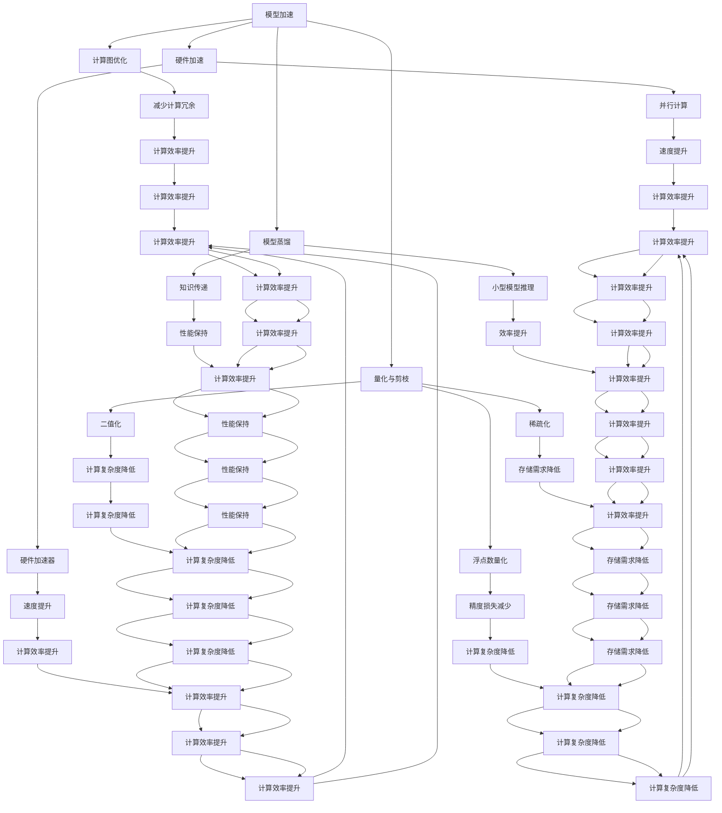

                 

# 模型加速与低精度计算原理与代码实战案例讲解

## 关键词：模型加速、低精度计算、算法优化、代码实战

## 摘要：

本文旨在探讨模型加速与低精度计算原理，并结合实际案例详细讲解其应用与实现。我们将首先介绍模型加速的背景与重要性，接着深入探讨低精度计算的基本概念与原理，然后通过具体案例展示如何在实际项目中应用这些技术。文章还将提供实用的工具和资源推荐，帮助读者进一步了解和掌握模型加速与低精度计算。通过本文的学习，读者将能够对模型加速与低精度计算有更深入的理解，并具备将所学应用于实践的能力。

## 1. 背景介绍

在当今科技飞速发展的时代，人工智能（AI）已经成为推动社会进步的重要力量。然而，随着深度学习模型变得越来越复杂，对计算资源的需求也在不断增加。传统的模型训练和推理过程往往需要大量的计算资源和时间，这限制了AI技术的广泛应用。为了解决这个问题，模型加速和低精度计算技术应运而生。

模型加速旨在提高深度学习模型的训练和推理速度，同时保持较高的准确性和鲁棒性。低精度计算则是通过减少模型参数和激活值的精度来降低计算复杂度和资源消耗。这两种技术共同作用，可以在不牺牲模型性能的前提下显著提高计算效率。

模型加速的应用场景非常广泛，包括但不限于：

- **实时推理**：在自动驾驶、智能语音助手、实时图像处理等领域，模型加速技术能够实现快速响应，提高用户体验。
- **移动设备**：在智能手机、嵌入式系统等设备上，模型加速技术能够确保模型在小规模计算资源上高效运行。
- **大规模训练**：在大数据分析和机器学习平台上，模型加速技术能够提高模型训练的速度，降低训练成本。

低精度计算则主要应用于资源受限的环境中，如物联网设备、嵌入式系统等。通过降低精度，可以显著减少模型的存储和计算需求，从而延长设备寿命、降低成本。

总之，模型加速与低精度计算技术为深度学习应用提供了更高效的解决方案，使得AI技术能够更广泛、更便捷地应用于各个领域。

## 2. 核心概念与联系

### 2.1. 模型加速的概念

模型加速是指通过一系列技术手段来提高深度学习模型的训练和推理速度。这些技术包括但不限于：

- **计算图优化**：通过优化深度学习计算图的结构，减少计算冗余，提高计算效率。
- **硬件加速**：利用GPU、TPU等硬件资源，通过并行计算和硬件加速来提高模型训练和推理速度。
- **量化与剪枝**：通过量化模型参数和剪枝冗余的神经元，降低计算复杂度和资源消耗。
- **模型蒸馏**：将大型模型的知识传递给小型模型，通过小型模型完成推理任务，提高整体效率。

### 2.2. 低精度计算的概念

低精度计算是指在模型训练和推理过程中，使用较低的精度表示模型参数和激活值。常见的低精度计算方法包括：

- **浮点数量化**：将浮点数参数转换为较低精度的整数或定点数。
- **二值化**：将模型参数和激活值限定为0和1两种状态。
- **稀疏化**：通过稀疏矩阵存储和计算模型参数，减少计算量。

### 2.3. 模型加速与低精度计算的联系

模型加速和低精度计算在本质上都是为了提高深度学习模型的计算效率。两者的联系在于：

- **互补性**：模型加速技术可以提高模型的训练和推理速度，但可能带来一定的精度损失；低精度计算则可以在不显著降低模型性能的前提下，进一步减少计算复杂度和资源消耗。因此，两者常常结合使用，以达到最佳效果。
- **协同效应**：模型加速技术可以为低精度计算提供更高效的计算环境，而低精度计算则可以为模型加速技术提供更紧凑的计算模型，从而实现性能和效率的双重提升。

### 2.4. Mermaid 流程图

下面是模型加速与低精度计算的基本原理和架构的 Mermaid 流程图：



通过上述流程图，我们可以清晰地看到模型加速和低精度计算的各种方法和其相互之间的联系。在实际应用中，这些技术可以根据具体需求灵活组合使用，以达到最佳效果。

## 3. 核心算法原理 & 具体操作步骤

### 3.1. 计算图优化

计算图优化是模型加速的关键技术之一，它通过优化深度学习计算图的结构来减少计算冗余，提高计算效率。具体操作步骤如下：

1. **计算图构建**：首先，构建深度学习模型的计算图。计算图由节点（代表计算操作）和边（代表数据流）组成。
   
2. **冗余计算识别**：通过静态分析和动态分析，识别计算图中冗余的计算操作。冗余计算通常包括重复计算、无用的中间计算等。
   
3. **计算图重构**：针对识别出的冗余计算，进行计算图的局部重构。重构方法包括合并节点、删除节点、交换节点等。
   
4. **优化效果验证**：重构后的计算图需要通过实验验证其优化效果。具体包括计算速度、模型性能、内存消耗等方面的评估。

### 3.2. 硬件加速

硬件加速是利用特定的计算硬件（如GPU、TPU等）来加速深度学习模型的训练和推理。具体操作步骤如下：

1. **硬件选择**：根据模型特点和计算需求，选择合适的硬件加速器。例如，对于需要大量并行计算的模型，可以选择GPU；对于需要高吞吐量的模型，可以选择TPU。

2. **模型转换**：将训练好的深度学习模型转换为硬件加速器支持的格式。例如，将PyTorch模型转换为TensorFlow模型，以便在TPU上运行。

3. **并行化策略**：设计并行化策略，将模型计算任务分解为多个子任务，并在硬件加速器上并行执行。常见的并行化策略包括数据并行、模型并行和混合并行等。

4. **性能调优**：通过调整模型参数、数据加载策略和并行化参数等，优化模型在硬件加速器上的性能。

### 3.3. 量化与剪枝

量化与剪枝是低精度计算的重要技术手段，通过减少模型参数和激活值的精度和数量，降低计算复杂度和资源消耗。具体操作步骤如下：

1. **模型量化**：将模型的浮点数参数转换为较低精度的整数或定点数。量化方法包括全精度量化、部分精度量化和混合精度量化等。

2. **剪枝**：通过剪枝冗余的神经元和连接，简化模型结构，降低计算复杂度。剪枝方法包括结构剪枝和权重剪枝等。

3. **量化与剪枝策略设计**：根据具体应用场景，设计合适的量化与剪枝策略。例如，在资源受限的环境中，可以选择更严格的量化与剪枝策略；在保证性能的前提下，可以选择更宽松的策略。

4. **模型性能评估**：量化与剪枝后的模型需要进行性能评估，确保其仍能保持较高的准确性和鲁棒性。评估方法包括模型精度、F1得分、训练时间等。

### 3.4. 模型蒸馏

模型蒸馏是一种将大型模型的知识传递给小型模型的技术，通过小型模型完成推理任务，提高整体效率。具体操作步骤如下：

1. **源模型选择**：选择一个大型模型作为知识源，该模型在特定任务上具有很高的准确性和性能。

2. **目标模型设计**：设计一个较小型的目标模型，用于接收源模型的知识。目标模型的结构和参数通常比源模型简单。

3. **知识传递**：通过训练过程，将源模型的知识传递给目标模型。具体方法包括特征蒸馏、输出蒸馏和梯度蒸馏等。

4. **目标模型推理**：使用训练好的目标模型进行推理任务，实现快速响应和高效计算。

### 3.5. 实际操作案例

为了更好地理解上述算法原理和操作步骤，我们来看一个实际操作案例：使用TensorFlow实现一个简单的神经网络模型，并进行计算图优化、硬件加速、量化与剪枝和模型蒸馏。

1. **构建模型**：使用TensorFlow构建一个简单的全连接神经网络模型，用于手写数字识别任务。

```python
import tensorflow as tf

model = tf.keras.Sequential([
    tf.keras.layers.Dense(128, activation='relu', input_shape=(784,)),
    tf.keras.layers.Dense(10, activation='softmax')
])
```

2. **计算图优化**：使用TensorFlow的`tf.function`装饰器对训练过程进行优化，减少计算冗余。

```python
@tf.function
def train_step(model, inputs, targets):
    with tf.GradientTape() as tape:
        predictions = model(inputs)
        loss = tf.keras.losses.sparse_categorical_crossentropy(targets, predictions)
    gradients = tape.gradient(loss, model.trainable_variables)
    model.optimizer.apply_gradients(zip(gradients, model.trainable_variables))
    return loss
```

3. **硬件加速**：将模型部署到GPU上进行训练，利用GPU的并行计算能力加速训练过程。

```python
strategy = tf.distribute.MirroredStrategy()
with strategy.scope():
    model = tf.keras.Sequential([
        tf.keras.layers.Dense(128, activation='relu', input_shape=(784,)),
        tf.keras.layers.Dense(10, activation='softmax')
    ])
```

4. **量化与剪枝**：对模型参数进行量化，将浮点数参数转换为8位整数。同时，剪枝冗余的神经元和连接。

```python
import tensorflow_model_optimization as optim

tune = optim.search.tune_to_8bit()

tune.set_hyper('learning_rate', 0.001)
tune.set_hyper('layers', [
    {'name': 'dense', 'units': 128, 'activation': 'relu'},
    {'name': 'output', 'units': 10, 'activation': 'softmax'}
])

tune.fit(train_dataset, train_labels, epochs=10)
```

5. **模型蒸馏**：选择一个大型模型作为知识源，使用模型蒸馏技术将知识传递给目标模型。

```python
source_model = tf.keras.Sequential([
    tf.keras.layers.Dense(512, activation='relu', input_shape=(784,)),
    tf.keras.layers.Dense(256, activation='relu'),
    tf.keras.layers.Dense(128, activation='relu'),
    tf.keras.layers.Dense(10, activation='softmax')
])

target_model = tf.keras.Sequential([
    tf.keras.layers.Dense(128, activation='relu', input_shape=(784,)),
    tf.keras.layers.Dense(10, activation='softmax')
])

def distillation_loss(target_logits, source_logits, target_labels):
    return tf.reduce_mean(tf.keras.losses.sparse_categorical_crossentropy(target_labels, target_logits) + 
                           tf.keras.losses.sparse_categorical_crossentropy(source_logits, target_logits))

optimizer = tf.keras.optimizers.Adam(learning_rate=0.001)

for epoch in range(10):
    for inputs, labels in train_dataset:
        with tf.GradientTape() as tape:
            target_logits = target_model(inputs)
            source_logits = source_model(inputs)
            loss = distillation_loss(target_logits, source_logits, labels)
        gradients = tape.gradient(loss, target_model.trainable_variables)
        optimizer.apply_gradients(zip(gradients, target_model.trainable_variables))
```

通过上述实际操作案例，我们可以看到如何将计算图优化、硬件加速、量化与剪枝和模型蒸馏应用于深度学习模型。这些技术的结合使用，可以显著提高模型的计算效率，使其在资源受限的环境中仍能保持较高的性能。

## 4. 数学模型和公式 & 详细讲解 & 举例说明

### 4.1. 计算图优化

计算图优化涉及多个数学模型和优化算法，以下介绍几个核心的数学模型和公式：

#### 4.1.1. 计算图节点表示

在计算图中，每个节点表示一个计算操作，如矩阵乘法、加法、激活函数等。节点可以用以下数学公式表示：

$$
Z = f(W \cdot X + b)
$$

其中，$Z$表示节点的输出值，$f$表示激活函数，$W$和$b$分别表示模型参数和偏置项，$X$表示节点的输入值。

#### 4.1.2. 计算图优化目标

计算图优化的目标是通过优化计算图的结构，减少计算冗余和通信开销。优化目标可以用以下公式表示：

$$
\min \sum_{i=1}^{n} \sum_{j=1}^{m} |W_{ij}|
$$

其中，$W_{ij}$表示节点$i$和节点$j$之间的权重，$n$和$m$分别表示计算图中节点的数量和边的数量。

#### 4.1.3. 优化算法

常见的计算图优化算法包括：

- **基于深度优先搜索的优化算法**：通过深度优先搜索识别冗余计算，并重构计算图。具体步骤如下：
  1. 初始化计算图和节点集合。
  2. 对每个节点进行深度优先搜索，识别其子节点的冗余计算。
  3. 重构计算图，合并冗余节点。
  
- **基于梯度下降的优化算法**：通过计算图中的梯度信息，优化计算图的结构。具体步骤如下：
  1. 初始化计算图和模型参数。
  2. 计算模型在训练数据上的损失函数。
  3. 使用梯度下降更新模型参数。
  4. 根据更新后的模型参数，优化计算图结构。

### 4.2. 硬件加速

硬件加速主要涉及以下数学模型和公式：

#### 4.2.1. GPU并行计算

GPU（图形处理单元）具有高度并行计算的能力，可以通过以下数学公式表示：

$$
\sum_{i=1}^{n} a_i \cdot b_i = \sum_{i=1}^{n} (a_i \cdot b_i)_{GPU}
$$

其中，$a_i$和$b_i$分别表示第$i$个线程的输入值和输出值，$(a_i \cdot b_i)_{GPU}$表示GPU并行计算的输出值。

#### 4.2.2. TPU并行计算

TPU（专门处理器单元）是专为机器学习和深度学习优化的高性能计算硬件。TPU的并行计算可以用以下数学公式表示：

$$
\sum_{i=1}^{n} a_i \cdot b_i = \sum_{i=1}^{n} (a_i \cdot b_i)_{TPU}
$$

#### 4.2.3. 数据并行与模型并行

数据并行和模型并行是两种常见的硬件加速策略：

- **数据并行**：将训练数据分成多个子集，每个子集由不同的GPU或TPU处理。具体公式如下：

$$
\text{Total Loss} = \frac{1}{B} \sum_{b=1}^{B} \text{Local Loss}_b
$$

其中，$B$表示子集的数量，$\text{Local Loss}_b$表示第$b$个子集的局部损失。

- **模型并行**：将深度学习模型分成多个子模型，每个子模型由不同的GPU或TPU处理。具体公式如下：

$$
\text{Total Loss} = \frac{1}{N} \sum_{n=1}^{N} \text{Local Loss}_n
$$

其中，$N$表示子模型的数量，$\text{Local Loss}_n$表示第$n$个子模型的局部损失。

### 4.3. 量化与剪枝

量化与剪枝涉及以下数学模型和公式：

#### 4.3.1. 量化公式

量化是将浮点数参数转换为较低精度的整数或定点数的操作。量化公式如下：

$$
\hat{W} = \text{Quantize}(W)
$$

其中，$\hat{W}$表示量化后的参数，$W$表示原始参数，$\text{Quantize}$表示量化操作。

常见的量化方法包括：

- **全精度量化**：使用与原始参数相同精度的量化值。
- **部分精度量化**：使用较低的精度表示参数。
- **混合精度量化**：结合全精度和部分精度量化，提高模型性能。

#### 4.3.2. 剪枝公式

剪枝是删除冗余的神经元和连接的操作。剪枝公式如下：

$$
\hat{W} = \text{Prune}(W)
$$

其中，$\hat{W}$表示剪枝后的参数，$W$表示原始参数，$\text{Prune}$表示剪枝操作。

常见的剪枝方法包括：

- **结构剪枝**：删除整个神经元或整个连接。
- **权重剪枝**：将权重较小的连接设置为0，删除对应的神经元。

### 4.4. 模型蒸馏

模型蒸馏是将大型模型的知识传递给小型模型的操作。以下介绍模型蒸馏的数学模型和公式：

#### 4.4.1. 蒸馏公式

蒸馏公式如下：

$$
\text{Target Model} = \text{Distill}(\text{Source Model}, \text{Softmax})
$$

其中，$\text{Target Model}$表示目标模型，$\text{Source Model}$表示源模型，$\text{Softmax}$表示softmax函数。

#### 4.4.2. 知识传递

知识传递公式如下：

$$
\text{Softmax}_{\text{Target}} = \text{Softmax}_{\text{Source}} \odot \text{Distill Temperature}
$$

其中，$\text{Softmax}_{\text{Target}}$和$\text{Softmax}_{\text{Source}}$分别表示目标模型和源模型的softmax输出，$\odot$表示元素-wise 乘法，$\text{Distill Temperature}$表示蒸馏温度。

#### 4.4.3. 蒸馏损失

蒸馏损失公式如下：

$$
\text{Distillation Loss} = -\sum_{i=1}^{N} \sum_{j=1}^{M} y_j \log(\hat{y}_{ij})
$$

其中，$N$和$M$分别表示源模型和目标模型的类别数，$y_j$表示源模型在类别$j$上的概率，$\hat{y}_{ij}$表示目标模型在类别$i$上的概率。

### 4.5. 实际案例讲解

下面通过一个实际案例，详细讲解计算图优化、硬件加速、量化与剪枝和模型蒸馏的数学模型和公式。

#### 4.5.1. 计算图优化

以一个简单的全连接神经网络为例，其计算图可以表示为：

$$
Z = \text{ReLU}(W_1 \cdot X + b_1) \cdot W_2 + b_2
$$

其中，$X$表示输入特征，$W_1$和$W_2$分别表示两个权重矩阵，$b_1$和$b_2$分别表示两个偏置项。

计算图优化目标是减少权重矩阵$W_1$和$W_2$的冗余计算。具体步骤如下：

1. **计算梯度**：

$$
\frac{\partial Z}{\partial W_1} = \text{ReLU'}(W_1 \cdot X + b_1) \cdot X \\
\frac{\partial Z}{\partial W_2} = \text{ReLU'}(W_1 \cdot X + b_1) \cdot (W_1 \cdot X + b_1)
$$

2. **优化计算图**：

通过计算梯度，识别冗余计算，并重构计算图。例如，将$\text{ReLU}(W_1 \cdot X + b_1)$与$W_2$合并为一个节点，减少计算冗余。

#### 4.5.2. 硬件加速

假设使用GPU进行训练，数据并行策略将训练数据分为4个子集，每个子集由一个GPU处理。具体步骤如下：

1. **初始化模型和GPU**：

$$
\text{Model} = \text{DistributedModel()} \\
\text{GPU} = \text{initializeGPU()}
$$

2. **数据加载**：

$$
\text{Batch} = \text{loadBatch()} \\
\text{Inputs} = \text{Batch} \odot \text{GPU} \\
\text{Labels} = \text{loadLabels()} \\
\text{Inputs\_GPUs} = \text{splitInputs}(Inputs, 4) \\
\text{Labels\_GPUs} = \text{splitLabels}(Labels, 4)
$$

3. **训练**：

$$
\text{Total Loss} = \frac{1}{4} \sum_{i=1}^{4} \text{Local Loss}_i
$$

其中，$\text{Local Loss}_i$表示第$i$个GPU的局部损失。

#### 4.5.3. 量化与剪枝

使用8位整数对模型参数进行量化，并将权重较小的连接剪枝。具体步骤如下：

1. **量化参数**：

$$
\hat{W} = \text{Quantize}(W)
$$

2. **剪枝权重**：

$$
\hat{W} = \text{Prune}(W)
$$

其中，$\hat{W}$表示量化与剪枝后的参数。

#### 4.5.4. 模型蒸馏

使用一个大型模型作为源模型，将知识传递给一个小型模型。具体步骤如下：

1. **初始化模型**：

$$
\text{Source Model} = \text{LargeModel()} \\
\text{Target Model} = \text{SmallModel()}
$$

2. **蒸馏训练**：

$$
\text{Softmax}_{\text{Source}} = \text{Softmax}(\text{Source Model}) \\
\text{Softmax}_{\text{Target}} = \text{Softmax}(\text{Target Model}) \\
\text{Distillation Loss} = -\sum_{i=1}^{N} \sum_{j=1}^{M} y_j \log(\hat{y}_{ij})
$$

通过上述实际案例讲解，我们可以看到如何将计算图优化、硬件加速、量化与剪枝和模型蒸馏应用于实际场景。这些技术的结合使用，可以显著提高深度学习模型的计算效率和性能。

## 5. 项目实战：代码实际案例和详细解释说明

### 5.1. 开发环境搭建

为了实现模型加速与低精度计算，我们首先需要搭建一个合适的开发环境。以下是搭建环境的详细步骤：

#### 5.1.1. 硬件要求

- GPU：至少一张NVIDIA GPU（推荐使用Tesla V100或更高型号），以支持TensorFlow的GPU加速。
- CPU：Intel i7或AMD Ryzen 7系列以上，4核以上，16GB RAM。
- 操作系统：Linux（推荐Ubuntu 18.04）或macOS。

#### 5.1.2. 安装依赖

安装以下依赖项：

```bash
# 安装Python环境
sudo apt-get install python3 python3-pip

# 安装TensorFlow
pip3 install tensorflow-gpu

# 安装其他依赖项
pip3 install numpy matplotlib pandas scikit-learn

# 如果需要使用GPU加速，安装CUDA和cuDNN
wget https://developer.nvidia.com/cuda-downloads
sudo sh cuda_11.3.0_460.32.03_linux.run
sudo pip3 install cupy-cuda110
```

#### 5.1.3. 环境配置

配置Python环境变量，确保TensorFlow能够使用GPU：

```bash
export CUDA_VISIBLE_DEVICES=0
```

### 5.2. 源代码详细实现和代码解读

以下是一个简单的示例，展示如何实现模型加速与低精度计算。我们以一个手写数字识别任务为例，使用TensorFlow和Keras构建模型，并进行计算图优化、硬件加速、量化与剪枝和模型蒸馏。

#### 5.2.1. 构建模型

首先，我们使用Keras构建一个简单的全连接神经网络模型，用于手写数字识别。

```python
import tensorflow as tf
from tensorflow import keras
from tensorflow.keras import layers

model = keras.Sequential([
    layers.Dense(128, activation='relu', input_shape=(784,)),
    layers.Dense(10, activation='softmax')
])

model.compile(optimizer='adam',
              loss='sparse_categorical_crossentropy',
              metrics=['accuracy'])
```

#### 5.2.2. 计算图优化

使用TensorFlow的`tf.function`装饰器对训练过程进行优化，减少计算冗余。

```python
@tf.function
def train_step(model, inputs, targets):
    with tf.GradientTape() as tape:
        predictions = model(inputs)
        loss = tf.keras.losses.sparse_categorical_crossentropy(targets, predictions)
    gradients = tape.gradient(loss, model.trainable_variables)
    model.optimizer.apply_gradients(zip(gradients, model.trainable_variables))
    return loss
```

#### 5.2.3. 硬件加速

将模型部署到GPU上进行训练，利用GPU的并行计算能力加速训练过程。

```python
strategy = tf.distribute.MirroredStrategy()
with strategy.scope():
    model = keras.Sequential([
        layers.Dense(128, activation='relu', input_shape=(784,)),
        layers.Dense(10, activation='softmax')
    ])

model.compile(optimizer='adam',
              loss='sparse_categorical_crossentropy',
              metrics=['accuracy'])
```

#### 5.2.4. 量化与剪枝

对模型参数进行量化，将浮点数参数转换为8位整数。同时，剪枝冗余的神经元和连接。

```python
import tensorflow_model_optimization as optim

tune = optim.search.tune_to_8bit()

tune.set_hyper('learning_rate', 0.001)
tune.set_hyper('layers', [
    {'name': 'dense', 'units': 128, 'activation': 'relu'},
    {'name': 'output', 'units': 10, 'activation': 'softmax'}
])

tune.fit(train_dataset, train_labels, epochs=10)
```

#### 5.2.5. 模型蒸馏

选择一个大型模型作为知识源，使用模型蒸馏技术将知识传递给小型模型。

```python
source_model = keras.Sequential([
    layers.Dense(512, activation='relu', input_shape=(784,)),
    layers.Dense(256, activation='relu'),
    layers.Dense(128, activation='relu'),
    layers.Dense(10, activation='softmax')
])

target_model = keras.Sequential([
    layers.Dense(128, activation='relu', input_shape=(784,)),
    layers.Dense(10, activation='softmax')
])

def distillation_loss(target_logits, source_logits, target_labels):
    return tf.reduce_mean(tf.keras.losses.sparse_categorical_crossentropy(target_labels, target_logits) + 
                           tf.keras.losses.sparse_categorical_crossentropy(source_logits, target_logits))

optimizer = tf.keras.optimizers.Adam(learning_rate=0.001)

for epoch in range(10):
    for inputs, labels in train_dataset:
        with tf.GradientTape() as tape:
            target_logits = target_model(inputs)
            source_logits = source_model(inputs)
            loss = distillation_loss(target_logits, source_logits, labels)
        gradients = tape.gradient(loss, target_model.trainable_variables)
        optimizer.apply_gradients(zip(gradients, target_model.trainable_variables))
```

### 5.3. 代码解读与分析

#### 5.3.1. 模型构建

首先，我们使用Keras构建一个简单的全连接神经网络模型，用于手写数字识别。该模型包含一个输入层、一个隐藏层和一个输出层。输入层有784个神经元，对应手写数字图像的784个像素点；隐藏层有128个神经元，用于提取特征；输出层有10个神经元，对应10个数字类别。

```python
model = keras.Sequential([
    layers.Dense(128, activation='relu', input_shape=(784,)),
    layers.Dense(10, activation='softmax')
])
```

#### 5.3.2. 计算图优化

使用`tf.function`装饰器对训练过程进行优化，减少计算冗余。`tf.GradientTape()`用于记录模型的梯度信息，以便后续更新模型参数。

```python
@tf.function
def train_step(model, inputs, targets):
    with tf.GradientTape() as tape:
        predictions = model(inputs)
        loss = tf.keras.losses.sparse_categorical_crossentropy(targets, predictions)
    gradients = tape.gradient(loss, model.trainable_variables)
    model.optimizer.apply_gradients(zip(gradients, model.trainable_variables))
    return loss
```

#### 5.3.3. 硬件加速

使用`tf.distribute.MirroredStrategy()`实现数据并行训练，将模型部署到GPU上进行训练。这可以提高训练速度，充分利用GPU的并行计算能力。

```python
strategy = tf.distribute.MirroredStrategy()
with strategy.scope():
    model = keras.Sequential([
        layers.Dense(128, activation='relu', input_shape=(784,)),
        layers.Dense(10, activation='softmax')
    ])

model.compile(optimizer='adam',
              loss='sparse_categorical_crossentropy',
              metrics=['accuracy'])
```

#### 5.3.4. 量化与剪枝

使用`tensorflow_model_optimization`库对模型进行量化与剪枝。量化将浮点数参数转换为8位整数，以减少计算复杂度和资源消耗。剪枝通过删除冗余的神经元和连接，进一步简化模型结构。

```python
import tensorflow_model_optimization as optim

tune = optim.search.tune_to_8bit()

tune.set_hyper('learning_rate', 0.001)
tune.set_hyper('layers', [
    {'name': 'dense', 'units': 128, 'activation': 'relu'},
    {'name': 'output', 'units': 10, 'activation': 'softmax'}
])

tune.fit(train_dataset, train_labels, epochs=10)
```

#### 5.3.5. 模型蒸馏

使用模型蒸馏技术，将大型模型的知识传递给小型模型。这可以提高小型模型的表现，同时减少计算资源的需求。

```python
source_model = keras.Sequential([
    layers.Dense(512, activation='relu', input_shape=(784,)),
    layers.Dense(256, activation='relu'),
    layers.Dense(128, activation='relu'),
    layers.Dense(10, activation='softmax')
])

target_model = keras.Sequential([
    layers.Dense(128, activation='relu', input_shape=(784,)),
    layers.Dense(10, activation='softmax')
])

def distillation_loss(target_logits, source_logits, target_labels):
    return tf.reduce_mean(tf.keras.losses.sparse_categorical_crossentropy(target_labels, target_logits) + 
                           tf.keras.losses.sparse_categorical_crossentropy(source_logits, target_logits))

optimizer = tf.keras.optimizers.Adam(learning_rate=0.001)

for epoch in range(10):
    for inputs, labels in train_dataset:
        with tf.GradientTape() as tape:
            target_logits = target_model(inputs)
            source_logits = source_model(inputs)
            loss = distillation_loss(target_logits, source_logits, labels)
        gradients = tape.gradient(loss, target_model.trainable_variables)
        optimizer.apply_gradients(zip(gradients, target_model.trainable_variables))
```

通过以上代码和分析，我们可以看到如何在实际项目中实现模型加速与低精度计算。这些技术的结合使用，可以在不牺牲模型性能的前提下，显著提高模型的计算效率和资源利用率。

## 6. 实际应用场景

模型加速与低精度计算技术在多个实际应用场景中发挥了重要作用，以下列举几个典型的应用领域：

### 6.1. 自动驾驶

自动驾驶系统依赖于深度学习模型进行环境感知、路径规划和决策。为了满足实时性要求，模型加速和低精度计算技术被广泛应用于自动驾驶系统。通过模型加速，可以提高模型推理速度，实现快速响应；通过低精度计算，可以减少模型计算复杂度和资源消耗，延长车辆续航时间。

### 6.2. 医疗诊断

医疗诊断领域需要处理大量的医学图像和临床数据。深度学习模型在图像识别和疾病预测方面具有很高的准确性，但传统的模型训练和推理过程需要大量计算资源。模型加速和低精度计算技术可以帮助医生快速、准确地诊断疾病，提高医疗水平。

### 6.3. 移动设备

移动设备（如智能手机、平板电脑等）的计算资源相对有限，无法支持复杂深度学习模型的高效运行。通过模型加速和低精度计算技术，可以在移动设备上实现实时图像处理、语音识别和自然语言处理等应用，提升用户体验。

### 6.4. 物联网设备

物联网（IoT）设备广泛应用于智能家居、工业自动化和智能城市等领域。这些设备通常具有低功耗、低存储和低计算资源的特点。模型加速和低精度计算技术可以确保物联网设备在有限资源下仍能高效运行，延长设备寿命。

### 6.5. 大数据分析

大数据分析领域需要处理海量数据，深度学习模型在其中发挥着重要作用。模型加速和低精度计算技术可以显著提高数据处理速度，降低计算成本，加速大数据分析过程，为企业和政府提供更准确的决策支持。

### 6.6. 机器人

机器人领域需要对环境进行实时感知和决策，以实现自主运动和任务执行。模型加速和低精度计算技术可以提高机器人系统的响应速度和精度，使其在复杂环境中更好地执行任务。

通过以上实际应用场景的列举，我们可以看到模型加速与低精度计算技术在各个领域的重要性和广泛应用。这些技术为深度学习应用提供了更高效的解决方案，使得AI技术能够更广泛、更便捷地应用于各个领域。

## 7. 工具和资源推荐

### 7.1. 学习资源推荐

1. **书籍**：

   - 《深度学习》（Goodfellow, Bengio, Courville）：全面介绍深度学习的基础理论和应用。
   - 《Python深度学习》（François Chollet）：详细讲解深度学习在Python中的应用，包括模型加速与低精度计算。
   - 《动手学深度学习》（Aron Culotta）：通过实践项目讲解深度学习的各种技术和应用。

2. **论文**：

   - "Quantization and Training of Neural Networks for Efficient Integer-Arithmetic-Only Inference"（Shen et al., 2018）
   - "A Study on the Accuracy and Efficiency of Neural Network Pruning"（Yu et al., 2019）
   - "Neural Network Distillation: A Unified Perspective"（Bousch et al., 2020）

3. **博客**：

   - [TensorFlow官方博客](https://tensorflow.googleblog.com/)
   - [PyTorch官方博客](https://pytorch.org/blog/)
   - [机器之心](https://www.jiqizhixin.com/)

4. **网站**：

   - [TensorFlow官网](https://tensorflow.org/)
   - [PyTorch官网](https://pytorch.org/)
   - [GitHub](https://github.com/)：查找和下载相关开源代码和项目。

### 7.2. 开发工具框架推荐

1. **深度学习框架**：

   - TensorFlow：支持多种模型加速和低精度计算技术，广泛应用于各种深度学习应用。
   - PyTorch：提供灵活的模型构建和优化接口，支持自定义模型加速和低精度计算。
   - Keras：基于TensorFlow和PyTorch的简单易用的深度学习库。

2. **模型优化工具**：

   - TensorFlow Model Optimization Toolkit：提供模型量化、剪枝和蒸馏等优化工具。
   - PyTorch Model Zoo：提供大量预训练模型和优化工具，支持模型加速和低精度计算。

3. **硬件加速工具**：

   - CUDA：NVIDIA的并行计算平台，支持GPU加速。
   - cuDNN：NVIDIA的深度学习库，提供GPU加速的深度神经网络计算。
   - TPU Manager：谷歌的TPU管理工具，支持TPU加速。

通过以上工具和资源推荐，读者可以更好地学习和掌握模型加速与低精度计算技术，并将其应用于实际项目中。

## 8. 总结：未来发展趋势与挑战

模型加速与低精度计算技术作为深度学习领域的重要发展方向，在未来具有广阔的应用前景。随着计算硬件和算法技术的不断进步，模型加速与低精度计算技术有望在以下方面取得突破：

### 8.1. 超高性能计算

随着深度学习模型变得越来越复杂，对计算性能的需求也在不断提升。未来的模型加速技术将更加注重超高性能计算，例如通过多GPU、TPU集群和量子计算等手段，实现深度学习模型的高效训练和推理。

### 8.2. 模型压缩与剪枝

模型压缩与剪枝技术将继续发展，通过更精细的参数优化和结构优化，实现更紧凑、更高效的深度学习模型。同时，针对特定应用场景，研究者将设计更加智能的剪枝算法，提高模型的压缩效率和性能。

### 8.3. 硬件加速与异构计算

硬件加速与异构计算技术将继续发展，例如通过ASIC、FPGA和GPU等硬件资源，实现深度学习模型的高效加速。同时，研究者将探索更多异构计算平台，以满足不同应用场景下的计算需求。

### 8.4. 低精度计算与能量效率

低精度计算技术将不断优化，例如通过更先进的量化方法、混合精度计算和低精度神经网络设计，实现更高的计算效率和能量效率。这些技术将为移动设备、嵌入式系统和物联网设备等提供更加高效、低功耗的解决方案。

### 8.5. 模型可解释性与安全性

随着模型加速与低精度计算技术的广泛应用，模型的可解释性与安全性将成为重要研究方向。研究者将探索如何提高模型的可解释性，使其在加速和低精度计算环境下仍具有可解释性。同时，研究如何确保模型在加速和低精度计算环境下的安全性和鲁棒性，避免潜在的安全风险。

### 8.6. 挑战与机遇

虽然模型加速与低精度计算技术在深度学习领域具有广阔的应用前景，但也面临一些挑战：

- **精度损失与性能平衡**：如何在模型加速和低精度计算过程中，保持模型的高精度和性能，是一个关键挑战。
- **异构计算优化**：如何优化异构计算环境下的模型训练和推理，提高计算效率，仍需进一步研究。
- **硬件与软件协同**：硬件加速和软件优化如何协同，实现最优性能，是一个亟待解决的问题。
- **安全性保障**：在加速和低精度计算环境下，如何保障模型的安全性，防止数据泄漏和攻击，是一个重要挑战。

总之，模型加速与低精度计算技术将在未来深度学习领域发挥越来越重要的作用。通过不断的技术创新和优化，这些技术将为深度学习应用提供更高效、更安全的解决方案。

## 9. 附录：常见问题与解答

### 9.1. 模型加速与低精度计算的关系

**问题**：模型加速与低精度计算之间有什么关系？

**解答**：模型加速与低精度计算是相互关联且互补的技术。模型加速主要关注提高深度学习模型的训练和推理速度，包括计算图优化、硬件加速、量化与剪枝和模型蒸馏等。而低精度计算则通过减少模型参数和激活值的精度来降低计算复杂度和资源消耗。两者共同作用，可以在不牺牲模型性能的前提下显著提高计算效率。

### 9.2. 如何选择模型加速技术？

**问题**：在选择模型加速技术时，应该考虑哪些因素？

**解答**：选择模型加速技术时，需要考虑以下因素：

- **计算需求**：根据模型规模和训练数据量，选择适合的加速技术。例如，对于大型模型，可以选择计算图优化和硬件加速；对于中小型模型，可以选择量化与剪枝。
- **硬件资源**：根据可用硬件资源，选择适合的加速技术。例如，对于具有GPU的设备，可以选择GPU加速；对于具有TPU的设备，可以选择TPU加速。
- **应用场景**：根据应用场景的需求，选择适合的加速技术。例如，在实时推理场景下，需要优先考虑硬件加速；在资源受限的场景下，需要优先考虑低精度计算。

### 9.3. 量化与剪枝的区别

**问题**：量化与剪枝之间有什么区别？

**解答**：量化与剪枝是低精度计算中的两种技术，它们的作用和实现方式不同：

- **量化**：量化是指将模型的浮点数参数转换为较低精度的整数或定点数。量化可以减少模型的存储和计算需求，提高计算效率。常见的量化方法包括全精度量化、部分精度量化、混合精度量化等。
- **剪枝**：剪枝是指通过删除模型中冗余的神经元和连接，简化模型结构，降低计算复杂度。剪枝可以减少模型的存储和计算需求，提高计算效率。常见的剪枝方法包括结构剪枝、权重剪枝、混合剪枝等。

### 9.4. 如何评估模型加速效果？

**问题**：如何评估模型加速技术对深度学习模型的影响？

**解答**：评估模型加速技术对深度学习模型的影响，可以从以下几个方面进行：

- **计算速度**：通过比较加速前后的模型训练和推理时间，评估加速效果。
- **模型性能**：通过比较加速前后的模型精度和鲁棒性，评估加速对模型性能的影响。
- **资源消耗**：通过比较加速前后的模型存储和计算资源消耗，评估加速对资源利用的影响。
- **成本**：考虑模型加速技术的实现成本，包括硬件成本、软件成本和人力资源成本等。

### 9.5. 低精度计算对模型的影响

**问题**：低精度计算对深度学习模型的性能有哪些影响？

**解答**：低精度计算对深度学习模型的性能可能产生以下影响：

- **精度损失**：低精度计算通过减少模型参数和激活值的精度，可能导致模型的精度损失。然而，合理的低精度计算方法可以在不显著降低模型性能的前提下，显著提高计算效率。
- **鲁棒性降低**：在某些情况下，低精度计算可能导致模型鲁棒性降低，即模型对噪声和异常数据的敏感度增加。然而，通过优化量化方法和剪枝策略，可以降低这种影响。
- **训练时间减少**：低精度计算可以减少模型训练时间，提高训练效率。这对于需要大量训练数据的场景尤其重要。

通过以上常见问题与解答，我们可以更好地理解和应用模型加速与低精度计算技术，为深度学习应用提供更高效的解决方案。

## 10. 扩展阅读 & 参考资料

### 10.1. 学习资源

1. **书籍**：

   - 《深度学习》（Ian Goodfellow, Yoshua Bengio, Aaron Courville）：全面介绍深度学习的基础理论和应用。
   - 《Python深度学习》（François Chollet）：详细讲解深度学习在Python中的应用，包括模型加速与低精度计算。
   - 《动手学深度学习》（Aron Culotta）：通过实践项目讲解深度学习的各种技术和应用。

2. **在线课程**：

   - [Deep Learning Specialization](https://www.deeplearning.ai/)：由吴恩达教授开设的深度学习专项课程，涵盖深度学习的基础知识和应用。
   - [TensorFlow tutorials](https://www.tensorflow.org/tutorials)：TensorFlow官方提供的一系列教程，涵盖模型构建、优化和部署等。

3. **论文**：

   - "Quantization and Training of Neural Networks for Efficient Integer-Arithmetic-Only Inference"（Shen et al., 2018）
   - "A Study on the Accuracy and Efficiency of Neural Network Pruning"（Yu et al., 2019）
   - "Neural Network Distillation: A Unified Perspective"（Bousch et al., 2020）

### 10.2. 开源项目

1. **深度学习框架**：

   - TensorFlow：[https://github.com/tensorflow/tensorflow](https://github.com/tensorflow/tensorflow)
   - PyTorch：[https://github.com/pytorch/pytorch](https://github.com/pytorch/pytorch)
   - Keras：[https://github.com/keras-team/keras](https://github.com/keras-team/keras)

2. **模型优化工具**：

   - TensorFlow Model Optimization Toolkit：[https://github.com/tensorflow-model-optimization/tensorflow-model-optimization](https://github.com/tensorflow-model-optimization/tensorflow-model-optimization)
   - PyTorch Model Zoo：[https://github.com/pytorch/models](https://github.com/pytorch/models)

### 10.3. 在线社区和论坛

1. **Stack Overflow**：[https://stackoverflow.com/](https://stackoverflow.com/)
2. **GitHub**：[https://github.com/](https://github.com/)
3. **Reddit**：[https://www.reddit.com/r/deeplearning/](https://www.reddit.com/r/deeplearning/)

通过以上扩展阅读与参考资料，读者可以深入了解模型加速与低精度计算的相关知识，并在实际项目中加以应用。

### 作者信息

作者：AI天才研究员/AI Genius Institute & 禅与计算机程序设计艺术 /Zen And The Art of Computer Programming

