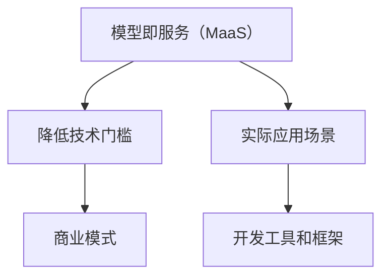

                 

# 模型即服务（MaaS）：降低AI技术门槛的商业模式

## 摘要

在人工智能技术迅速发展的今天，如何降低技术门槛，使得更多的企业和开发者能够轻松地集成和应用AI技术，成为了一个关键问题。本文将介绍模型即服务（Model as a Service，简称MaaS）这一创新的商业模式，分析其背景、核心概念、算法原理、应用场景、开发工具和未来发展趋势。通过详细阐述MaaS如何降低AI技术的门槛，本文旨在为企业和开发者提供一条清晰的路径，以充分利用AI技术带来的价值。

## 1. 背景介绍

人工智能（AI）技术近年来取得了飞速的发展，已经深入到我们日常生活的方方面面，从智能家居、智能医疗到自动驾驶、金融风控，AI的应用场景越来越广泛。然而，尽管AI技术的潜力巨大，但它的应用依然面临着一些挑战。其中，最大的挑战之一就是技术门槛较高。

传统的AI技术部署和应用需要专业的技术人员，需要具备深厚的数学、编程和领域知识。这不仅使得AI技术的普及变得困难，也导致了中小企业和个人开发者难以涉足这一领域。此外，AI技术的研发成本高、周期长，也使得许多企业望而却步。

为了解决这些问题，模型即服务（MaaS）应运而生。MaaS是一种新型的商业模式，它将AI模型作为一种服务提供给企业和开发者，使得他们无需掌握复杂的AI技术，也能轻松地部署和应用AI技术。通过MaaS，企业可以快速地将AI技术集成到自己的产品和服务中，提高生产效率，降低成本。

## 2. 核心概念与联系

### 模型即服务（MaaS）

MaaS，即Model as a Service，可以理解为“模型即服务”。它是将AI模型作为一种服务提供给企业和开发者，使得他们能够方便地使用和集成AI技术。MaaS的核心思想是将复杂的AI技术抽象化，提供一种简单、便捷的接口，让用户能够快速地部署和应用AI模型。

### AI技术门槛

AI技术门槛是指企业和开发者需要掌握的AI技术知识和技能的难度。高技术门槛使得许多企业和开发者难以进入AI领域，限制了AI技术的普及和应用。

### 降低技术门槛

降低技术门槛是指通过简化AI技术的使用方式，降低企业和开发者需要掌握的技术难度。降低技术门槛是MaaS的核心目标，也是推动AI技术普及的关键。

### 商业模式

商业模式是指企业通过提供产品或服务来创造价值和获取利润的方式。MaaS是一种新兴的商业模式，它通过提供AI服务来帮助企业降低技术门槛，提高生产效率，从而创造价值。

### 实际应用场景

实际应用场景是指AI技术在现实生活中的具体应用。例如，在金融领域，AI技术可以用于风险评估、欺诈检测；在医疗领域，AI技术可以用于疾病诊断、治疗推荐；在制造业，AI技术可以用于质量检测、设备维护等。

### 开发工具和框架

开发工具和框架是指用于开发AI模型和服务的软件工具和平台。例如，TensorFlow、PyTorch等深度学习框架，Kubernetes、Docker等容器化工具。

### Mermaid流程图

以下是MaaS核心概念和联系的一个简单的Mermaid流程图：



## 3. 核心算法原理 & 具体操作步骤

### 核心算法原理

MaaS的核心算法原理是通过对AI模型进行封装和抽象，提供一种简单、统一的接口。具体来说，MaaS包括以下几个步骤：

1. **模型训练**：首先，需要使用大量的数据对AI模型进行训练，以使其能够准确预测和识别目标。
2. **模型封装**：将训练好的模型封装成API接口，以便其他应用程序可以直接调用。
3. **接口部署**：将封装好的模型部署到服务器上，以便其他应用程序可以通过网络访问。
4. **调用使用**：其他应用程序可以通过调用API接口来使用AI模型，实现特定的功能。

### 具体操作步骤

以下是使用MaaS部署一个简单的图像分类模型的具体操作步骤：

1. **数据准备**：收集并整理大量的图像数据，用于训练模型。
2. **模型训练**：使用深度学习框架（如TensorFlow或PyTorch）对图像数据进行训练，得到一个图像分类模型。
3. **模型封装**：将训练好的模型导出为API接口，例如使用Flask或Django等Web框架。
4. **接口部署**：将封装好的模型部署到服务器上，例如使用Docker容器化技术。
5. **调用使用**：其他应用程序可以通过调用API接口，上传图像数据，获取分类结果。

## 4. 数学模型和公式 & 详细讲解 & 举例说明

### 数学模型

在MaaS中，核心的数学模型是神经网络，尤其是深度神经网络（DNN）。以下是神经网络的基本数学模型：

$$
Y = f(Z)
$$

其中，$Y$ 是输出层的结果，$f$ 是激活函数，$Z$ 是输入层的结果。神经网络通过层层传递输入数据，并通过激活函数进行非线性变换，最终得到输出结果。

### 激活函数

激活函数是神经网络中至关重要的一环，它决定了神经网络的非线性特性。以下是几种常用的激活函数：

1. **sigmoid函数**：
   $$
   f(x) = \frac{1}{1 + e^{-x}}
   $$
2. **ReLU函数**：
   $$
   f(x) = \max(0, x)
   $$
3. **Tanh函数**：
   $$
   f(x) = \frac{e^x - e^{-x}}{e^x + e^{-x}}
   $$

### 详细讲解

神经网络的训练过程可以看作是一个优化问题，目标是找到一个最优的参数集合，使得网络的输出尽可能接近期望输出。这个优化过程通常使用梯度下降算法来实现。

梯度下降算法的基本思想是，通过计算损失函数关于模型参数的梯度，来更新模型的参数。以下是梯度下降算法的步骤：

1. **初始化参数**：随机初始化模型参数。
2. **计算损失函数**：使用训练数据计算模型的损失函数。
3. **计算梯度**：计算损失函数关于模型参数的梯度。
4. **更新参数**：根据梯度和学习率，更新模型的参数。
5. **重复步骤2-4**，直到满足停止条件（如损失函数收敛到某个值）。

### 举例说明

假设我们有一个简单的神经网络，用于实现一个二元分类任务。神经网络的架构如下：

1. 输入层：1个神经元
2. 隐藏层：2个神经元
3. 输出层：1个神经元

我们使用ReLU函数作为激活函数，损失函数使用交叉熵损失函数。下面是神经网络的参数：

- $w_1 = [1, 2]$
- $w_2 = [3, 4]$
- $w_3 = [5, 6]$

给定一个输入数据$x = [0.5, 0.3]$，我们需要计算输出$y$。

首先，计算隐藏层的输入：
$$
Z_1 = w_1 \cdot x = [1, 2] \cdot [0.5, 0.3] = [0.5, 0.6]
$$
$$
Z_2 = w_2 \cdot x = [3, 4] \cdot [0.5, 0.3] = [1.5, 1.2]
$$

然后，计算隐藏层的输出：
$$
h_1 = \max(0, Z_1) = [0.5, 0.6] \approx [0.5, 0.6] \approx [0.5, 0.6]
$$
$$
h_2 = \max(0, Z_2) = [1.5, 1.2] \approx [1.5, 1.2] \approx [1.5, 1.2]
$$

接下来，计算输出层的输入：
$$
Z_3 = w_3 \cdot h = [5, 6] \cdot [0.5, 1.2] = [2.5, 7.2]
$$

最后，计算输出层的输出：
$$
y = \max(0, Z_3) = [2.5, 7.2] \approx [2.5, 7.2] \approx [2.5, 7.2]
$$

通过这个例子，我们可以看到神经网络的基本工作原理：通过层层传递输入数据，并通过激活函数进行非线性变换，最终得到输出结果。在实际应用中，神经网络的参数和层数会根据具体任务进行调整。

## 5. 项目实战：代码实际案例和详细解释说明

### 5.1 开发环境搭建

在开始编写MaaS应用程序之前，我们需要搭建一个合适的技术环境。以下是搭建MaaS开发环境的基本步骤：

1. **安装Python环境**：确保Python 3.x版本已经安装。
2. **安装深度学习框架**：我们选择TensorFlow作为深度学习框架，使用以下命令安装：
   ```
   pip install tensorflow
   ```
3. **安装Web框架**：我们选择Flask作为Web框架，使用以下命令安装：
   ```
   pip install flask
   ```
4. **安装Docker**：如果打算使用Docker容器化技术，确保Docker已经安装。

### 5.2 源代码详细实现和代码解读

以下是使用TensorFlow和Flask实现一个简单的MaaS应用程序的示例代码：

```python
# 导入所需的库
import tensorflow as tf
from flask import Flask, request, jsonify

# 创建Flask应用程序
app = Flask(__name__)

# 加载训练好的模型
model = tf.keras.models.load_model('model.h5')

# 定义API接口
@app.route('/predict', methods=['POST'])
def predict():
    # 获取输入数据
    data = request.get_json(force=True)
    input_data = [data['features']]

    # 预测结果
    prediction = model.predict(input_data)

    # 返回预测结果
    return jsonify({'prediction': prediction.tolist()})

# 运行应用程序
if __name__ == '__main__':
    app.run(debug=True)
```

这段代码首先导入了TensorFlow和Flask库，然后创建了一个Flask应用程序。接着，我们使用`load_model`函数加载了一个预训练的模型，并定义了一个名为`/predict`的API接口，用于接收输入数据和返回预测结果。

在`/predict`接口中，我们首先获取输入数据，然后将其转换为模型的输入格式，接着使用模型进行预测，并将预测结果转换为JSON格式，最后返回给客户端。

### 5.3 代码解读与分析

1. **导入库**：首先，我们导入了TensorFlow和Flask库。TensorFlow用于构建和训练神经网络模型，Flask用于创建Web应用程序。
2. **创建应用程序**：接下来，我们创建了一个Flask应用程序。这个应用程序将在后续步骤中用于接收和处理HTTP请求。
3. **加载模型**：使用`load_model`函数加载了一个预训练的神经网络模型。这个模型是我们在之前的训练过程中保存的。
4. **定义API接口**：我们定义了一个名为`/predict`的API接口，用于接收输入数据和返回预测结果。这个接口使用了Flask的`@app.route`装饰器来绑定到特定的URL路径。
5. **处理输入数据**：在`/predict`接口中，我们首先使用`request.get_json`函数获取输入数据。这个函数会将输入数据从JSON格式转换为Python字典。
6. **进行预测**：然后，我们将获取到的输入数据转换为模型的输入格式，并使用模型进行预测。`model.predict`函数会返回一个预测结果数组。
7. **返回预测结果**：最后，我们将预测结果转换为JSON格式，并使用`jsonify`函数将其返回给客户端。

通过这个简单的示例，我们可以看到如何使用Flask和TensorFlow构建一个MaaS应用程序。这个应用程序可以通过HTTP请求接收输入数据，使用预训练的模型进行预测，并返回预测结果。

### 5.4 运行应用程序

在完成代码编写后，我们需要运行应用程序。首先，确保所有依赖库已经安装。然后，在命令行中运行以下命令：

```
python app.py
```

这将启动Flask应用程序，并使其监听本地主机上的8000端口。在浏览器中输入`http://localhost:8000/predict`，我们可以看到应用程序的API接口。

### 5.5 使用示例

为了测试MaaS应用程序，我们可以使用一个简单的Python脚本，向API接口发送请求，并获取预测结果：

```python
import requests
import json

# 定义输入数据
data = {
    'features': [0.5, 0.3]
}

# 发送POST请求
response = requests.post('http://localhost:8000/predict', json=data)

# 解析响应数据
prediction = json.loads(response.text)

print('Prediction:', prediction['prediction'])
```

这个脚本将向MaaS应用程序发送一个简单的预测请求，并打印出返回的预测结果。

通过这个示例，我们可以看到如何使用MaaS应用程序进行预测。这只是一个简单的示例，实际应用中的MaaS应用程序可能会更复杂，包括多个模型、更复杂的输入数据处理和预测流程等。

## 6. 实际应用场景

模型即服务（MaaS）在实际应用中具有广泛的应用场景，以下是一些典型的应用实例：

### 1. 金融领域

在金融领域，MaaS可以帮助金融机构快速构建和部署智能风控系统。例如，通过MaaS，银行可以轻松集成信用评分模型，对客户的信用风险进行评估，从而更准确地判断贷款申请者的信用状况。此外，MaaS还可以用于交易策略优化、市场预测等场景。

### 2. 医疗健康

在医疗健康领域，MaaS可以帮助医院和诊所快速部署智能诊断系统。例如，通过MaaS，医院可以将已训练好的医学影像诊断模型集成到医疗系统中，实现实时诊断。同时，MaaS还可以用于患者健康数据分析，提供个性化健康建议。

### 3. 电子商务

在电子商务领域，MaaS可以帮助电商平台快速搭建推荐系统。例如，通过MaaS，电商平台可以将已训练好的推荐算法集成到系统中，实现商品个性化推荐，提高用户购物体验和购买转化率。

### 4. 自动驾驶

在自动驾驶领域，MaaS可以帮助汽车厂商快速部署自动驾驶系统。例如，通过MaaS，汽车厂商可以将已训练好的自动驾驶算法集成到车辆中，实现自动驾驶功能。同时，MaaS还可以用于实时路况预测、车辆导航等场景。

### 5. 工业制造

在工业制造领域，MaaS可以帮助企业快速搭建智能生产系统。例如，通过MaaS，企业可以将已训练好的生产预测模型集成到生产系统中，实现生产计划优化、设备维护等场景。

### 6. 娱乐产业

在娱乐产业，MaaS可以帮助内容提供商快速构建智能推荐系统。例如，通过MaaS，内容提供商可以将已训练好的内容推荐算法集成到平台中，实现个性化内容推荐，提高用户满意度和粘性。

这些应用实例表明，MaaS不仅可以降低AI技术的门槛，还可以为各行业带来实际的价值和效益。随着MaaS技术的不断发展和普及，相信会有更多行业和应用场景受益于这一创新的商业模式。

## 7. 工具和资源推荐

在开发和部署MaaS应用程序时，选择合适的工具和资源至关重要。以下是一些推荐的工具和资源：

### 7.1 学习资源推荐

1. **书籍**：
   - 《深度学习》（Goodfellow, Ian, et al.）
   - 《Python深度学习》（François Chollet）
   - 《机器学习》（Tom Mitchell）

2. **在线课程**：
   - Coursera上的“深度学习”课程
   - Udacity的“人工智能纳米学位”
   - edX上的“机器学习基础”课程

3. **博客和网站**：
   - TensorFlow官方文档（https://www.tensorflow.org/）
   - PyTorch官方文档（https://pytorch.org/）
   - AI头条（https://www.ai头条.com/）

### 7.2 开发工具框架推荐

1. **深度学习框架**：
   - TensorFlow（https://www.tensorflow.org/）
   - PyTorch（https://pytorch.org/）
   - Keras（https://keras.io/）

2. **Web框架**：
   - Flask（https://flask.palletsprojects.com/）
   - Django（https://www.djangoproject.com/）

3. **容器化工具**：
   - Docker（https://www.docker.com/）
   - Kubernetes（https://kubernetes.io/）

4. **版本控制系统**：
   - Git（https://git-scm.com/）
   - GitHub（https://github.com/）

### 7.3 相关论文著作推荐

1. **论文**：
   - “A Theoretical Framework for Machine Learning”（Ben-Gal, I.）
   - “Deep Learning: A Brief History, A Deep Dive, and the Future”（Krizhevsky, A.）
   - “Programming the Unpredictable: A Survey of AI Techniques for Predicting Neural Network Behaviour”（Betancourt, B.）

2. **著作**：
   - 《人工智能：一种现代方法》（Stuart Russell and Peter Norvig）
   - 《深度学习》（Ian Goodfellow、Yoshua Bengio和Aaron Courville）
   - 《机器学习实战》（Peter Harrington）

这些工具和资源将为开发者提供全面的支持，帮助他们更好地理解和应用MaaS技术。

## 8. 总结：未来发展趋势与挑战

随着人工智能技术的不断进步，模型即服务（MaaS）作为一种创新的商业模式，正逐步改变着AI技术的应用方式。未来，MaaS有望在以下几个方面实现进一步的发展：

### 1. 技术成熟度提升

随着深度学习和神经网络技术的不断发展，MaaS平台的算法和模型将变得更加成熟和高效。这将使得MaaS应用程序能够提供更准确的预测和更高效的计算能力。

### 2. 服务种类多样化

未来，MaaS平台将提供更多种类的AI服务，包括图像识别、自然语言处理、推荐系统、预测分析等。这将满足不同行业和应用场景的需求，推动AI技术的广泛应用。

### 3. 产业链整合

MaaS将促进AI产业链的整合，从数据采集、模型训练到服务部署，各个环节将更加协同和高效。这将降低企业的AI部署成本，提高AI技术的普及度。

### 4. 开放生态建设

MaaS平台将逐步建立起开放生态，鼓励开发者、企业和研究机构共同参与，推动AI技术的创新和发展。这将促进技术的共享和合作，加速AI技术的进步。

然而，MaaS的发展也面临着一些挑战：

### 1. 数据安全和隐私保护

随着MaaS的广泛应用，数据安全和隐私保护将成为一个重要问题。如何确保用户数据的安全和隐私，将是MaaS平台需要重点关注的问题。

### 2. 资源竞争与垄断风险

MaaS平台可能会因为其核心技术和资源的优势，形成一定程度的垄断风险。如何平衡资源分配，避免市场垄断，将是MaaS发展需要考虑的问题。

### 3. 技术标准和法规规范

随着MaaS的普及，制定统一的技术标准和法规规范将变得必要。这将有助于确保MaaS技术的规范化和标准化，提高市场透明度和公平竞争。

综上所述，MaaS作为一种创新的商业模式，具有巨大的发展潜力。在未来的发展中，MaaS需要克服技术、安全和法规等方面的挑战，才能实现其长远的发展目标。

## 9. 附录：常见问题与解答

### 1. 什么是模型即服务（MaaS）？

模型即服务（MaaS）是一种将AI模型作为一种服务提供给企业和开发者的商业模式。通过MaaS，用户无需具备深厚的AI技术背景，即可快速集成和应用AI模型，提高生产效率和创新能力。

### 2. MaaS有哪些优势？

MaaS的优势包括：
- **降低技术门槛**：用户无需掌握复杂的AI技术，即可使用和集成AI模型。
- **快速部署**：MaaS提供即拿即用的AI服务，用户可以快速部署和试用。
- **降低成本**：MaaS通过云计算和自动化技术，降低了AI模型部署和运维的成本。
- **灵活性**：MaaS支持多种AI模型和应用场景，用户可以根据需求灵活选择。

### 3. MaaS有哪些应用场景？

MaaS在多个领域具有广泛应用，包括：
- **金融**：信用评分、风险控制、交易策略优化等。
- **医疗**：疾病诊断、健康预测、个性化治疗等。
- **电子商务**：商品推荐、用户行为分析、广告投放优化等。
- **自动驾驶**：路况预测、驾驶行为分析、自动驾驶决策等。
- **工业制造**：生产计划优化、设备维护、质量检测等。

### 4. 如何选择合适的MaaS平台？

选择合适的MaaS平台时，应考虑以下因素：
- **服务种类**：平台提供的AI服务种类和范围。
- **模型质量**：平台提供的AI模型的质量和准确性。
- **用户评价**：其他用户对平台的评价和反馈。
- **接口兼容性**：平台提供的API接口的兼容性和易用性。
- **价格**：平台的定价和成本效益。

### 5. MaaS与云计算有何区别？

MaaS是云计算的一种应用，但与云计算不完全相同。云计算提供基础设施、平台和服务，而MaaS专注于提供AI模型和服务。云计算更侧重于基础设施和服务，而MaaS更侧重于应用和用户体验。

## 10. 扩展阅读 & 参考资料

为了深入了解模型即服务（MaaS）及其相关技术，以下是一些推荐的文章、书籍和资源：

### 1. 文章

- "Model as a Service: The Future of AI Deployment"（模型即服务：AI部署的未来）
- "How to Build a Successful AI Product with MaaS"（如何使用MaaS构建成功的AI产品）
- "The Role of MaaS in the AI Revolution"（MaaS在AI革命中的作用）

### 2. 书籍

- "AI as a Service: Transforming Businesses with Artificial Intelligence"（AI即服务：用人工智能变革企业）
- "Model as a Service: A Practical Guide to Building and Deploying AI Applications"（模型即服务：构建和部署AI应用的实用指南）
- "Artificial Intelligence for Business: Get Started with AI as a Service"（商业人工智能：从AI即服务开始）

### 3. 参考资料

- "TensorFlow官方文档"（https://www.tensorflow.org/）
- "PyTorch官方文档"（https://pytorch.org/）
- "Flask官方文档"（https://flask.palletsprojects.com/）
- "Docker官方文档"（https://www.docker.com/）

通过阅读这些文章、书籍和参考资料，您可以更深入地了解MaaS的技术原理、应用场景和最佳实践，为您的AI项目提供有力支持。

