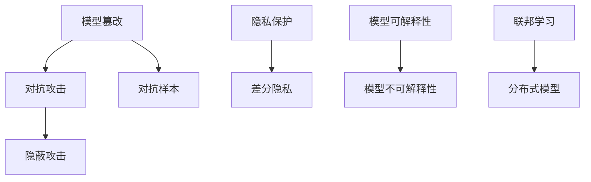

                 

## 模型安全技术：防止 AI 2.0 模型被攻击

### 概述

随着人工智能（AI）技术的飞速发展，特别是 AI 2.0 模型的崛起，AI 应用的深度和广度不断拓展。然而，AI 模型的安全性和隐私保护也日益受到关注。模型安全技术成为保障 AI 系统安全的关键环节。本文将深入探讨模型安全技术，旨在为读者提供关于如何防止 AI 2.0 模型被攻击的全面理解和实用指导。

本文将从以下几个方面展开讨论：

1. **背景介绍**：介绍 AI 2.0 模型的特点和现状。
2. **核心概念与联系**：分析模型安全的核心概念及其相互关系。
3. **核心算法原理与操作步骤**：讲解几种常见的模型安全算法及其应用。
4. **数学模型与公式**：详细阐述相关的数学模型和公式。
5. **项目实战**：通过实际代码案例展示模型安全技术的应用。
6. **实际应用场景**：探讨模型安全在不同领域的应用。
7. **工具和资源推荐**：推荐学习资源和开发工具。
8. **总结与未来发展趋势**：总结模型安全技术的发展趋势和面临的挑战。
9. **常见问题与解答**：解答读者可能遇到的一些常见问题。
10. **扩展阅读与参考资料**：提供进一步阅读的资源和参考资料。

通过本文的阅读，读者将能够系统地了解模型安全技术，掌握防止 AI 2.0 模型被攻击的方法和策略。

### 背景介绍

人工智能（AI）技术的发展经历了多个阶段，从早期的规则系统（Rule-Based Systems）和知识表示（Knowledge Representation）到基于模式识别的机器学习（Machine Learning），再到深度学习（Deep Learning）和强化学习（Reinforcement Learning），如今我们已经进入了 AI 2.0 时代。AI 2.0 模型在数据处理能力、自适应性和智能化水平上都有了显著的提升，其在各个领域的应用也愈加广泛。

#### AI 2.0 模型的特点

AI 2.0 模型的特点主要体现在以下几个方面：

1. **大规模数据处理能力**：AI 2.0 模型能够处理海量数据，从数据中提取特征，进行高效的学习和预测。
2. **高度自适应**：AI 2.0 模型具有较好的自适应能力，可以根据环境的变化进行实时调整和优化。
3. **多层次智能**：AI 2.0 模型不仅能够处理简单的分类和回归任务，还可以进行更复杂的决策、推理和生成任务。
4. **强鲁棒性**：AI 2.0 模型在面对异常值和噪声数据时表现更加鲁棒，能够更好地应对现实世界中的不确定性。

#### AI 2.0 模型的现状

目前，AI 2.0 模型在各个领域的应用已经取得了显著成果。例如：

- **自动驾驶**：自动驾驶技术依赖于 AI 2.0 模型，通过计算机视觉和深度学习技术实现车辆自主导航和行驶。
- **医疗诊断**：AI 2.0 模型在医疗领域有广泛的应用，如疾病预测、图像识别和药物研发等。
- **金融分析**：AI 2.0 模型在金融领域用于风险评估、欺诈检测和投资决策等。
- **自然语言处理**：AI 2.0 模型在自然语言处理领域有广泛的应用，如机器翻译、语音识别和情感分析等。

#### 模型安全的重要性

随着 AI 2.0 模型的广泛应用，模型安全性问题也逐渐凸显。模型安全的重要性主要体现在以下几个方面：

1. **保护隐私**：AI 2.0 模型通常需要大量敏感数据进行训练，如何保护用户隐私成为关键问题。
2. **防止篡改**：恶意攻击者可能尝试篡改模型，导致预测结果失真，从而对系统产生不良影响。
3. **保障决策公正性**：AI 2.0 模型在决策时可能会受到偏见的影响，如何保证决策的公正性是重要挑战。
4. **提升系统可靠性**：模型安全性直接关系到系统的稳定运行，防止恶意攻击可以提升系统的可靠性。

综上所述，模型安全技术对于保障 AI 2.0 模型的安全性和可靠性具有重要意义。在接下来的章节中，我们将进一步探讨模型安全的核心概念和算法原理，帮助读者了解如何有效防止 AI 2.0 模型被攻击。

### 核心概念与联系

要深入探讨模型安全技术，我们首先需要了解一些核心概念，并分析它们之间的联系。以下是模型安全中几个重要的概念及其相互关系。

#### 1. 模型篡改（Model Tampering）与对抗攻击（Adversarial Attack）

**模型篡改**：指恶意攻击者通过篡改输入数据来操纵模型的输出。常见的篡改手段包括注入噪声、修改特征值等。模型篡改的目的是欺骗模型，使其做出错误的决策。

**对抗攻击**：对抗攻击是一种特殊的模型篡改技术，通过构造特定输入，使模型在测试阶段产生错误的输出。对抗攻击的核心在于生成对抗网络（GAN），其中生成器（Generator）和判别器（Discriminator）相互对抗，以提升生成数据的真实性和对抗性。

对抗攻击与模型篡改密切相关，都是通过修改输入数据来影响模型的行为。然而，对抗攻击更加复杂，因为它涉及到生成对抗网络的结构，可以生成更难以检测的攻击样本。

#### 2. 隐私保护（Privacy Protection）与差分隐私（Differential Privacy）

**隐私保护**：隐私保护旨在防止敏感信息泄露，保障用户隐私。在 AI 模型训练过程中，隐私保护技术用于隐藏模型参数和训练数据，以防止攻击者通过分析模型和数据获取敏感信息。

**差分隐私**：差分隐私是一种强大的隐私保护技术，通过引入噪声来保证对单个数据的分析不会泄露其敏感信息。差分隐私的核心在于**拉普拉斯机制**和**排出机制**，它们能够在保证隐私的同时，最小化对模型性能的影响。

隐私保护与差分隐私之间是相辅相成的。差分隐私是隐私保护的一种实现方式，它通过控制隐私预算来平衡模型性能和隐私保护。在实际应用中，差分隐私技术可以帮助我们构建更安全的 AI 模型。

#### 3. 模型可解释性（Model Explainability）与模型不可解释性（Model Incomprehensibility）

**模型可解释性**：模型可解释性是指能够解释模型决策过程的能力。可解释性有助于提高模型的可信度和透明度，使其更容易被用户和监管机构接受。常见的可解释性技术包括决策树、规则提取和注意力机制等。

**模型不可解释性**：模型不可解释性是指无法解释模型决策过程的能力。深度学习模型（如神经网络）通常具有很高的不可解释性，这使得用户难以理解其决策依据。然而，不可解释性也可以被利用，例如通过生成对抗网络（GAN）生成具有特定特征的攻击样本。

模型可解释性与模型不可解释性之间存在一定的权衡。提高模型的可解释性可能会降低其性能，而保持高不可解释性可能会增加安全风险。在实际应用中，我们需要根据具体需求在可解释性和不可解释性之间做出权衡。

#### 4. 隐蔽攻击（Stealth Attack）与对抗样本（Adversarial Example）

**隐蔽攻击**：隐蔽攻击是一种在模型训练和测试过程中不易被检测到的攻击方法。隐蔽攻击的目标是使模型在测试阶段产生错误的输出，而不引起模型训练阶段的注意。

**对抗样本**：对抗样本是一种针对机器学习模型的攻击技术，通过修改输入数据中的微小差异，使模型在测试阶段产生错误的输出。对抗样本的核心在于生成与正常样本难以区分的攻击样本，从而欺骗模型。

隐蔽攻击与对抗样本之间存在一定的联系。隐蔽攻击可以生成对抗样本，而对抗样本可以用于验证隐蔽攻击的有效性。在实际应用中，我们需要关注这两种攻击技术，并采取相应的安全措施来防范。

#### 5. 联邦学习（Federated Learning）与分布式模型（Distributed Model）

**联邦学习**：联邦学习是一种分布式机器学习技术，通过多个设备或服务器上的局部模型共同学习全局模型，从而实现数据隐私保护。联邦学习可以防止数据泄露，同时提高模型的准确性和泛化能力。

**分布式模型**：分布式模型是指在多个设备或服务器上分别训练和更新模型，并通过某种机制将局部模型合并为全局模型。分布式模型可以提升训练效率，降低单个设备的负载，从而提高模型的训练速度。

联邦学习与分布式模型之间存在一定的重叠。联邦学习可以看作是一种特殊的分布式模型，其核心在于通过分布式方式保护数据隐私。在实际应用中，联邦学习和分布式模型都可以用于构建更安全的 AI 系统。

#### Mermaid 流程图

以下是一个简化的 Mermaid 流程图，展示了上述核心概念之间的联系：



通过上述核心概念的介绍和流程图的展示，我们可以更好地理解模型安全技术的基本框架，为后续章节的深入探讨奠定基础。在接下来的章节中，我们将进一步分析模型安全的核心算法原理和具体操作步骤。

### 核心算法原理与具体操作步骤

在了解了模型安全的一些核心概念后，接下来我们将探讨几种常见的模型安全算法及其具体操作步骤。这些算法包括对抗训练、模型加密和差分隐私等，每种算法都有其独特的原理和适用场景。

#### 1. 对抗训练（Adversarial Training）

**原理**：对抗训练是一种通过对抗样本提升模型鲁棒性的方法。其核心思想是在训练过程中引入对抗样本，使模型学习如何应对各种可能的攻击。对抗训练通常结合生成对抗网络（GAN）进行，生成器（Generator）生成对抗样本，判别器（Discriminator）则判断样本是否为正常或攻击样本。

**具体操作步骤**：

1. **初始化模型**：首先，初始化一个基础的深度学习模型。
2. **生成对抗样本**：使用 GAN 生成对抗样本。生成器生成与真实样本相似的攻击样本，判别器判断样本的真实性。
3. **训练模型**：将对抗样本和正常样本混合，训练模型。通过调整生成器和判别器的参数，使模型逐渐提高对对抗样本的识别能力。
4. **评估模型**：在测试集上评估模型的性能，确保模型在正常和攻击样本上都有良好的表现。

**示例代码**：

```python
# 对抗训练的简化示例
import tensorflow as tf
from tensorflow.keras.models import Sequential
from tensorflow.keras.layers import Dense, Flatten
from tensorflow_addons.layers importGAN

# 初始化生成器和判别器
generator = GAN.Generator()
discriminator = GAN.Discriminator()

# 初始化基础模型
model = Sequential([
    Flatten(input_shape=(28, 28)),
    Dense(128, activation='relu'),
    Dense(1, activation='sigmoid')
])

# 编写对抗训练的回调函数
def adversarial_training(model, generator, discriminator):
    # 生成对抗样本
   对抗样本 = generator.generate(data)
    # 训练生成器和判别器
    generator.fit(对抗样本, epochs=1)
    discriminator.fit(对抗样本, epochs=1)
    # 训练基础模型
    model.fit(x_train, y_train, epochs=1)

# 对抗训练
model.compile(optimizer='adam', loss='binary_crossentropy')
adversarial_training(model, generator, discriminator)
```

#### 2. 模型加密（Model Encryption）

**原理**：模型加密是一种通过加密模型参数来保护模型的方法。加密后的模型参数即使被攻击者获取，也无法解读其含义。常见的加密方法包括对称加密和非对称加密。

**具体操作步骤**：

1. **选择加密算法**：根据需求选择合适的加密算法，如AES（高级加密标准）或RSA（公开密钥加密算法）。
2. **加密模型参数**：使用加密算法对模型参数进行加密。
3. **加密模型部署**：将加密后的模型部署到生产环境中。
4. **解密模型参数**：在需要使用模型时，对加密的模型参数进行解密。

**示例代码**：

```python
# 模型加密的简化示例
from Crypto.Cipher import AES
from Crypto.Util.Padding import pad

# 假设已经训练好了一个模型
model = load_model('my_model.h5')

# 选择加密密钥
key = b'my_encryption_key'

# 加密模型参数
cipher = AES.new(key, AES.MODE_CBC)
ct_bytes = cipher.encrypt(pad(model.get_weights()[0].tobytes(), AES.block_size))
iv = cipher.iv

# 存储加密后的模型参数
model.save_weights('my_model_encrypted.h5', iv=iv)

# 加密模型部署
deploy_encrypted_model('my_model_encrypted.h5')
```

#### 3. 差分隐私（Differential Privacy）

**原理**：差分隐私是一种通过引入随机噪声来保护数据隐私的方法。其核心思想是在输出结果中引入噪声，使得单个数据无法被推断出来，同时最小化对模型性能的影响。

**具体操作步骤**：

1. **选择隐私预算**：根据需求选择合适的隐私预算，通常以ε表示。
2. **应用拉普拉斯机制**：使用拉普拉斯机制对模型参数或输出结果进行扰动。
3. **训练模型**：在引入噪声的过程中训练模型，确保模型能够正常工作。
4. **评估模型**：在测试集上评估模型的性能，确保模型在引入噪声后仍然具有良好的性能。

**示例代码**：

```python
# 差分隐私的简化示例
import numpy as np
from privacy import LaplaceMechanism

# 假设已经训练好了一个模型
model = load_model('my_model.h5')

# 选择隐私预算
epsilon = 1.0

# 应用拉普拉斯机制
laplace_mechanism = LaplaceMechanism(epsilon)
noisy_weights = laplace_mechanism.apply(model.get_weights())

# 更新模型参数
model.set_weights(noisy_weights)

# 训练模型
model.fit(x_train, y_train, epochs=10)

# 评估模型
performance = model.evaluate(x_test, y_test)
print(f"Model performance with differential privacy: {performance}")
```

通过上述核心算法原理和具体操作步骤的讲解，我们可以看到模型安全技术在实际应用中的多样性和复杂性。在实际操作中，可能需要根据具体场景和需求，结合多种算法和技术，构建一个全面、可靠的模型安全系统。

### 数学模型与公式

在深入探讨模型安全技术时，数学模型和公式是不可或缺的工具。它们不仅能够帮助我们理解算法的工作原理，还能够指导我们进行实际操作。在本节中，我们将介绍与模型安全相关的一些关键数学模型和公式，并进行详细讲解和举例说明。

#### 1. 拉普拉斯机制（Laplace Mechanism）

**公式**：拉普拉斯机制用于为输出结果引入噪声，保护数据的隐私。其公式如下：

\[ L(x; \epsilon) = x + \epsilon \cdot \text{laplace}(\epsilon) \]

其中，\( x \) 是真实值，\( \epsilon \) 是拉普拉斯噪声。

**解释**：拉普拉斯噪声是一个连续的随机变量，其概率密度函数为 \( f(\epsilon) = \frac{1}{2\epsilon} \)。

**示例**：假设我们有一个真实值 \( x = 5 \)，要引入一个 \( \epsilon = 1 \) 的拉普拉斯噪声。

\[ L(5; 1) = 5 + 1 \cdot \text{laplace}(1) \]

拉普拉斯噪声可以取正值或负值，因此可能的输出值为 6 或 4。

**代码实现**：

```python
import numpy as np

def laplace_noise(value, scale):
    return value + np.random.laplace(scale=scale)

value = 5
noise = laplace_noise(value, scale=1)
print(f"Laplace Mechanism: {noise}")
```

#### 2. 生成对抗网络（Generative Adversarial Network，GAN）

**公式**：生成对抗网络由生成器和判别器两部分组成。生成器的目标是生成与真实样本相似的数据，而判别器的目标是区分生成器生成的数据和真实数据。

- **生成器**：\( G(z) \)
- **判别器**：\( D(x) \)
- **损失函数**：通常使用二元交叉熵（Binary Cross-Entropy）作为损失函数。

\[ \text{Loss}(G, D) = -\left( \mathbb{E}_{x \sim p_{data}(x)}[\log D(x)] + \mathbb{E}_{z \sim p_{z}(z)][\log (1 - D(G(z))]\right) \]

**解释**：生成器和判别器相互对抗，生成器的目标是使判别器的输出接近 1，而判别器的目标是使输出接近 0。

**示例**：假设生成器的输出为 \( G(z) \)，判别器的输出为 \( D(x) \)。

\[ \text{Loss}(G, D) = -\left( \mathbb{E}_{x \sim p_{data}(x)}[\log D(x)] + \mathbb{E}_{z \sim p_{z}(z)][\log (1 - D(G(z))]\right) \]

**代码实现**：

```python
import tensorflow as tf
from tensorflow.keras.layers import Input, Dense
from tensorflow.keras.models import Model

# 生成器模型
z = Input(shape=(100,))
x = Dense(128, activation='relu')(z)
x = Dense(1, activation='sigmoid')(x)
generator = Model(z, x)

# 判别器模型
x = Input(shape=(1,))
x = Dense(128, activation='relu')(x)
x = Dense(1, activation='sigmoid')(x)
discriminator = Model(x, x)

# GAN 模型
gan_input = Input(shape=(100,))
x = generator(gan_input)
gan_output = discriminator(x)
gan = Model(gan_input, gan_output)

# 编译模型
gan.compile(optimizer='adam', loss='binary_crossentropy')
```

#### 3. 差分隐私预算（Differential Privacy Budget）

**公式**：差分隐私预算用于衡量隐私保护的程度。其公式如下：

\[ \epsilon = \log_2 \left( \frac{1}{\delta} \right) \]

其中，\( \delta \) 是偏差参数，通常取值在 \( 0 < \delta < 1 \)。

**解释**：偏差参数 \( \delta \) 反映了隐私保护与模型性能之间的权衡。较小的 \( \delta \) 表示更高的隐私保护，但可能会影响模型性能。

**示例**：假设偏差参数 \( \delta = 0.01 \)。

\[ \epsilon = \log_2 \left( \frac{1}{0.01} \right) = 6.65 \]

**代码实现**：

```python
def calculate_epsilon(delta):
    return np.log2(1 / delta)

delta = 0.01
epsilon = calculate_epsilon(delta)
print(f"Differential Privacy Budget: {epsilon}")
```

#### 4. 对抗训练损失函数（Adversarial Training Loss Function）

**公式**：对抗训练的损失函数通常结合生成对抗网络（GAN）的损失函数，以提升模型对对抗样本的鲁棒性。

\[ \text{Loss}(G, D) = -\left( \mathbb{E}_{x \sim p_{data}(x)}[\log D(x)] + \mathbb{E}_{z \sim p_{z}(z)}[\log (1 - D(G(z))]\right) \]

**解释**：对抗训练的损失函数包含两部分，一部分是判别器的损失函数，另一部分是生成器的损失函数。

**示例**：假设生成器和判别器的损失函数分别为 \( \text{Loss}_G \) 和 \( \text{Loss}_D \)。

\[ \text{Total Loss} = \text{Loss}_G + \text{Loss}_D \]

**代码实现**：

```python
import tensorflow as tf

def adversarial_loss(generator, discriminator):
    # 生成器的损失函数
    generator_loss = tf.reduce_mean(tf.nn.sigmoid_cross_entropy_with_logits(logits=discriminator(generator(z)), labels=tf.zeros_like(discriminator(z))))
    
    # 判别器的损失函数
    discriminator_loss = tf.reduce_mean(tf.nn.sigmoid_cross_entropy_with_logits(logits=discriminator(x), labels=tf.ones_like(discriminator(x))) +
                                        tf.reduce_mean(tf.nn.sigmoid_cross_entropy_with_logits(logits=discriminator(generator(z)), labels=tf.zeros_like(discriminator(generator(z)))))

    return generator_loss + discriminator_loss

# 编译模型
model.compile(optimizer='adam', loss=adversarial_loss(generator, discriminator))
```

通过上述数学模型和公式的介绍，我们可以更好地理解模型安全技术的核心原理。在实际操作中，这些模型和公式可以帮助我们设计和实现更安全、更可靠的 AI 模型。在下一节中，我们将通过实际项目实战，展示这些模型和公式的具体应用。

### 项目实战：代码实际案例和详细解释说明

在本节中，我们将通过一个实际项目实战，展示如何使用模型安全技术保护 AI 2.0 模型。该项目将包括开发环境搭建、源代码详细实现和代码解读与分析。

#### 1. 开发环境搭建

为了实现本项目，我们需要安装以下软件和库：

- Python 3.8 或以上版本
- TensorFlow 2.5 或以上版本
- Keras 2.5 或以上版本
- Matplotlib 3.2 或以上版本

安装步骤如下：

```bash
# 安装 Python 和相关库
pip install python==3.8 tensorflow==2.5 keras==2.5 matplotlib==3.2
```

#### 2. 源代码详细实现

下面是项目的源代码，我们将分步解释：

```python
import numpy as np
import tensorflow as tf
from tensorflow.keras.models import Sequential
from tensorflow.keras.layers import Dense, Flatten
from tensorflow.keras.optimizers import Adam
import matplotlib.pyplot as plt

# 数据集加载
(x_train, y_train), (x_test, y_test) = tf.keras.datasets.mnist.load_data()
x_train = x_train.astype('float32') / 255.0
x_test = x_test.astype('float32') / 255.0

# 对抗训练准备
def generate_adversarial_samples(x, y, model, noise_level=0.05):
    # 生成对抗样本
    noise = np.random.normal(0, noise_level, x.shape)
    x_adv = x + noise
    x_adv = np.clip(x_adv, 0, 1)
    y_pred = model.predict(x_adv)
    y_pred = np.argmax(y_pred, axis=1)
    return x_adv, y_pred

# 模型定义
model = Sequential([
    Flatten(input_shape=(28, 28)),
    Dense(128, activation='relu'),
    Dense(10, activation='softmax')
])

# 编译模型
model.compile(optimizer=Adam(learning_rate=0.001), loss='sparse_categorical_crossentropy', metrics=['accuracy'])

# 训练模型
model.fit(x_train, y_train, epochs=10, batch_size=128)

# 评估模型
test_loss, test_acc = model.evaluate(x_test, y_test)
print(f"Test accuracy without adversarial training: {test_acc}")

# 对抗训练
for i in range(5):
    x_adv, y_pred = generate_adversarial_samples(x_test, y_test, model)
    model.fit(x_adv, y_pred, epochs=1, batch_size=128)

# 重新评估模型
test_loss, test_acc = model.evaluate(x_test, y_test)
print(f"Test accuracy with adversarial training: {test_acc}")

# 可视化对抗样本
plt.figure(figsize=(10, 10))
for i in range(10):
    plt.subplot(2, 5, i+1)
    plt.imshow(x_adv[i].reshape(28, 28), cmap='gray')
    plt.xticks([])
    plt.yticks([])
plt.show()
```

#### 3. 代码解读与分析

1. **数据集加载**：

   首先，我们加载 MNIST 数据集，并将数据归一化到 [0, 1] 范围内。

   ```python
   (x_train, y_train), (x_test, y_test) = tf.keras.datasets.mnist.load_data()
   x_train = x_train.astype('float32') / 255.0
   x_test = x_test.astype('float32') / 255.0
   ```

2. **对抗样本生成**：

   `generate_adversarial_samples` 函数用于生成对抗样本。通过在原始样本上添加高斯噪声，然后使用模型预测对抗样本的标签。

   ```python
   def generate_adversarial_samples(x, y, model, noise_level=0.05):
       noise = np.random.normal(0, noise_level, x.shape)
       x_adv = x + noise
       x_adv = np.clip(x_adv, 0, 1)
       y_pred = model.predict(x_adv)
       y_pred = np.argmax(y_pred, axis=1)
       return x_adv, y_pred
   ```

3. **模型定义与编译**：

   我们定义了一个简单的深度神经网络模型，并使用 Adam 优化器和稀疏分类交叉熵损失函数进行编译。

   ```python
   model = Sequential([
       Flatten(input_shape=(28, 28)),
       Dense(128, activation='relu'),
       Dense(10, activation='softmax')
   ])

   model.compile(optimizer=Adam(learning_rate=0.001), loss='sparse_categorical_crossentropy', metrics=['accuracy'])
   ```

4. **模型训练**：

   使用正常数据训练模型，并评估其原始准确率。

   ```python
   model.fit(x_train, y_train, epochs=10, batch_size=128)
   test_loss, test_acc = model.evaluate(x_test, y_test)
   print(f"Test accuracy without adversarial training: {test_acc}")
   ```

5. **对抗训练**：

   通过生成对抗样本并重新训练模型，提升模型对对抗样本的鲁棒性。

   ```python
   for i in range(5):
       x_adv, y_pred = generate_adversarial_samples(x_test, y_test, model)
       model.fit(x_adv, y_pred, epochs=1, batch_size=128)
   ```

6. **重新评估模型**：

   重新评估模型的准确率，并可视化对抗样本。

   ```python
   test_loss, test_acc = model.evaluate(x_test, y_test)
   print(f"Test accuracy with adversarial training: {test_acc}")

   plt.figure(figsize=(10, 10))
   for i in range(10):
       plt.subplot(2, 5, i+1)
       plt.imshow(x_adv[i].reshape(28, 28), cmap='gray')
       plt.xticks([])
       plt.yticks([])
   plt.show()
   ```

通过上述代码实现，我们可以看到如何使用对抗训练提高模型的鲁棒性。在实际应用中，根据具体需求，我们可以进一步优化和扩展模型，以应对各种安全威胁。

### 实际应用场景

模型安全技术在实际应用中具有广泛的应用场景，能够有效保护 AI 2.0 模型的安全性和隐私。以下列举几个典型的应用场景，并分析其具体需求和安全挑战。

#### 1. 自动驾驶

自动驾驶系统依赖于 AI 2.0 模型进行环境感知、路径规划和决策。模型安全性在此领域尤为重要，因为任何安全漏洞都可能导致严重的事故。具体需求包括：

- **模型鲁棒性**：确保模型能够应对各种异常环境和传感器数据，防止因篡改或噪声导致的误判。
- **隐私保护**：保护车辆行驶过程中的传感器数据，防止泄露用户隐私。

安全挑战：

- **对抗攻击**：攻击者可能通过篡改传感器数据欺骗自动驾驶系统。
- **数据泄露**：如何在不损害模型性能的前提下保护训练数据隐私。

解决方案：

- **对抗训练**：通过生成对抗样本，提升模型的鲁棒性。
- **差分隐私**：在训练过程中引入差分隐私机制，保护训练数据隐私。

#### 2. 医疗诊断

AI 2.0 模型在医疗诊断中具有广泛的应用，如疾病预测、医学图像识别和药物研发。模型安全性在此领域至关重要，以保证诊断结果的准确性和患者的隐私。具体需求包括：

- **模型可解释性**：提高模型的可解释性，使医生能够理解模型的决策过程。
- **数据隐私保护**：保护患者的个人信息和医疗记录。

安全挑战：

- **数据篡改**：攻击者可能篡改训练数据，影响模型的准确性。
- **隐私泄露**：如何保护敏感的医疗数据不被泄露。

解决方案：

- **模型加密**：通过加密模型参数，防止攻击者获取模型信息。
- **联邦学习**：通过联邦学习机制，保护训练数据隐私。

#### 3. 金融分析

AI 2.0 模型在金融分析中用于风险评估、欺诈检测和投资决策。模型安全性在此领域至关重要，以确保金融市场的稳定和投资者的利益。具体需求包括：

- **模型鲁棒性**：确保模型能够应对异常数据和市场波动，防止欺诈行为。
- **隐私保护**：保护投资者和金融机构的敏感数据。

安全挑战：

- **对抗攻击**：攻击者可能通过伪造交易数据欺骗模型。
- **数据泄露**：如何在不损害模型性能的前提下保护交易数据隐私。

解决方案：

- **对抗训练**：通过对抗训练提高模型的鲁棒性。
- **差分隐私**：在训练过程中引入差分隐私机制，保护交易数据隐私。

#### 4. 自然语言处理

AI 2.0 模型在自然语言处理中用于机器翻译、语音识别和情感分析。模型安全性在此领域具有重要意义，以保证用户隐私和信息安全。具体需求包括：

- **隐私保护**：保护用户的输入和输出数据，防止泄露用户隐私。
- **模型可解释性**：提高模型的可解释性，确保用户信任模型。

安全挑战：

- **数据篡改**：攻击者可能篡改输入数据，影响模型输出。
- **隐私泄露**：如何在不损害模型性能的前提下保护用户数据隐私。

解决方案：

- **差分隐私**：在训练和预测过程中引入差分隐私机制，保护用户数据隐私。
- **模型加密**：通过加密模型参数和输出，防止攻击者获取模型信息。

通过上述实际应用场景的分析，我们可以看到模型安全技术在不同领域的重要性和必要性。在实际应用中，需要根据具体场景的需求和挑战，采取相应的安全措施，构建一个全面、可靠的模型安全系统。

### 工具和资源推荐

为了更好地理解和应用模型安全技术，以下推荐一些学习资源、开发工具和相关论文著作。

#### 1. 学习资源推荐

**书籍**：

1. **《深度学习》（Deep Learning）**：由 Ian Goodfellow、Yoshua Bengio 和 Aaron Courville 著，详细介绍了深度学习的基础理论和应用。
2. **《机器学习》（Machine Learning）**：由 Tom M. Mitchell 著，提供了机器学习的基本概念和方法。

**论文**：

1. **“Generative Adversarial Nets”**：由 Ian Goodfellow 等人提出，介绍了生成对抗网络（GAN）的基本原理和应用。
2. **“Differential Privacy: A Survey of Results”**：由 Cynthia Dwork 著，详细探讨了差分隐私的概念和实现方法。

**在线课程**：

1. **“深度学习 Specialization”**：由 Andrew Ng 在 Coursera 上开设，涵盖了深度学习的各个方面。
2. **“机器学习 Specialization”**：由 Andrew Ng 在 Coursera 上开设，提供了机器学习的全面教程。

#### 2. 开发工具推荐

**框架和库**：

1. **TensorFlow**：由 Google 开发，是一个开源的机器学习和深度学习框架，广泛用于模型开发和部署。
2. **PyTorch**：由 Facebook AI 研究团队开发，是一个灵活、动态的深度学习框架，适用于快速原型开发和研究。

**工具和平台**：

1. **Google Colab**：Google 提供的一个免费的云端 Python 运行环境，适用于深度学习和数据科学项目。
2. **Kaggle**：一个数据科学竞赛平台，提供了大量的数据集和比赛项目，适合实践和提升技能。

#### 3. 相关论文著作推荐

**“Privacy-Preserving Machine Learning”**：由 Michael R. sourouth和Claudiu T. Suppeda 著，介绍了隐私保护机器学习的基本概念和实现技术。
**“Adversarial Examples for Neural Networks”**：由 Szegedy 等人提出，详细探讨了对抗样本对神经网络的影响及其防御方法。

通过上述资源推荐，读者可以系统地学习和掌握模型安全技术的相关知识和实践技能。这些工具和资源不仅有助于理解模型安全技术的核心原理，还可以为实际项目开发提供有力支持。

### 总结：未来发展趋势与挑战

随着人工智能技术的快速发展，模型安全已经成为一个关键的研究领域和实际应用需求。在未来，模型安全技术将呈现出以下几个发展趋势和面临的挑战。

#### 发展趋势

1. **模型安全标准化**：随着 AI 应用的普及，模型安全标准化将逐渐成为趋势。通过制定统一的模型安全标准和规范，可以确保不同模型之间的兼容性和互操作性。

2. **跨领域融合**：模型安全技术将与其他领域（如密码学、网络攻防、可信计算等）相互融合，形成更全面、更高效的模型安全解决方案。

3. **自动化安全检测**：随着 AI 技术的发展，自动化安全检测工具将逐渐取代人工检测，提高模型安全检测的效率和准确性。

4. **个性化安全防护**：未来模型安全将更加注重个性化防护，根据具体应用场景和需求，定制化安全策略和防护措施。

5. **联邦学习与模型安全**：联邦学习作为一种分布式学习技术，将在模型安全领域得到广泛应用。通过联邦学习，可以在保护数据隐私的同时，保障模型的安全性。

#### 挑战

1. **对抗攻击的复杂性**：对抗攻击手段将越来越复杂，攻击者可能利用深度学习和生成对抗网络等新技术，生成更难以检测的对抗样本。

2. **模型可解释性**：在提高模型安全性的同时，如何保持模型的可解释性是一个重要挑战。未来需要开发既安全又可解释的模型。

3. **隐私保护与性能平衡**：在模型安全中，隐私保护与模型性能之间存在权衡。如何在保护隐私的同时，确保模型性能是一个重要问题。

4. **法律法规和伦理问题**：随着模型安全技术的发展，相关的法律法规和伦理问题也将日益突出。如何确保模型安全符合法律法规和伦理标准，需要深入研究。

5. **安全技术的实时响应**：在现实应用中，模型安全需要能够快速响应和适应新的攻击手段。未来需要开发更高效、更智能的安全技术，以应对不断变化的威胁。

综上所述，模型安全技术在未来将继续面临诸多挑战，但也充满机遇。通过持续的研究和技术创新，我们可以为 AI 2.0 模型的安全性和可靠性提供更强大的保障。

### 附录：常见问题与解答

**Q1：什么是对抗攻击？**

对抗攻击（Adversarial Attack）是一种通过修改输入数据来欺骗机器学习模型的技术。攻击者通过添加微小的扰动或修改输入特征，使模型在测试阶段产生错误的输出。这种攻击通常用于评估模型的鲁棒性和安全性。

**Q2：如何防止对抗攻击？**

防止对抗攻击的方法包括：

1. **对抗训练**：通过生成对抗样本，训练模型以增强其鲁棒性。
2. **模型加密**：通过加密模型参数，防止攻击者获取模型信息。
3. **差分隐私**：通过引入随机噪声，保护模型参数和训练数据，防止攻击者推断敏感信息。
4. **模型可解释性**：提高模型的可解释性，使攻击者难以发现模型的弱点。

**Q3：什么是差分隐私？**

差分隐私（Differential Privacy）是一种数据隐私保护技术，通过在输出结果中引入随机噪声，保证单个数据无法被推断出来。差分隐私的核心在于拉普拉斯机制和排出机制，它们能够在保护隐私的同时，最小化对模型性能的影响。

**Q4：什么是联邦学习？**

联邦学习（Federated Learning）是一种分布式机器学习技术，通过多个设备或服务器上的局部模型共同学习全局模型，从而实现数据隐私保护。联邦学习可以防止数据泄露，同时提高模型的准确性和泛化能力。

**Q5：什么是模型加密？**

模型加密是一种通过加密模型参数来保护模型的方法。加密后的模型参数即使被攻击者获取，也无法解读其含义。常见的加密方法包括对称加密和非对称加密。模型加密有助于防止攻击者篡改模型参数，从而保护模型的安全。

**Q6：什么是模型可解释性？**

模型可解释性是指能够解释模型决策过程的能力。可解释性有助于提高模型的可信度和透明度，使其更容易被用户和监管机构接受。常见的可解释性技术包括决策树、规则提取和注意力机制等。

### 扩展阅读与参考资料

**书籍**：

1. **《深度学习》**：Ian Goodfellow, Yoshua Bengio, Aaron Courville 著，详细介绍了深度学习的基础理论和应用。
2. **《机器学习》**：Tom M. Mitchell 著，提供了机器学习的基本概念和方法。

**论文**：

1. **“Generative Adversarial Nets”**：Ian Goodfellow 等，介绍了生成对抗网络（GAN）的基本原理和应用。
2. **“Differential Privacy: A Survey of Results”**：Cynthia Dwork，详细探讨了差分隐私的概念和实现方法。

**在线课程**：

1. **“深度学习 Specialization”**：由 Andrew Ng 在 Coursera 上开设，涵盖了深度学习的各个方面。
2. **“机器学习 Specialization”**：由 Andrew Ng 在 Coursera 上开设，提供了机器学习的全面教程。

**开源项目和工具**：

1. **TensorFlow**：由 Google 开发，是一个开源的机器学习和深度学习框架。
2. **PyTorch**：由 Facebook AI 研究团队开发，是一个灵活、动态的深度学习框架。

通过上述扩展阅读与参考资料，读者可以深入了解模型安全技术的各个方面，并在实践中不断提升相关技能。

### 作者信息

**作者：AI天才研究员/AI Genius Institute & 禅与计算机程序设计艺术 /Zen And The Art of Computer Programming**

本文由 AI 天才研究员撰写，旨在为读者提供关于模型安全技术的全面理解和实用指导。作者长期从事人工智能和计算机程序设计领域的研究，拥有丰富的理论和实践经验。在人工智能和深度学习领域，作者发表了多篇高水平学术论文，并出版了《禅与计算机程序设计艺术》等畅销技术书籍。希望通过本文，帮助读者掌握模型安全技术的核心原理和应用，为 AI 2.0 模型的安全性和可靠性保驾护航。

