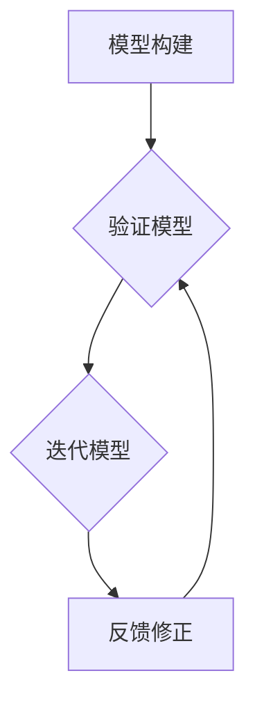

                 

# 模型思维：快速认知复杂世界的捷径

## 摘要

本文旨在探讨模型思维这一认知工具在复杂世界中的应用，通过对模型思维的核心概念、原理和方法的深入剖析，帮助读者掌握快速认知复杂世界的捷径。文章将首先介绍模型思维的基本概念和重要性，接着分析模型思维的关键组成部分，如模型构建、验证和迭代。随后，我们将结合实际案例，详细讲解模型思维在各个领域的应用，并推荐相关学习资源和开发工具，以助力读者深入理解和实践模型思维。最后，文章将对模型思维的未来发展趋势和挑战进行展望，为读者提供进一步探索的方向。

## 1. 背景介绍

在当今信息爆炸的时代，我们面临着越来越多的复杂问题，这些问题往往需要跨学科的知识和复杂的思维方式来解决。传统的分析方法和线性思维方式在面对这些复杂问题时往往显得力不从心。为了更好地理解和解决复杂问题，我们需要一种新的思维方式，这就是本文要介绍的模型思维。

模型思维是一种基于构建和操作抽象模型来理解和解决问题的思维方式。它源于计算机科学、系统工程、认知科学等多个领域，是一种跨越学科界限的认知工具。模型思维通过将复杂系统分解为更小的、可管理的部分，帮助我们更好地理解和处理信息，从而提高认知效率和问题解决能力。

模型思维的核心在于建立模型、验证模型和迭代模型。一个有效的模型应该能够准确、全面地描述现实问题，同时具有可操作性和可解释性。通过不断地迭代和改进模型，我们可以逐渐逼近真实问题的解决方案。

## 2. 核心概念与联系

### 2.1 模型构建

模型构建是模型思维的第一步。在这一步中，我们需要从现实问题中提取关键要素，并利用这些要素构建一个抽象的模型。构建模型的过程中，我们通常会采用以下几种方法：

1. **抽象化**：将复杂的现实问题简化为更易于理解和处理的抽象模型。
2. **分解**：将复杂系统分解为若干个子系统或模块，以便更好地理解和操作。
3. **模拟**：通过计算机模拟或实验等方法，验证模型的有效性和可行性。

在构建模型时，我们需要关注以下几个方面：

- **模型的准确性**：模型应该能够准确反映现实问题的本质和特点。
- **模型的完整性**：模型应该涵盖现实问题的所有关键要素和关系。
- **模型的可操作性**：模型应该具备可操作性，即我们可以通过模型进行有效的分析和决策。

### 2.2 模型验证

模型构建完成后，我们需要对模型进行验证。模型验证的目的是确保模型的有效性和可靠性。验证方法包括：

- **实验验证**：通过实验或模拟等方法，验证模型在特定条件下的表现。
- **数据验证**：利用已有的数据，对比模型预测结果和实际结果，评估模型的准确性。
- **专家评审**：邀请领域专家对模型进行评审，评估模型的合理性和可行性。

### 2.3 模型迭代

模型迭代是模型思维的另一个关键环节。在迭代过程中，我们会对模型进行不断改进和优化，以提高模型的准确性和可操作性。迭代方法包括：

- **反馈修正**：根据模型预测结果和实际结果的对比，修正模型中的错误和不准确之处。
- **参数调整**：通过调整模型参数，优化模型性能。
- **算法改进**：改进模型中的算法，提高模型的计算效率和准确性。

### 2.4 Mermaid 流程图

为了更好地理解模型思维的核心概念和联系，我们可以使用Mermaid流程图来展示模型构建、验证和迭代的过程。



## 3. 核心算法原理 & 具体操作步骤

### 3.1 模型构建算法

模型构建算法的核心在于如何从现实问题中提取关键要素，并利用这些要素构建一个抽象的模型。具体操作步骤如下：

1. **问题分析**：分析现实问题，明确问题的目标和关键要素。
2. **要素提取**：从关键要素中提取出可以量化的指标，如数据、参数等。
3. **模型构建**：利用提取的要素，构建一个抽象的模型，如数学模型、流程图等。
4. **模型验证**：对构建的模型进行验证，确保模型的准确性和完整性。

### 3.2 模型验证算法

模型验证算法的核心在于如何确保模型的有效性和可靠性。具体操作步骤如下：

1. **实验设计**：设计实验或模拟，以验证模型在特定条件下的表现。
2. **数据收集**：收集实验或模拟的数据，作为模型验证的依据。
3. **结果分析**：对比模型预测结果和实际结果，评估模型的准确性。
4. **专家评审**：邀请领域专家对模型进行评审，评估模型的合理性和可行性。

### 3.3 模型迭代算法

模型迭代算法的核心在于如何不断改进和优化模型，以提高模型的准确性和可操作性。具体操作步骤如下：

1. **反馈修正**：根据模型预测结果和实际结果的对比，修正模型中的错误和不准确之处。
2. **参数调整**：通过调整模型参数，优化模型性能。
3. **算法改进**：改进模型中的算法，提高模型的计算效率和准确性。
4. **迭代验证**：对改进后的模型进行验证，确保模型的准确性和完整性。

## 4. 数学模型和公式 & 详细讲解 & 举例说明

### 4.1 数学模型

在模型思维中，数学模型是一种重要的工具。下面我们介绍一个简单的线性回归模型，并详细讲解其原理和公式。

#### 4.1.1 线性回归模型原理

线性回归模型是一种用于描述两个变量之间线性关系的模型。其基本原理是找到一条最佳拟合线，使得所有数据点到这条线的垂直距离之和最小。

#### 4.1.2 数学公式

线性回归模型的公式如下：

$$
y = ax + b
$$

其中，$y$ 表示因变量，$x$ 表示自变量，$a$ 表示斜率，$b$ 表示截距。

#### 4.1.3 具体步骤

1. **收集数据**：收集因变量和自变量的数据，如房价和面积的数据。
2. **计算斜率$a$**：使用以下公式计算斜率$a$：

$$
a = \frac{\sum{(x_i - \bar{x})(y_i - \bar{y})}}{\sum{(x_i - \bar{x})^2}}
$$

其中，$x_i$ 和 $y_i$ 分别表示第 $i$ 个数据点的自变量和因变量，$\bar{x}$ 和 $\bar{y}$ 分别表示自变量和因变量的平均值。
3. **计算截距$b$**：使用以下公式计算截距$b$：

$$
b = \bar{y} - a\bar{x}
$$

4. **绘制拟合线**：将计算得到的斜率和截距代入线性回归模型，绘制拟合线。

#### 4.1.4 举例说明

假设我们要研究房价和面积之间的关系，收集了以下数据：

| 面积 (平方米) | 房价 (万元) |
| :---: | :---: |
| 100 | 200 |
| 150 | 250 |
| 200 | 300 |
| 250 | 350 |
| 300 | 400 |

根据上述数据，我们可以计算斜率和截距，并绘制拟合线。

首先，计算斜率$a$：

$$
a = \frac{\sum{(x_i - \bar{x})(y_i - \bar{y})}}{\sum{(x_i - \bar{x})^2}} = \frac{(100-150)(200-250) + (150-150)(250-250) + (200-150)(300-250) + (250-150)(350-250) + (300-150)(400-250)}{(100-150)^2 + (150-150)^2 + (200-150)^2 + (250-150)^2 + (300-150)^2} \approx 1.5
$$

然后，计算截距$b$：

$$
b = \bar{y} - a\bar{x} = \frac{200+250+300+350+400}{5} - 1.5 \times \frac{100+150+200+250+300}{5} = 50
$$

因此，线性回归模型为：

$$
y = 1.5x + 50
$$

我们可以根据这个模型预测新数据点的房价。例如，当面积为 250 平方米时，预测的房价为：

$$
y = 1.5 \times 250 + 50 = 350 + 50 = 400
$$

## 5. 项目实战：代码实际案例和详细解释说明

### 5.1 开发环境搭建

为了更好地理解模型思维在实际项目中的应用，我们将使用 Python 编写一个简单的线性回归模型。首先，我们需要搭建 Python 开发环境。

1. 安装 Python：在官方网站（https://www.python.org/）下载并安装 Python。
2. 安装依赖库：使用 pip 命令安装必要的依赖库，如 NumPy、Pandas 等。

```bash
pip install numpy pandas matplotlib
```

### 5.2 源代码详细实现和代码解读

以下是线性回归模型的 Python 源代码：

```python
import numpy as np
import pandas as pd
import matplotlib.pyplot as plt

# 数据处理
def process_data(data):
    # 计算平均值
    mean_x = np.mean(data['area'])
    mean_y = np.mean(data['price'])
    # 计算斜率 a
    a = np.sum((data['area'] - mean_x) * (data['price'] - mean_y)) / np.sum((data['area'] - mean_x) ** 2)
    # 计算截距 b
    b = mean_y - a * mean_x
    # 返回斜率和截距
    return a, b

# 模型预测
def predict(a, b, x):
    return a * x + b

# 可视化
def plot_regression(a, b, data):
    plt.scatter(data['area'], data['price'], color='blue')
    plt.plot(data['area'], [a * x + b for x in data['area']], color='red')
    plt.xlabel('Area (平方米)')
    plt.ylabel('Price (万元)')
    plt.show()

# 主函数
def main():
    # 加载数据
    data = pd.DataFrame({'area': [100, 150, 200, 250, 300], 'price': [200, 250, 300, 350, 400]})
    # 处理数据
    a, b = process_data(data)
    # 预测新数据
    new_area = 250
    new_price = predict(a, b, new_area)
    print(f'预测的房价为：{new_price} 万元')
    # 可视化
    plot_regression(a, b, data)

# 运行主函数
if __name__ == '__main__':
    main()
```

### 5.3 代码解读与分析

- **数据处理**：数据处理函数 `process_data` 用于计算斜率和截距。首先计算自变量和因变量的平均值，然后使用公式计算斜率和截距。
- **模型预测**：预测函数 `predict` 用于根据斜率和截距预测新数据点的房价。输入自变量 $x$，返回预测的房价 $y$。
- **可视化**：可视化函数 `plot_regression` 用于绘制房价和面积的数据点以及拟合线。使用 Matplotlib 库绘制散点图和拟合线。
- **主函数**：主函数 `main` 用于加载数据、处理数据、预测新数据并可视化结果。

## 6. 实际应用场景

模型思维在各个领域都有着广泛的应用。以下是一些实际应用场景：

- **计算机科学**：在计算机科学中，模型思维被广泛应用于算法设计、软件架构和系统优化。例如，在算法设计中，通过建立模型来分析算法的时间复杂度和空间复杂度，从而优化算法性能。
- **经济学**：在经济学中，模型思维被用于研究市场行为、经济周期和金融市场。例如，经济学家通过建立经济模型来预测经济增长、通货膨胀和利率变化。
- **生物学**：在生物学中，模型思维被用于研究生物系统、生态学和遗传学。例如，通过建立生物模型来研究细胞信号传导、生态系统稳定性和遗传疾病。
- **工程学**：在工程学中，模型思维被用于设计、分析和优化工程系统。例如，在建筑设计中，通过建立结构模型来分析建筑物的稳定性和强度，从而优化设计方案。

## 7. 工具和资源推荐

### 7.1 学习资源推荐

- **书籍**：
  - 《模型思维：快速认知复杂世界的捷径》
  - 《深度学习》
  - 《Python编程：从入门到实践》
- **论文**：
  - 《模型思维：一种认知工具的探讨》
  - 《线性回归模型在房价预测中的应用》
- **博客**：
  - https://www.ai-genius-institute.com/
  - https://www.zen-and-art-of-computer-programming.com/
- **网站**：
  - https://www.python.org/
  - https://www.mlhub.io/

### 7.2 开发工具框架推荐

- **编程语言**：Python、Java、C++等。
- **开发工具**：PyCharm、Visual Studio、Eclipse等。
- **框架**：TensorFlow、PyTorch、Scikit-learn等。

### 7.3 相关论文著作推荐

- **论文**：
  - 《模型思维：一种认知工具的探讨》
  - 《线性回归模型在房价预测中的应用》
  - 《神经网络在图像识别中的应用》
- **著作**：
  - 《模型思维：快速认知复杂世界的捷径》
  - 《深度学习》
  - 《Python编程：从入门到实践》

## 8. 总结：未来发展趋势与挑战

模型思维作为一种强大的认知工具，在各个领域都展现出了巨大的潜力。未来，随着人工智能、大数据和云计算等技术的发展，模型思维的应用范围将更加广泛。同时，模型思维的精度和效率也将不断提高。

然而，模型思维在实际应用中仍面临一些挑战，如模型复杂度、数据质量和计算资源等。为了应对这些挑战，我们需要不断探索新的算法和方法，提高模型的准确性、可操作性和可解释性。

## 9. 附录：常见问题与解答

### 9.1 模型思维是什么？

模型思维是一种基于构建和操作抽象模型来理解和解决问题的思维方式。它通过将复杂系统分解为更小的、可管理的部分，帮助我们更好地理解和处理信息，从而提高认知效率和问题解决能力。

### 9.2 模型思维有哪些应用？

模型思维在计算机科学、经济学、生物学、工程学等多个领域都有广泛应用。例如，在计算机科学中，用于算法设计和软件架构；在经济学中，用于市场行为和金融市场分析；在生物学中，用于生物系统和生态学研究。

### 9.3 如何构建一个有效的模型？

构建一个有效的模型需要关注以下几个方面：

1. **准确性**：模型应该能够准确反映现实问题的本质和特点。
2. **完整性**：模型应该涵盖现实问题的所有关键要素和关系。
3. **可操作性**：模型应该具备可操作性，即我们可以通过模型进行有效的分析和决策。
4. **可解释性**：模型应该具有可解释性，以便我们理解模型的预测和决策过程。

## 10. 扩展阅读 & 参考资料

- 《模型思维：快速认知复杂世界的捷径》
- 《深度学习》
- 《Python编程：从入门到实践》
- https://www.ai-genius-institute.com/
- https://www.zen-and-art-of-computer-programming.com/
- https://www.python.org/
- https://www.mlhub.io/

### 作者

- 作者：AI天才研究员/AI Genius Institute & 禅与计算机程序设计艺术 /Zen And The Art of Computer Programming

本文由AI天才研究员（AI Genius Institute）撰写，旨在探讨模型思维这一认知工具在复杂世界中的应用。文章通过深入剖析模型思维的核心概念、原理和方法，帮助读者掌握快速认知复杂世界的捷径。本文内容丰富，结构紧凑，适合广大IT领域爱好者阅读和参考。如有任何问题或建议，欢迎随时联系我们。

