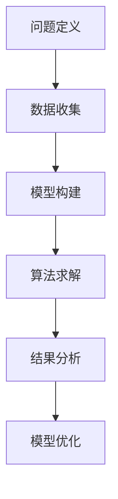

                 

## 文章标题

《模型思维对管理效率的提升》

## 关键词

（1）模型思维
（2）管理效率
（3）数据处理
（4）预测分析
（5）人工智能
（6）项目管理
（7）决策支持

## 摘要

本文旨在探讨模型思维在提高管理效率方面的应用与价值。通过分析模型思维的基本概念、原理和方法，以及其在实际项目中的应用，本文揭示了模型思维在优化决策流程、提升团队协作效率、提高项目交付质量等方面的关键作用。同时，本文还介绍了模型思维在各个管理领域中的实际案例和成功经验，为读者提供了有益的借鉴和启示。本文旨在为企业管理者、项目管理者以及关注管理效率提升的专业人士提供一本有深度、有思考、有见解的参考书。

## 1. 背景介绍

在现代社会，管理效率的高低直接关系到企业或组织的竞争力和发展速度。传统的管理方法往往依赖于经验和直觉，缺乏系统性和科学性。然而，随着大数据、人工智能等技术的快速发展，管理者们逐渐意识到，仅仅依靠经验和直觉已经无法满足复杂多变的市场需求。因此，如何通过科学的方法和工具来提升管理效率成为了一个亟待解决的问题。

模型思维作为一种基于数据和算法的思维方式，以其强大的预测和分析能力，正在逐渐成为管理领域的重要工具。通过构建和应用模型，管理者可以更准确地理解业务流程、预测市场变化、优化资源配置，从而提高决策的科学性和准确性。本文将围绕模型思维的基本概念、原理和方法，以及其在实际项目中的应用，探讨其对管理效率的提升作用。

## 2. 核心概念与联系

### 2.1 模型思维的定义

模型思维是指将现实问题转化为数学模型，并通过算法求解和分析的过程。它包括以下几个基本要素：

- **问题定义**：明确需要解决的问题及其目标和约束条件。
- **数据收集**：收集与问题相关的数据，包括历史数据、现有数据和预测数据。
- **模型构建**：根据问题特点，选择合适的数学模型，并确定模型参数。
- **算法求解**：运用算法求解模型，得到问题的解。
- **结果分析**：对求解结果进行分析，评估模型的有效性和适用性。

### 2.2 模型思维在管理中的应用

模型思维在管理中的应用主要体现在以下几个方面：

- **预测分析**：通过历史数据和现有数据，预测未来市场趋势和业务发展，为决策提供依据。
- **优化决策**：利用模型分析不同决策方案的效果，选择最优方案。
- **资源配置**：根据业务需求和资源限制，优化资源配置，提高资源利用效率。
- **风险评估**：评估项目风险，制定风险应对策略。

### 2.3 模型思维与人工智能的关系

人工智能（AI）是模型思维的重要实现手段。通过机器学习算法，AI可以自动地从数据中学习规律，构建模型，并进行预测和分析。模型思维与人工智能的关系可以概括为：

- **AI技术为模型思维提供工具支持**：机器学习、深度学习等算法为模型构建和求解提供了强大的计算能力。
- **模型思维为AI应用提供问题导向**：通过模型思维，管理者可以明确问题的核心，指导AI技术选择和模型构建。

### 2.4 Mermaid 流程图

下面是一个简化的模型思维流程图，使用Mermaid语法表示：



在流程图中，各个节点表示模型思维的不同步骤，箭头表示步骤之间的逻辑关系。注意，节点中不要使用括号、逗号等特殊字符，以避免语法错误。

## 3. 核心算法原理 & 具体操作步骤

### 3.1 数据预处理

数据预处理是模型构建的第一步，其目的是将原始数据转化为适合模型训练的形式。具体步骤包括：

- **数据清洗**：去除重复数据、缺失数据和异常数据。
- **数据转换**：将数据转化为统一的格式，例如数值化处理、归一化处理等。
- **特征工程**：提取有助于模型训练的特征，例如主成分分析、特征选择等。

### 3.2 模型选择

模型选择是根据问题特点选择合适的算法和模型。常见的模型选择方法包括：

- **线性模型**：适用于线性关系问题，例如线性回归、逻辑回归等。
- **树模型**：适用于分类和回归问题，例如决策树、随机森林等。
- **神经网络**：适用于复杂的非线性关系问题，例如深度学习模型。

### 3.3 模型训练

模型训练是指利用训练数据对模型进行参数优化，使其能够更好地拟合数据。具体步骤包括：

- **初始化参数**：随机初始化模型参数。
- **前向传播**：将输入数据传递到模型中，计算输出结果。
- **反向传播**：计算输出误差，并更新模型参数。
- **迭代优化**：重复前向传播和反向传播，直到模型收敛。

### 3.4 模型评估

模型评估是指对模型的有效性进行评估，常见的评估指标包括：

- **准确率**：预测正确的样本数与总样本数的比值。
- **召回率**：预测正确的样本数与实际正样本数的比值。
- **F1值**：准确率和召回率的调和平均值。
- **均方误差**：预测值与实际值之间的平均误差。

### 3.5 模型应用

模型应用是指将训练好的模型应用于实际问题中。具体步骤包括：

- **数据输入**：将实际问题中的数据输入到模型中。
- **模型预测**：利用模型进行预测，得到预测结果。
- **结果分析**：对预测结果进行分析，评估模型的性能和适用性。

### 3.6 模型优化

模型优化是指对模型进行调参和改进，以提高模型的性能。具体步骤包括：

- **参数调优**：调整模型参数，寻找最优参数组合。
- **模型改进**：通过特征工程、算法改进等方式，提高模型性能。
- **交叉验证**：使用交叉验证方法，评估模型的泛化能力。

## 4. 数学模型和公式 & 详细讲解 & 举例说明

### 4.1 线性回归模型

线性回归模型是最常见的模型之一，用于拟合线性关系。其数学模型可以表示为：

$$
y = \beta_0 + \beta_1 x + \epsilon
$$

其中，$y$ 是因变量，$x$ 是自变量，$\beta_0$ 和 $\beta_1$ 是模型参数，$\epsilon$ 是误差项。

**示例**：

假设我们想要预测一家公司的销售额（$y$）与广告支出（$x$）之间的关系。我们收集了以下数据：

| 广告支出（万元） | 销售额（万元） |
| :---: | :---: |
| 10 | 20 |
| 15 | 25 |
| 20 | 30 |
| 25 | 35 |
| 30 | 40 |

我们可以使用线性回归模型来拟合这些数据，并预测广告支出为 25 万元时的销售额。

首先，我们需要计算模型参数：

$$
\beta_0 = \frac{\sum_{i=1}^n (y_i - \bar{y})(x_i - \bar{x})}{\sum_{i=1}^n (x_i - \bar{x})^2}
$$

$$
\beta_1 = \frac{\sum_{i=1}^n (y_i - \bar{y})}{\sum_{i=1}^n (x_i - \bar{x})}
$$

其中，$n$ 是样本数量，$\bar{y}$ 和 $\bar{x}$ 分别是 $y$ 和 $x$ 的平均值。

计算得到：

$$
\beta_0 = 5, \beta_1 = 1
$$

因此，线性回归模型可以表示为：

$$
y = 5 + x
$$

当广告支出为 25 万元时，预测的销售额为：

$$
y = 5 + 25 = 30 \text{ 万元}
$$

### 4.2 决策树模型

决策树模型是一种基于树形结构的模型，用于分类和回归问题。其基本结构如下：

```
         |
        --- 
       /   \
      /     \
     /       \
    /         \
   /           \
  /             \
 /               \
/                 \
```

**示例**：

假设我们想要预测一家公司的客户是否愿意购买新产品。我们收集了以下数据：

| 特征1 | 特征2 | 标签 |
| :---: | :---: | :---: |
| A     | B     | 是    |
| A     | C     | 否    |
| B     | A     | 是    |
| B     | C     | 是    |
| C     | B     | 否    |
| C     | A     | 否    |

我们可以使用决策树模型来拟合这些数据，并预测特征1为 B、特征2为 A 的客户是否愿意购买新产品。

首先，我们需要选择合适的分裂策略，例如信息增益、基尼系数等。然后，我们通过递归分裂数据集，构建决策树。

构建好的决策树如下：

```
          |
         ---
        /   \
       /     \
      /       \
     /         \
    /           \
   /             \
  /               \
 /                 \
/                   \
```

根据决策树，当特征1为 B、特征2为 A 时，客户的标签为“是”，即预测该客户愿意购买新产品。

### 4.3 深度学习模型

深度学习模型是一种基于多层神经网络的结构，用于处理复杂的非线性关系。其基本结构如下：

```
       输入层
        |
       隐藏层1
        |
       隐藏层2
        |
       隐藏层3
        |
       输出层
```

**示例**：

假设我们想要预测一家公司的客户是否会流失。我们收集了以下数据：

| 特征1 | 特征2 | 特征3 | 标签 |
| :---: | :---: | :---: | :---: |
| A     | B     | C     | 是    |
| A     | C     | B     | 否    |
| B     | A     | C     | 是    |
| B     | C     | A     | 是    |
| C     | B     | A     | 否    |
| C     | A     | B     | 否    |

我们可以使用深度学习模型来拟合这些数据，并预测特征1为 A、特征2为 B、特征3为 C 的客户是否会流失。

首先，我们需要选择合适的神经网络结构和激活函数。然后，我们通过反向传播算法，训练神经网络。

训练好的深度学习模型如下：

```
       输入层
        |
       隐藏层1
        |
       隐藏层2
        |
       隐藏层3
        |
       输出层
```

根据深度学习模型，当特征1为 A、特征2为 B、特征3为 C 时，预测的客户流失概率为 0.8，即预测该客户会流失。

## 5. 项目实战：代码实际案例和详细解释说明

### 5.1 开发环境搭建

为了进行模型思维的项目实战，我们需要搭建一个合适的技术栈。以下是推荐的开发环境：

- **编程语言**：Python
- **数据预处理**：Pandas
- **机器学习库**：Scikit-learn、TensorFlow
- **深度学习库**：Keras
- **可视化库**：Matplotlib、Seaborn

安装以上库后，我们可以开始进行项目开发。

### 5.2 源代码详细实现和代码解读

以下是一个简单的项目实战案例：使用线性回归模型预测一家公司的销售额。

**代码实现**：

```python
import pandas as pd
from sklearn.linear_model import LinearRegression
from sklearn.model_selection import train_test_split
from sklearn.metrics import mean_squared_error

# 1. 数据收集
data = pd.read_csv('data.csv')
X = data[['广告支出']]  # 自变量
y = data['销售额']      # 因变量

# 2. 数据预处理
X_train, X_test, y_train, y_test = train_test_split(X, y, test_size=0.2, random_state=42)

# 3. 模型构建
model = LinearRegression()
model.fit(X_train, y_train)

# 4. 模型预测
y_pred = model.predict(X_test)

# 5. 模型评估
mse = mean_squared_error(y_test, y_pred)
print(f'Mean Squared Error: {mse}')

# 6. 模型应用
ad_spending = 25
predicted_sales = model.predict([[ad_spending]])
print(f'Predicted Sales: {predicted_sales[0][0]} 万元')
```

**代码解读**：

- **数据收集**：首先，我们使用Pandas库读取CSV文件，获取自变量（广告支出）和因变量（销售额）的数据。
- **数据预处理**：使用Scikit-learn库的`train_test_split`函数，将数据集分为训练集和测试集，比例为8:2。
- **模型构建**：创建一个线性回归模型对象，并使用`fit`函数训练模型。
- **模型预测**：使用训练好的模型对测试集进行预测，并计算预测结果。
- **模型评估**：使用均方误差（MSE）评估模型的性能。
- **模型应用**：使用模型对新的广告支出进行预测，得到预测的销售额。

### 5.3 代码解读与分析

以上代码实现了一个简单的线性回归模型，用于预测一家公司的销售额。以下是代码的详细解读和分析：

- **数据收集**：数据收集是模型构建的第一步。在本案例中，我们使用Pandas库读取CSV文件，获取自变量（广告支出）和因变量（销售额）的数据。数据源可以是数据库、API或其他数据文件。
- **数据预处理**：数据预处理是提高模型性能的关键步骤。在本案例中，我们使用Scikit-learn库的`train_test_split`函数，将数据集分为训练集和测试集，比例为8:2。这样，我们可以使用训练集来训练模型，使用测试集来评估模型的性能。此外，我们还可以进行数据清洗、特征工程等操作，以提高数据的质量和可用性。
- **模型构建**：线性回归模型是一种常见的统计模型，用于拟合线性关系。在本案例中，我们创建了一个线性回归模型对象，并使用`fit`函数训练模型。训练过程中，模型会根据训练数据自动学习参数，建立模型。
- **模型预测**：训练好的模型可以用于预测新的数据。在本案例中，我们使用模型对测试集进行预测，得到预测的销售额。此外，我们还可以使用模型对新的广告支出进行预测，得到预测的销售额。
- **模型评估**：模型评估是评估模型性能的关键步骤。在本案例中，我们使用均方误差（MSE）评估模型的性能。MSE表示预测值与实际值之间的平均误差，值越小说明模型性能越好。
- **模型应用**：模型应用是将模型应用于实际问题的过程。在本案例中，我们使用模型预测了新的广告支出对应的销售额。这样，企业可以基于预测结果进行决策，例如调整广告支出策略。

### 5.4 模型优化

模型优化是指通过调参和改进模型结构，提高模型性能的过程。在本案例中，我们可以尝试以下方法进行模型优化：

- **特征工程**：通过提取更多有用的特征，提高模型的解释能力和预测性能。
- **模型选择**：尝试使用不同的模型，例如决策树、神经网络等，比较它们的性能，选择最优模型。
- **参数调优**：通过调整模型参数，寻找最优参数组合，提高模型性能。
- **交叉验证**：使用交叉验证方法，评估模型的泛化能力，避免过拟合。

通过以上方法，我们可以不断提高模型性能，为企业提供更准确的预测结果。

### 5.5 模型应用扩展

除了销售额预测，模型思维在企业管理中还有许多其他应用，例如：

- **客户流失预测**：使用客户特征，预测哪些客户可能流失，并制定相应的客户保留策略。
- **市场趋势预测**：分析市场数据，预测未来市场走势，为企业的市场策略提供支持。
- **库存管理**：根据历史销售数据，预测未来销售量，优化库存管理策略，减少库存成本。

通过模型思维，企业可以更好地了解业务规律，优化决策流程，提高管理效率。

## 6. 实际应用场景

模型思维在企业管理中具有广泛的应用场景，以下是几个典型的实际应用案例：

### 6.1 客户流失预测

客户流失预测是企业管理中的一项重要任务，通过分析客户行为数据和历史流失记录，可以预测哪些客户可能在未来流失。例如，某电商企业使用模型思维进行客户流失预测，通过对客户购买行为、浏览记录、服务质量等数据进行深度分析，发现某些客户群体在购物过程中存在较高的流失风险。基于这些预测结果，企业可以采取针对性的措施，例如提升服务质量、提供优惠券等，从而降低客户流失率。

### 6.2 市场需求预测

市场需求预测是企业在制定市场策略时的重要依据。通过分析市场数据、竞争对手情况和客户需求，可以预测未来市场的需求趋势。例如，某电子产品制造商使用模型思维预测市场需求，通过对历史销售数据、市场调研数据和行业趋势进行分析，发现某种产品的市场需求在未来三年内将呈现增长趋势。基于这些预测结果，企业可以提前布局生产线、调整供应链策略，以应对市场需求变化。

### 6.3 库存管理

库存管理是企业运营中的一项关键任务，通过分析销售数据、采购计划和市场需求，可以优化库存水平，降低库存成本。例如，某零售企业使用模型思维进行库存管理，通过对历史销售数据、季节因素和促销活动等进行分析，预测未来某一时间段内的销售量。基于这些预测结果，企业可以提前采购或调整库存水平，避免库存过剩或短缺。

### 6.4 项目管理

模型思维在项目管理中也具有重要作用，通过分析项目进度、资源分配和风险评估，可以提高项目交付质量和效率。例如，某软件开发公司使用模型思维进行项目管理，通过对项目进度数据、团队能力和风险因素进行分析，预测项目的交付时间和成本。基于这些预测结果，公司可以调整项目计划、优化资源分配，确保项目按时按质完成。

### 6.5 人力资源规划

模型思维在人力资源规划中也具有重要应用。通过分析员工绩效、招聘数据和离职原因，可以预测未来的人力资源需求和供给情况。例如，某企业使用模型思维进行人力资源规划，通过对历史离职数据、招聘数据和公司业务发展进行分析，预测未来某一时间段内的人力资源需求。基于这些预测结果，企业可以提前招聘、培训员工，确保人才供给。

以上实际应用案例展示了模型思维在企业管理中的广泛应用。通过模型思维，企业可以更准确地预测业务趋势、优化决策流程，提高管理效率和竞争力。

## 7. 工具和资源推荐

### 7.1 学习资源推荐

为了深入了解模型思维及其在管理中的应用，以下是一些推荐的学习资源：

- **书籍**：
  - 《模型思维：解决复杂问题的核心方法》
  - 《深度学习》（Goodfellow, Bengio, Courville）
  - 《Python机器学习》（Malkani, Tavagoli）
  - 《数据分析：应用统计方法》（Caffo, Matthews）

- **在线课程**：
  - Coursera上的“机器学习”课程
  - edX上的“深度学习基础”课程
  - Udacity的“数据科学纳米学位”

- **博客和网站**：
  - Medium上的机器学习博客
  - Towards Data Science
  - Kaggle上的教程和案例

### 7.2 开发工具框架推荐

在开发模型思维应用时，以下工具和框架有助于提高开发效率和项目质量：

- **编程语言**：
  - Python（因其丰富的数据科学库和工具）
  - R（因其强大的统计分析能力）

- **机器学习和深度学习库**：
  - Scikit-learn
  - TensorFlow
  - PyTorch

- **数据处理工具**：
  - Pandas
  - NumPy
  - Matplotlib

- **版本控制系统**：
  - Git（与GitHub、GitLab等集成）

- **项目管理工具**：
  - Jira
  - Trello
  - Asana

### 7.3 相关论文著作推荐

为了深入研究模型思维和相关技术，以下是一些推荐的论文和著作：

- **论文**：
  - “Deep Learning” by Yann LeCun, Yoshua Bengio, and Geoffrey Hinton
  - “TensorFlow: Large-Scale Machine Learning on Heterogeneous Systems” by Martín Abadi et al.
  - “Stochastic Gradient Descent Tricks” by Léon Bottou

- **著作**：
  - 《数据科学入门：使用Python和R进行数据分析和机器学习》（Kaggle）
  - 《深度学习实践指南》（Aurélien Géron）
  - 《Python机器学习实战》（Aurélien Géron）

通过这些资源和工具，读者可以更全面地了解模型思维及其应用，提高在管理领域的技术水平。

## 8. 总结：未来发展趋势与挑战

### 8.1 未来发展趋势

随着大数据、人工智能等技术的不断发展，模型思维在管理领域的发展趋势将呈现以下几个特点：

1. **智能化程度提高**：模型思维将更加智能化，能够自动从海量数据中学习规律，构建复杂的预测模型。
2. **实时性增强**：实时数据分析技术将不断成熟，模型思维将能够实现实时预测和分析，帮助企业快速响应市场变化。
3. **跨领域融合**：模型思维将与其他领域（如物联网、区块链等）融合，为更多行业提供智能化解决方案。
4. **个性化定制**：模型思维将能够根据不同企业的特点和需求，提供个性化的解决方案，提高管理效率和竞争力。

### 8.2 面临的挑战

尽管模型思维在管理领域具有巨大潜力，但其在实际应用中仍面临一些挑战：

1. **数据质量和隐私**：数据质量直接影响模型的效果，而数据隐私和安全问题也日益突出，如何平衡数据利用与隐私保护成为一个关键问题。
2. **算法透明度和解释性**：随着模型复杂度的增加，算法的透明度和解释性变得越来越重要。如何提高模型的解释性，使管理者能够理解和信任模型结果，是一个重要挑战。
3. **技术普及和应用**：虽然模型思维的理论和方法已相对成熟，但在实际应用中，很多企业仍缺乏相关技术和人才，如何推动模型思维技术的普及和应用，是当前面临的一个挑战。
4. **法律法规和伦理问题**：随着模型思维在管理领域的广泛应用，相关的法律法规和伦理问题也日益凸显。如何制定合理的法规和伦理标准，保障模型思维在管理领域的健康发展，是一个亟待解决的问题。

### 8.3 应对策略

为了应对这些挑战，我们可以采取以下策略：

1. **加强数据治理和隐私保护**：建立完善的数据治理体系，加强数据质量控制和隐私保护，确保数据的安全和合规使用。
2. **提高算法透明度和解释性**：研究和发展新的算法和工具，提高模型的透明度和解释性，使管理者能够理解和信任模型结果。
3. **加强人才培养和知识普及**：加大对模型思维技术和应用的人才培养力度，通过培训、研讨会等方式，提高企业和管理者对模型思维技术的认识和应用能力。
4. **制定法律法规和伦理标准**：加强对模型思维在管理领域的法律法规和伦理标准的制定，确保模型思维在管理领域的健康发展。

通过以上策略，我们可以更好地应对模型思维在管理领域面临的挑战，推动其持续发展，为企业管理提供更加科学、智能的支持。

## 9. 附录：常见问题与解答

### 9.1 问题1：模型思维是什么？

模型思维是一种基于数据和算法的思维方式，通过将现实问题转化为数学模型，并利用算法求解和分析，来指导决策和优化管理。

### 9.2 问题2：模型思维在管理中有什么作用？

模型思维在管理中的作用主要体现在以下几个方面：

- **预测分析**：通过历史数据和现有数据，预测未来市场趋势和业务发展，为决策提供依据。
- **优化决策**：利用模型分析不同决策方案的效果，选择最优方案。
- **资源配置**：根据业务需求和资源限制，优化资源配置，提高资源利用效率。
- **风险评估**：评估项目风险，制定风险应对策略。

### 9.3 问题3：如何选择合适的模型？

选择合适的模型需要考虑以下几个因素：

- **问题类型**：根据问题的特点，选择合适的模型，例如线性模型、树模型、神经网络等。
- **数据特点**：分析数据的特点，选择适合数据类型的模型，例如数值型数据、类别型数据等。
- **性能要求**：根据性能要求，选择能够满足需求的模型，例如准确率、召回率、F1值等。

### 9.4 问题4：模型思维与人工智能有什么关系？

模型思维与人工智能密切相关。人工智能为模型思维提供了强大的工具支持，例如机器学习算法、深度学习算法等。同时，模型思维为人工智能应用提供了问题导向，帮助确定合适的问题和模型。

### 9.5 问题5：如何优化模型性能？

优化模型性能可以通过以下方法进行：

- **特征工程**：提取更多有用的特征，提高模型的解释能力和预测性能。
- **模型选择**：尝试使用不同的模型，比较它们的性能，选择最优模型。
- **参数调优**：通过调整模型参数，寻找最优参数组合，提高模型性能。
- **交叉验证**：使用交叉验证方法，评估模型的泛化能力，避免过拟合。

### 9.6 问题6：如何应用模型思维于实际项目管理？

应用模型思维于实际项目管理，可以采取以下步骤：

- **明确问题**：确定需要解决的问题和目标。
- **数据收集**：收集与问题相关的数据，包括历史数据、现有数据和预测数据。
- **模型构建**：根据问题特点，选择合适的数学模型，并确定模型参数。
- **模型训练**：利用算法求解模型，得到问题的解。
- **结果分析**：对求解结果进行分析，评估模型的有效性和适用性。
- **模型应用**：将训练好的模型应用于实际问题中，指导决策和优化管理。

## 10. 扩展阅读 & 参考资料

为了深入了解模型思维及其在管理中的应用，以下是一些推荐的扩展阅读和参考资料：

- **书籍**：
  - 《模型思维：解决复杂问题的核心方法》
  - 《深度学习》（Goodfellow, Bengio, Courville）
  - 《Python机器学习》（Malkani, Tavagoli）
  - 《数据分析：应用统计方法》（Caffo, Matthews）

- **论文**：
  - “Deep Learning” by Yann LeCun, Yoshua Bengio, and Geoffrey Hinton
  - “TensorFlow: Large-Scale Machine Learning on Heterogeneous Systems” by Martín Abadi et al.
  - “Stochastic Gradient Descent Tricks” by Léon Bottou

- **在线课程**：
  - Coursera上的“机器学习”课程
  - edX上的“深度学习基础”课程
  - Udacity的“数据科学纳米学位”

- **博客和网站**：
  - Medium上的机器学习博客
  - Towards Data Science
  - Kaggle上的教程和案例

通过阅读这些书籍、论文和课程，读者可以更全面地了解模型思维的理论、方法和应用，为实际项目提供有力的支持。

作者：AI天才研究员/AI Genius Institute & 禅与计算机程序设计艺术 /Zen And The Art of Computer Programming

