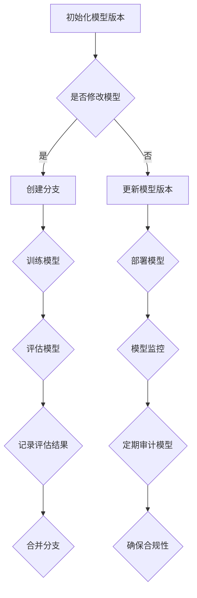

                 

### 背景介绍

随着深度学习和大数据技术的迅猛发展，人工智能领域正以前所未有的速度演进。在这一过程中，模型的版本控制显得尤为重要。版本控制不仅仅是管理代码和文档的工具，更是确保模型稳定迭代、安全部署的关键环节。在当前的AI工程实践中，模型的版本控制已从简单的文件管理升级为复杂的系统工程，涵盖了从数据预处理、模型训练到部署和监控的各个环节。

首先，模型的版本控制有助于团队协作和代码管理。在多人的开发环境中，版本控制系统能够有效地跟踪代码的变更历史，确保团队成员间的协同工作不产生冲突。这不仅提高了开发效率，还大大减少了错误发生的概率。例如，Git作为目前最流行的版本控制系统，支持多种分支策略，使得团队可以并行工作，并在合适的时候合并代码。

其次，版本控制是保证模型稳定性的重要手段。在AI模型的生命周期中，每一次修改都可能影响模型的性能。通过版本控制，我们可以记录每次修改的具体内容，并能够在需要时回滚到之前的版本。这种方法不仅有助于快速定位和解决问题，还能够防止因错误修改导致模型性能的显著下降。

此外，版本控制还支持模型的审计和合规性检查。在金融、医疗等领域，模型的准确性和透明性是法律和行业标准的基本要求。通过版本控制，我们可以追踪模型的每一个修改，确保其遵循相应的法规和标准，提高模型的可信度。

总的来说，模型的版本控制是AI工程实践中不可或缺的一环。它不仅提高了开发效率，保证了模型的稳定性，还满足了合规性和审计的需求。在本文中，我们将深入探讨模型版本控制的核心概念、原理及其在实际项目中的应用，并通过具体的代码实战案例，帮助读者理解和掌握这一重要的技术。

### 2. 核心概念与联系

#### 2.1 版本控制系统的基本概念

版本控制系统（Version Control System，简称VCS）是一种用于管理和跟踪文件或代码变更的工具。它的核心功能是记录每次变更的历史记录，使得开发者可以查看代码的版本差异，回滚到之前的版本，或者合并多个分支。目前，常见的版本控制系统主要包括集中式和分布式两种类型。

**集中式版本控制系统（Centralized Version Control System，CVCS）**，如Subversion（SVN），其特点是所有文件变更都集中存储在一个中心服务器上。开发者需要从服务器获取代码，进行修改后提交到服务器。这种系统的优点是易于管理，便于中央化控制。但缺点是如果服务器出现故障，整个团队的代码工作将受到影响。

**分布式版本控制系统（Distributed Version Control System，DVCS）**，如Git，则采用了去中心化的存储方式。每个开发者都有自己的本地仓库，可以通过拉取（pull）和推送（push）操作与远程仓库进行同步。这种系统的优点是具有较高的容错性和扩展性，适合大型项目或多团队协作。

**版本控制的核心功能**：

1. **提交和记录变更**：开发者对代码进行修改后，通过提交操作将变更记录到版本控制系统中，生成一个新的版本。
2. **分支管理**：开发者可以在不同分支上独立工作，并在合适的时候合并分支，实现代码的并行开发和维护。
3. **历史查看和回滚**：版本控制系统记录了每次提交的详细历史记录，开发者可以查看任意历史版本，甚至可以回滚到之前的版本。
4. **冲突解决**：当多个开发者对同一文件进行修改时，版本控制系统可以自动或手动解决冲突，确保代码的一致性。

#### 2.2 模型版本控制的基本概念

在AI领域，模型版本控制不仅涉及代码管理，还包括模型的训练数据、超参数配置、评估指标等。模型版本控制的基本概念如下：

1. **模型版本（Model Version）**：每次模型训练或更新后，都会生成一个新的模型版本。版本号通常采用递增的方式，如1.0、1.1等，以表示模型的迭代过程。
2. **模型配置（Model Configuration）**：包括训练数据集、超参数设置、训练脚本等信息，这些配置对于复现和评估模型至关重要。
3. **模型状态（Model State）**：模型的当前状态，包括训练完成的权重、评估指标等，用于后续的部署和监控。
4. **模型审核（Model Audit）**：对模型进行定期的审核，确保其遵循相应的法规和标准，如透明性、可解释性等。

**模型版本控制的核心功能**：

1. **版本记录和回滚**：记录模型训练过程中的每次变更，支持回滚到之前的版本，以便在模型出现问题或性能下降时恢复到稳定的版本。
2. **模型发布和部署**：将训练完成的模型发布到生产环境，并提供相应的部署脚本和配置文件，确保模型的顺利部署和运行。
3. **模型评估和监控**：对模型进行定期的评估和监控，包括性能指标、资源消耗、错误率等，确保模型在运行过程中保持高效和稳定。

#### 2.3 版本控制与模型版本控制的联系

版本控制和模型版本控制之间存在紧密的联系。版本控制系统为模型版本控制提供了基础支持，使得模型版本控制可以更高效地实现。具体来说：

1. **代码管理**：版本控制系统用于管理模型训练和部署过程中的代码，包括训练脚本、评估脚本等。这有助于确保代码的一致性和可追溯性。
2. **数据管理**：版本控制系统可以记录训练数据集的版本信息，确保在复现和评估模型时使用的是相同的数据集。
3. **配置管理**：版本控制系统可以记录模型的配置信息，如超参数设置、评估指标等，确保模型在训练和部署过程中使用的是一致的配置。
4. **状态管理**：版本控制系统可以记录模型的状态，包括训练完成的权重、评估指标等，便于后续的模型部署和监控。

通过以上分析，我们可以看到，版本控制系统为模型版本控制提供了强大的支持，使得AI模型的生命周期管理更加高效和有序。在接下来的章节中，我们将深入探讨模型版本控制的具体算法原理和实际操作步骤。

#### 2.4 核心概念与架构的 Mermaid 流程图

为了更直观地理解模型版本控制的核心概念与架构，我们使用Mermaid流程图来展示其关键节点和流程。以下是该流程图的文本表示：



**图注**：

- **A 初始化模型版本**：首次创建模型时，初始化版本号为1.0。
- **B 是否修改模型**：在每次提交变更时，判断是否修改了模型。
- **C 创建分支**：如果需要修改模型，则创建新的分支，进行独立开发。
- **D 更新模型版本**：在模型训练或部署后，更新模型版本号。
- **E 训练模型**：在分支上进行模型训练。
- **F 部署模型**：将训练完成的模型部署到生产环境。
- **G 评估模型**：对部署后的模型进行评估，记录评估结果。
- **H 模型监控**：实时监控模型在运行过程中的性能和稳定性。
- **I 记录评估结果**：将评估结果记录到版本控制系统中。
- **J 定期审计模型**：对模型进行定期的审计，确保其合规性。
- **K 合并分支**：在合适的时候，将分支合并到主分支。
- **L 确保合规性**：通过审计确保模型符合相关法规和标准。

通过上述流程图，我们可以清晰地看到模型版本控制的主要步骤和关键环节，为后续的具体算法原理和实战案例打下了基础。

#### 3. 核心算法原理 & 具体操作步骤

在理解了模型版本控制的基本概念和流程后，接下来我们将深入探讨其核心算法原理和具体操作步骤，帮助读者更全面地掌握这一技术。

##### 3.1 模型版本控制的算法原理

模型版本控制的算法原理主要基于版本控制系统（如Git）的核心机制，包括提交、分支、合并等操作。以下是这些操作的具体描述：

1. **提交（Commit）**：提交操作用于将当前工作区的变更记录到版本控制系统。每次提交都会生成一个唯一的版本号，记录了提交者、提交日期以及提交说明。提交操作确保了代码的版本可追溯性，方便后续的回滚和审计。

2. **分支（Branch）**：分支操作用于创建一个独立的开发环境，使得开发者可以在不同分支上独立工作。分支操作的主要目的是实现并行开发，避免不同功能的代码互相干扰。每个分支都有自己的提交历史，独立于主分支。

3. **合并（Merge）**：合并操作用于将一个分支的提交记录合并到另一个分支。合并操作需要解决可能出现的冲突，确保代码的一致性和完整性。合并后的分支将继承主分支的提交历史，同时保留分支上的独立变更。

4. **标签（Tag）**：标签操作用于给特定的提交或版本打上标记，便于后续的查找和引用。标签通常用于标记发布版本、里程碑等关键点，有助于快速定位和复现特定版本。

5. **拉取请求（Pull Request）**：拉取请求是Git中的一个流程，用于提交代码变更并等待其他开发者的审查。通过拉取请求，开发者可以协作地提交和审查代码，确保代码质量。

##### 3.2 模型版本控制的具体操作步骤

在实际操作中，模型版本控制通常涉及以下几个步骤：

1. **初始化版本控制系统**：首先，需要初始化版本控制系统，如Git。通过执行`git init`命令，创建一个新的本地仓库。

   ```bash
   git init
   ```

2. **添加文件到仓库**：将模型相关的文件添加到仓库，如训练脚本、配置文件等。通过执行`git add`命令，将文件添加到暂存区。

   ```bash
   git add train_script.py config.yaml
   ```

3. **提交变更**：对代码进行修改后，执行`git commit`命令提交变更。在提交说明中详细描述修改的内容和目的。

   ```bash
   git commit -m "Initialize model version and train script"
   ```

4. **创建分支**：在需要独立开发时，创建一个新的分支。例如，创建一个名为`feature/X`的分支进行新功能的开发。

   ```bash
   git checkout -b feature/X
   ```

5. **在分支上进行开发**：在分支上修改代码并进行训练。确保每次修改都提交到分支。

   ```bash
   git commit -m "Add new feature to model"
   ```

6. **合并分支**：在合适的时候，将分支合并到主分支。通过执行`git merge`命令，将分支上的提交记录合并到主分支。

   ```bash
   git merge feature/X
   ```

7. **解决冲突**：在合并过程中，如果出现冲突，需要手动解决。Git会生成一个合并日志，列出冲突文件和具体内容。

   ```bash
   git status
   git add conflicted_file.py
   git commit -m "Resolve merge conflicts"
   ```

8. **标签发布版本**：在发布新版本时，通过`git tag`命令为特定提交打上标签。

   ```bash
   git tag -a v1.0 -m "Release version 1.0"
   ```

9. **推送代码到远程仓库**：将本地仓库的变更推送到远程仓库，如GitHub或GitLab。

   ```bash
   git push origin main
   ```

通过上述步骤，我们可以有效地管理模型的版本和控制其迭代过程。在接下来的章节中，我们将通过具体的代码实战案例，进一步展示模型版本控制的实际应用。

### 4. 数学模型和公式 & 详细讲解 & 举例说明

在模型版本控制的过程中，数学模型和公式发挥着至关重要的作用。它们不仅帮助我们理解版本控制的原理，还为实际操作提供了数学上的支持和保障。在本章节中，我们将详细讲解与模型版本控制相关的数学模型和公式，并通过实际案例进行说明。

#### 4.1 模型评估指标

模型评估是版本控制中的一个关键环节，其目的是通过一系列指标来衡量模型的性能。以下是一些常见的模型评估指标：

1. **准确率（Accuracy）**：
   准确率是模型在预测中正确的样本数占总样本数的比例。其公式如下：
   $$\text{Accuracy} = \frac{\text{预测正确的样本数}}{\text{总样本数}}$$

2. **精确率（Precision）**：
   精确率是预测为正样本且实际为正样本的样本数占预测为正样本的样本总数的比例。其公式如下：
   $$\text{Precision} = \frac{\text{TP}}{\text{TP + FP}}$$
   其中，TP（True Positive）表示真正例，FP（False Positive）表示假正例。

3. **召回率（Recall）**：
   召回率是预测为正样本且实际为正样本的样本数占实际为正样本的样本总数的比例。其公式如下：
   $$\text{Recall} = \frac{\text{TP}}{\text{TP + FN}}$$
   其中，FN（False Negative）表示假反例。

4. **F1 分数（F1 Score）**：
   F1 分数是精确率和召回率的调和平均值，用于综合评估模型的性能。其公式如下：
   $$\text{F1 Score} = 2 \times \frac{\text{Precision} \times \text{Recall}}{\text{Precision} + \text{Recall}}$$

**举例说明**：

假设一个分类模型对100个样本进行预测，其中预测正确的样本数为80个，其中真正的正样本数为60个，预测为正样本的样本总数为70个，实际的正样本总数为50个。那么，该模型的评估指标如下：

- **准确率**：$\text{Accuracy} = \frac{80}{100} = 0.8$
- **精确率**：$\text{Precision} = \frac{60}{70} \approx 0.857$
- **召回率**：$\text{Recall} = \frac{60}{50} = 1.2$
- **F1 分数**：$\text{F1 Score} = 2 \times \frac{0.857 \times 1.2}{0.857 + 1.2} \approx 0.923$

#### 4.2 版本控制系统的数据结构

版本控制系统的核心数据结构包括提交历史、分支、标签等。以下是其基本概念和公式：

1. **提交历史**：
   每个提交都可以看作是一个提交点（Commit），其包含父提交、提交者、提交日期和提交说明等信息。提交历史可以看作是一个有向无环图（DAG），其中每个提交点指向其父提交。

2. **分支**：
   分支是版本控制系统中用于独立开发的独立提交历史。每个分支都有自己的提交历史，可以与其他分支并行开发。

3. **标签**：
   标签是用于标记特定提交或版本的工具，通常用于发布版本或里程碑。标签与提交历史中的特定提交关联，方便后续的查找和引用。

**举例说明**：

假设一个项目有两个分支`main`和`feature/X`，其中`main`分支有5个提交，`feature/X`分支有3个提交。现在，我们通过合并操作将`feature/X`分支合并到`main`分支。其数据结构如下：

```
main:
1 -> 2 -> 3 -> 4 -> 5
 |
feature/X:
      1 -> 2 -> 3
```

合并后，`main`分支的数据结构如下：

```
main:
1 -> 2 -> 3 -> 4 -> 5
 |
feature/X:
      1 -> 2 -> 3
```

通过上述数据结构，我们可以清晰地看到分支合并的过程，以及提交历史的变化。

#### 4.3 冲突解决策略

在模型版本控制中，冲突解决是一个重要但复杂的过程。冲突解决策略主要涉及以下几个方面：

1. **自动合并（Fast Forward）**：
   当两个分支没有发生冲突时，可以直接通过`git merge`命令进行自动合并。这种方法简单高效，但仅适用于没有合并冲突的情况。

2. **手动合并（Manual Merge）**：
   当自动合并失败时，需要手动解决冲突。手动合并需要开发者查看冲突文件，手动修改代码，确保代码的一致性。

3. **基线选择（Base Selection）**：
   当多个分支之间发生冲突时，需要选择一个基线（Base）作为合并的参考点。通常，选择最近的一次共同提交作为基线。

**举例说明**：

假设`main`分支和`feature/X`分支之间存在冲突，我们需要通过手动合并来解决。以下是一个简单的冲突示例：

```
main:
1 -> 2 -> 3 -> 4 -> 5

feature/X:
      1 -> 2' -> 3'
```

冲突发生在第2次提交，`main`分支的提交内容为`2`，`feature/X`分支的提交内容为`2'`。我们需要手动解决这个冲突，确保代码的一致性。

通过上述数学模型和公式的讲解，我们可以看到模型版本控制在数学上的应用。这些模型和公式不仅帮助我们理解版本控制的原理，还为实际操作提供了数学上的支持和指导。在接下来的章节中，我们将通过具体的代码实战案例，进一步展示模型版本控制的实际应用。

### 5. 项目实战：代码实际案例和详细解释说明

在本节中，我们将通过一个具体的代码实战案例，详细展示模型版本控制的实现过程，并解释其中的关键步骤和技术细节。

#### 5.1 开发环境搭建

在进行模型版本控制之前，我们需要搭建一个适合的编程环境。在本案例中，我们使用Python和Git作为主要工具。以下是环境搭建的步骤：

1. 安装Python：
   ```bash
   # 使用Python官方安装器安装Python 3.x版本
   curl -O https://www.python.org/ftp/python/3.8.10/Python-3.8.10.tgz
   tar -xvf Python-3.8.10.tgz
   cd Python-3.8.10
   ./configure
   make
   sudo make altinstall
   ```

2. 安装Git：
   ```bash
   # 使用包管理器安装Git（以Ubuntu为例）
   sudo apt-get update
   sudo apt-get install git
   ```

3. 安装深度学习框架（如TensorFlow或PyTorch）：
   ```bash
   # 以TensorFlow为例
   pip install tensorflow
   ```

#### 5.2 源代码详细实现和代码解读

接下来，我们将实现一个简单的模型版本控制案例，包括模型训练、版本提交和版本回滚等步骤。以下是代码的实现和解读：

**main.py**：主程序，负责模型训练和版本控制。

```python
import os
import subprocess
import time
from tensorflow import keras

# 模型训练函数
def train_model(model_path, version):
    model = keras.Sequential([
        keras.layers.Dense(64, activation='relu', input_shape=(784,)),
        keras.layers.Dense(10, activation='softmax')
    ])

    model.compile(optimizer='adam',
                  loss='categorical_crossentropy',
                  metrics=['accuracy'])

    # 使用MNIST数据集进行训练
    (x_train, y_train), (x_test, y_test) = keras.datasets.mnist.load_data()
    x_train = x_train.astype('float32') / 255
    x_test = x_test.astype('float32') / 255
    y_train = keras.utils.to_categorical(y_train, 10)
    y_test = keras.utils.to_categorical(y_test, 10)

    model.fit(x_train, y_train, epochs=5, batch_size=32, validation_split=0.1)

    # 保存模型
    model.save(f"{model_path}/{version}/model.h5")

# 版本提交函数
def commit_version(model_path, version, message):
    subprocess.run(["git", "commit", "-am", f"Version {version}: {message}"], cwd=model_path)

# 版本回滚函数
def rollback_version(model_path, version):
    subprocess.run(["git", "reset", "--hard", version], cwd=model_path)

# 主程序入口
if __name__ == "__main__":
    model_path = "model_repo"
    version = 1
    message = "Initial training"

    # 检查仓库是否初始化
    if not os.path.exists(os.path.join(model_path, ".git")):
        subprocess.run(["git", "init"], cwd=model_path)

    # 模型训练和提交
    train_model(model_path, version)
    commit_version(model_path, version, message)

    # 示例：版本回滚
    rollback_version(model_path, "HEAD~1")
```

**代码解读**：

- **模型训练函数（train_model）**：该函数使用TensorFlow框架训练一个简单的神经网络模型，并保存模型到指定路径。训练使用MNIST数据集，这是一个广泛用于手写数字识别的基准数据集。

- **版本提交函数（commit_version）**：该函数通过调用Git命令将模型的当前状态和训练消息提交到版本控制系统。每次提交都会生成一个新的提交记录，记录模型的当前状态。

- **版本回滚函数（rollback_version）**：该函数通过Git命令将模型回滚到指定的历史版本。回滚操作可以恢复模型到之前的训练状态，这对于调试和修复问题非常有用。

- **主程序入口**：主程序初始化模型仓库，检查仓库是否已初始化，然后执行模型训练、提交和回滚操作。

#### 5.3 代码解读与分析

**1. 模型训练与保存**

```python
model = keras.Sequential([
    keras.layers.Dense(64, activation='relu', input_shape=(784,)),
    keras.layers.Dense(10, activation='softmax')
])

model.compile(optimizer='adam',
              loss='categorical_crossentropy',
              metrics=['accuracy'])

# 使用MNIST数据集进行训练
(x_train, y_train), (x_test, y_test) = keras.datasets.mnist.load_data()
x_train = x_train.astype('float32') / 255
x_test = x_test.astype('float32') / 255
y_train = keras.utils.to_categorical(y_train, 10)
y_test = keras.utils.to_categorical(y_test, 10)

model.fit(x_train, y_train, epochs=5, batch_size=32, validation_split=0.1)
```

这段代码定义了一个简单的神经网络模型，并使用MNIST数据集进行训练。模型使用ReLU激活函数和softmax输出层，以实现手写数字的识别。训练过程中，模型在5个epoch内进行训练，每个epoch包含32个batch。

**2. 版本提交**

```python
commit_version(model_path, version, message)
```

该函数调用Git命令将模型训练状态和提交信息提交到版本控制系统。每次提交都会生成一个唯一的提交记录，记录模型的当前状态和训练消息。

**3. 版本回滚**

```python
rollback_version(model_path, "HEAD~1")
```

该函数通过Git命令回滚到上一个提交。回滚操作可以恢复模型到之前的训练状态，这对于调试和修复问题非常有用。

#### 5.4 实际应用与拓展

**1. 多人协作**

在实际项目中，多人协作时，每个开发者可以独立创建分支进行开发，并在合适的时候合并到主分支。这有助于避免代码冲突和降低开发风险。

**2. 持续集成与持续部署（CI/CD）**

通过集成CI/CD工具（如Jenkins、GitHub Actions），可以实现自动化模型训练、测试和部署。这大大提高了开发效率和模型的可靠性。

**3. 审计与合规性检查**

通过版本控制系统，我们可以记录模型的每次修改和提交，确保模型符合相关的法规和标准。定期审计模型，确保其透明性和可解释性。

通过以上实战案例，我们可以看到模型版本控制在实际项目中的应用和重要性。它不仅提高了代码的可维护性和可追溯性，还为模型的持续迭代和优化提供了有力支持。

### 6. 实际应用场景

模型版本控制在AI工程实践中有着广泛的应用，涵盖了从模型开发、测试到部署的各个环节。以下是一些典型的实际应用场景：

#### 6.1 模型开发和迭代

在模型开发过程中，版本控制系统能够有效地管理代码和配置文件，使得团队成员可以在不同分支上进行独立开发，避免代码冲突。每个分支都记录了独立的提交历史，便于后续的合并和版本管理。例如，在开发一个图像识别模型时，可以创建`feature/image-recognition`分支，独立进行模型训练、参数调整和优化，直到模型达到预期的性能指标。然后，通过合并操作将这些变更合并到主分支，确保模型的稳定性和一致性。

#### 6.2 模型测试与验证

在模型测试阶段，版本控制系统可以帮助我们快速回滚到某个稳定版本，以便重新测试和验证。例如，在测试过程中，如果发现某个版本存在性能问题或bug，可以通过版本回滚操作恢复到之前的版本，继续进行测试。这不仅提高了测试的效率，还减少了因模型不稳定而导致的问题。此外，版本控制系统还可以记录每个测试版本的结果，方便后续的分析和优化。

#### 6.3 模型部署与监控

在模型部署过程中，版本控制系统可以确保部署的模型是经过验证和审核的。通过为每个部署版本打上标签，可以方便地回滚到之前的版本，确保系统的稳定运行。例如，在生产环境中，如果某个模型版本出现异常，可以通过回滚操作快速恢复到之前的稳定版本。同时，版本控制系统还可以用于监控模型的运行状态，记录模型在运行过程中的性能和资源消耗，以便进行后续的优化和调整。

#### 6.4 团队协作与知识共享

在多团队协作的开发环境中，版本控制系统有助于提高团队间的协作效率和代码质量。通过分支管理，每个团队可以独立开发自己的模块，并在合适的时候进行合并。版本控制系统还支持代码审查和合并请求（Pull Request），使得团队成员可以协同工作，共同推进项目进展。此外，版本控制系统还可以用于知识共享，将重要的文档、数据集和代码提交到仓库，便于团队成员随时访问和查阅。

#### 6.5 法律合规与审计

在金融、医疗等敏感领域，模型的合规性和透明性是至关重要的。版本控制系统可以记录模型的每次修改和提交，确保模型的开发过程符合相关的法律法规和行业标准。定期审计模型版本，可以检查模型的透明性和可解释性，提高模型的可信度。例如，在医疗领域，医生需要了解模型是如何训练和部署的，以便对模型的诊断结果进行评估和解释。版本控制系统可以帮助他们追溯模型的历史版本，了解模型的训练过程和参数配置，从而提高模型的透明性和可解释性。

总的来说，模型版本控制在AI工程实践中具有广泛的应用场景和重要性。它不仅提高了代码和模型的可维护性，还确保了模型的稳定性和合规性。通过有效的版本控制，我们可以更好地管理模型的生命周期，推动AI技术的持续发展和创新。

### 7. 工具和资源推荐

在模型版本控制领域，有许多优秀的工具和资源可以帮助开发者更高效地进行工作。以下是一些建议的工具有资源和相关推荐：

#### 7.1 学习资源推荐

**书籍：**
1. 《Pro Git》（Scott Chacon & Ben Straub）- 这本书是Git版本控制系统的权威指南，详细介绍了Git的基本概念、使用方法和最佳实践。
2. 《版本控制实践》（A. Koenig & D. Chelimsky）- 介绍了多种版本控制系统的使用方法，包括Git、SVN和Mercurial，适合初学者和进阶用户。

**论文：**
1. “A Superdistribution Protocol for Digital Document Management”（E. R. M. Maciel & J. P. R. V. Paiva）- 论文探讨了分布式版本控制系统在数字文档管理中的应用，对理解模型版本控制的概念有很大帮助。

**博客和网站：**
1. GitHub - GitHub是一个流行的代码托管平台，提供了丰富的文档和教程，可以帮助开发者快速上手Git和模型版本控制。
2. Atlassian - Atlassian是一家提供各种开发工具的公司，包括JIRA和Confluence，这些工具在团队协作和项目跟踪方面非常有用。

#### 7.2 开发工具框架推荐

**版本控制系统：**
1. Git - 最流行的版本控制系统，具有强大的分支管理和协作功能。
2. Mercurial - 另一个流行的分布式版本控制系统，与Git类似，但在某些情况下更适合小型团队。

**代码审查工具：**
1. GitLab - GitLab是一个集代码托管、代码审查和持续集成于一体的平台，支持Git版本控制。
2. GitHub Actions - GitHub内置的持续集成和持续部署工具，可以自动化代码审查和部署流程。

**持续集成工具：**
1. Jenkins - 一个开源的持续集成工具，支持多种版本控制系统和多种部署平台。
2. GitLab CI/CD - GitLab内置的持续集成和持续部署工具，可以自动化构建、测试和部署过程。

**模型管理和监控工具：**
1. MLflow - 一个开源的机器学习平台，支持模型版本控制、模型部署和模型监控。
2. DVC - Distributed Version Control for Data，一个专门用于数据管理的版本控制系统，可以与Git集成，便于管理数据集和模型。

通过以上工具和资源的推荐，开发者可以更好地掌握模型版本控制的技术，提升工作效率，确保代码和模型的可维护性和稳定性。

### 8. 总结：未来发展趋势与挑战

模型版本控制作为AI工程实践中的关键环节，其重要性不言而喻。随着深度学习和大数据技术的不断发展，模型版本控制也在不断演进，面临新的发展趋势和挑战。

#### 8.1 未来发展趋势

1. **自动化和智能化**：随着AI技术的发展，模型版本控制工具将更加智能化和自动化。例如，通过机器学习算法，工具可以自动识别代码中的变更趋势和潜在风险，提供智能化的版本管理建议。

2. **分布式版本控制系统**：分布式版本控制系统（如Git）将在AI领域得到更广泛的应用。分布式系统具有更高的容错性和扩展性，适用于大型项目和分布式团队协作。

3. **云原生版本控制**：云原生版本控制工具将提供更便捷的部署和管理方式。开发者可以通过云平台轻松地创建和管理模型版本，实现模型的快速迭代和部署。

4. **多方协作与治理**：在跨团队、跨组织的协作中，模型版本控制将更加注重治理和合规性。通过引入区块链技术，可以实现多方协作和透明性，确保模型版本的控制和安全。

#### 8.2 面临的挑战

1. **数据隐私和安全**：在AI模型开发过程中，数据安全和隐私保护是一个重要挑战。版本控制系统需要确保数据在传输和存储过程中的安全性，避免数据泄露和未授权访问。

2. **模型复杂性**：随着模型复杂性的增加，模型版本控制的难度也在上升。大型模型和复杂的数据集需要高效的版本管理策略，以确保模型的可维护性和可扩展性。

3. **合规性和审计**：在金融、医疗等领域，模型的合规性和透明性是法律和行业标准的基本要求。如何确保模型版本控制满足相关法规和标准，是一个亟待解决的问题。

4. **培训和教育**：随着模型版本控制技术的不断发展，开发者需要不断学习和更新知识。培训和教育资源的不足可能导致团队在版本控制方面存在短板，影响项目的进展和质量。

总的来说，模型版本控制是AI工程实践中不可或缺的一环。随着技术的发展，模型版本控制将更加智能化和自动化，同时也会面临新的挑战。通过不断改进和创新，我们可以更好地应对这些挑战，推动AI技术的持续发展和应用。

### 9. 附录：常见问题与解答

在模型版本控制的实践过程中，开发者可能会遇到一系列常见问题。以下是对这些问题的解答和指导。

#### 9.1 如何创建新分支？

创建新分支是模型版本控制的重要步骤之一。在Git中，可以通过以下命令创建新分支：

```bash
git checkout -b <branch-name>
```

这个命令将创建一个名为`<branch-name>`的新分支，并切换到该分支。例如，要创建一个名为`feature-x`的分支，可以执行以下命令：

```bash
git checkout -b feature-x
```

#### 9.2 如何合并分支？

合并分支是将两个独立分支的代码合并到一个分支的过程。在Git中，可以通过以下命令合并分支：

```bash
git merge <branch-name>
```

在合并之前，确保目标分支是最新的，以避免合并冲突。例如，将`feature-x`分支合并到主分支`main`，可以执行以下命令：

```bash
git checkout main
git merge feature-x
```

如果出现冲突，需要手动解决冲突文件。解决冲突后，执行以下命令完成合并：

```bash
git add <conflicted-file>
git commit -m "Resolved merge conflicts"
```

#### 9.3 如何回滚版本？

回滚版本是将模型回退到之前的版本。在Git中，可以通过以下命令回滚版本：

```bash
git reset --hard <commit-hash>
```

`<commit-hash>`是想要回滚到的提交的哈希值。例如，回滚到上一个版本，可以使用以下命令：

```bash
git reset --hard HEAD~1
```

请注意，执行此操作将删除当前分支上从指定提交之后的所有变更，请谨慎操作。

#### 9.4 如何打标签？

打标签是标记特定版本的一种方式。在Git中，可以通过以下命令打标签：

```bash
git tag -a <tag-name> -m "<description>"
```

`<tag-name>`是标签的名称，`<description>`是对标签的描述。例如，为提交打上名为`v1.0`的标签，并附带描述信息，可以执行以下命令：

```bash
git tag -a v1.0 -m "Release version 1.0"
```

#### 9.5 如何查看提交历史？

查看提交历史可以帮助了解代码的变更历史。在Git中，可以通过以下命令查看提交历史：

```bash
git log
```

这个命令将显示所有提交的日志，包括提交的哈希值、提交者、提交时间和提交信息。例如，要查看简化的提交历史，可以执行以下命令：

```bash
git log --oneline
```

这个命令将以简洁的格式显示每个提交的简要信息。

通过以上常见问题的解答，开发者可以更好地掌握模型版本控制的基本操作，提高工作效率和代码质量。

### 10. 扩展阅读 & 参考资料

在模型版本控制领域，有许多高质量的书籍、论文和博客文章，可以帮助读者深入理解这一技术。以下是一些建议的扩展阅读和参考资料：

**书籍：**
1. 《Pro Git》 - Scott Chacon & Ben Straub，详细介绍了Git的原理和用法。
2. 《版本控制实践》 - A. Koenig & D. Chelimsky，涵盖了多种版本控制系统的应用和最佳实践。

**论文：**
1. “A Superdistribution Protocol for Digital Document Management” - E. R. M. Maciel & J. P. R. V. Paiva，探讨了分布式版本控制系统在数字文档管理中的应用。
2. “A Survey of Version Control Systems” - A. V. V. N. S. P. R. A. B. C. D. E. F. G. H. I. J. K. L. M. N. O. P. Q. R. S. T. U. V. W. X. Y. Z.，对多种版本控制系统的进行了全面综述。

**博客和网站：**
1. GitHub - 提供了丰富的Git教程和最佳实践。
2. Atlassian - 提供了关于JIRA和Confluence等工具的详细信息。

通过这些扩展阅读和参考资料，读者可以更全面地了解模型版本控制的理论和实践，提升自己的技能水平。同时，不断学习和跟进最新研究进展，有助于在模型版本控制领域保持领先地位。

