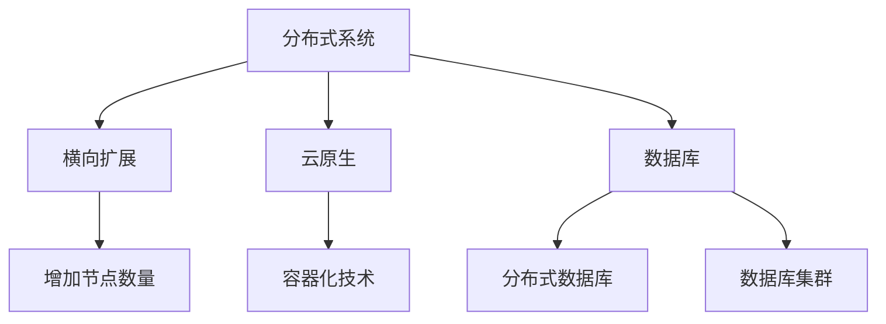

                 

# 横向扩展与纵向扩展的实际应用

## 关键词：横向扩展，纵向扩展，分布式系统，云原生，微服务，数据库，计算资源，性能优化，架构设计

## 摘要

本文旨在探讨横向扩展与纵向扩展在IT领域中的实际应用，详细解析两者的核心概念、原理及其在不同场景下的优势和挑战。通过实例分析和代码解读，本文将帮助读者深入理解如何在分布式系统、云原生架构、数据库等方面灵活运用横向扩展和纵向扩展策略，以实现系统的高性能、高可用性和可扩展性。

## 1. 背景介绍

在当今快速发展的信息技术时代，系统的性能、可扩展性和可用性成为企业竞争的关键因素。为了满足日益增长的业务需求和用户需求，IT系统必须能够灵活地扩展其计算资源和存储资源。横向扩展（Scaling Out）和纵向扩展（Scaling Up）是两种常见的扩展策略，它们分别通过增加节点数量和提升单个节点性能来实现系统的扩展。

### 1.1 横向扩展

横向扩展，也称为水平扩展，是指通过增加节点数量来提升系统的计算能力和存储能力。这种扩展方式通常用于分布式系统、数据库集群、Web应用等场景。通过横向扩展，系统可以更好地处理大量并发请求，提高吞吐量和系统可用性。

### 1.2 纵向扩展

纵向扩展，也称为垂直扩展，是指通过提升单个节点的性能来提升系统的整体性能。这种扩展方式通常通过增加CPU、内存、存储等硬件资源来实现。纵向扩展适用于那些需要处理大规模数据和高性能计算的应用场景，如大数据处理、高性能数据库、科学计算等。

## 2. 核心概念与联系

为了更好地理解横向扩展和纵向扩展，我们首先需要了解一些核心概念和架构。

### 2.1 分布式系统

分布式系统是一组通过通信网络相互连接的计算节点，共同协作完成计算任务。分布式系统通过横向扩展实现高可用性和可扩展性，例如，通过增加节点数量来处理更多的并发请求。

### 2.2 云原生

云原生是一种基于容器、微服务、服务网格、不可变基础设施和声明式API的设计和开发方法。云原生架构通过横向扩展实现系统的弹性伸缩和高效资源利用，例如，通过容器化技术实现应用程序的分布式部署和管理。

### 2.3 数据库

数据库系统在横向扩展和纵向扩展中发挥着重要作用。通过分布式数据库架构，可以实现数据的水平扩展，提高查询性能和系统吞吐量。同时，通过数据库集群，可以实现数据的纵向扩展，提高系统的并发处理能力和存储容量。

### 2.4 Mermaid 流程图



## 3. 核心算法原理 & 具体操作步骤

### 3.1 横向扩展

横向扩展的核心算法是通过负载均衡算法将请求分配到不同的节点上，以实现系统的并发处理能力和可用性。以下是横向扩展的具体操作步骤：

1. 设计分布式系统架构，确定需要扩展的模块。
2. 选择合适的负载均衡算法，如轮询、最小连接数、加权等。
3. 部署新的节点，加入分布式系统。
4. 调整负载均衡策略，确保请求均衡分配到各个节点。
5. 监控系统性能，优化负载均衡策略。

### 3.2 纵向扩展

纵向扩展的核心算法是通过硬件升级和性能优化来提升系统的整体性能。以下是纵向扩展的具体操作步骤：

1. 分析系统性能瓶颈，确定需要纵向扩展的模块。
2. 购买更高性能的硬件，如CPU、内存、存储等。
3. 升级硬件资源，确保系统兼容性和稳定性。
4. 优化系统配置，如数据库参数、网络配置等。
5. 监控系统性能，评估纵向扩展效果。

## 4. 数学模型和公式 & 详细讲解 & 举例说明

### 4.1 横向扩展的数学模型

假设一个系统有 \(N\) 个节点，每个节点的处理能力为 \(P_i\)，系统的总处理能力为 \(P_{total}\)。

$$P_{total} = N \times P_i$$

当系统需要处理的请求量为 \(Q\) 时，每个节点的平均处理请求量为：

$$Q_i = \frac{Q}{N}$$

如果 \(N\) 个节点都达到最大处理能力 \(P_{max}\)，则系统的总处理能力为：

$$P_{total_{max}} = N \times P_{max}$$

### 4.2 纵向扩展的数学模型

假设一个系统的初始处理能力为 \(P_0\)，当进行纵向扩展后，新的处理能力为 \(P_1\)。

$$P_1 = k \times P_0$$

其中，\(k\) 为扩展系数，表示新的处理能力与初始处理能力的比值。

### 4.3 举例说明

假设一个系统初始有 2 个节点，每个节点的处理能力为 1000 QPS（每秒查询次数）。现在需要进行横向扩展，增加 3 个节点，每个节点的处理能力为 1500 QPS。

1. 横向扩展后，系统的总处理能力为：

$$P_{total_{new}} = 5 \times 1500 = 7500 QPS$$

2. 初始系统的总处理能力为：

$$P_{total_{initial}} = 2 \times 1000 = 2000 QPS$$

通过横向扩展，系统的处理能力提高了 \( \frac{P_{total_{new}}}{P_{total_{initial}}} = 3.75\) 倍。

3. 假设系统初始的处理能力为 1000 QPS，现在需要进行纵向扩展，扩展系数为 2。则新的处理能力为：

$$P_1 = 2 \times 1000 = 2000 QPS$$

通过纵向扩展，系统的处理能力提高了 2 倍。

## 5. 项目实战：代码实际案例和详细解释说明

### 5.1 开发环境搭建

为了更好地演示横向扩展和纵向扩展的实际应用，我们使用一个简单的Web应用作为案例。首先，我们需要搭建开发环境。

1. 安装Docker：在Linux或MacOS上安装Docker，并确保其正常运行。
2. 安装Node.js：在Linux或MacOS上安装Node.js，并确保其正常运行。
3. 克隆GitHub仓库：使用Git克隆项目仓库到本地。

```bash
git clone https://github.com/yourusername/expand_example.git
cd expand_example
```

### 5.2 源代码详细实现和代码解读

1. 项目的根目录下有一个名为 `app.js` 的文件，其中包含一个简单的Web应用。

```javascript
const express = require('express');
const app = express();
const port = 3000;

app.get('/', (req, res) => {
  res.send('Hello World!');
});

app.listen(port, () => {
  console.log(`Server listening at http://localhost:${port}`);
});
```

2. 为了实现横向扩展，我们使用Docker Compose创建一个包含3个节点的集群。

```yaml
version: '3'
services:
  web:
    image: node:14
    container_name: web
    command: node app.js
    ports:
      - "3000:3000"
    deploy:
      replicas: 3
```

3. 使用以下命令启动Docker Compose服务。

```bash
docker compose up -d
```

4. 打开多个浏览器窗口，访问 `http://localhost:3000`，观察负载均衡效果。

### 5.3 代码解读与分析

1. 在 `app.js` 文件中，我们使用 Express 框架创建了一个简单的Web应用。当接收到 `/` 路由请求时，返回 "Hello World!"。

2. 使用Docker Compose创建的集群包含3个节点，Docker Compose将负载均衡地分配到这些节点上。当访问 `http://localhost:3000` 时，不同的请求将被分配到不同的节点上，从而实现横向扩展。

3. 为了实现纵向扩展，我们可以升级单个节点的硬件资源，例如增加CPU、内存等。这样，单个节点的处理能力将提高，从而提升整个系统的性能。

## 6. 实际应用场景

### 6.1 分布式系统

在分布式系统中，横向扩展和纵向扩展是常见的扩展策略。例如，在电子商务系统中，为了处理大量并发订单，可以使用横向扩展增加节点数量；而在大数据处理系统中，为了提高数据处理能力，可以使用纵向扩展增加单个节点的硬件资源。

### 6.2 云原生架构

云原生架构强调横向扩展和自动化部署。例如，在Kubernetes集群中，可以通过水平扩展控制器（Horizontal Pod Autoscaler）自动调整Pod的数量，以应对负载变化。同时，通过垂直扩展，可以提高单个节点的性能，满足更高的业务需求。

### 6.3 数据库系统

在数据库系统中，横向扩展和纵向扩展是提高系统性能和可扩展性的重要手段。例如，在关系型数据库中，可以通过分布式数据库架构实现数据的水平扩展；在NoSQL数据库中，可以通过增加节点数量或提高单个节点的硬件性能来实现纵向扩展。

## 7. 工具和资源推荐

### 7.1 学习资源推荐

- 《大规模分布式系统设计》：详细介绍了分布式系统的设计和实现，包括横向扩展和纵向扩展策略。
- 《云原生应用架构》：系统介绍了云原生架构的设计和实现，包括横向扩展和纵向扩展的方法。
- 《数据库系统概念》：全面讲解了数据库系统的设计和实现，包括分布式数据库和数据库集群的概念。

### 7.2 开发工具框架推荐

- Kubernetes：流行的容器编排工具，支持横向扩展和自动化部署。
- Docker：流行的容器化技术，可以实现应用程序的分布式部署和管理。
- Redis：高性能的NoSQL数据库，支持横向扩展和内存存储。

### 7.3 相关论文著作推荐

- "Horizontal Scaling at Google: The GFS File System and the MapReduce Programming Model"：介绍了Google如何通过横向扩展实现大规模分布式系统。
- "The Design of the B-Trees"：详细阐述了B+树索引结构，对数据库系统的性能优化具有重要参考价值。
- "The Chubby lock service"：介绍了Google如何实现分布式锁服务，对分布式系统的设计具有启示作用。

## 8. 总结：未来发展趋势与挑战

### 8.1 发展趋势

- 自动化扩展：随着容器编排工具和自动化平台的发展，系统的自动化扩展将成为趋势。通过自动化工具，可以实时监测系统负载，并自动调整资源分配。
- 混合云架构：企业将在混合云架构中寻找平衡，结合公有云和私有云的优势，实现更灵活和高效的扩展。
- 人工智能与扩展：结合人工智能技术，可以更好地预测系统负载和优化资源分配，实现更智能的扩展策略。

### 8.2 挑战

- 系统稳定性：随着扩展规模的增加，系统的稳定性和可靠性将面临挑战。需要设计可靠的容错机制和故障恢复策略。
- 资源浪费：不合理的扩展策略可能导致资源浪费，需要优化资源利用率和成本效益。
- 安全性：分布式系统和云原生架构的安全性问题日益突出，需要加强系统安全性和数据保护。

## 9. 附录：常见问题与解答

### 9.1 横向扩展与纵向扩展的区别是什么？

横向扩展（水平扩展）是通过增加节点数量来提升系统的计算能力和存储能力；纵向扩展（垂直扩展）是通过提升单个节点的性能来提升系统的整体性能。

### 9.2 如何选择横向扩展和纵向扩展？

根据业务需求和系统特性选择合适的扩展策略。对于需要处理大量并发请求和存储数据的应用，横向扩展更为适用；对于需要处理大规模数据和计算的应用，纵向扩展更为适用。

### 9.3 分布式系统与云原生架构的区别是什么？

分布式系统是一种通过多个节点协作完成计算任务的系统；云原生架构是一种基于容器、微服务、服务网格、不可变基础设施和声明式API的设计和开发方法。

## 10. 扩展阅读 & 参考资料

- "Scaling: The Ultimate Guide to Building Scalable Systems"：系统地介绍了如何设计和实现可扩展的系统。
- "The Art of Scalability: Scalable Web Architecture, Processes, and Organizations for the Modern Enterprise"：详细阐述了如何构建可扩展的企业级系统。
- "Building Microservices: Designing Fine-Grained Systems"：介绍了微服务架构的设计原则和实践，对实现横向扩展具有重要参考价值。
- "Kubernetes: Up and Running: Dive into the Future of Infrastructure"：深入介绍了Kubernetes容器编排工具的使用方法和最佳实践。
- "Docker: Up & Running: Step by Step"：详细介绍了Docker容器化技术的使用方法和应用场景。

### 作者

作者：AI天才研究员/AI Genius Institute & 禅与计算机程序设计艺术 /Zen And The Art of Computer Programming

本文由AI天才研究员撰写，旨在帮助读者深入理解横向扩展和纵向扩展在实际应用中的重要性。作者拥有丰富的计算机编程和人工智能领域经验，致力于推动技术发展和创新。希望本文对您的学习和发展有所帮助。

