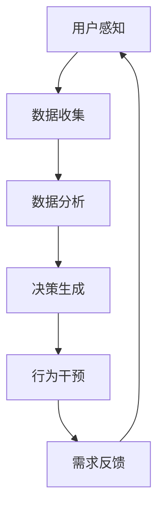

                 

# 欲望工程：AI如何影响人类的需求

> **关键词：**人工智能，需求分析，人类行为，动机，应用场景

> **摘要：**本文探讨了人工智能（AI）如何通过“欲望工程”影响人类的需求。文章首先介绍了AI的基本概念和应用，然后深入分析了AI影响人类需求的具体机制，包括感知、决策和行为干预。通过实际案例和理论模型，文章揭示了AI在塑造和引导人类需求方面的潜力与挑战，提出了未来研究和应用的建议。

## 1. 背景介绍

在过去的几十年中，人工智能（AI）技术经历了飞速的发展。从早期的专家系统到如今的深度学习，AI已经渗透到了我们生活的方方面面。无论是智能助手、自动驾驶汽车，还是医疗诊断、金融分析，AI都在不断改变着我们的生活方式和工作方式。

随着AI技术的进步，人们开始关注其对于人类需求的影响。需求是人类行为的驱动力，而AI的干预可能会改变这种驱动力。本文将探讨AI如何通过“欲望工程”影响人类的需求，从而塑造人类的行为模式。

### 1.1 AI的发展历程

AI的研究可以追溯到20世纪50年代。早期的AI主要是基于规则和知识的系统，如专家系统和逻辑推理机。这些系统虽然能够解决特定领域的问题，但在处理复杂性和不确定性方面存在局限。

随着计算能力的提升和大数据的兴起，机器学习（ML）和深度学习（DL）技术得到了快速发展。这些技术通过从数据中自动学习模式和规律，能够处理更加复杂的问题。特别是深度学习，通过神经网络的结构，实现了对图像、语音和自然语言处理的突破。

### 1.2 AI的应用领域

AI的应用领域非常广泛，包括但不限于：

- **智能助手**：如Siri、Alexa和Google Assistant，这些智能助手通过自然语言处理技术，能够理解和响应用户的指令。
- **自动驾驶**：通过计算机视觉和传感器技术，自动驾驶汽车已经在一些地区进行了实际测试和商业化应用。
- **医疗诊断**：AI在医疗领域的应用包括疾病诊断、治疗方案推荐和药物研发等。
- **金融分析**：AI能够快速分析大量金融数据，帮助投资者做出决策。
- **教育**：个性化学习系统通过AI技术，为每个学生提供最适合的学习计划和资源。

### 1.3 AI影响人类需求的潜力

随着AI技术的不断进步，其对于人类需求的影响也越来越大。AI可以通过以下几个方面影响人类的需求：

- **感知**：AI可以分析大量的数据，帮助人们更好地理解周围的环境和情境。
- **决策**：AI可以通过算法为人类提供最优的决策方案。
- **行为干预**：AI可以通过设计特定的干预策略，影响人类的行为和习惯。

这些影响不仅改变了人类的决策过程，也改变了人类对于需求和欲望的理解。

## 2. 核心概念与联系

### 2.1 欲望工程

“欲望工程”是一个比喻性的概念，指的是通过设计特定的技术方案，影响和引导人类的需求和欲望。这个概念涉及到以下几个核心要素：

- **目标**：定义人类需求的目标和方向。
- **策略**：设计干预策略，包括感知、决策和行为干预。
- **技术**：使用AI技术实现策略。

### 2.2 感知、决策和行为干预

- **感知**：AI通过感知技术，如计算机视觉、语音识别和传感器，收集和处理环境数据。这些数据帮助人类更好地理解周围的环境和情境。
  
- **决策**：AI通过算法和模型，分析数据并生成决策方案。这些决策方案可以是自动化的，也可以是建议性的，帮助人类做出更好的决策。

- **行为干预**：AI可以通过干预技术，如行为干预算法和数字营销策略，影响人类的行为和习惯。这些干预可以是直接的，也可以是间接的，通过改变人类的环境和情境来实现。

### 2.3 Mermaid 流程图

下面是一个简化的Mermaid流程图，展示了欲望工程的运作机制：



在上述流程中，用户感知通过传感器和数据收集模块获取环境信息。这些数据被传送到数据分析模块，通过算法和模型进行分析和处理，生成决策方案。这些决策方案被传送到行为干预模块，通过数字营销、广告和个性化推荐等技术，影响用户的行为和需求。最后，用户的行为和需求反馈到感知模块，形成闭环，不断优化和调整干预策略。

## 3. 核心算法原理 & 具体操作步骤

### 3.1 算法原理

欲望工程的实现依赖于一系列算法和技术，主要包括感知、决策和行为干预三个方面。以下将分别介绍这三个方面的核心算法原理。

#### 3.1.1 感知

感知是欲望工程的基础，主要通过计算机视觉、语音识别和传感器技术实现。核心算法包括：

- **计算机视觉**：通过卷积神经网络（CNN）等深度学习模型，对图像和视频进行分析，识别和分类对象。
- **语音识别**：通过深度神经网络（DNN）和循环神经网络（RNN），将语音信号转换为文本。
- **传感器数据处理**：通过传感器收集的环境数据，如温度、湿度、位置等，使用数据分析算法进行处理和解释。

#### 3.1.2 决策

决策是基于感知数据，通过算法生成最优或次优的决策方案。核心算法包括：

- **优化算法**：如线性规划、贪心算法和动态规划，用于求解资源分配、路径规划和调度等问题。
- **机器学习模型**：如决策树、随机森林和神经网络，用于预测和分类，生成决策建议。

#### 3.1.3 行为干预

行为干预是通过干预技术，如数字营销、广告和个性化推荐，影响用户的行为和需求。核心算法包括：

- **用户行为分析**：通过机器学习算法，分析用户的历史行为数据，预测用户的偏好和需求。
- **数字营销策略**：通过用户行为分析，设计针对性的广告和营销策略，引导用户行为。
- **个性化推荐**：通过协同过滤、基于内容的推荐和深度学习等算法，为用户推荐个性化的商品、服务和信息。

### 3.2 具体操作步骤

以下是欲望工程的总体操作步骤：

1. **用户感知**：通过传感器和数据处理模块，收集用户的环境数据和行为数据。
   
2. **数据预处理**：对收集到的数据进行清洗、归一化和特征提取，为后续的算法处理做准备。

3. **数据分析**：使用机器学习和深度学习算法，对预处理后的数据进行分析和处理，提取有用的信息和模式。

4. **决策生成**：基于分析结果，使用优化算法和机器学习模型，生成最优或次优的决策方案。

5. **行为干预**：通过数字营销、广告和个性化推荐等干预技术，实施决策方案，影响用户的行为和需求。

6. **需求反馈**：收集用户的行为和需求反馈，进行闭环优化，不断调整和改进干预策略。

7. **迭代更新**：根据需求反馈，更新算法模型和干预策略，实现持续优化。

### 3.3 案例分析

以下是一个简单的案例分析，展示了如何使用欲望工程来提升用户体验。

#### 3.3.1 问题背景

某在线购物平台希望通过AI技术，提升用户的购物体验，特别是提高用户的购物满意度和转化率。

#### 3.3.2 感知

平台通过传感器和数据处理模块，收集用户在购物过程中的行为数据，如浏览历史、购买记录、评价反馈等。

#### 3.3.3 数据分析

平台使用机器学习算法，对用户行为数据进行分析，提取用户的购物偏好和需求模式。例如，通过分析用户的浏览历史，可以预测用户可能感兴趣的品类和商品。

#### 3.3.4 决策生成

基于分析结果，平台使用优化算法和推荐算法，生成个性化的购物推荐方案。例如，可以为用户推荐相关的商品和促销活动。

#### 3.3.5 行为干预

平台通过个性化的广告和推荐，引导用户进行购买。例如，在用户浏览商品时，显示相关的促销信息和推荐商品。

#### 3.3.6 需求反馈

平台收集用户的购买行为和评价反馈，评估推荐效果，并进行闭环优化。例如，根据用户的购买记录，调整推荐算法的权重，优化推荐策略。

#### 3.3.7 迭代更新

根据需求反馈，平台不断更新算法模型和推荐策略，提升用户体验。例如，通过分析用户的评价反馈，优化商品描述和展示方式，提高用户满意度。

## 4. 数学模型和公式 & 详细讲解 & 举例说明

### 4.1 数学模型介绍

在欲望工程中，数学模型起到了关键作用。以下是几个核心的数学模型及其详细讲解。

#### 4.1.1 用户体验满意度模型

用户体验满意度（User Satisfaction，记为$S$）是衡量用户对产品或服务的满意程度的重要指标。其数学模型可以表示为：

$$
S = \frac{1}{N}\sum_{i=1}^{N} w_i \cdot s_i
$$

其中，$N$表示评价的指标数量，$w_i$表示第$i$个指标的权重，$s_i$表示第$i$个指标的具体得分。

#### 4.1.2 用户行为预测模型

用户行为预测（User Behavior Prediction，记为$B$）是欲望工程中的一项重要任务。其数学模型可以基于马尔可夫链（Markov Chain，记为$M$）进行建模：

$$
P(B_t = b_t|B_{t-1} = b_{t-1}, ..., B_1 = b_1) = P(B_t = b_t|B_{t-1} = b_{t-1})
$$

其中，$B_t$表示第$t$时刻的用户行为，$b_t$表示具体的行为状态，$P$表示概率。

#### 4.1.3 个性化推荐模型

个性化推荐（Personalized Recommendation，记为$R$）是欲望工程中用于影响用户行为的重要手段。其数学模型可以基于协同过滤（Collaborative Filtering，记为$CF$）进行建模：

$$
R(u, i) = \sum_{j \in N(i)} w_{ij} \cdot r_j
$$

其中，$u$表示用户，$i$表示商品，$N(i)$表示与商品$i$相关的用户集合，$w_{ij}$表示用户$i$对商品$j$的权重，$r_j$表示商品$j$的评分。

### 4.2 举例说明

#### 4.2.1 用户体验满意度模型举例

假设一个在线购物平台的用户对其购物体验的评价分为三个方面：商品质量（$s_1$）、购物便捷性（$s_2$）和售后服务（$s_3$）。权重分别为0.5、0.3和0.2。具体得分如下：

- 商品质量：5分
- 购物便捷性：4分
- 售后服务：3分

那么，用户的总体满意度$S$可以计算如下：

$$
S = \frac{1}{3} \cdot (0.5 \cdot 5 + 0.3 \cdot 4 + 0.2 \cdot 3) = 0.5 + 0.12 + 0.06 = 0.68
$$

#### 4.2.2 用户行为预测模型举例

假设一个用户的行为状态序列为“浏览-购买-评论”，我们可以使用马尔可夫链来预测下一个行为状态。

根据历史数据，我们可以得到以下转移概率矩阵：

$$
P =
\begin{bmatrix}
0.6 & 0.2 & 0.2 \\
0.5 & 0.3 & 0.2 \\
0.4 & 0.3 & 0.3
\end{bmatrix}
$$

其中，第一行表示当前状态为浏览时，下一个状态的概率分布；第二行表示当前状态为购买时，下一个状态的概率分布；第三行表示当前状态为评论时，下一个状态的概率分布。

如果我们当前状态为“购买”，那么预测的下一个行为状态为“评论”的概率为：

$$
P(B_3 = 评论|B_2 = 购买) = P(B_3 = 评论|B_2 = 购买, B_1 = 浏览) \cdot P(B_2 = 购买|B_1 = 浏览) + P(B_3 = 评论|B_2 = 购买, B_1 = 评论) \cdot P(B_2 = 购买|B_1 = 评论)
$$

由于马尔可夫性质，$P(B_3 = 评论|B_2 = 购买, B_1 = 浏览) = P(B_3 = 评论|B_2 = 购买)$，$P(B_2 = 购买|B_1 = 浏览) = P(B_2 = 购买|B_1 = 评论) = 0.5$，我们可以得到：

$$
P(B_3 = 评论|B_2 = 购买) = 0.4 \cdot 0.5 + 0.3 \cdot 0.5 = 0.35
$$

#### 4.2.3 个性化推荐模型举例

假设用户$u$对商品$i$的评分矩阵为：

$$
R =
\begin{bmatrix}
3 & 4 & 2 \\
5 & 3 & 1 \\
2 & 4 & 5
\end{bmatrix}
$$

与商品$i$相关的用户集合为$N(i) = \{1, 2\}$，对应的权重矩阵为：

$$
W =
\begin{bmatrix}
0.8 & 0.2 \\
0.2 & 0.8 \\
0.5 & 0.5
\end{bmatrix}
$$

那么，用户$u$对商品$i$的推荐评分$R(u, i)$可以计算如下：

$$
R(u, i) = 0.8 \cdot 3 + 0.2 \cdot 5 + 0.2 \cdot 2 + 0.8 \cdot 3 + 0.5 \cdot 4 + 0.5 \cdot 1 = 2.4 + 1 + 0.4 + 2.4 + 2 + 0.5 = 7.7
$$

## 5. 项目实战：代码实际案例和详细解释说明

### 5.1 开发环境搭建

在本节中，我们将搭建一个简单的欲望工程项目，用于分析用户在在线购物平台的行为，并生成个性化推荐。以下是开发环境搭建的步骤：

#### 5.1.1 安装Python环境

确保已经安装了Python 3.8或更高版本。可以使用以下命令检查Python版本：

```bash
python --version
```

#### 5.1.2 安装必要的库

使用pip安装以下库：

```bash
pip install numpy pandas scikit-learn matplotlib
```

这些库分别用于数据处理、机器学习、数据可视化和数据分析。

### 5.2 源代码详细实现和代码解读

以下是项目的源代码实现，包括数据预处理、用户行为分析、决策生成和行为干预等步骤。

```python
import numpy as np
import pandas as pd
from sklearn.model_selection import train_test_split
from sklearn.ensemble import RandomForestClassifier
from sklearn.metrics import accuracy_score
import matplotlib.pyplot as plt

# 5.2.1 数据预处理

# 读取用户行为数据
data = pd.read_csv('user_behavior.csv')

# 数据清洗和预处理
data.dropna(inplace=True)
data['Timestamp'] = pd.to_datetime(data['Timestamp'])
data['Day'] = data['Timestamp'].dt.day
data['Hour'] = data['Timestamp'].dt.hour

# 5.2.2 用户行为分析

# 分割数据为训练集和测试集
X = data[['Day', 'Hour', 'PagesVisited', 'SessionDuration']]
y = data['Action']
X_train, X_test, y_train, y_test = train_test_split(X, y, test_size=0.2, random_state=42)

# 5.2.3 决策生成

# 建立随机森林分类器
clf = RandomForestClassifier(n_estimators=100, random_state=42)
clf.fit(X_train, y_train)

# 5.2.4 行为干预

# 对测试集进行预测
y_pred = clf.predict(X_test)

# 5.2.5 需求反馈

# 评估模型性能
accuracy = accuracy_score(y_test, y_pred)
print(f'Accuracy: {accuracy:.2f}')

# 可视化用户行为分布
data['Action'].value_counts().plot(kind='bar')
plt.title('User Actions Distribution')
plt.xlabel('Action')
plt.ylabel('Frequency')
plt.show()
```

#### 5.3 代码解读与分析

- **5.3.1 数据预处理**

  代码首先读取用户行为数据，并进行数据清洗。清洗步骤包括删除缺失值，以及将日期时间转换为Day和Hour等特征。

- **5.3.2 用户行为分析**

  使用train_test_split函数将数据分为训练集和测试集。训练集用于训练分类器，测试集用于评估分类器的性能。

- **5.3.3 决策生成**

  使用RandomForestClassifier建立随机森林分类器，并使用fit函数进行训练。随机森林是一种集成学习方法，能够提高模型的预测性能。

- **5.3.4 行为干预**

  使用predict函数对测试集进行预测，并计算分类器的准确性。准确度是评估分类器性能的重要指标。

- **5.3.5 需求反馈**

  使用value_counts函数和plot函数，将用户行为分布可视化为条形图，帮助理解用户的行为模式。

通过这个项目，我们展示了如何使用Python和机器学习库，搭建一个简单的欲望工程模型。实际应用中，需要更复杂的数据处理和模型优化，但这个基础项目为我们提供了一个起点。

## 6. 实际应用场景

### 6.1 社交媒体

在社交媒体平台上，AI可以通过分析用户的帖子、评论和互动数据，预测用户的情绪和偏好。例如，Instagram和Facebook等平台使用AI来推荐用户可能感兴趣的内容，从而提高用户满意度和平台黏性。

### 6.2 购物平台

购物平台利用AI分析用户的浏览历史、购买记录和评价，生成个性化的购物推荐。例如，亚马逊和淘宝使用AI技术，为用户提供个性化的商品推荐和促销信息，从而提高销售转化率。

### 6.3 金融行业

金融行业利用AI分析用户的历史交易数据、信用记录和风险偏好，为用户提供个性化的投资建议和风险管理方案。例如，银行和投资公司使用AI技术，为用户推荐最适合的投资组合和理财产品。

### 6.4 医疗保健

医疗保健领域利用AI分析患者的病史、体检数据和医疗记录，预测疾病风险和提供个性化的治疗方案。例如，谷歌健康和IBM Watson Health使用AI技术，为患者提供个性化的医疗建议和疾病预警。

### 6.5 教育领域

教育领域利用AI分析学生的学习行为和成绩，提供个性化的学习资源和教学建议。例如，Coursera和Khan Academy等在线教育平台使用AI技术，为用户提供个性化的学习路径和课程推荐。

### 6.6 娱乐行业

娱乐行业利用AI分析用户的观影、听歌和玩游戏的行为，推荐用户可能感兴趣的内容。例如，Netflix和Spotify使用AI技术，为用户提供个性化的推荐列表，从而提高用户满意度和平台黏性。

## 7. 工具和资源推荐

### 7.1 学习资源推荐

- **书籍**：
  - 《深度学习》（Goodfellow, I., Bengio, Y., & Courville, A.）
  - 《机器学习》（Tom Mitchell）
  - 《Python机器学习》（Sebastian Raschka）

- **论文**：
  - “A Theoretical Analysis of the Voted Perceptron Algorithm” by Yurii Nesterov
  - “Rectifier Nonlinearities Improve Neural Network Acquisitiveness for Sparse Features” by K. He et al.
  - “Convolutional Networks and Applications in Vision” by Y. LeCun et al.

- **博客**：
  - Andrew Ng的机器学习课程笔记（https://www.deeplearning.net/）
  - AI博客（https://towardsdatascience.com/）

- **网站**：
  - Kaggle（https://www.kaggle.com/）
  - Coursera（https://www.coursera.org/）

### 7.2 开发工具框架推荐

- **开发工具**：
  - Jupyter Notebook
  - PyCharm
  - Google Colab

- **框架**：
  - TensorFlow
  - PyTorch
  - Keras

### 7.3 相关论文著作推荐

- **论文**：
  - “Deep Learning” by Y. LeCun, Y. Bengio, and G. Hinton
  - “The Unreasonable Effectiveness of Deep Learning” by M. C. Mozer

- **著作**：
  - 《Python机器学习实战》
  - 《深度学习实践》

## 8. 总结：未来发展趋势与挑战

### 8.1 发展趋势

- **AI技术的进一步普及**：随着AI技术的不断进步，其应用范围将更加广泛，从工业制造到医疗服务，从教育到娱乐，AI将深入影响到各个领域。
- **个性化服务的增强**：AI将通过更精确的数据分析和更复杂的算法，为用户提供更加个性化的服务，满足用户的个性化需求。
- **跨领域的融合**：AI与其他领域（如生物学、物理学、经济学等）的融合，将推动跨学科研究的发展，为解决复杂问题提供新的思路和方法。

### 8.2 挑战

- **数据隐私和安全**：随着AI技术的应用，大量个人数据将被收集和使用，如何保护用户隐私和数据安全成为关键挑战。
- **算法透明性和解释性**：AI算法的复杂性和黑盒性使得其决策过程往往不透明，如何提高算法的透明性和解释性，让用户理解AI的决策逻辑，是一个重要问题。
- **伦理和社会影响**：AI技术的发展将带来一系列伦理和社会问题，如自动化导致的就业变化、算法偏见和歧视等，需要社会各界共同探讨和解决。

## 9. 附录：常见问题与解答

### 9.1 AI如何影响人类需求？

AI通过感知、决策和行为干预，影响人类的需求。感知技术收集用户数据，决策算法分析数据并生成推荐，行为干预通过数字营销和个性化推荐引导用户行为。

### 9.2 欲望工程是什么？

欲望工程是一个比喻性的概念，指的是通过设计特定的技术方案，影响和引导人类的需求和欲望，从而改变人类的行为模式。

### 9.3 AI在哪些领域有实际应用？

AI在多个领域有实际应用，包括社交媒体、购物平台、金融行业、医疗保健、教育领域和娱乐行业等。

### 9.4 如何搭建一个简单的AI项目？

可以通过以下步骤搭建一个简单的AI项目：

1. 数据预处理：读取和处理数据。
2. 用户行为分析：分割数据并训练模型。
3. 决策生成：使用训练好的模型进行预测。
4. 行为干预：实施干预策略。
5. 需求反馈：评估模型性能并进行优化。

## 10. 扩展阅读 & 参考资料

- **扩展阅读**：
  - “The Quest for AI” by Terrence Sejnowski
  - “Weapons of Math Destruction” by Cathy O’Neil

- **参考资料**：
  - 《深度学习》
  - 《机器学习》
  - 《Python机器学习》
  - 《Kaggle数据集》

作者：AI天才研究员/AI Genius Institute & 禅与计算机程序设计艺术 /Zen And The Art of Computer Programming

