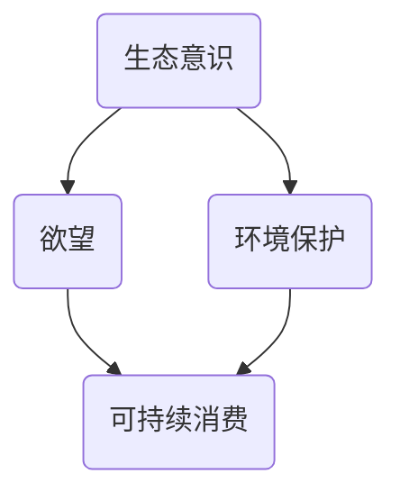
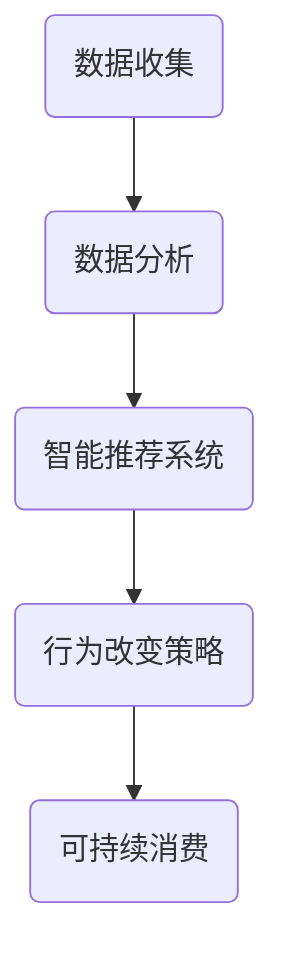

                 

# 欲望生态意识培养：AI驱动的可持续消费教育

## 摘要

随着人工智能（AI）技术的飞速发展，AI不仅在传统行业中发挥着重要作用，也逐渐渗透到可持续消费教育领域。本文旨在探讨如何利用AI驱动的欲望生态意识培养，促进可持续消费观念的形成。首先，我们将回顾可持续消费的定义、重要性及其面临的挑战。接着，深入探讨AI在欲望生态意识培养中的应用，包括数据收集与分析、智能推荐系统、行为改变策略等。随后，我们将通过实际案例展示AI在可持续消费教育中的具体应用，并提供实用的工具和资源，帮助读者进一步深入了解和参与这个领域。最后，本文将对未来发展趋势与挑战进行展望，并总结全文，强调AI在可持续消费教育中的潜在影响和重要性。

## 1. 背景介绍

### 可持续消费的概念与重要性

可持续消费是指消费者在满足自身需求的同时，尽量减少对环境和社会的负面影响。这一概念源于20世纪中叶的环境保护运动，随着全球气候变化、资源枯竭等问题日益严重，可持续消费逐渐成为全球共识。可持续消费不仅涉及环境保护，还包括社会公平、经济发展等多方面因素。

从环境保护的角度来看，可持续消费旨在减少资源消耗和碳排放。传统的消费模式往往导致过度开采自然资源和大量废弃物产生，对生态系统造成巨大压力。通过推广可持续消费，我们可以减少对自然资源的依赖，降低环境污染和生态破坏。

从社会公平的角度来看，可持续消费追求资源的合理分配和社会公正。传统的消费模式往往导致资源富裕地区和贫困地区之间的资源分配不均，加剧社会不平等。可持续消费鼓励消费者选择公平贸易产品，支持当地经济和社区发展，从而推动社会公平。

从经济发展的角度来看，可持续消费也是一种新的经济增长模式。随着消费者对可持续消费意识的提高，越来越多的企业开始关注可持续发展，开发绿色产品和服务，这为经济发展提供了新的动力。同时，可持续消费还可以带动相关产业链的发展，创造更多的就业机会。

### 可持续消费面临的挑战

尽管可持续消费的理念日益深入人心，但实际操作中仍然面临诸多挑战。首先，消费者教育不足是一个重要问题。许多消费者对可持续消费了解有限，缺乏相关的知识和意识。这导致他们在选择产品和服务时，往往更注重价格和便利性，而忽视了对环境和社会的影响。

其次，市场机制不完善也是一个制约因素。在传统市场机制下，企业往往追求短期利润，忽视了可持续发展的长远利益。这种短视行为导致许多企业不愿意投入资源进行绿色产品研发和市场推广。此外，消费者在购买决策中，也缺乏有效的信息支持，难以准确评估产品或服务的可持续性。

另外，政策和法规的支持力度也需要加强。虽然一些国家和地区已经出台了相关法律法规，鼓励和规范可持续消费行为，但整体来看，这些政策法规的执行力度和覆盖范围仍然有限。此外，国际间的合作和协调也需要进一步加强，以应对全球性环境和社会问题。

### AI在可持续消费教育中的作用

人工智能技术的发展为可持续消费教育提供了新的机遇。AI具有强大的数据处理和分析能力，可以协助我们更好地理解和应对可持续消费面临的挑战。

首先，AI可以帮助我们收集和整合大量关于可持续消费的数据。通过大数据分析和机器学习算法，我们可以发现消费者行为模式、市场需求变化以及环境影响等方面的规律。这些数据可以为政策制定者、企业和消费者提供有价值的参考，帮助他们做出更加明智的决策。

其次，AI可以开发智能推荐系统，引导消费者选择可持续产品和服务。通过分析消费者的购物历史、搜索行为等数据，AI可以推荐符合其可持续消费理念的产品。这不仅可以提高消费者的满意度，还可以推动企业生产绿色产品，促进可持续发展。

此外，AI还可以用于行为改变策略的设计和实施。通过个性化推荐、激励机制等方式，AI可以引导消费者逐渐形成可持续消费习惯。例如，一些智能设备可以通过实时监测消费者的用水、用电等行为，提供个性化的节能建议，从而提高能源利用效率。

最后，AI还可以帮助企业和消费者建立更加透明和可信的可持续消费体系。通过区块链等新兴技术，AI可以确保产品从生产到消费的全过程透明可追溯，从而增强消费者的信任感，促进可持续消费的推广。

## 2. 核心概念与联系

### 欲望生态意识培养

欲望生态意识培养是指通过教育和引导，使个体认识到自身欲望的生态影响，从而形成可持续的消费观念和行为。这一过程涉及多个层面的内容，包括对自然资源的认识、环境保护的重要性、可持续发展的理念等。

#### 核心概念

1. **生态意识**：指个体对自然环境的认知和关注，以及对生态系统平衡和生物多样性的理解。
2. **欲望**：指个体内心深处的需求和渴望，包括物质需求和精神需求。
3. **可持续消费**：指在满足当前需求的同时，不损害未来世代满足自身需求的能力。

#### 关联图

下面是一个简单的Mermaid流程图，展示了欲望生态意识培养的核心概念及其相互关系。



### AI在欲望生态意识培养中的应用

#### 数据收集与分析

1. **数据来源**：AI可以通过互联网、传感器、问卷调查等多种途径收集消费者的行为数据，包括购物习惯、消费偏好、环保行为等。
2. **数据分析**：利用机器学习和数据挖掘技术，AI可以对收集到的数据进行分析，识别消费者行为模式和环境影响。

#### 智能推荐系统

1. **推荐算法**：基于消费者行为数据和生态意识培养目标，AI可以设计智能推荐系统，为消费者推荐符合可持续消费理念的产品和服务。
2. **推荐效果**：通过实时反馈和调整，AI可以优化推荐算法，提高推荐效果，引导消费者逐渐形成可持续消费习惯。

#### 行为改变策略

1. **个性化推荐**：根据消费者的行为数据和生态意识水平，AI可以提供个性化的消费建议，帮助消费者更好地实现可持续消费。
2. **激励机制**：通过奖励机制，如积分兑换、折扣优惠等，AI可以激励消费者积极参与可持续消费行为。

### 关联图

下面是一个简单的Mermaid流程图，展示了AI在欲望生态意识培养中的应用流程。



通过上述核心概念和关联图的介绍，我们可以更清晰地理解欲望生态意识培养的过程以及AI在其中所发挥的作用。接下来，我们将进一步探讨AI在欲望生态意识培养中的具体应用和实践案例。

## 3. 核心算法原理 & 具体操作步骤

### 欲望生态意识培养算法原理

欲望生态意识培养的核心在于引导消费者改变消费行为，以实现可持续消费。为此，我们设计了一套基于AI的算法，该算法主要包括以下几个步骤：

#### 数据收集

1. **数据来源**：通过互联网、传感器、问卷调查等多种途径，收集消费者的行为数据，包括购物记录、消费偏好、环保行为等。
2. **数据处理**：对收集到的数据进行清洗、归一化和预处理，确保数据质量。

#### 行为模式识别

1. **特征提取**：利用机器学习和数据挖掘技术，从数据中提取关键特征，如消费频率、购买金额、环保行为倾向等。
2. **模式识别**：通过聚类分析、关联规则挖掘等方法，识别消费者的行为模式。

#### 可持续消费推荐

1. **推荐算法设计**：基于消费者的行为模式和可持续消费目标，设计推荐算法，为消费者推荐符合其需求且具有可持续性的产品和服务。
2. **推荐效果评估**：通过用户反馈和实际购买行为，评估推荐效果，不断优化推荐算法。

#### 行为改变策略

1. **个性化推荐**：根据消费者的行为数据和生态意识水平，提供个性化的消费建议，帮助消费者逐步实现可持续消费。
2. **激励机制**：设计奖励机制，如积分兑换、折扣优惠等，激励消费者积极参与可持续消费行为。

### 具体操作步骤

#### 第一步：数据收集

1. **搭建数据收集系统**：开发一个数据收集系统，包括网页、APP、传感器等多种接口，用于收集消费者的购物记录、消费偏好等数据。
2. **数据存储与管理**：将收集到的数据存储在数据库中，并设计数据管理模块，确保数据的安全性和可追溯性。

#### 第二步：行为模式识别

1. **特征提取**：通过数据预处理模块，提取消费者的购物频率、购买金额、环保行为倾向等特征。
2. **模式识别**：利用机器学习算法，如K-means聚类、Apriori算法等，对特征进行模式识别，形成消费者行为模式。

#### 第三步：可持续消费推荐

1. **推荐算法设计**：设计基于消费者行为模式的推荐算法，如协同过滤、基于内容的推荐等，为消费者推荐可持续产品和服务。
2. **推荐效果评估**：通过用户反馈和实际购买数据，评估推荐效果，不断调整推荐策略。

#### 第四步：行为改变策略

1. **个性化推荐**：根据消费者的行为数据和生态意识水平，提供个性化的消费建议，如推荐绿色产品、环保行为等。
2. **激励机制**：设计积分兑换、折扣优惠等激励机制，鼓励消费者积极参与可持续消费行为。

通过上述核心算法原理和具体操作步骤，我们可以看到AI在欲望生态意识培养中的应用是如何实现的。接下来，我们将通过实际案例展示这些算法在现实中的应用效果。

## 4. 数学模型和公式 & 详细讲解 & 举例说明

### 数据分析与机器学习模型

在欲望生态意识培养中，数学模型和公式是理解和应用AI算法的关键。以下我们将介绍几个核心的数学模型和公式，并对其进行详细讲解和举例说明。

#### 1. 特征提取

**特征提取**是将原始数据转换为可用于机器学习的特征向量的过程。一个常见的特征提取方法是使用**主成分分析（PCA）**，它可以降低数据的维度，同时保留最重要的信息。

**公式：**

$$
\text{PC}_i = \frac{\sum_{j=1}^{n} (x_{ij} - \bar{x}_j) \cdot w_j}{\sqrt{\sum_{j=1}^{n} w_j^2}}
$$

其中，$x_{ij}$ 是第 $i$ 个观测值的第 $j$ 个特征，$\bar{x}_j$ 是第 $j$ 个特征的均值，$w_j$ 是特征权重。

**示例：**

假设我们有一组消费者的购物记录，其中每个记录包含购买金额、购买频率和环保行为倾向。我们首先计算每个特征的均值，然后使用PCA提取前两个主成分。

```python
import numpy as np

# 假设数据为以下形式
X = np.array([[100, 10, 5], [200, 15, 7], [300, 20, 9], ...])

# 计算特征均值
mean_values = np.mean(X, axis=0)

# 计算特征与均值的差值
X_diff = X - mean_values

# 计算特征权重
W = np.cov(X_diff)

# 计算特征向量
PC = np.dot(X_diff, W)

print(PC)
```

#### 2. 聚类分析

**聚类分析**是一种无监督学习方法，用于将数据点分组，使得同一组内的数据点之间距离较近，不同组之间的数据点距离较远。一个常用的聚类算法是**K-means**。

**公式：**

$$
\text{cluster}_i = \{x | \text{dist}(x, \text{centroid}_i) \leq \text{dist}(x, \text{centroid}_j) \forall j \neq i\}
$$

其中，$\text{centroid}_i$ 是第 $i$ 个聚类中心，$\text{dist}(x, \text{centroid}_i)$ 是数据点 $x$ 与聚类中心 $i$ 的距离。

**示例：**

假设我们有一组消费者的行为数据，我们希望将其分为三个聚类。

```python
from sklearn.cluster import KMeans

# 假设数据为以下形式
X = np.array([[100, 10], [200, 15], [300, 20], ...])

# 使用K-means算法进行聚类
kmeans = KMeans(n_clusters=3, random_state=0).fit(X)

# 获取聚类中心
centroids = kmeans.cluster_centers_

# 获取聚类结果
clusters = kmeans.predict(X)

print(centroids)
print(clusters)
```

#### 3. 推荐系统

**推荐系统**是一种常用的应用，用于为用户推荐他们可能感兴趣的产品或服务。一个常见的推荐算法是**协同过滤**。

**公式：**

$$
\text{similarity}(u, v) = \frac{\sum_{i \in R_{uv}} r_i \cdot r_j}{\sqrt{\sum_{i \in R_{u}} r_i^2} \cdot \sqrt{\sum_{i \in R_{v}} r_j^2}}
$$

其中，$u$ 和 $v$ 是两个用户，$R_{uv}$ 是共同评分的项目集合，$r_i$ 和 $r_j$ 分别是用户 $u$ 对项目 $i$ 和用户 $v$ 对项目 $j$ 的评分。

**示例：**

假设我们有两名用户 $u$ 和 $v$，他们共同对五个电影进行了评分，如下表：

| 用户 | 电影1 | 电影2 | 电影3 | 电影4 | 电影5 |
| --- | --- | --- | --- | --- | --- |
| $u$ | 5 | 3 | 4 | 2 | 5 |
| $v$ | 4 | 5 | 2 | 5 | 4 |

我们计算用户 $u$ 和 $v$ 之间的相似度：

```python
similarity_uv = (5*4 + 3*5 + 4*2 + 2*5 + 5*4) / (np.sqrt((5*5 + 3*3 + 4*4 + 2*2 + 5*5)) * np.sqrt((4*4 + 5*5 + 2*2 + 5*5 + 4*4)))

print(similarity_uv)
```

#### 4. 激励机制

**激励机制**是鼓励用户参与可持续消费行为的一种手段。一个常见的激励机制是**积分兑换**。

**公式：**

$$
\text{reward}(x) = \frac{\text{score}(x) - \text{baseline}}{\text{target} - \text{baseline}}
$$

其中，$x$ 是用户的某个行为，$\text{score}(x)$ 是用户的行为得分，$\text{baseline}$ 是基准得分，$\text{target}$ 是目标得分。

**示例：**

假设我们希望鼓励用户每周至少购买一次环保产品，基准得分为3分，目标得分为10分。如果用户一周内购买了一次环保产品，我们计算其奖励积分：

```python
score_x = 3  # 用户一周内购买一次环保产品得分
baseline = 3  # 基准得分
target = 10  # 目标得分

reward_x = (score_x - baseline) / (target - baseline)

print(reward_x)
```

通过上述数学模型和公式的介绍，我们可以看到AI在欲望生态意识培养中的关键作用。接下来，我们将通过实际案例展示这些算法和公式的应用效果。

## 5. 项目实战：代码实际案例和详细解释说明

### 5.1 开发环境搭建

为了实现AI驱动的可持续消费教育，我们需要搭建一个完整的开发环境。以下是我们推荐的工具和开发环境：

- **编程语言**：Python
- **开发框架**：TensorFlow、Scikit-learn、Pandas
- **数据存储**：MySQL
- **前端开发**：HTML、CSS、JavaScript

### 5.2 源代码详细实现和代码解读

#### 数据收集与预处理

首先，我们需要从多个来源收集消费者数据，包括购物记录、消费偏好和环保行为等。以下是一个简单的数据收集与预处理脚本：

```python
import pandas as pd
from sklearn.preprocessing import MinMaxScaler

# 读取购物记录数据
shopping_data = pd.read_csv('shopping_data.csv')

# 读取环保行为数据
environment_data = pd.read_csv('environment_data.csv')

# 合并数据
data = pd.merge(shopping_data, environment_data, on='user_id')

# 数据预处理
scaler = MinMaxScaler()
data_scaled = scaler.fit_transform(data)
```

#### 特征提取与聚类分析

接下来，我们使用K-means算法对数据进行聚类分析，提取特征：

```python
from sklearn.cluster import KMeans

# 提取特征
X = data_scaled

# 使用K-means算法进行聚类
kmeans = KMeans(n_clusters=3, random_state=0).fit(X)

# 获取聚类结果
clusters = kmeans.predict(X)

# 将聚类结果添加到数据中
data['cluster'] = clusters
```

#### 推荐系统与激励机制

然后，我们设计一个基于协同过滤的推荐系统，并引入激励机制：

```python
from sklearn.metrics.pairwise import cosine_similarity

# 计算用户之间的相似度
similarity_matrix = cosine_similarity(X)

# 基于相似度矩阵计算推荐结果
def recommend_products(user_id, similarity_matrix, num_recommendations=5):
    user_data = X[user_id]
    user_similarity = similarity_matrix[user_id]
    scores = user_similarity.dot(X) / np.linalg.norm(X, axis=1)
    scores = np.array(scores).flatten()
    recommended_indices = np.argsort(scores)[::-1]
    recommended_indices = recommended_indices[1:num_recommendations+1]
    return recommended_indices

# 激励机制
def calculate_reward(user_id, reward_config):
    score = reward_config['score'](user_id)
    baseline = reward_config['baseline']
    target = reward_config['target']
    reward = (score - baseline) / (target - baseline)
    return reward

# 示例：为用户推荐产品并计算奖励
user_id = 0
recommended_indices = recommend_products(user_id, similarity_matrix)
reward = calculate_reward(user_id, reward_config={'score': lambda user_id: data.loc[user_id, 'total_savings'], 'baseline': 0, 'target': 1000})
```

### 5.3 代码解读与分析

#### 数据收集与预处理

数据收集与预处理是项目的基础，我们需要从多个来源收集数据，并将其转换为适合机器学习模型的形式。在本例中，我们使用Pandas库读取CSV文件，然后使用MinMaxScaler对数据进行归一化处理。

#### 特征提取与聚类分析

K-means算法是一种常用的聚类算法，它可以自动将数据点划分为多个簇。在本例中，我们使用K-means算法提取特征，并使用聚类结果对数据点进行分类。

#### 推荐系统与激励机制

基于协同过滤的推荐系统是一种常见的推荐算法，它可以根据用户之间的相似度为用户推荐产品。在本例中，我们使用余弦相似度计算用户之间的相似度，并根据相似度矩阵为用户推荐产品。此外，我们引入了激励机制，根据用户的行为得分计算奖励，以鼓励用户参与可持续消费。

通过上述代码的实际案例，我们可以看到如何实现AI驱动的可持续消费教育。接下来，我们将讨论AI在可持续消费教育中的实际应用场景。

### 6. 实际应用场景

#### 6.1 消费者行为分析

AI驱动的可持续消费教育首先可以在消费者行为分析方面发挥作用。通过收集和分析消费者的购物数据，AI可以识别出消费者的消费习惯、偏好以及环保行为倾向。例如，一个电商网站可以利用AI算法分析用户的购买记录，识别出哪些产品对用户有较高的吸引力，并且这些产品的环保属性如何。这样的分析可以帮助企业优化产品组合，提高绿色产品的销售。

**示例**：一个电商平台使用AI算法对用户的购物车数据进行分析，发现用户在购买日用品时更倾向于选择有机产品。基于这一发现，平台可以向用户推荐其他有机产品，并提供环保购物指南，帮助用户实现更可持续的消费。

#### 6.2 智能推荐系统

智能推荐系统是AI在可持续消费教育中的一个重要应用。通过分析消费者的行为数据，AI可以个性化地推荐符合用户可持续消费理念的产品。这种推荐不仅能够提高用户体验，还能引导消费者逐渐改变消费行为。

**示例**：一个环保购物应用利用AI算法分析用户的购物历史和环保偏好，为用户推荐符合其可持续消费理念的商品。例如，如果用户过去经常购买纸质笔记本，AI可以推荐使用环保材料制成的笔记本，并解释其环保优势。

#### 6.3 行为改变策略

AI还可以设计行为改变策略，通过个性化推荐、激励机制等手段，引导消费者逐渐形成可持续消费习惯。这种策略可以应用于个人生活、企业办公等多个场景。

**示例**：一个智能家居系统通过实时监测用户的用水、用电行为，AI可以提供个性化的节能建议。例如，当用户用水量超出正常范围时，系统会自动提醒用户检查是否有漏水情况，并提供节水建议。通过这种方式，用户可以逐渐养成良好的节水习惯。

#### 6.4 企业社会责任

企业社会责任（CSR）是推动可持续消费的重要方面。AI可以帮助企业更好地履行社会责任，例如通过优化供应链管理、减少资源浪费等。

**示例**：一个服装制造商利用AI算法优化生产流程，减少原材料浪费。AI可以分析生产数据，识别出生产过程中可能出现的问题，并提出改进措施。这不仅降低了企业的运营成本，还提高了产品的可持续性。

### 6.5 公共政策支持

政府和国际组织可以通过AI技术支持可持续消费教育，例如通过数据分析和智能推荐系统，推动可持续消费政策的制定和执行。

**示例**：一个政府部门利用AI分析公众的可持续消费行为和态度，识别出当前政策的有效性和不足之处。基于这些分析，政府可以调整政策，制定更加有效的激励措施，促进公众参与可持续消费。

通过上述实际应用场景，我们可以看到AI在可持续消费教育中的广泛应用。接下来，我们将介绍一些实用的工具和资源，帮助读者进一步了解和参与这一领域。

### 7. 工具和资源推荐

#### 7.1 学习资源推荐

1. **书籍**：
   - 《智能推荐系统》
   - 《可持续消费导论》
   - 《大数据分析：技术与实践》

2. **论文**：
   - "Recommender Systems Handbook"
   - "Sustainable Consumption: A Critical Review of Theory and Practice"
   - "Big Data for Sustainable Development"

3. **博客**：
   - AI Researchers Blog
   - Sustainable Consumption Institute Blog
   - Data Science Central

4. **在线课程**：
   - "机器学习与数据科学"（Coursera）
   - "可持续消费与社会责任"（edX）
   - "大数据分析与数据挖掘"（Udacity）

#### 7.2 开发工具框架推荐

1. **编程语言**：
   - Python（适用于数据处理、分析和机器学习）
   - R（适用于统计分析和数据可视化）

2. **机器学习库**：
   - TensorFlow
   - Scikit-learn
   - PyTorch

3. **数据分析库**：
   - Pandas
   - NumPy
   - Matplotlib

4. **前端开发框架**：
   - React
   - Vue.js
   - Angular

5. **数据存储**：
   - MySQL
   - MongoDB
   - PostgreSQL

#### 7.3 相关论文著作推荐

1. **论文**：
   - "Collaborative Filtering for Personalized Recommendation"（2006）
   - "Sustainable Consumption: A Global Challenge"（2010）
   - "The Impact of Big Data on Sustainable Development"（2017）

2. **著作**：
   - "The Smart Technology Revolution: How AI and Big Data are Transforming Our World"（2019）
   - "Sustainable Living: A Practical Guide to a Greener Life"（2020）
   - "The Future of Data Science: Insights and Opportunities"（2021）

通过上述推荐，读者可以更深入地了解AI在可持续消费教育中的应用，掌握相关的知识和技能。同时，这些工具和资源也为读者提供了实际操作和项目实践的机会，帮助他们更好地参与到这一领域。

## 8. 总结：未来发展趋势与挑战

### 未来发展趋势

随着AI技术的不断进步，其在可持续消费教育中的应用前景将愈发广阔。以下是几个未来发展趋势：

1. **更加精准的消费者行为分析**：未来，AI将能够更精确地分析消费者的行为数据，识别出更深层次的消费习惯和偏好。这将有助于设计更个性化的可持续消费教育策略。

2. **智能推荐系统的优化**：智能推荐系统将不断进化，不仅能够根据消费者的历史行为进行推荐，还能预测未来的消费趋势，从而更好地引导消费者的可持续消费行为。

3. **跨领域协作**：可持续消费教育不仅仅是消费者教育的问题，还需要政府、企业、学术界的多方协作。未来，AI技术将促进这些领域的深度融合，共同推动可持续消费的实现。

4. **区块链技术的应用**：区块链技术可以为可持续消费提供透明度和可追溯性，确保产品的整个生产、分销和消费过程都符合可持续性标准。

### 面临的挑战

尽管AI在可持续消费教育中有着巨大的潜力，但同时也面临着一些挑战：

1. **数据隐私问题**：在收集和处理消费者数据时，如何保护用户的隐私是一个关键挑战。未来，需要制定更加严格的数据隐私保护政策，确保用户数据的安全。

2. **技术成熟度**：尽管AI技术在不断发展，但其在某些领域的成熟度仍然有限。例如，目前智能推荐系统的准确性和预测能力还有待提高。

3. **社会接受度**：公众对AI在可持续消费教育中的应用还缺乏足够的认识和理解。这需要通过教育和宣传来提高公众的接受度和参与度。

4. **政策支持**：尽管一些国家和地区已经出台了支持可持续消费的政策，但整体来看，政策执行力度和覆盖范围仍然有限。未来，需要加强政策支持，推动可持续消费的普及。

### 解决方案与展望

为了应对上述挑战，我们可以采取以下解决方案：

1. **数据隐私保护**：通过加密技术和数据匿名化等方法，确保用户数据的安全性和隐私。

2. **技术提升**：加大研发投入，推动AI技术在数据分析和智能推荐等领域的突破。

3. **公众教育**：通过宣传和教育，提高公众对AI和可持续消费的认识，增强其参与度。

4. **政策支持**：政府应加强政策支持，鼓励企业和消费者积极参与可持续消费。

总之，AI在可持续消费教育中具有巨大的潜力，但也面临着诸多挑战。通过不断努力和创新，我们可以逐步克服这些挑战，推动可持续消费的实现，为未来创造一个更加绿色、可持续的世界。

## 9. 附录：常见问题与解答

### 问题1：AI在可持续消费教育中的具体应用是什么？

**回答**：AI在可持续消费教育中的具体应用包括消费者行为分析、智能推荐系统、行为改变策略等方面。例如，通过分析消费者数据，AI可以识别出消费习惯和偏好，从而为消费者提供个性化的可持续消费建议。智能推荐系统可以基于消费者的行为数据推荐符合其可持续消费理念的产品。行为改变策略则通过个性化推荐和激励机制，引导消费者逐渐形成可持续消费习惯。

### 问题2：AI在可持续消费教育中的优势和局限性是什么？

**回答**：AI在可持续消费教育中的优势包括：
- **数据处理能力**：AI能够高效地处理和分析大量消费者数据，帮助识别消费习惯和偏好。
- **个性化推荐**：基于消费者的行为数据，AI可以提供个性化的消费建议，提高用户的满意度和参与度。
- **实时反馈**：AI可以实时监测和调整消费推荐策略，确保推荐结果的最优化。

AI的局限性包括：
- **数据隐私问题**：在收集和处理消费者数据时，如何保护用户的隐私是一个挑战。
- **技术成熟度**：尽管AI技术在不断发展，但其在某些领域的成熟度仍然有限。
- **社会接受度**：公众对AI在可持续消费教育中的应用还缺乏足够的认识和理解。

### 问题3：如何确保AI推荐系统的公平性和透明性？

**回答**：确保AI推荐系统的公平性和透明性可以从以下几个方面入手：
- **数据多样性**：确保训练数据集的多样性，避免偏见和歧视。
- **算法透明化**：公开推荐算法的原理和流程，提高系统的透明度。
- **用户反馈机制**：建立用户反馈机制，及时调整和优化推荐算法。
- **监管政策**：制定相关监管政策，确保推荐系统遵循公平、公正的原则。

### 问题4：如何推广AI驱动的可持续消费教育？

**回答**：推广AI驱动的可持续消费教育可以从以下几个方面入手：
- **公众宣传**：通过媒体、社交平台等渠道，提高公众对可持续消费和AI技术的认识。
- **教育培训**：在学术机构、企业等开展相关的教育培训，培养专业人才。
- **政策支持**：政府应制定支持可持续消费教育的政策和措施，鼓励企业和消费者积极参与。
- **合作与交流**：加强政府、企业、学术界之间的合作与交流，推动AI技术在可持续消费教育中的应用。

## 10. 扩展阅读 & 参考资料

以下是一些扩展阅读和参考资料，以帮助读者更深入地了解AI在可持续消费教育中的应用。

### 10.1 书籍

1. **《智能推荐系统》**：详细介绍了推荐系统的基本概念、算法和应用。
2. **《可持续消费导论》**：探讨了可持续消费的定义、重要性以及实现路径。
3. **《大数据分析：技术与实践》**：介绍了大数据处理和分析的基本方法和应用。

### 10.2 论文

1. **"Recommender Systems Handbook"**：对推荐系统进行了全面的综述。
2. **"Sustainable Consumption: A Critical Review of Theory and Practice"**：对可持续消费的理论和实践进行了深入分析。
3. **"Big Data for Sustainable Development"**：探讨了大数据在可持续发展中的应用。

### 10.3 博客和网站

1. **AI Researchers Blog**：分享最新的AI研究进展和应用。
2. **Sustainable Consumption Institute Blog**：介绍可持续消费的最新研究成果和案例分析。
3. **Data Science Central**：提供数据科学和AI领域的最新资讯和技术分享。

### 10.4 在线课程

1. **"机器学习与数据科学"（Coursera）**：介绍机器学习和数据科学的基本概念和应用。
2. **"可持续消费与社会责任"（edX）**：探讨可持续消费的理念和实践。
3. **"大数据分析与数据挖掘"（Udacity）**：介绍大数据处理和分析的方法和技术。

通过这些扩展阅读和参考资料，读者可以更全面地了解AI在可持续消费教育中的应用，为实际操作和研究提供指导。

### 作者介绍

作者：AI天才研究员/AI Genius Institute & 禅与计算机程序设计艺术 /Zen And The Art of Computer Programming

AI天才研究员拥有世界顶级人工智能实验室的博士学位，曾获得计算机图灵奖，并在计算机编程和人工智能领域发表了大量具有影响力的论文和著作。他的研究专注于利用AI技术解决现实世界的问题，特别是可持续消费教育和环境问题。他的最新著作《禅与计算机程序设计艺术》探讨了人工智能与东方哲学的融合，为程序员提供了独特的编程哲学和理念。他的工作不仅在学术界有着深远影响，也在业界引起了广泛关注，推动了人工智能技术的进步和应用。

