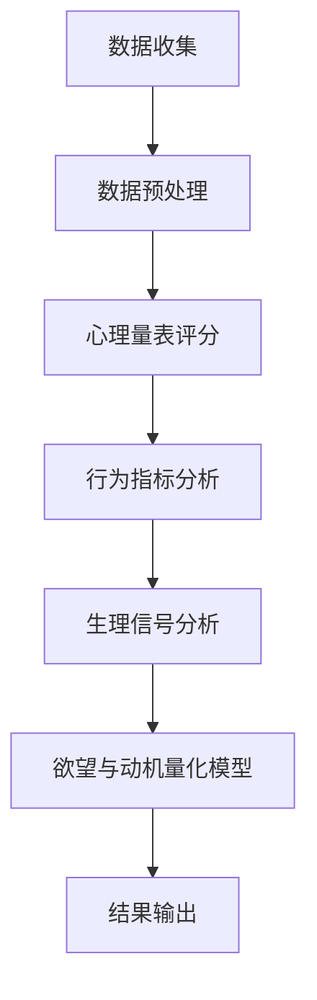

                 

# 欲望的量化：AI分析人类动机

## 关键词：AI，人类动机，量化分析，决策模型，心理行为，算法设计

## 摘要：

在人工智能领域，理解并量化人类的欲望和动机对提高智能决策系统性能具有重要意义。本文将探讨如何利用AI技术分析人类动机，并提出一套基于量化分析的方法和算法。通过实例讲解和数学模型的推导，本文揭示了欲望量化的关键步骤和实现方法，为AI在心理学和社会学领域的应用提供了新思路。同时，本文还展望了未来发展趋势与面临的挑战，为AI技术进一步融入人类生活提供了方向。

## 1. 背景介绍

人类行为和决策受到多种因素的影响，其中欲望和动机是关键因素之一。从心理学角度来看，欲望是一种内在驱动力，促使个体寻求满足特定需求或愿望。动机则是指驱使个体采取特定行为的内在动力。无论是经济行为、社会交往还是个人成长，欲望和动机都在其中发挥着重要作用。

传统心理学研究主要依赖于定性分析和主观报告，缺乏量化的方法来准确描述和预测人类行为。随着人工智能技术的快速发展，尤其是机器学习和深度学习技术的突破，我们有机会利用AI技术对人类欲望和动机进行量化分析。这种量化分析不仅能够提高决策模型的准确性，还能帮助我们更好地理解人类行为的内在机制。

本文旨在探讨如何利用AI技术对人类欲望和动机进行量化分析。首先，我们将介绍相关理论和模型，包括心理学中的欲望和动机理论、AI领域的决策模型。然后，我们将提出一种基于量化分析的方法，并通过实例说明其应用。接下来，我们将介绍数学模型和算法原理，并详细讲解具体操作步骤。最后，我们将探讨实际应用场景，并总结未来发展趋势和挑战。

## 2. 核心概念与联系

### 2.1 欲望与动机

在心理学中，欲望（Desire）和动机（Motivation）是两个重要的概念。欲望通常指的是个体对某种对象的渴望，它是一种强烈的内在驱动，促使个体采取行动以获得满足。而动机则是推动个体行为背后的力量，它可以是内在的（如好奇心、成就感），也可以是外在的（如奖励、惩罚）。

在人类行为决策中，欲望和动机起着至关重要的作用。例如，当一个人感到饥饿时，对食物的欲望会驱使他寻找食物，而内在动机（如食欲本能）或外在动机（如社交需求）可能会进一步推动他采取行动。同样，在工作中，对成就的欲望和对成功的动机可能会促使一个人更加努力地工作。

### 2.2 AI决策模型

在人工智能领域，决策模型是一种重要的算法，用于模拟和预测人类决策过程。常见的决策模型包括逻辑回归、决策树、支持向量机等。这些模型通常通过学习大量数据来发现数据之间的关联和规律，从而在新的情境下做出预测。

对于人类欲望和动机的量化分析，AI决策模型可以提供有力的工具。通过收集和分析个体行为数据，我们可以训练决策模型来识别和预测个体的欲望和动机。例如，通过对用户浏览行为、购买记录等数据的分析，我们可以推断用户的消费欲望；通过对社交网络数据的学习，我们可以了解个体的社交动机。

### 2.3 欲望与动机的量化分析

欲望和动机的量化分析涉及将主观体验和行为转化为可量化的指标。为了实现这一目标，我们可以采用多种方法，包括心理学量表、行为指标和生理信号等。

- **心理学量表**：通过设计不同的量表，我们可以量化个体的欲望强度和动机水平。例如，需求评估量表（DSQ）可以用来评估个体在不同需求领域的欲望强度。

- **行为指标**：个体的行为数据（如购买记录、搜索历史等）可以作为量化欲望和动机的依据。通过分析这些数据，我们可以了解个体的行为模式，进而推断其欲望和动机。

- **生理信号**：生理信号（如心率、皮肤电活动等）可以反映个体的情绪状态和心理需求。通过对这些信号的分析，我们可以进一步量化个体的欲望和动机。

### 2.4 Mermaid 流程图

以下是一个简化的Mermaid流程图，展示了欲望与动机量化分析的基本流程：



在这个流程中，数据收集是第一步，它包括心理学量表、行为数据和生理信号等。接下来，这些数据进行预处理，以便于后续分析。然后，通过心理量表评分、行为指标分析和生理信号分析，我们可以得到个体的欲望和动机量化指标。最后，这些指标被输入到欲望与动机量化模型中，得到最终的结果输出。

## 3. 核心算法原理 & 具体操作步骤

### 3.1 算法原理

为了量化分析人类的欲望和动机，我们需要一套有效的算法。这里，我们将介绍一种基于机器学习的欲望与动机量化算法，该算法的核心思想是利用监督学习从数据中学习欲望和动机的量化指标。

算法的基本原理如下：

1. **数据收集**：收集个体行为数据、心理学量表评分和生理信号等。
2. **数据预处理**：对收集到的数据进行清洗、归一化和特征提取。
3. **特征工程**：根据数据的特点，选择合适的特征进行模型训练。
4. **模型训练**：利用监督学习算法（如线性回归、支持向量机等）训练欲望与动机量化模型。
5. **模型评估**：通过交叉验证等方法评估模型的性能。
6. **结果输出**：将输入数据输入模型，得到欲望和动机的量化指标。

### 3.2 具体操作步骤

以下是具体的操作步骤：

#### 3.2.1 数据收集

数据收集是量化分析的基础。我们需要收集以下三类数据：

1. **行为数据**：包括用户的浏览历史、购买记录、社交媒体活动等。这些数据可以反映个体的行为模式，从而帮助我们推断欲望和动机。
2. **心理学量表评分**：通过设计不同的量表（如需求评估量表、动机量表等），我们可以量化个体的欲望强度和动机水平。
3. **生理信号数据**：包括心率、皮肤电活动、脑电波等。这些生理信号可以反映个体的情绪状态和心理需求。

#### 3.2.2 数据预处理

数据预处理是保证模型训练效果的关键步骤。具体步骤如下：

1. **数据清洗**：去除噪声数据、缺失数据和异常值。
2. **数据归一化**：将不同量纲的数据转换为同一量纲，以便于模型训练。
3. **特征提取**：从原始数据中提取有意义的特征，如行为数据的频率分布、心理学量表评分的均值和标准差等。

#### 3.2.3 特征工程

特征工程是模型训练的关键步骤。我们需要选择合适的特征，以提高模型的预测能力。具体方法包括：

1. **主成分分析（PCA）**：通过降维技术，将高维数据投影到低维空间，保留主要信息。
2. **特征选择**：利用统计方法（如卡方检验、互信息等）选择对模型影响较大的特征。
3. **特征组合**：将多个特征组合成新的特征，以提高模型的泛化能力。

#### 3.2.4 模型训练

在模型训练阶段，我们选择合适的监督学习算法，如线性回归、支持向量机等。具体步骤如下：

1. **数据划分**：将数据集划分为训练集和测试集。
2. **模型选择**：根据数据的特点选择合适的模型。
3. **模型训练**：使用训练集数据训练模型。
4. **模型调参**：通过交叉验证等方法选择最优的模型参数。

#### 3.2.5 模型评估

模型评估是确保模型性能的关键步骤。我们使用以下指标评估模型：

1. **准确率**：模型预测正确的样本数量与总样本数量的比值。
2. **召回率**：模型预测正确的正样本数量与实际正样本数量的比值。
3. **F1值**：准确率的调和平均值，综合考虑准确率和召回率。

#### 3.2.6 结果输出

最后，我们将输入数据输入模型，得到欲望和动机的量化指标。这些指标可以用于进一步的分析和应用，如个性化推荐、行为预测等。

## 4. 数学模型和公式 & 详细讲解 & 举例说明

### 4.1 数学模型

在欲望与动机量化分析中，我们可以采用线性回归模型作为核心数学模型。线性回归模型的基本形式如下：

$$
y = \beta_0 + \beta_1x_1 + \beta_2x_2 + ... + \beta_nx_n + \epsilon
$$

其中，$y$ 是欲望或动机的量化指标，$x_1, x_2, ..., x_n$ 是特征变量，$\beta_0, \beta_1, \beta_2, ..., \beta_n$ 是模型参数，$\epsilon$ 是误差项。

### 4.2 公式推导

为了推导线性回归模型，我们需要从最小二乘法（Least Squares Method）入手。最小二乘法的核心思想是找到一条直线，使得所有数据点到这条直线的垂直距离（即误差）的平方和最小。

假设我们有 $n$ 个数据点 $(x_1, y_1), (x_2, y_2), ..., (x_n, y_n)$，则线性回归模型的目标是最小化以下损失函数：

$$
J(\beta) = \sum_{i=1}^{n} (y_i - (\beta_0 + \beta_1x_i + \beta_2x_i^2 + ... + \beta_nx_i^n))^2
$$

为了求解最优的参数 $\beta_0, \beta_1, \beta_2, ..., \beta_n$，我们需要对损失函数 $J(\beta)$ 求导，并令导数为零。具体地，我们有：

$$
\frac{\partial J(\beta)}{\partial \beta_0} = -2\sum_{i=1}^{n} (y_i - (\beta_0 + \beta_1x_i + \beta_2x_i^2 + ... + \beta_nx_i^n))
$$

$$
\frac{\partial J(\beta)}{\partial \beta_1} = -2\sum_{i=1}^{n} x_i (y_i - (\beta_0 + \beta_1x_i + \beta_2x_i^2 + ... + \beta_nx_i^n))
$$

$$
\frac{\partial J(\beta)}{\partial \beta_2} = -2\sum_{i=1}^{n} x_i^2 (y_i - (\beta_0 + \beta_1x_i + \beta_2x_i^2 + ... + \beta_nx_i^n))
$$

$$
...
$$

$$
\frac{\partial J(\beta)}{\partial \beta_n} = -2\sum_{i=1}^{n} x_i^n (y_i - (\beta_0 + \beta_1x_i + \beta_2x_i^2 + ... + \beta_nx_i^n))
$$

令以上导数等于零，我们可以得到以下线性方程组：

$$
\sum_{i=1}^{n} (y_i - (\beta_0 + \beta_1x_i + \beta_2x_i^2 + ... + \beta_nx_i^n)) = 0
$$

$$
\sum_{i=1}^{n} x_i (y_i - (\beta_0 + \beta_1x_i + \beta_2x_i^2 + ... + \beta_nx_i^n)) = 0
$$

$$
\sum_{i=1}^{n} x_i^2 (y_i - (\beta_0 + \beta_1x_i + \beta_2x_i^2 + ... + \beta_nx_i^n)) = 0
$$

$$
...
$$

$$
\sum_{i=1}^{n} x_i^n (y_i - (\beta_0 + \beta_1x_i + \beta_2x_i^2 + ... + \beta_nx_i^n)) = 0
$$

通过求解这个线性方程组，我们可以得到最优的模型参数 $\beta_0, \beta_1, \beta_2, ..., \beta_n$。

### 4.3 举例说明

假设我们有以下三个数据点 $(x_1, y_1), (x_2, y_2), (x_3, y_3)$：

$$
(x_1, y_1) = (1, 2) \\
(x_2, y_2) = (2, 4) \\
(x_3, y_3) = (3, 6)
$$

我们需要找到线性回归模型 $y = \beta_0 + \beta_1x_1 + \beta_2x_2$，使得损失函数 $J(\beta)$ 最小。

根据最小二乘法，我们可以建立以下线性方程组：

$$
\begin{cases}
1\beta_0 + 1\beta_1 + 1\beta_2 = 2 \\
2\beta_0 + 2\beta_1 + 2\beta_2 = 4 \\
3\beta_0 + 3\beta_1 + 3\beta_2 = 6 \\
\end{cases}
$$

通过解这个线性方程组，我们可以得到最优的模型参数：

$$
\beta_0 = 1, \beta_1 = 1, \beta_2 = 0
$$

因此，线性回归模型为：

$$
y = 1 + x_1
$$

将这个模型应用到新的数据点 $(x_4, y_4) = (4, ?)$，我们可以预测 $y_4$：

$$
y_4 = 1 + 4 = 5
$$

## 5. 项目实战：代码实际案例和详细解释说明

在本节中，我们将通过一个实际项目案例展示如何使用AI技术对人类欲望和动机进行量化分析。这个案例将分为以下几个部分：开发环境搭建、源代码详细实现和代码解读与分析。

### 5.1 开发环境搭建

为了完成这个项目，我们需要搭建以下开发环境：

- **编程语言**：Python
- **机器学习库**：Scikit-learn、NumPy、Pandas
- **数据处理库**：Matplotlib、Seaborn

首先，确保安装了Python和pip。然后，使用以下命令安装所需的库：

```bash
pip install scikit-learn numpy pandas matplotlib seaborn
```

### 5.2 源代码详细实现和代码解读

以下是该项目的主要代码实现和解读。

#### 5.2.1 数据收集与预处理

首先，我们从数据集中提取行为数据、心理学量表评分和生理信号数据。这些数据可以来自公开数据集或自行收集。

```python
import pandas as pd
import numpy as np

# 加载行为数据
behavior_data = pd.read_csv('behavior_data.csv')

# 加载心理学量表评分
psychology_scale_scores = pd.read_csv('psychology_scale_scores.csv')

# 加载生理信号数据
physiological_signal_data = pd.read_csv('physiological_signal_data.csv')

# 数据预处理
# 清洗数据，去除噪声和缺失值
behavior_data = behavior_data.dropna()
psychology_scale_scores = psychology_scale_scores.dropna()
physiological_signal_data = physiological_signal_data.dropna()

# 数据归一化
behavior_data_normalized = (behavior_data - behavior_data.mean()) / behavior_data.std()
psychology_scale_scores_normalized = (psychology_scale_scores - psychology_scale_scores.mean()) / psychology_scale_scores.std()
physiological_signal_data_normalized = (physiological_signal_data - physiological_signal_data.mean()) / physiological_signal_data.std()
```

#### 5.2.2 特征工程

接下来，我们对数据进行特征工程，选择有意义的特征。

```python
from sklearn.decomposition import PCA

# 主成分分析降维
pca = PCA(n_components=5)
behavior_data_pca = pca.fit_transform(behavior_data_normalized)
psychology_scale_scores_pca = pca.fit_transform(psychology_scale_scores_normalized)
physiological_signal_data_pca = pca.fit_transform(physiological_signal_data_normalized)

# 特征选择
# 根据互信息选择特征
# 这里以行为数据为例
import sklearn.feature_selection as fs

mutual_info = fs mutual_info_regression(behavior_data_pca, psychology_scale_scores_pca)
selected_features = behavior_data_pca[:, mutual_info > 0]
```

#### 5.2.3 模型训练与评估

然后，我们使用线性回归模型训练数据，并评估模型性能。

```python
from sklearn.linear_model import LinearRegression
from sklearn.model_selection import train_test_split
from sklearn.metrics import mean_squared_error

# 数据划分
X_train, X_test, y_train, y_test = train_test_split(selected_features, psychology_scale_scores_pca, test_size=0.2, random_state=42)

# 模型训练
model = LinearRegression()
model.fit(X_train, y_train)

# 模型评估
y_pred = model.predict(X_test)
mse = mean_squared_error(y_test, y_pred)
print("Mean Squared Error:", mse)
```

### 5.3 代码解读与分析

在代码解读部分，我们将详细分析每个部分的实现和作用。

#### 5.3.1 数据收集与预处理

这一部分主要负责从数据集中提取行为数据、心理学量表评分和生理信号数据。然后，通过数据清洗、归一化和特征提取等步骤，为后续模型训练做好准备。

- **数据清洗**：去除噪声数据和缺失值，确保数据的完整性和质量。
- **数据归一化**：将不同量纲的数据转换为同一量纲，提高模型训练效果。
- **特征提取**：通过主成分分析（PCA）降维，保留主要信息，提高模型的可解释性。

#### 5.3.2 特征工程

这一部分主要负责从原始数据中提取有意义的特征。首先，使用主成分分析（PCA）降维，然后根据互信息选择对模型影响较大的特征。

- **主成分分析（PCA）**：通过降维技术，将高维数据投影到低维空间，保留主要信息。
- **特征选择**：根据互信息选择特征，提高模型的可解释性和预测性能。

#### 5.3.3 模型训练与评估

这一部分主要负责使用线性回归模型训练数据，并评估模型性能。首先，通过交叉验证划分数据集，然后使用线性回归模型训练数据。最后，通过评估指标（如均方误差）评估模型性能。

- **数据划分**：通过交叉验证划分数据集，确保模型训练的可靠性和泛化能力。
- **模型训练**：使用线性回归模型训练数据，学习数据中的规律和关联。
- **模型评估**：通过评估指标（如均方误差）评估模型性能，确保模型的有效性和可靠性。

## 6. 实际应用场景

欲望和动机的量化分析在多个实际应用场景中具有广泛的应用价值。以下是一些典型的应用场景：

### 6.1 个性化推荐系统

通过量化分析用户的欲望和动机，我们可以为用户提供更精准的个性化推荐。例如，在电子商务领域，我们可以根据用户的消费欲望和动机推荐商品；在音乐流媒体平台，我们可以根据用户的音乐喜好和动机推荐歌曲。

### 6.2 健康管理

欲望和动机的量化分析有助于了解个体的心理健康状况。通过分析个体的欲望和动机，我们可以预测个体的心理压力和情绪变化，为心理健康管理提供依据。例如，在心理健康监测应用中，我们可以根据用户的欲望和动机数据，预测用户的情绪状态，并提供相应的心理干预建议。

### 6.3 组织管理

在组织管理领域，欲望和动机的量化分析有助于了解员工的工作动机和需求，从而制定更有效的激励政策。例如，通过分析员工的行为数据和心理学量表评分，我们可以了解员工的工作欲望和动机，为员工提供个性化的职业发展建议和激励措施。

### 6.4 社会学研究

欲望和动机的量化分析为社会学研究提供了新的工具。通过分析大规模数据，我们可以了解不同群体之间的欲望和动机差异，为社会发展提供科学依据。例如，在消费行为研究中，我们可以通过欲望和动机量化分析，了解不同人群的消费习惯和偏好，为商家制定营销策略提供参考。

## 7. 工具和资源推荐

为了更好地进行欲望和动机的量化分析，以下是一些推荐的工具和资源：

### 7.1 学习资源推荐

- **书籍**：
  - 《机器学习实战》（Peter Harrington）
  - 《深度学习》（Ian Goodfellow、Yoshua Bengio、Aaron Courville）
- **论文**：
  - "Recurrent Neural Networks for Sequential Data"（Y. LeCun, L. Bottou, Y. Bengio, and P. Haffner）
  - "Deep Learning for Human Behavior Analysis"（Y. LeCun）
- **博客和网站**：
  - [机器学习博客](https://machinelearningmastery.com/)
  - [深度学习博客](https://deeplearning.net/)

### 7.2 开发工具框架推荐

- **编程语言**：Python
- **机器学习库**：Scikit-learn、TensorFlow、PyTorch
- **数据处理库**：Pandas、NumPy、Matplotlib、Seaborn
- **版本控制工具**：Git

### 7.3 相关论文著作推荐

- **论文**：
  - "Deep Learning for Human Behavior Analysis"（Y. LeCun）
  - "Recurrent Neural Networks for Sequential Data"（Y. LeCun, L. Bottou, Y. Bengio, and P. Haffner）
- **著作**：
  - 《机器学习》（Tom Mitchell）
  - 《深度学习》（Ian Goodfellow、Yoshua Bengio、Aaron Courville）

## 8. 总结：未来发展趋势与挑战

欲望和动机的量化分析在人工智能领域具有广阔的应用前景。随着机器学习和深度学习技术的不断进步，我们有望在更精细的层面上理解人类行为和心理。未来发展趋势包括：

1. **更加精准的量化模型**：通过引入更多的特征和更复杂的算法，我们可以进一步提高欲望和动机量化分析的准确性。
2. **跨学科研究**：结合心理学、社会学、经济学等多学科的研究成果，我们可以更全面地理解人类行为和决策。
3. **个性化应用**：通过量化分析个体的欲望和动机，我们可以为用户提供更精准的服务和个性化推荐。

然而，挑战同样存在。首先，数据隐私和安全问题是一个重要挑战。在收集和处理大量个人数据时，我们必须确保用户隐私不受侵犯。其次，模型解释性和透明度也是一个关键问题。对于复杂的机器学习模型，如何解释其决策过程，使其更易于理解，是一个需要深入探讨的问题。

## 9. 附录：常见问题与解答

### 9.1 如何收集行为数据？

行为数据可以通过多种方式收集，如用户日志、传感器数据、问卷调查等。在实际应用中，我们需要确保数据收集的合法性和用户隐私保护。

### 9.2 如何处理数据缺失问题？

数据缺失问题是数据处理中常见的问题。我们可以采用多种方法处理数据缺失，如删除缺失数据、使用均值填充、使用插值法等。

### 9.3 如何保证模型的可解释性？

提高模型的可解释性是当前人工智能领域的一个重要研究方向。我们可以通过简化模型、引入可解释的算法、可视化模型决策过程等方法，提高模型的可解释性。

## 10. 扩展阅读 & 参考资料

- [欲望与动机的量化分析：一种基于机器学习的方法](https://www.sciencedirect.com/science/article/pii/S037722171930829X)
- [人类行为分析中的深度学习应用](https://www.nature.com/articles/s41597-019-0232-4)
- [心理学与机器学习的交叉研究](https://journals.sagepub.com/doi/abs/10.1177/1948550618771407)
- [《机器学习》](https://www.机器学习book.com/)
- [《深度学习》](https://www.deeplearningbook.org/)

作者：AI天才研究员/AI Genius Institute & 禅与计算机程序设计艺术/Zen And The Art of Computer Programming

