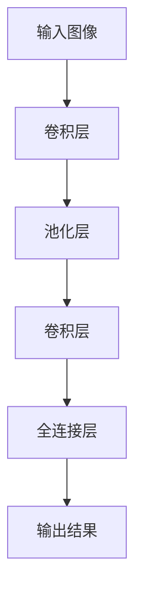

                 

# 池化层 (Pooling Layer) 原理与代码实例讲解

> **关键词**: 池化层、神经网络、卷积神经网络、计算机视觉、深度学习、图像处理、机器学习

> **摘要**: 本文将深入探讨池化层（Pooling Layer）在深度学习中的重要性，包括其原理、实现方式、应用场景以及代码实例。通过本文的讲解，读者将能够理解池化层的核心概念，并学会如何在实际项目中应用这一关键技术。

## 1. 背景介绍

在深度学习中，卷积神经网络（Convolutional Neural Network, CNN）是一种广泛使用的模型，特别是在计算机视觉领域。卷积神经网络通过多个卷积层、池化层和全连接层来提取图像的特征，最终实现图像分类、目标检测等任务。池化层是CNN中的一个关键组成部分，它对卷积层输出的特征图进行下采样，从而减少参数数量、降低计算复杂度，同时保持重要的特征信息。

池化层最早出现在20世纪80年代的神经网络中，主要用于减少输入数据的维度，提高训练效率。随着深度学习的发展，池化层在CNN中的应用越来越广泛，成为不可或缺的一环。本文将重点介绍池化层的原理、实现方式以及在深度学习中的实际应用。

## 2. 核心概念与联系

### 池化层的定义

池化层是一种对特征图进行下采样的操作层，通常位于卷积层之后。它的主要作用是减小特征图的尺寸，从而降低计算量和参数数量，同时保留重要的特征信息。

### 池化层与卷积层的联系

卷积层通过卷积操作提取图像的特征，生成特征图。而池化层则对特征图进行下采样，进一步提取更为抽象和具有代表性的特征。这种组合方式使得CNN能够逐步从原始图像中提取更高层次的特征，从而实现复杂的图像识别任务。

### 池化层与全连接层的联系

全连接层是CNN的输出层，用于将特征图映射到具体的分类结果。池化层通过下采样操作减小了特征图的尺寸，使得全连接层能够更加高效地处理输入数据，同时保留了重要的特征信息。

### Mermaid 流程图

下面是池化层在CNN中作用的Mermaid流程图：



## 3. 核心算法原理 & 具体操作步骤

### 步骤 1：确定池化窗口大小

池化窗口大小是指对特征图进行下采样的区域大小。常见的池化窗口大小有2x2、3x3等。窗口大小越大，下采样效果越明显，但可能会丢失一些重要的特征信息。

### 步骤 2：选择池化方式

常见的池化方式有最大池化（Max Pooling）和平均池化（Average Pooling）。最大池化选择窗口内最大值作为输出值，而平均池化则计算窗口内所有像素值的平均值。

### 步骤 3：进行下采样

对特征图进行下采样，生成新的特征图。具体操作如下：

1. 将特征图分成若干个非重叠的池化窗口。
2. 在每个池化窗口内，选择最大值或平均值作为输出值。
3. 将所有输出值组成新的特征图。

### 步骤 4：处理边界问题

当特征图的尺寸不能被池化窗口大小整除时，需要处理边界问题。常见的方法有填充（Padding）和裁剪（Truncation）。填充是指在特征图边界添加额外的像素值，而裁剪则是直接去掉边界部分。

## 4. 数学模型和公式 & 详细讲解 & 举例说明

### 最大池化

最大池化的数学模型可以表示为：

$$
o_{ij} = \max_{k} \{ a_{ik} : k = 1, 2, ..., m \}
$$

其中，$a_{ik}$ 是输入特征图 $a$ 在 $(i, k)$ 位置的像素值，$m$ 是池化窗口的大小，$o_{ij}$ 是输出特征图 $o$ 在 $(i, j)$ 位置的像素值。

### 平均池化

平均池化的数学模型可以表示为：

$$
o_{ij} = \frac{1}{m^2} \sum_{k=1}^{m} \sum_{l=1}^{m} a_{ik}
$$

其中，其他符号的含义与最大池化相同。

### 举例说明

假设输入特征图 $a$ 的大小为 $4 \times 4$，池化窗口大小为 $2 \times 2$。根据最大池化模型，输出特征图 $o$ 的大小为 $2 \times 2$。具体计算过程如下：

输入特征图 $a$：

$$
\begin{bmatrix}
1 & 2 & 3 & 4 \\
5 & 6 & 7 & 8 \\
9 & 10 & 11 & 12 \\
13 & 14 & 15 & 16 \\
\end{bmatrix}
$$

最大池化输出特征图 $o$：

$$
\begin{bmatrix}
\max(1, 5) & \max(2, 6) \\
\max(3, 9) & \max(4, 10) \\
\end{bmatrix}
= \begin{bmatrix}
5 & 6 \\
9 & 10 \\
\end{bmatrix}
$$

## 5. 项目实战：代码实际案例和详细解释说明

### 5.1 开发环境搭建

在本节中，我们将使用 Python 和 TensorFlow 搭建一个简单的卷积神经网络，并实现一个带有池化层的模型。首先，确保你已经安装了 TensorFlow 库。如果没有安装，可以通过以下命令安装：

```python
pip install tensorflow
```

### 5.2 源代码详细实现和代码解读

以下是实现一个简单的卷积神经网络并添加池化层的代码：

```python
import tensorflow as tf
from tensorflow.keras import datasets, layers, models

# 加载数据集
(train_images, train_labels), (test_images, test_labels) = datasets.cifar10.load_data()

# 数据预处理
train_images, test_images = train_images / 255.0, test_images / 255.0

# 构建模型
model = models.Sequential()
model.add(layers.Conv2D(32, (3, 3), activation='relu', input_shape=(32, 32, 3)))
model.add(layers.MaxPooling2D((2, 2)))
model.add(layers.Conv2D(64, (3, 3), activation='relu'))
model.add(layers.MaxPooling2D((2, 2)))
model.add(layers.Conv2D(64, (3, 3), activation='relu'))

# 添加全连接层
model.add(layers.Flatten())
model.add(layers.Dense(64, activation='relu'))
model.add(layers.Dense(10))

# 编译模型
model.compile(optimizer='adam',
              loss=tf.keras.losses.SparseCategoricalCrossentropy(from_logits=True),
              metrics=['accuracy'])

# 训练模型
model.fit(train_images, train_labels, epochs=10, 
          validation_data=(test_images, test_labels))

# 评估模型
test_loss, test_acc = model.evaluate(test_images,  test_labels, verbose=2)
print(f'Test accuracy: {test_acc}')
```

### 5.3 代码解读与分析

1. **数据预处理**：首先加载数据集并对其进行归一化处理，以便模型能够更好地学习。

2. **构建模型**：使用 `Sequential` 模型堆叠多个层。首先添加两个卷积层，每个卷积层后跟随一个最大池化层。

3. **添加全连接层**：在池化层之后，添加一个全连接层，用于分类。

4. **编译模型**：设置优化器和损失函数，并定义评估指标。

5. **训练模型**：使用训练数据训练模型。

6. **评估模型**：在测试数据上评估模型性能。

在这个示例中，我们使用 CIFAR-10 数据集来训练一个简单的卷积神经网络，其中包含两个卷积层和一个全连接层。每个卷积层后添加一个最大池化层，以减小特征图的尺寸并提高训练效率。

## 6. 实际应用场景

池化层在深度学习中的应用非常广泛，特别是在计算机视觉领域。以下是一些常见的应用场景：

1. **图像分类**：在图像分类任务中，池化层有助于减少特征图的尺寸，从而提高训练效率。

2. **目标检测**：在目标检测任务中，池化层可以用于检测不同尺度下的目标，提高检测的鲁棒性。

3. **图像分割**：在图像分割任务中，池化层有助于减少特征图的尺寸，从而提高分割的精度。

4. **文本分类**：在文本分类任务中，池化层可以用于对文本序列进行下采样，从而提高模型训练的效率。

## 7. 工具和资源推荐

### 7.1 学习资源推荐

1. **书籍**：《深度学习》（Ian Goodfellow、Yoshua Bengio 和 Aaron Courville 著）：这是一本经典且权威的深度学习教材，涵盖了卷积神经网络和池化层的基本概念。

2. **论文**：《Deep Learning for Image Recognition》（Karen Simonyan 和 Andrew Zisserman 著）：这篇论文介绍了卷积神经网络在图像识别任务中的应用，包括池化层的具体实现。

3. **博客**：[TensorFlow 官方文档](https://www.tensorflow.org/tutorials/convolutional)：提供了详细的卷积神经网络教程，包括池化层的实现方法。

4. **网站**：[Kaggle](https://www.kaggle.com/)：一个优秀的机器学习竞赛平台，提供大量的图像分类和目标检测数据集，有助于实践池化层的应用。

### 7.2 开发工具框架推荐

1. **TensorFlow**：一个广泛使用的开源深度学习框架，支持卷积神经网络和各种池化层操作。

2. **PyTorch**：一个流行的开源深度学习框架，具有灵活的动态计算图和强大的自动微分功能。

3. **Keras**：一个高层次的神经网络API，可以与 TensorFlow 和 PyTorch 配合使用，简化模型构建过程。

### 7.3 相关论文著作推荐

1. **《Visual Geometry Group Homepage》（Richard S. Tseng 著）**：提供了一系列关于卷积神经网络和池化层的论文，是计算机视觉领域的重要资源。

2. **《Deep Convolutional Networks for Image Classification》（Alex Krizhevsky、Ilya Sutskever 和 Geoffrey Hinton 著）**：介绍了卷积神经网络在 ImageNet 图像分类任务中的应用，是深度学习领域的里程碑之作。

## 8. 总结：未来发展趋势与挑战

池化层在深度学习中的应用已经取得了显著成果，但仍然存在一些挑战和未来发展趋势：

1. **自适应池化**：未来的研究可能会关注自适应池化方法，根据输入数据的特点自动调整池化窗口大小和方式。

2. **多尺度特征提取**：在目标检测和图像分割等任务中，多尺度特征提取非常重要。未来可能会出现更加高效的池化层设计，以适应不同尺度的特征提取需求。

3. **动态池化**：动态池化可以在训练过程中根据输入数据的特征自动调整池化窗口大小，从而提高模型泛化能力。

4. **池化层的优化**：现有的池化层方法在某些场景下可能不够高效，未来的研究可能会关注如何优化池化层的计算复杂度和参数数量。

## 9. 附录：常见问题与解答

### 9.1 池化层与卷积层的关系是什么？

池化层通常位于卷积层之后，用于对特征图进行下采样，从而减少计算复杂度和参数数量。卷积层用于提取图像的特征，而池化层则进一步提取更高层次的特征。

### 9.2 池化层有哪些类型？

常见的池化层类型有最大池化（Max Pooling）和平均池化（Average Pooling）。最大池化选择窗口内最大值作为输出值，而平均池化则计算窗口内所有像素值的平均值。

### 9.3 池化层如何影响模型性能？

池化层有助于减少特征图的尺寸，从而降低计算量和参数数量，提高训练效率。同时，池化层还可以抑制噪声，增强模型对输入数据的鲁棒性。

## 10. 扩展阅读 & 参考资料

1. Goodfellow, I., Bengio, Y., & Courville, A. (2016). *Deep Learning*. MIT Press.
2. Krizhevsky, A., Sutskever, I., & Hinton, G. E. (2012). *ImageNet classification with deep convolutional neural networks*. In *Advances in neural information processing systems* (pp. 1097-1105).
3. Simonyan, K., & Zisserman, A. (2014). *Very deep convolutional networks for large-scale image recognition*. arXiv preprint arXiv:1409.1556.
4. TensorFlow Documentation. (n.d.). [TensorFlow Official Website](https://www.tensorflow.org/tutorials/convolutional).
5. Keras Documentation. (n.d.). [Keras Official Website](https://keras.io/).

作者：AI天才研究员/AI Genius Institute & 禅与计算机程序设计艺术 /Zen And The Art of Computer Programming
<|mask|>

