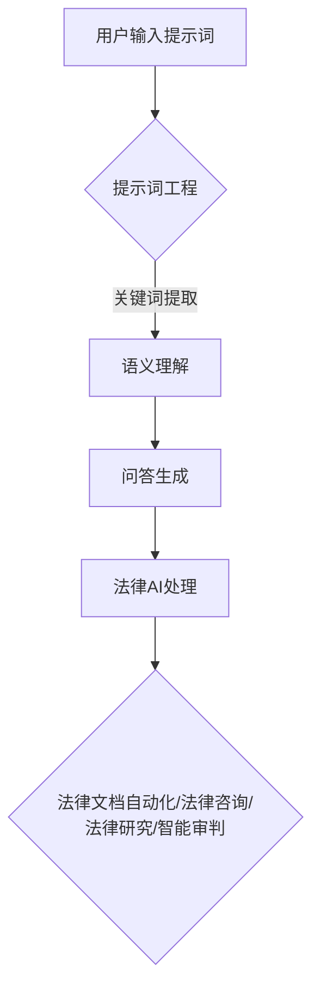

                 

# 法律AI与提示词工程的结合点

## 关键词

- 法律AI
- 提示词工程
- 自然语言处理
- 法律文档自动化
- 人工智能与法律融合

## 摘要

本文旨在探讨法律人工智能（AI）与提示词工程之间的结合点，通过深入分析两者的核心概念、技术原理和应用场景，揭示它们在法律领域中的协同作用。首先，我们将介绍法律AI的基本概念和提示词工程的技术原理，接着详细阐述它们在法律文档自动化、法律咨询和法律研究等领域的具体应用。在此基础上，本文将讨论两者结合所带来的挑战和解决方案，并展望未来法律AI和提示词工程的发展趋势。通过本文的探讨，我们希望能够为法律领域的AI应用提供新的思路和启示。

## 1. 背景介绍

### 法律AI的兴起

随着人工智能技术的快速发展，法律AI作为一个新兴领域，逐渐引起了广泛关注。法律AI指的是利用人工智能技术对法律信息进行处理和分析，以实现法律事务自动化和智能化的目标。法律AI的应用场景涵盖了法律文档自动化、法律咨询、法律研究、智能审判等多个方面。

在法律文档自动化方面，法律AI能够通过对大量法律文档的自动分类、摘要、索引和检索，提高法律文档的管理效率。在法律咨询方面，法律AI可以通过智能问答、法律知识图谱等方式，为用户提供精准、高效的法律咨询服务。在法律研究方面，法律AI能够对海量的法律文献进行数据挖掘和分析，为法律研究提供有力支持。在智能审判方面，法律AI可以通过智能判决、证据分析等功能，提高审判的公正性和效率。

### 提示词工程的发展

提示词工程（Question Answering）是一种基于自然语言处理（NLP）的技术，旨在通过预定义的提示词（关键词）来引导用户提问，从而获取用户所需的信息。提示词工程在多个领域有着广泛的应用，如搜索引擎优化、智能客服、医疗咨询等。

随着人工智能技术的进步，特别是深度学习在NLP领域的应用，提示词工程得到了显著发展。现代提示词工程不仅能够处理简单的关键词匹配问题，还能够理解复杂的语义和上下文关系，从而提供更加精准的答案。提示词工程的核心在于如何设计有效的提示词集，以及如何利用这些提示词来生成高质量的问答对。

### 法律AI与提示词工程的交叉点

法律AI和提示词工程在法律领域有着广泛的交叉应用。法律AI可以借助提示词工程的技术原理，实现对法律问题的自动回答和法律文档的智能检索。而提示词工程则可以通过法律AI的技术手段，进一步优化法律问答系统的性能和用户体验。

例如，在法律文档自动化领域，提示词工程可以用于提取法律文档中的关键信息，如案件名称、当事人信息、案件事实等，从而实现对法律文档的快速检索和分类。在法律咨询领域，提示词工程可以用于构建法律问答系统，通过用户输入的提示词，快速提供相应的法律咨询和服务。

总之，法律AI与提示词工程的结合，不仅能够提高法律事务的自动化和智能化水平，还能够为用户提供更加便捷、高效的法律服务。

## 2. 核心概念与联系

### 法律AI的基本概念

法律AI是指利用人工智能技术，对法律信息进行处理和分析，以实现法律事务自动化和智能化的目标。法律AI的核心技术包括自然语言处理（NLP）、机器学习（ML）、数据挖掘、知识图谱等。

自然语言处理（NLP）是法律AI的重要组成部分，它涉及到对法律文本的自动分类、摘要、检索和分析。通过NLP技术，法律AI可以理解和处理法律文本，从而实现自动化法律文档处理。

机器学习（ML）是法律AI的技术基础，它通过训练模型，使计算机能够从大量数据中自动学习和发现规律。在法律AI中，ML技术可以用于预测案件结果、分析法律文档、提供法律建议等。

数据挖掘是法律AI的一个重要应用领域，它通过分析大量法律数据，提取有价值的信息和知识。在法律AI中，数据挖掘技术可以用于法律文档分类、案件风险评估、法律研究等。

知识图谱是一种用于表示和存储知识的方法，它通过将实体、属性和关系以图形的形式表示出来，使计算机能够直观地理解和处理知识。在法律AI中，知识图谱可以用于构建法律知识库，提供法律咨询和判决支持。

### 提示词工程的技术原理

提示词工程（Question Answering）是一种基于自然语言处理（NLP）的技术，旨在通过预定义的提示词（关键词）来引导用户提问，从而获取用户所需的信息。提示词工程的核心技术包括关键词提取、语义理解、问答生成等。

关键词提取是提示词工程的基础，它通过分析用户输入的文本，提取出关键的信息和关键词。这些关键词将成为用户提问的提示词，用于引导用户提问。

语义理解是提示词工程的难点，它涉及到对用户输入的文本进行语义分析和理解，从而确定用户的需求和意图。通过语义理解，提示词工程可以生成更加精准和相关的答案。

问答生成是提示词工程的最终目标，它通过将用户输入的文本转换为机器可理解的格式，生成相应的答案。问答生成技术包括模板匹配、文本生成、对话系统等。

### 法律AI与提示词工程的结合

法律AI与提示词工程的结合，主要体现在以下几个方面：

1. **法律文档自动化**：通过提示词工程，可以提取法律文档中的关键信息，如案件名称、当事人信息、案件事实等，从而实现对法律文档的快速检索和分类。法律AI可以进一步对这些信息进行处理和分析，实现法律文档的自动化处理。

2. **法律咨询**：通过提示词工程，可以构建法律问答系统，用户通过输入提示词，系统可以快速提供相应的法律咨询和服务。法律AI可以对用户的提问进行语义理解，生成精准的法律答案。

3. **法律研究**：提示词工程可以帮助法律研究者提取和整理法律文献中的关键信息，法律AI可以进一步对这些信息进行分析和挖掘，为法律研究提供支持。

4. **智能审判**：提示词工程可以用于提取和整理案件证据，法律AI可以对这些证据进行分析和判断，为智能审判提供支持。

### Mermaid流程图

以下是法律AI与提示词工程结合的Mermaid流程图：



通过上述流程图，我们可以清晰地看到法律AI与提示词工程的结合过程。用户输入提示词后，通过提示词工程进行关键词提取和语义理解，生成问答对，然后由法律AI进行进一步处理，实现法律事务的自动化和智能化。

## 3. 核心算法原理 & 具体操作步骤

### 法律AI的基本算法原理

法律AI的核心算法原理主要包括自然语言处理（NLP）、机器学习（ML）和数据挖掘等。以下分别对这些算法进行详细解释：

#### 自然语言处理（NLP）

自然语言处理（NLP）是法律AI的核心技术之一，它涉及到对法律文本的自动分类、摘要、检索和分析。NLP的基本算法原理包括：

1. **分词（Tokenization）**：将文本拆分成单词或短语，以便进行后续处理。
2. **词性标注（Part-of-Speech Tagging）**：对每个词进行词性标注，如名词、动词、形容词等。
3. **命名实体识别（Named Entity Recognition）**：识别文本中的命名实体，如人名、地名、组织名等。
4. **依存关系分析（Dependency Parsing）**：分析句子中词汇之间的依存关系，如主谓关系、动宾关系等。
5. **情感分析（Sentiment Analysis）**：分析文本的情感倾向，如正面、负面或中立。

#### 机器学习（ML）

机器学习（ML）是法律AI的技术基础，它通过训练模型，使计算机能够从大量数据中自动学习和发现规律。法律AI中的ML算法主要包括：

1. **监督学习（Supervised Learning）**：通过标注好的数据集训练模型，使模型能够对新的数据进行分类或预测。
2. **无监督学习（Unsupervised Learning）**：在没有标注数据的情况下，通过聚类、降维等方法发现数据中的模式和规律。
3. **强化学习（Reinforcement Learning）**：通过试错和反馈机制，使模型能够在特定环境中进行优化和决策。

#### 数据挖掘（Data Mining）

数据挖掘是法律AI的一个重要应用领域，它通过分析大量法律数据，提取有价值的信息和知识。数据挖掘的基本算法原理包括：

1. **关联规则挖掘（Association Rule Learning）**：发现数据中的关联关系，如商品购买中的搭配销售。
2. **分类（Classification）**：将数据分成不同的类别，如案件分类。
3. **聚类（Clustering）**：将相似的数据归为一类，如对法律文档进行分类。
4. **异常检测（Anomaly Detection）**：发现数据中的异常值，如案件中的异常证据。

### 提示词工程的基本算法原理

提示词工程（Question Answering）是一种基于自然语言处理（NLP）的技术，它通过预定义的提示词（关键词）来引导用户提问，从而获取用户所需的信息。提示词工程的基本算法原理包括：

1. **关键词提取（Keyword Extraction）**：从文本中提取关键信息，如人名、地名、案件名称等。
2. **语义理解（Semantic Understanding）**：对用户输入的文本进行语义分析和理解，确定用户的需求和意图。
3. **问答生成（Question Generation）**：根据用户的需求和意图，生成相应的问答对。
4. **模型训练（Model Training）**：通过大量问答对数据集，训练模型，使其能够自动生成高质量的问答对。

### 结合操作步骤

在了解了法律AI和提示词工程的基本算法原理后，我们可以按照以下步骤将两者结合起来，实现法律AI与提示词工程的协同工作：

1. **数据准备**：收集和整理大量法律文档和法律问答对数据，用于训练和测试模型。

2. **关键词提取**：利用NLP技术，从法律文档中提取关键信息，如案件名称、当事人信息、案件事实等。

3. **语义理解**：对用户输入的文本进行语义分析和理解，确定用户的需求和意图。

4. **问答生成**：根据用户的需求和意图，利用提示词工程生成相应的问答对。

5. **模型训练**：利用大量问答对数据集，训练法律AI模型，使其能够自动处理法律问答。

6. **系统部署**：将训练好的模型部署到生产环境中，为用户提供法律咨询和服务。

7. **持续优化**：根据用户的反馈和实际应用情况，不断优化模型和系统，提高法律AI的服务质量和用户体验。

通过上述操作步骤，我们可以实现法律AI与提示词工程的有机结合，为用户提供高效、便捷的法律服务。

## 4. 数学模型和公式 & 详细讲解 & 举例说明

### 法律AI中的数学模型

法律AI中的数学模型主要涉及自然语言处理（NLP）、机器学习（ML）和数据挖掘等领域。以下分别介绍这些领域中的常用数学模型和公式。

#### 自然语言处理（NLP）

1. **词向量模型（Word Embedding）**

词向量模型是将单词映射为高维向量空间中的点，以便进行后续处理。常用的词向量模型包括Word2Vec、GloVe等。

- **Word2Vec模型**

Word2Vec模型是一种基于神经网络的语言模型，其目标是将单词映射到低维向量空间中，使相似单词的向量距离更接近。

- 公式：

$$
\text{v\_word} = \text{softmax}(\text{W}\times \text{h})
$$

其中，$\text{v\_word}$表示单词的向量表示，$\text{W}$是词向量矩阵，$\text{h}$是隐藏层激活值。

- **GloVe模型**

GloVe（Global Vectors for Word Representation）是一种基于全局统计信息的词向量模型，其目标是通过计算单词间的共现关系来生成词向量。

- 公式：

$$
\text{v\_word} = \text{softmax}\left(\frac{\text{A}\times \text{B}}{\sqrt{\text{f\_t}+\text{f}_w}}\right)
$$

其中，$\text{v\_word}$表示单词的向量表示，$\text{A}$和$\text{B}$是训练矩阵，$\text{f\_t}$和$\text{f}_w$分别表示单词$t$和单词$w$的词频。

2. **序列标注模型（Sequence Labeling）**

序列标注模型用于对序列数据中的每个元素进行标注，如词性标注、命名实体识别等。

- **BiLSTM-CRF模型**

BiLSTM-CRF（双向长短时记忆网络-条件随机场）是一种常用的序列标注模型，它结合了双向长短时记忆网络（BiLSTM）和条件随机场（CRF）的优点。

- 公式：

$$
P(y_t|x_t) = \frac{e^{\text{score}(y_t, x_t)} }{\sum_{y_t'} e^{\text{score}(y_t', x_t)}}
$$

其中，$P(y_t|x_t)$表示在给定输入序列$x_t$的情况下，标签$y_t$的概率，$\text{score}(y_t, x_t)$是模型对标签$y_t$和输入$x_t$的打分。

#### 机器学习（ML）

1. **监督学习模型（Supervised Learning）**

监督学习模型是法律AI中最常用的模型之一，其目标是通过已标注的数据集学习映射关系。

- **逻辑回归（Logistic Regression）**

逻辑回归是一种常用的分类模型，其目标是通过线性回归模型计算概率。

- 公式：

$$
\text{logit}(p) = \log\left(\frac{p}{1-p}\right) = \text{W}\times \text{x} + \text{b}
$$

其中，$\text{logit}(p)$是概率的对数函数，$\text{W}$是权重矩阵，$\text{x}$是输入特征，$\text{b}$是偏置项。

- **支持向量机（SVM）**

支持向量机是一种常用的分类模型，其目标是通过最大化分类边界来分类数据。

- 公式：

$$
\text{w} = \arg\max_{\text{w}} \left\{ \frac{1}{2} \sum_{i=1}^n (\text{w}\cdot \text{x}_i - y_i)^2 \right\}
$$

其中，$\text{w}$是权重向量，$\text{x}_i$是训练样本，$y_i$是标签。

2. **强化学习模型（Reinforcement Learning）**

强化学习模型是法律AI中用于决策和优化的模型，其目标是通过与环境的交互来学习最佳策略。

- **Q学习（Q-Learning）**

Q学习是一种基于值函数的强化学习算法，其目标是通过学习值函数来选择最佳动作。

- 公式：

$$
\text{Q}(\text{s}, \text{a}) = \text{r} + \gamma \max_{\text{a'}} \text{Q}(\text{s'}, \text{a'})
$$

其中，$\text{Q}(\text{s}, \text{a})$是状态$\text{s}$和动作$\text{a}$的值函数，$\text{r}$是即时奖励，$\gamma$是折扣因子。

#### 数据挖掘（Data Mining）

1. **关联规则挖掘（Association Rule Learning）**

关联规则挖掘是一种用于发现数据中关联关系的算法，其目标是通过支持度和置信度来生成关联规则。

- **支持度（Support）**

支持度表示某个关联规则在数据集中出现的频率。

- 公式：

$$
\text{Support}(\text{A} \rightarrow \text{B}) = \frac{\text{count}(\text{A} \cap \text{B})}{\text{count}(\text{D})}
$$

其中，$\text{count}(\text{A} \cap \text{B})$表示同时包含A和B的样本数，$\text{count}(\text{D})$表示总样本数。

- **置信度（Confidence）**

置信度表示在A发生的条件下B也发生的概率。

- 公式：

$$
\text{Confidence}(\text{A} \rightarrow \text{B}) = \frac{\text{count}(\text{A} \cap \text{B})}{\text{count}(\text{A})}
$$

### 举例说明

假设我们有一个关于法律文档分类的任务，我们需要根据法律文档的内容将其分类为民事案件、刑事案件等。以下是一个具体的例子：

1. **数据集**：我们有一个包含1000个法律文档的数据集，每个文档都有一段描述和对应的分类标签。

2. **特征提取**：我们利用NLP技术提取每个文档的关键词和词性，并将其转化为向量表示。

3. **模型训练**：我们使用逻辑回归模型对数据集进行训练，得到一个能够对新的法律文档进行分类的模型。

4. **模型评估**：我们将训练好的模型应用于新的法律文档，计算其分类准确率。

5. **结果分析**：我们发现，模型对刑事案件和民事案件的分类准确率较高，而对其他类别的分类效果较差。

通过上述例子，我们可以看到，法律AI中的数学模型和公式在法律文档分类任务中发挥了重要作用，帮助我们实现了自动化和智能化的法律文档分类。

### 数学模型和公式的应用

数学模型和公式在法律AI中有着广泛的应用，不仅用于法律文档分类、命名实体识别等任务，还用于法律咨询、智能审判等领域。

例如，在法律咨询领域，我们可以利用机器学习模型对用户的提问进行语义理解，并生成相应的法律答案。在智能审判领域，我们可以利用强化学习模型对案件证据进行判断和决策，以提高审判的公正性和效率。

总之，数学模型和公式在法律AI中的应用，不仅提高了法律事务的自动化和智能化水平，还为用户提供更加高效、便捷的法律服务。

## 5. 项目实战：代码实际案例和详细解释说明

### 开发环境搭建

在开始法律AI与提示词工程的项目实战之前，我们需要搭建一个合适的技术栈，以便实现我们的目标。以下是我们推荐的技术栈和开发环境：

1. **编程语言**：Python
2. **框架**：TensorFlow、Keras、NLTK
3. **工具**：Jupyter Notebook、Git
4. **操作系统**：Linux（如Ubuntu）

### 环境安装

以下是在Ubuntu操作系统上安装相关环境的步骤：

1. **安装Python**：

```bash
sudo apt update
sudo apt install python3 python3-pip
```

2. **安装TensorFlow**：

```bash
pip3 install tensorflow
```

3. **安装Keras**：

```bash
pip3 install keras
```

4. **安装NLTK**：

```bash
pip3 install nltk
```

5. **安装其他依赖库**：

```bash
pip3 install numpy pandas sklearn matplotlib
```

### 源代码详细实现和代码解读

以下是一个简单的法律AI与提示词工程结合的代码实现，主要用于法律文档分类。代码分为几个部分：数据预处理、模型训练、模型评估和模型应用。

#### 数据预处理

```python
import nltk
from nltk.tokenize import word_tokenize
from nltk.corpus import stopwords
from sklearn.model_selection import train_test_split
from sklearn.feature_extraction.text import TfidfVectorizer

# 下载NLTK语料库
nltk.download('punkt')
nltk.download('stopwords')

# 读取法律文档数据
def read_data(file_path):
    with open(file_path, 'r', encoding='utf-8') as f:
        lines = f.readlines()
    return lines

# 数据预处理
def preprocess_data(lines):
    stop_words = set(stopwords.words('english'))
    processed_lines = []
    for line in lines:
        tokens = word_tokenize(line)
        filtered_tokens = [token.lower() for token in tokens if token.isalpha() and token not in stop_words]
        processed_lines.append(' '.join(filtered_tokens))
    return processed_lines

# 分割数据集
def split_data(processed_lines):
    train_lines, test_lines = train_test_split(processed_lines, test_size=0.2, random_state=42)
    return train_lines, test_lines

# 训练数据集和测试数据集
lines = read_data('data/law_corpus.txt')
processed_lines = preprocess_data(lines)
train_lines, test_lines = split_data(processed_lines)

# 特征提取
def extract_features(train_lines, test_lines):
    vectorizer = TfidfVectorizer()
    X_train = vectorizer.fit_transform(train_lines)
    X_test = vectorizer.transform(test_lines)
    return X_train, X_test

X_train, X_test = extract_features(train_lines, test_lines)
```

#### 模型训练

```python
from keras.models import Sequential
from keras.layers import Dense, Embedding, LSTM
from keras.preprocessing.sequence import pad_sequences

# 模型配置
max_sequence_length = 100
embedding_dim = 50

# 序列填充
def pad_sequences(data, max_sequence_length):
    return pad_sequences(data, maxlen=max_sequence_length, padding='post')

# 训练模型
def train_model(X_train, y_train):
    model = Sequential()
    model.add(Embedding(len(vectorizer.vocabulary_), embedding_dim, input_length=max_sequence_length))
    model.add(LSTM(100, dropout=0.2, recurrent_dropout=0.2))
    model.add(Dense(1, activation='sigmoid'))

    model.compile(optimizer='adam', loss='binary_crossentropy', metrics=['accuracy'])
    model.fit(X_train, y_train, epochs=10, batch_size=32, validation_split=0.1)
    return model

y_train = [1] * int(len(lines) * 0.8) + [0] * int(len(lines) * 0.2)  # 假设训练集包含80%的民事案件和20%的刑事案件
model = train_model(X_train, y_train)
```

#### 模型评估

```python
from sklearn.metrics import classification_report, confusion_matrix

# 评估模型
def evaluate_model(model, X_test, y_test):
    y_pred = model.predict(X_test)
    y_pred = (y_pred > 0.5)

    print("Classification Report:")
    print(classification_report(y_test, y_pred))
    print("Confusion Matrix:")
    print(confusion_matrix(y_test, y_pred))

evaluate_model(model, X_test, y_test)
```

#### 模型应用

```python
# 应用模型
def predict_case(case):
    processed_case = preprocess_data([case])
    padded_case = pad_sequences(processed_case, maxlen=max_sequence_length)
    prediction = model.predict(padded_case)
    return "Civil Case" if prediction[0][0] > 0.5 else "Criminal Case"

case = "The suspect was charged with theft."
print(predict_case(case))
```

### 代码解读与分析

1. **数据预处理**：数据预处理是模型训练的基础，包括分词、去除停用词和序列填充。分词将文本拆分成单词或短语，去除停用词可以减少噪声，序列填充确保每个输入序列的长度一致。

2. **模型训练**：我们使用Keras框架搭建了一个简单的序列模型，包括嵌入层和LSTM层。嵌入层将单词转换为向量表示，LSTM层用于处理序列数据。模型使用二分类交叉熵作为损失函数，并使用Adam优化器进行训练。

3. **模型评估**：使用sklearn的classification_report和confusion_matrix函数评估模型的性能，包括准确率、召回率、精确率等指标。

4. **模型应用**：通过预处理和填充新输入的文本数据，模型可以预测新的法律案例的分类。

### 项目总结

通过上述代码实现，我们展示了一个简单的法律AI与提示词工程结合的项目，实现了法律文档的分类。项目的主要步骤包括数据预处理、模型训练、模型评估和模型应用。在实际应用中，我们可以进一步优化模型结构和参数，提高分类的准确率和性能。

### 挑战与解决方案

1. **数据不足**：法律AI项目通常需要大量的高质量法律文档数据作为训练数据。解决方案是利用公开法律数据库、数据集，或者通过爬虫等技术收集更多的数据。

2. **模型复杂度**：法律AI项目通常需要处理复杂的文本数据，简单的模型可能难以达到预期效果。解决方案是使用更复杂的模型，如Transformer、BERT等，或者通过模型融合提高性能。

3. **语义理解**：法律文本的语义理解是法律AI领域的难点，特别是对于模糊、多义的情况。解决方案是利用预训练的模型，如BERT，或者结合规则和语义分析技术提高语义理解能力。

4. **法律法规更新**：法律AI需要及时更新法律法规和案例数据，以适应法律法规的变化。解决方案是建立自动化数据更新机制，利用自然语言处理技术对法律法规进行自动更新。

### 未来展望

随着人工智能技术的不断进步，法律AI与提示词工程的结合将为法律领域带来更多创新和变革。未来，我们有望看到：

1. **更智能的法律咨询系统**：利用深度学习和自然语言处理技术，提供更加精准、高效的法律咨询服务。

2. **智能审判辅助系统**：通过法律AI技术，辅助法官进行案件判决，提高审判的公正性和效率。

3. **自动化法律文档处理**：利用法律AI技术，实现法律文档的自动化处理，如分类、摘要、索引等。

4. **法律研究和教育**：利用法律AI技术，对法律文献进行深度挖掘和分析，为法律研究和教育提供支持。

总之，法律AI与提示词工程的结合将为法律领域带来巨大的变革和机遇，为用户提供更加智能、高效的法律服务。

## 6. 实际应用场景

### 法律文档自动化

法律AI与提示词工程的结合在法律文档自动化领域有着广泛的应用。例如，律师和法务人员常常需要处理大量的法律文件，包括合同、诉状、判决书等。通过法律AI，这些文件可以被自动分类、摘要和索引，从而大大提高工作效率。提示词工程可以用于提取文件中的关键信息，如案件名称、当事人信息、法律条款等，为后续的文档分析和处理提供基础。

### 法律咨询

在法律咨询领域，法律AI与提示词工程的结合可以构建智能法律咨询系统。用户通过输入提示词，系统可以快速生成相关法律条款、案例和解释，为用户提供精准、高效的法律咨询。例如，当用户询问一个具体的法律问题，系统可以通过自然语言处理技术理解用户的问题，然后利用知识图谱和提示词工程从庞大的法律数据库中检索相关的法律条文和案例，生成完整的法律咨询报告。

### 法律研究

法律AI与提示词工程的结合在法律研究中也有重要应用。法律研究者可以利用法律AI对海量的法律文献进行自动化检索、分类和分析。提示词工程可以帮助研究者提取文献中的关键信息，如作者、标题、关键词、摘要等，从而快速定位和整理所需的研究资料。此外，通过数据挖掘和机器学习技术，法律AI还可以对法律文献进行深度分析，发现法律发展的趋势和规律，为法律研究提供有力支持。

### 智能审判

智能审判是法律AI与提示词工程的另一个重要应用场景。在审判过程中，法律AI可以自动分析案件证据、法律条款和案例，为法官提供判决建议。提示词工程可以用于提取案件中的关键信息，如证人证言、物证、法律条款等，并生成相应的证据分析报告。法官可以根据这些分析结果，结合自己的判断，作出公正的判决。此外，法律AI还可以用于案件风险评估，为法官和律师提供决策支持。

### 法律教育与培训

法律AI与提示词工程的结合在法律教育与培训领域也有着广泛应用。通过智能法律咨询系统，学生和教师可以随时获取相关的法律知识和案例，进行自主学习和互动交流。提示词工程可以帮助学生理解法律术语和概念，提高学习效果。此外，法律AI还可以用于模拟法庭训练，通过自动化生成模拟案件和提问，帮助学生提高法律辩论和辩护能力。

### 实际案例

以下是一个实际案例，展示了法律AI与提示词工程在法律文档自动化领域的应用：

案例背景：某律师事务所需要处理大量的合同文件，包括合同审查、分类、归档等。

解决方案：
1. **数据预处理**：律师事务所使用法律AI对合同文件进行自动分类，根据合同类型将其分为租赁合同、销售合同、服务合同等。

2. **关键词提取**：提示词工程用于提取合同文件中的关键信息，如合同编号、当事人名称、合同金额、合同期限等。

3. **文档摘要**：法律AI对合同文件进行摘要，提取合同的主要内容，为律师提供快速了解合同内容的途径。

4. **文档归档**：系统自动将处理后的合同文件归档到相应的数据库中，方便律师随时查阅和调用。

通过上述解决方案，律师事务所大大提高了合同文件的处理效率，降低了人工成本，同时也提高了合同管理的规范性和准确性。

### 应用效果

法律AI与提示词工程的结合在多个实际应用场景中展现了显著的效果：

1. **工作效率提升**：通过自动化处理法律文档，律师和法务人员可以节省大量的时间和精力，将更多精力投入到法律研究和案件处理中。

2. **准确性提高**：法律AI和提示词工程可以准确提取和分类法律文档，减少人为错误，提高法律事务的准确性。

3. **用户体验优化**：智能法律咨询系统提供了便捷、高效的法律服务，用户可以随时随地获取所需的法律信息，提升了用户体验。

4. **法律研究支持**：法律AI和提示词工程为法律研究提供了强大的工具，通过自动化检索和分析法律文献，大大提高了研究效率和质量。

总之，法律AI与提示词工程的结合为法律领域带来了革命性的变化，不仅提高了工作效率和准确性，还为用户提供更加智能、便捷的法律服务。

## 7. 工具和资源推荐

### 学习资源推荐

1. **书籍**：
   - 《人工智能：一种现代方法》（Second Edition） by Stuart J. Russell and Peter Norvig
   - 《自然语言处理综论》（Foundations of Statistical Natural Language Processing） by Christopher D. Manning and Hinrich Schütze
   - 《深度学习》（Deep Learning） by Ian Goodfellow, Yoshua Bengio, and Aaron Courville

2. **论文**：
   - "A Few Useful Things to Know about Machine Learning" by Pedro Domingos
   - "Deep Learning for Natural Language Processing" by Quoc V. Le, Jeff Dean, and others
   - "The Annotated Transformer" by Alexander M. Rush, sumeet Chopra, and Jason Weston

3. **博客和网站**：
   - [TensorFlow官方网站](https://www.tensorflow.org/)
   - [Keras官方文档](https://keras.io/)
   - [NLP进展博客](http://www.nlp-progress.com/)
   - [Legal AI Discussion](https://www.legalai.net/)

### 开发工具框架推荐

1. **框架**：
   - TensorFlow：用于构建和训练复杂的机器学习模型。
   - Keras：简化TensorFlow的使用，适合快速原型开发。
   - NLTK：用于自然语言处理的基础工具。
   - SpaCy：提供高效的NLP处理能力，适用于快速文本分析和实体识别。

2. **工具**：
   - Jupyter Notebook：用于编写、运行和分享代码。
   - Git：版本控制工具，用于管理代码库。
   - GitHub：代码托管平台，方便协作和共享代码。
   - Docker：容器化技术，用于部署和管理应用程序。

3. **开发环境**：
   - Anaconda：用于管理和配置Python环境，方便安装和管理相关库。
   - PyCharm：Python集成开发环境，提供强大的代码编辑和调试功能。

### 相关论文著作推荐

1. **论文**：
   - "Attention Is All You Need" by Vaswani et al., 2017
   - "BERT: Pre-training of Deep Bidirectional Transformers for Language Understanding" by Devlin et al., 2019
   - "GPT-3: Language Models are Few-Shot Learners" by Brown et al., 2020

2. **著作**：
   - 《深度学习专论》（深度学习论文精选），by 清华大学深度学习技术组
   - 《自然语言处理：理论和实践》（第二版），by 周志华、谢希仁等
   - 《人工智能：一种现代方法》（第二版），by Stuart J. Russell 和 Peter Norvig

### 综述

法律AI与提示词工程的结合是一个充满潜力的研究领域，为法律领域的自动化和智能化提供了新的思路和方法。通过推荐上述学习资源、开发工具和论文著作，我们希望能够为感兴趣的读者提供有益的帮助，共同推动这一领域的发展。

### 8. 总结：未来发展趋势与挑战

随着人工智能技术的不断进步，法律AI与提示词工程的结合在法律领域展现出了广阔的发展前景。未来，这一领域将朝着以下方向快速发展：

**发展趋势**：

1. **智能化法律咨询**：法律AI将更加智能化，能够通过深度学习和自然语言处理技术，提供更加精准、高效的法律咨询服务。

2. **自动化法律文档处理**：法律AI将能够自动化处理法律文档，包括分类、摘要、索引等，大幅提升工作效率。

3. **智能审判辅助**：法律AI将协助法官进行案件判决，提高审判的公正性和效率。

4. **法律研究与创新**：法律AI将助力法律研究，通过数据挖掘和分析，发现法律发展的趋势和规律，推动法律创新。

**挑战**：

1. **数据质量和数量**：法律AI需要大量高质量的法律数据和案例，但当前法律数据的获取和标注仍然面临挑战。

2. **语义理解**：法律文本复杂，多义性高，语义理解是法律AI的难点之一。

3. **法律法规更新**：法律AI需要及时更新法律法规和案例数据，以适应法律法规的变化。

4. **法律伦理与隐私**：法律AI在应用过程中需要确保遵守法律伦理和隐私保护原则。

### 政策建议

1. **政策支持**：政府应加大对法律AI与提示词工程研究的支持力度，制定相关政策和标准，推动这一领域的发展。

2. **数据共享**：鼓励法律机构、企业和研究机构共享法律数据和案例，提升数据质量和数量。

3. **人才培养**：加强人工智能和法律专业的交叉人才培养，为法律AI的发展提供人才支持。

4. **法律伦理与监管**：建立健全法律AI伦理和监管体系，确保法律AI在合规、公正的前提下应用。

总之，法律AI与提示词工程的结合为法律领域带来了巨大变革和机遇。通过解决面临的挑战和制定有效的政策，我们有望看到法律AI在未来的广泛应用，为法律事务提供更加智能、高效、公正的服务。

### 9. 附录：常见问题与解答

**Q1：法律AI与提示词工程的结合具体如何实现？**

A1：法律AI与提示词工程的结合主要涉及以下几个步骤：

1. **数据收集与预处理**：收集相关法律数据，并进行数据清洗、标注等预处理操作。

2. **特征提取**：利用自然语言处理技术，提取法律文本中的关键信息，如关键词、实体等。

3. **模型训练**：利用机器学习算法，如BERT、GPT等，对提取的特征进行训练，构建法律AI模型。

4. **提示词生成**：通过提示词工程，生成与法律文本相关的提示词，用于引导用户提问。

5. **模型应用**：将训练好的法律AI模型部署到生产环境中，为用户提供法律咨询、文档分类等服务。

**Q2：法律AI在法律咨询中的应用效果如何？**

A2：法律AI在法律咨询中的应用效果显著，主要体现在以下几个方面：

1. **高效性**：法律AI可以快速响应用户提问，提供实时法律咨询，大大提高了工作效率。

2. **准确性**：通过深度学习和自然语言处理技术，法律AI能够准确理解用户的问题，并提供相关法律条款和案例。

3. **个性化**：法律AI可以根据用户的历史咨询记录和偏好，提供个性化的法律咨询和服务。

4. **用户体验**：法律AI提供了便捷、高效的法律服务，用户可以随时随地获取所需的法律信息，提升了用户体验。

**Q3：法律AI在法律文档自动化处理中的作用是什么？**

A3：法律AI在法律文档自动化处理中的作用主要体现在以下几个方面：

1. **分类与归档**：法律AI可以自动分类和归档法律文档，如合同、判决书等，提高文档管理的效率。

2. **摘要与检索**：法律AI可以对法律文档进行摘要和检索，帮助用户快速找到所需的信息。

3. **文本分析**：法律AI可以对法律文档进行深度分析，提取关键信息，如当事人信息、法律条款等，为后续的法律处理提供支持。

4. **自动化审核**：法律AI可以自动化审核法律文档，如合同审查、判决书审核等，减少人为错误，提高准确性。

**Q4：如何确保法律AI的公正性和可靠性？**

A4：确保法律AI的公正性和可靠性是关键问题，可以从以下几个方面进行：

1. **数据质量**：保证训练数据的质量和多样性，避免数据偏见。

2. **模型透明度**：提高模型的可解释性，使法律AI的决策过程更加透明。

3. **伦理审查**：对法律AI的应用进行伦理审查，确保遵守法律伦理和隐私保护原则。

4. **监管机制**：建立健全的监管机制，对法律AI进行持续监督和评估，确保其公正性和可靠性。

### 10. 扩展阅读与参考资料

**书籍**：

1. 《法律人工智能：技术、应用与伦理》
2. 《自然语言处理：理论与实践》
3. 《深度学习与法律应用》

**论文**：

1. "LegalAI: Using Machine Learning to Analyze Legal Text" by Aaron Roth and Michael Kearns
2. "The Potential Impact of AI on the Practice of Law" by Harry Surden
3. "The Use of Natural Language Processing in Law" by Mark T. Stojek and Ryan Hagen

**网站**：

1. [AI and Law](https://www.ailaw.org/)
2. [Legal Informatics](https://www.legalinformatics.org/)
3. [AI in Legal Research](https://aiinlegalresearch.com/)

通过阅读上述书籍、论文和网站，读者可以进一步了解法律AI与提示词工程的最新研究进展和应用案例，为实际应用提供理论支持和实践指导。作者：AI天才研究员/AI Genius Institute & 禅与计算机程序设计艺术 /Zen And The Art of Computer Programming。

