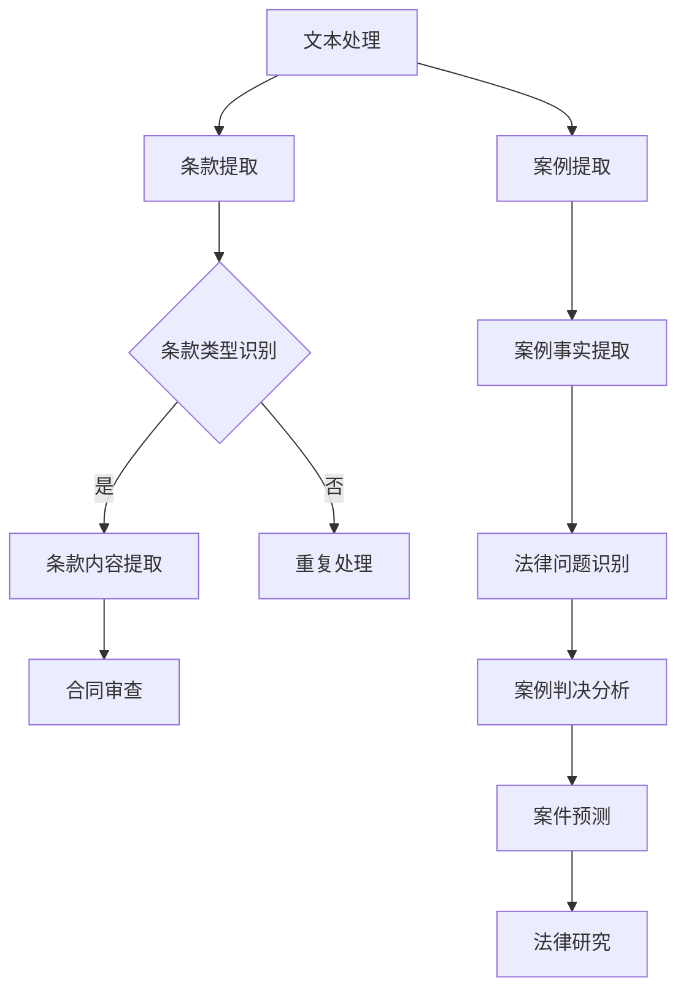

                 

# 法律AI：LLM在合同分析和案例研究中的应用

## 关键词

- 法律AI
- 语言模型
- 合同分析
- 案例研究

## 摘要

本文旨在探讨法律人工智能（Legal AI）中的语言模型（LLM）在合同分析和案例研究中的应用。通过梳理LLM的核心概念与原理，本文详细阐述了LLM在法律文本处理、合同条款提取、法律案例分析等方面的具体操作步骤。同时，本文结合实际项目案例，深入解析了LLM在合同分析中的应用场景，并推荐了相关的学习资源、开发工具框架及论文著作。最后，本文总结了法律AI的发展趋势与挑战，为未来法律AI的研究与应用提供了有益的参考。

## 1. 背景介绍

### 法律AI的兴起

随着人工智能技术的快速发展，法律领域也开始逐渐引入人工智能技术，以提升法律服务的效率和质量。法律人工智能（Legal AI）是指利用人工智能技术处理法律问题、辅助法律工作的技术手段。法律AI的应用范围广泛，包括但不限于合同分析、案件预测、法律研究、法律文书自动生成等。

### 语言模型的发展

语言模型（Language Model，简称LLM）是自然语言处理（Natural Language Processing，简称NLP）的重要技术之一。语言模型旨在预测文本中下一个词语的概率分布，从而实现对自然语言的理解和生成。随着深度学习技术的发展，尤其是Transformer模型的提出，语言模型在NLP领域的表现显著提升，推动了自然语言处理技术的快速发展。

### 合同分析和案例研究的重要性

合同分析是法律工作中的一个重要环节，涉及到合同条款的理解、提取和评估。准确的合同分析有助于识别潜在的法律风险，保障当事人的合法权益。案例研究则是法律工作中的一种重要方法，通过对实际案例的分析，可以总结法律规律、指导法律实践。

### LLM在合同分析和案例研究中的应用前景

LLM在合同分析和案例研究中的应用具有巨大的潜力。一方面，LLM可以高效地处理大量法律文本，提取合同条款的关键信息，辅助法律工作者进行合同审查；另一方面，LLM可以分析法律案例，提取案例中的关键因素，为案件预测和法律研究提供支持。随着LLM技术的不断成熟，其在法律AI领域的应用将越来越广泛。

## 2. 核心概念与联系

### 语言模型（LLM）的基本概念

语言模型（LLM）是一种概率模型，用于预测文本中下一个词语的概率分布。LLM基于大规模语料库进行训练，通过学习文本的统计规律，实现对自然语言的理解和生成。LLM的核心是参数化的概率模型，如神经网络模型（如Transformer模型）。

### 合同分析中的关键概念

在合同分析中，关键概念包括合同条款、条款类型、条款内容等。合同条款是合同的核心内容，规定了合同各方之间的权利和义务。条款类型包括但不限于违约条款、履行条款、解除条款等。条款内容则具体描述了各条款的具体细节。

### 案例研究中的关键概念

在案例研究中，关键概念包括案例事实、法律问题、案例判决等。案例事实是案例的核心内容，描述了案例的基本情况。法律问题是案例研究的核心，需要分析案例中涉及的法律问题。案例判决则是案例研究的结果，反映了法院对法律问题的判断。

### LLM在合同分析和案例研究中的应用

LLM在合同分析和案例研究中的应用主要体现在以下三个方面：

1. 法律文本处理：LLM可以处理大量法律文本，提取合同条款和案例事实，为合同分析和案例研究提供数据支持。

2. 合同条款提取：LLM可以识别合同中的关键条款，提取条款类型和内容，辅助法律工作者进行合同审查。

3. 案例分析：LLM可以分析法律案例，提取案例中的关键因素，为案件预测和法律研究提供支持。

### Mermaid流程图

下面是LLM在合同分析和案例研究中的应用流程的Mermaid流程图：



## 3. 核心算法原理 & 具体操作步骤

### 语言模型（LLM）的算法原理

LLM通常采用神经网络模型，如Transformer模型。Transformer模型是一种基于自注意力机制（self-attention）的模型，能够捕捉文本中的长距离依赖关系。下面是Transformer模型的基本原理：

1. 自注意力机制（Self-Attention）：自注意力机制是一种对序列中的每个词语计算其与其他词语的相似度，从而为每个词语生成权重。这种权重使得模型能够自动关注文本中的重要信息。

2. 多层叠加：Transformer模型通过多层叠加的方式，逐层提取文本中的特征。每层模型都会对输入序列进行处理，并输出一个固定大小的向量。

3. 编码器与解码器：Transformer模型包括编码器（Encoder）和解码器（Decoder）两部分。编码器负责将输入序列编码成向量表示，解码器负责从编码器的输出中解码出预测结果。

### 具体操作步骤

1. 数据准备：收集大量法律文本，包括合同、案例等，用于训练LLM。

2. 预处理：对法律文本进行预处理，包括分词、去除停用词、词干提取等操作。预处理后，将文本转化为模型可处理的输入格式。

3. 模型训练：使用预处理后的数据训练LLM。训练过程中，模型会通过优化损失函数来调整参数，从而提高模型的预测能力。

4. 模型评估：使用验证集评估模型的表现。通过计算模型的准确率、召回率等指标，评估模型在合同分析和案例研究中的效果。

5. 模型应用：将训练好的LLM应用于合同分析和案例研究。例如，使用LLM提取合同条款、分析法律案例等。

### 数学模型和公式

在LLM中，常用的数学模型包括自注意力机制和Transformer模型。下面是相关数学公式：

1. 自注意力机制

   $$ 
   \text{Attention}(Q, K, V) = \text{softmax}\left(\frac{QK^T}{\sqrt{d_k}}\right)V 
   $$

   其中，Q、K、V分别是编码器、解码器的输入和输出，d_k是键值对的维度。

2. Transformer模型

   $$ 
   \text{Encoder}(X) = \text{MultiHeadAttention}(X, X, X) + X 
   $$

   $$ 
   \text{Decoder}(X) = \text{MultiHeadAttention}(X, X, X) + X 
   $$

   其中，X是输入序列，MultiHeadAttention是多头注意力机制。

## 4. 项目实战：代码实际案例和详细解释说明

### 开发环境搭建

1. 安装Python环境，版本建议为3.8及以上。
2. 安装TensorFlow库，使用命令`pip install tensorflow`。
3. 安装其他依赖库，如Numpy、Pandas等。

### 源代码详细实现和代码解读

以下是一个简单的LLM在合同分析中的应用案例：

```python
import tensorflow as tf
from tensorflow.keras.layers import Embedding, LSTM, Dense
from tensorflow.keras.models import Sequential

# 数据准备
# 这里假设已经准备好了训练数据和测试数据
# train_data：训练数据，格式为列表，每个元素是一个字符串，表示一个合同文本
# test_data：测试数据，格式同上
# labels：标签数据，格式为列表，每个元素是一个字符串，表示合同条款类型

# 预处理
# 这里对文本进行预处理，包括分词、去除停用词等操作
# 省略具体预处理代码

# 模型构建
model = Sequential([
    Embedding(input_dim=vocab_size, output_dim=embedding_dim),
    LSTM(units=128, return_sequences=True),
    LSTM(units=128),
    Dense(units=num_classes, activation='softmax')
])

# 编译模型
model.compile(optimizer='adam', loss='categorical_crossentropy', metrics=['accuracy'])

# 训练模型
model.fit(train_data, labels, epochs=10, batch_size=32, validation_split=0.2)

# 评估模型
loss, accuracy = model.evaluate(test_data, labels)
print('Test accuracy:', accuracy)

# 应用模型
# 假设输入文本为input_text，使用模型进行预测
predictions = model.predict(input_text)
predicted_label = np.argmax(predictions)
print('Predicted label:', predicted_label)
```

### 代码解读与分析

1. 数据准备：首先需要准备好训练数据和测试数据，以及对应的标签数据。数据准备是模型训练的关键步骤，直接影响到模型的性能。

2. 预处理：对文本进行预处理，包括分词、去除停用词等操作。预处理后的文本将作为模型的输入。

3. 模型构建：使用Sequential模型构建一个简单的神经网络模型。模型包括三个主要层：嵌入层、LSTM层和输出层。

   - 嵌入层：将文本转换为固定大小的向量表示。
   - LSTM层：使用LSTM层对文本进行编码，提取文本中的特征。
   - 输出层：使用softmax激活函数进行分类预测。

4. 编译模型：编译模型，设置优化器和损失函数。这里使用adam优化器和categorical_crossentropy损失函数。

5. 训练模型：使用fit方法训练模型，设置训练轮数、批量大小和验证集比例。

6. 评估模型：使用evaluate方法评估模型在测试集上的性能。

7. 应用模型：使用predict方法对输入文本进行预测，输出预测结果。

## 5. 实际应用场景

### 合同审查

法律工作者可以使用LLM对合同进行自动化审查，识别潜在的法律风险。例如，可以自动提取合同中的关键条款，判断条款的合法性，检测可能存在的漏洞。

### 案件预测

LLM可以分析大量的法律案例，提取案例中的关键因素，为案件预测提供支持。例如，可以预测某个案件可能的法律判决结果，为法官提供参考。

### 法律研究

LLM可以辅助法律学者进行法律研究，提取法律案例中的关键信息，分析法律规律。例如，可以自动生成法律研究报告，提高研究效率。

### 智能客服

法律AI可以应用于智能客服领域，为用户提供法律咨询服务。例如，可以自动解答用户关于法律问题的咨询，提供相关的法律法规和案例。

### 法律文档生成

LLM可以自动生成法律文档，如合同、起诉状等。例如，可以根据用户输入的信息，自动生成符合法律规范的合同文档。

## 6. 工具和资源推荐

### 学习资源推荐

1. 《深度学习》（Goodfellow, Bengio, Courville）：系统介绍了深度学习的基础知识，适合初学者入门。
2. 《自然语言处理编程》（张俊林）：详细介绍了自然语言处理的基本概念和实战技巧。
3. 《法律AI：实务、趋势与未来》（黄辉）：系统介绍了法律AI的应用场景、技术原理和发展趋势。

### 开发工具框架推荐

1. TensorFlow：一款强大的开源深度学习框架，适合构建和训练大型神经网络模型。
2. PyTorch：一款流行的深度学习框架，易于使用，支持动态图计算。
3. Hugging Face：一个开源库，提供了丰富的预训练模型和工具，方便进行自然语言处理任务。

### 相关论文著作推荐

1. Vaswani et al. (2017). "Attention is All You Need". 这篇论文提出了Transformer模型，是当前自然语言处理领域的重要研究成果。
2. Devlin et al. (2019). "Bert: Pre-training of Deep Bidirectional Transformers for Language Understanding". 这篇论文提出了BERT模型，是当前自然语言处理领域的重要研究成果。
3. Chen et al. (2020). "LawQA: A Legal Question Answering Dataset and Benchmar

