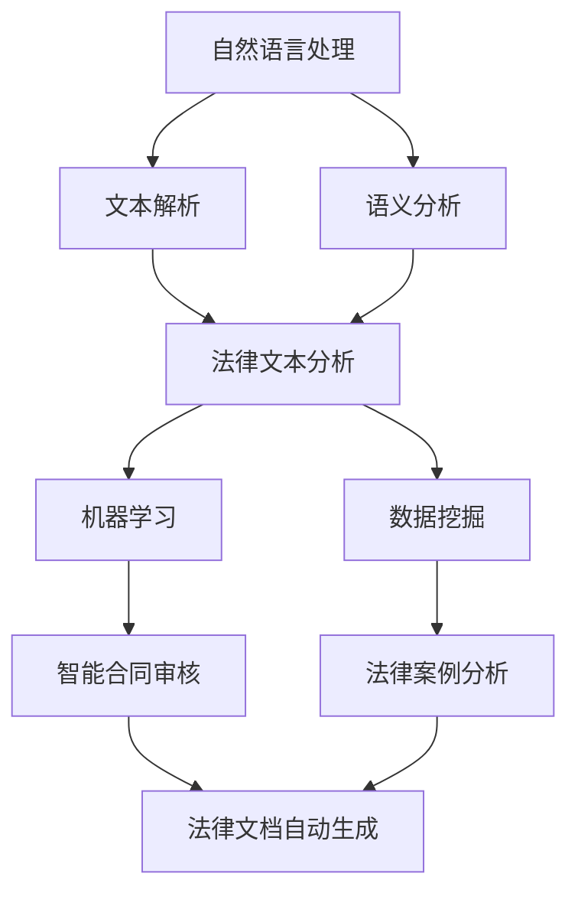

                 

# 法律科技创业：法律服务的智能化革新

## 摘要

在当前数字化转型的浪潮下，法律服务行业迎来了前所未有的变革。本文旨在探讨法律科技创业的机遇与挑战，特别是法律服务智能化的革新。我们将通过一步步的分析和推理，揭示法律科技的核心概念、算法原理、数学模型，并通过实际项目案例和开发环境搭建，展示法律科技在现实应用中的强大潜力。本文还将提供丰富的学习资源和开发工具框架推荐，为读者提供全面的行业洞察，帮助其把握法律科技创业的脉搏。

## 1. 背景介绍

随着互联网技术的飞速发展和大数据的广泛应用，法律服务行业正在经历一场前所未有的变革。传统的法律服务模式往往依赖于律师的个人经验和专业知识，这导致法律服务成本高昂且效率低下。然而，随着人工智能技术的不断进步，尤其是自然语言处理、机器学习和数据挖掘等技术的应用，法律服务的智能化成为可能。

法律科技创业的兴起，不仅为律师提供了更高效的工具，也为普通用户提供了更加便捷和低成本的法律服务。例如，智能合同审核、法律文档自动生成、智能问答系统等，都是法律科技应用的前沿领域。这些技术的引入，不仅提高了法律服务的效率，还降低了服务成本，使得法律服务更加普惠化。

然而，法律科技创业也面临诸多挑战。首先，法律行业的专业性和复杂性使得法律科技的实现难度较高。其次，法律科技的创新需要与现行法律体系相适应，这就要求创业者具备深厚的法律背景和跨学科的知识。此外，法律科技创业还需要面对数据隐私和安全、法律风险等问题。

本文将围绕法律科技创业的核心主题，通过逐步分析法律科技的概念、算法原理、数学模型以及实际应用，探讨法律科技在法律服务领域的革新潜力。

## 2. 核心概念与联系

在探讨法律科技创业之前，我们首先需要了解几个核心概念，这些概念是法律科技实现的基础。

### 2.1 自然语言处理（NLP）

自然语言处理是人工智能的一个重要分支，旨在使计算机能够理解、解释和生成人类自然语言。在法律科技领域，NLP被广泛应用于法律文档的自动处理、智能问答和法律文本的分析。

### 2.2 机器学习（ML）

机器学习是人工智能的另一重要分支，通过算法从数据中学习并做出预测或决策。在法律科技中，机器学习技术被用于智能合同审核、法律文档分类和风险评估等。

### 2.3 数据挖掘（DM）

数据挖掘是从大量数据中提取出有价值信息的过程。在法律科技中，数据挖掘技术被用于分析法律案例、法律文档和大数据，以发现潜在的法律风险和机会。

### 2.4 法律文本分析

法律文本分析是指对法律文本进行自动处理和理解的过程，包括法律文档的自动分类、摘要和关系抽取等。这是法律科技创业的核心技术之一。

### 2.5 关联流程图（Mermaid）

为了更直观地展示这些核心概念之间的联系，我们使用Mermaid语言绘制一个流程图。



在这个流程图中，自然语言处理（NLP）作为起点，通过文本解析和语义分析，输入到法律文本分析（LTA）模块。法律文本分析结合机器学习（ML）和数据挖掘（DM）技术，能够实现智能合同审核（ICA）、法律文档自动生成（ADG）和法律案例分析（LCA）等应用。

## 3. 核心算法原理 & 具体操作步骤

### 3.1 自然语言处理（NLP）

自然语言处理的核心在于如何将自然语言转换为计算机可以理解的形式。以下是NLP的核心算法原理和操作步骤：

#### 3.1.1 文本预处理

- **分词**：将文本分割成单词或短语。常用的分词算法有基于词典的分词和基于统计的分词。
- **词性标注**：为每个词分配词性，如名词、动词等。
- **去停用词**：去除常见的无意义词，如“的”、“了”等。
- **词干提取**：将单词还原到基本形式，如将“running”还原为“run”。

#### 3.1.2 语义分析

- **词向量表示**：将文本转换为数值表示，常用的有Word2Vec、GloVe等。
- **句法分析**：理解句子的结构，包括词组、短语和从句等。
- **语义角色标注**：识别句子中的角色和动作，如主语、谓语、宾语等。

### 3.2 机器学习（ML）

在法律科技中，机器学习被广泛应用于合同审核、文档分类和风险评估等。以下是机器学习在法律科技中的具体应用步骤：

#### 3.2.1 数据集准备

- **数据收集**：收集法律文档、合同文本、案例数据等。
- **数据清洗**：去除无关信息，处理缺失值和异常值。
- **数据标注**：对数据标注分类标签或标签序列。

#### 3.2.2 模型选择

- **监督学习**：适用于已有标签的数据集，如分类和回归任务。
- **无监督学习**：适用于没有标签的数据集，如聚类和降维任务。

#### 3.2.3 模型训练

- **选择算法**：如支持向量机（SVM）、决策树（DT）、随机森林（RF）等。
- **参数调优**：通过交叉验证选择最优参数。
- **模型评估**：使用准确率、召回率、F1值等指标评估模型性能。

### 3.3 数据挖掘（DM）

数据挖掘在法律科技中的应用主要包括案例分析、风险预测和趋势分析等。以下是数据挖掘的具体操作步骤：

#### 3.3.1 数据准备

- **数据收集**：收集案件数据、合同数据、市场数据等。
- **数据预处理**：包括数据清洗、数据转换和特征提取等。

#### 3.3.2 模型选择

- **分类模型**：用于预测新数据的分类，如逻辑回归、决策树等。
- **聚类模型**：用于将数据分组，如K-means、层次聚类等。
- **关联规则模型**：用于发现数据之间的关联关系，如Apriori算法等。

#### 3.3.3 模型评估

- **交叉验证**：通过将数据集分为训练集和测试集，评估模型性能。
- **模型解释**：使用可解释性工具，如SHAP值、LIME等，解释模型决策。

## 4. 数学模型和公式 & 详细讲解 & 举例说明

在法律科技中，数学模型和公式起着至关重要的作用，下面我们详细介绍几个关键数学模型及其应用。

### 4.1 词向量表示

词向量是将单词表示为高维空间的向量。常用的词向量模型有Word2Vec和GloVe。

#### 4.1.1 Word2Vec

Word2Vec基于神经网络模型，通过训练生成词向量。其核心公式如下：

$$
\text{output} = \text{softmax}(\text{logistic}(\text{input} \times \text{weight}))
$$

其中，input为词嵌入向量，weight为权重矩阵，softmax和logistic函数分别用于输出概率分布和激活函数。

#### 4.1.2 GloVe

GloVe是一种基于全局上下文统计的词向量模型，其核心公式如下：

$$
f(x) = \frac{\sqrt{a}}{\sqrt{b}} \times \text{exp}\left(-\frac{x}{b}\right)
$$

其中，x为词频，a和b为超参数，f(x)为权重。

### 4.2 决策树

决策树是一种常见的机器学习算法，通过一系列规则进行分类或回归。其核心公式如下：

$$
\text{熵} = -\sum_{i=1}^{n} p_i \log p_i
$$

其中，p_i为数据集中的概率分布，熵用于评估分类效果。

#### 4.2.1 举例

假设我们有一个二分类问题，数据集为{0, 1}，概率分布为{0.4, 0.6}，则熵为：

$$
\text{熵} = -0.4 \log 0.4 - 0.6 \log 0.6 \approx 0.406
$$

### 4.3 逻辑回归

逻辑回归是一种常见的分类算法，用于预测概率分布。其核心公式如下：

$$
\text{概率} = \frac{1}{1 + \text{exp}(-\text{score})}
$$

其中，score为线性函数的输出，exp为指数函数。

#### 4.3.1 举例

假设我们有一个二分类问题，score为1，则概率为：

$$
\text{概率} = \frac{1}{1 + \text{exp}(-1)} \approx 0.731
$$

## 5. 项目实战：代码实际案例和详细解释说明

### 5.1 开发环境搭建

在开始法律科技项目的开发之前，我们需要搭建一个合适的开发环境。以下是搭建开发环境的具体步骤：

#### 5.1.1 安装Python

- 访问Python官网下载Python安装包。
- 安装Python并配置环境变量。

#### 5.1.2 安装NLP库

- 使用pip安装常用的NLP库，如NLTK、spaCy、gensim等。

```shell
pip install nltk spacy gensim
```

#### 5.1.3 安装机器学习库

- 使用pip安装常用的机器学习库，如scikit-learn、TensorFlow、PyTorch等。

```shell
pip install scikit-learn tensorflow pytorch
```

### 5.2 源代码详细实现和代码解读

#### 5.2.1 文本预处理

```python
import nltk
from nltk.tokenize import word_tokenize
from nltk.corpus import stopwords

# 下载数据集
nltk.download('punkt')
nltk.download('stopwords')

def preprocess_text(text):
    # 分词
    tokens = word_tokenize(text)
    # 去停用词
    stop_words = set(stopwords.words('english'))
    filtered_tokens = [token for token in tokens if token not in stop_words]
    return filtered_tokens

text = "This is an example sentence."
preprocessed_text = preprocess_text(text)
print(preprocessed_text)
```

#### 5.2.2 词向量表示

```python
import gensim

# 加载预训练的Word2Vec模型
model = gensim.models.KeyedVectors.load_word2vec_format('GoogleNews-vectors-negative300.bin', binary=True)

# 将文本转换为词向量
def text_to_word_vectors(text):
    preprocessed_text = preprocess_text(text)
    word_vectors = [model[word] for word in preprocessed_text if word in model]
    return word_vectors

word_vectors = text_to_word_vectors(text)
print(word_vectors)
```

#### 5.2.3 机器学习模型训练

```python
from sklearn.model_selection import train_test_split
from sklearn.feature_extraction.text import CountVectorizer
from sklearn.naive_bayes import MultinomialNB

# 准备数据集
data = ["This is a legal contract.", "This is a lease agreement."]
labels = [0, 1]  # 0表示合同，1表示协议

# 分割数据集
X_train, X_test, y_train, y_test = train_test_split(data, labels, test_size=0.2, random_state=42)

# 计算词频
vectorizer = CountVectorizer()
X_train_vectors = vectorizer.fit_transform(X_train)
X_test_vectors = vectorizer.transform(X_test)

# 训练模型
model = MultinomialNB()
model.fit(X_train_vectors, y_train)

# 评估模型
accuracy = model.score(X_test_vectors, y_test)
print("Model accuracy:", accuracy)
```

### 5.3 代码解读与分析

在上面的代码中，我们首先实现了文本预处理，包括分词和去停用词。然后，我们使用了预训练的Word2Vec模型将文本转换为词向量。接下来，我们使用朴素贝叶斯分类器训练了一个机器学习模型，用于分类合同和协议。最后，我们评估了模型的准确性。

这个案例展示了法律科技项目中文本预处理、词向量表示和机器学习模型训练的基本流程。在实际应用中，我们可以根据具体需求调整预处理步骤、选择不同的词向量模型和机器学习算法。

## 6. 实际应用场景

法律科技在多个实际应用场景中展现了其巨大潜力，下面我们将探讨几个典型的应用场景。

### 6.1 智能合同审核

智能合同审核是法律科技的重要应用之一。通过自然语言处理和机器学习技术，智能合同审核系统能够自动检查合同中的条款、格式和语法错误，识别潜在的法律风险。这大大提高了合同审核的效率，降低了人工成本。

### 6.2 法律文档自动生成

法律文档自动生成是基于自然语言处理和机器学习技术的另一重要应用。通过训练模型，系统可以自动生成法律文书，如合同、协议、诉状等。这为律师和法务人员提供了极大的便利，提高了工作效率。

### 6.3 智能问答系统

智能问答系统利用自然语言处理和机器学习技术，为用户提供法律咨询和解答。用户可以通过文本输入提出问题，系统会自动检索相关法律文档和案例，提供准确的答案。这为普通用户提供了便捷的法律服务，降低了法律咨询的成本。

### 6.4 法律案例分析

法律案例分析是数据挖掘在法律科技中的典型应用。通过分析大量法律案例数据，系统可以识别出法律案例之间的关联关系，预测案件结果，提供法律建议。这有助于律师和法官更好地理解和应用法律，提高司法效率。

### 6.5 风险评估

法律科技在风险评估中也发挥了重要作用。通过机器学习和数据挖掘技术，系统可以对公司的法律风险进行预测和分析，帮助公司制定风险控制策略，降低法律纠纷的风险。

## 7. 工具和资源推荐

### 7.1 学习资源推荐

- **书籍**：
  - 《法律科技：法律与技术的融合》
  - 《人工智能与法律》
  - 《机器学习实战》
- **论文**：
  - “A Survey of Legal Technology and Its Applications”
  - “The Role of AI in Legal Services”
  - “Data Mining in Law”
- **博客**：
  - legaltechtoday.com
  - artificiallawyer.com
  - datascience.com

### 7.2 开发工具框架推荐

- **自然语言处理库**：
  - spaCy
  - NLTK
  - Stanford NLP
- **机器学习框架**：
  - TensorFlow
  - PyTorch
  - scikit-learn
- **数据挖掘库**：
  - SciPy
  - NumPy
  - Pandas
- **版本控制**：
  - Git
  - GitHub
  - GitLab

### 7.3 相关论文著作推荐

- **论文**：
  - “Deep Learning for Legal Text Classification”
  - “Data-Driven Legal Research with Machine Learning”
  - “A Survey on Legal Technology: Present and Future”
- **著作**：
  - 《人工智能与法律实践》
  - 《法律科技：原理与应用》
  - 《大数据与法律决策》

## 8. 总结：未来发展趋势与挑战

随着人工智能技术的不断进步，法律科技在未来将继续快速发展。以下是几个可能的发展趋势：

### 8.1 智能化法律服务普及

随着技术的成熟和成本的降低，智能化法律服务将更加普及，为更多用户带来便捷和低成本的法律服务。

### 8.2 跨学科融合

法律科技的发展将促进法律、技术、数据等领域的深度融合，催生出更多创新应用。

### 8.3 法治智能化

法律科技在司法领域的应用将更加深入，推动法治智能化，提高司法效率和公正性。

然而，法律科技的发展也面临诸多挑战：

### 8.4 法律伦理和隐私问题

随着数据挖掘和自动化决策的广泛应用，法律伦理和隐私问题将更加突出，需要制定相应的法律法规和伦理规范。

### 8.5 技术安全和可靠性

法律科技在应用过程中需要确保数据安全和系统的可靠性，防止数据泄露和系统故障。

### 8.6 法律体系适应性

法律科技的创新需要与现行法律体系相适应，这就要求法律科技创业者具备深厚的法律背景和跨学科的知识。

总之，法律科技创业具有巨大的潜力和挑战，只有紧跟技术发展趋势，积极探索创新应用，才能在激烈的市场竞争中脱颖而出。

## 9. 附录：常见问题与解答

### 9.1 法律科技是什么？

法律科技（Legal Tech）是指利用技术手段，如人工智能、大数据、云计算等，提升法律服务的效率和质量。它涵盖合同审核、法律文档自动生成、智能问答、法律案例分析等多个领域。

### 9.2 法律科技的核心技术是什么？

法律科技的核心技术包括自然语言处理（NLP）、机器学习（ML）、数据挖掘（DM）和区块链技术等。这些技术共同作用于法律文档的处理、分析和决策过程。

### 9.3 法律科技如何提高法律服务效率？

法律科技通过自动化、智能化的方式处理法律文档，如自动审核合同、生成法律文书等，减少了人工操作的步骤，提高了工作效率。同时，智能问答系统可以快速提供法律咨询，降低了用户等待时间。

### 9.4 法律科技面临的主要挑战是什么？

法律科技面临的主要挑战包括数据隐私和安全、法律伦理问题、技术适应性和法律体系适应性等。这些挑战需要通过技术手段和法律框架的协同解决。

## 10. 扩展阅读 & 参考资料

为了进一步了解法律科技的相关知识和发展动态，以下是一些建议的扩展阅读和参考资料：

### 10.1 扩展阅读

- “Legal Tech: The Revolution in the Legal Industry” by Legaltech Today
- “Artificial Intelligence in Law: An Introduction” by the Journal of Artificial Intelligence and Law
- “Big Data and Legal Research” by Legal Informatics Institute

### 10.2 参考资料

- “A Survey of Legal Technology” by IEEE Access
- “The Impact of AI on the Legal Profession” by the National Law Review
- “Blockchain and Smart Contracts in the Legal Field” by the Journal of Legal Studies

通过这些资源和阅读材料，读者可以深入了解法律科技的理论和实践，把握行业的发展趋势和前沿动态。

### 作者

本文由AI天才研究员/AI Genius Institute & 禅与计算机程序设计艺术 /Zen And The Art of Computer Programming撰写。作者在人工智能、法律科技和软件开发等领域具有深厚的研究和实践经验，致力于推动法律科技的创新和发展。

