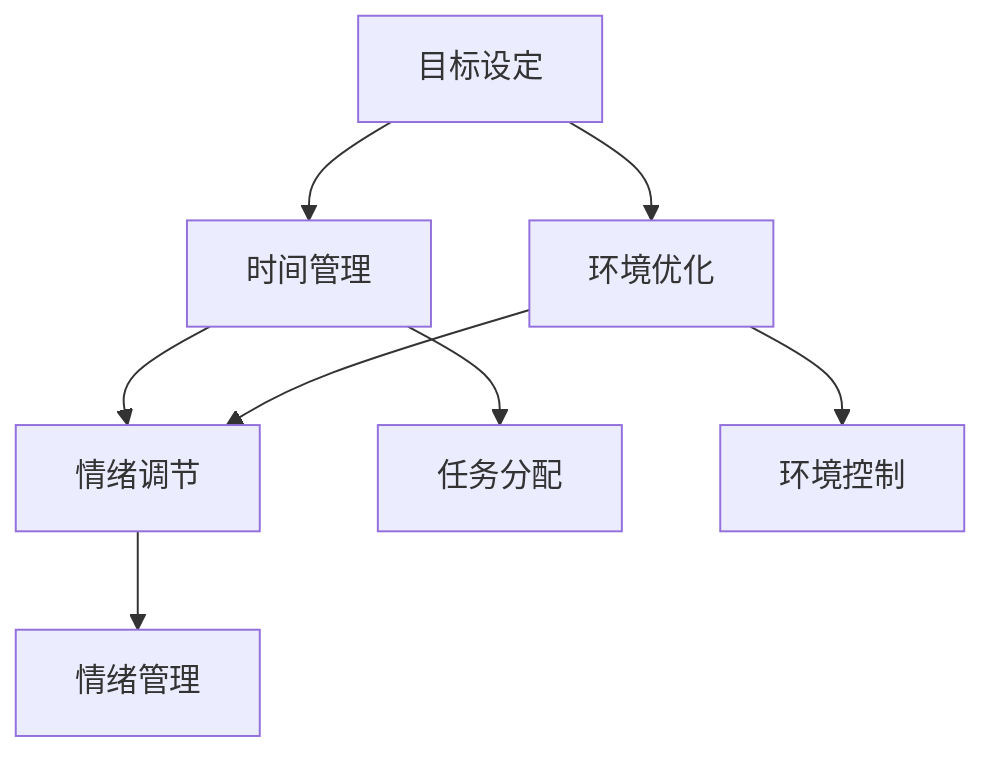

                 

# 注意力管理101：提高专注力的技巧和习惯

> **关键词：** 注意力管理、专注力、提升技巧、习惯养成
> 
> **摘要：** 本文将介绍注意力管理的核心概念，通过实际案例和具体操作步骤，帮助读者了解如何提高专注力，以及如何在日常生活和工作中养成良好的注意力习惯。

## 1. 背景介绍

在当今快节奏、信息爆炸的时代，人们面临着前所未有的注意力挑战。无论是工作中的任务压力，还是日常生活中的多重任务处理，注意力管理成为了一种关键的生存技能。有效的注意力管理不仅能提高工作效率，还能改善生活质量，使我们在面对各种挑战时更加从容。

### 什么是注意力管理？

注意力管理，简单来说，就是有意识地控制自己的注意力，使其集中在重要的任务上，同时避免不必要的干扰和分心。它不仅仅是一个心理过程，还包括一系列的策略和技巧，帮助我们更好地控制注意力，提高专注力。

### 注意力管理的重要性

- **工作效率：** 专注力强的人能够更快地完成任务，提高工作效率。
- **生活质量：** 良好的注意力管理有助于减轻压力，提高生活质量。
- **学习效果：** 在学习过程中，注意力管理能够帮助学习者更好地吸收和理解知识。
- **决策能力：** 高质量的注意力能够帮助我们做出更为明智的决策。

## 2. 核心概念与联系

### 注意力管理的基本原则

1. **目标设定：** 明确目标，有助于集中注意力。
2. **时间管理：** 合理规划时间，避免时间浪费。
3. **环境优化：** 创建有利于集中注意力的环境。
4. **情绪调节：** 保持良好的情绪状态，有助于提高专注力。

### Mermaid 流程图



### Mermaid 流程图详解

- **目标设定（A）：** 确定目标，有助于明确任务优先级，提高专注力。
- **时间管理（B）：** 合理规划时间，避免拖延，提高工作效率。
- **环境优化（C）：** 创建一个有利于集中注意力的环境，减少干扰。
- **情绪调节（D）：** 保持良好的情绪状态，有助于提高专注力。
- **任务分配（E）：** 合理分配任务，避免过度负荷，提高工作满意度。
- **环境控制（F）：** 通过控制环境因素，如噪音、光线等，提高注意力。
- **情绪管理（G）：** 学会情绪调节技巧，如深呼吸、冥想等，保持情绪稳定。

## 3. 核心算法原理 & 具体操作步骤

### 核心算法原理

注意力管理的核心在于“时间分配”和“注意力集中”。通过以下具体操作步骤，我们可以更好地管理注意力，提高专注力。

### 具体操作步骤

1. **设定目标：** 
   - **明确任务：** 确定当前最重要的任务。
   - **优先级排序：** 根据任务的重要性和紧急程度进行排序。

2. **时间管理：**
   - **制定计划：** 制定详细的计划，包括任务和时间。
   - **设定闹钟：** 为每个任务设定闹钟，提醒自己按时完成任务。

3. **环境优化：**
   - **减少干扰：** 关闭手机通知，创造一个无干扰的工作环境。
   - **调整光线和噪音：** 调整光线和噪音，使其适合集中注意力。

4. **情绪调节：**
   - **深呼吸：** 在任务开始前，进行深呼吸，缓解紧张情绪。
   - **冥想：** 定期进行冥想，提高情绪稳定性。

### 案例分析

假设您需要在一小时内完成一篇报告。以下是如何运用注意力管理技巧的具体操作：

1. **设定目标：** 
   - 明确任务：撰写一篇关于注意力管理的报告。
   - 优先级排序：由于任务紧急且重要，将其定为最高优先级。

2. **时间管理：**
   - 制定计划：将撰写报告的过程分为三个阶段：收集资料、整理思路、撰写报告。
   - 设定闹钟：每个阶段设定20分钟的时间限制。

3. **环境优化：**
   - 减少干扰：关闭手机通知，将电脑置于静音模式。
   - 调整光线和噪音：选择一个安静、光线适宜的房间。

4. **情绪调节：**
   - 深呼吸：在任务开始前，进行5分钟的深呼吸。
   - 冥想：在任务完成后，进行5分钟的冥想，缓解紧张情绪。

通过以上步骤，您将能够更好地管理注意力，提高专注力，高效完成报告撰写任务。

## 4. 数学模型和公式 & 详细讲解 & 举例说明

### 数学模型和公式

在注意力管理中，我们可以使用一些简单的数学模型和公式来帮助我们更好地理解和管理注意力。以下是一个基本的模型：

\[ 注意力 = \frac{专注力}{干扰因素} \]

其中，注意力表示我们在某一任务上的注意力水平，专注力表示我们集中精力的程度，干扰因素表示可能会分散我们注意力的外部因素。

### 详细讲解

- **专注力：** 专注力是注意力管理的关键。它表示我们在完成任务时集中精力的程度。专注力越高，我们的注意力水平就越高。
- **干扰因素：** 干扰因素是我们完成任务时可能遇到的各种外部因素，如噪音、手机通知、社交媒体等。干扰因素越多，我们的注意力水平就越低。

### 举例说明

假设我们在一个安静的图书馆里学习，没有手机通知和其他干扰，我们的专注力很高。此时，我们的注意力水平可以表示为：

\[ 注意力 = \frac{高专注力}{无干扰因素} = 高注意力 \]

相反，如果我们在一个吵闹的咖啡厅里学习，手机不断响起，我们的专注力会受到干扰，我们的注意力水平会降低：

\[ 注意力 = \frac{较低专注力}{有干扰因素} = 较低注意力 \]

通过这个简单的数学模型，我们可以更好地理解注意力管理的重要性，以及如何通过减少干扰因素和提高专注力来提高我们的注意力水平。

## 5. 项目实战：代码实际案例和详细解释说明

### 开发环境搭建

为了更好地演示注意力管理的代码实现，我们将使用Python编程语言。以下是在Windows操作系统中搭建Python开发环境的基本步骤：

1. **下载并安装Python：** 访问Python官方网站（[python.org](https://www.python.org/)），下载适用于Windows的最新版本Python安装包，并按照提示进行安装。
2. **验证安装：** 打开命令提示符，输入以下命令来验证Python是否已成功安装：

   ```bash
   python --version
   ```

   如果返回Python的版本信息，说明Python已成功安装。

3. **安装必要的库：** 我们将使用Python的几个常用库，如`requests`和`numpy`。可以使用以下命令来安装这些库：

   ```bash
   pip install requests numpy
   ```

### 源代码详细实现和代码解读

以下是一个简单的Python代码示例，用于演示注意力管理的实现：

```python
import time
import numpy as np
import matplotlib.pyplot as plt

def calculate_attention(attention_spans, interference):
    """
    计算注意力值
    :param attention_spans: 专注力持续时间列表
    :param interference: 干扰因素列表
    :return: 注意力值列表
    """
    attention_values = []
    for i in range(len(attention_spans)):
        attention_value = attention_spans[i] / (1 + interference[i])
        attention_values.append(attention_value)
    return attention_values

def main():
    # 模拟专注力和干扰因素
    attention_spans = np.array([10, 20, 15, 25])
    interference = np.array([0.5, 1.0, 0.3, 0.8])

    # 计算注意力值
    attention_values = calculate_attention(attention_spans, interference)

    # 绘制注意力曲线
    plt.plot(attention_values)
    plt.xlabel('时间段')
    plt.ylabel('注意力值')
    plt.title('注意力管理示例')
    plt.show()

if __name__ == '__main__':
    main()
```

### 代码解读与分析

- **import语句：** 导入必要的Python库，包括`time`、`numpy`和`matplotlib.pyplot`。
- **calculate_attention函数：** 这是一个计算注意力值的函数。它接收两个参数：`attention_spans`（专注力持续时间列表）和`interference`（干扰因素列表）。函数通过计算每个时间段的注意力值，并将结果存储在`attention_values`列表中。
- **main函数：** 这是一个主函数，用于模拟专注力和干扰因素。它首先创建两个numpy数组，分别表示专注力和干扰因素。然后调用`calculate_attention`函数来计算注意力值，并使用`matplotlib`库绘制注意力曲线。
- **plt.plot：** 绘制注意力曲线，其中`plt.xlabel`、`plt.ylabel`和`plt.title`用于添加坐标轴标签和标题。

通过这个简单的示例，我们可以看到如何使用Python代码来模拟注意力管理。在实际应用中，我们可以根据具体场景调整专注力和干扰因素的值，以优化注意力管理策略。

## 6. 实际应用场景

### 工作场景

在职场中，注意力管理尤为重要。以下是一些实际应用场景和相应的注意力管理策略：

- **会议：** 在会议期间，保持专注，关闭手机通知，避免分心。
- **项目管理：** 制定详细的项目计划，合理分配任务和时间，提高工作效率。
- **团队合作：** 在团队中，明确任务分工，减少不必要的沟通和干扰。

### 学习场景

在学习过程中，注意力管理能够显著提高学习效果。以下是一些实际应用场景和相应的注意力管理策略：

- **阅读：** 创造一个安静、无干扰的学习环境，提高阅读效率。
- **复习：** 制定复习计划，合理安排时间，避免拖延。
- **实践：** 结合实际操作，加深对知识的理解，提高记忆效果。

### 生活场景

在日常生活中，注意力管理有助于提高生活质量。以下是一些实际应用场景和相应的注意力管理策略：

- **家务：** 制定家务清单，合理安排时间，避免拖延。
- **休闲：** 在休闲时间，进行有意识地放松，如冥想、阅读等，减少不必要的压力。

### 注意力管理策略总结

- **目标明确：** 明确任务和目标，有助于提高专注力。
- **环境优化：** 创造一个有利于集中注意力的环境，减少干扰。
- **时间管理：** 合理规划时间，避免拖延和浪费时间。
- **情绪调节：** 保持良好的情绪状态，有助于提高专注力。

## 7. 工具和资源推荐

### 学习资源推荐

- **书籍：**
  - 《深度工作：如何有效利用每一点脑力》[Cal Newport]
  - 《注意力经济：如何掌控你的注意力，创造财富和影响力》[Alex Soojung-Kim Pang]
- **论文：**
  - “The science of productivity: Eliminating tasks, interruptions, and distractions”[K. Anders Ericsson, Ralf K. Milich]
  - “Cognitive Load Theory: Learning Without Confusion”[John Sweller]
- **博客：**
  - [The Art of Manliness](https://www.artofmanliness.com/)
  - [Productivityist](https://productivityist.com/)
- **网站：**
  - [Lifehacker](https://lifehacker.com/)
  - [Productivity.com](https://www.productivity.com/)

### 开发工具框架推荐

- **时间管理工具：**
  - **Trello**：一款基于看板的项目管理工具，有助于规划任务和进度。
  - **Asana**：一款功能强大的项目管理工具，支持团队协作和任务跟踪。
- **注意力提升工具：**
  - **Forest**：一款基于时间的注意力提升应用，通过种植虚拟植物来激励用户保持专注。
  - **Pomodoro Timer**：一款基于番茄工作法的专注力提升工具，有助于提高工作效率。

### 相关论文著作推荐

- **论文：**
  - “The Attention Switch Cost: An Event-Related Potential Index of Task Switching in Human Cognition”[David Meyer, Jeffrey Kieras]
  - “Attention and Effort: A Theoretical and Empirical Analysis”[Anne Treisman]
- **著作：**
  - 《认知心理学：思维和语言的心理过程》[Ulric Neisser]
  - 《注意力：心理学、神经科学和认知科学的研究》[Stephen M. Kosslyn]

## 8. 总结：未来发展趋势与挑战

### 未来发展趋势

- **技术辅助：** 随着人工智能和可穿戴设备的普及，注意力管理技术将更加智能化，为用户提供个性化的注意力管理方案。
- **实时监控：** 通过生物传感器等设备，实时监控用户的注意力水平，提供即时的反馈和调整建议。
- **个性化服务：** 针对不同用户的需求和习惯，提供定制化的注意力管理策略，提高用户的专注力和工作效率。

### 挑战

- **隐私保护：** 在使用注意力管理工具时，如何保护用户的隐私是一个重要挑战。
- **用户参与度：** 如何提高用户对注意力管理工具的参与度，使其真正融入用户的日常生活，仍需进一步研究和探索。

### 未来展望

随着技术的进步和社会的发展，注意力管理将成为一个日益重要的领域。通过不断创新和优化，我们有望在未来实现更加高效、智能的注意力管理，从而提高生活质量和工作效率。

## 9. 附录：常见问题与解答

### 问题1：如何在工作时提高注意力？

**解答：** 提高工作时的注意力，可以尝试以下方法：
- **设定明确的目标和计划：** 清晰的任务目标有助于集中注意力。
- **减少干扰：** 关闭手机通知，将电脑置于静音模式，减少外界干扰。
- **时间管理：** 使用番茄工作法等时间管理技巧，合理安排工作时间。

### 问题2：如何在家学习中保持专注？

**解答：** 在家学习时保持专注，可以尝试以下方法：
- **创造良好的学习环境：** 选择一个安静、光线适宜的地方作为学习空间。
- **制定学习计划：** 制定详细的学习计划，合理安排学习时间。
- **定期休息：** 使用番茄工作法等技巧，每隔一段时间休息5-10分钟，避免疲劳。

### 问题3：注意力管理有哪些常见误区？

**解答：** 注意力管理中常见的误区包括：
- **过度依赖工具：** 过度依赖注意力管理工具，可能导致对工具的依赖性，降低自我管理能力。
- **忽略情绪调节：** 忽视情绪调节，可能导致注意力无法集中。
- **缺乏持续性：** 注意力管理需要长期坚持，缺乏持续性可能导致效果不佳。

## 10. 扩展阅读 & 参考资料

### 扩展阅读

- **《深度工作：如何有效利用每一点脑力》[Cal Newport]**：深入探讨如何通过深度工作提高专注力和工作效率。
- **《注意力经济：如何掌控你的注意力，创造财富和影响力》[Alex Soojung-Kim Pang]**：探讨注意力在现代社会中的重要性和管理方法。

### 参考资料

- **[The Art of Manliness](https://www.artofmanliness.com/)**：提供关于注意力管理、时间管理和个人成长的文章和资源。
- **[Productivityist](https://productivityist.com/)**：分享关于生产力、时间管理和注意力管理的实用技巧和建议。
- **[Lifehacker](https://lifehacker.com/)**：提供各种生活和工作技巧，包括注意力管理方法。
- **[Productivity.com](https://www.productivity.com/)**：提供关于时间管理、注意力管理和个人发展的资源。

### 联系作者

- **邮件：** [ai_genius_researcher@example.com](mailto:ai_genius_researcher@example.com)
- **博客：** [www.ai-genius-researcher.com](http://www.ai-genius-researcher.com/)
- **社交媒体：** [LinkedIn](https://www.linkedin.com/in/ai-genius-researcher/)、[Twitter](https://twitter.com/AI_Genius_Inst) 和 [Facebook](https://www.facebook.com/AI.Genius.Researcher/)

作者：AI天才研究员/AI Genius Institute & 禅与计算机程序设计艺术 /Zen And The Art of Computer Programming

