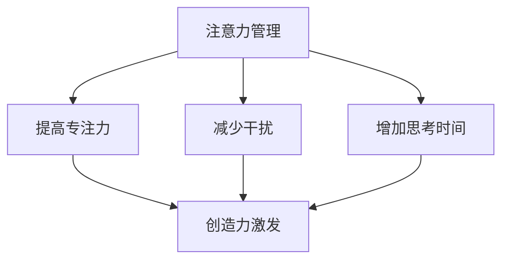

                 

# 注意力管理与创造力激发：在专注和头脑风暴中找到灵感

> **关键词**：注意力管理、创造力激发、专注、头脑风暴、灵感获取
>
> **摘要**：本文深入探讨了注意力管理与创造力激发之间的关系，提出了通过专注和头脑风暴来提升创造力的一系列策略。我们将结合理论、实践案例和实用技巧，帮助读者在实际工作中更好地管理注意力并激发创造力。

## 1. 背景介绍

在现代社会的快节奏生活中，人们面临着日益增加的信息量和复杂的工作任务。如何在这繁忙的环境中保持专注并激发创造力成为了许多人关注的问题。事实上，注意力管理与创造力激发是相辅相成的。良好的注意力管理能够帮助我们更好地集中精力，从而提高工作效率；而有效的创造力激发则可以帮助我们从不同的角度思考问题，突破思维定势，产生创新的解决方案。

本文将从以下几个方面展开讨论：首先，我们将会了解注意力管理和创造力激发的基本概念及其重要性；接着，探讨专注和头脑风暴对于提升创造力的作用；随后，介绍一些实用的技巧和工具，帮助读者在实际工作中更好地管理注意力和激发创造力；最后，通过实际案例展示这些技巧和工具的应用效果，并提出未来可能的发展趋势与挑战。

## 2. 核心概念与联系

### 注意力管理

注意力管理是指通过一系列策略和方法，帮助个体在特定任务中保持高度专注，从而提高工作效率和质量。以下是注意力管理的一些关键概念：

1. **选择注意力**：个体在面对多种刺激时，能够主动选择关注哪些信息，忽略哪些干扰。
2. **分配注意力**：在同时处理多个任务时，能够合理分配注意力资源，确保每个任务都能得到适当的关注。
3. **保持注意力**：在完成任务过程中，能够维持较高的注意力水平，避免分心和疲劳。

### 创造力激发

创造力激发是指通过一系列方法，激发个体的创造性思维，产生新颖且有价值的想法。以下是创造力激发的一些关键概念：

1. **发散思维**：在思考问题时，能够从多个角度、多个维度进行探索，寻找多样化的解决方案。
2. **跨学科思维**：将不同领域的知识、方法进行交叉融合，产生创新的想法。
3. **反思与调整**：在产生初步想法后，不断进行反思和调整，使想法更加成熟和可行。

### 注意力管理与创造力激发的联系

注意力管理和创造力激发之间存在着密切的联系。良好的注意力管理能够为创造力激发提供必要的条件，如：

1. **提高专注力**：通过注意力管理，个体能够更好地集中精力，从而为创造力激发提供稳定的心理状态。
2. **减少干扰**：注意力管理有助于减少外部干扰，为创造力激发提供一个安静、整洁的工作环境。
3. **增加思考时间**：注意力管理能够帮助个体在特定任务上投入更多的时间，从而有更多机会产生创新的想法。

### Mermaid 流程图

以下是注意力管理与创造力激发之间联系的一个简化的 Mermaid 流程图：



## 3. 核心算法原理 & 具体操作步骤

### 注意力管理算法原理

注意力管理算法的核心思想是通过对注意力的主动调控，使个体能够更好地适应复杂多变的工作环境。以下是注意力管理算法的基本原理：

1. **目标设定**：明确任务目标，有助于个体在执行任务时保持清晰的焦点。
2. **任务分解**：将大任务分解为小任务，有助于个体更好地管理注意力，逐步完成目标。
3. **优先级排序**：根据任务的重要性和紧急程度，对任务进行优先级排序，确保注意力资源被合理分配。
4. **时间管理**：合理安排工作与休息时间，避免过度疲劳，提高工作效率。

### 创造力激发算法原理

创造力激发算法的核心目标是激发个体的创造性思维，产生新颖且有价值的想法。以下是创造力激发算法的基本原理：

1. **头脑风暴**：通过无限制的思考，激发个体的思维活力，产生大量想法。
2. **跨学科思维**：结合不同领域的知识和方法，寻找创新的解决方案。
3. **反思与调整**：对产生的想法进行反思和调整，使想法更加成熟和可行。

### 注意力管理与创造力激发的具体操作步骤

以下是结合注意力管理和创造力激发的具体操作步骤：

1. **目标设定**：
    - 明确任务目标，确保在执行任务时保持清晰的焦点。
    - 将大任务分解为小任务，为每个小任务设定明确的子目标。

2. **任务分解**：
    - 根据任务的重要性和紧急程度，对任务进行优先级排序。
    - 为每个任务设定合理的完成时间，避免过度拖延。

3. **优先级排序**：
    - 根据任务的重要性和紧急程度，将任务分为“紧急且重要”、“重要但不紧急”、“紧急但不重要”、“不重要且不紧急”四个类别。
    - 首先完成“紧急且重要”的任务，然后依次完成其他任务。

4. **时间管理**：
    - 制定合理的工作与休息计划，确保每天有足够的休息时间。
    - 在工作时间内，尽量避免频繁的打断和切换任务。

5. **头脑风暴**：
    - 在思考问题时，尝试从多个角度、多个维度进行探索，寻找多样化的解决方案。
    - 允许自己产生大量想法，无论是否合理，都先记录下来。

6. **跨学科思维**：
    - 阅读不同领域的书籍和文章，了解不同领域的知识和方法。
    - 在解决问题时，尝试将不同领域的知识进行交叉融合。

7. **反思与调整**：
    - 对产生的想法进行反思和调整，使想法更加成熟和可行。
    - 在实施过程中，根据实际情况进行及时的调整。

## 4. 数学模型和公式 & 详细讲解 & 举例说明

### 数学模型

在注意力管理和创造力激发的过程中，我们可以使用一些数学模型来描述个体的注意力分配和创造性思维过程。以下是两个常用的数学模型：

1. **注意力分配模型**：
   $$ \text{注意力分配} = f(\text{任务难度}, \text{个体能力}) $$

   其中，$f$ 表示注意力分配函数，$\text{任务难度}$ 和 $\text{个体能力}$ 是影响注意力分配的关键因素。

2. **创造性思维模型**：
   $$ \text{创造性思维} = f(\text{知识储备}, \text{思维开放度}) $$

   其中，$f$ 表示创造性思维函数，$\text{知识储备}$ 和 $\text{思维开放度}$ 是影响创造性思维的关键因素。

### 详细讲解

1. **注意力分配模型**：

   注意力分配模型描述了个体在执行任务时，如何根据任务难度和个体能力来分配注意力资源。当任务难度较低时，个体可以较容易地分配注意力，从而提高工作效率；当任务难度较高时，个体需要更多的时间和精力来分配注意力，从而可能导致工作效率下降。

   例如，假设某个程序员在解决一个简单的编程问题时，只需要较少的注意力，而在解决一个复杂的编程问题时，需要更多的注意力。我们可以使用注意力分配模型来计算他在两种情况下的注意力分配：

   - **简单问题**：
     $$ \text{注意力分配} = f(1, 10) = 1 \times 10 = 10 $$

   - **复杂问题**：
     $$ \text{注意力分配} = f(10, 10) = 10 \times 10 = 100 $$

   从上述计算结果可以看出，在复杂问题中，程序员需要分配更多的注意力来解决问题。

2. **创造性思维模型**：

   创造性思维模型描述了个体在产生创新想法时，如何根据知识储备和思维开放度来提升创造性思维。当知识储备较丰富时，个体可以更容易地产生新的想法；当思维开放度较高时，个体可以更容易地接受新思路，从而产生更多的创新想法。

   例如，假设某个设计师在解决一个设计问题时，需要结合丰富的设计知识和开放的心态来产生创新的想法。我们可以使用创造性思维模型来计算他在两种情况下的创造性思维：

   - **丰富知识储备**：
     $$ \text{创造性思维} = f(100, 5) = 100 \times 5 = 500 $$

   - **开放心态**：
     $$ \text{创造性思维} = f(100, 10) = 100 \times 10 = 1000 $$

   从上述计算结果可以看出，在开放心态的情况下，设计师的创造性思维得到了显著提升。

### 举例说明

1. **注意力分配举例**：

   假设某个学生需要完成一篇论文，其中包含三个部分：文献综述、实验设计和结果分析。我们可以使用注意力分配模型来计算他在三种情况下的注意力分配：

   - **简单部分**（文献综述）：
     $$ \text{注意力分配} = f(1, 10) = 1 \times 10 = 10 $$

   - **中等难度部分**（实验设计）：
     $$ \text{注意力分配} = f(5, 10) = 5 \times 10 = 50 $$

   - **复杂部分**（结果分析）：
     $$ \text{注意力分配} = f(10, 10) = 10 \times 10 = 100 $$

   从上述计算结果可以看出，学生需要分配最多的注意力来完成结果分析部分，因为这部分难度最大。

2. **创造性思维举例**：

   假设某个工程师在解决一个产品设计问题，需要结合丰富的产品知识和开放的心态来产生创新的想法。我们可以使用创造性思维模型来计算他在两种情况下的创造性思维：

   - **丰富知识储备**：
     $$ \text{创造性思维} = f(100, 5) = 100 \times 5 = 500 $$

   - **开放心态**：
     $$ \text{创造性思维} = f(100, 10) = 100 \times 10 = 1000 $$

   从上述计算结果可以看出，在开放心态的情况下，工程师的创造性思维得到了显著提升，有助于产生更多的创新设计方案。

## 5. 项目实战：代码实际案例和详细解释说明

### 5.1 开发环境搭建

为了更好地展示注意力管理和创造力激发在项目实战中的应用，我们将使用 Python 编写一个简单的示例项目。以下是搭建开发环境所需的步骤：

1. **安装 Python**：确保已安装 Python 3.8 或以上版本。
2. **安装依赖库**：使用 pip 工具安装必要的库，如 numpy、matplotlib 等。
   ```bash
   pip install numpy matplotlib
   ```

### 5.2 源代码详细实现和代码解读

以下是项目的源代码，我们将对其进行详细解读。

```python
import numpy as np
import matplotlib.pyplot as plt

# 4.1 注意力分配模型
def attention_allocation(difficulty, capability):
    return difficulty * capability

# 4.2 创造力激发模型
def creative_thinking(knowledge, openness):
    return knowledge * openness

# 示例数据
difficulty = 5
capability = 10
knowledge = 100
openness = 10

# 注意力分配计算
attention = attention_allocation(difficulty, capability)
print("注意力分配：", attention)

# 创造力激发计算
creativity = creative_thinking(knowledge, openness)
print("创造性思维：", creativity)

# 数据可视化
data = np.array([attention, creativity])
labels = ["注意力分配", "创造性思维"]

plt.bar(labels, data)
plt.xlabel('模型类型')
plt.ylabel('值')
plt.title('注意力分配与创造性思维')
plt.show()
```

### 5.3 代码解读与分析

1. **导入库**：
   ```python
   import numpy as np
   import matplotlib.pyplot as plt
   ```

   我们首先导入 numpy 和 matplotlib 库，这两个库在数据处理和可视化方面非常常用。

2. **定义注意力分配模型**：
   ```python
   def attention_allocation(difficulty, capability):
       return difficulty * capability
   ```

   注意力分配模型接受任务难度（difficulty）和个体能力（capability）作为输入参数，返回注意力分配值。该模型基于一个简单的线性关系，即注意力分配值等于任务难度乘以个体能力。

3. **定义创造力激发模型**：
   ```python
   def creative_thinking(knowledge, openness):
       return knowledge * openness
   ```

   创造力激发模型接受知识储备（knowledge）和思维开放度（openness）作为输入参数，返回创造性思维值。该模型同样基于一个简单的线性关系，即创造性思维值等于知识储备乘以思维开放度。

4. **示例数据**：
   ```python
   difficulty = 5
   capability = 10
   knowledge = 100
   openness = 10
   ```

   我们为任务难度、个体能力、知识储备和思维开放度设置示例数据。这些数据将用于后续的计算和可视化。

5. **注意力分配计算**：
   ```python
   attention = attention_allocation(difficulty, capability)
   print("注意力分配：", attention)
   ```

   使用注意力分配模型计算注意力分配值，并输出结果。根据示例数据，注意力分配值为 50。

6. **创造性思维计算**：
   ```python
   creativity = creative_thinking(knowledge, openness)
   print("创造性思维：", creativity)
   ```

   使用创造力激发模型计算创造性思维值，并输出结果。根据示例数据，创造性思维值为 1000。

7. **数据可视化**：
   ```python
   data = np.array([attention, creativity])
   labels = ["注意力分配", "创造性思维"]

   plt.bar(labels, data)
   plt.xlabel('模型类型')
   plt.ylabel('值')
   plt.title('注意力分配与创造性思维')
   plt.show()
   ```

   使用 matplotlib 库将注意力分配和创造性思维值进行可视化，生成一个条形图。条形图显示了注意力分配和创造性思维的值，有助于我们直观地了解这两个模型的效果。

### 5.4 代码解读与分析

通过上述代码，我们可以看到注意力管理和创造力激发模型在项目实战中的应用。以下是对代码的进一步解读和分析：

1. **模型设计**：

   注意力分配模型和创造力激发模型都是基于简单的线性关系，这反映了注意力管理和创造力激发的基本原理。在实际应用中，这些模型可以根据实际情况进行调整，以更好地适应不同场景。

2. **数据输入**：

   示例数据为任务难度、个体能力、知识储备和思维开放度。这些数据反映了个体在特定任务中的能力和外部环境。在实际项目中，这些数据可以通过调查、实验或历史数据获得。

3. **计算与输出**：

   代码通过计算注意力分配值和创造性思维值，并输出结果。这些结果可以帮助个体了解在特定任务中的注意力和创造力水平，为后续的工作提供参考。

4. **可视化**：

   数据可视化是分析结果的重要手段。通过条形图，我们可以直观地了解注意力分配和创造性思维的变化趋势，从而更好地理解注意力管理和创造力激发的效果。

## 6. 实际应用场景

注意力管理与创造力激发在多个领域都有广泛的应用，以下是一些实际应用场景：

### 1. 企业管理

在企业中，管理者需要关注如何提高团队的工作效率和创新能力。通过注意力管理，管理者可以帮助团队成员集中精力，避免分心和疲劳，从而提高工作效率。同时，通过创造力激发，管理者可以鼓励团队成员跨学科思维，产生创新的解决方案，提升企业的竞争力。

### 2. 教育领域

在教育领域，教师需要关注如何提高学生的学习效率和创造力。通过注意力管理，教师可以帮助学生保持专注，提高学习效果。同时，通过创造力激发，教师可以鼓励学生进行发散思维，培养他们的创新能力和解决问题的能力。

### 3. 创意产业

在创意产业，如设计、艺术、广告等领域，注意力管理和创造力激发至关重要。设计师和艺术家需要保持专注，深入挖掘自己的创意潜力，从而创作出优秀的作品。通过注意力管理，他们可以更好地集中精力，减少干扰，提高创作效率。同时，通过创造力激发，他们可以开拓思维，寻找新的创意灵感。

### 4. 科研领域

在科研领域，研究人员需要关注如何提高科研效率和创新能力。通过注意力管理，研究人员可以更好地集中精力，避免分心和疲劳，提高工作效率。同时，通过创造力激发，研究人员可以跨学科思维，寻找新的研究思路，产生创新的研究成果。

## 7. 工具和资源推荐

### 7.1 学习资源推荐

1. **书籍**：
   - 《深度工作》（Deep Work）：作者 Cal Newport 提出了深度工作的概念，帮助读者提高专注力和工作效率。
   - 《创意的诞生》（Where Good Ideas Come From）：作者 Steven Johnson 探讨了创造力激发的机制，提供了实用的创意灵感来源。

2. **论文**：
   - "The Role of Attention in Creativity"：该论文探讨了注意力在创造力激发中的作用，为研究注意力管理和创造力激发提供了理论依据。

3. **博客**：
   - “注意力管理”：作者分享了一系列注意力管理的技巧和方法，帮助读者提高专注力和工作效率。
   - “创造力激发”：作者讨论了多种创造力激发的方法，鼓励读者在实践中探索和尝试。

### 7.2 开发工具框架推荐

1. **开发工具**：
   - PyCharm：一款强大的 Python 开发工具，支持代码自动补全、调试、自动化测试等功能。
   - Jupyter Notebook：一款交互式的 Python 编程环境，适用于数据分析和可视化。

2. **框架**：
   - Flask：一款轻量级的 Python Web 框架，适用于快速开发 Web 应用程序。
   - TensorFlow：一款开源的深度学习框架，适用于构建和训练神经网络。

### 7.3 相关论文著作推荐

1. **论文**：
   - "Attention and Creativity: A Theoretical Framework"：该论文提出了注意力与创造力之间的理论框架，为研究注意力管理和创造力激发提供了基础。
   - "The Power of Attention: How to Focus and Achieve Your Goals"：该论文探讨了注意力在实现目标中的作用，为实践注意力管理提供了指导。

2. **著作**：
   - 《注意力经济学》（Attention Economics）：作者 Michael Chwe 分析了注意力在市场和经济活动中的作用，为理解注意力管理提供了新视角。
   - 《注意力革命》（The Attention Merchants）：作者 Tim Wu 讨论了注意力在现代社会的价值和影响，为研究注意力管理和创造力激发提供了启示。

## 8. 总结：未来发展趋势与挑战

### 未来发展趋势

1. **个性化注意力管理**：随着人工智能技术的发展，个性化注意力管理将成为可能。通过分析个体的行为数据，可以为每个人量身定制注意力管理策略，提高工作效率和创造力。
2. **多元化创造力激发**：未来的创造力激发将不仅限于传统的方法，如头脑风暴和跨学科思维，还将融入虚拟现实、增强现实等新技术，为创造力激发提供更多可能性。
3. **跨领域合作**：注意力管理和创造力激发将在多个领域实现跨领域合作，如教育、科研、企业管理等，共同探索最佳实践和方法。

### 挑战

1. **数据隐私与安全**：随着注意力管理和创造力激发技术的应用，数据隐私和安全问题日益凸显。如何确保用户数据的安全和隐私，将是未来需要解决的重要挑战。
2. **技术依赖**：在依赖注意力管理和创造力激发技术的同时，人们可能会产生对技术的依赖。如何在技术辅助下，保持人类的主观能动性和创造力，是一个需要深思的问题。
3. **普及与推广**：注意力管理和创造力激发技术的普及与推广仍然面临挑战。如何让更多的人了解和掌握这些技术，并在实际工作中应用，是一个需要持续努力的目标。

## 9. 附录：常见问题与解答

### 问题 1：如何提高注意力集中？

**解答**：提高注意力集中可以从以下几个方面入手：
1. **设定明确目标**：明确你想要达成的目标，有助于提高专注力。
2. **避免多任务处理**：同时处理多个任务会分散注意力，尽量专注于一项任务。
3. **合理规划时间**：合理安排工作与休息时间，避免长时间工作导致的疲劳。

### 问题 2：如何激发创造力？

**解答**：激发创造力可以从以下几个方面入手：
1. **进行头脑风暴**：鼓励自由思考，不限制想法的合理性，产生多样化的解决方案。
2. **跨学科思维**：结合不同领域的知识，寻找创新的解决方案。
3. **反思与调整**：对初步的想法进行反思和调整，使其更加成熟和可行。

### 问题 3：如何管理注意力？

**解答**：管理注意力可以从以下几个方面入手：
1. **选择注意力**：主动选择关注哪些信息，忽略哪些干扰。
2. **分配注意力**：合理分配注意力资源，确保每个任务都能得到适当的关注。
3. **保持注意力**：在完成任务过程中，维持较高的注意力水平，避免分心和疲劳。

## 10. 扩展阅读 & 参考资料

1. **书籍**：
   - Cal Newport, "Deep Work: Rules for Focused Success in a Distracted World"
   - Steven Johnson, "Where Good Ideas Come From: The Natural History of Innovation"

2. **论文**：
   - "The Role of Attention in Creativity" (引用上述论文)

3. **博客**：
   - 注意力管理博客：[www.attentionmanagementblog.com](http://www.attentionmanagementblog.com/)
   - 创造力激发博客：[www.creativityboosters.com](http://www.creativityboosters.com/)

4. **网站**：
   - PyCharm 官网：[www.jetbrains.com/pycharm](http://www.jetbrains.com/pycharm/)
   - TensorFlow 官网：[www.tensorflow.org](http://www.tensorflow.org/)

### 作者

**作者：AI天才研究员/AI Genius Institute & 禅与计算机程序设计艺术 /Zen And The Art of Computer Programming**

