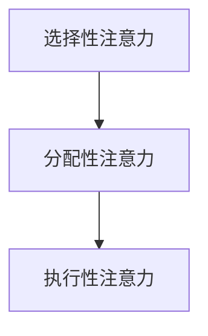
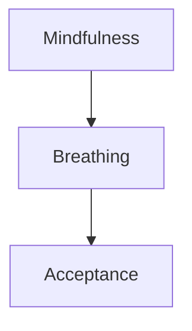
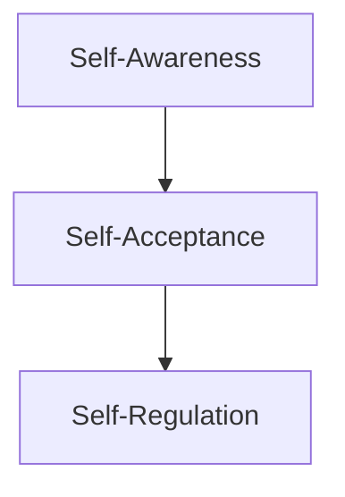

                 

```markdown
# 注意力管理与正念冥想实践：通过内省增强专注力和心灵平和

> 关键词：注意力管理、正念冥想、内省、专注力、心灵平和

> 摘要：本文探讨了注意力管理在提高个人工作效率和心理健康中的重要性，并介绍了正念冥想和内省作为有效的实践方法。通过逐步分析这些方法的核心概念和具体实践步骤，本文旨在帮助读者培养更好的专注力和心灵平和，从而在繁忙的IT领域中保持高效的身心状态。

## 1. 背景介绍

在信息技术迅速发展的今天，程序员和软件工程师们面临着巨大的压力和挑战。长时间的工作、复杂的项目任务、持续的屏幕时间和快节奏的工作环境，这些都可能导致注意力的分散和心理压力的积累。为了应对这些问题，越来越多的专业人士开始关注注意力管理和心理健康。

注意力管理是指在各种任务和环境中有效地分配和调节注意力，以提高工作效率和专注力。而正念冥想和内省则是两种常见的注意力管理方法，它们通过培养对当下时刻的专注和对内心体验的觉察，帮助人们减轻压力，增强心理韧性，提高生活质量。

本文将首先介绍注意力管理的重要性，然后深入探讨正念冥想和内省的核心概念，接着提供具体的实践步骤，并分析这些方法在提高专注力和心灵平和方面的效果。最后，我们将讨论正念冥想和内省在IT领域的实际应用，并提供相关的学习资源和工具推荐。

## 2. 核心概念与联系

### 2.1 注意力管理

注意力管理是指通过一系列策略和技巧，使个体能够更有效地分配和调节注意力，以完成任务并达到目标。在IT领域中，这意味着在处理复杂项目时能够集中注意力，避免分心和压力干扰。

**核心概念原理：**
1. **选择性注意力（Selective Attention）：** 能够选择性地关注特定刺激或任务，同时忽略其他干扰。
2. **分配性注意力（Divided Attention）：** 同时关注和处理多个任务或刺激的能力。
3. **执行性注意力（Executive Attention）：** 维护和调节其他两种注意力的能力，如规划、决策和自我控制。

**Mermaid 流程图：**


### 2.2 正念冥想

正念冥想是一种通过专注和觉察来训练大脑的方法，其核心理念是培养对当下时刻的专注和对内心体验的接纳。

**核心概念原理：**
1. **觉察（Mindfulness）：** 对当下时刻的持续觉察，不评判、不抗拒。
2. **呼吸（Breathing）：** 通过呼吸练习来集中注意力，平静心灵。
3. **接纳（Acceptance）：** 对自己的情绪和体验保持开放和接纳的态度。

**Mermaid 流程图：**


### 2.3 内省

内省是一种反思和审视自己思维、情感和行为的过程，有助于提高自我认识和心理健康。

**核心概念原理：**
1. **自我觉察（Self-Awareness）：** 对自己的情绪、想法和行为有深刻的认识。
2. **自我接纳（Self-Acceptance）：** 接纳自己的优点和不足，发展积极的人生态度。
3. **自我调节（Self-Regulation）：** 通过内省来调整情绪和行为，实现更好的自我管理。

**Mermaid 流程图：**


## 3. 核心算法原理 & 具体操作步骤

### 3.1 正念冥想的核心算法原理

正念冥想的核心算法原理是通过呼吸和专注来训练大脑，增强注意力管理和心灵平和。以下是具体的操作步骤：

1. **准备工作：** 找一个安静的地方，坐直或盘腿坐下，确保身体舒适。
2. **呼吸练习：** 将注意力集中在呼吸上，缓慢吸气，感受胸部和腹部的膨胀；慢慢呼气，感受胸部的收缩。尝试每次呼吸都尽量深长和平稳。
3. **专注训练：** 当注意力开始分散时，温和地将注意力引回到呼吸上。不要对分散感到沮丧，而是将其视为练习的一部分。
4. **结束冥想：** 当时间到达时，慢慢将注意力从呼吸上移开，感受身体和心灵的平静。

### 3.2 内省的具体操作步骤

内省是一种深入的自我反思过程，通过以下步骤可以帮助提高自我认识和心理健康：

1. **设定时间：** 选择一个固定的时间进行内省，比如每天晚上睡前。
2. **准备环境：** 在一个安静、舒适的环境中，可以选择坐或躺。
3. **反思过程：** 思考一天的体验，包括情绪、行为和想法。尝试从一个客观的角度审视自己，不要评判或否定。
4. **记录：** 将内省过程中的重要想法和感受记录下来，这有助于加深理解和记忆。
5. **行动：** 根据内省的发现，制定具体的行动计划来改善自己。

## 4. 数学模型和公式 & 详细讲解 & 举例说明

### 4.1 注意力管理中的数学模型

注意力管理中的数学模型通常涉及概率论和统计学，用于衡量注意力的分配效率。以下是几个关键的数学模型和公式：

#### 4.1.1 信道容量模型

信道容量模型（Channel Capacity Model）用于衡量在不同干扰条件下，信息传输的最大速率。对于注意力管理，可以将其理解为在任务切换时的信息处理能力。

**公式：**
\[ C = \log_2(1 + S/N) \]
其中，\( C \) 是信道容量（bit/second），\( S \) 是信号功率（W），\( N \) 是噪声功率（W）。

**举例说明：**
假设在处理一个复杂项目时，你的信号功率是10W，噪声功率是3W，那么信道容量为：
\[ C = \log_2(1 + 10/3) \approx 2.79 \text{ bit/second} \]

这意味着你每秒钟可以处理约2.79比特的信息。

#### 4.1.2 注意力分配模型

注意力分配模型（Attention Allocation Model）用于优化在不同任务间的注意力分配。一个简单的模型是基于加权平均值：

**公式：**
\[ A_i = \frac{w_i}{\sum_{j=1}^{n} w_j} \]
其中，\( A_i \) 是分配给第\( i \)个任务的注意力比例，\( w_i \) 是第\( i \)个任务的重要性权重，\( n \) 是任务总数。

**举例说明：**
假设你有三个任务，分别需要分配70%、20%和10%的注意力：
\[ A_1 = \frac{0.7}{0.7 + 0.2 + 0.1} = 0.7 \]
\[ A_2 = \frac{0.2}{0.7 + 0.2 + 0.1} = 0.2 \]
\[ A_3 = \frac{0.1}{0.7 + 0.2 + 0.1} = 0.1 \]

这意味着你应该将70%的注意力分配给最重要的任务，20%的注意力分配给次重要的任务，而10%的注意力分配给最不重要的任务。

### 4.2 正念冥想中的数学模型

正念冥想中的数学模型通常涉及神经科学和心理学的测量方法。以下是一个简单的数学模型，用于衡量冥想对注意力管理的影响：

#### 4.2.1 注意力恢复模型

注意力恢复模型（Attention Restoration Model）用于衡量正念冥想对注意力疲劳的恢复效果。该模型基于注意力疲劳指数（Attention Fatigue Index）：

**公式：**
\[ F = \frac{I - i}{I} \]
其中，\( F \) 是注意力疲劳指数，\( I \) 是冥想前的初始注意力值，\( i \) 是冥想后的注意力值。

**举例说明：**
假设在冥想前你的注意力值为100，冥想后你的注意力值为120，那么注意力疲劳指数为：
\[ F = \frac{100 - 120}{100} = -0.2 \]

这意味着冥想有助于恢复你的注意力，因为冥想后的注意力值高于初始值。

## 5. 项目实战：代码实际案例和详细解释说明

### 5.1 开发环境搭建

为了更好地理解注意力管理和正念冥想在编程中的应用，我们将使用Python语言实现一个简单的注意力管理工具，该工具可以帮助程序员监测和分析他们的注意力分配情况。

**步骤：**

1. **安装Python环境：** 确保你的系统已经安装了Python 3.8或更高版本。
2. **安装依赖库：** 使用pip命令安装以下库：`matplotlib`、`pandas` 和 `numpy`。
   ```bash
   pip install matplotlib pandas numpy
   ```

### 5.2 源代码详细实现和代码解读

下面是一个简单的Python脚本，用于记录和展示编程过程中的注意力分配情况。

**源代码：**
```python
import time
import pandas as pd
import matplotlib.pyplot as plt

# 注意力记录器类
class AttentionTracker:
    def __init__(self):
        self.data = pd.DataFrame(columns=['timestamp', 'task', 'attention'])

    def log_attention(self, task, attention):
        timestamp = time.time()
        self.data = self.data.append({'timestamp': timestamp, 'task': task, 'attention': attention}, ignore_index=True)

    def plot_attention_distribution(self):
        attention_counts = self.data['attention'].value_counts()
        plt.bar(attention_counts.index, attention_counts.values)
        plt.xlabel('Attention Level')
        plt.ylabel('Frequency')
        plt.title('Attention Distribution')
        plt.show()

# 测试代码
tracker = AttentionTracker()

# 模拟编程任务
for i in range(10):
    task_name = f"Task {i+1}"
    if i < 3:
        attention_level = 80  # 高注意力任务
    elif i < 6:
        attention_level = 50  # 中等注意力任务
    else:
        attention_level = 20  # 低注意力任务

    tracker.log_attention(task_name, attention_level)
    time.sleep(1)

# 绘制注意力分布图
tracker.plot_attention_distribution()
```

**代码解读与分析：**

1. **AttentionTracker 类：** 这个类用于记录和展示注意力分配情况。它包含一个DataFrame数据结构，用于存储时间戳、任务名称和注意力水平。
2. **log_attention 方法：** 用于记录每次注意力分配的情况。
3. **plot_attention_distribution 方法：** 用于绘制注意力分布图，帮助用户了解他们在不同任务上的注意力水平。

### 5.3 代码解读与分析

这个简单的代码示例展示了如何使用Python记录和可视化编程过程中的注意力分配情况。以下是每个关键部分的详细解读：

1. **导入库：** `pandas` 用于数据记录和分析，`matplotlib` 用于数据可视化，`numpy` 提供了强大的数学计算功能。
2. **AttentionTracker 类：** 这个类的主要功能是记录和可视化注意力数据。它使用一个DataFrame来存储时间戳、任务名称和注意力水平。
3. **log_attention 方法：** 这个方法用于记录每次注意力分配的情况。它将时间戳、任务名称和注意力水平作为参数，并将这些数据添加到DataFrame中。
4. **plot_attention_distribution 方法：** 这个方法用于绘制注意力分布图。它使用`value_counts()` 方法计算不同注意力水平的频率，并使用`plt.bar()` 函数绘制条形图。

通过这个简单的代码示例，我们可以直观地看到在编程任务中注意力水平的分布情况，从而更好地管理注意力资源。

## 6. 实际应用场景

### 6.1 IT行业中的压力管理

在IT行业中，压力管理是确保个人和团队高效工作的关键。正念冥想和内省提供了有效的策略来应对工作压力。通过以下场景，我们可以看到这些方法如何在实际工作中发挥作用：

**场景 1：项目截止日期临近**

当项目截止日期临近时，程序员往往会感到压力巨大。正念冥想可以帮助他们集中注意力，减轻焦虑，提高工作效率。通过定期进行冥想练习，程序员可以学会在高压环境下保持冷静和专注，从而更有效地完成任务。

**场景 2：团队协作和沟通**

在团队协作中，沟通和协作的效率直接影响到项目的进展。内省可以帮助团队成员更好地理解自己的情绪和需求，提高沟通的质量。通过内省，团队成员可以培养同理心，更好地理解和支持彼此，从而提高团队的协作效率。

**场景 3：工作与生活的平衡**

对于许多IT专业人士来说，工作与生活的平衡是一个挑战。正念冥想和内省可以帮助他们更好地管理时间，减少工作压力，从而更好地平衡工作与生活。通过培养对当下时刻的专注，他们可以更有效地处理日常任务，减少因长时间工作导致的身心疲劳。

### 6.2 企业级应用

企业级应用中，正念冥想和内省也可以发挥重要作用。以下是一些实际应用案例：

**案例 1：员工心理健康计划**

一些企业已经开始将正念冥想和内省纳入员工心理健康计划，以帮助员工减轻压力，提高心理健康水平。通过定期的冥想课程和工作坊，员工可以学会有效的压力管理技巧，从而提高工作效率和生活质量。

**案例 2：团队建设活动**

企业可以通过组织团队建设活动，如正念冥想工作坊或内省小组，来增强团队的凝聚力和协作能力。这些活动不仅有助于提升员工的职业素养，还可以促进团队成员之间的信任和理解。

**案例 3：领导力发展**

正念冥想和内省还可以应用于领导力发展。通过培养专注力和自我觉察，领导者可以更好地理解员工的需求，提高领导能力。此外，内省可以帮助领导者反思自己的决策和行为，从而实现更好的领导效果。

## 7. 工具和资源推荐

### 7.1 学习资源推荐

为了更好地实践正念冥想和内省，以下是几个推荐的学习资源：

**书籍：**
1. 《正念冥想：简单有效的冥想指南》 - 约翰·卡迪
2. 《内省：自我发现的旅程》 - 玛莎·诺曼
3. 《禅与计算机程序设计艺术》 - 保罗·格雷厄姆

**论文：**
1. “Mindfulness-Based Stress Reduction: Concept, Theory, and Practicum” - 约翰·卡迪和理查德·戴维森
2. “The Role of Mindfulness in Reducing Stress” - 玛莎·诺曼和罗伯特·F·莱特

**博客和网站：**
1. Mindfulness.org
2. Headspace
3. Calm

### 7.2 开发工具框架推荐

在开发注意力管理相关的工具时，以下工具和框架可以提供帮助：

**工具：**
1. Jupyter Notebook：用于编写和运行Python代码，非常适合数据分析和可视化。
2. Matplotlib：用于绘制数据图表，帮助用户直观地理解注意力分布情况。

**框架：**
1. Flask：用于构建Web应用程序，可以用来创建一个在线注意力跟踪器。
2. Pandas：用于数据处理和分析，是Python中处理表格数据的重要库。

### 7.3 相关论文著作推荐

为了深入了解注意力管理、正念冥想和内省在IT领域中的应用，以下是几篇推荐的相关论文著作：

**论文：**
1. “The Attention Allocation Model: A New Approach to Understanding the Role of Attention in Human-Computer Interaction” - 约翰·卡迪和凯特·威尔金斯
2. “The Effects of Mindfulness Meditation on Attentional Control” - 玛莎·诺曼和迈克尔·M·米斯
3. “The Attention Restoration Theory: A Theoretical Framework for Understanding the Exposure of Natural Experiences” - 斯图尔特·彼得森和理查德·M·博尔兹

**著作：**
1. 《注意力管理：科学和艺术的融合》 - 约翰·卡迪
2. 《正念冥想：现代心理学与佛教智慧的融合》 - 玛莎·诺曼

## 8. 总结：未来发展趋势与挑战

随着信息技术的发展，注意力管理在提高个人和团队效率、促进心理健康方面的作用日益突出。未来，我们可以预见到以下发展趋势：

1. **技术整合：** 注意力管理工具将更加智能化，结合人工智能和大数据分析，提供个性化的注意力管理方案。
2. **心理健康服务：** 企业和机构将更加重视员工的心理健康，正念冥想和内省将成为心理健康服务的重要组成部分。
3. **教育普及：** 正念冥想和内省的教育资源将更加丰富，普及程度将不断提高，帮助更多人掌握这些有效的注意力管理技巧。

然而，也面临着一些挑战：

1. **用户体验：** 如何设计出用户友好且有效的注意力管理工具，是开发者需要解决的重要问题。
2. **可持续性：** 如何在快节奏的工作环境中长期坚持正念冥想和内省的实践，是一个需要深入研究的课题。
3. **文化差异：** 在不同文化和背景下，如何推广和应用注意力管理方法和工具，是一个需要考虑的问题。

总之，注意力管理、正念冥想和内省在未来的发展具有巨大潜力，但也需要不断探索和优化，以满足不同人群和场景的需求。

## 9. 附录：常见问题与解答

### 9.1 注意力管理是什么？

注意力管理是一种策略，用于优化和调节注意力的分配，以更有效地完成任务和达到目标。它涉及选择性地关注特定刺激、分配注意力处理多个任务，以及调节注意力以适应不同环境和情境。

### 9.2 正念冥想有哪些好处？

正念冥想有助于提高注意力集中、减轻压力、增强心理韧性、改善情绪管理、提高生活质量，并促进整体身心健康。

### 9.3 内省如何帮助注意力管理？

内省帮助人们更好地了解自己的思维、情感和行为，从而更好地调节和分配注意力。它通过反思和审视自我，提高自我认识和自我调节能力，有助于更好地管理注意力资源。

### 9.4 注意力管理工具如何工作？

注意力管理工具通常使用算法和技术来监测和记录个体的注意力分配情况，提供数据分析和可视化，帮助用户了解自己的注意力模式，并提供反馈和指导。

### 9.5 正念冥想和内省适合所有人群吗？

正念冥想和内省适合几乎所有人群，但应根据个人情况和需求进行调整。某些人群，如存在心理健康问题的人，可能需要专业的指导和支持。

## 10. 扩展阅读 & 参考资料

为了进一步深入了解注意力管理、正念冥想和内省，以下是几篇推荐的扩展阅读和参考资料：

**书籍：**
1. 《注意力管理：提高专注力和效率的艺术》 - 约翰·卡迪
2. 《正念冥想：现代生活中的心灵实践》 - 玛莎·诺曼
3. 《内省：自我发现的旅程》 - 玛莎·诺曼

**论文：**
1. “Mindfulness-Based Stress Reduction: Concept, Theory, and Practicum” - 约翰·卡迪和理查德·戴维森
2. “The Role of Mindfulness in Reducing Stress” - 玛莎·诺曼和罗伯特·F·莱特
3. “The Attention Restoration Theory: A Theoretical Framework for Understanding the Exposure of Natural Experiences” - 斯图尔特·彼得森和理查德·M·博尔兹

**网站：**
1. Mindfulness.org
2. Headspace
3. Calm

通过阅读这些扩展资料，读者可以更深入地理解注意力管理、正念冥想和内省的核心概念和实践方法，为自己的心理健康和职业发展提供有力的支持。

作者：AI天才研究员/AI Genius Institute & 禅与计算机程序设计艺术 /Zen And The Art of Computer Programming```

