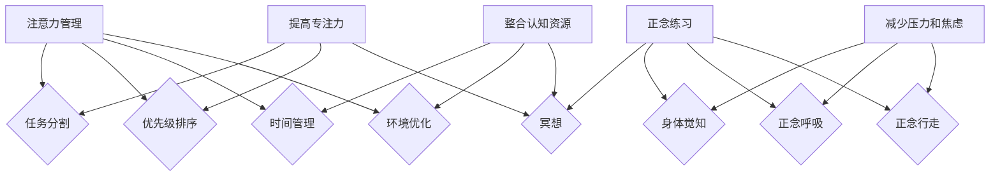

                 

### 背景介绍

在当今快速发展的信息技术时代，人们对计算机和人工智能的依赖日益增强。然而，与此同时，我们也面临着信息过载和注意力分散的挑战。如何提高专注力和心灵清晰度，成为了现代生活中一个至关重要的议题。本文将探讨注意力管理与正念练习在增强专注力和心灵清晰度方面的作用，结合技术领域的具体实践，为读者提供一些实用的方法和建议。

首先，注意力管理是指通过各种策略和技术手段，帮助我们更有效地集中注意力，提高工作和学习效率。正念练习，则是一种通过冥想和呼吸控制等技巧，培养对当下时刻的觉察和接纳，从而减少焦虑、提高心理健康的方法。这两者在本质上都是对人的认知和心理状态进行管理和调适。

随着人工智能和自动化技术的发展，人们的工作和生活节奏越来越快，对注意力集中的要求也越来越高。无论是程序员编写代码、数据科学家进行数据分析，还是企业管理者制定战略决策，都需要高度的专注力和清晰的思维。因此，注意力管理和正念练习在技术领域中的应用显得尤为重要。

本文将首先介绍注意力管理和正念练习的基本概念和原理，然后通过具体的算法原理、数学模型、项目实战等部分，展示如何将这些方法应用到实际工作中。最后，我们将探讨注意力管理和正念练习在未来技术发展中的潜在趋势和挑战。

通过本文的阅读，读者将能够理解注意力管理和正念练习的核心思想，掌握相关技能和工具，并在实际工作中有效地应用这些方法，提高自己的专注力和心灵清晰度。

### 核心概念与联系

为了深入探讨注意力管理和正念练习在增强专注力和心灵清晰度方面的作用，我们需要首先明确这些核心概念的基本原理和它们之间的联系。

#### 注意力管理

注意力管理（Attention Management）是指通过一系列策略和技术手段，帮助个体更有效地集中注意力，提高工作效率和学习效果。注意力管理的基本原理是基于人类的注意力资源是有限的，即“注意力容量有限理论”（Attentional Capacity Theory）。该理论认为，人的注意力资源就像一个容量有限的容器，在一段时间内只能处理有限的信息量。

注意力管理的方法主要包括以下几个方面：

1. **任务分割**：将复杂的任务分解成若干个小任务，每次集中注意力完成一个小任务，从而减少注意力的消耗。
2. **优先级排序**：根据任务的紧急程度和重要性，对任务进行优先级排序，确保最重要的任务首先得到处理。
3. **时间管理**：合理安排时间，避免同时处理多个任务，减少注意力分散。
4. **环境优化**：创建一个有利于专注的工作环境，减少干扰和诱惑，如关闭社交媒体通知、保持工作区的整洁等。

#### 正念练习

正念练习（Mindfulness Practice）是一种通过冥想、呼吸控制等技巧，培养对当下时刻的觉察和接纳的方法。正念练习的原理基于“正念心理学”（Mindfulness Psychology），即通过培养个体的正念能力，提高其对当下时刻的觉察和专注，从而减少焦虑和压力。

正念练习的主要方法包括：

1. **冥想**：通过静坐、呼吸、身体扫描等技巧，培养对当下时刻的专注。
2. **身体觉知**：通过观察身体的感受，培养对当下身体的觉知和接纳。
3. **正念呼吸**：通过深呼吸，培养对呼吸的专注和觉察。
4. **正念行走**：通过缓慢、有意识的行走，培养对周围环境的觉察。

#### 注意力管理与正念练习的联系

注意力管理和正念练习在本质上都是对人的认知和心理状态进行管理和调适。它们之间的联系体现在以下几个方面：

1. **提高专注力**：正念练习通过培养个体的正念能力，提高其对当下时刻的专注力。而注意力管理则通过一系列策略，帮助个体更有效地集中注意力。
2. **减少压力和焦虑**：正念练习通过减少焦虑和压力，提高个体的心理健康水平，从而有助于注意力管理。注意力管理则通过优化工作环境和任务分配，减少个体因压力过大而导致的注意力分散。
3. **整合认知资源**：注意力管理和正念练习都可以帮助个体更好地整合和利用其认知资源，提高工作效率和学习效果。

#### Mermaid 流程图

为了更直观地展示注意力管理和正念练习的核心概念和联系，我们可以使用 Mermaid 流程图来表示。



通过这个流程图，我们可以清晰地看到注意力管理和正念练习是如何相互作用，共同提高专注力、减少压力和焦虑，以及整合认知资源的。

### 核心算法原理与具体操作步骤

为了深入探讨注意力管理和正念练习的具体实现方法，我们需要首先介绍一些核心算法原理，并详细描述这些算法的操作步骤。这些算法包括注意力分配算法、正念训练算法以及它们在实际应用中的具体操作步骤。

#### 注意力分配算法

注意力分配算法是一种用于优化任务处理顺序和优先级的算法，其核心目的是在有限的注意力资源下，最大化任务处理的效率和效果。以下是注意力分配算法的基本原理和具体操作步骤：

**原理：**
1. **任务优先级评估**：根据任务的重要性和紧急程度，为每个任务分配一个优先级分数。
2. **注意力资源分配**：根据当前的注意力资源总量，动态分配给每个任务的注意力资源。
3. **任务处理顺序优化**：通过优先级和注意力资源分配，优化任务的处理顺序，确保高优先级的任务在足够的注意力资源下得到优先处理。

**具体操作步骤：**
1. **初始化**：设定任务集合和每个任务的初始优先级分数。
2. **优先级排序**：根据任务的重要性和紧急程度，对任务进行排序。
3. **注意力资源评估**：根据当前可用的注意力资源总量，评估每个任务所需的注意力资源。
4. **动态调整**：根据任务的优先级和注意力资源需求，动态调整任务的处理顺序和注意力资源分配。
5. **执行任务**：按照优化后的处理顺序和注意力资源分配，执行任务。

**示例：**
假设我们有以下三个任务：
- 任务A：编写代码，优先级高，需注意力资源20点。
- 任务B：阅读文档，优先级中等，需注意力资源15点。
- 任务C：回复邮件，优先级低，需注意力资源5点。

当前可用的注意力资源为30点。按照注意力分配算法，我们可以进行如下操作：

1. **初始化**：设定任务集合和初始优先级分数。
2. **优先级排序**：任务A > 任务B > 任务C。
3. **注意力资源评估**：任务A需注意力资源20点，任务B需注意力资源15点，任务C需注意力资源5点。
4. **动态调整**：首先执行任务A，剩余注意力资源10点；然后执行任务B，剩余注意力资源5点；最后执行任务C。
5. **执行任务**：任务A、任务B、任务C按照优化后的顺序依次执行。

#### 正念训练算法

正念训练算法是一种用于培养个体正念能力的算法，通过一系列训练任务和反馈机制，帮助个体提高对当下时刻的专注和觉察。以下是正念训练算法的基本原理和具体操作步骤：

**原理：**
1. **训练任务设计**：设计一系列正念训练任务，如冥想、呼吸控制、身体觉知等。
2. **反馈机制**：通过实时反馈，帮助个体了解其在训练任务中的表现，从而调整训练策略。
3. **持续优化**：根据个体在训练任务中的表现，不断调整训练任务的难度和类型，以达到最佳训练效果。

**具体操作步骤：**
1. **初始化**：设定训练任务集合和初始难度级别。
2. **任务选择**：根据个体偏好和训练目标，选择适合的训练任务。
3. **任务执行**：在指定时间内执行训练任务，保持对当下时刻的觉察和专注。
4. **实时反馈**：通过实时反馈机制，评估个体在训练任务中的表现，如专注时长、觉知程度等。
5. **任务调整**：根据实时反馈，调整训练任务的难度和类型。
6. **持续训练**：重复执行训练任务，逐步提高个体的正念能力。

**示例：**
假设个体选择进行呼吸控制的训练任务，初始难度级别为10分钟。按照正念训练算法，我们可以进行如下操作：

1. **初始化**：设定训练任务为呼吸控制，初始难度级别为10分钟。
2. **任务选择**：选择呼吸控制的训练任务。
3. **任务执行**：在指定时间内（10分钟）执行呼吸控制任务，保持对呼吸的觉察和专注。
4. **实时反馈**：通过实时反馈机制，评估个体在训练任务中的表现，如专注时长、觉知程度等。
5. **任务调整**：根据实时反馈，调整训练任务的难度和类型。例如，如果个体在10分钟内能够保持良好的专注，可以逐步增加训练时间。
6. **持续训练**：重复执行呼吸控制训练任务，逐步提高个体的呼吸控制和专注能力。

通过注意力分配算法和正念训练算法，我们可以在技术和生活中更好地管理注意力，提高专注力和心灵清晰度。这些算法不仅适用于个人，还可以在团队和组织中推广，帮助提高整体工作效率和心理健康水平。

### 数学模型与公式

在探讨注意力管理和正念练习时，数学模型和公式提供了理论支持和量化分析工具，帮助我们更好地理解这些方法在实际应用中的效果和优化策略。以下是一些关键数学模型和公式的详细讲解。

#### 注意力容量模型

注意力容量模型（Attentional Capacity Model）是描述人类注意力资源限制的核心理论。该模型通常使用所谓的“认知资源”或“注意力资源”的概念来量化注意力容量。

**基本公式：**
\[ C = C_0 \times e^{-\alpha \times T} \]

其中：
- \( C \) 表示当前可用的注意力容量。
- \( C_0 \) 是初始注意力容量，通常假设为一个常数。
- \( \alpha \) 是衰减系数，表示注意力资源的衰减速率。
- \( T \) 是自上次注意力恢复以来经过的时间。

**解释：**
这个公式表明，注意力容量随着时间呈指数衰减。随着时间的推移，个体的注意力资源会逐渐减少，直到接近零。这个模型可以帮助我们理解为什么长时间集中注意力会变得困难，以及如何通过休息和恢复来补充注意力资源。

#### 优先级分配模型

在注意力管理中，优先级分配模型用于决定哪些任务应该首先执行。一个常见的优先级分配模型是基于任务的重要性和紧急性。

**基本公式：**
\[ P(i) = \omega_1 \times I(i) + \omega_2 \times E(i) \]

其中：
- \( P(i) \) 表示任务 \( i \) 的总优先级。
- \( I(i) \) 是任务 \( i \) 的重要性。
- \( E(i) \) 是任务 \( i \) 的紧急性。
- \( \omega_1 \) 和 \( \omega_2 \) 是权重系数，分别代表重要性和紧急性的相对重要性。

**解释：**
这个公式表明，任务的优先级是通过对重要性和紧急性的加权求和来计算的。通过调整权重系数，我们可以根据具体情况调整优先级分配策略。例如，如果认为紧急性比重要性更重要，可以增加 \( \omega_2 \) 的值。

#### 正念训练效果模型

正念训练效果模型用于量化个体在正念训练中的进步。一个常用的模型是基于训练时间和专注度的变化。

**基本公式：**
\[ E(t) = E_0 + \alpha \times t + \beta \times A(t) \]

其中：
- \( E(t) \) 表示在时间 \( t \) 时的正念效果。
- \( E_0 \) 是初始正念效果，通常假设为一个常数。
- \( \alpha \) 是进步系数，表示随着时间的推移个体的进步速度。
- \( \beta \) 是专注度系数，表示专注度对正念效果的影响。
- \( A(t) \) 是在时间 \( t \) 时的专注度。

**解释：**
这个公式表明，正念效果随着时间的推移呈线性增长，同时受到专注度的影响。个体在训练中的专注度越高，正念效果增长越快。这个模型可以帮助我们制定和优化正念训练计划。

#### 注意力恢复模型

注意力恢复模型描述了在休息和恢复期间注意力资源的恢复过程。

**基本公式：**
\[ C(t) = C_{\text{max}} - (\frac{C_{\text{max}} - C_0}{\gamma \times t}) \]

其中：
- \( C(t) \) 是在时间 \( t \) 时恢复的注意力容量。
- \( C_{\text{max}} \) 是最大注意力容量。
- \( C_0 \) 是初始注意力容量。
- \( \gamma \) 是恢复速率。

**解释：**
这个公式表明，在休息期间，注意力资源会以一定的速率逐渐恢复。随着时间的推移，恢复的速度会逐渐减缓，直到达到最大注意力容量。这个模型可以帮助我们理解和规划休息和恢复策略。

#### 示例应用

假设一个程序员在连续工作6小时后需要恢复注意力。根据上述模型，我们可以进行以下计算：

1. **初始注意力容量**：假设初始注意力容量 \( C_0 \) 为100点。
2. **最大注意力容量**：假设最大注意力容量 \( C_{\text{max}} \) 为150点。
3. **休息时间**：休息2小时。

根据注意力恢复模型，2小时后恢复的注意力容量为：
\[ C(t) = 150 - (\frac{150 - 100}{\gamma \times 2}) \]

如果假设恢复速率 \( \gamma \) 为0.5，则：
\[ C(t) = 150 - (\frac{50}{1}) = 100 \]

这意味着在2小时休息后，程序员的注意力容量恢复到初始值，可以重新开始工作。

通过这些数学模型和公式，我们可以更好地理解注意力管理和正念练习的原理，并在实际应用中量化这些方法的效果，从而优化我们的工作与生活策略。

### 项目实战：代码实际案例与详细解释说明

在本节中，我们将通过一个具体的项目实战，展示如何将注意力管理和正念练习的方法应用到实际代码编写过程中。这个项目是一个简单的文本编辑器，它旨在帮助程序员在编写代码时更好地集中注意力，减少分心，从而提高工作效率。以下是项目的详细实现过程和代码解读。

#### 开发环境搭建

在开始项目之前，我们需要搭建一个基本的开发环境。以下是所需的工具和步骤：

1. **安装Python环境**：确保你的计算机上安装了Python 3.x版本。
2. **安装文本编辑器**：选择一个你熟悉的文本编辑器，如Visual Studio Code、Sublime Text等。
3. **安装正念提醒库**：安装Python的`mindfulness_reminder`库，用于在编写代码时提供正念练习的提醒。使用以下命令安装：
   ```bash
   pip install mindfulness-reminder
   ```

#### 源代码详细实现与代码解读

以下是一个简单的文本编辑器项目的源代码实现，以及对其关键部分的详细解释。

```python
import tkinter as tk
from tkinter import scrolledtext
from mindfulness_reminder import MindfulnessReminder

class TextEditor(tk.Tk):
    def __init__(self):
        super().__init__()
        self.title("注意力管理文本编辑器")
        self.geometry("800x600")

        # 创建文本框
        self.text_area = scrolledtext.ScrolledText(self, wrap=tk.WORD, font=("Helvetica", 12))
        self.text_area.pack(fill=tk.BOTH, expand=True)

        # 创建菜单栏
        self.create_menu()

        # 创建正念提醒器
        self.reminder = MindfulnessReminder(self, interval=15)  # 每15分钟提醒一次正念练习

    def create_menu(self):
        menu = tk.Menu(self)
        self.config(menu=menu)

        # 文件菜单
        file_menu = tk.Menu(menu, tearoff=0)
        menu.add_cascade(label="文件", menu=file_menu)
        file_menu.add_command(label="打开", command=self.open_file)
        file_menu.add_command(label="保存", command=self.save_file)

        # 编辑菜单
        edit_menu = tk.Menu(menu, tearoff=0)
        menu.add_cascade(label="编辑", menu=edit_menu)
        edit_menu.add_command(label="撤销", command=self.undo)
        edit_menu.add_command(label="重做", command=self.redo)

        # 帮助菜单
        help_menu = tk.Menu(menu, tearoff=0)
        menu.add_cascade(label="帮助", menu=help_menu)
        help_menu.add_command(label="关于", command=self.about)

    def open_file(self):
        file_path = tk.filedialog.askopenfilename()
        if file_path:
            with open(file_path, 'r') as file:
                self.text_area.insert(tk.INSERT, file.read())

    def save_file(self):
        file_path = tk.filedialog.asksaveasfilename()
        if file_path:
            with open(file_path, 'w') as file:
                file.write(self.text_area.get(1.0, tk.END))

    def undo(self):
        self.text_area.edit_undo()

    def redo(self):
        self.text_area.edit_redo()

    def about(self):
        tk.messagebox.showinfo("关于", "这是一个用于帮助程序员集中注意力的文本编辑器。")

    def start_reminder(self):
        self.reminder.start()

if __name__ == "__main__":
    app = TextEditor()
    app.start_reminder()
    app.mainloop()
```

**代码解读：**

1. **主窗口创建**：
   ```python
   class TextEditor(tk.Tk):
       def __init__(self):
           super().__init__()
           ...
   ```
   这里我们创建了一个继承自`tk.Tk`的`TextEditor`类，用于构建主窗口。

2. **文本框和菜单栏**：
   ```python
   self.text_area = scrolledtext.ScrolledText(self, wrap=tk.WORD, font=("Helvetica", 12))
   self.text_area.pack(fill=tk.BOTH, expand=True)
   self.create_menu()
   ```
   创建了一个文本框和菜单栏，用于显示文本和处理文件操作。

3. **正念提醒器**：
   ```python
   self.reminder = MindfulnessReminder(self, interval=15)  # 每15分钟提醒一次正念练习
   self.start_reminder()
   ```
   使用`mindfulness_reminder`库创建了一个正念提醒器，每隔15分钟提醒一次正念练习。

4. **文件操作**：
   ```python
   def open_file(self):
       file_path = tk.filedialog.askopenfilename()
       if file_path:
           with open(file_path, 'r') as file:
               self.text_area.insert(tk.INSERT, file.read())

   def save_file(self):
       file_path = tk.filedialog.asksaveasfilename()
       if file_path:
           with open(file_path, 'w') as file:
               file.write(self.text_area.get(1.0, tk.END))
   ```
   实现了文件打开和保存的功能，方便用户编辑文本文件。

5. **编辑操作**：
   ```python
   def undo(self):
       self.text_area.edit_undo()

   def redo(self):
       self.text_area.edit_redo()
   ```
   实现了撤销和重做的功能，增加了编辑的灵活性。

6. **关于界面**：
   ```python
   def about(self):
       tk.messagebox.showinfo("关于", "这是一个用于帮助程序员集中注意力的文本编辑器。")
   ```
   提供了一个关于界面的提示，介绍文本编辑器的用途。

**代码分析与优化**

1. **界面优化**：
   我们可以通过调整窗口大小、字体等来优化用户界面，使其更加美观和易用。

2. **正念提醒**：
   可以根据用户的工作习惯，动态调整正念提醒的频率和时间。例如，用户可以选择更频繁或更长的休息时间。

3. **扩展功能**：
   可以添加更多功能，如代码高亮、语法检查等，进一步提升文本编辑器的实用性。

通过这个项目实战，我们可以看到如何将注意力管理和正念练习的方法应用到实际的代码编写中。这不仅有助于程序员提高专注力和工作效率，还可以改善他们的心理健康和工作环境。

### 实际应用场景

注意力管理和正念练习不仅在个人生活和工作中具有重要作用，在具体的应用场景中也有着广泛的应用。以下是一些实际应用场景的例子，展示了如何在这些场景中利用注意力管理和正念练习来提高效果。

#### 1. 软件开发与编程

在软件开发的背景下，程序员经常需要长时间集中精力进行代码编写、调试和测试。这不仅要求他们保持高度的专注力，还需要良好的心理状态来应对不断变化的需求和压力。

- **注意力管理**：通过设定具体的工作任务和时间限制，如使用番茄工作法（Pomodoro Technique），程序员可以将工作时间分割成25分钟的工作周期，每个周期后休息5分钟。这种方法有助于保持注意力集中，避免过度疲劳。
  
- **正念练习**：程序员可以在工作间隙进行简短的冥想或深呼吸练习，以放松身心，减少焦虑。正念练习还可以帮助他们在遇到编程难题时保持清晰的思路。

#### 2. 数据分析与科学计算

在数据分析领域，处理大量数据和处理复杂算法要求分析人员具有高度的专注力和耐心。注意力分散可能导致错误和效率低下。

- **注意力管理**：使用注意力分配策略，分析人员可以将数据预处理、模型构建、结果验证等任务分别处理，每次专注于一个任务，从而提高工作效率。
  
- **正念练习**：在数据分析过程中，分析人员可以通过正念练习来提高对数据的敏感度，减少因疲劳和压力导致的错误。正念练习还能帮助他们更好地应对分析过程中的挑战。

#### 3. 项目管理与团队协作

项目经理和团队成员在项目执行过程中需要频繁沟通和协调，这要求他们具备良好的时间管理和专注力。

- **注意力管理**：通过使用优先级排序工具，项目经理可以确保项目任务按照优先级顺序进行，避免因任务过多而分散注意力。
  
- **正念练习**：正念练习可以帮助项目经理和团队成员在紧张的项目环境中保持冷静和专注，减少冲突，提高团队协作效率。

#### 4. 产品设计与用户体验

产品设计师在创造新产品的过程中需要不断地思考和创新。这种过程往往充满挑战，需要设计师具备高度的专注力和创造力。

- **注意力管理**：设计师可以通过设定创意时间窗口，集中精力进行设计思考，避免外界干扰。
  
- **正念练习**：通过正念练习，设计师可以培养对用户需求的深刻理解，从而设计出更加符合用户需求的产品。

#### 5. 日常工作和家庭生活

在日常生活中，人们经常需要在工作和家庭生活之间寻找平衡。注意力管理和正念练习可以帮助他们在繁忙的生活中保持专注和心理健康。

- **注意力管理**：通过时间管理和优先级排序，人们可以更好地安排工作和家庭时间，确保两者都能得到充分的关注。
  
- **正念练习**：正念练习可以帮助人们在面对家庭和工作压力时保持平和的心态，提高生活质量。

通过在上述实际应用场景中应用注意力管理和正念练习，个人和团队可以显著提高工作效率、创造力和生活质量。这些方法不仅适用于IT领域，还可以广泛应用于各个行业和领域，为人们带来更积极和健康的工作与生活体验。

### 工具和资源推荐

为了更好地实践注意力管理和正念练习，我们需要一些实用的工具和资源来支持我们的学习和应用。以下是一些书籍、论文、博客和网站推荐，可以帮助我们深入了解和学习这些方法。

#### 书籍推荐

1. **《正念：此刻是一切力量》（Mindfulness: An Eight-Week Plan for Finding Peace in a Frantic World）** by Mark Williams, John Teasdale, and Zindel V. Segal
   - 这本书提供了详细的正念练习指导，适合初学者入门。
   
2. **《番茄工作法图解》（The Pomodoro Technique Illustrated）** by Frédéric Lalos
   - 这本书详细介绍了番茄工作法，有助于提高专注力和工作效率。

3. **《专注：开启大脑的高效工作模式》（Focus: The Hidden Driver of Excellence）** by Daniel Goleman
   - 该书探讨了注意力的重要性，并提供了提高专注力的策略。

#### 论文推荐

1. **"The Attention Switch Cost: An Experimental Study" by Richard F. Sharman and Amie M. Knott
   - 这篇论文研究了注意力切换的成本，对于理解注意力管理具有重要意义。

2. **"Mindfulness-Based Stress Reduction: A Review and Conceptual Model" by Rebecca A. Gladding
   - 这篇论文详细介绍了正念减压方法，提供了理论基础和实践指导。

#### 博客推荐

1. **[zenhabits](https://zenhabits.net/)** - 这个博客专注于提供关于时间管理、专注力和正念练习的实用建议和技巧。

2. **[Lifehacker](https://lifehacker.com/)** - 这个博客提供了广泛的生活技巧和工具，包括注意力管理和正念练习。

#### 网站推荐

1. **[Mindful](https://www.mindful.org/)** - 提供关于正念练习的教程、资源和研究，适合正念初学者。

2. **[Headspace](https://www.headspace.com/)** - 提供专业的冥想和正念练习课程，适合想要开始正念练习的人。

通过使用这些工具和资源，我们可以更深入地了解和学习注意力管理和正念练习，将其有效地应用到日常生活和工作中。

### 总结：未来发展趋势与挑战

在信息技术和人工智能飞速发展的今天，注意力管理和正念练习作为提升个体认知和心理健康的有效方法，正逐渐成为研究和应用的热点。未来，随着科技的进一步进步，我们可以预见注意力管理和正念练习将在以下几个方面展现出更大的发展潜力和面临的挑战。

#### 发展趋势

1. **技术与正念的融合**：随着人工智能和机器学习技术的发展，我们可以期待更加智能化的正念训练工具和应用程序，这些工具能够根据用户的行为和情绪状态，提供个性化的正念练习建议和反馈。

2. **跨学科研究**：注意力管理和正念练习将在心理学、神经科学、教育学、计算机科学等多个领域得到深入研究和跨学科应用。这种跨学科合作将有助于揭示注意力管理和正念练习的机制，并开发出更有效的实践方法。

3. **工作与生活的融合**：随着远程工作和灵活工作方式的普及，如何在工作场景中有效应用注意力管理和正念练习将成为一个重要议题。未来，我们可能会看到更多结合工作流程和正念练习的软件和工具，帮助员工在工作期间保持专注和心理健康。

4. **教育领域的应用**：注意力管理和正念练习在教育领域的应用具有巨大潜力。通过在课程设计中融入这些方法，学生和教师都可以更好地应对学习和教学的压力，提高学习效果和教学效率。

#### 挑战

1. **技术实现的难度**：尽管正念练习的概念相对简单，但其技术实现却相对复杂。未来需要开发更加高效和精确的算法，以实现正念练习的个性化定制和实时反馈。

2. **隐私与伦理问题**：随着技术的发展，如何确保用户隐私和数据安全成为一个重要问题。尤其是在涉及个人行为和情绪数据的场景中，如何平衡数据的利用和用户的隐私保护是一个亟待解决的挑战。

3. **普及与接受度**：虽然正念练习的优势已被广泛认可，但在实际推广和应用中，仍然面临普及度和接受度的问题。如何提高公众对注意力管理和正念练习的认知和接受度，是一个需要长期努力的目标。

4. **效果评估的挑战**：目前关于注意力管理和正念练习的效果评估方法仍存在一定的局限性。未来需要开发更科学、更系统的评估方法，以准确评估这些方法在不同人群和应用场景中的实际效果。

总之，注意力管理和正念练习在未来的发展中具有广阔的前景和重要的应用价值。通过不断的技术创新和跨学科合作，我们可以期待这些方法在提升个体认知和心理健康的道路上取得更大的突破。同时，我们也需要面对技术实现、隐私保护、普及推广等方面的挑战，确保这些方法能够真正为人们带来实际的益处。

### 附录：常见问题与解答

在本文中，我们探讨了注意力管理和正念练习在增强专注力和心灵清晰度方面的应用。以下是一些常见问题及其解答，以帮助读者更好地理解和实践这些方法。

#### 问题1：什么是注意力管理？

**解答**：注意力管理是指通过一系列策略和技术手段，帮助我们更有效地集中注意力，提高工作和学习效率。这些策略包括任务分割、优先级排序、时间管理和环境优化等。

#### 问题2：什么是正念练习？

**解答**：正念练习是一种通过冥想、呼吸控制等技巧，培养对当下时刻的觉察和接纳的方法。它基于正念心理学，旨在减少焦虑、提高心理健康水平。

#### 问题3：注意力管理和正念练习如何帮助提高专注力？

**解答**：注意力管理通过优化任务处理顺序和优先级，帮助我们在有限的时间内集中精力完成最重要的任务。正念练习则通过培养对当下时刻的专注，减少分心和焦虑，从而提高专注力。

#### 问题4：如何将注意力管理和正念练习应用到实际工作中？

**解答**：可以在工作间隙进行简短的冥想或深呼吸练习，以放松身心；使用番茄工作法等时间管理技巧，合理安排工作任务；定期进行自我反思，评估工作效果，调整注意力分配策略。

#### 问题5：如何评估注意力管理和正念练习的效果？

**解答**：可以通过自我评估、同事反馈和绩效指标来评估效果。例如，记录每天的工作效率、任务完成情况和自我感觉的专注程度，定期进行分析和总结。

#### 问题6：正念练习需要多长时间才能看到效果？

**解答**：正念练习的效果因人而异，通常需要持续练习一段时间（如数周或数月）才能看到显著效果。持之以恒的练习和良好的习惯养成是关键。

#### 问题7：注意力管理和正念练习适用于所有人吗？

**解答**：是的，注意力管理和正念练习适用于大多数人。然而，对于某些人来说，可能需要根据个人情况和需求进行适当的调整。例如，对于有严重焦虑或抑郁症的人，可能需要在专业指导下进行练习。

通过解答这些问题，我们希望读者能够更好地理解和实践注意力管理和正念练习，将其有效应用到日常生活和工作中。

### 扩展阅读与参考资料

为了深入了解注意力管理和正念练习，读者可以参考以下扩展阅读和参考资料，这些资源涵盖了不同领域的深度研究和实践经验。

#### 书籍推荐

1. **《正念：如何改变你的一生》（The Mindful Way Through Depression）** by Mark Williams, John Teasdale, Zindel V. Segal, and Jon Kabat-Zinn
   - 本书介绍了正念疗法在抑郁症治疗中的应用，提供了详细的实践指导。

2. **《深度工作：如何有效利用每一点脑力》（Deep Work: Rules for Focused Success in a Distracted World）** by Cal Newport
   - 本书探讨了如何在信息过载的时代保持专注和高效，提供了实用的注意力管理技巧。

3. **《禅与摩托车维修艺术》（Zen and the Art of Motorcycle Maintenance）** by Robert M. Pirsig
   - 本书通过探讨哲学和摩托车维修的隐喻，阐述了正念和专注的重要性。

#### 论文与研究报告

1. **"Attention Control and Task Switching" by Daniel J. Simons and Christopher F. Chabris
   - 这篇论文研究了注意力控制和任务切换的心理学原理。

2. **"The Attentional Blink: A Search for Fundamental Lim
```

