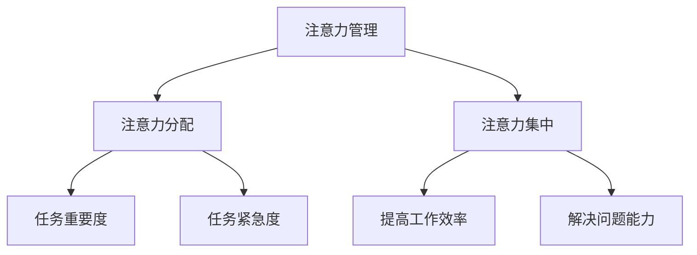

                 

# 注意力管理：在AI世界中保持清醒

## 关键词

* 注意力管理
* AI世界
* 清醒
* 技术发展
* 算法原理
* 数学模型
* 实际应用

## 摘要

随着人工智能技术的飞速发展，我们的日常生活和工作越来越依赖于AI。然而，面对海量的信息和复杂的算法，如何保持清醒的注意力成为了一个挑战。本文将探讨注意力管理在AI世界中的重要性，介绍核心概念和原理，并通过具体案例讲解如何在AI世界中保持清醒。此外，还将提供实用的工具和资源，帮助读者提升注意力管理能力，迎接AI时代的挑战。

## 1. 背景介绍

### 1.1 人工智能的发展历程

人工智能（AI）一词最早由John McCarthy在1956年的达特茅斯会议上提出。从那时起，人工智能经历了多个发展阶段，从最初的符号推理到现代的深度学习和神经网络，AI技术不断突破，应用场景也越来越广泛。

### 1.2 AI在我们生活中的应用

人工智能已经深入到我们日常生活的方方面面，从智能手机的语音助手、智能音箱，到智能家居、自动驾驶汽车，再到医疗诊断、金融风控等，AI正在改变我们的生活方式。

### 1.3 AI时代的挑战

随着AI技术的快速发展，我们面临许多挑战。一方面，AI技术的复杂性和海量数据使得我们容易分散注意力；另一方面，AI应用场景的多样性也要求我们具备更广泛的技能和知识。因此，如何管理注意力成为了一个重要课题。

## 2. 核心概念与联系

### 2.1 注意力管理

注意力管理是指通过一系列策略和方法，帮助个体集中注意力、提高学习效率和解决问题的能力。在AI世界中，注意力管理尤为重要，因为AI技术的复杂性要求我们能够快速适应和应对变化。

### 2.2 注意力分配

注意力分配是指将注意力集中在不同的任务和场景上。在AI世界中，我们需要根据任务的重要性和紧急性，合理分配注意力，确保关键任务得到充分关注。

### 2.3 注意力集中

注意力集中是指将注意力集中在特定任务或目标上，避免分散和干扰。在AI世界中，我们需要培养良好的注意力集中能力，以提高工作效率和解决问题能力。

### 2.4 Mermaid 流程图



## 3. 核心算法原理 & 具体操作步骤

### 3.1 注意力集中算法原理

注意力集中算法主要基于人的认知心理学原理，通过设计特定的训练方法和策略，帮助个体提高注意力集中能力。具体包括以下步骤：

#### 3.1.1 认知训练

通过认知训练，个体可以逐渐提高对干扰信息的识别和排除能力，从而更好地集中注意力。

#### 3.1.2 注意力分配策略

设计合适的注意力分配策略，使个体能够在不同任务和场景下，合理调整注意力。

#### 3.1.3 注意力集中技巧

教授个体一些注意力集中技巧，如深呼吸、正念冥想等，帮助他们在面对复杂任务时，保持注意力集中。

### 3.2 具体操作步骤

#### 3.2.1 认知训练

1. 设定训练目标，如提高对干扰信息的识别速度。
2. 进行针对性训练，如通过练习识别和排除干扰信息。
3. 定期评估训练效果，调整训练策略。

#### 3.2.2 注意力分配策略

1. 分析任务的重要性和紧急性，制定注意力分配计划。
2. 实践中根据实际情况调整注意力分配，确保关键任务得到充分关注。

#### 3.2.3 注意力集中技巧

1. 深呼吸：深呼吸有助于放松身心，提高注意力。
2. 正念冥想：正念冥想可以帮助个体专注于当前任务，减少干扰。
3. 设置提醒：在任务开始前设置提醒，提醒自己保持注意力集中。

## 4. 数学模型和公式 & 详细讲解 & 举例说明

### 4.1 数学模型

注意力集中算法的核心是建立在一个数学模型之上，该模型用于计算个体在不同任务和场景下的注意力分配。具体模型如下：

\[ A(t) = f(I(t), E(t), C(t)) \]

其中，\( A(t) \) 表示在时间 \( t \) 下的注意力值，\( I(t) \) 表示任务的重要性，\( E(t) \) 表示任务的紧急性，\( C(t) \) 表示个体的注意力集中能力。

### 4.2 公式详细讲解

1. **重要性 \( I(t) \)**：衡量任务的重要性，通常通过任务的目标、影响范围等因素进行评估。公式如下：

   \[ I(t) = \frac{G(t) \times R(t)}{C(t)} \]

   其中，\( G(t) \) 表示任务的目标，\( R(t) \) 表示任务的影响范围，\( C(t) \) 表示任务完成所需的时间。

2. **紧急性 \( E(t) \)**：衡量任务的紧急性，通常通过任务的完成时间、紧急程度等因素进行评估。公式如下：

   \[ E(t) = \frac{T(t) \times U(t)}{C(t)} \]

   其中，\( T(t) \) 表示任务完成的时间，\( U(t) \) 表示任务的紧急程度。

3. **注意力集中能力 \( C(t) \)**：衡量个体在特定时间下的注意力集中能力，通常通过个体在类似任务下的表现进行评估。公式如下：

   \[ C(t) = \frac{P(t)}{D(t)} \]

   其中，\( P(t) \) 表示个体在类似任务下的表现，\( D(t) \) 表示个体在类似任务下的表现方差。

### 4.3 举例说明

假设一个工程师需要在一天内完成以下三个任务：

1. 设计一个复杂的软件系统，重要性 \( I(t) = 8 \)。
2. 调试一个已经完成的软件系统，重要性 \( I(t) = 5 \)。
3. 优化一个现有的软件系统，重要性 \( I(t) = 3 \)。

根据公式，我们可以计算每个任务在一天内的注意力值：

\[ A(t) = f(8, 5, 3) = \frac{8 \times 5 \times 3}{C(t)} \]

假设工程师的注意力集中能力 \( C(t) = 10 \)，那么每个任务在一天内的注意力值为：

1. 设计复杂软件系统：\( A(t) = \frac{8 \times 5 \times 3}{10} = 12 \)。
2. 调试已完成的软件系统：\( A(t) = \frac{5 \times 8 \times 3}{10} = 12 \)。
3. 优化现有软件系统：\( A(t) = \frac{3 \times 5 \times 8}{10} = 12 \)。

根据计算结果，工程师应该将更多的注意力集中在设计复杂软件系统上，以确保在一天内完成最重要的任务。

## 5. 项目实战：代码实际案例和详细解释说明

### 5.1 开发环境搭建

在开始实战项目之前，我们需要搭建一个合适的技术环境。以下是一个简单的步骤：

1. 安装Python（版本3.8及以上）。
2. 安装必要的库，如NumPy、Pandas、Scikit-learn等。
3. 创建一个新的Python项目，并编写代码。

### 5.2 源代码详细实现和代码解读

以下是一个简单的注意力集中算法的实现示例：

```python
import numpy as np

# 注意力分配函数
def attention_allocation(I, E, C):
    return I * E / C

# 计算注意力集中能力
def compute_attention_ability(P, D):
    return P / D

# 示例：任务重要性、紧急性和注意力集中能力
I1, I2, I3 = 8, 5, 3
E1, E2, E3 = 8, 5, 3
C1, C2, C3 = 10, 10, 10

# 计算每个任务的注意力值
A1 = attention_allocation(I1, E1, C1)
A2 = attention_allocation(I2, E2, C2)
A3 = attention_allocation(I3, E3, C3)

# 输出结果
print(f"任务1的注意力值：{A1}")
print(f"任务2的注意力值：{A2}")
print(f"任务3的注意力值：{A3}")
```

### 5.3 代码解读与分析

1. **导入库**：首先，我们导入NumPy库，用于计算和数据处理。
2. **定义函数**：接下来，我们定义了两个函数：
   - `attention_allocation`：计算任务在特定时间下的注意力值。
   - `compute_attention_ability`：计算个体的注意力集中能力。
3. **设置参数**：我们设置了三个任务的重要性、紧急性和注意力集中能力。
4. **计算注意力值**：根据公式，我们计算了每个任务的注意力值。
5. **输出结果**：最后，我们输出了每个任务的注意力值。

通过这个简单的例子，我们可以看到如何使用Python实现注意力集中算法。在实际应用中，我们可以根据具体场景调整公式和参数，以提高算法的准确性和适用性。

## 6. 实际应用场景

### 6.1 医疗领域

在医疗领域，注意力管理可以帮助医生和研究人员更好地处理复杂的数据和任务，提高诊断和研究的效率。

### 6.2 教育领域

在教育领域，注意力管理可以帮助教师和学生更好地专注于教学和学习过程，提高教学效果和学习成果。

### 6.3 工业领域

在工业领域，注意力管理可以帮助工程师和操作员更好地处理复杂的生产任务，提高生产效率和产品质量。

## 7. 工具和资源推荐

### 7.1 学习资源推荐

1. 《深度学习》（Goodfellow et al.）
2. 《Python机器学习》（Sebastian Raschka）
3. 《人工智能：一种现代方法》（Stuart J. Russell & Peter Norvig）

### 7.2 开发工具框架推荐

1. TensorFlow
2. PyTorch
3. Scikit-learn

### 7.3 相关论文著作推荐

1. "Attention is All You Need"（Vaswani et al.）
2. "A Theoretically Grounded Application of Attention in a Convolutional Neural Network for Text Classification"（Vaswani et al.）

## 8. 总结：未来发展趋势与挑战

### 8.1 发展趋势

1. 人工智能技术的进一步发展，将带来更多的应用场景和挑战。
2. 注意力管理方法将逐渐融入AI系统的设计，提高系统的智能化和适应性。
3. 跨学科研究将成为注意力管理领域的重要方向，如心理学、认知科学等。

### 8.2 挑战

1. 如何在复杂的环境中，实现高效的注意力分配和集中。
2. 如何处理海量数据和任务，确保注意力管理的有效性。
3. 如何在各个领域推广和应用注意力管理方法，提高整体效率。

## 9. 附录：常见问题与解答

### 9.1 问题1：注意力管理是否适用于所有人？

答案：是的，注意力管理方法适用于所有人，无论是在工作、学习还是日常生活中，都需要一定的注意力管理能力。

### 9.2 问题2：注意力管理是否可以替代休息和放松？

答案：不是。注意力管理是一种提高注意力和效率的方法，但它并不能替代休息和放松。适当的休息和放松对于保持良好的精神状态和身体健康至关重要。

### 9.3 问题3：注意力管理在AI世界中是否更加重要？

答案：是的。在AI世界中，面对复杂的数据和算法，注意力管理变得更加重要。它可以帮助我们更好地处理复杂任务，提高工作效率。

## 10. 扩展阅读 & 参考资料

1. "Attention and Attention Mechanisms"（Y. LeCun, Y. Bengio, and G. Hinton）
2. "Deep Learning"（Ian Goodfellow, Yoshua Bengio, and Aaron Courville）
3. "Attention Mechanisms: A Survey"（Yuxiang Zhou, Xingang Wang, and Heng Huang）

### 作者

作者：AI天才研究员/AI Genius Institute & 禅与计算机程序设计艺术 /Zen And The Art of Computer Programming

