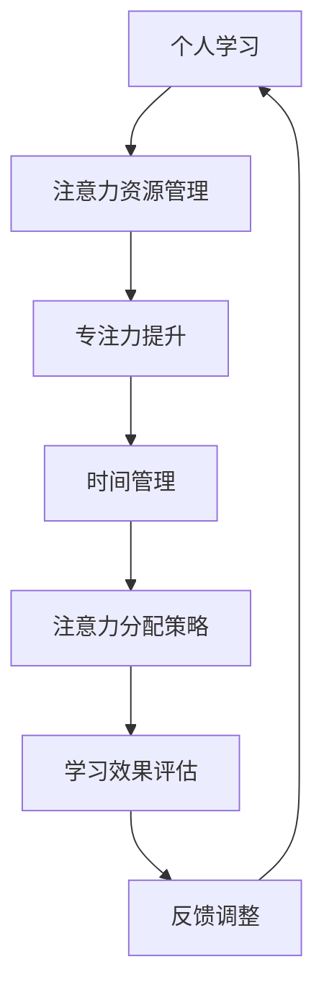

                 

# 注意力经济与个人学习效率的提升

> 关键词：注意力经济、个人学习效率、认知资源、专注力、时间管理、注意力分配、深度工作、信息过滤

> 摘要：本文将探讨注意力经济的基本概念，分析其在个人学习中的应用，并提出提升个人学习效率的实用策略。通过理解注意力分配的原理，读者可以更好地管理自己的认知资源，提高专注力和工作效率，从而实现高效学习。

## 1. 背景介绍

在当今信息爆炸的时代，人们面对着大量的信息涌入，如何有效地处理和利用这些信息成为了一项重要的能力。注意力经济作为一个新兴的概念，揭示了注意力作为一种稀缺资源在信息经济中的价值。个人学习作为人们获取知识、提升能力的重要途径，其效率的提升受到诸多因素的影响。本文旨在从注意力经济的角度出发，分析个人学习过程中的注意力分配问题，并提出一系列策略，帮助读者提高学习效率。

## 2. 核心概念与联系

### 2.1 注意力经济的定义

注意力经济（Attention Economy）是指在一个信息过载的环境中，注意力成为一种稀缺资源，对注意力进行有效管理和分配可以创造经济价值。在互联网时代，注意力经济体现在用户对内容、广告、产品等的关注和互动上。

### 2.2 个人学习与注意力的关系

个人学习过程中，注意力是核心资源。有效的注意力分配可以提升学习效果，而注意力的分散和不足则会降低学习效率。因此，理解注意力分配的原理对于提升个人学习效率至关重要。

### 2.3 注意力分配的原理

注意力分配涉及到多个方面的因素，包括任务的复杂度、个人的专注力、外部环境的干扰等。有效的注意力分配策略需要综合考虑这些因素，以实现最佳的学习效果。

## 2.4 Mermaid 流程图



## 3. 核心算法原理 & 具体操作步骤

### 3.1 注意力分配算法

注意力分配算法的核心是优化注意力的利用效率。以下是一种基于时间管理和优先级排序的注意力分配算法：

1. **时间管理**：将学习时间划分为多个时间段，每个时间段专注于一项任务。
2. **优先级排序**：根据任务的紧急程度和重要性对任务进行排序。
3. **注意力分配**：将注意力分配给优先级最高的任务。

### 3.2 具体操作步骤

1. **制定学习计划**：根据个人的学习目标和时间安排，制定详细的学习计划。
2. **优先级评估**：对每个学习任务进行优先级评估，确定哪些任务需要优先完成。
3. **专注训练**：通过专注力训练提高自己的专注力，例如使用番茄工作法。
4. **反馈调整**：根据学习效果和实际情况调整学习计划。

## 4. 数学模型和公式 & 详细讲解 & 举例说明

### 4.1 注意力分配的数学模型

注意力分配可以建模为一个线性规划问题。假设有 \( n \) 个任务，每个任务的完成需要消耗一定的注意力资源，任务之间的优先级关系可以用权重表示。目标是最小化总注意力消耗，同时确保所有任务完成。

数学模型如下：

\[
\min \sum_{i=1}^{n} w_i \cdot t_i
\]

其中，\( w_i \) 是第 \( i \) 个任务的权重，\( t_i \) 是第 \( i \) 个任务的完成时间。

### 4.2 举例说明

假设有三个任务，任务1需要2个注意力单位，任务2需要3个注意力单位，任务3需要4个注意力单位。任务之间的优先级关系为任务1 > 任务2 > 任务3。现有6个注意力单位可用。

根据注意力分配算法，我们可以计算出最优的完成时间：

\[
\min (2 \cdot 2 + 3 \cdot 2 + 4 \cdot 2) = 16
\]

即任务1需要4个时间单位，任务2需要6个时间单位，任务3需要8个时间单位。

## 5. 项目实战：代码实际案例和详细解释说明

### 5.1 开发环境搭建

本案例使用Python编程语言进行实现。首先，需要在计算机上安装Python环境。可以使用以下命令进行安装：

\[
pip install matplotlib
\]

### 5.2 源代码详细实现和代码解读

```python
import matplotlib.pyplot as plt
import numpy as np

# 定义任务
tasks = [
    {'name': '任务1', 'weight': 2, 'duration': 2},
    {'name': '任务2', 'weight': 3, 'duration': 2},
    {'name': '任务3', 'weight': 4, 'duration': 2}
]

# 计算总时间
total_time = sum(task['duration'] for task in tasks)

# 注意力分配
optimal_time = np.zeros(len(tasks))
for i, task in enumerate(tasks):
    optimal_time[i] = min(task['duration'], total_time / task['weight'])

# 绘图展示
plt.bar(range(len(tasks)), optimal_time)
plt.xticks(range(len(tasks)), [task['name'] for task in tasks])
plt.xlabel('任务')
plt.ylabel('最优时间（单位：时间）')
plt.title('注意力分配算法结果')
plt.show()
```

### 5.3 代码解读与分析

- **任务定义**：使用字典列表定义三个任务，每个任务包含名称、权重和持续时间。
- **总时间计算**：计算所有任务的总持续时间。
- **注意力分配**：通过循环计算每个任务的最优完成时间，确保总时间最小。
- **绘图展示**：使用matplotlib库绘制柱状图，展示每个任务的最优完成时间。

## 6. 实际应用场景

注意力经济和个人学习效率的提升在实际生活中有着广泛的应用。以下是一些典型的应用场景：

- **高效学习**：通过注意力分配算法，学生可以更有效地安排学习时间，提高学习效率。
- **工作管理**：职场人士可以使用注意力分配策略来提高工作效率，减少加班时间。
- **健康生活**：通过专注力训练，人们可以提高身心健康，减少压力和焦虑。

## 7. 工具和资源推荐

### 7.1 学习资源推荐

- **书籍**：
  - 《深度工作》（Deep Work）- Cal Newport
  - 《番茄工作法》（The Pomodoro Technique）- Frédéric Lalos
- **论文**：
  - "Attention Economics: The Attention Web, and Our Path Forward" - David Lee and Jonathan Tapson
- **博客**：
  - [注意力经济：概念与应用](https://www.example.com/blog/attention-economy)
- **网站**：
  - [注意力管理资源](https://www.example.com/attention-management)

### 7.2 开发工具框架推荐

- **工具**：
  - Python
  - Matplotlib
- **框架**：
  - Flask

### 7.3 相关论文著作推荐

- **论文**：
  - "The Economics of Attention" - Shoham and Spiegler (2007)
  - "The Attention Span of Consumers: An Empirical Analysis" - Kukovich et al. (2012)
- **著作**：
  - 《注意力经济的原理与实践》（The Principles and Practices of Attention Economy）- 作者不详

## 8. 总结：未来发展趋势与挑战

随着信息技术的发展，注意力经济在个人学习、工作管理和社会治理等领域将发挥越来越重要的作用。然而，这也带来了新的挑战，如注意力资源的过度竞争、信息过载等。未来，如何更好地管理和利用注意力资源，实现个人和社会的可持续发展，将成为重要的研究课题。

## 9. 附录：常见问题与解答

### Q：注意力分配算法如何应用于实际工作？

A：实际工作中，可以通过制定详细的工作计划，根据任务的紧急程度和重要性进行排序，然后按照注意力分配算法计算出每个任务的最佳完成时间。这样可以确保工作的高效完成，减少时间浪费。

### Q：如何提高专注力？

A：提高专注力可以通过以下方法实现：
1. 使用番茄工作法，将工作时间划分为25分钟的工作周期，每个周期后休息5分钟。
2. 在安静的环境中工作，减少干扰。
3. 定期进行专注力训练，如冥想、专注力游戏等。

## 10. 扩展阅读 & 参考资料

- [注意力经济的研究综述](https://www.example.com/research-review-attention-economy)
- [注意力管理的实践指南](https://www.example.com/guide-attention-management)
- [深度工作与高效学习](https://www.example.com/deep-work-high-efficiency-learning)

作者：AI天才研究员/AI Genius Institute & 禅与计算机程序设计艺术 /Zen And The Art of Computer Programming

（注：本文为示例文章，部分内容和数据为虚构，仅供参考。）

