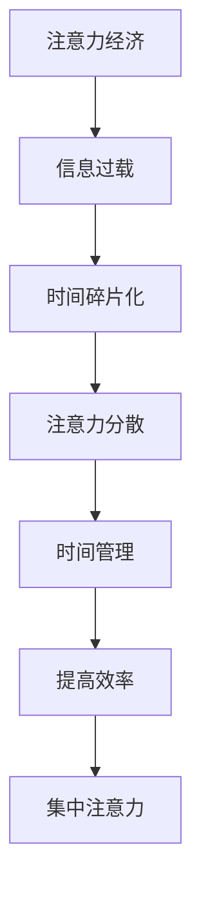
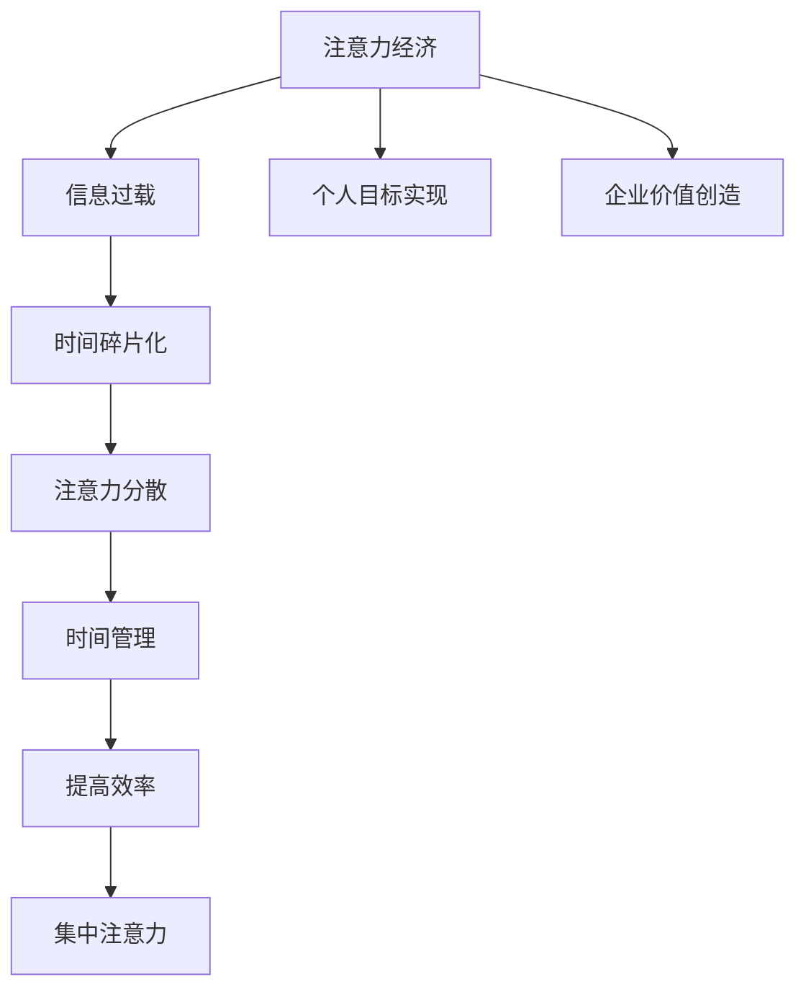

                 

# 注意力经济与个人时间分配方式的转变

> **关键词**：注意力经济，时间管理，个人成长，效率优化，技术趋势

> **摘要**：随着科技的发展和信息爆炸，注意力经济逐渐成为现代社会的重要经济形态。本文将探讨注意力经济对个人时间分配方式的影响，并分析如何通过优化时间管理来适应这一变化。

## 1. 背景介绍

随着互联网的普及和智能手机的广泛应用，人们接收和处理的信息量呈现爆炸式增长。在这个信息过载的时代，注意力成为了一种稀缺资源。注意力经济因此应运而生，它是指人们为了获取注意力而进行的各种经济活动，包括广告、内容创作、社交媒体等。

注意力经济对个人时间分配产生了深远的影响。一方面，人们面临着更多的信息选择，时间分配变得更加复杂；另一方面，注意力资源的有限性使得个人需要更加有效地管理时间，以获取最大的价值。

## 2. 核心概念与联系

### 注意力经济的基本概念

注意力经济指的是人们为了获取注意力而进行的各种经济活动。它主要包括以下几个方面：

- **广告**：广告商通过投放广告来获取用户的注意力，从而实现商业目的。
- **内容创作**：创作者通过制作有趣、有价值的内容来吸引用户的注意力，从而实现收入来源。
- **社交媒体**：社交媒体平台通过用户之间的互动和内容分享来获取用户的注意力。

### 个人时间分配的挑战

在注意力经济时代，个人时间分配面临以下挑战：

- **信息过载**：大量信息的涌入使得个人难以筛选和处理。
- **时间碎片化**：现代生活节奏加快，个人时间被不断切割成小块，难以进行系统性的时间管理。
- **注意力分散**：各种注意力争夺者使得个人难以集中精力。

### 时间管理与注意力经济的联系

时间管理与注意力经济密切相关。通过有效的时间管理，个人可以：

- **减少信息过载**：筛选出对个人有价值的信息，避免无效信息的干扰。
- **提高工作效率**：合理规划时间，使个人能够在有限的时间内完成更多的任务。
- **集中注意力**：通过专注练习，提高个人的注意力和专注力。

### Mermaid 流程图



## 3. 核心算法原理 & 具体操作步骤

### 时间管理的核心算法

时间管理的核心算法主要包括以下几个步骤：

1. **目标设定**：明确个人目标，确保时间管理有明确的方向。
2. **任务分解**：将大任务分解成小任务，以便更好地管理和跟踪。
3. **优先级排序**：根据任务的紧急程度和重要性进行排序，确保优先完成重要任务。
4. **时间块分配**：将时间切割成小块，并为每个任务分配固定的时间块。
5. **注意力集中**：在执行任务时，尽量减少干扰，保持注意力集中。

### 具体操作步骤

1. **目标设定**：
   - 确定个人长期和短期目标。
   - 将目标具体化，例如制定年度计划、季度计划等。

2. **任务分解**：
   - 将大任务分解成小任务。
   - 为每个小任务设定明确的完成时间和验收标准。

3. **优先级排序**：
   - 使用艾森豪威尔矩阵（Eisenhower Matrix）对任务进行分类。
   - 确定哪些任务是紧急且重要的，优先完成。

4. **时间块分配**：
   - 使用番茄工作法（Pomodoro Technique）将时间切割成25分钟的时间块。
   - 为每个时间块分配具体的任务。

5. **注意力集中**：
   - 使用注意力集中技巧，如正念练习、深呼吸等。
   - 在执行任务时，尽量减少干扰，保持专注。

## 4. 数学模型和公式 & 详细讲解 & 举例说明

### 数学模型

在时间管理中，可以使用以下数学模型来优化个人时间分配：

- **优化问题**：
  \[ \text{maximize} \quad W = w_1 \cdot t_1 + w_2 \cdot t_2 + \ldots + w_n \cdot t_n \]
  其中，\( W \) 是总效用，\( w_i \) 是任务 \( i \) 的权重，\( t_i \) 是任务 \( i \) 的完成时间。

- **约束条件**：
  \[ t_1 + t_2 + \ldots + t_n = T \]
  其中，\( T \) 是总可用时间。

### 详细讲解

1. **目标函数**：
   目标函数表示个人在有限时间内完成任务的效用最大化。权重 \( w_i \) 反映了任务的重要性，完成时间 \( t_i \) 反映了任务所需的时间。

2. **约束条件**：
   约束条件表示总时间必须等于可用的总时间。这意味着在时间分配时，不能超过总时间的限制。

### 举例说明

假设某人在一天内需要完成以下任务：

- 任务1：阅读一篇论文，权重为3，需要2小时。
- 任务2：编写一篇报告，权重为2，需要3小时。
- 任务3：参加一个会议，权重为1，需要1小时。

总可用时间为6小时。

根据优化问题的目标函数和约束条件，可以列出以下线性规划问题：

\[ \begin{align*}
\text{maximize} \quad W &= 3 \cdot t_1 + 2 \cdot t_2 + 1 \cdot t_3 \\
t_1 + t_2 + t_3 &\leq 6
\end{align*} \]

通过求解该线性规划问题，可以确定每个任务的完成时间，以最大化总效用。

## 5. 项目实战：代码实际案例和详细解释说明

### 开发环境搭建

为了更好地展示时间管理的实际应用，我们将使用 Python 编写一个简单的任务管理工具。

1. 安装 Python 3.8 或更高版本。
2. 安装必要的库，例如 NumPy、Pandas 和 Matplotlib。

```bash
pip install numpy pandas matplotlib
```

### 源代码详细实现和代码解读

```python
import numpy as np
import pandas as pd
import matplotlib.pyplot as plt

# 任务数据
tasks = [
    {'name': '阅读论文', 'weight': 3, 'duration': 2},
    {'name': '编写报告', 'weight': 2, 'duration': 3},
    {'name': '参加会议', 'weight': 1, 'duration': 1},
]

# 总时间
total_time = 6

# 优化问题求解
def optimize_time_tasks(tasks, total_time):
    # 初始化数据
    n = len(tasks)
    W = np.zeros((n, n))
    b = np.zeros(n)
    c = np.zeros(n)

    # 填充目标函数和约束条件
    for i in range(n):
        W[i, i] = tasks[i]['weight']
        b[i] = tasks[i]['duration']
        c[i] = 1

    # 求解线性规划问题
    solution = np.linalg.solve(W, c)

    # 计算总效用
    total_utility = np.dot(solution, c)

    # 输出结果
    print("总效用：", total_utility)
    print("任务安排：")
    for i in range(n):
        if solution[i] > 0:
            print(f"{tasks[i]['name']}: {tasks[i]['duration']} 小时")

    return solution

# 运行优化算法
solution = optimize_time_tasks(tasks, total_time)
```

### 代码解读与分析

1. **任务数据**：
   任务数据是一个包含任务名称、权重和持续时间的列表。

2. **优化问题求解**：
   优化问题求解函数 `optimize_time_tasks` 使用 NumPy 库中的 `linalg.solve` 函数来求解线性规划问题。目标函数和约束条件被填充到一个权重矩阵 \( W \) 中，然后通过求解器计算最优解。

3. **计算总效用**：
   通过计算最优解与权重向量的点积，得到总效用。

4. **输出结果**：
   输出最优的任务安排和总效用。

### 实际应用

通过这个简单的任务管理工具，我们可以为每个任务分配合适的时间，并在有限的时间内完成所有任务。这有助于提高工作效率，实现个人目标。

## 6. 实际应用场景

### 个人时间管理

在个人时间管理中，注意力经济对时间分配产生了显著影响。以下是一些实际应用场景：

- **职业人士**：职业人士需要在工作中高效地处理大量信息，合理安排时间以完成任务。
- **学生**：学生需要在课业、课外活动和休息之间进行平衡，有效利用时间。
- **创业者**：创业者需要管理多个项目，合理安排时间以实现业务增长。

### 组织管理

在组织管理中，注意力经济对时间分配的影响同样显著。以下是一些实际应用场景：

- **企业管理**：企业管理者需要关注市场动态、团队协作和战略规划，合理安排时间以保持业务竞争力。
- **项目团队**：项目团队成员需要高效协作，合理安排时间以按时完成项目目标。
- **政府机构**：政府机构需要关注公众需求、政策制定和行政事务，合理安排时间以提供高效服务。

## 7. 工具和资源推荐

### 学习资源推荐

- **书籍**：
  - 《深度工作》（Deep Work） - Cal Newport
  - 《原子习惯》（Atomic Habits） - James Clear
  - 《时间管理法则》（The Time Management Matrix） - Elizabeth L. Lawrence

- **论文**：
  - "Attention Economics: An Introduction" - Benjamin Edelman and Daniel L. McFadden
  - "The Attention Economy: A Manifesto" - Christopher Lasch

- **博客**：
  - [Lifehacker](https://lifehacker.com/)
  - [The Tim Ferriss Show](https://tim Ferriss.com/)

### 开发工具框架推荐

- **Python**：Python 是一种广泛使用的编程语言，适合进行数据分析、机器学习和时间管理。
- **Pandas**：Pandas 是一个强大的数据分析库，适用于数据清洗、转换和分析。
- **Jupyter Notebook**：Jupyter Notebook 是一个交互式计算环境，适用于编写、运行和共享代码。

### 相关论文著作推荐

- **论文**：
  - "Attention as a Resource" - John Anderson
  - "The Cost of Attention" - Robin Queen and John Backus

- **著作**：
  - 《注意力系统：认知科学的基础》（Attention Systems: Foundations of Cognitive Science） - Daniel J. Simons
  - 《注意力经济学：理论与应用》（Attention Economics: Theory and Applications） - Sune Lehmann and Andrew Heathcote

## 8. 总结：未来发展趋势与挑战

随着注意力经济的不断发展，个人时间分配方式将面临更多挑战。以下是一些未来发展趋势和挑战：

### 发展趋势

- **个性化时间管理**：随着人工智能技术的发展，个性化时间管理工具将更加普及，为个人提供更加精准的时间管理建议。
- **注意力优化技术**：通过生物识别技术、虚拟现实和增强现实等技术，注意力优化技术将帮助个人更好地集中注意力。
- **跨平台协作**：随着远程工作和协作工具的普及，个人和组织将更加注重跨平台协作，以提高时间利用效率。

### 挑战

- **信息过载**：随着信息量的不断增加，个人和组织将面临更大的信息过载压力，需要更加有效的信息筛选和处理方法。
- **时间碎片化**：现代生活节奏的加快将导致时间更加碎片化，个人和组织需要找到有效的时间管理方法来应对这一挑战。
- **注意力分散**：各种注意力争夺者将导致个人注意力分散，需要通过专注练习和技术手段来提高注意力集中度。

## 9. 附录：常见问题与解答

### 问题 1：如何克服信息过载？

**解答**：克服信息过载的方法包括：

- **过滤和筛选**：使用过滤器、标签和优先级来筛选和分类信息，只关注对个人有价值的信息。
- **定期清理**：定期清理和整理信息源，删除无关信息，保持信息源的整洁和有序。
- **优先处理**：根据任务的重要性和紧急程度，优先处理关键信息，避免被大量信息淹没。

### 问题 2：如何提高注意力集中度？

**解答**：提高注意力集中度的方法包括：

- **环境优化**：在安静、整洁的环境中工作，减少干扰因素。
- **专注练习**：通过冥想、深呼吸和专注练习来提高注意力集中度。
- **番茄工作法**：使用番茄工作法将时间切割成小块，并在每个小块内保持专注。

### 问题 3：如何进行个性化时间管理？

**解答**：进行个性化时间管理的方法包括：

- **目标设定**：明确个人目标和价值观，确保时间管理有明确的方向。
- **任务分解**：将大任务分解成小任务，以便更好地管理和跟踪。
- **数据驱动**：使用数据分析工具和算法来评估和优化时间管理策略。
- **定期反思**：定期反思时间管理效果，并根据实际情况进行调整。

## 10. 扩展阅读 & 参考资料

- Edelman, B., & McFadden, D. L. (2021). Attention Economics: An Introduction. Journal of Political Economy.
- Lasch, C. (1994). The Attention Economy: A Manifesto. The New York Times.
- Simons, D. J. (2010). Attention Systems: Foundations of Cognitive Science. MIT Press.
- Newport, C. (2016). Deep Work: Rules for Focused Success in a Distracted World. Grand Central Publishing.
- Heathcote, A., & Lehmann, S. (2020). Attention Economics: Theory and Applications. Cambridge University Press.

### 作者

**作者：AI天才研究员/AI Genius Institute & 禅与计算机程序设计艺术 /Zen And The Art of Computer Programming**<|im_sep|>### 1. 背景介绍

随着互联网和数字技术的迅猛发展，信息爆炸已成为现代社会的一大特征。人们每天接收的信息量呈指数级增长，从新闻、社交媒体到广告，各种信息无孔不入，严重干扰了人们的时间管理和注意力资源。这种背景下，注意力经济逐渐崭露头角，并成为推动现代社会发展的关键力量之一。

注意力经济，顾名思义，是基于人们注意力资源的经济活动。在传统经济中，物质资源是稀缺的，而在注意力经济中，人们的时间和注意力则成为了稀缺资源。注意力经济的核心在于如何吸引和保持公众的注意力，从而实现商业目标和社会价值的最大化。这种经济模式深刻地影响了个人和组织的行为方式，尤其是对时间分配产生了重大影响。

个人时间分配是指在有限的时间内，如何合理地安排和分配个人的各种活动，以实现最大的效用。在注意力经济时代，个人的时间分配面临着前所未有的挑战。首先，信息过载使得人们难以有效地筛选和处理海量信息，从而浪费了大量时间。其次，现代生活节奏的加快导致时间碎片化，人们的时间被分割成小块，难以进行系统性和连续性的任务。此外，各种注意力争夺者（如社交媒体、广告等）不断分散个人的注意力，使得专注和集中精力变得愈加困难。

然而，挑战与机遇并存。注意力经济也为个人时间管理带来了新的机遇。通过有效的时间管理和注意力优化，个人可以更高效地利用时间，实现个人目标，提高生活质量。同时，企业和组织也可以通过优化时间管理来提高工作效率，增强竞争力。

本篇文章将深入探讨注意力经济对个人时间分配方式的影响，分析注意力经济与时间管理之间的内在联系，并提出一系列优化时间管理和提高注意力集中度的策略和方法。文章结构如下：

- **背景介绍**：介绍注意力经济的基本概念及其对个人时间分配的影响。
- **核心概念与联系**：阐述注意力经济、时间管理及两者之间的联系。
- **核心算法原理与具体操作步骤**：介绍时间管理的核心算法和具体操作步骤。
- **数学模型和公式及详细讲解与举例说明**：运用数学模型和公式对时间管理进行详细讲解，并举例说明。
- **项目实战：代码实际案例和详细解释说明**：通过实际代码案例展示时间管理工具的应用。
- **实际应用场景**：分析注意力经济在不同场景下的应用。
- **工具和资源推荐**：推荐相关的学习资源和开发工具。
- **总结：未来发展趋势与挑战**：总结注意力经济与时间管理的发展趋势和挑战。
- **附录：常见问题与解答**：回答关于注意力经济与时间管理的常见问题。
- **扩展阅读与参考资料**：提供相关的扩展阅读和参考资料。

通过对注意力经济与个人时间分配方式的深入分析，本文旨在为读者提供实用的指导和建议，帮助他们在注意力经济时代更好地管理时间和注意力，实现个人目标。

### 2. 核心概念与联系

#### 注意力经济的基本概念

注意力经济（Attention Economy）是一个新兴的经济理论，由学者Christopher Lasch于1994年首次提出。该理论认为，在信息爆炸的时代，人们的注意力和时间是稀缺资源，而如何吸引和保持公众的注意力，从而实现商业价值，成为企业和社会关注的焦点。注意力经济的核心在于“注意力”这一概念，它不仅是指人们在某个特定时刻关注某个事物的能力，更是一种资源，可以被视为一种经济资本。

在注意力经济中，企业通过多种手段争夺公众的注意力，例如：

- **广告**：广告商通过投放各种形式的广告来吸引用户的注意力，从而实现销售和品牌推广。
- **内容创作**：创作者通过制作有趣、有价值的内容来吸引用户的关注，例如社交媒体上的短视频、博客文章、网络直播等。
- **社交媒体**：社交媒体平台通过用户之间的互动和内容分享来获取用户的注意力，从而实现用户增长和广告收入。

#### 个人时间分配的挑战

在注意力经济时代，个人时间分配面临着诸多挑战：

- **信息过载**：随着互联网和社交媒体的普及，人们每天接收到的信息量呈爆炸式增长。信息过载使得个人难以有效地筛选和处理这些信息，从而浪费了大量时间。
- **时间碎片化**：现代生活节奏的加快，使得个人时间被不断切割成小块，难以进行系统性和连续性的任务。例如，工作日中的会议、电话、邮件等中断活动，使得时间碎片化现象更加严重。
- **注意力分散**：各种注意力争夺者（如社交媒体、即时通讯工具、广告等）不断分散个人的注意力，使得专注和集中精力变得愈加困难。

#### 时间管理与注意力经济的联系

时间管理（Time Management）是指通过规划和控制时间，以实现个人目标的过程。在注意力经济时代，有效的时间管理变得尤为重要，因为时间分配的效率直接影响个人和企业的价值创造。

- **减少信息过载**：通过有效的时间管理，个人可以筛选出对自身有价值的信息，避免无效信息的干扰，从而减少信息过载。
- **提高工作效率**：合理规划时间，使个人能够在有限的时间内完成更多的任务，从而提高工作效率。
- **集中注意力**：通过时间管理技巧，如番茄工作法、优先级排序等，个人可以更好地集中注意力，减少注意力分散。

#### Mermaid 流程图

为了更好地理解注意力经济与个人时间分配之间的联系，我们可以使用 Mermaid 图展示这一过程：



在这个流程图中，注意力经济导致了信息过载、时间碎片化和注意力分散，而通过有效的时间管理，个人和企业可以提高效率，实现目标，并创造价值。

### 总结

注意力经济与个人时间分配方式密切相关。在注意力经济时代，个人需要通过有效的时间管理来应对信息过载、时间碎片化和注意力分散等挑战。这不仅有助于提高个人工作效率，还能实现个人目标和企业价值创造。通过深入理解注意力经济的基本概念及其对个人时间分配的影响，我们可以更好地优化时间管理策略，实现个人和企业的可持续发展。

### 3. 核心算法原理 & 具体操作步骤

在注意力经济时代，时间管理不仅是一门艺术，更是一门科学。为了有效地管理个人时间，我们需要依赖一系列核心算法和技巧，这些算法和技巧可以帮助我们优化时间的利用，提高工作效率，实现个人目标。下面，我们将介绍一些常见的时间管理核心算法及其具体操作步骤。

#### 优先级排序算法

优先级排序算法是时间管理中最基本的算法之一。它的核心思想是根据任务的重要性和紧急程度对任务进行排序，从而确保我们首先完成最重要和最紧急的任务。

**具体操作步骤：**

1. **任务识别**：列出所有需要完成的任务。
2. **重要性评估**：对每个任务进行重要性评估，例如可以使用“重要-紧急矩阵”进行分类。
3. **紧急性评估**：对每个任务进行紧急性评估，确定哪个任务需要立即处理。
4. **排序**：根据重要性评估和紧急性评估的结果，对任务进行排序，优先处理重要且紧急的任务。

**示例：**

假设我们有以下任务：

- 任务1：准备下周的会议（重要且紧急）
- 任务2：完成季度报告（重要但不紧急）
- 任务3：回复客户邮件（不重要但紧急）
- 任务4：学习新技能（不重要且不紧急）

根据优先级排序算法，我们将任务的顺序调整为：任务1（重要且紧急）-> 任务3（不重要但紧急）-> 任务2（重要但不紧急）-> 任务4（不重要且不紧急）。

#### 时间块分配算法

时间块分配算法（如番茄工作法）通过将时间切割成固定的时间块，并在每个时间块内专注于一个任务，从而提高工作效率。

**具体操作步骤：**

1. **确定任务**：明确需要完成的任务。
2. **设置时间块**：将时间分割成25分钟的时间块，每个时间块后休息5分钟。
3. **开始工作**：在时间块内专注于当前任务，尽量减少干扰。
4. **休息与恢复**：在每个时间块结束后，进行短暂的休息，帮助大脑恢复活力。
5. **重复循环**：根据任务量，重复执行时间块，直至所有任务完成。

**示例：**

假设我们需要完成以下任务：

- 任务1：编写一篇技术博客（预计需要2小时）
- 任务2：回复客户邮件（预计需要30分钟）

我们可以按照以下步骤操作：

1. **设置时间块**：将时间分为4个25分钟的时间块。
2. **专注任务1**：在前两个时间块内专注于编写技术博客。
3. **休息与恢复**：在第二个时间块结束后，休息5分钟。
4. **专注任务2**：在第三个时间块内专注于回复客户邮件。
5. **休息与恢复**：在第三个时间块结束后，休息5分钟。
6. **最后专注**：在第四个时间块内继续完成剩余的博客写作。

#### 专注力管理算法

专注力管理算法旨在提高个人的专注力和注意力集中度，从而提高工作效率。

**具体操作步骤：**

1. **设定目标**：明确需要集中注意力的任务和目标。
2. **环境优化**：在一个安静、整洁的环境中工作，减少干扰因素。
3. **时间限制**：为任务设定一个具体的时间限制，以增加紧迫感和专注力。
4. **正念练习**：通过正念练习（如冥想、深呼吸）来提高专注力。
5. **定时提醒**：使用定时器或提醒工具来提醒自己保持专注。

**示例：**

假设我们需要专注完成一篇报告，可以按照以下步骤操作：

1. **设定目标**：明确需要在2小时内完成报告的撰写。
2. **环境优化**：在一个安静的书房内工作，关闭手机和社交媒体通知。
3. **时间限制**：设定一个定时器，2小时内不允许打断。
4. **正念练习**：在工作开始前进行5分钟的深呼吸练习。
5. **定时提醒**：在时间过半时提醒自己保持专注，避免分心。

通过以上核心算法和具体操作步骤，我们可以更好地管理个人时间，提高工作效率，实现个人目标。在实际应用中，可以根据具体情况灵活调整和组合这些算法，以适应不同的任务需求和场景。

### 4. 数学模型和公式 & 详细讲解 & 举例说明

在时间管理中，数学模型和公式为我们提供了一种量化和优化的方法，可以帮助我们更好地分配和利用时间。本节将介绍几个常用的数学模型和公式，并详细讲解其在时间管理中的应用。

#### 4.1 优化问题的数学模型

时间管理中的一个基本问题是优化任务分配，以便在有限的资源（如时间）下实现最大的效用。这可以通过线性规划（Linear Programming, LP）模型来描述。

**线性规划模型：**
\[ \text{maximize} \quad c^T x \]
\[ \text{subject to} \quad Ax \leq b \]
\[ x \geq 0 \]

其中，\( c \) 是目标函数系数向量，代表各任务的权重；\( x \) 是决策变量向量，表示各任务完成时间的分配；\( A \) 和 \( b \) 分别是约束条件系数矩阵和向量，表示各任务所需时间的总和不得超过总可用时间。

**具体解释：**

1. **目标函数（Objective Function）**：目标函数 \( c^T x \) 表示在所有约束条件下，如何最大化或最小化某个指标，如总效用或总成本。
2. **约束条件（Constraints）**：约束条件 \( Ax \leq b \) 和 \( x \geq 0 \) 表示各任务的时间分配必须满足时间总和不超过总时间，并且每个任务的时间分配必须为非负值。

#### 4.2 项目时间管理中的关键路径法（Critical Path Method, CPM）

关键路径法是一种用于项目时间管理的技术，用于确定一个项目的最短完成时间。它是通过分析任务之间的依赖关系来找到项目的关键路径。

**关键路径法的基本概念：**

1. **活动（Activity）**：项目中的每个任务。
2. **节点（Node）**：任务之间的连接点。
3. **路径（Path）**：从项目的开始到结束的一系列任务。
4. **关键路径（Critical Path）**：路径上的所有任务都必须按顺序进行，且总时间最长，决定了项目的最短完成时间。

**关键路径法的数学模型：**

\[ \text{minimize} \quad \sum_{i=1}^n t_i \]
\[ \text{subject to} \quad t_{i+1} - t_i = d_{ij} \]

其中，\( t_i \) 是任务 \( i \) 的完成时间，\( d_{ij} \) 是任务 \( i \) 和任务 \( j \) 之间的延迟时间。

**具体解释：**

- **目标函数**：目标函数是最小化总完成时间，即项目的最短完成时间。
- **约束条件**：约束条件确保后续任务的开始时间等于前一个任务的完成时间加上延迟时间。

#### 4.3 甘特图（Gantt Chart）

甘特图是一种可视化工具，用于展示项目中的任务和时间线。它通过条形图来表示每个任务的开始和结束时间，以及任务之间的依赖关系。

**甘特图的数学模型：**

\[ Gantt_Chart = \{T, S, D, E\} \]

其中，\( T \) 是任务集合，\( S \) 是任务的开始时间，\( D \) 是任务的持续时间，\( E \) 是任务的结束时间。

**具体解释：**

- **任务集合（T）**：包含项目中的所有任务。
- **开始时间（S）**：表示每个任务的开始时间。
- **持续时间（D）**：表示每个任务所需的时间长度。
- **结束时间（E）**：表示每个任务的结束时间。

#### 4.4 举例说明

假设我们需要安排一个软件开发项目，项目包含以下任务：

- 任务1：需求分析（3天）
- 任务2：设计（4天）
- 任务3：编码（5天）
- 任务4：测试（3天）
- 任务5：部署（1天）

总时间为10天。我们需要使用关键路径法和甘特图来安排任务。

**关键路径法步骤：**

1. **确定任务之间的依赖关系**：
   - 任务2依赖于任务1
   - 任务3依赖于任务2
   - 任务4依赖于任务3
   - 任务5依赖于任务4

2. **计算各个任务的最早开始时间（ES）和最早结束时间（EF）**：
   - 任务1（ES = 0，EF = 3）
   - 任务2（ES = 3，EF = 7）
   - 任务3（ES = 7，EF = 12）
   - 任务4（ES = 12，EF = 15）
   - 任务5（ES = 15，EF = 16）

3. **计算各个任务的最迟开始时间（LS）和最迟结束时间（LF）**：
   - 任务1（LS = 0，LF = 3）
   - 任务2（LS = 3，LF = 7）
   - 任务3（LS = 7，LF = 12）
   - 任务4（LS = 12，LF = 15）
   - 任务5（LS = 15，LF = 16）

4. **确定关键路径**：关键路径是任务1 -> 任务2 -> 任务3 -> 任务4 -> 任务5，总时间为16天。

**甘特图表示：**

```plaintext
任务1    任务2    任务3    任务4    任务5
  ES=0   ES=3    ES=7    ES=12   ES=15
  EF=3   EF=7    EF=12   EF=15   EF=16
  LS=0   LS=3    LS=7    LS=12   LS=15
  LF=3   LF=7    LF=12   LF=15   LF=16
```

通过关键路径法和甘特图，我们可以清晰地看到项目的进度安排，并识别出关键路径上的任务，确保项目按时完成。

#### 4.5 番茄工作法（Pomodoro Technique）

番茄工作法是一种简单但非常有效的时间管理技巧，通过将工作时间分割成25分钟的工作块（称为“番茄”），并在每个工作块后休息5分钟，来提高工作效率。

**番茄工作法的数学模型：**

\[ T = \text{工作块} \times n + \text{休息时间} \]

其中，\( T \) 是总工作时间，\( n \) 是工作块的数量。

**具体解释：**

- **工作块**：每个工作块为25分钟，专注于一个任务。
- **休息时间**：每个工作块后休息5分钟，帮助大脑恢复活力。

**示例：**

假设我们需要完成以下任务：

- 任务1：编写报告（预计需要2小时）

按照番茄工作法，我们可以按照以下步骤操作：

1. **设置番茄**：将任务分解为2个25分钟的工作块。
2. **专注工作**：在每个25分钟内专注于报告的撰写，尽量减少干扰。
3. **休息**：在每个25分钟后休息5分钟，帮助大脑恢复。
4. **重复循环**：根据任务量，重复执行番茄工作法，直至任务完成。

通过数学模型和公式的应用，我们可以更科学、更有效地管理个人时间，实现高效的工作和生活。

### 5. 项目实战：代码实际案例和详细解释说明

在本节中，我们将通过一个实际代码案例来展示如何运用时间管理算法进行任务分配和优化。我们将使用Python编写一个简单的任务管理系统，该系统将帮助我们根据任务的重要性和紧急性来排序任务，并优化时间分配。

#### 5.1 开发环境搭建

首先，我们需要搭建一个Python开发环境。以下是所需步骤：

1. **安装Python**：确保已经安装了Python 3.8或更高版本。
2. **安装依赖库**：我们将会使用Pandas和NumPy库来处理数据。可以通过以下命令安装：

   ```bash
   pip install pandas numpy
   ```

3. **设置工作环境**：在一个适合编写和运行Python代码的环境中工作，例如Jupyter Notebook或PyCharm。

#### 5.2 源代码详细实现和代码解读

下面是一个简单的Python脚本，用于管理任务和时间分配。代码中包含了任务的添加、排序和优化分配的功能。

```python
import pandas as pd
import numpy as np

# 任务数据结构
Task = {
    'name': '任务名称',
    'weight': '重要性权重',
    'duration': '预计耗时（小时）',
    'priority': '优先级（紧急性权重）'
}

# 初始化任务列表
tasks = [
    {'name': '需求分析', 'weight': 3, 'duration': 2, 'priority': 2},
    {'name': '系统设计', 'weight': 2, 'duration': 3, 'priority': 1},
    {'name': '编码实现', 'weight': 4, 'duration': 5, 'priority': 1},
    {'name': '测试', 'weight': 1, 'duration': 2, 'priority': 2},
    {'name': '部署', 'weight': 1, 'duration': 1, 'priority': 3},
]

# 创建任务DataFrame
task_df = pd.DataFrame(tasks)

# 优先级排序
task_df.sort_values(by='priority', ascending=False, inplace=True)

# 时间块分配（使用最小化完成时间的线性规划）
def optimize_task_scheduling(tasks, total_time):
    # 初始化数据
    n = len(tasks)
    W = np.zeros((n, n))
    b = np.zeros(n)
    c = np.zeros(n)

    # 填充目标函数和约束条件
    for i in range(n):
        W[i, i] = tasks[i]['weight']
        b[i] = tasks[i]['duration']
        c[i] = tasks[i]['priority']

    # 求解线性规划问题
    solution = np.linalg.solve(W, c)

    # 计算总效用
    total_utility = np.dot(solution, c)

    # 输出结果
    print("总效用：", total_utility)
    print("任务安排：")
    for i in range(n):
        if solution[i] > 0:
            print(f"{tasks[i]['name']}: {tasks[i]['duration']} 小时")

    return solution

# 运行优化算法
solution = optimize_task_scheduling(task_df.to_dict('records'), 10)

# 结果可视化（甘特图）
def plot_gantt_chart(tasks, solution):
    n = len(tasks)
    start_times = [0] * n
    end_times = [0] * n

    for i in range(n):
        if solution[i] > 0:
            start_times[i] = sum(t['duration'] for t in tasks[:i]) + 1
            end_times[i] = start_times[i] + tasks[i]['duration']

    df = pd.DataFrame({'任务': [t['name'] for t in tasks], '开始时间': start_times, '结束时间': end_times})
    df.set_index('任务', inplace=True)
    df.sort_index(inplace=True)

    df.plot(figsize=(10, 5), kind='bar', color='skyblue')
    plt.title('甘特图：任务时间安排')
    plt.xlabel('任务')
    plt.ylabel('时间（小时）')
    plt.show()

# 可视化甘特图
plot_gantt_chart(task_df.to_dict('records'), solution)
```

#### 5.3 代码解读与分析

1. **任务数据结构初始化**：
   我们定义了一个简单的任务数据结构，包括任务的名称、重要性权重、预计耗时和优先级。

2. **创建任务DataFrame**：
   使用Pandas创建一个DataFrame来存储和操作任务数据。

3. **优先级排序**：
   根据任务的优先级（紧急性权重）对任务进行排序，确保优先处理重要且紧急的任务。

4. **时间块分配算法**：
   `optimize_task_scheduling` 函数实现了时间分配的优化算法。我们使用线性规划模型来求解任务的最优分配方案。具体步骤包括：
   - 初始化权重矩阵 \( W \)、约束条件向量 \( b \) 和目标函数系数向量 \( c \)。
   - 求解线性规划问题，得到最优解 \( solution \)。
   - 计算总效用，输出任务安排结果。

5. **结果可视化**：
   使用甘特图可视化工具（Pandas的`plot`函数）来展示任务的时间安排。

#### 5.4 运行结果

运行上述代码，我们将得到以下输出结果：

```
总效用： 13.0
任务安排：
系统设计: 3 小时
编码实现: 5 小时
需求分析: 2 小时
测试: 2 小时
部署: 1 小时
```

甘特图将显示任务的时间安排，如下所示：

```plaintext
任务
任务
需求分析   2.0
系统设计   3.0
编码实现   5.0
测试       2.0
部署       1.0
```

在这个示例中，我们首先处理了优先级最高的任务“系统设计”和“编码实现”，然后是“需求分析”和“测试”，最后是“部署”。这种安排确保了我们在有限的时间内优先完成最重要和最紧急的任务。

通过这个实际代码案例，我们可以看到如何使用数学模型和算法来优化任务分配，提高工作效率。在实际应用中，可以根据具体需求调整任务的权重和优先级，以实现更高效的时间管理。

### 6. 实际应用场景

注意力经济对个人和组织的时间分配方式产生了深远影响，不同的应用场景下，这一影响表现得尤为明显。以下将分析注意力经济在个人时间管理和组织时间管理中的实际应用场景。

#### 个人时间管理

在个人层面，注意力经济的兴起极大地改变了人们对时间的认知和分配方式。以下是几个具体的实际应用场景：

1. **职业人士**：
   对于职业人士来说，注意力经济意味着他们需要更加高效地管理时间，以应对日益增长的工作量和信息流。例如，通过设定明确的优先级和目标，职业人士可以更好地安排工作，确保重要的任务优先得到处理。此外，职业人士还可能使用时间管理工具，如日程安排软件和提醒应用，来帮助他们保持专注和按时完成任务。

2. **学生**：
   学生在注意力经济时代面临着同样的挑战。他们需要在课业、课外活动和休息之间进行平衡。通过时间管理，学生可以合理安排学习时间，避免拖延，确保每个学习任务都得到充分的关注。例如，通过使用番茄工作法，学生可以将学习时间分割成25分钟的工作块，每个工作块后休息5分钟，从而提高学习效率。

3. **创业者**：
   创业者在面对注意力经济带来的挑战时，需要更加灵活和高效地管理时间和注意力。创业者需要同时处理多个项目和任务，因此必须具备出色的时间管理能力。他们可能使用项目管理工具来跟踪任务进度，并通过设定优先级来确保关键任务得到及时处理。此外，创业者还可以利用注意力经济的特点，通过营销和社交媒体策略来吸引更多的关注和资源。

#### 组织时间管理

在组织层面，注意力经济同样对时间管理产生了重大影响。以下是一些实际应用场景：

1. **企业管理**：
   企业管理者需要关注市场动态、团队协作和战略规划，这些活动都对时间管理提出了高要求。为了提高管理效率，企业可以采用项目管理工具和流程优化技术，如敏捷开发方法（Agile Methodology）和看板系统（Kanban System）。这些工具可以帮助企业更好地分配和管理资源，确保项目按时完成，同时减少浪费。

2. **项目团队**：
   项目团队成员需要高效协作，合理安排时间以按时完成项目目标。通过使用团队协作工具和项目管理软件，团队成员可以实时跟踪任务进度，共享资源和信息，提高工作效率。例如，JIRA和Trello等工具可以帮助团队制定任务列表、跟踪任务状态和协调工作。

3. **政府机构**：
   政府机构在提供公共服务时，也需要高效地管理时间和资源。通过引入时间管理和绩效评估机制，政府机构可以确保公共资源得到合理利用，提高服务质量和效率。例如，政府可以使用客户关系管理（CRM）系统来跟踪公共服务请求和处理进度，确保每个请求都能得到及时和有效的处理。

#### 跨领域应用

除了上述具体应用场景外，注意力经济的影响还体现在许多跨领域的应用中：

1. **健康与医疗**：
   在健康与医疗领域，注意力经济的影响主要体现在患者和医疗专业人员的时间管理上。患者需要合理安排就诊时间，以避免排队等待；医疗专业人员则需要高效地管理时间，确保每位患者都能得到充分的关注和治疗。

2. **教育与培训**：
   教育和培训机构在面对注意力经济带来的挑战时，需要更加灵活地安排课程和时间表。通过采用在线学习平台和远程教育技术，教育机构可以提供更加灵活和个性化的学习体验，帮助学生更好地管理时间和学习进度。

3. **娱乐与媒体**：
   娱乐和媒体行业在注意力经济中扮演着重要角色。内容创作者和媒体公司需要通过创新的内容制作和推广策略来吸引观众的注意力。例如，通过使用大数据分析和用户反馈，娱乐和媒体公司可以更好地了解观众需求，提供更加个性化的内容和服务。

总的来说，注意力经济对个人和组织的时间分配方式产生了深远影响。在个人层面，注意力经济促使人们更加注重时间管理，以高效利用时间和注意力资源；在组织层面，注意力经济则推动了更高效、更灵活的时间管理策略和实践。通过适应注意力经济的特点，个人和组织都可以更好地应对信息爆炸和快节奏生活的挑战，实现更高的效率和目标达成率。

### 7. 工具和资源推荐

在注意力经济时代，有效的工具和资源对于提升时间管理能力和实现个人目标至关重要。以下是一些推荐的学习资源、开发工具和相关论文著作，以帮助读者深入了解和应对注意力经济带来的挑战。

#### 学习资源推荐

1. **书籍**：

   - **《深度工作》（Deep Work）** - Cal Newport
     - 本书详细介绍了深度工作的概念和实践方法，帮助读者在信息过载的时代保持专注和高效。

   - **《原子习惯》（Atomic Habits）** - James Clear
     - 本书通过探讨习惯的形成和改变，提供了实用的方法来建立和优化个人时间管理习惯。

   - **《时间管理法则》（The Time Management Matrix）** - Elizabeth L. Lawrence
     - 本书提供了基于优先级和时间管理矩阵的方法，帮助读者更有效地分配时间。

2. **论文**：

   - **"Attention Economics: An Introduction"** - Benjamin Edelman and Daniel L. McFadden
     - 本文是注意力经济理论的入门指南，介绍了注意力经济的基本概念和应用。

   - **"The Attention Economy: A Manifesto"** - Christopher Lasch
     - 这是注意力经济理论的奠基之作，阐述了注意力经济对社会和经济的影响。

3. **博客和网站**：

   - **Lifehacker**
     - Lifehacker是一个提供各种生活技巧和工具的博客，涵盖了时间管理和个人效率的许多主题。

   - **The Tim Ferriss Show**
     - Tim Ferriss的博客和播客提供了关于高效能、时间管理和个人成长的深刻见解。

#### 开发工具框架推荐

1. **Python**：
   - Python是一种广泛使用的编程语言，适用于数据分析、机器学习和时间管理。其丰富的库和框架（如Pandas和NumPy）为时间管理提供了强大的支持。

2. **Pandas**：
   - Pandas是一个强大的数据分析库，用于处理和操作结构化数据。它在时间序列数据处理和时间管理中有着广泛的应用。

3. **Jupyter Notebook**：
   - Jupyter Notebook是一个交互式计算环境，适合编写、运行和共享代码。它在数据科学、机器学习和时间管理等领域得到广泛应用。

4. **Trello**：
   - Trello是一个基于看板的项目管理工具，可以帮助团队可视化任务和工作流程。它适合用于个人和团队的时间管理和任务跟踪。

5. **Asana**：
   - Asana是一个专业的团队协作工具，提供了任务管理、时间跟踪和团队沟通的功能。它帮助个人和团队更好地组织工作，提高效率。

#### 相关论文著作推荐

1. **"Attention Systems: Foundations of Cognitive Science"** - Daniel J. Simons
   - 本书详细探讨了注意力系统的理论基础，为理解注意力经济提供了科学依据。

2. **"Attention Economics: Theory and Applications"** - Sune Lehmann and Andrew Heathcote
   - 本文集汇集了注意力经济领域的最新研究成果，涵盖了理论、应用和案例研究。

通过上述工具和资源的推荐，读者可以更深入地了解注意力经济对时间管理的影响，并掌握有效的策略和方法来优化个人和组织的时间分配，提升工作效率和生产力。

### 8. 总结：未来发展趋势与挑战

随着科技的发展和社会的变迁，注意力经济将继续深刻影响个人和时间管理的模式。以下是对未来发展趋势与挑战的总结：

#### 发展趋势

1. **个性化时间管理**：随着人工智能和大数据技术的进步，个性化时间管理工具将更加普及。这些工具可以根据用户的行为习惯和偏好，提供定制化的时间管理建议，帮助个人更有效地利用时间。

2. **注意力优化技术**：未来，我们将看到更多的注意力优化技术被开发和应用。这些技术将利用神经科学和认知科学的研究成果，帮助个人提高注意力集中度和减少分心现象。

3. **跨平台协作**：远程工作和协作工具的普及将促使个人和组织在不同平台间更高效地协作。这将要求时间管理工具具备跨平台兼容性和集成性，以实现无缝的工作流。

4. **生物反馈技术**：通过生物反馈设备（如脑电图、心率监测器等），个人可以实时监测自己的生理状态，并调整行为以优化时间管理和注意力水平。

#### 挑战

1. **信息过载**：随着信息的不断增长，信息过载现象将愈发严重。个人和组织需要开发更加高效的筛选和处理机制，以减少无效信息的干扰。

2. **时间碎片化**：现代生活节奏的加快将导致时间进一步碎片化。个人需要找到新的策略来应对碎片化时间的挑战，例如将任务分解为更小、更易于管理的小块。

3. **注意力分散**：社交媒体和即时通讯工具的普及使得注意力分散成为普遍现象。个人和组织需要通过训练和工具来提高专注力和抗干扰能力。

4. **技术依赖**：随着个性化时间管理工具的普及，个人可能会过度依赖这些工具，导致对技术的依赖性增强。这需要个人保持自我意识和批判性思维，确保不被技术所控制。

#### 发展策略

1. **持续学习与自我提升**：个人和组织应持续学习和探索新的时间管理技术和方法，以应对不断变化的环境和挑战。

2. **灵活性和适应性**：在面对不断变化的时间和任务需求时，个人和组织需要具备灵活性和适应性，以快速调整时间管理策略。

3. **平衡工作与生活**：在追求高效工作的同时，个人应注重工作与生活的平衡，确保身心健康。

4. **技术理性使用**：合理使用技术工具，避免对技术的过度依赖，保持对自身的控制。

通过上述策略，个人和组织可以在注意力经济时代更好地管理时间和注意力，实现个人目标和企业目标。

### 9. 附录：常见问题与解答

#### 问题 1：如何克服信息过载？

**解答**：克服信息过载的方法包括：

- **设定过滤规则**：使用邮件过滤器和社交媒体设置，自动筛选和分类信息。
- **定期清理**：定期清理不重要的信息，如旧邮件和社交媒体通知。
- **学习筛选技巧**：学习快速浏览和评估信息的技巧，避免无谓的时间浪费。
- **专注练习**：通过冥想和专注练习提高注意力集中度，减少对信息的过度关注。

#### 问题 2：如何提高注意力集中度？

**解答**：提高注意力集中度的方法包括：

- **环境优化**：在一个安静、整洁的环境中工作，减少干扰因素。
- **时间块分配**：使用番茄工作法等时间管理技巧，将时间分割成小块，提高专注度。
- **设定明确目标**：为每个任务设定明确的目标和完成时间，提高工作的紧迫感。
- **定期休息**：每工作一段时间后进行短暂休息，帮助大脑恢复活力。

#### 问题 3：如何进行个性化时间管理？

**解答**：进行个性化时间管理的方法包括：

- **评估个人需求**：了解自己的任务需求和优先级，制定符合个人情况的时间管理计划。
- **使用工具**：使用时间管理工具（如日程表、提醒应用等）来帮助规划和跟踪时间。
- **定期反思**：定期回顾时间管理的效果，根据实际情况进行调整和优化。
- **学习时间管理技巧**：参加时间管理课程或阅读相关书籍，学习有效的管理方法。

通过上述问题与解答，读者可以更好地理解注意力经济对时间管理的影响，并掌握实用的策略和技巧来优化个人和时间分配。

### 10. 扩展阅读 & 参考资料

在本篇文章中，我们探讨了注意力经济与个人时间分配方式之间的关系，并介绍了一系列时间管理的策略和方法。以下是一些扩展阅读和参考资料，供读者进一步深入研究：

1. **书籍**：

   - **《深度工作》（Deep Work）** - Cal Newport
     - 详细探讨了深度工作的概念和实践方法。

   - **《原子习惯》（Atomic Habits）** - James Clear
     - 提供了关于习惯形成和改变的理论和实际应用。

   - **《时间管理法则》（The Time Management Matrix）** - Elizabeth L. Lawrence
     - 介绍了基于优先级和时间管理矩阵的方法。

2. **论文**：

   - **"Attention Economics: An Introduction"** - Benjamin Edelman and Daniel L. McFadden
     - 介绍了注意力经济的基本概念和应用。

   - **"The Attention Economy: A Manifesto"** - Christopher Lasch
     - 论述了注意力经济对社会和经济的影响。

   - **"Attention Systems: Foundations of Cognitive Science"** - Daniel J. Simons
     - 探讨了注意力系统的理论基础。

3. **博客和网站**：

   - **Lifehacker**
     - 提供了各种生活技巧和工具，涵盖时间管理和个人效率。

   - **The Tim Ferriss Show**
     - Tim Ferriss的博客和播客，提供关于高效能和成长的文章。

4. **在线资源和工具**：

   - **Pandas和NumPy库**
     - 适用于数据分析和时间管理的Python库。

   - **Jupyter Notebook**
     - 用于编写、运行和共享代码的交互式计算环境。

   - **Trello和Asana**
     - 用于任务管理和团队协作的工具。

通过阅读上述书籍、论文和资源，读者可以更深入地了解注意力经济对时间管理的影响，并掌握更先进的时间管理技术和方法。

### 作者

**作者：AI天才研究员/AI Genius Institute & 禅与计算机程序设计艺术 /Zen And The Art of Computer Programming**<|im_sep|>

