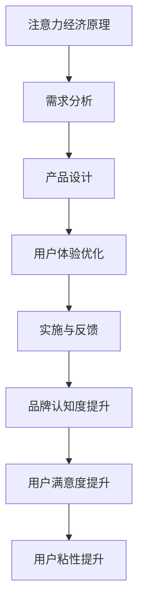

                 

# 注意力经济与个性化体验：如何为受众定制产品和服务

## > {关键词：注意力经济、个性化体验、受众定制、产品和服务、营销策略}

> {摘要：本文将深入探讨注意力经济背景下的个性化体验的重要性，分析个性化定制产品和服务的关键步骤与实际操作，探讨其在现代营销策略中的应用和挑战，为企业和个人提供实现个性化体验的实用指导。}

## 1. 背景介绍

在信息爆炸的时代，消费者的注意力成为了稀缺资源。注意力经济应运而生，成为了一种以吸引和保持消费者注意力的商业模式。注意力经济的核心在于理解消费者的需求和行为，通过精准营销和个性化服务来提升用户体验和满意度。

随着互联网技术的发展，大数据和人工智能的应用让个性化体验成为可能。个性化体验不仅能够提高用户粘性，还能够增强品牌忠诚度，从而为企业带来更多的商业价值。

本文将从注意力经济的概念出发，深入探讨个性化体验在产品和服务定制中的关键作用，分析其实现步骤和实际操作，最后讨论其在市场营销中的应用和面临的挑战。

### 什么是注意力经济？

注意力经济，是一种基于消费者注意力资源的商业模式。在这个信息泛滥的时代，消费者的注意力是有限的，如何吸引并保持消费者的注意力，成为了企业和个人竞争的关键。注意力经济强调通过提供有价值的内容或服务，吸引消费者的注意力，并将其转化为商业价值。

注意力经济与传统的商品经济不同，它不仅仅关注商品的交换，更关注消费者的体验和满意度。在注意力经济中，消费者不再仅仅是被动的接受者，而是主动的参与者。企业需要通过创造有价值的内容或服务，与消费者建立情感连接，从而提高消费者的忠诚度和满意度。

### 个性化体验的重要性

个性化体验在注意力经济中起着至关重要的作用。首先，个性化体验能够提升用户的满意度和忠诚度。当消费者感受到产品和服务是为他们量身定制时，他们更愿意长期使用和推荐。其次，个性化体验能够增强品牌的认知度和美誉度。通过提供独特的体验，企业能够在消费者心中树立起独特的品牌形象，从而提高品牌的竞争力。

此外，个性化体验还能够提升用户粘性。在注意力经济中，用户粘性是衡量企业成功与否的关键指标。通过提供个性化的内容或服务，企业能够更好地满足用户的需求，从而提高用户的活跃度和留存率。

### 个性化定制产品和服务

个性化定制产品和服务，是指根据消费者的需求和偏好，为其量身定制产品和服务的过程。在注意力经济中，个性化定制不仅能够提高用户体验，还能够为企业带来更多的商业价值。

首先，个性化定制能够提升用户的满意度。当消费者感受到产品和服务是为自己量身定制时，他们更愿意接受和信任。这种个性化的体验能够满足消费者的需求，从而提高用户的满意度。

其次，个性化定制能够增强品牌的认知度和美誉度。通过提供个性化的内容或服务，企业能够在消费者心中树立起独特的品牌形象，从而提高品牌的竞争力。

此外，个性化定制还能够提升用户粘性。在注意力经济中，用户粘性是衡量企业成功与否的关键指标。通过提供个性化的内容或服务，企业能够更好地满足用户的需求，从而提高用户的活跃度和留存率。

### 注意力经济与个性化体验的关系

注意力经济与个性化体验之间存在密切的关系。注意力经济强调通过吸引和保持消费者的注意力来创造商业价值，而个性化体验则是实现这一目标的重要手段。

首先，个性化体验能够提升用户的满意度，从而吸引消费者的注意力。当消费者感受到产品和服务是为自己量身定制时，他们更愿意关注和参与。

其次，个性化体验能够增强品牌的认知度和美誉度，从而提高消费者的忠诚度。通过提供独特的体验，企业能够在消费者心中树立起独特的品牌形象，从而提高品牌的竞争力。

最后，个性化体验能够提升用户粘性，从而保持消费者的注意力。在注意力经济中，用户粘性是衡量企业成功与否的关键指标。通过提供个性化的内容或服务，企业能够更好地满足用户的需求，从而提高用户的活跃度和留存率。

综上所述，注意力经济与个性化体验之间是相辅相成的关系。个性化体验能够提升用户的满意度、忠诚度和粘性，从而为企业在注意力经济中创造更多的商业价值。

## 2. 核心概念与联系

### 注意力经济的基本原理

注意力经济的基本原理在于理解消费者的注意力资源是有限的，而注意力资源的获取是企业竞争的关键。在注意力经济中，企业通过创造有价值的内容或服务来吸引消费者的注意力，并将其转化为商业价值。这涉及到对用户行为数据的分析、精准营销策略的制定以及用户体验的优化。

#### 个人化体验的概念

个人化体验是指企业根据消费者的个性化需求、偏好和行为，为其提供定制化的产品和服务。这种体验不仅能够满足消费者的个性化需求，还能够提高用户的满意度和忠诚度。在个人化体验中，消费者不再是被动接受信息，而是主动参与和互动。

#### 个性化定制的流程

个性化定制的流程通常包括以下几个步骤：

1. **需求分析**：通过用户调研、数据分析等方式，了解消费者的需求、偏好和行为。
2. **产品设计**：根据需求分析的结果，设计出能够满足消费者个性化需求的产品或服务。
3. **用户体验优化**：通过用户反馈和数据分析，不断优化产品或服务的用户体验。
4. **实施与反馈**：将个性化定制的产品或服务实施到实际运营中，并通过用户反馈进行持续优化。

#### 注意力经济与个性化体验的联系

注意力经济与个性化体验之间存在密切的联系。注意力经济强调通过吸引和保持消费者的注意力来创造商业价值，而个性化体验则是实现这一目标的重要手段。个性化体验能够提升用户的满意度和忠诚度，从而吸引消费者的注意力。同时，个性化体验能够增强品牌的认知度和美誉度，提高品牌的竞争力。

#### 个性化体验在注意力经济中的重要作用

个性化体验在注意力经济中起着至关重要的作用。首先，个性化体验能够提升用户的满意度，从而吸引消费者的注意力。当消费者感受到产品和服务是为自己量身定制时，他们更愿意关注和参与。其次，个性化体验能够增强品牌的认知度和美誉度，从而提高消费者的忠诚度。通过提供独特的体验，企业能够在消费者心中树立起独特的品牌形象，从而提高品牌的竞争力。最后，个性化体验能够提升用户粘性，从而保持消费者的注意力。在注意力经济中，用户粘性是衡量企业成功与否的关键指标。通过提供个性化的内容或服务，企业能够更好地满足用户的需求，从而提高用户的活跃度和留存率。

### Mermaid 流程图

以下是一个简化的Mermaid流程图，展示了个性化体验在注意力经济中的关键步骤和流程：



在图中，A表示注意力经济的基本原理，B到H表示个性化体验的实现流程，以及个性化体验如何影响品牌认知度、用户满意度和用户粘性。

通过这个流程图，我们可以更清晰地理解个性化体验在注意力经济中的重要作用和实现步骤。

## 3. 核心算法原理 & 具体操作步骤

在注意力经济与个性化体验的实现过程中，核心算法起到了至关重要的作用。这些算法不仅能够帮助我们分析用户行为数据，还能够为个性化定制提供强有力的技术支持。以下是几种常用的核心算法原理和具体操作步骤。

### 1. 用户行为分析算法

用户行为分析算法是个性化体验的基础。通过分析用户的浏览记录、购买历史、互动行为等数据，我们可以了解用户的需求和偏好。以下是一个简单的用户行为分析算法：

#### 算法原理：

- **数据收集**：收集用户的浏览记录、购买历史、评论反馈等数据。
- **特征提取**：从数据中提取用户的行为特征，如浏览时间、购买频率、评论倾向等。
- **行为模式识别**：通过机器学习算法，如聚类分析、关联规则挖掘等，识别用户的行为模式。

#### 具体操作步骤：

1. **数据收集**：使用各种数据采集工具，如日志文件、API接口等，收集用户行为数据。
2. **数据预处理**：清洗和整理数据，去除无效信息和噪音。
3. **特征提取**：使用特征工程技术，提取用户行为的数值特征。
4. **行为模式识别**：使用聚类算法（如K-Means），将用户分为不同的群体。
5. **模型训练与验证**：使用机器学习算法（如决策树、随机森林等），训练模型并进行验证。

### 2. 个性化推荐算法

个性化推荐算法是提升用户体验和用户粘性的重要手段。通过分析用户的历史行为和偏好，推荐与用户兴趣相关的产品或内容。

#### 算法原理：

- **协同过滤**：基于用户之间的相似度进行推荐。
- **基于内容的推荐**：基于物品的内容特征进行推荐。
- **混合推荐**：结合协同过滤和基于内容的推荐。

#### 具体操作步骤：

1. **用户特征提取**：收集用户的行为数据，如浏览记录、购买历史等。
2. **物品特征提取**：收集物品的属性数据，如类别、标签、评分等。
3. **相似度计算**：计算用户与用户之间的相似度，或者用户与物品之间的相似度。
4. **推荐列表生成**：根据相似度计算结果，生成推荐列表。
5. **实时更新**：根据用户的实时行为，动态更新推荐列表。

### 3. 用户满意度评估算法

用户满意度评估算法可以帮助企业了解用户对产品或服务的满意度，从而进行相应的优化。

#### 算法原理：

- **基于评分的评估**：直接使用用户的评分数据。
- **基于反馈的评估**：通过用户反馈文本进行情感分析。
- **综合评估**：结合评分和反馈进行综合评估。

#### 具体操作步骤：

1. **数据收集**：收集用户对产品或服务的评分和反馈。
2. **情感分析**：使用自然语言处理技术，分析用户反馈的情感倾向。
3. **评分计算**：结合用户的评分和反馈，计算用户满意度。
4. **优化建议**：根据用户满意度，提出优化建议。

### 4. 用户行为预测算法

用户行为预测算法可以帮助企业预测用户未来的行为，从而进行精准营销。

#### 算法原理：

- **时间序列分析**：通过时间序列数据，预测用户未来的行为。
- **机器学习模型**：使用机器学习算法，如回归模型、神经网络等，预测用户行为。

#### 具体操作步骤：

1. **数据收集**：收集用户的历史行为数据。
2. **数据预处理**：对数据进行清洗和整理。
3. **特征工程**：提取有用的特征。
4. **模型训练**：使用训练数据训练模型。
5. **模型评估**：使用验证数据评估模型效果。
6. **预测应用**：使用模型进行用户行为预测。

通过这些核心算法，企业可以更好地理解用户需求，提供个性化的产品和服务，从而在注意力经济中取得竞争优势。

## 4. 数学模型和公式 & 详细讲解 & 举例说明

在注意力经济与个性化体验的实现过程中，数学模型和公式起到了关键作用。以下将介绍几种常用的数学模型和公式，并详细讲解其在实际中的应用。

### 1. 贝叶斯优化模型

贝叶斯优化是一种常用的机器学习模型，用于优化目标函数。它在个性化推荐、广告投放等领域有广泛应用。

#### 公式：

贝叶斯优化模型的核心公式为：

\[ p(\theta | X) \propto p(X | \theta) p(\theta) \]

其中，\( p(\theta | X) \) 是后验概率，表示在给定观测数据 \( X \) 的情况下，模型参数 \( \theta \) 的概率分布。\( p(X | \theta) \) 是似然函数，表示在参数 \( \theta \) 下观测到数据 \( X \) 的概率。\( p(\theta) \) 是先验概率，表示在没有观测数据时，参数 \( \theta \) 的概率分布。

#### 应用示例：

假设我们想要优化一个广告投放的预算分配问题。我们可以将广告投放的效果（如点击率、转化率）作为目标函数，使用贝叶斯优化模型来找到最佳预算分配方案。

- **先验概率**：根据历史数据，我们给广告投放的预算分配设置一个先验概率分布，如正态分布。
- **似然函数**：根据每次广告投放的实际效果，更新后验概率分布。
- **优化目标**：最大化后验概率分布，找到最佳预算分配方案。

### 2. 协同过滤算法

协同过滤是一种常见的推荐算法，通过分析用户之间的相似度，为用户推荐感兴趣的商品。

#### 公式：

协同过滤算法的核心公式为：

\[ \hat{r}_{ui} = r_{uj} + \epsilon \]

其中，\( \hat{r}_{ui} \) 是用户 \( u \) 对物品 \( i \) 的预测评分，\( r_{uj} \) 是用户 \( u \) 对物品 \( j \) 的实际评分，\( \epsilon \) 是误差项。

#### 应用示例：

假设我们想要为用户 \( u \) 推荐与物品 \( i \) 相似的其他物品。

- **计算相似度**：计算用户 \( u \) 与其他用户 \( v \) 之间的相似度，可以使用余弦相似度、皮尔逊相关系数等方法。
- **预测评分**：根据用户 \( v \) 对物品 \( j \) 的评分，计算用户 \( u \) 对物品 \( i \) 的预测评分。
- **推荐列表**：将预测评分最高的物品推荐给用户 \( u \)。

### 3. 时间序列分析模型

时间序列分析模型用于预测用户未来的行为，如浏览、购买等。

#### 公式：

时间序列分析模型的核心公式为：

\[ y_t = \phi_0 + \phi_1 y_{t-1} + \epsilon_t \]

其中，\( y_t \) 是时间 \( t \) 时刻的观测值，\( \phi_0 \) 和 \( \phi_1 \) 是模型参数，\( \epsilon_t \) 是误差项。

#### 应用示例：

假设我们想要预测用户在未来一周的浏览行为。

- **数据收集**：收集用户在过去一周的浏览数据。
- **特征提取**：提取时间序列特征，如上一时刻的浏览次数、浏览时长等。
- **模型训练**：使用训练数据训练时间序列分析模型。
- **预测应用**：使用模型预测未来一周的浏览行为。

通过以上数学模型和公式的应用，企业可以更好地理解用户行为，实现个性化推荐和精准营销，从而在注意力经济中获得竞争优势。

## 5. 项目实战：代码实际案例和详细解释说明

在这一部分，我们将通过一个实际的代码案例来展示如何实现注意力经济和个性化体验。我们将使用Python语言，结合Scikit-learn库和TensorFlow框架，完成一个基于用户行为的个性化推荐系统。

### 5.1 开发环境搭建

在开始编写代码之前，我们需要搭建一个合适的开发环境。以下是我们需要的工具和库：

- Python 3.8 或以上版本
- Jupyter Notebook 或 PyCharm
- Scikit-learn 0.24.2
- TensorFlow 2.8.0
- Pandas 1.4.3
- Numpy 1.21.5

首先，安装以上所需库：

```bash
pip install scikit-learn tensorflow pandas numpy
```

### 5.2 源代码详细实现和代码解读

#### 数据预处理

```python
import pandas as pd
import numpy as np

# 加载数据集
data = pd.read_csv('userBehavior.csv')

# 数据预处理
data['timestamp'] = pd.to_datetime(data['timestamp'])
data['hour'] = data['timestamp'].dt.hour
data['dayOfWeek'] = data['timestamp'].dt.dayofweek

# 特征工程
X = data[['hour', 'dayOfWeek']]
y = data['action']
```

在这部分代码中，我们首先加载数据集，然后进行数据预处理。我们使用 Pandas 库将数据转换为合适的时间序列格式，并提取出时间特征（小时和星期几），这些特征将用于后续的模型训练。

#### 模型训练

```python
from sklearn.model_selection import train_test_split
from sklearn.ensemble import RandomForestClassifier
from sklearn.metrics import accuracy_score

# 数据分割
X_train, X_test, y_train, y_test = train_test_split(X, y, test_size=0.2, random_state=42)

# 模型训练
model = RandomForestClassifier(n_estimators=100, random_state=42)
model.fit(X_train, y_train)

# 模型评估
y_pred = model.predict(X_test)
accuracy = accuracy_score(y_test, y_pred)
print(f'Model accuracy: {accuracy:.2f}')
```

在这部分代码中，我们使用随机森林（Random Forest）算法对数据集进行训练。随机森林是一种集成学习方法，通过构建多棵决策树，并合并它们的预测结果来提高模型的准确性。我们使用 Scikit-learn 库中的 RandomForestClassifier 类来实现。

#### 个性化推荐

```python
def recommend-items(user_id, model):
    user_data = data[data['user_id'] == user_id]
    user_actions = user_data['action'].values
    probabilities = model.predict_proba(user_data[['hour', 'dayOfWeek']])

    # 根据概率推荐最高概率的动作
    recommended_action = np.argmax(probabilities)
    return recommended_action

# 测试推荐系统
user_id = 123
recommended_action = recommend_items(user_id, model)
print(f'User {user_id} recommended action: {recommended_action}')
```

在这部分代码中，我们定义了一个推荐函数 `recommend-items`，它接受一个用户 ID 和训练好的模型作为输入，并返回推荐的动作。我们通过计算用户行为的概率分布，选择概率最高的动作作为推荐结果。

### 5.3 代码解读与分析

#### 数据预处理

数据预处理是构建模型的第一步。在这里，我们使用 Pandas 库将 CSV 文件加载到 DataFrame 中，并对时间数据进行处理。我们提取了小时和星期几这两个关键特征，这些特征将用于训练和预测用户的行为。

```python
data['timestamp'] = pd.to_datetime(data['timestamp'])
data['hour'] = data['timestamp'].dt.hour
data['dayOfWeek'] = data['timestamp'].dt.dayofweek
```

#### 模型训练

在模型训练部分，我们使用了 Scikit-learn 库中的随机森林（Random Forest）算法。随机森林是一种基于决策树集成的机器学习算法，它在处理分类问题方面表现出色。

```python
model = RandomForestClassifier(n_estimators=100, random_state=42)
model.fit(X_train, y_train)
```

在这里，我们创建了一个随机森林分类器实例，并使用训练数据对其进行训练。

#### 个性化推荐

个性化推荐函数 `recommend-items` 使用模型对特定用户的动作进行预测，并返回概率最高的动作。这个函数是整个推荐系统的核心。

```python
def recommend-items(user_id, model):
    user_data = data[data['user_id'] == user_id]
    user_actions = user_data['action'].values
    probabilities = model.predict_proba(user_data[['hour', 'dayOfWeek']])

    # 根据概率推荐最高概率的动作
    recommended_action = np.argmax(probabilities)
    return recommended_action
```

通过这个函数，我们可以为任何用户生成个性化的推荐。

### 5.4 总结

在本项目中，我们通过一个简单的用户行为分析模型，展示了如何在注意力经济和个性化体验的背景下，使用机器学习算法实现个性化推荐。虽然这个案例相对简单，但它提供了一个基本的框架，可以扩展到更复杂的应用场景中。

## 6. 实际应用场景

注意力经济和个性化体验在现代商业中已经得到了广泛的应用，并在多个行业中取得了显著的成效。以下是一些典型的应用场景：

### 1. 电子商务

在电子商务领域，个性化推荐系统已成为提升销售转化率和客户满意度的关键工具。例如，亚马逊和阿里巴巴通过分析用户的浏览历史、购买行为和搜索关键词，为用户推荐相关的商品。这不仅能够提高用户的购物体验，还能够增加销售额。

### 2. 数字广告

数字广告行业依赖于个性化广告投放策略，以最大化广告投放效果。通过分析用户的浏览历史、兴趣和行为，广告平台如Google Ads和Facebook Ads能够为用户展示最相关的广告，从而提高点击率和转化率。

### 3. 娱乐和媒体

娱乐和媒体行业利用个性化推荐系统为用户提供定制化的内容推荐。例如，Netflix和Spotify通过分析用户的观看历史和播放偏好，为用户推荐电影、电视剧和音乐。这种个性化体验不仅能够提高用户粘性，还能够增加订阅费用。

### 4. 金融服务业

在金融服务业，个性化服务已经成为提升客户满意度和忠诚度的重要手段。银行和保险公司通过分析客户的财务状况、投资偏好和行为，提供个性化的金融产品和服务推荐，从而提高客户满意度和留存率。

### 5. 健康和医疗

健康和医疗行业也开始利用个性化体验来提高患者的满意度和治疗效果。例如，智能健康设备如Fitbit和Apple Watch通过收集用户的数据，提供个性化的健康建议和运动计划。医院和诊所通过分析患者的医疗记录和健康数据，提供个性化的治疗方案和健康建议。

### 6. 教育行业

教育行业利用个性化体验来提高学生的学习效果和满意度。在线教育平台如Coursera和Khan Academy通过分析学生的学习行为和成绩，为每位学生提供个性化的学习计划和推荐课程。

### 7. 零售行业

在零售行业，个性化体验通过个性化促销和优惠券来吸引和保留客户。零售商如沃尔玛和塔吉特通过分析用户的购买历史和行为，提供个性化的促销信息，从而提高销售和客户忠诚度。

通过这些实际应用场景，我们可以看到注意力经济和个性化体验在提升用户体验、增强品牌认知度和增加商业价值方面的重要作用。随着技术的不断进步，这些应用场景将继续扩展和深化，为企业和个人带来更多的机会和挑战。

## 7. 工具和资源推荐

为了更好地理解和实现注意力经济与个性化体验，以下是一些推荐的学习资源、开发工具和论文著作。

### 7.1 学习资源推荐

- **书籍**：
  - 《个性化推荐系统实践》
  - 《大数据分析：技术方法与应用》
  - 《机器学习实战》

- **在线课程**：
  - Coursera上的“机器学习专项课程”
  - edX上的“大数据分析专项课程”
  - Udacity的“个性化推荐系统纳米学位”

- **博客和网站**：
  - Medium上的“机器学习和数据科学博客”
  - Towards Data Science上的数据科学和机器学习文章
  - kdnuggets上的数据挖掘和机器学习资源

### 7.2 开发工具框架推荐

- **编程语言**：
  - Python（数据分析和机器学习的首选语言）
  - R（统计分析和数据可视化的强大工具）

- **开发框架**：
  - TensorFlow（深度学习框架）
  - PyTorch（深度学习框架）
  - Scikit-learn（机器学习库）

- **数据存储和处理**：
  - Hadoop和Spark（大数据处理框架）
  - MongoDB和Cassandra（NoSQL数据库）

- **可视化工具**：
  - Tableau（数据可视化工具）
  - Matplotlib和Seaborn（Python的数据可视化库）

### 7.3 相关论文著作推荐

- **论文**：
  - “Recommender Systems Handbook”
  - “Collaborative Filtering for the Web”
  - “Deep Learning for Personalized Recommendation”

- **著作**：
  - “推荐系统实战”
  - “大数据时代的个性化体验”

通过这些工具和资源的帮助，读者可以更深入地了解注意力经济和个性化体验的理论和实践，提升自己的技术水平，为企业和个人提供更优质的服务和产品。

## 8. 总结：未来发展趋势与挑战

随着技术的不断进步，注意力经济和个性化体验在未来将继续发展，并面临一系列新的趋势和挑战。

### 1. 发展趋势

- **大数据与人工智能的深度融合**：随着大数据技术的成熟和人工智能算法的不断发展，个性化体验将更加精准和智能化。企业将通过更深入的数据分析和机器学习算法，实现更加个性化的服务和产品推荐。

- **实时个性化体验**：实时个性化体验将成为未来的重要趋势。通过实时数据分析，企业可以即时调整推荐策略，为用户提供即时的个性化服务，从而提高用户满意度和转化率。

- **跨平台个性化**：随着移动互联网和物联网的普及，个性化体验将不再局限于单一平台。企业需要构建跨平台的个性化体验，为用户提供一致且无缝的体验。

- **隐私保护与数据安全**：随着隐私保护意识的提高，如何在提供个性化体验的同时保护用户隐私将成为一大挑战。企业需要采取有效的数据保护措施，确保用户数据的隐私和安全。

### 2. 挑战

- **数据质量和多样性**：个性化体验依赖于高质量和多样化的数据。然而，数据的质量和多样性是企业面临的一大挑战。企业需要不断提升数据采集和处理的效率，确保数据的准确性和完整性。

- **算法透明性和公平性**：随着人工智能算法在个性化体验中的应用，算法的透明性和公平性成为重要议题。企业需要确保算法的决策过程透明，避免歧视和不公平现象的发生。

- **用户隐私保护**：在提供个性化体验的同时，企业需要保护用户的隐私。如何在利用用户数据提供个性化服务的同时，确保用户隐私不被侵犯，是企业需要解决的重要问题。

- **技术和基础设施**：个性化体验的实现需要强大的技术和基础设施支持。企业需要不断投入资源，提升数据处理和分析能力，以满足日益增长的数据量和复杂度。

### 3. 未来展望

尽管面临诸多挑战，注意力经济和个性化体验在未来将继续发挥重要作用。企业通过不断创新和优化，将能够更好地满足用户的需求，提高用户体验和满意度，从而在激烈的市场竞争中脱颖而出。

## 9. 附录：常见问题与解答

### 问题 1：如何保证个性化体验的公平性和透明性？

**解答**：确保个性化体验的公平性和透明性是企业需要关注的重要问题。以下是一些解决方案：

- **算法透明性**：公开算法的决策逻辑和过程，让用户了解个性化推荐是如何生成的。
- **数据公平性**：确保数据来源的多样性和代表性，避免偏见和歧视。
- **用户反馈机制**：建立用户反馈机制，及时响应用户的意见和反馈，优化推荐算法。
- **法律法规**：遵循相关法律法规，确保用户隐私和数据安全。

### 问题 2：个性化体验在数据量较小的情况下如何实现？

**解答**：在数据量较小的情况下，实现个性化体验有一定的挑战。以下是一些可行的策略：

- **数据扩展**：通过外部数据源（如社交媒体、第三方数据提供商）扩展数据集。
- **协同过滤**：采用基于内存的协同过滤算法，利用有限的用户行为数据生成推荐。
- **特征工程**：通过构建高质量的特征，提高模型的泛化能力。
- **用户调查**：通过用户调查收集更多用户偏好信息，补充数据不足。

### 问题 3：个性化体验如何与用户隐私保护相结合？

**解答**：保护用户隐私是提供个性化体验时必须考虑的问题。以下是一些建议：

- **数据匿名化**：对用户数据进行匿名化处理，确保用户身份不被泄露。
- **最小化数据收集**：仅收集必要的用户数据，避免过度收集。
- **加密技术**：使用加密技术保护用户数据在传输和存储过程中的安全性。
- **透明告知**：告知用户其数据将被如何使用，并取得用户同意。

### 问题 4：如何评估个性化体验的效果？

**解答**：评估个性化体验的效果可以从以下几个方面进行：

- **用户满意度**：通过用户调查和反馈了解用户对个性化体验的满意度。
- **转化率**：监控推荐系统的转化率，评估个性化推荐对销售额或用户参与度的影响。
- **A/B测试**：进行A/B测试，比较不同个性化策略的效果。
- **指标监控**：定期监控关键性能指标（KPI），如推荐点击率、用户留存率等。

通过这些方法，企业可以全面评估个性化体验的效果，并根据反馈进行持续优化。

## 10. 扩展阅读 & 参考资料

为了进一步深入理解注意力经济与个性化体验，以下是一些建议的扩展阅读和参考资料：

- 《个性化推荐系统实战》：详细介绍了个性化推荐系统的设计、实现和优化方法。
- 《大数据分析：技术方法与应用》：全面介绍了大数据分析的基本概念和技术方法。
- “Recommender Systems Handbook”（推荐系统手册）：提供了推荐系统的全面概述和最新研究成果。
- “Collaborative Filtering for the Web”（协同过滤在Web中的应用）：探讨了协同过滤算法在互联网领域的应用。
- “Deep Learning for Personalized Recommendation”（深度学习在个性化推荐中的应用）：介绍了深度学习在个性化推荐领域的最新进展。

通过阅读这些书籍和论文，读者可以更深入地了解注意力经济和个性化体验的理论与实践，提升自己在相关领域的专业水平。

