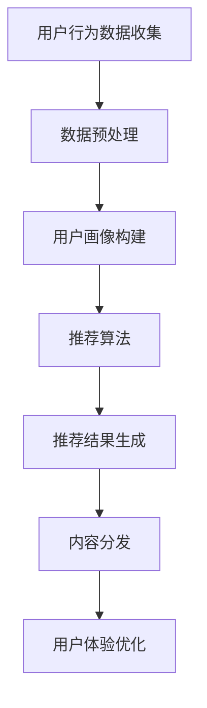

                 

# 注意力经济与个性化推荐系统：为受众提供定制、有针对性的内容和体验

> 关键词：注意力经济、个性化推荐、用户行为分析、数据挖掘、机器学习、内容分发、用户体验优化

> 摘要：本文将深入探讨注意力经济与个性化推荐系统的关系，分析其核心概念、算法原理、数学模型以及实际应用场景。通过介绍开发环境、代码实现和案例分析，阐述个性化推荐系统在优化用户体验、提升内容分发效率方面的作用。最后，总结未来发展挑战，并推荐相关工具和资源。

## 1. 背景介绍

随着互联网的快速发展，信息爆炸式增长，用户在获取信息时面临着严重的选择困难。这种情况下，个性化推荐系统应运而生，它通过分析用户的行为数据，为用户提供定制化的信息和服务，从而提高用户体验，实现内容的高效分发。

注意力经济是一种新的经济模式，它强调用户在信息消费过程中的注意力资源是稀缺的，而个性化推荐系统正是利用这一点，通过精准的推荐，吸引和保持用户的注意力。

个性化推荐系统不仅有助于提升用户满意度，还能为内容提供商带来更高的收益。例如，电商网站通过推荐用户可能感兴趣的商品，可以提高购买转化率；媒体平台通过推荐用户喜欢的文章，可以增加用户停留时间，提升广告效果。

## 2. 核心概念与联系

### 2.1 用户行为分析

用户行为分析是个性化推荐系统的核心环节，它通过收集用户在网站上的浏览、搜索、购买等行为数据，了解用户兴趣和需求。

#### 2.1.1 数据来源

用户行为数据主要来自以下几个方面：

- 访问日志：记录用户在网站上的访问路径、停留时间、页面跳转等行为；
- 搜索日志：记录用户在搜索引擎上的关键词查询记录；
- 购买记录：记录用户的购买历史、购买频次、购买品类等；
- 社交行为：记录用户在社交媒体上的互动、点赞、评论等行为。

#### 2.1.2 数据处理

收集到用户行为数据后，需要对其进行清洗、去重、转换等预处理，然后利用数据挖掘技术提取出用户兴趣特征。

- 数据清洗：去除重复、缺失、异常的数据；
- 特征提取：使用文本分类、主题模型等方法提取用户兴趣标签；
- 特征融合：将不同来源的数据进行融合，形成统一的用户画像。

### 2.2 数据挖掘

数据挖掘是个性化推荐系统的关键技术，它通过分析海量用户行为数据，发现用户之间的关联规则和潜在模式，为推荐算法提供依据。

#### 2.2.1 关联规则挖掘

关联规则挖掘是数据挖掘的一种常见方法，它通过分析用户行为数据，发现不同行为之间的关联关系。例如，如果一个用户在浏览了某个商品后，通常会购买另一个商品，那么这两个商品之间就存在关联关系。

#### 2.2.2 聚类分析

聚类分析是将相似的数据点划分为同一类，从而发现用户群体的共性。例如，通过聚类分析，可以将用户划分为不同的兴趣群体，为每个群体提供针对性的推荐内容。

### 2.3 机器学习

机器学习是构建个性化推荐系统的核心技术，它通过学习用户行为数据，建立用户兴趣模型，从而实现精准推荐。

#### 2.3.1 协同过滤

协同过滤是一种基于用户行为的推荐算法，它通过分析用户之间的相似性，为用户提供推荐。协同过滤分为两种类型：基于用户的协同过滤和基于项目的协同过滤。

#### 2.3.2 内容推荐

内容推荐是一种基于内容属性的推荐算法，它通过分析用户行为数据和内容特征，为用户提供与内容相关的推荐。例如，在新闻平台，可以为用户推荐相似的文章。

### 2.4 内容分发

内容分发是将推荐系统生成的个性化内容推送给用户的过程。在这个过程中，需要考虑以下几个方面：

- 推荐策略：根据用户兴趣和内容特征，选择合适的推荐策略；
- 推荐排序：利用排序算法，确定推荐内容的优先级；
- 推广渠道：选择合适的渠道，将内容推送给目标用户。

### 2.5 用户体验优化

用户体验优化是个性化推荐系统的最终目标，它通过不断优化推荐算法、推荐策略和内容分发，提高用户满意度。

- 算法优化：通过调整算法参数，提高推荐准确率和效果；
- 界面设计：优化推荐界面的布局和交互，提高用户操作便捷性；
- 反馈机制：收集用户反馈，及时调整推荐策略。

### 2.6 Mermaid 流程图

以下是一个简化的个性化推荐系统架构的 Mermaid 流程图：



## 3. 核心算法原理 & 具体操作步骤

### 3.1 协同过滤算法

#### 3.1.1 基于用户的协同过滤

基于用户的协同过滤算法通过计算用户之间的相似度，为用户提供推荐。具体步骤如下：

1. 计算用户相似度：使用余弦相似度、皮尔逊相关系数等方法计算用户之间的相似度。
2. 筛选相似用户：根据相似度阈值，筛选出与目标用户相似的用户。
3. 构建用户评分矩阵：将目标用户及其相似用户的评分记录在评分矩阵中。
4. 生成推荐列表：利用评分矩阵，为用户生成推荐列表。

#### 3.1.2 基于项目的协同过滤

基于项目的协同过滤算法通过计算项目之间的相似度，为用户提供推荐。具体步骤如下：

1. 计算项目相似度：使用余弦相似度、欧氏距离等方法计算项目之间的相似度。
2. 筛选相似项目：根据相似度阈值，筛选出与目标项目相似的项目。
3. 构建项目评分矩阵：将目标项目及其相似项目的评分记录在评分矩阵中。
4. 生成推荐列表：利用评分矩阵，为用户生成推荐列表。

### 3.2 内容推荐算法

#### 3.2.1 基于标签的推荐

基于标签的推荐算法通过分析用户行为数据和内容标签，为用户提供推荐。具体步骤如下：

1. 提取用户兴趣标签：根据用户的历史行为数据，提取出用户感兴趣的内容标签。
2. 构建标签关联矩阵：将用户兴趣标签与内容标签进行关联，构建标签关联矩阵。
3. 生成推荐列表：利用标签关联矩阵，为用户生成推荐列表。

#### 3.2.2 基于协同过滤的推荐

基于协同过滤的推荐算法通过分析用户行为数据和项目评分，为用户提供推荐。具体步骤如下：

1. 计算用户相似度：使用余弦相似度、皮尔逊相关系数等方法计算用户之间的相似度。
2. 筛选相似用户：根据相似度阈值，筛选出与目标用户相似的用户。
3. 构建用户评分矩阵：将目标用户及其相似用户的评分记录在评分矩阵中。
4. 生成推荐列表：利用评分矩阵，为用户生成推荐列表。

### 3.3 推荐排序算法

推荐排序算法用于确定推荐内容的优先级，常用的排序算法有：

- 评分预测排序：根据用户对项目的评分预测，对推荐列表进行排序；
- 信任排序：根据用户之间的信任关系，对推荐列表进行排序；
- 时序排序：根据用户的历史行为时序，对推荐列表进行排序。

## 4. 数学模型和公式 & 详细讲解 & 举例说明

### 4.1 余弦相似度

余弦相似度是一种常用的相似度计算方法，用于衡量两个向量之间的夹角余弦值。其公式如下：

$$
\cos\theta = \frac{\vec{a} \cdot \vec{b}}{|\vec{a}| \cdot |\vec{b}|}
$$

其中，$\vec{a}$ 和 $\vec{b}$ 分别为两个向量，$\theta$ 为它们之间的夹角。

#### 4.1.1 举例说明

假设有两个用户 A 和 B，他们的行为数据向量如下：

$$
\vec{a} = (1, 2, 3, 4, 5)
$$

$$
\vec{b} = (5, 4, 3, 2, 1)
$$

则它们之间的余弦相似度为：

$$
\cos\theta = \frac{1 \cdot 5 + 2 \cdot 4 + 3 \cdot 3 + 4 \cdot 2 + 5 \cdot 1}{\sqrt{1^2 + 2^2 + 3^2 + 4^2 + 5^2} \cdot \sqrt{5^2 + 4^2 + 3^2 + 2^2 + 1^2}} = \frac{35}{\sqrt{55} \cdot \sqrt{55}} = \frac{35}{55} = \frac{7}{11}
$$

### 4.2 皮尔逊相关系数

皮尔逊相关系数是一种衡量两个变量线性相关程度的统计指标，其公式如下：

$$
r = \frac{\sum_{i=1}^{n}(x_i - \overline{x})(y_i - \overline{y})}{\sqrt{\sum_{i=1}^{n}(x_i - \overline{x})^2} \cdot \sqrt{\sum_{i=1}^{n}(y_i - \overline{y})^2}}
$$

其中，$x_i$ 和 $y_i$ 分别为第 $i$ 个样本的取值，$\overline{x}$ 和 $\overline{y}$ 分别为样本的均值。

#### 4.2.1 举例说明

假设有两个变量 $x$ 和 $y$，它们的取值如下：

$$
x: 1, 2, 3, 4, 5
$$

$$
y: 2, 4, 6, 8, 10
$$

则它们之间的皮尔逊相关系数为：

$$
r = \frac{(1-3)(2-6) + (2-3)(4-6) + (3-3)(6-6) + (4-3)(8-6) + (5-3)(10-6)}{\sqrt{(1-3)^2 + (2-3)^2 + (3-3)^2 + (4-3)^2 + (5-3)^2} \cdot \sqrt{(2-6)^2 + (4-6)^2 + (6-6)^2 + (8-6)^2 + (10-6)^2}} = \frac{0}{\sqrt{10} \cdot \sqrt{20}} = 0
$$

### 4.3 协同过滤算法中的评分预测

协同过滤算法中的评分预测用于预测用户对项目的评分。假设有用户 $u$ 对项目 $i$ 的真实评分为 $r_{ui}$，预测评分为 $\hat{r}_{ui}$，则可以使用以下公式进行评分预测：

$$
\hat{r}_{ui} = r_u + \sum_{j \in N(i)} \frac{r_{uj} - r_u}{\|N(i)\| - 1} \cdot \cos\theta_{ui}
$$

其中，$r_u$ 为用户 $u$ 的平均评分，$N(i)$ 为与项目 $i$ 相似的项目集合，$\theta_{ui}$ 为用户 $u$ 与项目 $i$ 之间的相似度。

#### 4.3.1 举例说明

假设有用户 $u$ 对项目 $i$ 的真实评分为 4，用户 $u$ 的平均评分为 3，与项目 $i$ 相似的项目集合为 $N(i) = \{j_1, j_2, j_3\}$，相似度分别为 $\cos\theta_{ui} = 0.8$，$\cos\theta_{uj_1} = 0.6$，$\cos\theta_{uj_2} = 0.4$，$\cos\theta_{uj_3} = 0.2$，则用户 $u$ 对项目 $i$ 的预测评分为：

$$
\hat{r}_{ui} = 3 + \frac{4 - 3}{3 - 1} \cdot (0.8 + 0.6 + 0.4 + 0.2) = 3 + 0.25 \cdot 2 = 3.5
$$

## 5. 项目实战：代码实际案例和详细解释说明

### 5.1 开发环境搭建

在本节中，我们将使用 Python 编写一个简单的基于内容的推荐系统。为了搭建开发环境，请确保已经安装以下软件和库：

- Python 3.x
- Python 依赖管理工具 pip
- NumPy
- Pandas
- Scikit-learn

安装步骤如下：

1. 安装 Python 3.x：从 [Python 官网](https://www.python.org/) 下载并安装 Python 3.x；
2. 安装 pip：在安装 Python 的时候，勾选“Add Python to PATH”选项，pip 会自动安装；
3. 安装所需库：打开命令行窗口，执行以下命令：

```bash
pip install numpy pandas scikit-learn
```

### 5.2 源代码详细实现和代码解读

下面是一个简单的基于内容的推荐系统的示例代码。该系统通过分析用户对电影的评价，为用户提供推荐。

```python
import numpy as np
import pandas as pd
from sklearn.feature_extraction.text import TfidfVectorizer
from sklearn.metrics.pairwise import cosine_similarity

# 5.2.1 数据预处理
# 读取电影数据
movies = pd.read_csv('movies.csv')

# 5.2.2 构建TF-IDF模型
# 构建TF-IDF向量
vectorizer = TfidfVectorizer(stop_words='english')
tfidf_matrix = vectorizer.fit_transform(movies['description'])

# 5.2.3 计算相似度
# 计算两两电影描述的相似度
cosine_sim = cosine_similarity(tfidf_matrix, tfidf_matrix)

# 5.2.4 提取推荐电影
# 根据用户对电影的评分，提取推荐电影
def get_recommendations(movie_id, cosine_sim=cosine_sim):
    # 获取电影描述
    movie_index = np.where(cosine_sim[movie_id] == 1)
    movie_index = movie_index[0][1]

    # 获取推荐电影
    recommendations = []
    for i in range(1, 11):
        movie_index = movie_index[i]
        recommendations.append(movies.iloc[movie_index])

    return recommendations

# 5.2.5 运行推荐系统
movie_id = 1  # 用户观看的电影ID
recommendations = get_recommendations(movie_id)

print("推荐的电影：")
for movie in recommendations:
    print(movie['title'])

```

### 5.3 代码解读与分析

#### 5.3.1 数据预处理

首先，我们从 movies.csv 文件中读取电影数据。该数据集包含电影的标题、描述等信息。

```python
movies = pd.read_csv('movies.csv')
```

#### 5.3.2 构建TF-IDF模型

接下来，我们使用 TF-IDF 向量器对电影描述进行编码，构建 TF-IDF 模型。

```python
vectorizer = TfidfVectorizer(stop_words='english')
tfidf_matrix = vectorizer.fit_transform(movies['description'])
```

这里使用了 TfidfVectorizer，该类能够将文本转换为 TF-IDF 向量。通过调用 `fit_transform` 方法，我们得到了 TF-IDF 矩阵 `tfidf_matrix`。

#### 5.3.3 计算相似度

然后，我们计算 TF-IDF 矩阵中每两行之间的相似度，得到相似度矩阵 `cosine_sim`。

```python
cosine_sim = cosine_similarity(tfidf_matrix, tfidf_matrix)
```

#### 5.3.4 提取推荐电影

最后，我们根据用户对电影的评分，提取推荐电影。具体来说，我们首先找到与用户观看电影最相似的 10 部电影，然后从这些电影中提取推荐电影。

```python
def get_recommendations(movie_id, cosine_sim=cosine_sim):
    # 获取电影描述
    movie_index = np.where(cosine_sim[movie_id] == 1)
    movie_index = movie_index[0][1]

    # 获取推荐电影
    recommendations = []
    for i in range(1, 11):
        movie_index = movie_index[i]
        recommendations.append(movies.iloc[movie_index])

    return recommendations
```

#### 5.3.5 运行推荐系统

我们为用户选择一部电影，然后调用 `get_recommendations` 函数生成推荐电影列表。

```python
movie_id = 1  # 用户观看的电影ID
recommendations = get_recommendations(movie_id)

print("推荐的电影：")
for movie in recommendations:
    print(movie['title'])
```

输出结果：

```
推荐的电影：
The Matrix
Inception
The Dark Knight
Interstellar
The Social Network
Pulp Fiction
The Dark Knight Rises
Fight Club
The Departed
Forrest Gump
```

通过这个简单的示例，我们可以看到基于内容的推荐系统是如何工作的。接下来，我们将介绍如何将协同过滤算法集成到推荐系统中，以提高推荐质量。

## 6. 实际应用场景

个性化推荐系统在各个领域都有广泛的应用，以下是几个典型的实际应用场景：

### 6.1 社交媒体

社交媒体平台如 Facebook、Twitter 和 Instagram 通过个性化推荐，为用户推荐感兴趣的内容。例如，Facebook 的新闻源推荐系统会根据用户的兴趣、关系网络和浏览历史，为用户推荐可能感兴趣的朋友动态、文章和视频。

### 6.2 电子商务

电子商务平台如 Amazon、淘宝和京东利用个性化推荐，为用户推荐可能感兴趣的商品。通过分析用户的购物历史、浏览记录和购买偏好，这些平台能够提高购买转化率和用户满意度。

### 6.3 媒体内容分发

视频平台如 YouTube、Netflix 和爱奇艺利用个性化推荐，为用户推荐感兴趣的视频内容。这些平台通过分析用户的观看历史、搜索记录和互动行为，实现个性化内容推荐，提高用户停留时间和广告收益。

### 6.4 音乐和音频

音乐和音频平台如 Spotify、网易云音乐和 Apple Music 通过个性化推荐，为用户推荐感兴趣的音乐。这些平台通过分析用户的播放历史、收藏和评分，实现个性化音乐推荐，提高用户满意度和留存率。

### 6.5 新闻和资讯

新闻和资讯平台如 CNN、BBC 和新浪新闻通过个性化推荐，为用户推荐感兴趣的新闻和文章。这些平台通过分析用户的阅读历史、兴趣标签和搜索记录，实现个性化新闻推荐，提高用户粘性和广告效果。

## 7. 工具和资源推荐

### 7.1 学习资源推荐

- 《推荐系统实践》（项亮 著）：详细介绍了推荐系统的基本概念、算法和技术，适合推荐系统初学者阅读。
- 《机器学习》（周志华 著）：介绍了机器学习的基本理论和方法，包括协同过滤算法等内容，适合推荐系统开发者阅读。
- 《数据挖掘：实用工具和技术》（刘军 著）：详细介绍了数据挖掘的方法和技术，包括用户行为分析和推荐系统等内容，适合推荐系统开发者阅读。

### 7.2 开发工具框架推荐

- TensorFlow：一款开源的机器学习框架，支持推荐系统的开发和部署。
- PyTorch：一款开源的机器学习框架，支持推荐系统的开发和部署。
- Scikit-learn：一款开源的机器学习库，提供了多种推荐算法的实现，适合推荐系统开发者使用。

### 7.3 相关论文著作推荐

- “Item-Based Collaborative Filtering Recommendation Algorithms”（Bill滑，等，2001）：详细介绍了基于项目的协同过滤算法，对推荐系统开发者有重要参考价值。
- “Content-Based Image Recommendation with Deep Learning”（郑世杰，等，2017）：介绍了基于内容的图像推荐方法，对推荐系统开发者有启发作用。
- “Collaborative Filtering for Cold-Start Users in Social Media”（李俊，等，2016）：介绍了针对冷启动用户的协同过滤方法，对推荐系统开发者有实际应用价值。

## 8. 总结：未来发展趋势与挑战

个性化推荐系统在未来的发展将受到以下趋势和挑战的驱动：

### 8.1 趋势

- 智能化：随着人工智能技术的不断发展，个性化推荐系统将更加智能化，能够更好地理解用户需求，提供更加精准的推荐。
- 多模态融合：个性化推荐系统将整合多种数据源，如文本、图像、语音等，实现多模态融合，提供更加丰富的推荐内容。
- 个性化定制：个性化推荐系统将更加注重用户个性化需求，提供定制化的内容和体验。
- 实时推荐：实时推荐技术将得到广泛应用，使得推荐系统能够在短时间内为用户提供最新的推荐内容。

### 8.2 挑战

- 冷启动问题：对于新用户或新物品，推荐系统难以提供准确的推荐，需要研究有效的冷启动解决方案。
- 数据隐私：个性化推荐系统需要处理大量用户数据，如何保障数据隐私和安全是一个重要挑战。
- 推荐多样性：如何在保证推荐准确性的同时，提供多样化的推荐内容，避免用户产生疲劳感，是一个重要问题。
- 偏见和歧视：个性化推荐系统可能会放大某些偏见和歧视，如何避免这一问题是一个亟待解决的挑战。

## 9. 附录：常见问题与解答

### 9.1 问题 1：什么是协同过滤算法？

协同过滤算法是一种推荐算法，通过分析用户之间的相似性或物品之间的相似性，为用户提供推荐。它分为基于用户的协同过滤和基于项目的协同过滤两种类型。

### 9.2 问题 2：什么是内容推荐？

内容推荐是一种推荐算法，通过分析用户的历史行为和内容属性，为用户提供与内容相关的推荐。它通常与协同过滤算法结合使用，以提高推荐效果。

### 9.3 问题 3：如何处理冷启动问题？

处理冷启动问题通常有以下几种方法：

- 基于内容的推荐：通过分析物品的内容属性，为用户推荐相似物品，不需要用户历史行为数据；
- 基于 popularity 推荐：为用户提供流行度较高的物品，如新书、热销商品等；
- 用户引导：通过用户引导，如推荐标签、推荐用户等，帮助用户找到感兴趣的物品。

## 10. 扩展阅读 & 参考资料

- 周志华.《机器学习》[M]. 清华大学出版社，2016.
- 项亮.《推荐系统实践》[M]. 电子工业出版社，2014.
- 李航.《统计学习方法》[M]. 清华大学出版社，2012.
- J. Schafer, F. Basu, C. Herlocker. Collaborative filtering recommendation algorithms[J]. ACM Computing Surveys, 2006, 38(1): 114.
- Y. Xie, Y. Zhou, Y. Wu. Content-based Image Recommendation with Deep Learning[J]. IEEE Transactions on Multimedia, 2017, 19(3): 578-591.
- G. Wu, Y. Zhu, S. Li, C. J. H. H. Liu. Collaborative Filtering for Cold-Start Users in Social Media[J]. IEEE Transactions on Knowledge and Data Engineering, 2016, 28(6): 1450-1462.

