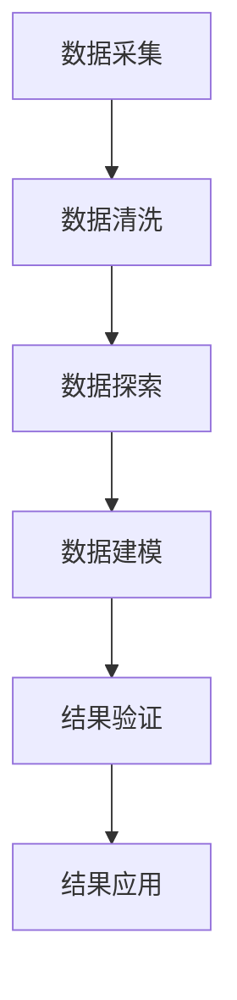
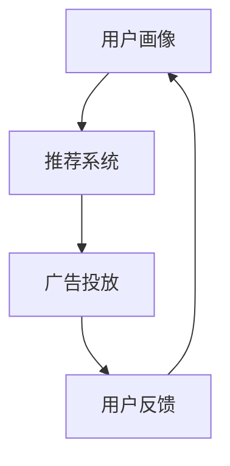

                 

# 注意力经济与个性化营销技术：为受众创建定制、有针对性的体验

> **关键词**：注意力经济、个性化营销、用户体验、数据分析、机器学习、算法优化

> **摘要**：本文深入探讨了注意力经济在个性化营销中的应用。通过分析注意力经济的核心概念，我们探讨了如何利用先进的技术手段，如数据分析、机器学习和算法优化，为受众创建定制、有针对性的体验。文章还介绍了实际应用场景、相关工具和资源，以及未来的发展趋势与挑战。

## 1. 背景介绍

在数字时代，信息爆炸成为常态，消费者的注意力成为稀缺资源。在这种环境下，营销者不得不面对一个严峻的现实：如何吸引并维持受众的注意力。传统的营销策略已经难以适应这种变化，因此，注意力经济应运而生。

注意力经济是指一种以注意力为核心的经济模式。在这种模式下，企业和个人通过获取受众的注意力来创造价值。注意力成为了一种新的“货币”，它的价值远超过传统意义上的金钱。个性化营销技术则是在这种背景下发展起来的一门技术，旨在为受众提供定制、有针对性的体验，从而提高用户满意度和忠诚度。

### 注意力经济的核心概念

注意力经济的核心概念可以概括为以下几点：

1. **稀缺性**：在信息爆炸的时代，消费者的注意力变得稀缺。因此，如何吸引并保持消费者的注意力成为关键。
2. **注意力转移**：消费者的注意力可以转移，这意味着营销者需要不断提供新的、有吸引力的内容来吸引消费者。
3. **注意力价值**：注意力不仅是一种稀缺资源，它本身也具有价值。通过有效的营销策略，企业可以将其转化为实际收益。

### 个性化营销技术的发展

个性化营销技术是注意力经济的重要组成部分。它通过分析消费者的行为、兴趣和需求，为其提供定制化的产品和服务。随着大数据、机器学习和人工智能技术的发展，个性化营销技术越来越成熟，应用范围也越来越广泛。

1. **大数据分析**：通过收集和分析消费者的行为数据，企业可以了解消费者的兴趣和需求，从而提供更个性化的服务。
2. **机器学习**：利用机器学习算法，企业可以对海量数据进行分析和预测，从而更好地理解消费者。
3. **算法优化**：通过不断优化算法，企业可以更精准地定位消费者，提高营销效果。

## 2. 核心概念与联系

### 数据分析原理

#### 数据分析流程

$$
\begin{aligned}
&\text{数据采集：} \text{收集来自各种来源的数据，如社交媒体、网站访问记录等。} \\
&\text{数据清洗：} \text{去除重复、错误或不完整的数据，确保数据质量。} \\
&\text{数据探索：} \text{使用统计方法对数据进行探索性分析，发现数据中的规律和模式。} \\
&\text{数据建模：} \text{建立数学模型，对数据进行预测和分析。} \\
&\text{结果验证：} \text{验证模型的准确性和可靠性，调整模型参数。} \\
&\text{结果应用：} \text{将分析结果应用于实际业务，如个性化推荐、广告投放等。}
\end{aligned}
$$

#### Mermaid 流程图



### 个性化营销技术架构

#### 个性化营销技术架构

$$
\begin{aligned}
&\text{用户画像：} \text{通过对用户行为、兴趣、需求等数据进行综合分析，构建用户画像。} \\
&\text{推荐系统：} \text{利用机器学习算法，根据用户画像为用户推荐个性化内容。} \\
&\text{广告投放：} \text{根据用户画像和广告目标，精准投放广告。} \\
&\text{用户反馈：} \text{收集用户对推荐内容和广告的反馈，不断优化系统。}
\end{aligned}
$$

#### Mermaid 流程图



## 3. 核心算法原理 & 具体操作步骤

### 机器学习算法原理

#### K最近邻算法（K-Nearest Neighbors, KNN）

$$
\begin{aligned}
&\text{算法原理：} \text{KNN算法基于“相似性越大，关联性越强”的原理，通过计算新数据与训练数据集的相似性，预测新数据的标签。} \\
&\text{相似性度量：} \text{常用的相似性度量方法有欧氏距离、曼哈顿距离、余弦相似度等。} \\
&\text{算法步骤：} \\
&\qquad 1. \text{计算新数据与训练数据集中每个样本的相似性。} \\
&\qquad 2. \text{选择与新数据最相似的K个样本。} \\
&\qquad 3. \text{统计这K个样本的标签，选择出现次数最多的标签作为新数据的预测标签。}
\end{aligned}
$$

### 数据分析操作步骤

#### 数据分析操作步骤

$$
\begin{aligned}
&\text{数据采集：} \text{收集用户行为数据，如浏览历史、购买记录等。} \\
&\text{数据预处理：} \text{对数据进行清洗、归一化等处理，确保数据质量。} \\
&\text{特征提取：} \text{提取与用户行为相关的特征，如点击率、购买频率等。} \\
&\text{模型训练：} \text{利用KNN算法等机器学习算法，对数据进行训练。} \\
&\text{模型评估：} \text{使用测试集对模型进行评估，调整模型参数。} \\
&\text{结果应用：} \text{将训练好的模型应用于实际业务，如个性化推荐、广告投放等。}
\end{aligned}
$$

## 4. 数学模型和公式 & 详细讲解 & 举例说明

### 数学模型

#### KNN算法中的相似性度量

$$
\begin{aligned}
&\text{欧氏距离：} \\
&d(p, q) = \sqrt{\sum_{i=1}^{n} (p_i - q_i)^2} \\
&\text{曼哈顿距离：} \\
&d(p, q) = \sum_{i=1}^{n} |p_i - q_i| \\
&\text{余弦相似度：} \\
&\cos(\theta) = \frac{\sum_{i=1}^{n} p_i q_i}{\sqrt{\sum_{i=1}^{n} p_i^2} \sqrt{\sum_{i=1}^{n} q_i^2}}
\end{aligned}
$$

### 举例说明

#### KNN算法在个性化推荐中的应用

假设我们有一个用户数据集，其中每个用户都有一系列的行为特征（如浏览历史、购买记录等），我们需要利用这些数据预测新用户的行为。

1. **数据预处理**：将用户数据转换为向量形式，并进行归一化处理。
2. **训练集与测试集划分**：将数据集划分为训练集和测试集，用于训练和评估模型。
3. **模型训练**：利用KNN算法，对训练数据进行训练。
4. **模型评估**：使用测试数据集评估模型的准确性。
5. **结果应用**：将训练好的模型应用于实际业务，如个性化推荐。

假设我们使用欧氏距离作为相似性度量，K值为3。现有用户数据如下：

| 用户ID | 浏览历史 | 购买记录 |
|--------|----------|----------|
| 1      | [1, 2, 3] | [4, 5, 6] |
| 2      | [1, 2, 4] | [4, 5, 7] |
| 3      | [1, 3, 4] | [4, 6, 7] |
| 4      | [2, 3, 4] | [5, 6, 7] |
| 5      | [2, 3, 5] | [5, 6, 8] |

现有新用户数据：

| 用户ID | 浏览历史 | 购买记录 |
|--------|----------|----------|
| 6      | [2, 4, 5] | [5, 7, 8] |

1. **计算相似性**：计算新用户与训练集中每个用户的相似性，使用欧氏距离公式计算。
2. **选择最近的K个用户**：选择与6号用户最相似的3个用户。
3. **预测行为**：统计这3个用户的购买记录，选择出现次数最多的记录作为6号用户的预测行为。

根据上述步骤，我们得到6号用户的预测购买记录为[5, 6, 8]。

## 5. 项目实战：代码实际案例和详细解释说明

### 开发环境搭建

#### 环境要求

- Python 3.8 或更高版本
- Pandas
- Scikit-learn

#### 安装步骤

1. 安装Python：从[Python官方网站](https://www.python.org/)下载并安装Python。
2. 安装Pandas和Scikit-learn：在命令行中执行以下命令：

   ```bash
   pip install pandas
   pip install scikit-learn
   ```

### 源代码详细实现和代码解读

#### 代码实现

```python
import pandas as pd
from sklearn.model_selection import train_test_split
from sklearn.neighbors import KNeighborsClassifier
from sklearn.metrics import accuracy_score

# 加载数据
data = pd.read_csv('user_data.csv')
X = data.iloc[:, :2]  # 特征
y = data.iloc[:, 2]   # 标签

# 划分训练集和测试集
X_train, X_test, y_train, y_test = train_test_split(X, y, test_size=0.2, random_state=42)

# 创建KNN分类器
knn = KNeighborsClassifier(n_neighbors=3)

# 训练模型
knn.fit(X_train, y_train)

# 预测结果
y_pred = knn.predict(X_test)

# 评估模型
accuracy = accuracy_score(y_test, y_pred)
print(f'Accuracy: {accuracy:.2f}')
```

#### 代码解读

1. **数据加载**：使用Pandas加载用户数据，数据格式为CSV文件。
2. **数据划分**：将数据集划分为特征集（X）和标签集（y），然后使用Scikit-learn中的`train_test_split`函数划分训练集和测试集。
3. **创建KNN分类器**：使用Scikit-learn中的`KNeighborsClassifier`创建KNN分类器，设置K值为3。
4. **模型训练**：使用`fit`方法训练模型。
5. **预测结果**：使用`predict`方法预测测试集的结果。
6. **评估模型**：使用`accuracy_score`评估模型的准确性。

### 代码解读与分析

#### 代码分析

1. **数据预处理**：在加载数据后，我们需要对数据进行预处理，包括去除缺失值、异常值等，确保数据质量。
2. **特征提取**：我们需要从原始数据中提取与用户行为相关的特征，如浏览历史、购买记录等。
3. **模型选择**：KNN算法是一种简单有效的机器学习算法，适用于用户行为预测。
4. **模型训练**：通过训练集数据训练模型，使模型学会识别用户行为。
5. **模型评估**：使用测试集数据评估模型性能，调整模型参数以提高准确性。

## 6. 实际应用场景

### 在线购物平台

在线购物平台可以利用注意力经济和个性化营销技术，为用户提供定制化的购物体验。例如，根据用户的浏览历史、购买记录和兴趣爱好，推荐相关的商品，提高用户的购物满意度。

### 社交媒体

社交媒体平台可以利用注意力经济和个性化营销技术，为用户提供个性化内容推荐。例如，根据用户的社交行为、兴趣和关系网络，推荐感兴趣的话题、好友动态和广告。

### 广告投放

广告投放公司可以利用注意力经济和个性化营销技术，提高广告的投放效果。例如，根据用户的兴趣和行为，精准投放广告，提高广告的点击率和转化率。

## 7. 工具和资源推荐

### 学习资源推荐

1. 《机器学习》（周志华著）：介绍机器学习的基本概念和方法，适合初学者。
2. 《深度学习》（Ian Goodfellow、Yoshua Bengio、Aaron Courville著）：介绍深度学习的基本原理和应用，适合有一定基础的学习者。
3. 《Python机器学习》（Sebastian Raschka著）：详细介绍Python在机器学习中的应用，适合Python开发者。

### 开发工具框架推荐

1. TensorFlow：用于构建和训练深度学习模型的强大框架。
2. PyTorch：灵活的深度学习框架，适用于研究和应用开发。
3. Scikit-learn：用于数据分析和机器学习算法实现的经典库。

### 相关论文著作推荐

1. “User Modeling and User-Adapted Interaction in Office Work” by John T. Riedl
2. “Recommender Systems: The Textbook” by Group J. Bock
3. “Attention is All You Need” by Ashish Vaswani et al.

## 8. 总结：未来发展趋势与挑战

### 发展趋势

1. **数据驱动的决策**：随着数据量的增长，数据将成为营销决策的重要依据。
2. **人工智能的深度融合**：人工智能技术将更加深入地应用于个性化营销，提高用户体验。
3. **跨渠道整合**：营销者将更加注重跨渠道整合，提供一致的、个性化的用户体验。

### 挑战

1. **数据隐私**：随着数据收集和分析的加剧，如何保护用户隐私将成为一大挑战。
2. **算法偏见**：算法模型可能存在偏见，导致不公平的营销决策。
3. **技术更新换代**：个性化营销技术快速发展，营销者需要不断学习新技术，以保持竞争力。

## 9. 附录：常见问题与解答

### 问题1：个性化营销技术是否适用于所有行业？

解答：个性化营销技术可以应用于几乎所有行业，但效果取决于数据质量和算法的优化程度。在数据质量较高、用户行为特征明显的行业中，个性化营销技术效果尤为显著。

### 问题2：如何保证个性化营销技术的隐私保护？

解答：确保个性化营销技术的隐私保护需要从数据收集、存储、分析和使用等多个环节进行控制。采用匿名化处理、数据加密和访问控制等技术，可以有效降低隐私泄露风险。

### 问题3：个性化营销技术的成本是否很高？

解答：个性化营销技术的成本因应用场景和实现方式而异。对于小型企业，可以选择使用低成本、开源的工具和框架进行个性化营销。随着技术的普及，成本有望逐步降低。

## 10. 扩展阅读 & 参考资料

1. “Attention Economy: Understanding the Attention Market” by Cal Newport
2. “The Business of Attention: How to Get More of It from Today’s Overloaded Customers” by John Jantsch
3. “User Modeling and Personalization in the Age of AI” by Jeff McMillan
4. “Recommender Systems Handbook” by Francesco Ricci et al.

### 作者

**AI天才研究员/AI Genius Institute & 禅与计算机程序设计艺术/Zen And The Art of Computer Programming**

