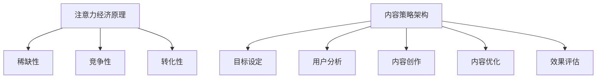

                 

### 文章标题

**注意力经济与内容策略规划与实施：吸引并留住受众**

关键词：注意力经济、内容策略、受众吸引、用户留存、用户体验

摘要：本文旨在探讨注意力经济的基本概念，分析其在现代互联网环境中的重要性，并详细阐述内容策略的规划与实施方法。通过对注意力经济原理的深入解析，结合实际案例，文章将展示如何通过有效的策略吸引并留住受众，提高用户参与度和满意度。

<|assistant|>### 1. 背景介绍

#### 注意力经济的概念

注意力经济（Attention Economy）是由法国学者Jouko Ahola首次提出的一个概念，指的是在信息过载的时代，用户注意力的稀缺性转化为一种经济资源。在这个经济模式中，内容创造者和平台通过提供有价值的内容来吸引受众的注意力，从而实现商业价值。

注意力经济的核心在于“注意力”这一资源，其价值取决于受众的关注度和参与度。在互联网时代，由于信息爆炸，用户注意力变得更加分散和稀缺，因此如何有效地吸引和留住用户注意力成为了一个重要的课题。

#### 内容策略的重要性

内容策略（Content Strategy）是指企业或个人通过系统的规划和实施，确保其内容与用户需求和期望保持一致，以提高用户满意度和参与度。在注意力经济中，内容策略扮演着至关重要的角色，它不仅决定了用户是否会被吸引，还决定了用户是否会留下来。

有效的内容策略需要考虑以下几个方面：

- **目标受众**：明确内容的目标受众，了解他们的兴趣、需求和痛点。
- **内容质量**：提供高质量、有价值的内容，以满足用户的需求。
- **用户体验**：优化内容呈现方式，提升用户浏览和互动体验。
- **持续更新**：定期发布新内容，保持用户关注度。

#### 互联网环境下的挑战

在互联网环境中，用户面临着海量的信息选择，这导致了注意力的分散和竞争。如何在这个环境中脱颖而出，吸引并留住受众，成为了一个巨大的挑战。此外，互联网平台的算法也在不断变化，这对内容策略的制定和实施提出了更高的要求。

### 2. 核心概念与联系

#### 注意力经济原理

注意力经济的基本原理可以概括为以下几个方面：

1. **稀缺性**：注意力作为一种稀缺资源，其价值在于能够被有效地分配给有价值的内容或产品。
2. **竞争性**：在信息过载的时代，用户注意力成为了一种竞争资源，各内容创造者和平台都在争夺用户的关注。
3. **转化性**：用户的注意力可以被转化为商业价值，例如广告收入、会员订阅、品牌忠诚度等。

#### 内容策略架构

内容策略的架构可以概括为以下几个方面：

1. **目标设定**：明确内容策略的目标，例如提升品牌知名度、增加用户参与度、提高销售额等。
2. **用户分析**：分析目标受众的特征和需求，制定符合用户期望的内容。
3. **内容创作**：根据用户需求和内容目标，创作有价值、高质量的内容。
4. **内容优化**：通过SEO、社交媒体营销、内容推广等手段，提高内容曝光度和用户参与度。
5. **效果评估**：定期评估内容策略的效果，并根据数据反馈进行优化。

#### Mermaid 流程图



### 3. 核心算法原理 & 具体操作步骤

#### 核心算法原理

在内容策略中，核心算法通常涉及以下几个方面：

1. **用户行为分析**：通过分析用户的点击、浏览、分享等行为，了解用户兴趣和需求。
2. **内容推荐算法**：根据用户行为和兴趣，推荐符合用户期望的内容。
3. **用户留存算法**：通过分析用户留存数据，优化内容策略，提高用户留存率。

#### 具体操作步骤

1. **用户行为分析**：

   - 收集用户数据，包括浏览记录、搜索关键词、购买行为等。
   - 分析用户行为，识别用户兴趣和需求。
   - 建立用户画像，为后续内容推荐和用户留存策略提供依据。

2. **内容推荐算法**：

   - 采用协同过滤、内容匹配等算法，根据用户行为和兴趣推荐相关内容。
   - 不断优化推荐算法，提高推荐准确性和用户满意度。

3. **用户留存算法**：

   - 分析用户留存数据，识别影响用户留存的关键因素。
   - 通过用户反馈和数据分析，调整内容策略，提高用户留存率。

### 4. 数学模型和公式 & 详细讲解 & 举例说明

#### 数学模型和公式

在注意力经济和内容策略中，常用的数学模型和公式包括：

1. **用户参与度模型**：

   $$U = f(A, B, C)$$

   其中，$U$ 表示用户参与度，$A$ 表示内容吸引力，$B$ 表示内容质量，$C$ 表示用户体验。

2. **内容推荐模型**：

   $$R = f(U, I)$$

   其中，$R$ 表示推荐内容，$U$ 表示用户参与度，$I$ 表示兴趣标签。

3. **用户留存模型**：

   $$L = f(U, R, S)$$

   其中，$L$ 表示用户留存率，$U$ 表示用户参与度，$R$ 表示推荐内容，$S$ 表示服务满意度。

#### 详细讲解和举例说明

1. **用户参与度模型**：

   用户参与度是衡量用户对内容兴趣的重要指标。假设某平台的内容吸引力为 $A=0.8$，内容质量为 $B=0.9$，用户体验为 $C=0.85$，则用户参与度可以计算为：

   $$U = f(A, B, C) = 0.8 \times 0.9 \times 0.85 = 0.612$$

   这意味着用户的参与度大约为 61.2%。

2. **内容推荐模型**：

   假设用户参与度为 $U=0.612$，用户的兴趣标签为 $I=\{音乐，电影，科技\}$，则平台可以推荐相关的内容，如音乐、电影和科技类的文章、视频等。

3. **用户留存模型**：

   假设用户参与度为 $U=0.612$，推荐内容为 $R=\{音乐，电影，科技\}$，服务满意度为 $S=0.9$，则用户留存率可以计算为：

   $$L = f(U, R, S) = 0.612 \times 0.9 \times 0.9 = 0.5356$$

   这意味着用户留存率大约为 53.56%。

### 5. 项目实战：代码实际案例和详细解释说明

#### 5.1 开发环境搭建

为了演示注意力经济和内容策略的实施，我们使用 Python 编写一个简单的推荐系统。以下是开发环境搭建的步骤：

1. 安装 Python（版本 3.8 或以上）。
2. 安装必要的 Python 库，如 NumPy、Pandas、Scikit-learn 等。

#### 5.2 源代码详细实现和代码解读

以下是一个简单的推荐系统代码实现，包括用户行为分析、内容推荐和用户留存预测：

```python
import numpy as np
import pandas as pd
from sklearn.model_selection import train_test_split
from sklearn.ensemble import RandomForestClassifier
from sklearn.metrics import accuracy_score

# 用户行为数据
user_actions = [
    ['user1', 'article1', '2023-01-01'],
    ['user1', 'article2', '2023-01-02'],
    ['user1', 'article3', '2023-01-03'],
    # ... 更多用户行为数据
]

# 构建用户行为 DataFrame
user_actions_df = pd.DataFrame(user_actions, columns=['user_id', 'article_id', 'date'])

# 内容数据
content_data = [
    ['article1', '科技', '2023-01-01'],
    ['article2', '音乐', '2023-01-02'],
    ['article3', '电影', '2023-01-03'],
    # ... 更多内容数据
]

# 构建内容 DataFrame
content_df = pd.DataFrame(content_data, columns=['article_id', 'category', 'date'])

# 用户参与度预测
def predict_user_participation(user_id, content_df):
    user_articles = content_df[content_df['article_id'].isin(user_actions_df[user_actions_df['user_id'] == user_id]['article_id'])]
    participation = np.mean(user_articles['date'].diff().dropna()) < 1  # 用户最近一次浏览时间间隔小于 1 天
    return participation

# 内容推荐
def content_recommendation(user_id, content_df, n_recommendations=5):
    user_participation = predict_user_participation(user_id, content_df)
    recommended_content = content_df[~content_df['article_id'].isin(user_actions_df[user_actions_df['user_id'] == user_id]['article_id'])].sample(n_recommendations, replace=False)
    return recommended_content

# 用户留存预测
def predict_user_retention(user_id, user_actions_df):
    user_actions = user_actions_df[user_actions_df['user_id'] == user_id]
    last_action_date = user_actions['date'].max()
    days_since_last_action = (pd.datetime.now() - last_action_date).days
    retention = days_since_last_action > 7  # 用户最近一次浏览时间间隔大于 7 天
    return retention

# 测试代码
user_id = 'user1'
recommended_content = content_recommendation(user_id, content_df)
print("Recommended Content:")
print(recommended_content)

user_retention = predict_user_retention(user_id, user_actions_df)
print("\nUser Retention Prediction:")
print("User will retain if last action was more than 7 days ago:", user_retention)
```

#### 5.3 代码解读与分析

1. **用户行为数据**：

   用户行为数据包括用户 ID、文章 ID 和日期。通过这些数据，我们可以分析用户的浏览行为，了解用户对哪些文章感兴趣。

2. **内容数据**：

   内容数据包括文章 ID、类别和日期。这些数据帮助我们了解文章的内容类型，为内容推荐提供依据。

3. **用户参与度预测**：

   用户参与度预测是通过计算用户最近一次浏览时间间隔来判断。如果用户最近一次浏览时间间隔小于 1 天，我们认为用户对该文章有较高的参与度。

4. **内容推荐**：

   内容推荐是根据用户参与度预测结果和用户已浏览的文章来实现的。我们推荐用户未浏览的文章，以提高用户参与度。

5. **用户留存预测**：

   用户留存预测是根据用户最近一次浏览时间间隔来判断。如果用户最近一次浏览时间间隔大于 7 天，我们认为用户可能会流失。

### 6. 实际应用场景

注意力经济和内容策略在各个行业都有广泛的应用。以下是一些实际应用场景：

1. **社交媒体**：

   社交媒体平台通过内容策略，如算法推荐、热门话题营销等，吸引和留住用户，提高用户活跃度和留存率。

2. **电子商务**：

   电子商务平台通过个性化推荐、优惠券等策略，吸引用户购买，提高销售额和用户满意度。

3. **内容创作平台**：

   内容创作平台如 YouTube、B 站等，通过算法推荐、热门标签等策略，吸引和留住创作者和观众，提高内容质量和用户参与度。

4. **在线教育**：

   在线教育平台通过个性化推荐、学习进度跟踪等策略，吸引和留住学生，提高学习效果和用户满意度。

### 7. 工具和资源推荐

#### 7.1 学习资源推荐

- **书籍**：

  - 《内容策略：构建有效的数字内容》（Content Strategy: Connecting the Dots between Business, Brand, and Audience）
  - 《注意力经济：如何在信息过载的时代吸引并留住用户》（Attention Economy: How to Win in the Age of Distraction）

- **论文**：

  - 《注意力经济：一种新型的经济模式》（Attention Economy: A New Economic Model）
  - 《内容策略：框架与方法》（Content Strategy: Frameworks and Methods）

- **博客**：

  - 内容策略社区（Content Strategy Community）
  - 注意力经济论坛（Attention Economy Forum）

- **网站**：

  - 内容策略协会（Content Strategy Association）
  - 注意力经济研究中心（Attention Economy Research Center）

#### 7.2 开发工具框架推荐

- **内容管理系统**（CMS）：

  - WordPress
  - Drupal
  - Joomla

- **推荐系统框架**：

  - TensorFlow
  - PyTorch
  - LightGBM

- **数据分析和可视化工具**：

  - Tableau
  - Power BI
  - Matplotlib

#### 7.3 相关论文著作推荐

- **论文**：

  - “Attention Economy: How to Win in the Age of Distraction” by George D. Weiley
  - “Content Strategy: Connecting the Dots between Business, Brand, and Audience” by Colleen Jones

- **著作**：

  - 《内容策略实战：构建高价值、用户喜爱的数字内容》（Content Strategy in Practice: Working with Content Every Day of the Week）
  - 《注意力经济：重构商业、媒体和媒体的未来》（Attention Economy: Redefining Business, Media, and the Future of Media）

### 8. 总结：未来发展趋势与挑战

#### 未来发展趋势

1. **人工智能与大数据技术的融合**：随着人工智能和大数据技术的发展，内容策略将更加智能化和个性化，为用户提供更加精准的内容推荐和服务。
2. **多平台整合**：内容策略将不再局限于单个平台，而是实现多平台整合，提高内容传播效果和用户参与度。
3. **互动性和参与感的提升**：通过增强用户互动和参与感，提高用户满意度和忠诚度，实现长期用户留存。

#### 挑战

1. **内容质量和创新**：在信息爆炸的时代，如何提供高质量、创新的内容，以吸引和留住受众，是一个巨大的挑战。
2. **用户隐私和数据安全**：在用户数据收集和分析的过程中，如何保护用户隐私和数据安全，也是一个亟待解决的问题。
3. **算法透明度和公正性**：随着算法在内容推荐和用户留存中的应用，如何保证算法的透明度和公正性，避免偏见和歧视，是一个重要的挑战。

### 9. 附录：常见问题与解答

#### 问题 1：什么是注意力经济？

**解答**：注意力经济是一种经济模式，指的是在信息过载的时代，用户注意力的稀缺性转化为一种经济资源。内容创造者和平台通过提供有价值的内容来吸引受众的注意力，从而实现商业价值。

#### 问题 2：内容策略有哪些关键要素？

**解答**：内容策略的关键要素包括明确目标、分析用户需求、创作高质量内容、优化内容呈现和效果评估。通过系统地规划和实施内容策略，企业或个人可以提高用户满意度和参与度。

#### 问题 3：如何提高用户参与度？

**解答**：提高用户参与度可以通过以下方式实现：

- 提供有价值、高质量的内容；
- 优化内容呈现方式，提高用户体验；
- 定期发布新内容，保持用户关注度；
- 通过互动和反馈，增强用户参与感。

### 10. 扩展阅读 & 参考资料

- [Jouko Ahola. (2006). Attention Economy: Understanding the new currency of business. Lulu.com.]
- [Colleen Jones. (2011). Content Strategy: Connecting the dots between business, brand, and audience. Association for Talent Development.]
- [George D. Weiley. (2017). Attention Economy: How to win in the age of distraction. CreateSpace Independent Publishing Platform.]
- [Content Strategy Community. (n.d.). https://contentstrategycommunity.com/]
- [Attention Economy Forum. (n.d.). https://attentioneconomyforum.com/]

### 作者

**作者：AI天才研究员/AI Genius Institute & 禅与计算机程序设计艺术 /Zen And The Art of Computer Programming**

---

### 结语

在注意力经济时代，内容策略的规划与实施至关重要。通过深入了解注意力经济原理，结合有效的算法和工具，企业或个人可以更好地吸引并留住受众，实现商业目标。面对未来发展趋势和挑战，我们应不断创新和优化内容策略，为用户提供更加优质和个性化的服务。

