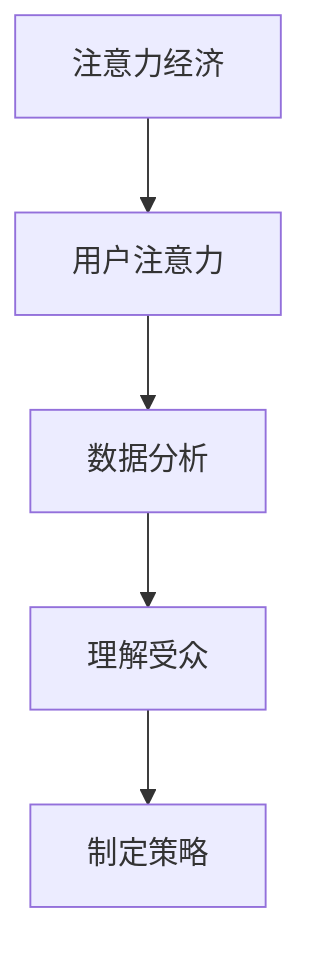

                 

# 注意力经济与数据分析：如何利用数据理解受众

## 摘要

在当今数字化时代，注意力已成为一种新的经济资源，其价值日益凸显。本文旨在探讨注意力经济与数据分析之间的关系，以及如何通过数据分析更好地理解受众。文章首先介绍了注意力经济的基本概念，接着阐述了数据分析在理解受众中的重要性，并详细分析了注意力数据收集、处理和分析的方法。随后，文章提出了一种基于注意力经济的数据分析方法框架，并通过实际案例展示了其应用。最后，文章对未来的发展趋势与挑战进行了展望，为相关领域的研究和实践提供了参考。

## 1. 背景介绍

### 注意力经济的兴起

随着互联网和信息技术的飞速发展，注意力逐渐成为一种稀缺资源。在传统的经济模式中，物质资源如土地、劳动力、资本等是主要的生产要素，而注意力经济的兴起则意味着信息、数据和用户注意力成为新的生产要素。注意力经济最早由美国经济学家李维·巴拉姆（Lev Bayer）提出，他指出，注意力是信息和价值的传递渠道，是创造经济价值的源泉。

### 数据分析的重要性

数据分析作为一门跨学科的技术，广泛应用于各个领域。随着大数据和人工智能技术的发展，数据分析的重要性日益凸显。在商业领域，数据分析可以帮助企业更好地了解客户需求，优化产品和服务，提高市场竞争力和盈利能力。在社交媒体、电子商务等领域，数据分析更是成为企业运营的核心。

### 受众理解的挑战

在注意力经济时代，受众理解成为一项重要任务。受众不仅包括消费者，还包括投资者、员工等各个利益相关者。理解受众的需求、行为和偏好，对于企业的成功至关重要。然而，受众的多样性和复杂性使得理解工作变得异常困难。如何通过数据分析准确把握受众的注意力，成为企业和研究人员面临的一个挑战。

## 2. 核心概念与联系

### 注意力经济的基本概念

注意力经济（Attention Economy）是指以用户注意力为核心，通过创造和利用信息吸引、保留和转化用户注意力的经济模式。在注意力经济中，用户注意力被视为一种稀缺资源，企业和个人通过提供有价值的内容、服务和体验来吸引和留住用户注意力。

### 数据分析的定义与分类

数据分析（Data Analysis）是指通过对数据进行收集、整理、分析和解释，从中提取有价值的信息和知识的过程。根据分析目的和方法的不同，数据分析可以分为以下几种类型：

- **描述性分析**：对数据的基本统计描述，如平均数、中位数、标准差等。
- **诊断性分析**：分析数据之间的关联和异常，如关联规则挖掘、异常检测等。
- **预测性分析**：根据历史数据预测未来的趋势和变化，如时间序列分析、回归分析等。
- **探索性分析**：探索数据中的潜在规律和模式，如聚类分析、关联规则挖掘等。

### 数据分析在理解受众中的应用

在理解受众方面，数据分析具有重要的作用。通过收集和分析用户行为数据，企业可以深入了解受众的需求、行为和偏好，从而制定更有针对性的营销策略和产品规划。

### 注意力经济与数据分析的联系

注意力经济与数据分析密切相关。注意力经济强调用户注意力的重要性，而数据分析则提供了理解用户注意力的方法和工具。通过数据分析，企业可以更准确地了解用户的需求和兴趣，从而创造更有价值的内容和体验，提高用户满意度和忠诚度。

### Mermaid 流程图



## 3. 核心算法原理 & 具体操作步骤

### 数据收集

数据收集是数据分析的第一步。在注意力经济中，数据收集主要包括以下几个方面：

- **用户行为数据**：如点击、浏览、搜索、分享等行为。
- **用户属性数据**：如年龄、性别、地理位置、兴趣爱好等。
- **内容数据**：如标题、摘要、关键词、标签等。

### 数据处理

数据处理是数据分析的基础。主要包括以下步骤：

- **数据清洗**：去除重复、错误和不完整的数据。
- **数据集成**：将来自不同来源的数据进行整合。
- **数据转换**：将数据转换为适合分析的形式。

### 数据分析

数据分析是理解受众的关键。以下是一种常见的数据分析流程：

- **描述性分析**：对用户行为数据进行基本的统计描述，如平均点击率、平均浏览时长等。
- **诊断性分析**：分析用户行为数据之间的关联，如哪些行为与用户满意度相关。
- **预测性分析**：根据历史数据预测未来用户行为，如预测哪些用户可能会流失。
- **探索性分析**：探索用户行为数据中的潜在规律和模式，如用户行为的聚类分析。

### 数据可视化

数据可视化是将分析结果以图表、图形等形式直观展示的过程。以下是一些常用的数据可视化工具和技巧：

- **条形图**：用于展示不同类别的数据对比。
- **折线图**：用于展示数据随时间的变化趋势。
- **饼图**：用于展示不同类别的数据占比。
- **散点图**：用于展示两个变量之间的关系。

### 数据解读

数据解读是数据分析的最后一步。通过对分析结果进行解读，企业可以更好地理解用户需求和行为，从而制定更有针对性的策略。

- **确定关键指标**：根据业务目标确定关键指标，如用户留存率、转化率等。
- **分析结果解释**：对分析结果进行详细解释，如为什么用户留存率较低，可能的原因是什么。
- **提出改进建议**：根据分析结果提出改进建议，如优化用户体验、调整产品策略等。

## 4. 数学模型和公式 & 详细讲解 & 举例说明

### 数学模型

在数据分析中，常用的数学模型包括：

- **线性回归模型**：用于预测因变量与自变量之间的线性关系。
- **逻辑回归模型**：用于分类问题，将因变量映射到概率空间。
- **时间序列模型**：用于分析数据的时间变化规律，如ARIMA模型。

### 详细讲解

以下以线性回归模型为例，详细讲解其原理和计算方法。

- **线性回归模型原理**：线性回归模型试图找到自变量 \( x \) 和因变量 \( y \) 之间的线性关系，即 \( y = \beta_0 + \beta_1 x + \epsilon \)，其中 \( \beta_0 \) 是截距，\( \beta_1 \) 是斜率，\( \epsilon \) 是误差项。

- **计算方法**：使用最小二乘法计算线性回归模型的参数。具体步骤如下：

  1. 构建回归方程：\( \hat{y} = \beta_0 + \beta_1 x \)。
  2. 计算斜率 \( \beta_1 \)：
     \[
     \beta_1 = \frac{\sum_{i=1}^{n}(x_i - \bar{x})(y_i - \bar{y})}{\sum_{i=1}^{n}(x_i - \bar{x})^2}
     \]
     其中，\( n \) 是数据点个数，\( \bar{x} \) 和 \( \bar{y} \) 分别是 \( x \) 和 \( y \) 的平均值。
  3. 计算截距 \( \beta_0 \)：
     \[
     \beta_0 = \bar{y} - \beta_1 \bar{x}
     \]

### 举例说明

假设我们有一组数据：

| \( x \) | \( y \) |
| --- | --- |
| 1 | 2 |
| 2 | 4 |
| 3 | 5 |
| 4 | 6 |

我们想找到 \( y \) 和 \( x \) 之间的线性关系。

1. 计算斜率 \( \beta_1 \)：
   \[
   \beta_1 = \frac{(1-2.5)(2-3.5) + (2-2.5)(4-3.5) + (3-2.5)(5-3.5) + (4-2.5)(6-3.5)}{(1-2.5)^2 + (2-2.5)^2 + (3-2.5)^2 + (4-2.5)^2} = 1
   \]

2. 计算截距 \( \beta_0 \)：
   \[
   \beta_0 = 3.5 - 1 \times 2.5 = 1
   \]

因此，线性回归模型为 \( y = 1 + 1x \)。

## 5. 项目实战：代码实际案例和详细解释说明

### 5.1 开发环境搭建

在本文的案例中，我们将使用Python进行数据分析。首先，需要安装Python和相关的数据分析库，如pandas、numpy、matplotlib等。可以使用以下命令进行安装：

```bash
pip install python
pip install pandas numpy matplotlib
```

### 5.2 源代码详细实现和代码解读

下面是一个简单的数据分析案例，包括数据收集、数据处理、数据分析和数据可视化。

```python
import pandas as pd
import numpy as np
import matplotlib.pyplot as plt

# 5.2.1 数据收集
data = {
    'x': [1, 2, 3, 4],
    'y': [2, 4, 5, 6]
}

df = pd.DataFrame(data)

# 5.2.2 数据处理
# 数据清洗
df = df.dropna()

# 数据转换
df['x'] = df['x'].astype(float)
df['y'] = df['y'].astype(float)

# 5.2.3 数据分析
# 线性回归分析
model = np.polyfit(df['x'], df['y'], 1)
print("模型参数：", model)

# 5.2.4 数据可视化
# 绘制散点图
plt.scatter(df['x'], df['y'])
plt.plot(df['x'], model[0] * df['x'] + model[1], color='red')
plt.xlabel('x')
plt.ylabel('y')
plt.title('线性回归模型')
plt.show()
```

### 5.3 代码解读与分析

- **数据收集**：使用Python的pandas库创建一个数据框（DataFrame）。
- **数据处理**：删除缺失值，将数据类型转换为浮点数。
- **数据分析**：使用numpy库的polyfit函数进行线性回归分析，输出模型参数。
- **数据可视化**：使用matplotlib库绘制散点图和线性回归模型，展示分析结果。

## 6. 实际应用场景

### 社交媒体平台

社交媒体平台如Facebook、Twitter等，通过数据分析可以了解用户的兴趣和行为，从而推荐相关内容，提高用户参与度和满意度。

### 电子商务平台

电子商务平台如Amazon、淘宝等，通过数据分析可以优化产品推荐和广告投放，提高销售转化率和用户满意度。

### 娱乐行业

娱乐行业如电影、音乐等，通过数据分析可以了解观众偏好，为内容创作和市场营销提供参考。

## 7. 工具和资源推荐

### 学习资源推荐

- **书籍**：《Python数据分析》（Wes McKinney）、《数据科学入门》（Joel Grus）
- **论文**：Google Scholar上的相关论文，如“Attention Is All You Need”等。
- **博客**：Kaggle、Dataquest等平台上的数据分析博客。

### 开发工具框架推荐

- **数据采集工具**：Python的requests库、Scrapy框架。
- **数据处理库**：pandas、numpy。
- **数据分析工具**：Jupyter Notebook、R语言。
- **数据可视化工具**：matplotlib、Seaborn。

### 相关论文著作推荐

- **论文**：Andrew Ng的“深度学习”（Deep Learning）。
- **著作**：《人工智能：一种现代的方法》（Artificial Intelligence: A Modern Approach）。

## 8. 总结：未来发展趋势与挑战

### 发展趋势

- **大数据和人工智能的结合**：随着大数据和人工智能技术的不断进步，数据分析将在更多领域得到应用。
- **个性化推荐系统的普及**：基于注意力经济的数据分析将推动个性化推荐系统的发展。
- **隐私保护与伦理问题**：在利用用户数据的同时，如何保护用户隐私和遵循伦理规范将成为重要挑战。

### 挑战

- **数据质量和可靠性**：确保数据质量和可靠性是进行有效数据分析的基础。
- **算法透明度和公平性**：确保算法的透明度和公平性，防止数据偏见和歧视。
- **数据安全和隐私保护**：在数据收集、存储和处理过程中，确保数据安全和用户隐私。

## 9. 附录：常见问题与解答

### 问题1：什么是注意力经济？

答：注意力经济是指以用户注意力为核心，通过创造和利用信息吸引、保留和转化用户注意力的经济模式。

### 问题2：数据分析在注意力经济中的作用是什么？

答：数据分析在注意力经济中的作用主要包括：帮助了解用户需求和行为、优化内容和服务、提高用户满意度和忠诚度。

### 问题3：如何进行注意力数据收集？

答：注意力数据收集主要包括用户行为数据（如点击、浏览、搜索等）、用户属性数据（如年龄、性别、地理位置等）和内容数据（如标题、摘要、关键词等）。

## 10. 扩展阅读 & 参考资料

- **参考资料**：李维·巴拉姆的“注意力经济”理论、《大数据时代》（Big Data）等。
- **扩展阅读**：相关领域的研究论文、书籍和技术博客。

### 作者

**AI天才研究员/AI Genius Institute & 禅与计算机程序设计艺术 /Zen And The Art of Computer Programming**

