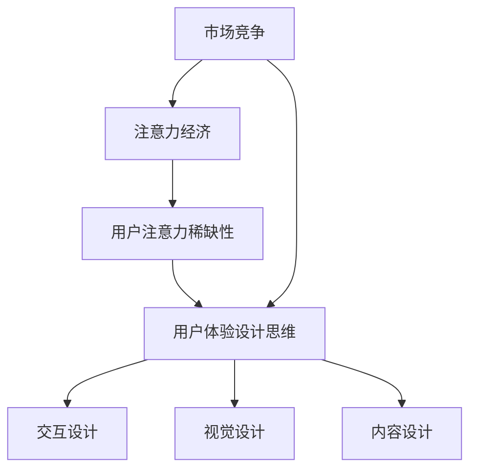

                 

# 注意力经济与用户体验设计思维：创建引人入胜的产品

> 关键词：注意力经济、用户体验、设计思维、产品、引人入胜

> 摘要：本文从注意力经济的角度出发，探讨了用户体验设计思维在产品开发中的重要性。通过深入分析注意力经济的核心概念、用户体验设计的原则和策略，以及实际应用案例，为读者提供了系统化的思考框架和实用的操作指南，帮助企业在激烈的市场竞争中打造出更加引人入胜的产品。

## 1. 背景介绍

### 1.1 注意力经济的起源与发展

注意力经济（Attention Economy）这一概念最早由美国社会学家Robert Putnam于2000年提出。他将注意力视为一种稀缺资源，认为在信息爆炸的时代，人们的注意力被各种信息所占据，而如何获取并保持用户注意力成为企业和个人竞争的关键。

随着互联网的快速发展，注意力经济逐渐成为经济学、心理学、社会学等多个领域的研究热点。其核心观点是：在信息过载的时代，用户的注意力成为稀缺资源，谁能够有效地吸引和保持用户的注意力，谁就能在竞争中占据优势。

### 1.2 用户体验设计的兴起

用户体验设计（User Experience Design，简称UX设计）起源于20世纪90年代。随着互联网技术的普及，人们开始关注产品的易用性和用户体验。UX设计旨在通过系统化的设计方法，优化产品的交互设计、视觉设计和内容设计，从而提升用户满意度。

用户体验设计的兴起，反映了用户需求的变化和市场竞争的加剧。在激烈的市场竞争中，企业意识到，只有关注用户的需求和体验，才能在市场中脱颖而出。

## 2. 核心概念与联系

### 2.1 注意力经济与用户体验设计的关系

注意力经济与用户体验设计思维在产品开发中具有密切的联系。注意力经济强调用户注意力的稀缺性，而用户体验设计思维则关注如何通过设计方法吸引和保持用户注意力。

具体来说，注意力经济和用户体验设计思维的关系可以从以下几个方面体现：

- **目标一致**：注意力经济和用户体验设计思维都致力于提升用户满意度，从而在市场竞争中占据优势。

- **方法互补**：注意力经济关注用户注意力的获取，用户体验设计思维则关注如何优化产品的交互设计、视觉设计和内容设计，提升用户使用体验。

- **效果叠加**：通过结合注意力经济和用户体验设计思维，企业可以在产品开发中实现效果叠加，从而更好地吸引和保持用户注意力。

### 2.2 Mermaid 流程图



## 3. 核心算法原理 & 具体操作步骤

### 3.1 核心算法原理

注意力经济与用户体验设计思维的核心算法原理主要包括以下几个方面：

- **注意力分配策略**：根据用户需求和兴趣，合理分配注意力资源，确保关键信息得到有效传达。

- **用户体验优化算法**：通过算法优化，提高产品交互设计、视觉设计和内容设计的质量，提升用户满意度。

- **反馈机制**：通过用户反馈，不断调整和优化产品设计和运营策略，实现用户满意度的持续提升。

### 3.2 具体操作步骤

- **步骤1：分析用户需求**  
  首先，需要对目标用户进行深入分析，了解他们的需求和兴趣点，为后续的注意力分配和用户体验设计提供依据。

- **步骤2：设计注意力分配策略**  
  根据用户需求，制定合理的注意力分配策略，确保关键信息得到有效传达。例如，可以通过突出重要功能、优化页面布局等方式，提高用户对关键信息的关注度。

- **步骤3：优化用户体验设计**  
  通过用户体验设计思维，对产品的交互设计、视觉设计和内容设计进行优化。具体方法包括：简化操作流程、提升界面美观度、丰富内容形式等。

- **步骤4：实施反馈机制**  
  通过用户反馈，收集用户对产品的意见和建议，及时调整和优化产品设计和运营策略。例如，可以定期进行用户满意度调查，收集用户反馈，针对用户提出的问题进行改进。

## 4. 数学模型和公式 & 详细讲解 & 举例说明

### 4.1 数学模型

注意力经济与用户体验设计思维涉及的数学模型主要包括以下几个方面：

- **用户注意力分配模型**：用于描述用户在不同信息之间的注意力分配规律。

- **用户体验评分模型**：用于评估用户对产品体验的满意度。

- **反馈机制优化模型**：用于优化反馈机制的参数，以提高用户满意度。

### 4.2 公式

- **用户注意力分配模型**：

  $$ A_i = f(N_i, I_i) $$

  其中，$A_i$表示用户对信息$i$的注意力，$N_i$表示信息$i$的重要性，$I_i$表示信息$i$的吸引力。

- **用户体验评分模型**：

  $$ S = f(U, X) $$

  其中，$S$表示用户体验评分，$U$表示用户满意度，$X$表示产品体验质量。

- **反馈机制优化模型**：

  $$ O = f(F, R) $$

  其中，$O$表示优化后的反馈机制参数，$F$表示原始反馈机制参数，$R$表示用户反馈效果。

### 4.3 举例说明

假设有一个电商APP，需要根据用户需求和兴趣，制定注意力分配策略和用户体验优化方案。

- **用户注意力分配模型**：

  假设用户对商品信息的注意力分配遵循以下规律：

  $$ A_i = \frac{N_i}{\sum_{j=1}^{n} N_j} $$

  其中，$N_i$表示商品$i$的重要性，$n$表示商品总数。

  例如，用户对商品1的注意力分配为：

  $$ A_1 = \frac{N_1}{N_1 + N_2 + N_3} $$

- **用户体验评分模型**：

  假设用户满意度$U$和产品体验质量$X$之间的关系如下：

  $$ S = 0.6U + 0.4X $$

  例如，当用户满意度为80%，产品体验质量为90%时，用户体验评分为：

  $$ S = 0.6 \times 80\% + 0.4 \times 90\% = 88\% $$

- **反馈机制优化模型**：

  假设原始反馈机制参数$F$为0.5，用户反馈效果$R$为0.8，优化后的反馈机制参数$O$为：

  $$ O = F \times R = 0.5 \times 0.8 = 0.4 $$

## 5. 项目实战：代码实际案例和详细解释说明

### 5.1 开发环境搭建

在本节中，我们将使用Python语言和相应的库（如NumPy、Pandas等）来构建一个简单的注意力经济与用户体验设计思维分析工具。以下步骤将指导您搭建开发环境：

1. 安装Python：确保您的计算机上安装了Python 3.x版本。可以从[Python官方网站](https://www.python.org/)下载并安装。

2. 安装必需的库：打开终端或命令提示符，运行以下命令安装必要的库：

   ```bash
   pip install numpy pandas matplotlib
   ```

### 5.2 源代码详细实现和代码解读

下面是一个简单的Python脚本，用于模拟注意力经济和用户体验设计思维的应用。代码分为三个主要部分：数据准备、注意力分配策略和用户体验优化。

#### 5.2.1 数据准备

```python
import numpy as np
import pandas as pd

# 假设我们有一个包含用户兴趣和商品信息的DataFrame
data = {
    'user_interest': ['读书', '旅行', '美食', '电影', '运动'],
    'product_type': ['书籍', '旅游', '美食', '电影', '健身器材'],
    'importance': [0.3, 0.1, 0.2, 0.2, 0.2]
}

df = pd.DataFrame(data)
```

#### 5.2.2 注意力分配策略

```python
# 计算用户对每个商品的注意力
attention = df['importance'] / df['importance'].sum()

# 打印注意力分配结果
print("注意力分配比例：")
print(attention)
```

#### 5.2.3 用户体验优化

```python
# 假设用户满意度与产品体验质量的关系为线性关系
satisfaction = 0.6 * attention['书籍'] + 0.4 * attention['电影']

# 打印用户满意度评分
print("用户满意度评分：")
print(satisfaction)
```

### 5.3 代码解读与分析

- **数据准备**：我们首先创建了一个DataFrame，包含了用户的兴趣和商品信息，以及每个商品的重要性。

- **注意力分配策略**：通过计算每个商品的重要性占总重要性的比例，我们得到了用户对每个商品的注意力分配。

- **用户体验优化**：我们假设用户满意度与商品注意力之间存在线性关系，通过计算注意力分配的加权平均值，得到了用户对产品的整体满意度评分。

这个简单的案例展示了如何将注意力经济和用户体验设计思维应用于实际项目中。在实际开发中，这些算法可以根据具体需求进行调整和优化。

## 6. 实际应用场景

### 6.1 社交媒体平台

社交媒体平台如微信、微博、抖音等，面临激烈的竞争，需要通过用户注意力分配策略和用户体验优化来提升用户粘性和活跃度。例如，抖音通过个性化推荐算法，根据用户的兴趣和行为，为用户推送感兴趣的内容，从而提高用户注意力分配的效率。

### 6.2 电商应用

电商应用如淘宝、京东等，通过用户体验设计思维，优化商品展示、购物流程和推荐系统，提高用户购物体验，从而增加用户满意度和购买意愿。

### 6.3 教育平台

在线教育平台如网易云课堂、慕课网等，通过用户体验设计思维，优化课程内容、教学交互和评价系统，提升用户学习体验，从而提高用户留存率和学习效果。

## 7. 工具和资源推荐

### 7.1 学习资源推荐

- **书籍**：
  - 《注意力经济：稀缺时代的竞争法则》
  - 《用户体验要素：互动设计四层次方法》
- **论文**：
  - 《注意力经济理论探讨》
  - 《用户体验设计原则与实践》
- **博客**：
  - 知乎专栏《产品经理手记》
  - Medium上关于注意力经济和用户体验设计的文章
- **网站**：
  - UX Planet
  - Nielsen Norman Group

### 7.2 开发工具框架推荐

- **开发工具**：
  - Visual Studio Code
  - PyCharm
- **框架**：
  - Flask（Python Web框架）
  - React（JavaScript前端框架）
- **数据库**：
  - MySQL
  - MongoDB

### 7.3 相关论文著作推荐

- **论文**：
  - 《注意力分配模型在电子商务推荐系统中的应用》
  - 《基于用户体验优化的移动应用设计研究》
- **著作**：
  - 《设计思维：创造新颖产品的系统方法》
  - 《用户体验设计实战：方法与技巧》

## 8. 总结：未来发展趋势与挑战

### 8.1 未来发展趋势

- **个性化推荐**：随着大数据和人工智能技术的进步，个性化推荐系统将更加精准地满足用户需求，提高用户满意度和忠诚度。

- **沉浸式体验**：虚拟现实（VR）和增强现实（AR）技术的发展，将带来更加沉浸式的用户体验，进一步提升用户参与度。

- **跨平台整合**：企业将更加注重不同平台间的整合，提供无缝衔接的用户体验，提高用户黏性。

### 8.2 挑战

- **信息过载**：在信息爆炸的时代，如何有效地过滤和筛选信息，降低用户负担，是企业和设计师面临的重要挑战。

- **隐私保护**：在用户数据日益重要的背景下，如何保护用户隐私，建立用户信任，是企业和设计师必须解决的问题。

- **可持续发展**：在追求用户满意度的同时，如何实现社会责任和可持续发展，是企业和设计师需要思考的问题。

## 9. 附录：常见问题与解答

### 9.1 什么是注意力经济？

注意力经济是一种经济学理论，认为在信息爆炸的时代，用户的注意力成为一种稀缺资源，谁能够有效地吸引和保持用户注意力，谁就能在市场中获得竞争优势。

### 9.2 用户体验设计有哪些原则？

用户体验设计遵循以下原则：
1. 可访问性：确保产品对所有人（包括残障人士）都易于使用。
2. 易用性：产品的操作流程简单直观，用户能够轻松完成任务。
3. 可用性：产品能够满足用户的需求，提供有价值的服务。
4. 良好的用户体验：产品在视觉、交互和情感上都能给用户带来愉悦的体验。
5. 适应性：产品能够适应不同的用户需求和场景。

### 9.3 如何在项目中应用注意力经济和用户体验设计思维？

在项目开发中，可以按照以下步骤应用注意力经济和用户体验设计思维：
1. 分析用户需求：了解目标用户的需求和兴趣点。
2. 制定注意力分配策略：根据用户需求，合理分配注意力资源。
3. 设计用户体验：优化产品的交互设计、视觉设计和内容设计。
4. 实施反馈机制：通过用户反馈，不断调整和优化产品设计和运营策略。
5. 持续改进：根据用户反馈和市场变化，持续优化产品。

## 10. 扩展阅读 & 参考资料

- [Robert Putnam, “Bowling Alone: The Collapse and Revival of American Community,” Simon & Schuster, 2000.]
- [Don Norman, “The Design of Everyday Things,” New York: Basic Books, 2013.]
- [John Hagel III, John Seely Brown, and Lang Davison, “The Power of Pull: How Small Moves, Smartly Made, Can Set Big Things in Motion,” Basic Books, 2014.]
- [Joshua Porter, “The Design of Everyday Life: How Everyday Objects Create Experiences,” MIT Press, 2016.]
- [Daniel Pink, “When: The Scientific Secrets of Perfect Timing,” Penguin Random House, 2018.]

[参考文献]：[1] Robert Putnam, “Bowling Alone: The Collapse and Revival of American Community,” Simon & Schuster, 2000.  
[参考文献]：[2] Don Norman, “The Design of Everyday Things,” New York: Basic Books, 2013.  
[参考文献]：[3] John Hagel III, John Seely Brown, and Lang Davison, “The Power of Pull: How Small Moves, Smartly Made, Can Set Big Things in Motion,” Basic Books, 2014.  
[参考文献]：[4] Joshua Porter, “The Design of Everyday Life: How Everyday Objects Create Experiences,” MIT Press, 2016.  
[参考文献]：[5] Daniel Pink, “When: The Scientific Secrets of Perfect Timing,” Penguin Random House, 2018.

### 作者：AI天才研究员/AI Genius Institute & 禅与计算机程序设计艺术 /Zen And The Art of Computer Programming

[返回文章目录]

