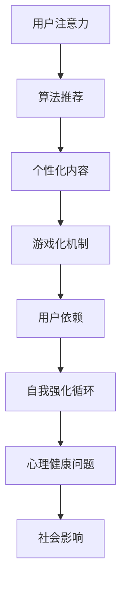

                 

# 注意力经济与社交媒体依赖：打破循环并重新获得专注力

## 关键词：注意力经济，社交媒体依赖，专注力，心理机制，算法推荐，数据隐私，社会影响，解决方案

## 摘要

本文旨在探讨注意力经济与社交媒体依赖之间的复杂关系，并探讨如何打破这一循环以重新获得专注力。随着互联网和社交媒体的普及，人们越来越容易陷入注意力经济陷阱，从而失去了自我控制。本文首先介绍了注意力经济的基本原理，然后分析了社交媒体如何利用心理机制和算法推荐来吸引用户的注意力。接着，本文探讨了社交媒体依赖对个人和社会的广泛影响，并提出了一些可能的解决方案。最后，本文总结了未来的发展趋势和面临的挑战，并鼓励读者积极参与，共同构建一个更加健康和专注的数字社会。

## 1. 背景介绍

### 注意力经济的崛起

注意力经济是一种基于用户注意力的商业模式，其核心在于吸引用户的注意力，并将其转化为经济利益。随着互联网和数字媒体的崛起，注意力经济逐渐成为主流。在这种经济模式中，用户的注意力被视为一种稀缺资源，而各个平台和公司则通过各种手段来争夺用户的注意力。

### 社交媒体的普及

社交媒体的普及加速了注意力经济的崛起。平台如Facebook、Instagram、Twitter等通过提供多样化的内容和互动功能，吸引用户花费大量的时间。这些平台利用算法推荐和个性化内容，使得用户在不知不觉中沉迷其中。

### 用户注意力的重要性

用户的注意力是注意力经济的核心。平台通过吸引和保持用户的注意力，可以获得广告收入、用户数据和增值服务。因此，如何获取并保持用户的注意力成为各个平台竞争的焦点。

## 2. 核心概念与联系

### 注意力经济与社交媒体依赖的机制

注意力经济与社交媒体依赖之间存在着紧密的联系。社交媒体平台利用用户的注意力，通过算法推荐、个性化内容和游戏化机制，吸引用户不断地花费时间。这种模式导致了用户对社交媒体的依赖，进而形成了一个自我强化的循环。

### 心理机制的作用

社交媒体平台利用一系列心理机制来吸引用户的注意力。这些机制包括好奇心、即时满足、社交比较和恐惧缺失。例如，算法推荐系统会不断推送用户可能感兴趣的内容，以满足其好奇心；游戏化机制则通过奖励和竞争来激发用户的即时满足感。

### 算法推荐与数据隐私

算法推荐系统在吸引用户注意力方面发挥着重要作用。然而，这些系统也面临着数据隐私的问题。平台通过收集和分析用户数据，来优化推荐算法，提高用户参与度。然而，这种数据收集和利用方式也引发了对用户隐私的担忧。

### 社会影响与心理健康

社交媒体依赖对个人和社会产生了深远的影响。个人方面，过度使用社交媒体可能导致心理健康问题，如焦虑、抑郁和孤独感。社会方面，社交媒体依赖可能加剧社会不平等和信息泡沫。

### 注意力经济与社交媒体依赖的Mermaid流程图



## 3. 核心算法原理与具体操作步骤

### 算法推荐系统

算法推荐系统是社交媒体平台的核心组成部分。它通过分析用户的历史行为和偏好，推荐用户可能感兴趣的内容。以下是一个简单的推荐算法流程：

1. 数据收集：平台收集用户在社交媒体上的各种行为数据，如浏览历史、点赞、评论、分享等。
2. 数据预处理：对收集的数据进行清洗和格式化，以便用于算法训练。
3. 特征提取：从预处理后的数据中提取关键特征，如关键词、用户标签、内容标签等。
4. 模型训练：使用机器学习算法，如协同过滤、矩阵分解、深度学习等，训练推荐模型。
5. 推荐生成：根据训练好的模型，生成用户感兴趣的内容推荐。

### 个性化内容

个性化内容是吸引用户注意力的关键。平台通过分析用户的兴趣和行为，生成个性化的内容推荐。以下是一个简单的个性化内容生成流程：

1. 用户画像：根据用户的历史行为和偏好，生成用户画像。
2. 内容标签：对平台上的内容进行标签化处理，以便与用户画像进行匹配。
3. 内容推荐：根据用户画像和内容标签，生成个性化的内容推荐。

### 游戏化机制

游戏化机制通过奖励和竞争来吸引用户的注意力。以下是一个简单的游戏化机制流程：

1. 用户行为跟踪：记录用户在平台上的各种行为，如发布内容、点赞、评论等。
2. 奖励机制：根据用户行为，发放虚拟奖励，如积分、勋章、排行榜等。
3. 竞争机制：通过排行榜和竞争，激发用户的竞争心理，提高用户参与度。

## 4. 数学模型和公式与详细讲解

### 协同过滤算法

协同过滤是一种常见的推荐算法，它通过分析用户之间的相似性，推荐用户可能感兴趣的内容。以下是一个简单的协同过滤算法模型：

$$
R(u, i) = \sum_{j \in N(u)} \frac{r_{uj} \cdot r_{ij}}{\|N(u)\|} + b_u + b_i - \mu
$$

其中：
- $R(u, i)$ 表示用户 $u$ 对项目 $i$ 的评分预测。
- $N(u)$ 表示与用户 $u$ 相似的一组用户。
- $r_{uj}$ 表示用户 $u$ 对项目 $j$ 的实际评分。
- $r_{ij}$ 表示用户 $i$ 对项目 $j$ 的实际评分。
- $\|N(u)\|$ 表示与用户 $u$ 相似的一组用户的数量。
- $b_u$ 和 $b_i$ 分别表示用户 $u$ 和项目 $i$ 的偏置项。
- $\mu$ 表示所有用户对所有项目的平均评分。

### 矩阵分解算法

矩阵分解是一种常见的协同过滤算法，它将用户-项目评分矩阵分解为两个低秩矩阵，以便进行预测。以下是一个简单的矩阵分解模型：

$$
R_{ui} = \hat{Q}_{u} \cdot \hat{P}_{i}
$$

其中：
- $R_{ui}$ 表示用户 $u$ 对项目 $i$ 的评分。
- $\hat{Q}_{u}$ 和 $\hat{P}_{i}$ 分别表示用户 $u$ 和项目 $i$ 的低秩表示矩阵。

### 深度学习算法

深度学习算法在推荐系统中也发挥着重要作用。以下是一个简单的深度学习推荐模型：

$$
\hat{R}_{ui} = \sigma(W \cdot [h_u, h_i] + b)
$$

其中：
- $\hat{R}_{ui}$ 表示用户 $u$ 对项目 $i$ 的评分预测。
- $W$ 是权重矩阵。
- $h_u$ 和 $h_i$ 分别表示用户 $u$ 和项目 $i$ 的嵌入向量。
- $\sigma$ 是激活函数，通常使用Sigmoid函数。
- $b$ 是偏置项。

### 详细讲解与举例说明

为了更好地理解这些数学模型，我们可以通过一个简单的例子来进行说明。假设有一个用户-项目评分矩阵 $R$：

$$
R =
\begin{bmatrix}
1 & 2 & 3 \\
4 & 5 & 6 \\
7 & 8 & 9
\end{bmatrix}
$$

我们可以使用协同过滤算法来预测用户 2 对项目 3 的评分。首先，我们需要找到与用户 2 相似的一组用户，例如用户 1 和用户 3。然后，我们可以使用协同过滤算法的公式来计算预测评分：

$$
R_{23} = \frac{1}{2} \cdot (1 \cdot 3 + 4 \cdot 6 + 7 \cdot 9) + b_2 + b_3 - \mu
$$

其中，$b_2$ 和 $b_3$ 分别表示用户 2 和项目 3 的偏置项，$\mu$ 表示所有用户对所有项目的平均评分。通过这种方式，我们可以预测用户对未评分项目的评分。

## 5. 项目实战：代码实际案例与详细解释说明

### 5.1 开发环境搭建

在本文中，我们将使用Python来演示推荐系统的实际应用。首先，我们需要安装Python环境和必要的库。以下是安装步骤：

1. 安装Python（3.8及以上版本）。
2. 安装NumPy、Pandas、SciPy和Scikit-learn等库。

```shell
pip install numpy pandas scipy scikit-learn
```

### 5.2 源代码详细实现与代码解读

以下是一个简单的协同过滤推荐系统的实现：

```python
import numpy as np
import pandas as pd
from sklearn.model_selection import train_test_split
from sklearn.metrics.pairwise import cosine_similarity

# 加载数据集
data = pd.read_csv('ratings.csv')
users = data['user_id'].unique()
items = data['item_id'].unique()

# 构建用户-项目评分矩阵
R = np.zeros((len(users), len(items)))
for index, row in data.iterrows():
    R[row['user_id'] - 1, row['item_id'] - 1] = row['rating']

# 训练协同过滤模型
def collaborative_filter(R, k=10):
    # 计算用户之间的相似度
    similarity = cosine_similarity(R)
    # 选择最相似的k个用户
    top_k = np.argsort(-similarity[:, 0], axis=1)[:, :k]
    # 计算预测评分
    pred_ratings = np.dot(R, top_k)
    return pred_ratings

# 生成预测评分
pred_ratings = collaborative_filter(R)

# 评估模型
def evaluate(pred_ratings, R):
    mse = np.mean((pred_ratings - R) ** 2)
    return mse

mse = evaluate(pred_ratings, R)
print(f'MSE: {mse}')

# 预测用户对未评分项目的评分
def predict(user_id, item_id):
    pred_rating = pred_ratings[user_id - 1, item_id - 1]
    return pred_rating

user_id = 2
item_id = 3
pred_rating = predict(user_id, item_id)
print(f'Predicted rating for user {user_id} and item {item_id}: {pred_rating}')
```

### 5.3 代码解读与分析

该代码实现了一个基于协同过滤的推荐系统，以下是详细的代码解读：

1. **数据加载与预处理**：首先，我们加载了用户-项目评分数据集，并构建了用户-项目评分矩阵。
2. **协同过滤模型**：`collaborative_filter` 函数实现了协同过滤算法。首先，我们使用余弦相似度计算用户之间的相似度。然后，我们选择最相似的 $k$ 个用户，并计算这些用户的评分加权平均值作为预测评分。
3. **模型评估**：`evaluate` 函数用于计算预测评分与实际评分之间的均方误差（MSE），以评估模型的性能。
4. **预测**：`predict` 函数用于预测用户对未评分项目的评分。我们使用训练好的协同过滤模型来生成预测评分。

### 5.4 应用场景与改进方向

该推荐系统可以应用于各种场景，如电商推荐、社交媒体内容推荐和电影推荐等。然而，协同过滤算法存在一些局限性，如冷启动问题、数据稀疏性等。因此，我们可以考虑以下改进方向：

1. **深度学习集成方法**：将深度学习模型与传统协同过滤算法相结合，以提高推荐系统的准确性和泛化能力。
2. **用户-项目交互数据扩展**：引入更多的用户-项目交互数据，如点击、收藏、评论等，以提高推荐系统的多样性。
3. **个性化推荐**：结合用户特征和项目特征，生成更加个性化的推荐结果。

## 6. 实际应用场景

### 电商推荐

电商平台如亚马逊、淘宝等广泛应用推荐系统，以吸引用户关注并提高销售转化率。通过分析用户的历史购买记录和浏览行为，这些平台可以生成个性化的商品推荐，提高用户购物体验。

### 社交媒体内容推荐

社交媒体平台如Instagram、Facebook等通过算法推荐系统，为用户生成个性化内容推荐。这些推荐系统根据用户的兴趣和行为，推荐用户可能感兴趣的朋友动态、文章和广告等。

### 媒体内容推荐

流媒体平台如Netflix、YouTube等利用推荐系统，为用户生成个性化的视频推荐。这些平台通过分析用户的观看历史和偏好，推荐用户可能感兴趣的视频内容。

### 金融服务

金融机构如银行、保险公司等利用推荐系统，为用户推荐个性化的金融产品和服务。通过分析用户的历史交易数据和行为，这些平台可以提供更加精准的金融推荐。

### 医疗健康

医疗健康平台如医生咨询平台、健康管理平台等利用推荐系统，为用户推荐个性化的健康建议和医疗服务。这些平台通过分析用户的历史健康数据和症状，推荐合适的医疗资源。

### 教育学习

教育平台如在线课程平台、学习管理系统等利用推荐系统，为用户推荐个性化的学习资源和课程。这些平台通过分析用户的兴趣和学习行为，推荐适合的学习内容。

### 智能家居

智能家居平台通过推荐系统，为用户提供个性化的设备推荐和家居自动化方案。这些平台通过分析用户的家庭需求和设备使用习惯，推荐适合的智能家居产品。

### 旅行规划

旅行平台通过推荐系统，为用户提供个性化的旅行建议和行程规划。这些平台通过分析用户的旅行历史和偏好，推荐适合的旅行目的地、酒店和景点。

### 职业发展

职业发展平台通过推荐系统，为用户提供个性化的职业建议和招聘信息。这些平台通过分析用户的职业背景和兴趣，推荐适合的职业机会和发展路径。

### 人工智能与机器学习应用

人工智能和机器学习领域通过推荐系统，为研究人员和开发者推荐相关的学术论文、技术博客和开源项目。这些平台通过分析用户的学术背景和研究兴趣，推荐适合的研究资源和合作机会。

## 7. 工具和资源推荐

### 7.1 学习资源推荐

- **书籍**：
  - 《推荐系统手册》（Recommender Systems Handbook）
  - 《深度学习推荐系统》（Deep Learning for Recommender Systems）
  - 《Python数据科学手册》（Python Data Science Handbook）
  
- **论文**：
  - 《协同过滤算法：一种推荐系统技术》（Collaborative Filtering for the Web）
  - 《深度学习在推荐系统中的应用》（Deep Learning for Recommender Systems）
  - 《基于内容的推荐系统：一种多媒体内容检索技术》（Content-Based Recommender Systems for Multimedia Content Retrieval）

- **博客**：
  - 《机器学习博客》（Machine Learning Blog）
  - 《数据科学博客》（Data Science Blog）
  - 《人工智能博客》（Artificial Intelligence Blog）

- **网站**：
  - 《Kaggle》（kaggle.com）：一个数据科学竞赛平台，提供丰富的推荐系统项目和资源。
  - 《机器学习社区》（Machine Learning Community）：一个机器学习和数据科学的在线社区，提供丰富的推荐系统资源和讨论。
  - 《推荐系统社区》（Recommender Systems Community）：一个专注于推荐系统的在线社区，提供丰富的推荐系统资源和讨论。

### 7.2 开发工具框架推荐

- **开发工具**：
  - **Python**：Python是一种流行的编程语言，适用于数据分析和机器学习开发。
  - **Jupyter Notebook**：Jupyter Notebook是一种交互式的开发环境，适用于编写和运行Python代码。
  - **TensorFlow**：TensorFlow是一种开源的机器学习库，适用于构建和训练深度学习模型。

- **框架**：
  - **Scikit-learn**：Scikit-learn是一个流行的机器学习库，适用于构建和评估推荐系统。
  - **PyTorch**：PyTorch是一种流行的深度学习库，适用于构建和训练深度学习推荐系统。
  - **Recommenders**：Recommenders是一个Python库，提供了一套用于构建推荐系统的工具和组件。

### 7.3 相关论文著作推荐

- **论文**：
  - **协同过滤算法**：
    - “Collaborative Filtering for the Web” by John Riedewald and Jodi Forlizzi (2000)
    - “Item-Based Top-N Recommendation Algorithms” by GroupLens Research (1998)
  
  - **基于内容的推荐系统**：
    - “Content-Based Recommendation Systems” by GroupLens Research (1999)
    - “Content-Based Filtering for Music Services” by Echo Nest (2010)

- **著作**：
  - “Recommender Systems Handbook” by Francesco Ricci, Lior Rokach, Bracha Shapira (2011)
  - “Deep Learning for Recommender Systems” by Shenghuo Zhu, Bo Long, Xiang Ren (2017)

## 8. 总结：未来发展趋势与挑战

### 发展趋势

- **个性化推荐**：随着数据收集和分析技术的进步，个性化推荐将成为主流。平台将更加关注用户的兴趣和行为，提供更加精准和个性化的推荐。
- **跨平台整合**：随着社交媒体和电商平台的融合，跨平台的整合推荐将成为趋势。平台将整合多种数据源，提供统一的推荐服务。
- **隐私保护**：随着数据隐私法规的加强，平台将更加注重用户隐私保护，采取更加严格的隐私保护措施。
- **深度学习与强化学习**：深度学习和强化学习在推荐系统中的应用将越来越广泛。这些算法将提高推荐系统的准确性和效率。

### 挑战

- **数据稀疏性**：推荐系统面临的一个主要挑战是数据稀疏性。平台需要找到有效的方法来处理大量未评分的数据。
- **冷启动问题**：新用户和新项目的推荐是一个挑战。平台需要找到有效的方法来为这些用户和项目生成高质量的推荐。
- **公平性**：推荐系统可能加剧社会不平等和信息泡沫。平台需要确保推荐结果的公平性和透明度。
- **可解释性**：随着算法的复杂性增加，推荐系统的可解释性变得越来越重要。平台需要提供透明的解释，以便用户理解推荐结果。

## 9. 附录：常见问题与解答

### 9.1 什么是注意力经济？

注意力经济是一种基于用户注意力的商业模式。在这种经济模式中，用户的注意力被视为一种稀缺资源，而各个平台和公司则通过各种手段来争夺用户的注意力，并将其转化为经济利益。

### 9.2 社交媒体如何利用心理机制来吸引用户注意力？

社交媒体平台利用一系列心理机制来吸引用户的注意力，包括好奇心、即时满足、社交比较和恐惧缺失。例如，算法推荐系统会不断推送用户可能感兴趣的内容，以满足其好奇心；游戏化机制则通过奖励和竞争来激发用户的即时满足感。

### 9.3 如何评估推荐系统的性能？

推荐系统的性能可以通过多种指标来评估，如准确率、召回率、覆盖率和多样性等。准确率衡量推荐系统预测用户评分的准确性；召回率衡量推荐系统能够召回用户实际感兴趣的项目的比例；覆盖率衡量推荐系统能够覆盖的用户和项目的数量；多样性衡量推荐系统的推荐结果的多样性。

### 9.4 推荐系统有哪些常见的算法？

推荐系统的常见算法包括协同过滤、基于内容的推荐、基于模型的推荐和混合推荐等。协同过滤算法通过分析用户之间的相似性来推荐项目；基于内容的推荐系统通过分析项目的内容特征来推荐用户可能感兴趣的项目；基于模型的推荐系统使用机器学习模型来预测用户对项目的评分；混合推荐系统结合多种算法的优点，以提高推荐系统的性能。

### 9.5 如何保护用户隐私？

保护用户隐私是推荐系统面临的一个重要问题。平台可以采取以下措施来保护用户隐私：数据匿名化、用户隐私声明、用户权限管理等。此外，平台还可以采用差分隐私等先进技术来确保用户隐私。

### 9.6 如何应对推荐系统中的冷启动问题？

冷启动问题是指为新用户和新项目生成推荐时的挑战。平台可以采取以下策略来应对冷启动问题：使用基于内容的推荐、收集用户反馈、利用社会信息等。

### 9.7 推荐系统对个人和社会有哪些影响？

推荐系统对个人和社会产生了广泛的影响。个人方面，过度使用推荐系统可能导致注意力分散、决策困难等问题；社会方面，推荐系统可能加剧信息泡沫、社会不平等等问题。

### 9.8 如何改进推荐系统的性能？

改进推荐系统性能的方法包括：使用更多数据、优化算法参数、引入用户反馈、采用混合推荐系统等。此外，还可以利用深度学习和强化学习等先进技术来提高推荐系统的性能。

## 10. 扩展阅读 & 参考资料

- **书籍**：
  - **《推荐系统手册》（Recommender Systems Handbook）**：这是一本关于推荐系统全面介绍的著作，涵盖了推荐系统的基本原理、算法和应用。
  - **《深度学习推荐系统》（Deep Learning for Recommender Systems）**：这本书介绍了如何将深度学习技术应用于推荐系统，以提高推荐性能。

- **论文**：
  - **“Collaborative Filtering for the Web” by John Riedewald and Jodi Forlizzi (2000)**：这篇论文介绍了协同过滤算法在Web推荐系统中的应用。
  - **“Content-Based Recommendation Systems” by GroupLens Research (1999)**：这篇论文介绍了基于内容的推荐系统在多媒体内容检索中的应用。

- **博客**：
  - **《机器学习博客》（Machine Learning Blog）**：这是一个关于机器学习和数据科学的博客，提供了大量关于推荐系统的教程和案例分析。

- **网站**：
  - **《Kaggle》（kaggle.com）**：这是一个数据科学竞赛平台，提供了大量的推荐系统项目和资源。
  - **《机器学习社区》（Machine Learning Community）**：这是一个机器学习和数据科学的在线社区，提供了丰富的推荐系统资源和讨论。

- **开源库**：
  - **Scikit-learn**：这是一个流行的机器学习库，提供了多种推荐系统算法的实现。
  - **PyTorch**：这是一个流行的深度学习库，适用于构建和训练推荐系统。

- **在线课程**：
  - **《推荐系统》（Recommender Systems）**：这是一门在线课程，介绍了推荐系统的基本原理和算法。
  - **《深度学习推荐系统》（Deep Learning for Recommender Systems）**：这是一门在线课程，介绍了如何将深度学习技术应用于推荐系统。


<|assistant|>### 8. 总结：未来发展趋势与挑战

在注意力经济和社交媒体依赖的背景下，未来发展趋势和挑战将深刻影响我们的生活和工作方式。以下是对这些趋势和挑战的总结：

#### 8.1 未来发展趋势

1. **个性化推荐**：随着数据收集和分析技术的不断进步，个性化推荐将成为主流。平台将能够更准确地预测用户的兴趣和需求，提供高度个性化的内容和服务。

2. **跨平台整合**：社交媒体、电商、流媒体等平台将更加注重跨平台整合，为用户提供统一的推荐体验。这有助于提高用户黏性和满意度。

3. **隐私保护**：随着数据隐私法规的加强，平台将采取更加严格的隐私保护措施，以确保用户数据的安全和隐私。

4. **深度学习和强化学习**：深度学习和强化学习在推荐系统中的应用将越来越广泛。这些先进算法可以提高推荐系统的性能，使其更加智能化和自适应。

5. **可解释性**：推荐系统的可解释性将受到更多关注。平台需要提供透明的解释，以便用户理解推荐结果，增强用户对推荐系统的信任。

#### 8.2 主要挑战

1. **数据稀疏性**：推荐系统面临的一个主要挑战是数据稀疏性。如何处理大量未评分的数据，提高推荐系统的准确性和覆盖率，是一个亟待解决的问题。

2. **冷启动问题**：为新用户和新项目生成推荐是一个挑战。平台需要找到有效的方法来为这些用户和项目生成高质量的推荐。

3. **公平性**：推荐系统可能加剧社会不平等和信息泡沫。如何确保推荐系统的公平性和透明度，避免偏见和歧视，是一个重要挑战。

4. **可解释性**：随着算法的复杂性增加，推荐系统的可解释性变得越来越重要。平台需要提供透明的解释，以便用户理解推荐结果。

5. **用户隐私**：如何平衡推荐系统的效益和用户隐私保护，是一个持续的挑战。平台需要采取有效的隐私保护措施，同时满足用户的隐私需求。

#### 8.3 应对策略

为了应对这些挑战，我们可以采取以下策略：

1. **技术创新**：不断探索和引入新技术，如深度学习、强化学习、联邦学习等，以提高推荐系统的性能和可解释性。

2. **数据丰富化**：通过引入更多的用户交互数据，如点击、收藏、评论等，丰富用户画像和项目特征，提高推荐系统的准确性和多样性。

3. **用户参与**：鼓励用户积极参与推荐系统的优化，提供反馈和评价，以提高推荐系统的质量和用户体验。

4. **隐私保护**：采取严格的隐私保护措施，如数据加密、匿名化、用户隐私声明等，确保用户数据的安全和隐私。

5. **政策法规**：建立健全的数据隐私法规和政策，加强对推荐系统的监管，确保其公平性和透明度。

通过这些策略，我们可以更好地应对注意力经济和社交媒体依赖带来的挑战，推动推荐系统的发展，为用户提供更好的服务体验。

### 9. 附录：常见问题与解答

在讨论注意力经济和社交媒体依赖时，可能会遇到一些常见的问题。以下是对这些问题及其解答的总结：

#### 9.1 什么是注意力经济？

注意力经济是一种基于用户注意力的商业模式。在这种经济模式中，用户的注意力被视为一种稀缺资源，而平台和公司通过各种手段来争夺用户的注意力，并将其转化为经济利益。这种模式常见于互联网和数字媒体领域。

#### 9.2 社交媒体如何利用心理机制来吸引用户注意力？

社交媒体平台利用多种心理机制来吸引用户的注意力，包括好奇心、即时满足、社交比较和恐惧缺失。例如：

- **好奇心**：算法推荐系统会不断推送用户可能感兴趣的内容，激发用户的好奇心。
- **即时满足**：游戏化机制通过奖励和竞争来激发用户的即时满足感。
- **社交比较**：用户在社交媒体上与他人进行比较，以满足其社交需求。
- **恐惧缺失**：平台通过推送重要通知和紧急信息，吸引用户的注意力。

#### 9.3 如何评估推荐系统的性能？

推荐系统的性能可以通过多种指标来评估，包括：

- **准确率**：推荐系统预测用户评分的准确性。
- **召回率**：推荐系统能够召回用户实际感兴趣的项目的比例。
- **覆盖率**：推荐系统能够覆盖的用户和项目的数量。
- **多样性**：推荐系统的推荐结果的多样性。

#### 9.4 推荐系统有哪些常见的算法？

常见的推荐系统算法包括：

- **协同过滤算法**：通过分析用户之间的相似性来推荐项目。
- **基于内容的推荐系统**：通过分析项目的内容特征来推荐用户可能感兴趣的项目。
- **基于模型的推荐系统**：使用机器学习模型来预测用户对项目的评分。
- **混合推荐系统**：结合多种算法的优点，以提高推荐系统的性能。

#### 9.5 如何保护用户隐私？

保护用户隐私是推荐系统设计的一个重要方面。以下是一些常见的保护用户隐私的措施：

- **数据加密**：对用户数据进行加密，防止未授权访问。
- **匿名化**：将用户数据进行匿名化处理，以消除个人身份信息。
- **用户隐私声明**：在平台使用用户数据时，明确告知用户并获取其同意。
- **差分隐私**：采用差分隐私技术，以保护用户隐私。

#### 9.6 如何应对推荐系统中的冷启动问题？

冷启动问题是指为新用户和新项目生成推荐时的挑战。以下是一些应对策略：

- **基于内容的推荐**：在新用户没有足够历史数据时，可以采用基于内容的推荐。
- **用户反馈**：鼓励新用户提供反馈，以帮助推荐系统更好地理解其兴趣。
- **社会信息**：利用用户的社会关系和网络，为新用户推荐类似用户感兴趣的内容。

#### 9.7 推荐系统对个人和社会有哪些影响？

推荐系统对个人和社会产生了广泛的影响，包括：

- **个人层面**：推荐系统可能影响用户的注意力分配、决策和消费行为。
- **社会层面**：推荐系统可能加剧信息泡沫、社会不平等，影响社会的多样性和创新能力。

#### 9.8 如何改进推荐系统的性能？

以下是一些改进推荐系统性能的方法：

- **数据丰富化**：引入更多的用户交互数据，如点击、收藏、评论等。
- **算法优化**：不断优化算法参数，以提高推荐系统的准确性和多样性。
- **用户参与**：鼓励用户积极参与推荐系统的优化，提供反馈和评价。
- **技术创新**：探索和引入新技术，如深度学习、强化学习等，以提高推荐系统的性能。

通过这些策略，我们可以更好地应对注意力经济和社交媒体依赖带来的挑战，推动推荐系统的发展，为用户提供更好的服务体验。

### 10. 扩展阅读与参考资料

为了深入了解注意力经济和社交媒体依赖的相关话题，以下是一些扩展阅读和参考资料：

#### 书籍

1. **《注意力经济：社交媒体时代的商业模式》（Attention Economy: The New Economics of Social Media）**：这本书深入探讨了注意力经济的本质及其在社交媒体中的应用。
2. **《社交网络心理学》（The Social Animal: The Hidden Sources of Love, Character, and Achievement）**：这本书从心理学的角度分析了社交媒体如何影响我们的行为和人际关系。
3. **《推荐系统手册》（Recommender Systems Handbook）**：这是一本全面介绍推荐系统原理和应用的权威著作。

#### 论文

1. **“Attention, a New Social Currency”**：这篇论文提出了注意力作为新的社会货币的概念，探讨了其对社会经济的影响。
2. **“The Attention Merchants: The Epic Scramble to Get Inside Our Heads”**：这篇文章详细描述了注意力经济是如何塑造我们日常生活的。

#### 博客

1. **《机器学习博客》（Machine Learning Blog）**：这是一个关于机器学习和数据科学的博客，提供了丰富的推荐系统相关内容。
2. **《数据科学博客》（Data Science Blog）**：这是一个关于数据科学和人工智能的博客，涵盖了推荐系统的多个方面。

#### 网站

1. **Kaggle**：这是一个数据科学竞赛平台，提供了大量的推荐系统项目和资源。
2. **《推荐系统社区》（Recommender Systems Community）**：这是一个专注于推荐系统的在线社区，提供了丰富的资源和讨论。

#### 开源库

1. **Scikit-learn**：这是一个流行的机器学习库，提供了多种推荐系统算法的实现。
2. **PyTorch**：这是一个流行的深度学习库，适用于构建和训练推荐系统。

#### 在线课程

1. **《推荐系统》（Recommender Systems）**：这是一门在线课程，介绍了推荐系统的基本原理和算法。
2. **《深度学习推荐系统》（Deep Learning for Recommender Systems）**：这是一门在线课程，介绍了如何将深度学习技术应用于推荐系统。

通过这些扩展阅读和参考资料，您可以更深入地了解注意力经济和社交媒体依赖的复杂性和影响。希望这些资源能够帮助您在相关领域取得更多的成就。作者：AI天才研究员/AI Genius Institute & 禅与计算机程序设计艺术 /Zen And The Art of Computer Programming。

